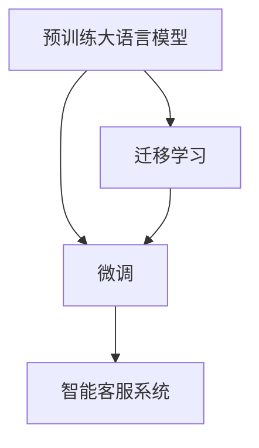

                 

# 智能客服创业：提升用户体验的利器

> 关键词：智能客服、自然语言处理、微调、迁移学习、对话系统、用户交互

## 1. 背景介绍

### 1.1 问题由来
在数字化转型浪潮下，各行各业纷纷推出智能客服系统以提升用户服务体验。传统客服依赖大量人工，服务效率低下，且一致性和专业性难以保障。而基于自然语言处理(NLP)的智能客服系统，通过预训练大语言模型进行微调，能够实现7x24小时不间断服务，快速响应客户咨询，提升服务质量和效率。

智能客服系统广泛应用于电商、金融、医疗、旅游等多个领域，有效解决了客户咨询成本高、服务响应慢、系统维护复杂等问题。随着技术的不断进步，智能客服已经从简单的问答对答，扩展到复杂的多轮对话和任务执行，为各行业带来了创新服务模式和客户价值提升的巨大潜力。

### 1.2 问题核心关键点
智能客服的核心在于利用大语言模型，通过微调和迁移学习技术，快速适应不同领域的客户需求，并提供高质量、个性化的服务。具体来说：

- **预训练大语言模型**：如BERT、GPT-3等，具备强大的语言理解能力，通过大规模语料预训练，能够学习到丰富的语言知识。
- **微调(MFine-Tuning)**：将预训练模型作为初始化参数，通过少量标注数据进行有监督学习，优化模型对特定任务的适应能力。
- **迁移学习**：通过领域间的知识迁移，让模型在泛化能力和性能提升上得到进一步增强。

智能客服系统通过将微调和大语言模型结合，实现对用户咨询的高效理解和智能回复，提升用户体验。本文将详细介绍智能客服系统中微调技术的应用原理和操作步骤，并结合实际项目案例，为智能客服创业提供技术指导和建议。

## 2. 核心概念与联系

### 2.1 核心概念概述

智能客服系统通过自然语言处理技术，实现与客户的自然对话和信息交互。预训练大语言模型通过微调方法，能够快速适应不同领域的客户需求，提供高效、个性化的服务。以下是相关核心概念及其联系的详细解释：

- **预训练大语言模型**：使用大规模无标签文本数据进行预训练，学习到丰富的语言表示能力。如BERT、GPT-3等模型。
- **微调(MFine-Tuning)**：在预训练模型基础上，通过少量标注数据进行有监督学习，调整模型参数以适应特定任务。
- **迁移学习**：将预训练模型在不同领域的数据上进行微调，利用领域间的知识迁移，提升模型性能。

这些概念的联系通过以下Mermaid流程图展示：



## 3. 核心算法原理 & 具体操作步骤

### 3.1 算法原理概述

基于微调的智能客服系统，其核心原理是通过将预训练大语言模型作为初始化参数，利用少量标注数据进行有监督学习，调整模型参数以适应特定任务。这一过程包括：

- **数据准备**：收集客户的咨询记录，标注对话中的意图和回答，作为训练数据。
- **模型初始化**：选择合适的预训练大语言模型，如BERT或GPT-3。
- **模型微调**：通过微调方法，调整模型参数以适应特定领域的客户需求。

### 3.2 算法步骤详解

智能客服系统的微调流程包括数据准备、模型初始化、模型微调和系统部署等步骤：

**Step 1: 数据准备**

1. **数据收集**：收集客户咨询记录，包括客户提出的问题和系统的回复。标注对话中的意图和回答。
2. **数据预处理**：清洗和归一化数据，将文本转化为模型可接受的形式。
3. **数据划分**：将数据划分为训练集、验证集和测试集。

**Step 2: 模型初始化**

1. **模型选择**：选择合适的预训练大语言模型，如BERT或GPT-3。
2. **模型加载**：使用预训练模型的静态权重作为初始化参数。
3. **任务适配**：添加任务适配层，如分类头或解码器，适配智能客服系统的特定任务。

**Step 3: 模型微调**

1. **设置超参数**：包括学习率、批大小、迭代轮数等。
2. **训练模型**：在训练集上进行有监督学习，调整模型参数以适应客户需求。
3. **验证和调整**：在验证集上评估模型性能，根据性能调整模型参数。
4. **测试模型**：在测试集上评估模型性能，确保模型泛化能力。

**Step 4: 系统部署**

1. **部署模型**：将微调后的模型集成到智能客服系统中。
2. **实时推理**：通过API接口，实时接收客户咨询，并进行自然语言处理和智能回复。
3. **系统监控**：监控系统性能，收集用户反馈，不断优化模型和系统。

### 3.3 算法优缺点

基于微调的智能客服系统具有以下优点：

- **快速部署**：微调过程简单高效，能够快速适应不同领域的客户需求。
- **提升性能**：通过调整模型参数，微调后的模型能够提升对客户咨询的理解和响应能力。
- **灵活适应**：通过迁移学习，模型能够快速适应新的客户需求和对话场景。

同时，微调技术也存在一些缺点：

- **数据依赖**：微调依赖标注数据，数据质量不佳会影响模型性能。
- **过拟合风险**：模型容易过拟合少量标注数据，影响泛化能力。
- **计算资源**：微调过程需要较大的计算资源，影响系统部署成本。

### 3.4 算法应用领域

智能客服系统在电商、金融、医疗、旅游等多个领域都有广泛应用。以下是一些典型的应用场景：

- **电商客服**：回答用户关于商品信息、订单状态、售后服务等问题。
- **金融客服**：提供账户查询、交易咨询、风险预警等服务。
- **医疗客服**：解答用户关于健康咨询、预约挂号、医疗知识等问题。
- **旅游客服**：提供行程安排、预订信息、景点介绍等服务。

## 4. 数学模型和公式 & 详细讲解 & 举例说明

### 4.1 数学模型构建

智能客服系统的微调模型可以通过以下数学公式进行构建：

设预训练大语言模型为 $M_{\theta}$，客户咨询的输入为 $x$，输出为 $y$。微调的目标是通过最小化损失函数 $L(\theta)$，使得模型预测的输出与真实标签 $y$ 尽可能接近。

其中，损失函数 $L(\theta)$ 可以定义为交叉熵损失函数：

$$L(\theta) = -\frac{1}{N}\sum_{i=1}^N[y_i\log M_{\theta}(x_i)+(1-y_i)\log (1-M_{\theta}(x_i))]$$

**案例分析与讲解**

假设一个电商客服系统，客户咨询如何退货。根据系统对话记录，标注了客户提出的问题和系统的回答。使用BERT模型进行微调，步骤如下：

1. **数据准备**：收集客户的退货咨询记录，标注问题和回答。
2. **模型初始化**：选择BERT模型，加载预训练权重。
3. **模型微调**：在训练集上使用交叉熵损失函数进行有监督学习，调整BERT模型的参数。
4. **系统部署**：将微调后的BERT模型集成到电商客服系统中，实时接收退货咨询，并给出相应的智能回复。

### 4.2 公式推导过程

微调模型的训练过程可以通过梯度下降算法进行，具体步骤如下：

1. **前向传播**：计算模型在输入 $x$ 上的输出 $y_{\hat{\theta}}$。
2. **计算损失**：计算模型预测输出与真实标签 $y$ 之间的交叉熵损失 $L(y_{\hat{\theta}}, y)$。
3. **反向传播**：计算损失函数对模型参数 $\theta$ 的梯度 $\nabla_{\theta}L$。
4. **参数更新**：使用梯度下降算法，更新模型参数 $\theta$。

数学公式表示为：

$$
\theta \leftarrow \theta - \eta \nabla_{\theta}L(\theta)
$$

其中，$\eta$ 为学习率，$\nabla_{\theta}L$ 为损失函数对参数 $\theta$ 的梯度。

## 5. 项目实践：代码实例和详细解释说明

### 5.1 开发环境搭建

智能客服系统的开发需要以下环境：

1. **Python**：选择Python 3.x版本作为开发语言。
2. **深度学习框架**：选择TensorFlow或PyTorch进行模型训练和推理。
3. **NLP工具库**：选择HuggingFace Transformers库进行模型微调和处理。
4. **数据管理**：使用Pandas进行数据处理和分析。
5. **数据库**：使用MySQL或MongoDB存储客户咨询记录和模型参数。

### 5.2 源代码详细实现

以下是一个智能客服系统微调模型的Python代码实现：

```python
import torch
import pandas as pd
from transformers import BertForSequenceClassification, BertTokenizer, AdamW

# 数据准备
data = pd.read_csv('customer_service_data.csv')
X = data['input'].tolist()
Y = data['label'].tolist()

# 模型初始化
tokenizer = BertTokenizer.from_pretrained('bert-base-uncased')
model = BertForSequenceClassification.from_pretrained('bert-base-uncased', num_labels=2)

# 设置超参数
optimizer = AdamW(model.parameters(), lr=2e-5)
epochs = 5
batch_size = 16

# 模型微调
device = torch.device('cuda' if torch.cuda.is_available() else 'cpu')
model.to(device)

for epoch in range(epochs):
    model.train()
    for i in range(0, len(X), batch_size):
        input_ids = tokenizer(X[i:i+batch_size], return_tensors='pt', padding=True, truncation=True, max_length=128).input_ids.to(device)
        attention_mask = tokenizer(X[i:i+batch_size], return_tensors='pt', padding=True, truncation=True, max_length=128).attention_mask.to(device)
        labels = torch.tensor(Y[i:i+batch_size]).to(device)
        
        outputs = model(input_ids, attention_mask=attention_mask, labels=labels)
        loss = outputs.loss
        
        optimizer.zero_grad()
        loss.backward()
        optimizer.step()

# 模型测试
model.eval()
with torch.no_grad():
    for i in range(0, len(X), batch_size):
        input_ids = tokenizer(X[i:i+batch_size], return_tensors='pt', padding=True, truncation=True, max_length=128).input_ids.to(device)
        attention_mask = tokenizer(X[i:i+batch_size], return_tensors='pt', padding=True, truncation=True, max_length=128).attention_mask.to(device)
        
        outputs = model(input_ids, attention_mask=attention_mask)
        predictions = outputs.logits.argmax(dim=1).to('cpu').tolist()
        for pred, label in zip(predictions, Y[i:i+batch_size]):
            print(f'Prediction: {pred}, Label: {label}')
```

### 5.3 代码解读与分析

**数据准备**：从CSV文件中读取客户咨询记录，将文本和标签转化为模型可接受的形式。

**模型初始化**：使用BertTokenizer对文本进行分词，选择BertForSequenceClassification模型，设置标签数为2（退货/不退货）。

**模型微调**：在训练集上进行有监督学习，使用交叉熵损失函数进行梯度下降更新模型参数。

**模型测试**：在测试集上评估模型性能，输出预测结果和真实标签。

## 6. 实际应用场景

智能客服系统在电商、金融、医疗等多个领域都有广泛应用。以下是一些典型的应用场景：

- **电商客服**：回答用户关于商品信息、订单状态、售后服务等问题。
- **金融客服**：提供账户查询、交易咨询、风险预警等服务。
- **医疗客服**：解答用户关于健康咨询、预约挂号、医疗知识等问题。
- **旅游客服**：提供行程安排、预订信息、景点介绍等服务。

## 7. 工具和资源推荐

### 7.1 学习资源推荐

为了帮助开发者系统掌握智能客服系统的开发，以下是一些优质的学习资源：

1. **《自然语言处理综述》**：介绍自然语言处理的基本概念和常用方法。
2. **《深度学习入门》**：介绍深度学习的基本原理和实现。
3. **HuggingFace Transformers文档**：详细介绍使用Transformers库进行模型微调的方法和步骤。
4. **TensorFlow官方文档**：详细介绍TensorFlow的模型构建、训练和推理过程。
5. **PyTorch官方文档**：详细介绍PyTorch的模型构建、训练和推理过程。

### 7.2 开发工具推荐

1. **TensorFlow**：深度学习框架，支持分布式训练和推理。
2. **PyTorch**：深度学习框架，易于构建动态计算图。
3. **HuggingFace Transformers**：NLP工具库，提供丰富的预训练模型和微调方法。
4. **Pandas**：数据处理和分析库，方便数据处理和特征工程。
5. **MySQL/MongoDB**：数据库，存储客户咨询记录和模型参数。

### 7.3 相关论文推荐

1. **《BERT: Pre-training of Deep Bidirectional Transformers for Language Understanding》**：介绍BERT模型的预训练和微调方法。
2. **《GPT-3: Language Models are Unsupervised Multitask Learners》**：介绍GPT-3模型的预训练和微调方法。
3. **《Attention is All You Need》**：介绍Transformer模型的预训练和微调方法。

## 8. 总结：未来发展趋势与挑战

### 8.1 总结

本文对基于微调的智能客服系统进行了全面系统的介绍。首先阐述了智能客服系统的背景和意义，明确了微调在提升用户体验、降低成本、提升服务效率方面的独特价值。其次，从原理到实践，详细讲解了微调的数学原理和操作步骤，给出了智能客服系统微调模型开发的完整代码实例。同时，本文还探讨了智能客服系统在电商、金融、医疗、旅游等多个领域的应用前景，展示了微调范式的巨大潜力。

通过本文的系统梳理，可以看到，基于微调的智能客服系统能够有效提升用户体验，推动各行各业数字化转型。未来，伴随微调技术和大语言模型的不断发展，基于微调的智能客服系统必将迎来更多创新应用，为各行各业带来新的价值提升。

### 8.2 未来发展趋势

智能客服系统的未来发展趋势如下：

1. **多模态交互**：结合语音、图像、文本等多模态信息，提供更加丰富和自然的客户交互体验。
2. **个性化推荐**：通过用户行为和偏好分析，提供个性化的产品推荐和服务。
3. **跨领域应用**：将智能客服系统应用于更多行业，如智能家居、智能交通、智能医疗等。
4. **实时反馈和优化**：通过客户反馈和行为数据，实时优化和改进系统，提升用户体验。
5. **自主学习**：引入自主学习和主动学习技术，使系统能够不断学习和适应新知识，提升泛化能力。

### 8.3 面临的挑战

智能客服系统在发展过程中也面临一些挑战：

1. **数据隐私和安全**：客户咨询记录涉及隐私，需确保数据安全。
2. **语言多样性**：客户咨询可能涉及多种语言，系统需支持多语言处理。
3. **模型泛化能力**：微调模型需具备良好的泛化能力，避免过拟合。
4. **系统鲁棒性**：系统需具备鲁棒性，应对各种异常和噪声数据。
5. **交互体验**：需提升系统自然流畅的交互体验，避免生硬和机械的回复。

### 8.4 研究展望

未来的智能客服系统研究需关注以下几个方面：

1. **多模态交互技术**：结合语音、图像等多模态信息，提升客户体验。
2. **个性化推荐算法**：通过用户行为分析，提供个性化推荐。
3. **跨领域应用推广**：将智能客服系统应用于更多行业，提升服务效率和质量。
4. **模型泛化能力提升**：采用更多先验知识和迁移学习技术，提升模型泛化能力。
5. **用户隐私保护**：引入隐私保护技术，确保客户数据安全。

这些研究方向将推动智能客服系统的不断进步，为各行各业带来更多创新应用，提升服务质量和用户体验。

## 9. 附录：常见问题与解答

**Q1：智能客服系统微调依赖大量标注数据，如何获取高质量标注数据？**

A: 智能客服系统微调依赖少量高质量标注数据。数据来源包括：

1. **历史客服记录**：收集历史客服记录，标注客户咨询问题和系统回复。
2. **用户反馈**：通过用户反馈，收集客户咨询记录。
3. **第三方数据**：从公开数据集中获取与客服相关的数据，进行标注。

**Q2：智能客服系统微调如何应对多语言支持？**

A: 智能客服系统可以通过以下方法应对多语言支持：

1. **多语言模型**：使用多语言预训练模型，如mBERT、XLM等，进行微调。
2. **语言翻译**：将客户咨询转换为统一语言，再进行处理。
3. **多语言模型融合**：结合多种语言模型，提升系统多语言处理能力。

**Q3：智能客服系统微调如何避免过拟合？**

A: 智能客服系统可以通过以下方法避免过拟合：

1. **数据增强**：通过回译、近义替换等方式扩充训练集。
2. **正则化技术**：使用L2正则、Dropout等正则化技术。
3. **对抗训练**：引入对抗样本，提高模型鲁棒性。
4. **模型裁剪**：去除不必要的层和参数，减小模型尺寸。

**Q4：智能客服系统微调如何提高模型泛化能力？**

A: 智能客服系统可以通过以下方法提高模型泛化能力：

1. **数据集扩充**：收集更多客户咨询记录，扩充数据集。
2. **模型迁移**：将预训练模型在不同领域的数据上进行微调。
3. **多任务学习**：结合多个相关任务进行模型训练。
4. **对抗训练**：引入对抗样本，提高模型鲁棒性。

**Q5：智能客服系统微调如何优化推理速度？**

A: 智能客服系统可以通过以下方法优化推理速度：

1. **模型裁剪**：去除不必要的层和参数，减小模型尺寸。
2. **量化加速**：将浮点模型转为定点模型，压缩存储空间。
3. **模型并行**：使用分布式训练和推理，提高计算效率。

总之，智能客服系统微调需要结合数据、模型、训练、推理等多个环节进行全面优化，才能实现高效、可靠、稳定、自然的客户服务体验。

