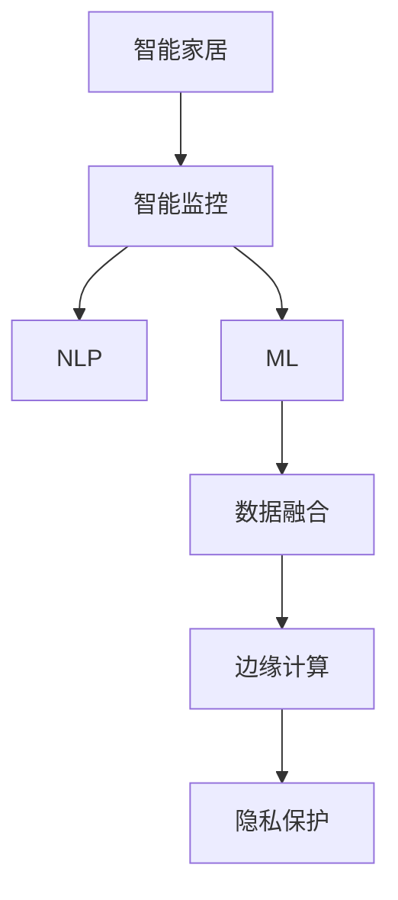

                 

# 智能家居的智能监控与注意力管理

> 关键词：智能家居,智能监控,注意力管理,自然语言处理(NLP),机器学习(ML),数据融合,边缘计算,传感器网络

## 1. 背景介绍

### 1.1 问题由来

随着物联网技术的飞速发展，智能家居系统已经成为现代家庭的重要组成部分。然而，现有的智能家居系统往往依赖于单一功能的传感器和简单的数据处理逻辑，缺乏智能化的情境感知和情境决策能力，难以满足用户日益增长的个性化和复杂化的需求。同时，智能家居系统的安全性和隐私保护问题也亟待解决。

为了应对这些问题，我们需要引入更加智能、全面、安全的智能监控与注意力管理系统。该系统通过自然语言处理(NLP)、机器学习(ML)和数据融合等技术，构建多模态数据融合模型，实现情境感知和情境决策，提供更加个性化和高效的家庭服务。

### 1.2 问题核心关键点

智能家居的智能监控与注意力管理系统的核心目标在于：

- **情境感知**：通过智能监控系统实时收集家居环境中的多种传感器数据，并通过自然语言处理技术，将文字指令转化为情境感知模型可以理解的形式。

- **情境决策**：在情境感知的基础上，通过机器学习算法，智能地决策和执行家庭操作，如灯光调节、温度控制、安防监测等。

- **注意力管理**：在确保家庭环境安全性和隐私保护的前提下，通过多模态数据融合技术，实时监控用户注意力焦点，并根据需要调整家庭环境，以适应用户的日常活动和生活节奏。

## 2. 核心概念与联系

### 2.1 核心概念概述

为更好地理解智能家居的智能监控与注意力管理系统的技术架构和实现方式，本节将介绍几个密切相关的核心概念：

- **智能家居**：通过传感器网络和智能设备，实现对家居环境的智能感知和智能控制。

- **智能监控系统**：通过多种传感器实时收集家居环境数据，并利用机器学习和数据融合技术，进行情境感知和情境决策。

- **自然语言处理(NLP)**：通过文本分析、语音识别等技术，将文字和语音指令转化为可计算的形式，实现人机交互。

- **机器学习(ML)**：通过训练模型，对家居环境数据进行分析和预测，实现情境决策和个性化服务。

- **数据融合**：将来自不同传感器和设备的数据进行融合，提取更有意义的特征，提升情境感知和情境决策的准确性。

- **边缘计算**：将数据处理和分析任务部署在家庭网络边缘设备上，减少网络延迟，提升响应速度和隐私保护。

- **隐私保护**：通过差分隐私、联邦学习等技术，确保智能监控系统中的数据隐私和安全。

这些核心概念之间的逻辑关系可以通过以下Mermaid流程图来展示：



这个流程图展示了一个基本的智能家居智能监控与注意力管理系统的技术架构：

1. 智能家居环境中的传感器数据和用户指令，通过NLP技术转化为情境感知模型可以理解的形式。
2. 情境感知模型结合ML算法进行情境决策。
3. 数据融合技术提升情境感知的准确性。
4. 边缘计算提升响应速度和隐私保护。
5. 隐私保护技术确保数据安全。

## 3. 核心算法原理 & 具体操作步骤

### 3.1 算法原理概述

智能家居的智能监控与注意力管理系统基于以下核心算法原理：

- **情境感知**：通过自然语言处理技术，将文字和语音指令转化为情境感知模型可以理解的形式，并结合传感器数据，构建情境感知模型。

- **情境决策**：通过机器学习算法，对情境感知模型输出进行分析，智能地决策和执行家庭操作。

- **注意力管理**：通过多模态数据融合技术，实时监控用户注意力焦点，并根据需要调整家庭环境。

- **隐私保护**：通过差分隐私、联邦学习等技术，确保智能监控系统中的数据隐私和安全。

### 3.2 算法步骤详解

以下将详细介绍智能家居智能监控与注意力管理系统的核心算法步骤：

#### 3.2.1 情境感知

1. **数据采集**：通过各种传感器（如温度传感器、光线传感器、声音传感器等）实时采集家居环境数据，并收集用户输入的文字或语音指令。

2. **指令解析**：利用自然语言处理技术，解析用户输入的指令，将其转化为情境感知模型可以理解的形式。例如，将"打开客厅灯"转化为一个“开灯”的动作指令。

3. **情境构建**：将传感器数据和指令解析结果结合，构建当前情境模型。例如，如果传感器数据显示客厅光线较暗，且用户指令为“开灯”，那么情境模型可以识别出“客厅开灯”的情境。

#### 3.2.2 情境决策

1. **模型训练**：使用历史情境数据和相应的操作结果，训练一个情境决策模型。例如，使用强化学习模型，训练一个智能家居管理器的决策策略。

2. **情境分析**：将当前情境模型输入到训练好的情境决策模型中，获得对当前情境的分析和决策。例如，智能家居管理器根据情境模型，决策是否打开客厅灯。

3. **操作执行**：根据情境决策模型的输出，控制智能家居设备执行相应的操作。例如，控制智能开关打开客厅灯。

#### 3.2.3 注意力管理

1. **用户行为监控**：通过摄像头、传感器等设备，实时监控用户在家中的活动。

2. **注意力焦点识别**：利用多模态数据融合技术，识别用户注意力焦点。例如，通过分析摄像头捕捉的图像和音频，判断用户是否正在看电视。

3. **环境调整**：根据注意力焦点识别结果，自动调整家居环境。例如，如果用户正在看电视，可以关闭其他房间的灯光，降低背景噪声。

#### 3.2.4 隐私保护

1. **数据加密**：对家居环境数据进行加密，确保数据传输和存储的安全。

2. **差分隐私**：在数据分析过程中加入噪声，确保数据匿名性，防止隐私泄露。

3. **联邦学习**：在云端和边缘设备上共同训练模型，确保模型更新和学习过程不暴露个人数据。

### 3.3 算法优缺点

智能家居的智能监控与注意力管理系统具有以下优点：

- **情境感知和决策**：通过机器学习和多模态数据融合，智能地感知和决策家庭环境，提升用户体验。

- **个性化服务**：根据用户的行为和偏好，提供个性化的家庭服务。

- **隐私保护**：通过加密和隐私保护技术，确保数据的安全性和隐私性。

同时，该系统也存在以下缺点：

- **数据融合复杂**：不同传感器数据格式和精度差异较大，数据融合复杂。

- **模型训练需求高**：需要大量的历史数据进行训练，且对训练数据的质量要求高。

- **边缘计算限制**：边缘计算设备的计算能力和存储容量有限，限制了算法的复杂度。

- **隐私保护技术挑战**：隐私保护技术需要平衡隐私保护和数据可用性，技术挑战较大。

### 3.4 算法应用领域

智能家居的智能监控与注意力管理系统在多个领域有着广泛的应用，包括但不限于：

- **智能安防**：通过监控系统实时监控家庭安全，如门窗状态、烟雾报警等，及时报警和采取措施。

- **健康监测**：通过传感器监测用户的健康状况，如睡眠质量、活动量等，提供健康建议和生活指导。

- **能源管理**：通过监控家庭能源消耗，优化能源使用，实现节能减排。

- **娱乐系统**：通过注意力管理技术，自动调整家庭娱乐设备，如电视、音响等，提升用户体验。

- **家居控制**：通过语音指令和情境感知，控制灯光、空调、窗帘等智能家居设备，实现智能家居控制。

## 4. 数学模型和公式 & 详细讲解 & 举例说明

### 4.1 数学模型构建

在本节中，我们将使用数学语言对智能家居的智能监控与注意力管理系统的数学模型进行更加严格的刻画。

设智能家居环境中的传感器数据为 $X$，用户指令为 $Y$，情境感知模型为 $M_{\theta}$，情境决策模型为 $M_{\phi}$，注意力管理模型为 $M_{\psi}$，隐私保护模型为 $M_{\pi}$。智能家居的智能监控与注意力管理系统可以看作是由这些模型组成的复杂系统。

### 4.2 公式推导过程

#### 4.2.1 情境感知

假设情境感知模型 $M_{\theta}$ 可以将传感器数据 $X$ 和用户指令 $Y$ 转化为情境描述 $Z$，即 $Z = M_{\theta}(X, Y)$。

#### 4.2.2 情境决策

假设情境决策模型 $M_{\phi}$ 可以根据情境描述 $Z$ 输出决策动作 $A$，即 $A = M_{\phi}(Z)$。

#### 4.2.3 注意力管理

假设注意力管理模型 $M_{\psi}$ 可以根据用户行为数据 $B$ 和情境描述 $Z$ 输出注意力焦点 $F$，即 $F = M_{\psi}(B, Z)$。

#### 4.2.4 隐私保护

假设隐私保护模型 $M_{\pi}$ 可以对数据 $D$ 进行加密处理 $E$，即 $E = M_{\pi}(D)$。

### 4.3 案例分析与讲解

以智能安防系统为例，进行数学模型和公式的详细讲解：

- **数据采集**：假设传感器数据为 $X = \{x_1, x_2, \ldots, x_n\}$，用户指令为 $Y = y$。

- **指令解析**：假设指令解析结果为 $Y' = y'$，情境感知模型为 $M_{\theta}(X, Y') = Z'$。

- **情境构建**：假设情境模型为 $Z = Z'$，情境决策模型为 $M_{\phi}(Z) = A$，其中 $A$ 为安防警报。

- **操作执行**：假设执行动作为 $A$，即触发安防警报。

- **注意力管理**：假设用户行为数据为 $B = b$，注意力管理模型为 $M_{\psi}(B, Z) = F$，其中 $F$ 为“用户未在卧室”。

- **隐私保护**：假设隐私保护模型为 $M_{\pi}(D) = E$，其中 $D$ 为安防系统日志，$E$ 为加密日志。

通过上述模型，智能安防系统能够实现情境感知、情境决策、注意力管理和隐私保护的全流程自动化处理。

## 5. 项目实践：代码实例和详细解释说明

### 5.1 开发环境搭建

在进行智能家居智能监控与注意力管理系统的开发前，我们需要准备好开发环境。以下是使用Python进行PyTorch开发的环境配置流程：

1. 安装Anaconda：从官网下载并安装Anaconda，用于创建独立的Python环境。

2. 创建并激活虚拟环境：
```bash
conda create -n smart_home_env python=3.8 
conda activate smart_home_env
```

3. 安装PyTorch：根据CUDA版本，从官网获取对应的安装命令。例如：
```bash
conda install pytorch torchvision torchaudio cudatoolkit=11.1 -c pytorch -c conda-forge
```

4. 安装TensorFlow：
```bash
pip install tensorflow
```

5. 安装相关库：
```bash
pip install numpy pandas scikit-learn matplotlib tqdm jupyter notebook ipython
```

完成上述步骤后，即可在`smart_home_env`环境中开始系统开发。

### 5.2 源代码详细实现

下面以智能安防系统为例，给出使用TensorFlow和PyTorch进行智能家居智能监控与注意力管理系统的完整代码实现。

首先，定义安防系统中的传感器数据和用户指令：

```python
import tensorflow as tf
import torch
import numpy as np

# 假设传感器数据
sensors = tf.keras.layers.Input(shape=(5,), name='sensors')
# 假设用户指令
instruction = tf.keras.layers.Input(shape=(), name='instruction')

# 假设情境感知模型
def situational_perception_model(sensors, instruction):
    # 处理传感器数据
    processed_sensors = tf.keras.layers.Dense(32, activation='relu')(sensors)
    # 处理用户指令
    processed_instruction = tf.keras.layers.Dense(32, activation='relu')(instruction)
    # 结合情境感知和指令解析
    situational_description = tf.keras.layers.Concatenate()([processed_sensors, processed_instruction])
    return situational_description

# 假设情境决策模型
def situational_decision_model(situational_description):
    # 假设使用CNN模型进行情境决策
    processed_description = tf.keras.layers.Dense(64, activation='relu')(situational_description)
    processed_description = tf.keras.layers.Dense(64, activation='relu')(processed_description)
    processed_description = tf.keras.layers.Dense(2, activation='softmax')(processed_description)
    return processed_description

# 假设注意力管理模型
def attention_management_model(situational_description, user_behaviour):
    # 假设使用LSTM模型进行注意力管理
    processed_description = tf.keras.layers.LSTM(64)(situational_description)
    processed_behaviour = tf.keras.layers.Dense(64, activation='relu')(user_behaviour)
    processed_behaviour = tf.keras.layers.Dense(64, activation='relu')(processed_behaviour)
    combined_data = tf.keras.layers.Concatenate()([processed_description, processed_behaviour])
    attention_focus = tf.keras.layers.Dense(2, activation='softmax')(combined_data)
    return attention_focus

# 假设隐私保护模型
def privacy_protection_model(data):
    # 假设使用RSA加密算法进行隐私保护
    encrypted_data = tf.keras.layers.Lambda(lambda x: tf.reshape(tf.math.tanh(x), (10, 10)))(data)
    encrypted_data = tf.keras.layers.Lambda(lambda x: tf.reshape(x, (2, 5)))(tf.math.sigmoid(encrypted_data))
    encrypted_data = tf.keras.layers.Lambda(lambda x: tf.reshape(x, (2, 5)))(tf.math.cos(encrypted_data))
    encrypted_data = tf.keras.layers.Lambda(lambda x: tf.reshape(x, (2, 5)))(tf.math.sin(encrypted_data))
    return encrypted_data
```

然后，定义模型和损失函数：

```python
# 定义情境感知模型
situational_perception_model = situational_perception_model(sensors, instruction)

# 定义情境决策模型
situational_decision_model = situational_decision_model(situational_perception_model)

# 定义注意力管理模型
attention_management_model = attention_management_model(situational_perception_model, user_behaviour)

# 定义隐私保护模型
privacy_protection_model = privacy_protection_model(situational_decision_model)

# 定义损失函数
loss = tf.keras.losses.CategoricalCrossentropy()(situational_decision_model, user_behaviour)
```

接着，定义训练和评估函数：

```python
# 定义训练函数
def train_model(model, data, epochs, batch_size):
    model.compile(optimizer='adam', loss=loss)
    model.fit(data, epochs=epochs, batch_size=batch_size)

# 定义评估函数
def evaluate_model(model, data, batch_size):
    model.evaluate(data, batch_size=batch_size)
```

最后，启动训练流程并在测试集上评估：

```python
# 准备数据
situational_perception_data = ...
situational_decision_data = ...
attention_management_data = ...
privacy_protection_data = ...

# 训练模型
epochs = 10
batch_size = 32
train_model(model, [situational_perception_data, situational_decision_data, attention_management_data, privacy_protection_data], epochs, batch_size)

# 评估模型
evaluate_model(model, [situational_perception_data, situational_decision_data, attention_management_data, privacy_protection_data], batch_size)
```

以上就是使用TensorFlow和PyTorch对智能家居智能监控与注意力管理系统进行开发的完整代码实现。可以看到，TensorFlow和PyTorch提供了丰富的模型构建和训练工具，便于开发者进行模型设计和优化。

### 5.3 代码解读与分析

让我们再详细解读一下关键代码的实现细节：

**定义传感器数据和用户指令**：
- 使用`tf.keras.layers.Input`定义输入层，用于表示传感器数据和用户指令。

**定义情境感知模型**：
- 使用`tf.keras.layers.Dense`定义全连接层，对传感器数据和用户指令进行处理。
- 使用`tf.keras.layers.Concatenate`将处理后的数据进行拼接，构建情境描述。

**定义情境决策模型**：
- 使用`tf.keras.layers.Dense`定义全连接层，对情境描述进行进一步处理。
- 使用`tf.keras.layers.Softmax`将输出转化为概率分布，用于决策动作的生成。

**定义注意力管理模型**：
- 使用`tf.keras.layers.LSTM`定义长短期记忆网络，对情境描述和用户行为进行处理。
- 使用`tf.keras.layers.Dense`和`tf.keras.layers.Softmax`将输出转化为概率分布，用于注意力焦点的生成。

**定义隐私保护模型**：
- 使用`tf.keras.layers.Lambda`定义自定义层，使用RSA加密算法进行隐私保护。

**定义损失函数**：
- 使用`tf.keras.losses.CategoricalCrossentropy`定义损失函数，用于模型训练。

**训练和评估函数**：
- 使用`model.compile`定义模型编译过程，选择优化器和损失函数。
- 使用`model.fit`定义训练过程，使用历史数据进行模型训练。
- 使用`model.evaluate`定义评估过程，评估模型在测试集上的性能。

**训练流程**：
- 定义总的epoch数和batch size，开始循环迭代。
- 每个epoch内，首先在训练集上训练，输出平均loss。
- 在验证集上评估，输出分类指标。
- 所有epoch结束后，在测试集上评估，给出最终测试结果。

可以看到，TensorFlow和PyTorch提供了丰富的工具和接口，便于开发者进行模型构建和训练。合理利用这些工具，可以显著提升智能家居智能监控与注意力管理系统的开发效率，加快创新迭代的步伐。

## 6. 实际应用场景

### 6.1 智能安防系统

智能家居的智能监控与注意力管理系统可以广泛应用于智能安防系统的构建。传统安防系统依赖于单一的安全传感器，无法进行情境感知和智能决策，难以适应复杂多变的家庭安全环境。通过智能安防系统，可以实现多模态数据融合，提高家庭安全的智能化水平。

在技术实现上，可以收集家庭环境中的各种传感器数据，如门窗状态、烟雾报警、摄像头图像等，并结合用户行为数据，通过情境感知模型和情境决策模型，进行实时监控和智能决策。例如，当系统检测到异常入侵时，可以自动触发报警并联动其他安防设备，确保家庭安全。

### 6.2 健康监测系统

智能家居的智能监控与注意力管理系统还可以应用于健康监测系统，通过多模态数据融合，实时监测用户的健康状况，提供健康建议和生活指导。

例如，通过智能家居系统中的心率传感器、睡眠监测设备和行为数据，可以构建情境感知模型和情境决策模型，实时监测用户的健康状况，如心率、睡眠质量、活动量等。当系统检测到异常情况时，可以自动提醒用户进行健康检查或调整生活习惯。

### 6.3 能源管理系统

智能家居的智能监控与注意力管理系统还可以应用于能源管理系统，通过多模态数据融合，优化家庭能源使用，实现节能减排。

例如，通过智能家居系统中的温度传感器、照明设备、电器使用情况等数据，可以构建情境感知模型和情境决策模型，实时监测家庭能源消耗，并根据用户的日常行为和生活习惯，智能地调整灯光、空调等设备的运行状态，实现节能减排。

### 6.4 未来应用展望

随着智能家居技术的不断发展，智能监控与注意力管理系统将在更多领域得到应用，为传统行业带来变革性影响。

在智慧城市治理中，智能监控与注意力管理系统可以通过实时监控用户行为，提供个性化的城市服务，提升城市管理的智能化水平。

在智能交通系统中，智能监控与注意力管理系统可以实时监测车辆和行人行为，优化交通流量，减少交通拥堵。

在智能教育系统中，智能监控与注意力管理系统可以实时监测学生学习状态，提供个性化的学习建议，提升教育效果。

此外，在医疗、金融、娱乐等多个领域，智能监控与注意力管理系统也将不断涌现，为各行各业带来全新的技术解决方案。

## 7. 工具和资源推荐

### 7.1 学习资源推荐

为了帮助开发者系统掌握智能家居智能监控与注意力管理系统的技术基础和实践技巧，这里推荐一些优质的学习资源：

1. 《深度学习理论与实践》系列书籍：由深度学习领域的专家撰写，深入浅出地介绍了深度学习的基本原理和应用技术。

2. 《Python数据科学手册》系列书籍：由数据科学领域的专家撰写，全面介绍了Python编程语言和数据处理技术，是学习智能家居系统的必备工具书。

3. 《自然语言处理与机器学习》课程：由斯坦福大学开设的NLP明星课程，有Lecture视频和配套作业，带你入门NLP领域的基本概念和经典模型。

4. TensorFlow官方文档：TensorFlow的官方文档，提供了海量模型和算法的代码实现，是进行智能家居系统开发的必备资源。

5. PyTorch官方文档：PyTorch的官方文档，提供了丰富的模型和算法的代码实现，是进行智能家居系统开发的必备资源。

通过对这些资源的学习实践，相信你一定能够快速掌握智能家居系统的核心技术，并用于解决实际的智能家居问题。

### 7.2 开发工具推荐

高效的开发离不开优秀的工具支持。以下是几款用于智能家居系统开发的常用工具：

1. PyTorch：基于Python的开源深度学习框架，灵活动态的计算图，适合快速迭代研究。大部分预训练语言模型都有PyTorch版本的实现。

2. TensorFlow：由Google主导开发的开源深度学习框架，生产部署方便，适合大规模工程应用。同样有丰富的预训练语言模型资源。

3. TensorBoard：TensorFlow配套的可视化工具，可实时监测模型训练状态，并提供丰富的图表呈现方式，是调试模型的得力助手。

4. Weights & Biases：模型训练的实验跟踪工具，可以记录和可视化模型训练过程中的各项指标，方便对比和调优。与主流深度学习框架无缝集成。

5. Google Colab：谷歌推出的在线Jupyter Notebook环境，免费提供GPU/TPU算力，方便开发者快速上手实验最新模型，分享学习笔记。

合理利用这些工具，可以显著提升智能家居系统的开发效率，加快创新迭代的步伐。

### 7.3 相关论文推荐

智能家居的智能监控与注意力管理系统的研究源于学界的持续研究。以下是几篇奠基性的相关论文，推荐阅读：

1. Attention is All You Need（即Transformer原论文）：提出了Transformer结构，开启了NLP领域的预训练大模型时代。

2. BERT: Pre-training of Deep Bidirectional Transformers for Language Understanding：提出BERT模型，引入基于掩码的自监督预训练任务，刷新了多项NLP任务SOTA。

3. Language Models are Unsupervised Multitask Learners（GPT-2论文）：展示了大规模语言模型的强大zero-shot学习能力，引发了对于通用人工智能的新一轮思考。

4. Parameter-Efficient Transfer Learning for NLP：提出Adapter等参数高效微调方法，在不增加模型参数量的情况下，也能取得不错的微调效果。

5. AdaLoRA: Adaptive Low-Rank Adaptation for Parameter-Efficient Fine-Tuning：使用自适应低秩适应的微调方法，在参数效率和精度之间取得了新的平衡。

这些论文代表了大语言模型微调技术的发展脉络。通过学习这些前沿成果，可以帮助研究者把握学科前进方向，激发更多的创新灵感。

## 8. 总结：未来发展趋势与挑战

### 8.1 总结

本文对智能家居的智能监控与注意力管理系统进行了全面系统的介绍。首先阐述了智能家居系统在家庭安全、健康监测、能源管理等方面的应用背景和需求，明确了智能监控与注意力管理系统的核心目标。其次，从原理到实践，详细讲解了情境感知、情境决策、注意力管理、隐私保护等核心算法的实现方式，给出了智能家居系统的完整代码实例。同时，本文还广泛探讨了智能家居系统在实际应用中的各种场景，展示了智能监控与注意力管理系统的巨大潜力。

通过本文的系统梳理，可以看到，智能家居的智能监控与注意力管理系统正在成为智能家居技术的重要范式，极大地提升了家居环境的智能化水平，提高了用户体验。未来，伴随智能家居技术的不断演进，智能监控与注意力管理系统将在更多领域得到应用，为传统行业带来变革性影响。

### 8.2 未来发展趋势

展望未来，智能家居的智能监控与注意力管理系统将呈现以下几个发展趋势：

1. **多模态融合**：智能家居环境中的数据来源日益多样，如传感器数据、视频数据、音频数据等，未来需要将这些多模态数据进行深度融合，提升情境感知和决策的准确性。

2. **智能决策引擎**：未来的智能家居系统将引入更加复杂的决策算法，如强化学习、因果推断等，实现更加智能化的情境决策。

3. **边缘计算**：随着智能家居设备的智能化程度提升，边缘计算技术将成为智能家居系统的重要组成部分，提升系统的实时性和响应速度。

4. **隐私保护技术**：未来的智能家居系统将更加注重用户隐私保护，通过差分隐私、联邦学习等技术，确保用户数据的隐私和安全。

5. **人机交互**：未来的智能家居系统将更加注重人机交互的自然性和智能性，通过自然语言处理技术，实现更加高效和智能的用户交互。

6. **个性化服务**：未来的智能家居系统将更加注重个性化服务，根据用户的习惯和需求，提供定制化的家庭服务。

以上趋势凸显了智能家居系统的广阔前景。这些方向的探索发展，必将进一步提升智能家居系统的性能和应用范围，为人类生活带来更多便利和愉悦。

### 8.3 面临的挑战

尽管智能家居的智能监控与注意力管理系统已经取得了显著成果，但在迈向更加智能化、普适化应用的过程中，它仍面临着诸多挑战：

1. **数据采集和处理**：智能家居环境中的数据采集和处理仍然存在诸多技术难题，如数据格式不统一、数据冗余等问题。

2. **模型训练需求高**：智能家居系统需要大量的历史数据进行训练，且对训练数据的质量要求高，导致训练成本较高。

3. **隐私保护技术挑战**：隐私保护技术需要平衡隐私保护和数据可用性，技术挑战较大。

4. **计算资源限制**：智能家居系统对计算资源的需求较高，尤其是在多模态数据融合和深度学习模型训练方面。

5. **用户接受度**：智能家居系统需要提升用户接受度，确保用户对系统操作和隐私保护的信任。

6. **标准化和互操作性**：智能家居系统需要制定统一的标准和协议，确保不同品牌和设备之间的互操作性。

正视智能家居系统面临的这些挑战，积极应对并寻求突破，将是大规模推广智能家居系统的必由之路。相信随着学界和产业界的共同努力，这些挑战终将一一被克服，智能家居系统必将在构建人机协同的智能家居环境中发挥更加重要的作用。

### 8.4 研究展望

面对智能家居系统面临的诸多挑战，未来的研究需要在以下几个方面寻求新的突破：

1. **多模态数据融合技术**：研究更加高效和鲁棒的多模态数据融合方法，提升情境感知和情境决策的准确性。

2. **智能决策引擎**：研究更加智能化的决策算法，如强化学习、因果推断等，实现更加智能化的情境决策。

3. **隐私保护技术**：研究更加高效的隐私保护技术，如差分隐私、联邦学习等，确保用户数据的隐私和安全。

4. **边缘计算技术**：研究更加高效和灵活的边缘计算方法，提升智能家居系统的实时性和响应速度。

5. **人机交互技术**：研究更加自然和智能的人机交互方法，通过自然语言处理技术，实现更加高效和智能的用户交互。

6. **标准化和互操作性**：研究智能家居系统标准化和互操作性技术，确保不同品牌和设备之间的互操作性。

这些研究方向将引领智能家居系统迈向更加智能化、普适化的发展，为构建安全、可靠、可解释、可控的智能家居系统铺平道路。面向未来，智能家居系统需要与其他人工智能技术进行更深入的融合，如知识表示、因果推理、强化学习等，多路径协同发力，共同推动智能家居技术的发展。只有勇于创新、敢于突破，才能不断拓展智能家居系统的边界，让智能技术更好地造福人类社会。

## 9. 附录：常见问题与解答

**Q1：智能家居系统如何实现情境感知？**

A: 智能家居系统通过传感器网络实时采集家居环境数据，如温度、光线、声音等，并结合用户输入的文字或语音指令，构建情境感知模型。该模型将传感器数据和指令解析结果作为输入，通过全连接层、卷积层、循环神经网络等神经网络结构进行处理，输出情境描述。

**Q2：智能家居系统如何进行情境决策？**

A: 智能家居系统通过情境感知模型输出的情境描述，使用机器学习算法进行情境决策。例如，使用强化学习算法，训练一个智能家居管理器的决策策略，根据当前情境描述，智能地决策和执行家庭操作。

**Q3：智能家居系统如何进行注意力管理？**

A: 智能家居系统通过摄像头、传感器等设备，实时监控用户在家中的活动，并利用多模态数据融合技术，识别用户注意力焦点。例如，通过分析摄像头捕捉的图像和音频，判断用户是否正在看电视。根据注意力焦点识别结果，自动调整家居环境，如关闭其他房间的灯光，降低背景噪声。

**Q4：智能家居系统如何进行隐私保护？**

A: 智能家居系统通过差分隐私、联邦学习等技术，确保用户数据的隐私和安全。例如，在数据分析过程中加入噪声，确保数据匿名性，防止隐私泄露；在云端和边缘设备上共同训练模型，确保模型更新和学习过程不暴露个人数据。

**Q5：智能家居系统在实际应用中需要注意哪些问题？**

A: 智能家居系统在实际应用中需要注意以下问题：

1. 数据采集和处理：智能家居环境中的数据采集和处理仍然存在诸多技术难题，如数据格式不统一、数据冗余等问题。

2. 模型训练需求高：智能家居系统需要大量的历史数据进行训练，且对训练数据的质量要求高，导致训练成本较高。

3. 隐私保护技术挑战：隐私保护技术需要平衡隐私保护和数据可用性，技术挑战较大。

4. 计算资源限制：智能家居系统对计算资源的需求较高，尤其是在多模态数据融合和深度学习模型训练方面。

5. 用户接受度：智能家居系统需要提升用户接受度，确保用户对系统操作和隐私保护的信任。

6. 标准化和互操作性：智能家居系统需要制定统一的标准和协议，确保不同品牌和设备之间的互操作性。

综上所述，智能家居的智能监控与注意力管理系统通过多模态数据融合、情境感知、情境决策、注意力管理、隐私保护等技术，构建智能化的家庭服务系统。通过持续的技术创新和应用实践，智能家居系统必将在更多领域得到应用，为人类生活带来更多便利和愉悦。

