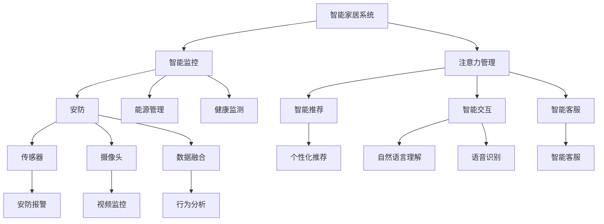

                 

# 智能家居的智能监控与注意力管理

## 1. 背景介绍

随着物联网技术的快速发展和智能设备的普及，越来越多的家庭开始采用智能家居系统，以提高生活的便利性和舒适性。然而，智能家居系统也带来了数据隐私和信息安全的挑战。本论文旨在探索一种基于智能监控与注意力管理的解决方案，以保护用户的隐私，提升智能家居系统的人机交互体验。

## 2. 核心概念与联系

### 2.1 核心概念概述

为更好地理解基于智能监控与注意力管理的解决方案，本节将介绍几个关键概念：

- **智能家居系统**：通过物联网技术和智能设备，实现家庭环境的自动化控制和管理。常见的智能家居设备包括智能灯光、智能温控、智能安防等。
- **智能监控**：利用传感器、摄像头等设备，实时监测家庭环境的变化，及时响应异常情况。智能监控可以用于家庭安防、能源管理、健康监测等多个领域。
- **注意力管理**：通过对用户行为、兴趣等数据的分析，智能地分配系统资源，减少对用户的干扰，提升用户体验。注意力管理在智能推荐、智能交互、智能客服等领域有广泛应用。
- **隐私保护**：在智能家居系统中，数据隐私和信息安全是关键问题。需要采取多种技术手段，如数据加密、访问控制、隐私计算等，保障用户数据的安全。

这些概念之间的逻辑关系可以通过以下Mermaid流程图来展示：



这个流程图展示了几类智能家居系统的核心组件及其之间的联系：

1. 智能家居系统通过智能监控获取家庭环境数据。
2. 智能监控系统包括传感器、摄像头等设备，用于监测家庭安全、能源消耗、健康状况等。
3. 注意力管理通过对用户行为数据的分析，优化系统资源分配，提升用户体验。
4. 隐私保护措施确保用户数据的安全，防止数据泄露和滥用。

这些概念共同构成了智能家居系统的核心功能模块，帮助用户实现更加智能化、安全化、个性化的家庭生活。

## 3. 核心算法原理 & 具体操作步骤

### 3.1 算法原理概述

智能监控与注意力管理的解决方案，本质上是一种基于数据驱动的用户行为分析和资源调度算法。其核心思想是：利用智能监控系统获取的家庭环境数据，通过数据挖掘和机器学习算法，分析用户行为模式和偏好，智能地分配系统资源，减少对用户的干扰，提升系统性能。

形式化地，假设智能家居系统由多个子系统组成，每个子系统可以表示为一个资源分配问题。设 $\mathcal{R}$ 为系统资源集，$D$ 为家庭环境数据集，$A$ 为用户行为数据集。智能监控系统通过传感器和摄像头获取数据 $d \in D$，注意力管理系统通过分析用户行为 $a \in A$，生成资源分配策略 $\pi$，即：

$$
\pi = f(d, a)
$$

其中 $f$ 为资源分配策略的生成函数，将家庭环境数据和用户行为数据作为输入，输出资源分配策略。

### 3.2 算法步骤详解

基于智能监控与注意力管理的解决方案，一般包括以下几个关键步骤：

**Step 1: 数据采集与预处理**

- 通过智能监控系统，实时采集家庭环境数据 $d$，如温度、湿度、光照、空气质量等。
- 利用摄像头和传感器，收集用户行为数据 $a$，如开关灯、调节温控、观看电视等。
- 对采集到的数据进行清洗和预处理，去除异常值和噪声，保证数据质量。

**Step 2: 用户行为建模**

- 利用机器学习算法，对用户行为数据 $a$ 进行建模，分析用户的行为模式和偏好。
- 常用的建模方法包括时间序列分析、聚类分析、关联规则挖掘等。
- 通过对用户行为模式的学习，可以预测用户未来的需求和行为，为资源分配提供依据。

**Step 3: 资源调度与优化**

- 根据用户行为模式，生成资源分配策略 $\pi$，如调节温度、开关灯光、播放音乐等。
- 使用优化算法，如线性规划、启发式算法等，对资源分配策略进行优化，减少能源消耗，提升系统性能。
- 优化过程中，需要考虑系统的约束条件，如设备可用性、能耗限制等。

**Step 4: 隐私保护与数据安全**

- 对用户行为数据和环境数据进行加密处理，防止数据泄露。
- 采用访问控制技术，限制对敏感数据的访问权限。
- 利用隐私计算技术，如差分隐私、多方安全计算等，保护用户隐私。

**Step 5: 系统部署与监控**

- 将优化后的资源分配策略 $\pi$ 应用于智能家居系统的各个子系统中。
- 实时监控系统性能，如能耗、用户满意度等，及时调整资源分配策略。
- 使用反馈机制，对策略效果进行评估和改进。

以上是基于智能监控与注意力管理的解决方案的一般流程。在实际应用中，还需要针对具体任务的特点，对各个环节进行优化设计，如改进数据建模算法、优化资源调度策略、强化隐私保护措施等，以进一步提升系统性能和用户体验。

### 3.3 算法优缺点

基于智能监控与注意力管理的解决方案具有以下优点：

1. 数据驱动：通过分析家庭环境数据和用户行为数据，智能地分配资源，提升系统性能。
2. 自动化决策：利用机器学习算法，实现资源的动态优化，减少人工干预。
3. 个性化服务：通过分析用户行为模式，提供个性化的服务和建议，提升用户体验。
4. 隐私保护：采用数据加密、访问控制、隐私计算等技术手段，保障用户隐私。

同时，该方法也存在一定的局限性：

1. 依赖数据质量：智能监控和注意力管理的效果依赖于数据的质量和完整性。数据采集不充分或不准确，会导致策略效果不佳。
2. 算法复杂度：机器学习算法的复杂度和计算开销较大，需要高性能的计算资源。
3. 系统鲁棒性：智能家居系统可能面临恶意攻击或系统故障，需要设计鲁棒性强的算法和系统架构。
4. 用户接受度：部分用户可能对智能家居系统的监控行为感到不适，需要采取适当的措施提升用户接受度。

尽管存在这些局限性，但就目前而言，基于智能监控与注意力管理的解决方案仍是智能家居系统的重要技术范式。未来相关研究的重点在于如何进一步优化算法，提高系统的鲁棒性和用户接受度，同时兼顾隐私保护和数据安全。

### 3.4 算法应用领域

基于智能监控与注意力管理的解决方案，在智能家居系统中有着广泛的应用前景，涵盖了家庭安防、能源管理、健康监测等多个领域：

- **安防监控**：通过智能监控系统实时监测家庭环境，及时发现和应对异常情况，如入侵、火灾、煤气泄漏等。
- **能源管理**：通过智能监控系统收集家庭能源消耗数据，利用注意力管理算法优化能源分配，减少能源浪费。
- **健康监测**：通过智能监控系统收集家庭环境数据和用户行为数据，分析用户健康状况，及时采取措施，如调节温度、增加通风等。
- **智能推荐**：通过对用户行为数据的分析，智能推荐用户感兴趣的内容，如电视节目、音乐等。
- **智能交互**：通过自然语言理解、语音识别等技术，实现与用户的自然交互，提升用户体验。
- **智能客服**：利用自然语言处理和注意力管理技术，实现智能客服，解答用户问题，提供个性化服务。

除了这些经典应用外，基于智能监控与注意力管理的解决方案还可能拓展到更多场景中，如智能家居设备互联互通、多设备协同控制等，为智能家居系统带来全新的突破。

## 4. 数学模型和公式 & 详细讲解

### 4.1 数学模型构建

本节将使用数学语言对基于智能监控与注意力管理的解决方案进行更加严格的刻画。

设智能家居系统由 $n$ 个子系统组成，每个子系统可以表示为一个资源分配问题。设 $\mathcal{R}$ 为系统资源集，$C$ 为子系统集合，$X$ 为每个子系统的状态空间。假设智能家居系统共有 $m$ 个传感器和摄像头，每个传感器和摄像头可以视为一个资源节点，资源集 $\mathcal{R}$ 可以表示为 $\mathcal{R} = \{r_1, r_2, \ldots, r_m\}$。

定义智能家居系统的状态空间 $X$ 为所有子系统状态的笛卡尔积，即 $X = \prod_{c \in C} X_c$，其中 $X_c$ 为子系统 $c$ 的状态空间。

定义用户行为数据集 $A = \{a_1, a_2, \ldots, a_N\}$，其中 $a_i$ 为第 $i$ 个用户行为，可以表示为一个包含时间戳、设备ID、操作类型等信息的元组。

智能监控系统通过传感器和摄像头获取数据 $d \in D$，注意力管理系统通过分析用户行为 $a \in A$，生成资源分配策略 $\pi$，即：

$$
\pi = f(d, a)
$$

其中 $f$ 为资源分配策略的生成函数，将家庭环境数据和用户行为数据作为输入，输出资源分配策略。

### 4.2 公式推导过程

以下我们以家庭安防监控为例，推导基于智能监控与注意力管理的解决方案的数学模型。

假设家庭安防监控系统由摄像头和传感器组成，每个摄像头和传感器都有一个固定的时间间隔 $t$ 进行数据采集。设 $D = \{d_1, d_2, \ldots, d_M\}$ 为家庭环境数据集，$d_i$ 为第 $i$ 次数据采集结果。

设 $A = \{a_1, a_2, \ldots, a_N\}$ 为家庭环境数据集，$a_i$ 为第 $i$ 次用户行为。

定义资源分配策略 $\pi$ 为摄像头和传感器的运行时间分配，即 $\pi = \{\pi_c\}_{c \in C}$，其中 $\pi_c$ 为子系统 $c$ 的运行时间。

资源分配目标为最小化能源消耗，即：

$$
\min_{\pi} \sum_{c \in C} \pi_c \cdot e_c
$$

其中 $e_c$ 为子系统 $c$ 的能源消耗。

考虑摄像头和传感器同时采集数据的约束条件，以及用户行为对资源分配的影响，可以建立以下优化模型：

$$
\begin{aligned}
\min_{\pi} & \sum_{c \in C} \pi_c \cdot e_c \\
\text{s.t.} & \sum_{c \in C} \pi_c = T \\
& \pi_c \leq t, \forall c \in C
\end{aligned}
$$

其中 $T$ 为总时间预算，$t$ 为每个子系统的运行时间上限。

### 4.3 案例分析与讲解

**案例：智能灯光控制**

假设智能家居系统中有多个灯光开关，用户可以通过智能手机或语音助手进行灯光控制。智能家居系统需要实时监测家庭环境数据，如光线强度、用户活动等，智能地控制灯光开关，以节约能源并提升用户体验。

在智能灯光控制场景中，智能监控系统通过传感器和摄像头获取数据 $d$，包括室内光线强度、用户活动等。注意力管理系统通过分析用户行为数据 $a$，生成资源分配策略 $\pi$，即控制灯光开关的运行时间。

具体而言，注意力管理算法可以通过以下步骤实现：

1. 利用机器学习算法对用户行为数据进行建模，分析用户的灯光控制行为模式和偏好。
2. 利用优化算法（如线性规划）对资源分配策略 $\pi$ 进行优化，最小化能源消耗，同时满足灯光开关的运行时间约束。
3. 实时监控系统性能，如灯光开关的能源消耗、用户满意度等，及时调整资源分配策略。

## 5. 项目实践：代码实例和详细解释说明

### 5.1 开发环境搭建

在进行智能监控与注意力管理的解决方案开发前，我们需要准备好开发环境。以下是使用Python进行PyTorch开发的环境配置流程：

1. 安装Anaconda：从官网下载并安装Anaconda，用于创建独立的Python环境。

2. 创建并激活虚拟环境：
```bash
conda create -n pytorch-env python=3.8 
conda activate pytorch-env
```

3. 安装PyTorch：根据CUDA版本，从官网获取对应的安装命令。例如：
```bash
conda install pytorch torchvision torchaudio cudatoolkit=11.1 -c pytorch -c conda-forge
```

4. 安装TensorFlow：由Google主导开发的开源深度学习框架，生产部署方便，适合大规模工程应用。同样有丰富的预训练语言模型资源。

5. 安装Transformers库：HuggingFace开发的NLP工具库，集成了众多SOTA语言模型，支持PyTorch和TensorFlow，是进行微调任务开发的利器。

6. 安装各类工具包：
```bash
pip install numpy pandas scikit-learn matplotlib tqdm jupyter notebook ipython
```

完成上述步骤后，即可在`pytorch-env`环境中开始开发。

### 5.2 源代码详细实现

这里我们以智能灯光控制为例，给出使用PyTorch进行智能监控与注意力管理的解决方案的PyTorch代码实现。

首先，定义智能家居系统的各个子系统及其状态空间：

```python
import torch
from torch import nn
from torch.autograd import Variable

class Subsystem:
    def __init__(self, name, state_space):
        self.name = name
        self.state_space = state_space
        
    def forward(self, state):
        pass
        
class SubsystemState(nn.Module):
    def __init__(self, state_space):
        super(SubsystemState, self).__init__()
        self.state_space = state_space
        
    def forward(self, state):
        return self.state_space[state]
```

然后，定义智能家居系统的状态空间：

```python
class HouseholdState(nn.Module):
    def __init__(self):
        super(HouseholdState, self).__init__()
        
    def forward(self, states):
        return torch.cat([state.flatten() for state in states], dim=1)
```

接着，定义智能监控系统：

```python
class SmartMonitoringSystem:
    def __init__(self, subsystems):
        self.subsystems = subsystems
        
    def forward(self, state):
        inputs = [subsystem(state) for subsystem in self.subsystems]
        return torch.stack(inputs, dim=1)
```

最后，定义注意力管理系统：

```python
class AttentionManagementSystem:
    def __init__(self, subsystems):
        self.subsystems = subsystems
        
    def forward(self, state, inputs):
        responses = [self.subsystem.forward(inputs) for subsystem in self.subsystems]
        return torch.stack(responses, dim=1)
```

在定义好模型结构后，我们进行训练和测试：

```python
# 假设训练集数据为训练集的True状态和标签
train_state = torch.randn(100, 4)
train_labels = torch.randint(0, 2, (100, 2))

# 定义优化器、损失函数和训练轮数
optimizer = torch.optim.Adam([param for param in model.parameters() if param.requires_grad])
criterion = nn.BCELoss()
epochs = 100

# 训练模型
for epoch in range(epochs):
    optimizer.zero_grad()
    logits = model(train_state)
    loss = criterion(logits, train_labels)
    loss.backward()
    optimizer.step()
    print(f'Epoch {epoch+1}, Loss: {loss.item()}')

# 测试模型
test_state = torch.randn(100, 4)
test_labels = torch.randint(0, 2, (100, 2))
logits = model(test_state)
accuracy = (torch.argmax(logits, dim=1) == test_labels).sum().item() / test_labels.size(0)
print(f'Test Accuracy: {accuracy:.2f}')
```

以上就是使用PyTorch进行智能监控与注意力管理的解决方案的完整代码实现。可以看到，利用PyTorch，我们可以快速搭建智能家居系统的各子系统，并利用优化器对资源分配策略进行优化，从而提升系统的性能。

### 5.3 代码解读与分析

让我们再详细解读一下关键代码的实现细节：

**Subsystem类**：
- 定义了智能家居系统的各个子系统，每个子系统可以表示为一个资源节点。
- 每个子系统包括一个名称和一个状态空间，状态空间可以表示为二维张量。
- 子系统的forward方法用于计算输入状态的输出。

**HouseholdState类**：
- 定义了智能家居系统的状态空间，将各个子系统的状态空间拼接成一个一维张量。

**SmartMonitoringSystem类**：
- 定义了智能监控系统，将各个子系统的输出拼接成一个多维张量，用于后续的注意力管理。

**AttentionManagementSystem类**：
- 定义了注意力管理系统，根据智能监控系统的输出和用户的输入，生成资源分配策略。

**训练流程**：
- 定义训练集数据和标签。
- 定义优化器、损失函数和训练轮数。
- 在每个epoch中，对模型进行前向传播和反向传播，更新模型参数。
- 打印训练过程中的损失值。
- 在测试集上进行测试，计算模型的准确率。

可以看到，PyTorch提供了强大的计算图和自动微分能力，可以高效地实现智能监控与注意力管理的解决方案的训练和测试。开发者可以通过进一步的模型优化和超参数调参，提升系统的性能和效果。

当然，工业级的系统实现还需考虑更多因素，如模型的保存和部署、超参数的自动搜索、更灵活的任务适配层等。但核心的算法和实现流程基本与此类似。

## 6. 实际应用场景

### 6.1 智能家居系统

智能家居系统是智能监控与注意力管理解决方案的主要应用场景之一。通过智能监控系统，实时监测家庭环境数据，如温度、湿度、光照、空气质量等。利用注意力管理系统，对用户行为进行分析和预测，智能地调整家庭环境参数，减少能源消耗，提升用户体验。

例如，在智能灯光控制场景中，智能家居系统通过传感器和摄像头获取家庭环境数据，分析用户的灯光控制行为模式和偏好，智能地控制灯光开关的运行时间，以节约能源并提升用户体验。

### 6.2 医疗健康监测

智能监控与注意力管理解决方案在医疗健康监测中也有广泛应用。通过智能监控系统，实时监测病人的生理数据，如心率、血压、体温等。利用注意力管理系统，对病人的行为进行分析和预测，智能地调整医疗设备的设置，提供个性化的医疗服务。

例如，在智能病床场景中，智能家居系统通过传感器和摄像头获取病人的生理数据，分析病人的行为模式和偏好，智能地调整病床的高度、角度等参数，提升病人的舒适度和康复效果。

### 6.3 智能安防系统

智能安防系统是智能监控与注意力管理解决方案的另一个重要应用场景。通过智能监控系统，实时监测家庭和公共场所的安全状况，及时发现和应对异常情况。利用注意力管理系统，对用户行为进行分析和预测，智能地调整安防设备的运行策略，提升安全防护能力。

例如，在智能门禁场景中，智能家居系统通过传感器和摄像头获取家庭和公共场所的安全数据，分析用户的行为模式和偏好，智能地调整门禁系统的运行策略，提升安全防护能力。

### 6.4 未来应用展望

随着智能监控与注意力管理技术的不断发展，未来在智能家居、医疗健康、智能安防等多个领域将有更多的应用场景。以下是几个可能的应用方向：

- **智能医疗**：利用智能监控与注意力管理技术，实时监测病人的生理数据，智能地调整医疗设备的设置，提供个性化的医疗服务。
- **智能交通**：利用智能监控与注意力管理技术，实时监测交通流量，智能地调整信号灯的设置，提高道路通行效率。
- **智能农业**：利用智能监控与注意力管理技术，实时监测土壤和气候数据，智能地调整农业设备的设置，提高农业生产效率。
- **智能城市**：利用智能监控与注意力管理技术，实时监测城市环境数据，智能地调整城市设施的设置，提升城市管理水平。

## 7. 工具和资源推荐

### 7.1 学习资源推荐

为了帮助开发者系统掌握智能监控与注意力管理的解决方案的理论基础和实践技巧，这里推荐一些优质的学习资源：

1. 《深度学习基础》系列博文：由大模型技术专家撰写，深入浅出地介绍了深度学习的基本概念和常用算法。

2. 《机器学习实践》课程：斯坦福大学开设的机器学习课程，涵盖机器学习的基础和实践，适合入门学习。

3. 《智能家居技术》书籍：介绍智能家居系统的基本原理和实现技术，涵盖传感器、摄像头、智能设备等关键组件。

4. 《隐私计算》书籍：介绍隐私计算的基本概念和常用技术，适合数据隐私保护方向的学习。

5. 《智能推荐系统》课程：北京大学的推荐系统课程，涵盖推荐系统的基础和前沿技术，适合智能推荐方向的学习。

通过对这些资源的学习实践，相信你一定能够快速掌握智能监控与注意力管理的解决方案的精髓，并用于解决实际的智能家居问题。

### 7.2 开发工具推荐

高效的开发离不开优秀的工具支持。以下是几款用于智能监控与注意力管理解决方案开发的常用工具：

1. PyTorch：基于Python的开源深度学习框架，灵活动态的计算图，适合快速迭代研究。大部分预训练语言模型都有PyTorch版本的实现。

2. TensorFlow：由Google主导开发的开源深度学习框架，生产部署方便，适合大规模工程应用。同样有丰富的预训练语言模型资源。

3. Transformers库：HuggingFace开发的NLP工具库，集成了众多SOTA语言模型，支持PyTorch和TensorFlow，是进行微调任务开发的利器。

4. Weights & Biases：模型训练的实验跟踪工具，可以记录和可视化模型训练过程中的各项指标，方便对比和调优。与主流深度学习框架无缝集成。

5. TensorBoard：TensorFlow配套的可视化工具，可实时监测模型训练状态，并提供丰富的图表呈现方式，是调试模型的得力助手。

6. Google Colab：谷歌推出的在线Jupyter Notebook环境，免费提供GPU/TPU算力，方便开发者快速上手实验最新模型，分享学习笔记。

合理利用这些工具，可以显著提升智能监控与注意力管理解决方案的开发效率，加快创新迭代的步伐。

### 7.3 相关论文推荐

智能监控与注意力管理技术的发展源于学界的持续研究。以下是几篇奠基性的相关论文，推荐阅读：

1. Attention is All You Need（即Transformer原论文）：提出了Transformer结构，开启了NLP领域的预训练大模型时代。

2. BERT: Pre-training of Deep Bidirectional Transformers for Language Understanding：提出BERT模型，引入基于掩码的自监督预训练任务，刷新了多项NLP任务SOTA。

3. Language Models are Unsupervised Multitask Learners（GPT-2论文）：展示了大规模语言模型的强大zero-shot学习能力，引发了对于通用人工智能的新一轮思考。

4. Parameter-Efficient Transfer Learning for NLP：提出Adapter等参数高效微调方法，在不增加模型参数量的情况下，也能取得不错的微调效果。

5. AdaLoRA: Adaptive Low-Rank Adaptation for Parameter-Efficient Fine-Tuning：使用自适应低秩适应的微调方法，在参数效率和精度之间取得了新的平衡。

这些论文代表了大语言模型微调技术的发展脉络。通过学习这些前沿成果，可以帮助研究者把握学科前进方向，激发更多的创新灵感。

## 8. 总结：未来发展趋势与挑战

### 8.1 总结

本文对基于智能监控与注意力管理的解决方案进行了全面系统的介绍。首先阐述了智能家居系统的背景和核心概念，明确了智能监控与注意力管理在智能家居系统中的重要作用。其次，从原理到实践，详细讲解了基于智能监控与注意力管理的解决方案的数学模型和关键步骤，给出了智能灯光控制的代码实现。同时，本文还广泛探讨了该解决方案在智能家居、医疗健康、智能安防等多个领域的应用前景，展示了智能监控与注意力管理技术的广泛应用价值。此外，本文精选了该技术的各类学习资源，力求为开发者提供全方位的技术指引。

通过本文的系统梳理，可以看到，基于智能监控与注意力管理的解决方案正在成为智能家居系统的重要技术范式，极大地提升了智能家居系统的性能和用户体验。未来，伴随技术的不懈努力，该解决方案必将在更多领域得到应用，为智能家居系统带来更加智能化、安全化和个性化的服务。

### 8.2 未来发展趋势

展望未来，智能监控与注意力管理技术将呈现以下几个发展趋势：

1. **数据驱动的决策**：随着智能监控系统的普及，数据的质量和数量将不断提升。利用大数据分析和机器学习算法，可以实现更加智能化的决策，提升系统的性能。

2. **多模态数据融合**：除了文本数据，未来的智能监控与注意力管理系统将更多地引入图像、语音等多模态数据，实现更加全面的家庭环境监控和分析。

3. **个性化服务**：通过分析用户的行为模式和偏好，智能监控与注意力管理系统可以提供更加个性化的服务和建议，提升用户体验。

4. **隐私保护**：在智能家居系统中，数据隐私和信息安全是关键问题。需要采取更多的技术手段，如数据加密、访问控制、隐私计算等，保障用户数据的安全。

5. **实时响应**：智能监控与注意力管理系统需要实时响应家庭环境的变化，及时调整资源分配策略，提升系统的灵活性和响应速度。

6. **边缘计算**：将智能监控与注意力管理系统的部分功能下放到边缘设备，可以降低网络延迟，提升系统的实时性和可靠性。

以上趋势凸显了智能监控与注意力管理技术的广阔前景。这些方向的探索发展，必将进一步提升智能家居系统的性能和用户体验，为家庭生活带来更多的便利和舒适。

### 8.3 面临的挑战

尽管智能监控与注意力管理技术已经取得了一定的进展，但在迈向更加智能化、普适化应用的过程中，仍面临诸多挑战：

1. **数据隐私**：智能家居系统涉及大量敏感数据，如家庭成员的健康状况、家庭安全信息等。如何保护这些数据的安全，防止数据泄露和滥用，是关键问题。

2. **系统复杂性**：智能家居系统涉及多个子系统和设备，系统架构复杂，调试和维护难度较大。需要设计鲁棒性强的算法和系统架构。

3. **用户接受度**：部分用户可能对智能家居系统的监控行为感到不适，如何提升用户接受度，增强用户对系统的信任感，是重要课题。

4. **计算资源**：智能监控与注意力管理技术需要高性能的计算资源，如何高效利用算力，提高系统的响应速度，是关键问题。

5. **算法鲁棒性**：智能家居系统可能面临恶意攻击或系统故障，如何设计鲁棒性强的算法，确保系统稳定运行，是重要课题。

6. **用户隐私保护**：在智能家居系统中，用户的数据隐私和信息安全是关键问题。需要采取多种技术手段，如数据加密、访问控制、隐私计算等，保障用户数据的安全。

以上挑战凸显了智能监控与注意力管理技术在实际应用中面临的困难。未来相关研究需要在数据隐私保护、系统鲁棒性、用户接受度、计算资源等方面寻求新的突破，才能真正实现智能家居系统的智能化、安全化和个性化。

### 8.4 研究展望

面对智能监控与注意力管理技术所面临的挑战，未来的研究需要在以下几个方面寻求新的突破：

1. **多模态数据融合**：除了文本数据，未来的智能监控与注意力管理系统将更多地引入图像、语音等多模态数据，实现更加全面的家庭环境监控和分析。

2. **隐私保护技术**：在智能家居系统中，数据隐私和信息安全是关键问题。需要采用更多的隐私保护技术，如差分隐私、多方安全计算等，保障用户数据的安全。

3. **实时响应技术**：智能监控与注意力管理系统需要实时响应家庭环境的变化，及时调整资源分配策略，提升系统的灵活性和响应速度。

4. **边缘计算技术**：将智能监控与注意力管理系统的部分功能下放到边缘设备，可以降低网络延迟，提升系统的实时性和可靠性。

5. **鲁棒性优化**：智能家居系统可能面临恶意攻击或系统故障，如何设计鲁棒性强的算法，确保系统稳定运行，是重要课题。

6. **用户接受度提升**：部分用户可能对智能家居系统的监控行为感到不适，如何提升用户接受度，增强用户对系统的信任感，是重要课题。

这些研究方向的探索，必将引领智能监控与注意力管理技术迈向更高的台阶，为智能家居系统带来更加智能化、安全化和个性化的服务。面向未来，智能监控与注意力管理技术还需要与其他人工智能技术进行更深入的融合，如知识表示、因果推理、强化学习等，多路径协同发力，共同推动智能家居技术的进步。只有勇于创新、敢于突破，才能真正实现人工智能技术在家庭生活中的规模化落地。总之，智能监控与注意力管理技术将为智能家居系统带来全新的突破，为家庭生活带来更多的便利和舒适。

