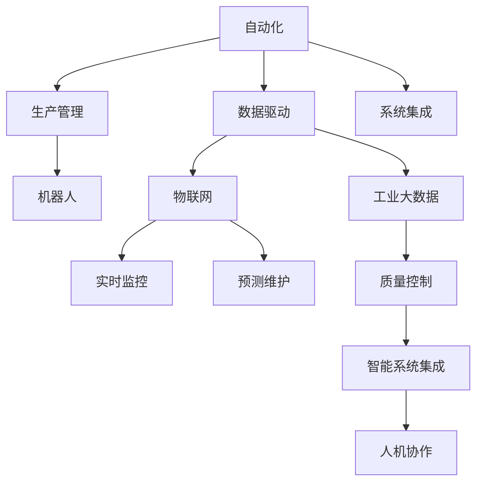
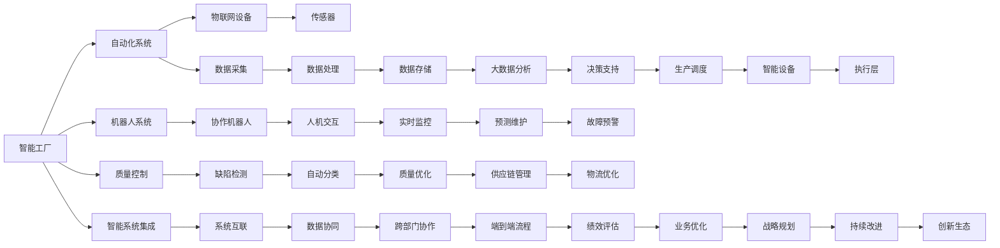

                 

# 智能工厂解决方案：自动化与数据驱动的生产

> 关键词：智能工厂, 自动化, 数据驱动, 生产管理, 机器人, 智能系统, 物联网, 工业大数据

## 1. 背景介绍

### 1.1 问题由来
随着工业4.0的推进，制造业正经历一场深刻的变革。传统的机械化、手工操作模式逐渐被数字化、网络化和智能化所取代。在数字化转型的浪潮中，智能工厂（Smart Factory）应运而生，其核心目标是通过集成智能设备和传感器，构建数据驱动的生产系统，实现实时监控、预测维护、质量控制等自动化功能，提升生产效率和产品质量，降低生产成本。

### 1.2 问题核心关键点
智能工厂的核心在于融合先进制造技术、物联网（IoT）技术、人工智能（AI）和大数据技术，实现生产系统的高度集成与智能化。其关键点包括：

- 自动化生产：通过自动化设备和机器人，实现生产流程的无人工干预。
- 数据驱动决策：依托物联网设备采集的大量数据，通过大数据分析，实现智能调度和优化决策。
- 智能系统集成：将工业大数据与AI算法深度融合，构建高效的生产管理系统。
- 预测维护：通过预测模型和智能传感器，提前预警设备故障，降低停机时间。
- 质量控制：利用AI算法和传感器数据，实现产品缺陷的自动检测和分析。
- 人机协作：在生产线上引入协作机器人，提升生产线的灵活性和安全性。

### 1.3 问题研究意义
智能工厂是制造业数字化转型的重要方向，其意义重大：

1. **提升生产效率**：自动化和智能化技术大幅提升了生产线的作业速度和精准度。
2. **降低生产成本**：减少人工干预和人为错误，节省人力和物料成本。
3. **提高产品质量**：通过实时监控和数据驱动，确保产品质量的一致性和稳定性。
4. **增强企业竞争力**：智能工厂的快速响应和精准决策能力，增强了企业的市场竞争力。
5. **推动产业升级**：智能工厂的应用，带动了制造业整体技术水平和生产模式的升级。
6. **助力可持续发展**：智能工厂的节能减排和资源优化，有助于实现绿色制造。

## 2. 核心概念与联系

### 2.1 核心概念概述

为了更好地理解智能工厂的核心概念及其之间的关系，本节将详细介绍智能工厂的关键技术，包括自动化、数据驱动、生产管理、机器人、物联网、工业大数据等，并使用Mermaid流程图展示它们之间的联系：



### 2.2 核心概念原理和架构的 Mermaid 流程图

以下是智能工厂核心概念的架构流程图：



## 3. 核心算法原理 & 具体操作步骤

### 3.1 算法原理概述

智能工厂的生产管理依赖于一系列复杂的算法和技术，这些算法和技术的核心目标是通过自动化和数据驱动，提升生产效率和产品质量，降低生产成本。以下是智能工厂中常用的核心算法及其原理概述：

- **预测维护算法**：通过历史数据和实时监控数据，构建预测模型，预测设备故障，提前进行维护，减少停机时间。
- **数据驱动调度算法**：基于实时生产数据，优化生产流程和调度，提高生产效率。
- **质量控制算法**：利用传感器数据和AI算法，实现产品缺陷的自动检测和分析。
- **协作机器人路径规划算法**：根据生产任务和设备状态，优化协作机器人的路径和作业顺序。
- **生产流程模拟算法**：通过仿真和模拟，优化生产流程，预测可能出现的问题，提前进行调整。

### 3.2 算法步骤详解

智能工厂的生产管理涉及多个环节，包括自动化设备、传感器、物联网设备、工业大数据分析等。以下以预测维护算法为例，详细介绍其具体操作步骤：

1. **数据采集**：利用传感器和物联网设备，实时采集生产设备的运行数据。
2. **数据清洗与预处理**：对采集的数据进行清洗和预处理，去除异常值和噪声。
3. **特征提取与选择**：从清洗后的数据中提取有用的特征，并使用特征选择算法筛选出对预测有用的特征。
4. **模型构建与训练**：选择合适的预测模型，如线性回归、支持向量机、随机森林等，使用历史数据进行模型训练。
5. **模型评估与优化**：在测试集上评估模型的预测性能，根据评估结果进行模型参数调优和优化。
6. **实时预测与维护**：将训练好的模型部署到生产线上，实时监测设备运行状态，预测潜在故障，并触发维护预警。

### 3.3 算法优缺点

智能工厂的预测维护算法具有以下优点：

- **实时性强**：通过实时数据和快速计算，实现设备故障的即时预警。
- **预测准确率高**：结合历史数据和实时数据，预测模型能够提供较高的预测准确率。
- **维护成本低**：预测维护策略降低了设备故障对生产的影响，减少了非计划停机和维护成本。

同时，该算法也存在以下局限性：

- **数据质量要求高**：数据采集的准确性和完整性对模型预测性能有重要影响。
- **模型复杂度高**：需要处理大量高维数据和复杂模型，计算量较大。
- **对设备变化适应性差**：模型需要定期更新和重新训练，以适应设备状态的动态变化。

### 3.4 算法应用领域

预测维护算法广泛应用于智能工厂的多个领域：

- **设备故障预测**：如生产线上的机械臂、机器人、自动化流水线等。
- **物流优化**：通过预测运输工具的维护需求，优化物流配送和仓储管理。
- **生产调度优化**：通过预测生产线的设备状态，优化生产调度和物料分配。
- **质量控制**：利用传感器数据和AI算法，实现产品质量的实时监控和自动检测。

## 4. 数学模型和公式 & 详细讲解 & 举例说明

### 4.1 数学模型构建

为了实现预测维护算法，我们需要构建一个基于时间的预测模型，用于预测设备未来的运行状态和故障发生概率。以下是模型构建的具体步骤：

1. **定义预测目标**：设定预测的目标变量，如设备故障时间、故障原因等。
2. **特征工程**：构建模型特征，如设备温度、振动、运行时间、历史故障数据等。
3. **模型选择与训练**：选择适合的预测模型，如时间序列模型、支持向量机、随机森林等，使用历史数据进行模型训练。
4. **模型评估**：在测试集上评估模型性能，使用MAE、RMSE等指标衡量预测精度。
5. **预测部署**：将训练好的模型部署到生产线上，实现实时预测和维护预警。

### 4.2 公式推导过程

以下是一个简单的预测维护模型公式推导过程，用于预测设备故障的概率。假设设备在$t$时刻发生故障的概率为$p(t)$，模型的输入特征为$x(t)$，模型输出为预测故障概率$\hat{p}(t)$，则预测模型的公式为：

$$
\hat{p}(t) = f(x(t); \theta)
$$

其中$f(\cdot)$为预测模型的函数形式，$\theta$为模型参数。通过最小化损失函数，如均方误差损失，对模型进行优化：

$$
\min_{\theta} \sum_{t=1}^{T} (y(t) - \hat{p}(t))^2
$$

其中$y(t)$为实际观测的故障概率，$T$为样本数量。通过梯度下降等优化算法，求解最优的模型参数$\theta$。

### 4.3 案例分析与讲解

以某智能工厂的生产线为例，分析预测维护算法的应用。假设生产线上有一台机械臂，利用传感器采集其运行数据，包括温度、振动、电流、历史故障数据等。通过特征工程，构建预测模型$f(x(t); \theta)$，使用历史数据进行训练，并部署到生产线上，实时监测机械臂的运行状态。当预测模型输出故障概率超过预设阈值时，触发维护预警，及时进行设备检修，避免生产中断。

## 5. 项目实践：代码实例和详细解释说明

### 5.1 开发环境搭建

为了进行智能工厂的预测维护算法开发，需要搭建一个完整的开发环境。以下是在Python环境下搭建开发环境的具体步骤：

1. **安装Python**：从官网下载并安装Python 3.8或更高版本。
2. **创建虚拟环境**：使用虚拟环境管理工具（如Anaconda）创建虚拟环境，并激活虚拟环境。
3. **安装必要的库**：使用pip安装Python的科学计算库，如NumPy、Pandas、Scikit-learn等，以及机器学习库，如TensorFlow、PyTorch等。
4. **配置开发环境**：配置开发环境，如设置IDE、设置Python路径等。

### 5.2 源代码详细实现

以下是使用Python和Scikit-learn库实现的预测维护算法代码实现：

```python
import pandas as pd
import numpy as np
from sklearn.model_selection import train_test_split
from sklearn.ensemble import RandomForestRegressor
from sklearn.metrics import mean_squared_error
from sklearn.preprocessing import StandardScaler

# 读取数据
data = pd.read_csv('device_data.csv')

# 数据预处理
features = ['temperature', 'vibration', 'current', 'run_time', 'historical_fault']
target = 'fault_time'

X = data[features]
y = data[target]

# 特征缩放
scaler = StandardScaler()
X_scaled = scaler.fit_transform(X)

# 数据划分
X_train, X_test, y_train, y_test = train_test_split(X_scaled, y, test_size=0.2, random_state=42)

# 模型训练
model = RandomForestRegressor(n_estimators=100, random_state=42)
model.fit(X_train, y_train)

# 模型评估
y_pred = model.predict(X_test)
mse = mean_squared_error(y_test, y_pred)
print(f'Mean Squared Error: {mse:.2f}')

# 实时预测
# 假设有一个新的运行数据点
new_data = np.array([[37, 0.05, 1.2, 200, 1]])
new_data_scaled = scaler.transform(new_data)
prediction = model.predict(new_data_scaled)
print(f'Predicted fault time: {prediction[0]}')
```

### 5.3 代码解读与分析

在上述代码中，我们使用了Pandas库读取设备运行数据，使用Scikit-learn库进行特征工程和模型训练。具体步骤如下：

1. **数据读取与预处理**：读取设备运行数据，选择有用的特征，并进行标准化处理。
2. **模型训练**：使用随机森林模型对设备故障时间进行训练。
3. **模型评估**：在测试集上评估模型性能，使用均方误差指标衡量预测精度。
4. **实时预测**：使用训练好的模型对新的设备运行数据进行实时预测。

## 6. 实际应用场景

### 6.1 智能工厂的生产线管理

智能工厂的预测维护算法在生产线管理中的应用非常广泛。例如，在汽车制造工厂，通过对生产线上的机器人、自动化流水线和各种设备的实时监控，预测设备故障，及时进行维护，减少停机时间，提升生产效率。

### 6.2 物流仓储的优化

物流仓储管理中，通过预测维护算法，可以实时监测运输工具的运行状态，预测可能出现的故障，优化物流配送和仓储管理，提高物流效率。

### 6.3 机器人的路径规划

在协作机器人的路径规划中，通过预测维护算法，可以实时监测协作机器人的运行状态，预测可能出现的故障，优化路径规划，提升机器人作业的稳定性和安全性。

### 6.4 未来应用展望

未来，智能工厂的预测维护算法将在更多领域得到应用，为制造业带来更深层次的变革：

- **智能工厂的全面升级**：结合更多智能设备和传感器，构建更加智能化的生产系统。
- **生产线的自动化与柔性化**：通过预测维护算法，实现生产线的自动化和柔性化，提高生产效率和灵活性。
- **工业大数据的深度挖掘**：通过大数据分析和机器学习，深入挖掘工业数据中的价值，优化生产流程和资源配置。
- **人机协作的智能化**：结合协作机器人与预测维护算法，实现人机协作的智能化，提升生产线的安全性和可靠性。
- **智能工厂的互联互通**：通过工业互联网平台，实现智能工厂与产业链上下游的互联互通，构建更加高效的工业生态系统。

## 7. 工具和资源推荐

### 7.1 学习资源推荐

为了帮助开发者系统掌握智能工厂的核心技术，这里推荐一些优质的学习资源：

1. **《Python深度学习》**：深入浅出地介绍了深度学习的基础知识和应用，适合初学者入门。
2. **《深度学习与机器学习实践》**：涵盖了深度学习、机器学习的基础理论和应用实践，适合进阶学习。
3. **Coursera的《机器学习》课程**：由斯坦福大学教授Andrew Ng讲授，系统讲解了机器学习的基本概念和算法。
4. **Udacity的《机器学习工程师纳米学位》**：提供实战项目，帮助学习者掌握机器学习在实际场景中的应用。
5. **Kaggle竞赛平台**：提供了大量的数据集和竞赛任务，适合进行实践练习和技能提升。

### 7.2 开发工具推荐

以下是几款用于智能工厂开发的常用工具：

1. **TensorFlow**：由Google主导开发的深度学习框架，支持分布式计算和GPU加速，适合大规模深度学习应用。
2. **PyTorch**：由Facebook开发的深度学习框架，支持动态计算图，适合快速原型开发和研究。
3. **Scikit-learn**：Python的科学计算库，提供了丰富的机器学习算法和工具。
4. **Hadoop和Spark**：用于大数据处理的分布式计算框架，支持海量数据的存储和处理。
5. **JIRA和Confluence**：项目管理工具，帮助团队协作和知识共享。
6. **Trello**：任务管理工具，支持团队任务分配和进度跟踪。

### 7.3 相关论文推荐

智能工厂的预测维护算法涉及多个前沿技术，以下是几篇奠基性的相关论文，推荐阅读：

1. **《工业物联网中的机器学习应用》**：介绍了工业物联网中的机器学习应用，包括设备故障预测、供应链优化等。
2. **《基于机器学习的工业预测维护》**：详细介绍了机器学习在工业预测维护中的应用，包括预测模型构建、特征工程等。
3. **《智能工厂中的数据驱动决策》**：讨论了数据驱动在智能工厂中的应用，包括预测维护、生产调度等。
4. **《协作机器人在智能工厂中的应用》**：介绍了协作机器人在智能工厂中的应用，包括路径规划、人机协作等。
5. **《工业大数据分析与预测建模》**：探讨了工业大数据分析在智能工厂中的应用，包括数据分析、模型构建等。

## 8. 总结：未来发展趋势与挑战

### 8.1 研究成果总结

智能工厂的预测维护算法在工业4.0中扮演了重要角色，取得了显著的成果：

- **提升生产效率**：自动化和智能化技术大幅提升了生产线的作业速度和精准度。
- **降低生产成本**：减少人工干预和人为错误，节省人力和物料成本。
- **提高产品质量**：通过实时监控和数据驱动，确保产品质量的一致性和稳定性。
- **增强企业竞争力**：智能工厂的快速响应和精准决策能力，增强了企业的市场竞争力。
- **推动产业升级**：智能工厂的应用，带动了制造业整体技术水平和生产模式的升级。
- **助力可持续发展**：智能工厂的节能减排和资源优化，有助于实现绿色制造。

### 8.2 未来发展趋势

展望未来，智能工厂的预测维护算法将在更多领域得到应用，为制造业带来更深层次的变革：

- **技术的进一步融合**：结合更多前沿技术，如5G、物联网、人工智能等，实现更智能、更高效的生产系统。
- **数据驱动的深度挖掘**：通过大数据分析和机器学习，深入挖掘工业数据中的价值，优化生产流程和资源配置。
- **智能化和柔性化**：通过预测维护算法，实现生产线的智能化和柔性化，提高生产效率和灵活性。
- **人机协作的升级**：结合协作机器人与预测维护算法，实现人机协作的智能化，提升生产线的安全性和可靠性。
- **工业互联网的构建**：通过工业互联网平台，实现智能工厂与产业链上下游的互联互通，构建更加高效的工业生态系统。

### 8.3 面临的挑战

尽管智能工厂的预测维护算法已经取得了一定的成果，但在实现过程中仍面临一些挑战：

- **数据质量和完整性**：数据采集的准确性和完整性对模型预测性能有重要影响，如何保证数据质量是关键。
- **模型的复杂度和计算量**：预测模型需要处理大量高维数据和复杂模型，计算量较大，需要高效的计算资源和算法优化。
- **实时预测的可靠性**：预测维护算法需要在实时数据基础上进行预测，如何保证预测结果的可靠性是重要问题。
- **系统的可扩展性**：随着设备数量的增加，系统需要具备良好的可扩展性和并发处理能力。
- **模型的解释性和透明度**：如何增强模型的解释性和透明度，提高系统的可信任度和可审计性。

### 8.4 研究展望

未来的研究应在以下几个方面寻求新的突破：

- **实时数据的融合和处理**：结合物联网技术，实现实时数据的全面采集和高效处理。
- **模型的动态更新和优化**：开发动态模型更新和优化的技术，保证模型能够实时适应设备状态的变化。
- **跨学科的融合创新**：结合工业工程、机械工程、计算机科学等不同学科的知识，推动跨学科的融合创新。
- **多模态数据融合**：结合传感器数据、视频数据、文本数据等多模态信息，实现全面的数据融合和分析。
- **人机协作的智能化**：通过协作机器人和预测维护算法，实现人机协作的智能化，提升生产线的安全性和可靠性。
- **可持续发展的优化**：结合工业大数据和预测维护算法，优化生产流程和资源配置，推动绿色制造和可持续发展。

## 9. 附录：常见问题与解答

**Q1：智能工厂的预测维护算法是否适用于所有制造业？**

A: 智能工厂的预测维护算法适用于大多数制造业，特别是那些对设备状态监控要求较高、生产流程较为复杂的行业。但对于一些传统的制造业，如纺织、食品等，由于其自动化程度较低，可能不具备大规模应用的条件。

**Q2：预测维护算法需要多少历史数据？**

A: 预测维护算法的模型训练需要大量的历史数据，以获得较好的预测效果。一般建议收集至少1年以上的设备运行数据，并经过特征工程处理，才能构建出有效的预测模型。

**Q3：预测维护算法能否处理非结构化数据？**

A: 预测维护算法主要处理结构化数据，如传感器数据、运行日志等。对于非结构化数据，如文本、视频等，需要先进行预处理和特征提取，才能用于模型训练和预测。

**Q4：如何保证预测维护算法的实时性？**

A: 预测维护算法的实时性依赖于数据采集的频率和模型计算的速度。通过优化数据采集频率和模型结构，可以提高预测的实时性。同时，使用分布式计算和GPU加速等技术，也可以提升模型的计算速度。

**Q5：智能工厂的预测维护算法需要哪些硬件资源？**

A: 智能工厂的预测维护算法需要高性能的计算资源，包括GPU、分布式计算集群等。同时，还需要高性能的存储设备，如SSD，以支持大规模数据的存储和处理。

---

作者：禅与计算机程序设计艺术 / Zen and the Art of Computer Programming

