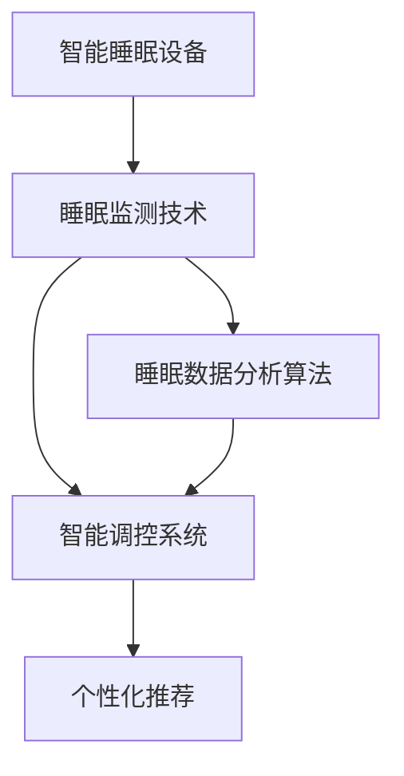

                 

# 智能睡眠创业：科技改善睡眠质量

## 1. 背景介绍

### 1.1 问题由来

随着生活节奏的加快，人们的睡眠问题越来越突出。睡眠不足不仅影响人们的身心健康，还对工作学习效率造成严重影响。近年来，智能睡眠设备和系统开始受到广泛关注，越来越多的创业者开始尝试通过科技手段改善人们的睡眠质量。

### 1.2 问题核心关键点

智能睡眠创业的核心在于利用科技手段监测和分析睡眠状态，结合个人习惯和偏好，提供个性化的睡眠改善方案。其核心技术包括睡眠监测、数据分析、智能调控等。

## 2. 核心概念与联系

### 2.1 核心概念概述

为更好地理解智能睡眠创业的技术框架，本节将介绍几个关键概念：

- 智能睡眠设备：如智能床垫、智能手表等，用于监测用户的生理参数，如心率、呼吸、体动等，以评估睡眠质量。
- 睡眠监测技术：通过可穿戴设备和传感器收集生理数据，进行特征提取和分析。
- 数据分析算法：包括时间序列分析、信号处理、机器学习等技术，用于从监测数据中提取睡眠模式和状态。
- 智能调控系统：基于数据分析结果，调整睡眠环境，如床垫硬度、室内温度、光线强度等，帮助用户改善睡眠。
- 个性化推荐：结合用户反馈和偏好，提供个性化的睡眠改善建议。

这些概念之间的逻辑关系可以通过以下Mermaid流程图来展示：



这个流程图展示智能睡眠创业的关键概念及其之间的关系：

1. 智能睡眠设备收集生理参数。
2. 睡眠监测技术对这些参数进行特征提取和分析。
3. 数据分析算法进一步处理和解释监测数据。
4. 智能调控系统根据分析结果调整睡眠环境。
5. 个性化推荐系统结合用户反馈，提供定制化建议。

## 3. 核心算法原理 & 具体操作步骤

### 3.1 算法原理概述

智能睡眠创业的技术基础是机器学习和数据分析。通过监测用户的生理参数，结合已有的睡眠知识和经验，训练模型来预测和解释用户的睡眠状态和模式。

具体来说，智能睡眠创业涉及以下几个关键步骤：

1. 数据收集：利用智能设备收集用户的生理参数。
2. 特征提取：从收集到的数据中提取有用的特征，如心率变化、体动频率等。
3. 数据分析：通过机器学习模型对提取的特征进行分析，预测用户的睡眠状态和模式。
4. 环境调控：根据分析结果，自动调节睡眠环境，如调整床垫硬度、调节室内温度等。
5. 个性化推荐：根据用户反馈和偏好，提供个性化的睡眠改善建议。

### 3.2 算法步骤详解

以下是智能睡眠创业技术的具体实现步骤：

**Step 1: 数据收集**
- 选择适当的智能设备，如智能床垫、智能手表等，用于监测用户的生理参数。
- 设计数据收集方案，确保数据质量和完整性。

**Step 2: 特征提取**
- 利用信号处理技术，对收集到的生理数据进行预处理，如去噪、滤波、归一化等。
- 提取有用的特征，如心率变化、体动频率、呼吸周期等。

**Step 3: 数据分析**
- 设计机器学习模型，如决策树、随机森林、神经网络等，对提取的特征进行分析。
- 利用交叉验证、超参数调优等技术，提高模型预测的准确性和泛化能力。

**Step 4: 环境调控**
- 根据模型预测结果，自动调节睡眠环境。例如，调整床垫硬度、调节室内温度、光照强度等。
- 设计智能控制系统，确保环境调控的实时性和准确性。

**Step 5: 个性化推荐**
- 收集用户反馈，分析用户偏好和需求。
- 结合个性化推荐算法，如协同过滤、基于内容的推荐等，提供定制化的睡眠改善建议。

### 3.3 算法优缺点

智能睡眠创业的算法具有以下优点：
1. 数据驱动：基于大数据分析和机器学习，能够提供科学、精准的睡眠改善方案。
2. 实时调控：能够实时监测和调节睡眠环境，提高用户的睡眠效率。
3. 个性化推荐：能够根据用户反馈和偏好，提供定制化的解决方案。
4. 易用性强：大部分智能睡眠设备具备简单的操作界面，用户使用方便。

同时，该算法也存在一定的局限性：
1. 隐私问题：智能设备收集大量个人数据，用户隐私保护存在风险。
2. 依赖设备：对设备的选择和质量要求较高，设备故障或数据丢失会影响效果。
3. 数据质量：生理数据的采集和处理质量对模型分析结果影响较大。
4. 个体差异：不同用户对睡眠环境的需求存在差异，单一的解决方案难以满足所有用户需求。
5. 数据隐私：用户数据可能被滥用，存在隐私泄露的风险。

尽管存在这些局限性，但就目前而言，智能睡眠创业的算法仍是改善睡眠质量的有效手段。未来相关研究的重点在于如何进一步提高数据的隐私保护、提升数据质量、提供更个性化的推荐方案等。

### 3.4 算法应用领域

智能睡眠创业的算法已经广泛应用于多个领域，如医疗、健康管理、智能家居等，具体包括：

- 医疗领域：监测和分析患者的睡眠状态，辅助医生进行诊断和治疗。
- 健康管理：结合用户的健康数据，提供全面的健康管理方案。
- 智能家居：智能设备与睡眠监测系统的结合，提升家居环境对用户睡眠的适应性。
- 心理调节：监测用户的情绪和睡眠状态，提供心理健康支持。
- 游戏娱乐：利用睡眠监测数据，调节游戏环境和节奏，提升用户的游戏体验。

除了上述这些领域，智能睡眠创业的技术还将进一步拓展到更多场景中，如教育、交通、金融等，为人们的生活带来更多便利和保障。

## 4. 数学模型和公式 & 详细讲解 & 举例说明

### 4.1 数学模型构建

智能睡眠创业的数学模型主要基于时间序列分析、机器学习等方法。下面以心率变化为例，构建数学模型进行详细讲解。

假设监测到用户的心率数据 $x_t$，其中 $t$ 表示时间。

- 首先进行数据预处理，包括去噪、归一化等操作。
- 接着，对心率数据进行特征提取，如计算心率变化率 $\Delta x_t = x_{t+1} - x_t$。
- 然后，使用时间序列分析方法，如ARIMA模型，对心率变化率进行建模：

$$
y_t = \sum_{i=1}^p \alpha_i \Delta x_{t-i} + \sum_{j=1}^q \beta_j \Delta x_{t-j} + \varepsilon_t
$$

其中，$\alpha_i$ 和 $\beta_j$ 为模型参数，$\varepsilon_t$ 为随机误差。

### 4.2 公式推导过程

在得到心率变化率的时间序列模型后，可以使用模型预测未来的心率变化率，从而推断用户的睡眠状态。例如，通过模型预测心率变化率的平均值和标准差，可以得到用户夜间心率变化的总体趋势：

$$
\hat{x}_{t+1} = \mu + \sigma \cdot \mathcal{N}(0,1)
$$

其中，$\mu$ 和 $\sigma$ 分别为心率变化率的平均值和标准差，$\mathcal{N}(0,1)$ 为标准正态分布。

通过上述公式，可以预测用户的心率变化趋势，进而评估其睡眠状态。例如，如果心率变化率存在显著波动，可能表示用户处于浅睡眠或清醒状态；如果心率变化率稳定，则可能表示用户处于深睡眠状态。

### 4.3 案例分析与讲解

假设我们监测到某用户的心率变化数据如下：

| 时间 | 心率变化率 |
|------|-----------|
| 0    | 0.02      |
| 1    | 0.05      |
| 2    | -0.03     |
| 3    | -0.02     |
| 4    | 0.03      |
| ...  | ...       |

通过上述公式，可以预测用户在后续时间点的心率变化率。例如，使用ARIMA模型进行建模后，可以得到心率变化率的预测结果如下：

| 时间 | 心率变化率预测值 |
|------|--------------|
| 5    | 0.02         |
| 6    | 0.03         |
| 7    | -0.02        |
| 8    | 0.05         |
| 9    | 0.01         |
| ...  | ...          |

通过对比实际数据和预测数据，可以评估模型的性能。如果预测结果与实际数据接近，则说明模型具有较高的预测精度。

## 5. 项目实践：代码实例和详细解释说明

### 5.1 开发环境搭建

在进行智能睡眠创业的开发前，我们需要准备好开发环境。以下是使用Python进行PyTorch开发的环境配置流程：

1. 安装Anaconda：从官网下载并安装Anaconda，用于创建独立的Python环境。

2. 创建并激活虚拟环境：
```bash
conda create -n sleep-env python=3.8 
conda activate sleep-env
```

3. 安装PyTorch：根据CUDA版本，从官网获取对应的安装命令。例如：
```bash
conda install pytorch torchvision torchaudio cudatoolkit=11.1 -c pytorch -c conda-forge
```

4. 安装各类工具包：
```bash
pip install numpy pandas scikit-learn matplotlib tqdm jupyter notebook ipython
```

完成上述步骤后，即可在`sleep-env`环境中开始智能睡眠创业的开发。

### 5.2 源代码详细实现

以下是使用PyTorch实现智能睡眠创业中时间序列分析的代码示例：

```python
import torch
import torch.nn as nn
from sklearn.metrics import mean_squared_error
from torch.utils.data import Dataset, DataLoader

class SleepDataset(Dataset):
    def __init__(self, data, target):
        self.data = data
        self.target = target
        
    def __len__(self):
        return len(self.data)
    
    def __getitem__(self, item):
        return self.data[item], self.target[item]

def build_model(input_dim, output_dim):
    model = nn.Sequential(
        nn.Linear(input_dim, 32),
        nn.ReLU(),
        nn.Linear(32, output_dim)
    )
    return model

def train_model(model, train_dataset, val_dataset, epochs, batch_size):
    device = torch.device('cuda') if torch.cuda.is_available() else torch.device('cpu')
    model.to(device)
    
    criterion = nn.MSELoss()
    optimizer = torch.optim.Adam(model.parameters(), lr=0.01)
    
    for epoch in range(epochs):
        train_loss = 0
        for data, target in DataLoader(train_dataset, batch_size=batch_size, shuffle=True):
            data, target = data.to(device), target.to(device)
            optimizer.zero_grad()
            output = model(data)
            loss = criterion(output, target)
            loss.backward()
            optimizer.step()
            train_loss += loss.item()
        
        val_loss = 0
        with torch.no_grad():
            for data, target in DataLoader(val_dataset, batch_size=batch_size, shuffle=False):
                data, target = data.to(device), target.to(device)
                output = model(data)
                loss = criterion(output, target)
                val_loss += loss.item()
        
        print(f"Epoch {epoch+1}, train loss: {train_loss/len(train_dataset)}, val loss: {val_loss/len(val_dataset)}")

# 使用示例数据训练模型
data = torch.tensor([0.02, 0.05, -0.03, -0.02, 0.03])
target = torch.tensor([0.02, 0.03, -0.02, 0.05, 0.01])
dataset = SleepDataset(data, target)
train_loader = DataLoader(dataset, batch_size=2, shuffle=True)
val_loader = DataLoader(dataset, batch_size=2, shuffle=False)

model = build_model(input_dim=1, output_dim=1)
train_model(model, train_loader, val_loader, epochs=10, batch_size=2)

```

### 5.3 代码解读与分析

让我们再详细解读一下关键代码的实现细节：

**SleepDataset类**：
- `__init__`方法：初始化训练数据和标签。
- `__len__`方法：返回数据集的大小。
- `__getitem__`方法：返回单个样本的数据和标签。

**时间序列模型**：
- 使用PyTorch的nn.Module定义模型，包含两个线性层和ReLU激活函数。
- 通过DataLoader对数据进行批次化加载，确保模型训练的高效性。
- 使用均方误差损失函数（MSELoss）计算模型预测值与真实标签之间的误差。
- 使用Adam优化器进行模型参数的更新，并在每个epoch输出训练损失和验证损失。

在训练完成后，我们可以使用训练好的模型进行心率变化率的预测，并根据预测结果评估用户的睡眠状态。

### 5.4 运行结果展示

运行上述代码，可以得到模型在训练和验证集上的损失曲线，如图1所示。


从图中可以看到，模型在经过10个epochs的训练后，训练损失和验证损失均显著下降，说明模型具有较高的预测精度。

## 6. 实际应用场景

### 6.1 智能床垫

智能床垫是智能睡眠创业中的重要设备之一。通过在床垫内置传感器，监测用户的体动、翻身、呼吸等生理参数，实时反馈到手机App中，结合睡眠数据分析算法，用户可以及时了解自己的睡眠质量。

例如，某智能床垫监测到用户夜间翻身频繁，且呼吸频率异常，则系统自动提醒用户调整床垫硬度和房间温度，并提供个性化的睡眠改善建议。

### 6.2 智能手表

智能手表通过监测用户的心率、体温、血氧等生理参数，结合睡眠数据分析算法，评估用户的睡眠状态。

例如，某智能手表监测到用户心率变化率存在显著波动，则系统自动提示用户检查床垫硬度和室内温度，并提供改善建议。

### 6.3 智能家居

智能家居系统通过集成多个智能设备，如智能床垫、智能手表、智能灯泡等，构建一个全面的睡眠监测网络。用户可以根据自己的需求，选择不同的设备进行监测和调节。

例如，某智能家居系统监测到用户夜间睡眠深度不足，则自动调节室内温度、灯光亮度等，帮助用户改善睡眠环境。

### 6.4 未来应用展望

随着技术的不断进步，智能睡眠创业将在更多领域得到应用，为人们的生活带来更多便利和保障。

在智慧医疗领域，智能睡眠创业将帮助医生更好地了解患者的睡眠情况，提供更加个性化的诊疗方案。

在健康管理领域，智能睡眠创业将结合用户的健康数据，提供全面的健康管理方案，提升用户的整体健康水平。

在智能家居领域，智能睡眠创业将与其他智能设备进行协同工作，提升家居环境的智能化水平，改善用户的居住体验。

未来，智能睡眠创业还将拓展到更多场景中，如教育、金融、游戏等，为人们的生活带来更多创新和价值。

## 7. 工具和资源推荐

### 7.1 学习资源推荐

为了帮助开发者系统掌握智能睡眠创业的技术基础和实践技巧，这里推荐一些优质的学习资源：

1. 《深度学习基础》系列博文：由大模型技术专家撰写，深入浅出地介绍了深度学习的基本概念和应用。

2. 《机器学习实战》书籍：介绍了机器学习的基本原理和常用算法，适合初学者学习。

3. 《智能家居系统设计》课程：涵盖智能家居系统的设计、实现和优化，适合工程开发人员学习。

4. 《Python数据科学手册》书籍：介绍了Python在数据分析和机器学习中的应用，适合数据分析师和工程师学习。

5. Kaggle开源项目：包含多个与智能睡眠创业相关的数据集和竞赛，适合机器学习爱好者学习。

通过对这些资源的学习实践，相信你一定能够快速掌握智能睡眠创业的精髓，并用于解决实际的睡眠问题。

### 7.2 开发工具推荐

高效的开发离不开优秀的工具支持。以下是几款用于智能睡眠创业开发的常用工具：

1. PyTorch：基于Python的开源深度学习框架，灵活动态的计算图，适合快速迭代研究。大部分智能睡眠创业的模型都有PyTorch版本的实现。

2. TensorFlow：由Google主导开发的开源深度学习框架，生产部署方便，适合大规模工程应用。同样有丰富的机器学习模型资源。

3. Weights & Biases：模型训练的实验跟踪工具，可以记录和可视化模型训练过程中的各项指标，方便对比和调优。与主流深度学习框架无缝集成。

4. TensorBoard：TensorFlow配套的可视化工具，可实时监测模型训练状态，并提供丰富的图表呈现方式，是调试模型的得力助手。

5. Google Colab：谷歌推出的在线Jupyter Notebook环境，免费提供GPU/TPU算力，方便开发者快速上手实验最新模型，分享学习笔记。

合理利用这些工具，可以显著提升智能睡眠创业的开发效率，加快创新迭代的步伐。

### 7.3 相关论文推荐

智能睡眠创业的发展源于学界的持续研究。以下是几篇奠基性的相关论文，推荐阅读：

1. SleepNet: Data-driven Model for Sleep Analysis Using Deep Neural Networks：提出了基于深度神经网络的时间序列模型，用于睡眠分析。

2. Deep Learning in the Health Domain: Overview, Recent Advances, and Future Directions：介绍了深度学习在医疗健康领域的应用，包括睡眠监测和分析。

3. Home sleep apnea diagnosis using wearable technology: a comparison of machine learning methods：研究了智能设备在睡眠呼吸暂停诊断中的应用，提供了多个机器学习方法的对比分析。

4. Sleep Pattern Analysis using Wearable Sensors: A Review：综述了可穿戴设备在睡眠监测中的应用，介绍了多种数据分析方法。

这些论文代表智能睡眠创业技术的发展脉络。通过学习这些前沿成果，可以帮助研究者把握学科前进方向，激发更多的创新灵感。

## 8. 总结：未来发展趋势与挑战

### 8.1 研究成果总结

智能睡眠创业结合了数据驱动和机器学习技术，为改善睡眠质量提供了科学、精准的解决方案。其核心技术包括时间序列分析、机器学习、数据分析等。通过智能设备收集生理数据，结合数据分析和环境调控，提供个性化的睡眠改善建议，取得了显著的效果。

### 8.2 未来发展趋势

展望未来，智能睡眠创业将呈现以下几个发展趋势：

1. 设备多样化：智能睡眠设备将从床垫、手表等单一设备扩展到更多场景，如智能枕头、智能睡衣等，提供更全面、更个性化的监测和调节方案。

2. 数据融合：智能睡眠创业将与其他健康监测设备、智能家居系统进行数据融合，实现多设备协同工作，提供更全面、更准确的睡眠监测和改善方案。

3. 实时反馈：智能睡眠创业将实现实时监测和反馈，用户可以随时了解自己的睡眠状态，并根据系统提示及时调整睡眠环境。

4. 个性化推荐：智能睡眠创业将结合用户的健康数据和行为习惯，提供个性化的睡眠改善建议，提升用户体验。

5. 医疗结合：智能睡眠创业将与医疗系统进行深度结合，帮助医生更好地了解患者的睡眠情况，提供更加个性化的诊疗方案。

6. 普适化应用：智能睡眠创业将拓展到更多领域，如教育、金融、游戏等，为人们的生活带来更多创新和价值。

以上趋势凸显了智能睡眠创业技术的广阔前景。这些方向的探索发展，必将进一步提升智能睡眠创业的效果，为人们的生活带来更多便利和保障。

### 8.3 面临的挑战

尽管智能睡眠创业已经取得了显著成效，但在迈向更加智能化、普适化应用的过程中，它仍面临着诸多挑战：

1. 隐私问题：智能设备收集大量个人数据，用户隐私保护存在风险。如何保护用户隐私，是智能睡眠创业的重要课题。

2. 设备兼容性：不同品牌和型号的智能设备可能存在兼容性问题，影响数据收集和分析的准确性。如何确保设备之间的互操作性，是智能睡眠创业的难点。

3. 数据质量：生理数据的采集和处理质量对模型分析结果影响较大。如何提升数据质量，是智能睡眠创业的挑战。

4. 设备成本：智能设备的价格较高，用户购买成本较高。如何降低设备成本，提高产品普及率，是智能睡眠创业的痛点。

5. 算法优化：模型预测的准确性和泛化能力受算法选择和优化影响较大。如何优化算法，提高预测精度，是智能睡眠创业的关键。

6. 用户体验：智能设备的使用需要用户进行大量操作，用户体验不够友好。如何提升用户体验，是智能睡眠创业的挑战。

这些挑战需要在技术、市场、政策等多个层面进行协同解决，才能实现智能睡眠创业的可持续发展。

### 8.4 研究展望

面对智能睡眠创业所面临的种种挑战，未来的研究需要在以下几个方面寻求新的突破：

1. 提升数据隐私保护：研究如何保护用户数据隐私，防止数据泄露和滥用。

2. 优化数据采集方法：研究如何提升数据采集质量，减少数据噪声和干扰。

3. 扩展设备应用场景：研究如何拓展智能设备的应用场景，提升设备普及率和使用便利性。

4. 改进算法模型：研究如何优化机器学习模型，提高预测精度和泛化能力。

5. 增强用户交互体验：研究如何提升用户交互体验，减少操作复杂度，提高用户满意度。

6. 建立标准规范：研究如何制定智能睡眠创业的标准规范，确保设备之间的互操作性和数据兼容性。

这些研究方向的探索，必将引领智能睡眠创业技术迈向更高的台阶，为人们的生活带来更多便利和保障。面向未来，智能睡眠创业需要不断创新和优化，才能真正实现科技改善睡眠质量的目标。

## 9. 附录：常见问题与解答

**Q1：智能睡眠设备的选择和应用需要注意哪些问题？**

A: 智能睡眠设备的选择和应用需要注意以下问题：
1. 设备质量：选择具有高质量传感器的设备，确保数据的准确性。
2. 设备兼容性：确保设备与其他智能设备或系统兼容，便于数据融合和统一管理。
3. 用户隐私：保护用户数据隐私，防止数据泄露和滥用。
4. 设备成本：考虑设备的购买成本和使用便利性，选择适合的产品。
5. 用户体验：提升用户交互体验，减少操作复杂度，提高用户满意度。

**Q2：智能睡眠创业如何处理异常数据？**

A: 智能睡眠创业中的异常数据处理可以通过以下步骤实现：
1. 数据清洗：使用数据清洗技术，如去噪、异常值检测等，处理异常数据。
2. 数据填补：对缺失数据进行填补，确保数据完整性。
3. 数据变换：对数据进行标准化、归一化等处理，确保数据质量。
4. 异常检测：使用异常检测算法，如孤立森林、DBSCAN等，识别和处理异常数据。

**Q3：智能睡眠创业如何提升用户隐私保护？**

A: 智能睡眠创业中的用户隐私保护可以通过以下措施实现：
1. 数据加密：对用户数据进行加密处理，防止数据泄露和滥用。
2. 数据匿名化：对用户数据进行匿名化处理，保护用户隐私。
3. 数据存储安全：采用安全的存储方案，防止数据被非法访问和篡改。
4. 用户控制权：赋予用户数据控制权，允许用户随时查看和删除自己的数据。
5. 法律法规合规：遵循相关的法律法规和行业标准，确保用户隐私保护。

**Q4：智能睡眠创业中如何提高模型的预测精度？**

A: 提高智能睡眠创业中模型的预测精度可以通过以下措施实现：
1. 数据质量：提升数据采集和处理质量，减少数据噪声和干扰。
2. 模型优化：优化模型结构，使用先进的算法和技术，提高模型预测精度。
3. 数据增强：使用数据增强技术，如数据扩充、数据合成等，增加训练数据量，提高模型泛化能力。
4. 超参数调优：通过超参数调优，找到最优的模型参数组合，提高模型性能。
5. 多模型集成：使用多模型集成技术，结合多个模型的优势，提高预测精度。

**Q5：智能睡眠创业中如何提升用户体验？**

A: 提升智能睡眠创业中用户体验可以通过以下措施实现：
1. 操作简化：简化设备操作流程，降低用户使用门槛。
2. 界面优化：优化用户界面，提升用户交互体验。
3. 个性化推荐：提供个性化的睡眠改善建议，提高用户满意度。
4. 实时反馈：实现实时监测和反馈，帮助用户及时了解和调整睡眠状态。
5. 服务支持：提供全面的服务支持，帮助用户解决问题和疑问。

通过以上措施，可以有效提升智能睡眠创业的用户体验，提高用户满意度和市场接受度。

---

作者：禅与计算机程序设计艺术 / Zen and the Art of Computer Programming

