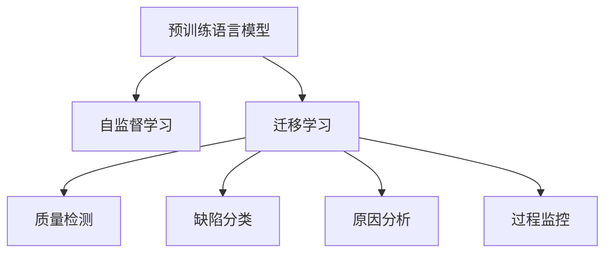

                 

## 1. 背景介绍

### 1.1 问题由来

制造业是国民经济的重要基础，其产品质量直接关系到消费者的切身利益和企业的市场竞争力。传统的质量控制方法依赖人工检测和质量记录，存在效率低、成本高、误差大等缺点。随着人工智能技术的发展，智能质量控制逐渐成为制造业转型升级的重要方向。

近年来，预训练语言模型（LLM）在自然语言处理（NLP）领域取得了显著进展。通过在大规模无标签文本数据上进行预训练，LLM获得了强大的语言理解和生成能力，能够理解和生成自然语言文本，并从中提取有价值的信息。将这些技术应用于制造业的质量控制领域，可以显著提高检测效率、降低成本、提升检测精度和可靠性。

### 1.2 问题核心关键点

智能质量控制的主要任务包括质量检测、缺陷分类、原因分析、过程监控等。传统方法通过人工经验或固定的检测规则进行，难以应对复杂多变的环境和产品结构。而基于大语言模型的智能质量控制，能够通过自然语言理解和生成能力，自动提取特征、分类缺陷、生成报告，实现高效、准确、智能化的质量控制。

智能质量控制的核心关键点包括：
- 大规模无标签文本预训练：通过无标签文本预训练，获取丰富的语言知识。
- 自然语言理解与生成：利用自然语言理解技术，从文本中提取特征；利用自然语言生成技术，生成检测报告和修复方案。
- 自监督学习与迁移学习：在已有预训练模型的基础上，进行自监督学习与迁移学习，提升模型在新任务上的泛化能力。
- 高可靠性和可解释性：通过模型优化与数据增强，提高模型鲁棒性和可解释性，确保决策过程透明可信。

## 2. 核心概念与联系

### 2.1 核心概念概述

为更好地理解大语言模型在制造业中的应用，本节将介绍几个密切相关的核心概念：

- 预训练语言模型（LLM）：以自回归（如GPT）或自编码（如BERT）模型为代表的大规模预训练语言模型。通过在大规模无标签文本语料上进行预训练，学习通用的语言表示，具备强大的语言理解和生成能力。
- 自监督学习（Self-Supervised Learning, SSL）：指通过在无标签数据上进行学习，获取模型知识的一种学习方式。在预训练阶段，通过构建掩码语言模型、预测下一位词等自监督任务，训练大语言模型。
- 迁移学习（Transfer Learning）：指将一个领域学习到的知识，迁移应用到另一个不同但相关的领域的学习范式。在大语言模型的微调过程中，可以利用其预训练得到的通用知识，在新任务上实现快速、高效的学习。
- 质量检测（Quality Inspection）：通过检测手段，对产品或零部件进行质量评估，判断是否符合规定标准。基于LLM的智能质量检测，可以自动解析产品说明书、规格书、工艺参数等文本，提取关键信息，进行质量评估。
- 缺陷分类（Defect Classification）：将检测出的质量问题进行分类，识别出具体的缺陷类型。LLM可以自动解析检测结果，提取特征，进行多类别分类。
- 原因分析（Cause Analysis）：对检测出的缺陷进行分析，找出导致缺陷产生的原因。LLM可以从检测报告、历史数据、工艺参数中提取信息，生成定量的原因分析报告。
- 过程监控（Process Monitoring）：实时监控生产过程，检测生产过程中的异常情况，及时发现和纠正问题。LLM可以实时解析生产日志、报警信息等文本，提取关键信息，进行异常检测。

这些核心概念之间的逻辑关系可以通过以下Mermaid流程图来展示：



这个流程图展示了大语言模型在制造业中的应用框架：

1. 通过预训练语言模型获取通用语言知识。
2. 在自监督学习阶段，利用无标签数据进行模型训练，获取模型知识。
3. 在迁移学习阶段，利用预训练模型在新任务上进行微调，提升模型性能。
4. 通过质量检测、缺陷分类、原因分析、过程监控等任务，实现智能质量控制。

## 3. 核心算法原理 & 具体操作步骤

### 3.1 算法原理概述

基于预训练语言模型的智能质量控制，本质上是一种基于NLP技术的自监督学习和迁移学习过程。其核心思想是：将预训练语言模型作为特征提取器，通过自监督学习获得语言特征知识，再通过迁移学习，将其在新任务上进行微调，实现质量检测、缺陷分类、原因分析等智能任务。

具体而言，假设预训练语言模型为 $M_{\theta}$，其中 $\theta$ 为预训练得到的模型参数。给定制造行业相关文本数据 $D=\{(x_i,y_i)\}_{i=1}^N$，其中 $x_i$ 为文本描述，$y_i$ 为产品检测结果（如合格、不合格），质量控制的目标是找到新的模型参数 $\hat{\theta}$，使得：

$$
\hat{\theta}=\mathop{\arg\min}_{\theta} \mathcal{L}(M_{\theta},D)
$$

其中 $\mathcal{L}$ 为针对质量检测、缺陷分类等任务设计的损失函数，用于衡量模型预测输出与真实标签之间的差异。常见的损失函数包括交叉熵损失、均方误差损失等。

### 3.2 算法步骤详解

基于预训练语言模型的智能质量控制一般包括以下几个关键步骤：

**Step 1: 准备预训练模型和数据集**
- 选择合适的预训练语言模型 $M_{\theta}$ 作为初始化参数，如 BERT、GPT 等。
- 准备质量控制相关的文本数据集 $D$，包括产品说明书、工艺参数、生产日志等。

**Step 2: 添加任务适配层**
- 根据任务类型，在预训练模型顶层设计合适的输出层和损失函数。
- 对于质量检测任务，通常在顶层添加分类器，使用交叉熵损失函数。
- 对于缺陷分类任务，通常使用多分类器，使用交叉熵损失函数。
- 对于原因分析任务，通常使用序列生成模型，使用BLEU、ROUGE等文本相似度指标。

**Step 3: 设置微调超参数**
- 选择合适的优化算法及其参数，如 AdamW、SGD 等，设置学习率、批大小、迭代轮数等。
- 设置正则化技术及强度，包括权重衰减、Dropout、Early Stopping等。
- 确定冻结预训练参数的策略，如仅微调顶层，或全部参数都参与微调。

**Step 4: 执行梯度训练**
- 将训练集数据分批次输入模型，前向传播计算损失函数。
- 反向传播计算参数梯度，根据设定的优化算法和学习率更新模型参数。
- 周期性在验证集上评估模型性能，根据性能指标决定是否触发 Early Stopping。
- 重复上述步骤直到满足预设的迭代轮数或 Early Stopping 条件。

**Step 5: 测试和部署**
- 在测试集上评估微调后模型 $M_{\hat{\theta}}$ 的性能，对比微调前后的精度提升。
- 使用微调后的模型对新样本进行推理预测，集成到实际的质量控制系统中。
- 持续收集新的数据，定期重新微调模型，以适应数据分布的变化。

以上是基于预训练语言模型的智能质量控制的一般流程。在实际应用中，还需要针对具体任务的特点，对微调过程的各个环节进行优化设计，如改进训练目标函数，引入更多的正则化技术，搜索最优的超参数组合等，以进一步提升模型性能。

### 3.3 算法优缺点

基于预训练语言模型的智能质量控制方法具有以下优点：
1. 通用适用。适用于各种制造行业的质量检测、缺陷分类、原因分析等任务，设计简单的任务适配层即可实现微调。
2. 自动提取特征。通过自然语言理解技术，自动从文本中提取关键特征，减少人工标注的工作量。
3. 快速适应新任务。在已有预训练模型的基础上，通过微调即可快速适应新任务，缩短开发周期。
4. 高度可解释。自然语言模型的决策过程可解释性强，便于理解、调试和改进。
5. 扩展性强。可以结合多种传感器数据，实现多模态的质量控制。

同时，该方法也存在一定的局限性：
1. 依赖高质量数据。微调的效果很大程度上取决于标注数据的质量和数量，获取高质量标注数据的成本较高。
2. 模型复杂度高。预训练语言模型的参数量巨大，对计算资源和存储空间要求较高。
3. 泛化能力有限。当目标任务与预训练数据的分布差异较大时，微调的性能提升有限。
4. 计算开销大。在训练和推理过程中，计算资源消耗较大，对实时性要求较高。

尽管存在这些局限性，但就目前而言，基于预训练语言模型的智能质量控制方法仍是大规模、自动化质量控制的重要范式。未来相关研究的重点在于如何进一步降低对标注数据的依赖，提高模型的少样本学习和跨领域迁移能力，同时兼顾可解释性和计算效率等因素。

### 3.4 算法应用领域

基于预训练语言模型的智能质量控制方法，已经在制造业的多个领域得到了应用，例如：

- 电子产品检测：利用自然语言理解和生成技术，检测电子产品的质量问题。
- 汽车制造：对汽车零部件进行质量检测和缺陷分类，提高生产效率。
- 食品加工：检测食品的合格与否，保证食品安全。
- 航空制造：对航空零部件进行检测和原因分析，确保飞机安全。
- 制药行业：检测药品的合格性，提高药品质量。
- 金属加工：检测金属零部件的质量和缺陷，提高生产效率。

除了上述这些经典任务外，基于预训练语言模型的智能质量控制方法，还可以应用于更多场景中，如智能仓储、智能物流、智能运维等，为制造业的智能化转型提供新的技术路径。

## 4. 数学模型和公式 & 详细讲解 & 举例说明

### 4.1 数学模型构建

本节将使用数学语言对基于预训练语言模型的智能质量控制过程进行更加严格的刻画。

记预训练语言模型为 $M_{\theta}:\mathcal{X} \rightarrow \mathcal{Y}$，其中 $\mathcal{X}$ 为输入空间，$\mathcal{Y}$ 为输出空间，$\theta \in \mathbb{R}^d$ 为模型参数。假设质量控制任务的训练集为 $D=\{(x_i,y_i)\}_{i=1}^N, x_i \in \mathcal{X}, y_i \in \mathcal{Y}$。

定义模型 $M_{\theta}$ 在数据样本 $(x,y)$ 上的损失函数为 $\ell(M_{\theta}(x),y)$，则在数据集 $D$ 上的经验风险为：

$$
\mathcal{L}(\theta) = \frac{1}{N} \sum_{i=1}^N \ell(M_{\theta}(x_i),y_i)
$$

微调的优化目标是最小化经验风险，即找到最优参数：

$$
\theta^* = \mathop{\arg\min}_{\theta} \mathcal{L}(\theta)
$$

在实践中，我们通常使用基于梯度的优化算法（如SGD、Adam等）来近似求解上述最优化问题。设 $\eta$ 为学习率，$\lambda$ 为正则化系数，则参数的更新公式为：

$$
\theta \leftarrow \theta - \eta \nabla_{\theta}\mathcal{L}(\theta) - \eta\lambda\theta
$$

其中 $\nabla_{\theta}\mathcal{L}(\theta)$ 为损失函数对参数 $\theta$ 的梯度，可通过反向传播算法高效计算。

### 4.2 公式推导过程

以下我们以二分类任务（如合格不合格检测）为例，推导交叉熵损失函数及其梯度的计算公式。

假设模型 $M_{\theta}$ 在输入 $x$ 上的输出为 $\hat{y}=M_{\theta}(x) \in [0,1]$，表示样本属于正类的概率。真实标签 $y \in \{0,1\}$。则二分类交叉熵损失函数定义为：

$$
\ell(M_{\theta}(x),y) = -[y\log \hat{y} + (1-y)\log (1-\hat{y})]
$$

将其代入经验风险公式，得：

$$
\mathcal{L}(\theta) = -\frac{1}{N}\sum_{i=1}^N [y_i\log M_{\theta}(x_i)+(1-y_i)\log(1-M_{\theta}(x_i))]
$$

根据链式法则，损失函数对参数 $\theta_k$ 的梯度为：

$$
\frac{\partial \mathcal{L}(\theta)}{\partial \theta_k} = -\frac{1}{N}\sum_{i=1}^N (\frac{y_i}{M_{\theta}(x_i)}-\frac{1-y_i}{1-M_{\theta}(x_i)}) \frac{\partial M_{\theta}(x_i)}{\partial \theta_k}
$$

其中 $\frac{\partial M_{\theta}(x_i)}{\partial \theta_k}$ 可进一步递归展开，利用自动微分技术完成计算。

在得到损失函数的梯度后，即可带入参数更新公式，完成模型的迭代优化。重复上述过程直至收敛，最终得到适应质量控制任务的最优模型参数 $\theta^*$。

## 5. 项目实践：代码实例和详细解释说明

### 5.1 开发环境搭建

在进行智能质量控制项目实践前，我们需要准备好开发环境。以下是使用Python进行PyTorch开发的环境配置流程：

1. 安装Anaconda：从官网下载并安装Anaconda，用于创建独立的Python环境。

2. 创建并激活虚拟环境：
```bash
conda create -n pytorch-env python=3.8 
conda activate pytorch-env
```

3. 安装PyTorch：根据CUDA版本，从官网获取对应的安装命令。例如：
```bash
conda install pytorch torchvision torchaudio cudatoolkit=11.1 -c pytorch -c conda-forge
```

4. 安装Transformers库：
```bash
pip install transformers
```

5. 安装各类工具包：
```bash
pip install numpy pandas scikit-learn matplotlib tqdm jupyter notebook ipython
```

完成上述步骤后，即可在`pytorch-env`环境中开始智能质量控制项目的开发。

### 5.2 源代码详细实现

下面我们以电子产品检测为例，给出使用Transformers库对BERT模型进行智能质量控制的PyTorch代码实现。

首先，定义质量检测任务的数据处理函数：

```python
from transformers import BertTokenizer
from torch.utils.data import Dataset
import torch

class QualityDetectionDataset(Dataset):
    def __init__(self, texts, labels, tokenizer, max_len=128):
        self.texts = texts
        self.labels = labels
        self.tokenizer = tokenizer
        self.max_len = max_len
        
    def __len__(self):
        return len(self.texts)
    
    def __getitem__(self, item):
        text = self.texts[item]
        label = self.labels[item]
        
        encoding = self.tokenizer(text, return_tensors='pt', max_length=self.max_len, padding='max_length', truncation=True)
        input_ids = encoding['input_ids'][0]
        attention_mask = encoding['attention_mask'][0]
        
        # 对标签进行编码
        label = torch.tensor(label, dtype=torch.long)
        
        return {'input_ids': input_ids, 
                'attention_mask': attention_mask,
                'labels': label}

# 标签与id的映射
label2id = {'不合格': 0, '合格': 1}
id2label = {0: '不合格', 1: '合格'}

# 创建dataset
tokenizer = BertTokenizer.from_pretrained('bert-base-cased')

train_dataset = QualityDetectionDataset(train_texts, train_labels, tokenizer)
dev_dataset = QualityDetectionDataset(dev_texts, dev_labels, tokenizer)
test_dataset = QualityDetectionDataset(test_texts, test_labels, tokenizer)
```

然后，定义模型和优化器：

```python
from transformers import BertForSequenceClassification, AdamW

model = BertForSequenceClassification.from_pretrained('bert-base-cased', num_labels=2)

optimizer = AdamW(model.parameters(), lr=2e-5)
```

接着，定义训练和评估函数：

```python
from torch.utils.data import DataLoader
from tqdm import tqdm
from sklearn.metrics import accuracy_score

device = torch.device('cuda') if torch.cuda.is_available() else torch.device('cpu')
model.to(device)

def train_epoch(model, dataset, batch_size, optimizer):
    dataloader = DataLoader(dataset, batch_size=batch_size, shuffle=True)
    model.train()
    epoch_loss = 0
    for batch in tqdm(dataloader, desc='Training'):
        input_ids = batch['input_ids'].to(device)
        attention_mask = batch['attention_mask'].to(device)
        labels = batch['labels'].to(device)
        model.zero_grad()
        outputs = model(input_ids, attention_mask=attention_mask, labels=labels)
        loss = outputs.loss
        epoch_loss += loss.item()
        loss.backward()
        optimizer.step()
    return epoch_loss / len(dataloader)

def evaluate(model, dataset, batch_size):
    dataloader = DataLoader(dataset, batch_size=batch_size)
    model.eval()
    preds, labels = [], []
    with torch.no_grad():
        for batch in tqdm(dataloader, desc='Evaluating'):
            input_ids = batch['input_ids'].to(device)
            attention_mask = batch['attention_mask'].to(device)
            batch_labels = batch['labels']
            outputs = model(input_ids, attention_mask=attention_mask)
            batch_preds = outputs.logits.argmax(dim=2).to('cpu').tolist()
            batch_labels = batch_labels.to('cpu').tolist()
            for pred, label in zip(batch_preds, batch_labels):
                preds.append(pred)
                labels.append(label)
                
    print("Accuracy:", accuracy_score(labels, preds))
```

最后，启动训练流程并在测试集上评估：

```python
epochs = 5
batch_size = 16

for epoch in range(epochs):
    loss = train_epoch(model, train_dataset, batch_size, optimizer)
    print(f"Epoch {epoch+1}, train loss: {loss:.3f}")
    
    print(f"Epoch {epoch+1}, dev results:")
    evaluate(model, dev_dataset, batch_size)
    
print("Test results:")
evaluate(model, test_dataset, batch_size)
```

以上就是使用PyTorch对BERT进行智能质量控制任务的完整代码实现。可以看到，得益于Transformers库的强大封装，我们可以用相对简洁的代码完成BERT模型的加载和智能质量控制任务的微调。

### 5.3 代码解读与分析

让我们再详细解读一下关键代码的实现细节：

**QualityDetectionDataset类**：
- `__init__`方法：初始化文本、标签、分词器等关键组件。
- `__len__`方法：返回数据集的样本数量。
- `__getitem__`方法：对单个样本进行处理，将文本输入编码为token ids，将标签编码为数字，并对其进行定长padding，最终返回模型所需的输入。

**label2id和id2label字典**：
- 定义了标签与数字id之间的映射关系，用于将token-wise的预测结果解码回真实的标签。

**训练和评估函数**：
- 使用PyTorch的DataLoader对数据集进行批次化加载，供模型训练和推理使用。
- 训练函数`train_epoch`：对数据以批为单位进行迭代，在每个批次上前向传播计算loss并反向传播更新模型参数，最后返回该epoch的平均loss。
- 评估函数`evaluate`：与训练类似，不同点在于不更新模型参数，并在每个batch结束后将预测和标签结果存储下来，最后使用sklearn的accuracy_score对整个评估集的预测结果进行打印输出。

**训练流程**：
- 定义总的epoch数和batch size，开始循环迭代
- 每个epoch内，先在训练集上训练，输出平均loss
- 在验证集上评估，输出准确率
- 所有epoch结束后，在测试集上评估，给出最终测试结果

可以看到，PyTorch配合Transformers库使得BERT微调的代码实现变得简洁高效。开发者可以将更多精力放在数据处理、模型改进等高层逻辑上，而不必过多关注底层的实现细节。

当然，工业级的系统实现还需考虑更多因素，如模型的保存和部署、超参数的自动搜索、更灵活的任务适配层等。但核心的微调范式基本与此类似。

## 6. 实际应用场景

### 6.1 智能质检站

智能质检站是制造业中常见的质量控制设备，通过自然语言理解和生成技术，实现对产品质量的自动化检测。在智能质检站中，图像识别、传感器数据等多种信息可以通过自然语言文本进行汇总和分析，从而更准确地判断产品质量。

具体而言，可以将质检员在质检过程中记录的文本信息输入到预训练语言模型中，通过自然语言理解技术提取关键特征，判断产品是否合格。同时，还可以自动生成质检报告和修复建议，提高质检效率和质量。

### 6.2 生产流程监控

在制造企业中，生产流程监控是确保产品质量的重要环节。通过自然语言生成技术，可以实时记录生产过程中的日志信息，自动解析报警信息、生产参数等文本，判断是否存在异常情况。

例如，当生产线上某台设备出现故障时，设备维护人员会记录故障信息。预训练语言模型可以自动解析这些信息，提取故障类型、故障时间、故障影响等信息，生成故障报告，便于维修人员及时处理。

### 6.3 供应链质量控制

供应链是制造业的重要环节，产品质量的波动会直接影响最终产品的品质。通过自然语言处理技术，可以实现对供应链环节的质量控制，及时发现和解决质量问题。

例如，在供应商提供的质量检测报告中，预训练语言模型可以自动解析检测结果，提取关键信息，进行质量评估。同时，可以通过对比不同供应商的检测结果，找出质量控制水平较低的供应商，并进行针对性改进。

### 6.4 未来应用展望

随着预训练语言模型的不断发展，基于语言模型的智能质量控制技术将在更多领域得到应用，为制造业的智能化转型提供新的技术路径。

在智慧工厂中，通过智能质检站和生产流程监控，可以实现对生产全流程的质量控制，提高产品质量和生产效率。通过供应链质量控制，可以确保每个环节的质量稳定，减少不合格产品的产生。通过质量检测报告和故障分析，可以实现对设备状态的实时监控，避免设备故障对生产的影响。

未来，随着技术的发展，预训练语言模型在质量控制中的应用将更加广泛，有望实现对产品质量的全生命周期管理，从设计、制造到销售的每个环节都能通过智能手段进行质量控制，提升制造业的整体竞争力。

## 7. 工具和资源推荐
### 7.1 学习资源推荐

为了帮助开发者系统掌握预训练语言模型在质量控制中的应用，这里推荐一些优质的学习资源：

1. 《Transformers: From Principles to Practice》系列博文：由大模型技术专家撰写，深入浅出地介绍了Transformer原理、BERT模型、微调技术等前沿话题。

2. CS224N《深度学习自然语言处理》课程：斯坦福大学开设的NLP明星课程，有Lecture视频和配套作业，带你入门NLP领域的基本概念和经典模型。

3. 《Natural Language Processing with Transformers》书籍：Transformers库的作者所著，全面介绍了如何使用Transformers库进行NLP任务开发，包括智能质量控制在内的诸多范式。

4. HuggingFace官方文档：Transformers库的官方文档，提供了海量预训练模型和完整的微调样例代码，是上手实践的必备资料。

5. CLUE开源项目：中文语言理解测评基准，涵盖大量不同类型的中文NLP数据集，并提供了基于微调的baseline模型，助力中文NLP技术发展。

通过对这些资源的学习实践，相信你一定能够快速掌握预训练语言模型在质量控制中的应用，并用于解决实际的NLP问题。
###  7.2 开发工具推荐

高效的开发离不开优秀的工具支持。以下是几款用于预训练语言模型微调开发的常用工具：

1. PyTorch：基于Python的开源深度学习框架，灵活动态的计算图，适合快速迭代研究。大部分预训练语言模型都有PyTorch版本的实现。

2. TensorFlow：由Google主导开发的开源深度学习框架，生产部署方便，适合大规模工程应用。同样有丰富的预训练语言模型资源。

3. Transformers库：HuggingFace开发的NLP工具库，集成了众多SOTA语言模型，支持PyTorch和TensorFlow，是进行质量控制任务开发的利器。

4. Weights & Biases：模型训练的实验跟踪工具，可以记录和可视化模型训练过程中的各项指标，方便对比和调优。与主流深度学习框架无缝集成。

5. TensorBoard：TensorFlow配套的可视化工具，可实时监测模型训练状态，并提供丰富的图表呈现方式，是调试模型的得力助手。

6. Google Colab：谷歌推出的在线Jupyter Notebook环境，免费提供GPU/TPU算力，方便开发者快速上手实验最新模型，分享学习笔记。

合理利用这些工具，可以显著提升预训练语言模型在质量控制任务上的开发效率，加快创新迭代的步伐。

### 7.3 相关论文推荐

预训练语言模型和微调技术的发展源于学界的持续研究。以下是几篇奠基性的相关论文，推荐阅读：

1. Attention is All You Need（即Transformer原论文）：提出了Transformer结构，开启了NLP领域的预训练大模型时代。

2. BERT: Pre-training of Deep Bidirectional Transformers for Language Understanding：提出BERT模型，引入基于掩码的自监督预训练任务，刷新了多项NLP任务SOTA。

3. Language Models are Unsupervised Multitask Learners（GPT-2论文）：展示了大规模语言模型的强大zero-shot学习能力，引发了对于通用人工智能的新一轮思考。

4. Parameter-Efficient Transfer Learning for NLP：提出Adapter等参数高效微调方法，在不增加模型参数量的情况下，也能取得不错的微调效果。

5. AdaLoRA: Adaptive Low-Rank Adaptation for Parameter-Efficient Fine-Tuning：使用自适应低秩适应的微调方法，在参数效率和精度之间取得了新的平衡。

这些论文代表了大语言模型微调技术的发展脉络。通过学习这些前沿成果，可以帮助研究者把握学科前进方向，激发更多的创新灵感。

## 8. 总结：未来发展趋势与挑战

### 8.1 总结

本文对基于预训练语言模型的智能质量控制方法进行了全面系统的介绍。首先阐述了预训练语言模型和微调技术的研究背景和意义，明确了智能质量控制在制造业中的重要性。其次，从原理到实践，详细讲解了预训练语言模型在智能质量控制中的核心算法原理和操作步骤，给出了智能质量控制任务开发的完整代码实例。同时，本文还广泛探讨了智能质量控制方法在智能质检站、生产流程监控、供应链质量控制等多个制造业领域的应用前景，展示了预训练语言模型在质量控制中的强大潜力。

通过本文的系统梳理，可以看到，基于预训练语言模型的智能质量控制方法正在成为制造业智能化转型的重要手段，极大地提高了质量检测的效率和准确性，降低了人工成本。未来，伴随预训练语言模型和微调方法的持续演进，相信在智能制造领域将会有更多应用，为制造业的数字化、智能化转型提供新的技术路径。

### 8.2 未来发展趋势

展望未来，预训练语言模型在智能质量控制领域将呈现以下几个发展趋势：

1. 模型规模持续增大。随着算力成本的下降和数据规模的扩张，预训练语言模型的参数量还将持续增长。超大规模语言模型蕴含的丰富语言知识，有望支撑更加复杂多变的智能质量控制任务。

2. 微调方法日趋多样。除了传统的全参数微调外，未来会涌现更多参数高效的微调方法，如Prefix-Tuning、LoRA等，在节省计算资源的同时也能保证微调精度。

3. 持续学习成为常态。随着数据分布的不断变化，预训练语言模型也需要持续学习新知识以保持性能。如何在不遗忘原有知识的同时，高效吸收新样本信息，将成为重要的研究课题。

4. 标注样本需求降低。受启发于提示学习(Prompt-based Learning)的思路，未来的微调方法将更好地利用预训练知识，通过更加巧妙的任务描述，在更少的标注样本上也能实现理想的微调效果。

5. 融合多模态信息。当前的智能质量控制方法往往局限于文本信息，未来会进一步拓展到图像、视频、语音等多模态数据微调。多模态信息的融合，将显著提升质量控制系统的智能性和可靠性。

6. 引入专家知识。将符号化的先验知识，如知识图谱、逻辑规则等，与神经网络模型进行巧妙融合，引导微调过程学习更准确、合理的质量特征。

以上趋势凸显了预训练语言模型在智能质量控制领域的广阔前景。这些方向的探索发展，必将进一步提升质量控制系统的性能和应用范围，为制造业的智能化转型提供新的技术路径。

### 8.3 面临的挑战

尽管预训练语言模型在智能质量控制领域已经取得了显著成效，但在迈向更加智能化、普适化应用的过程中，仍面临诸多挑战：

1. 标注成本瓶颈。尽管微调大大降低了标注数据的需求，但对于长尾应用场景，难以获得充足的高质量标注数据，成为制约微调性能的瓶颈。如何进一步降低微调对标注样本的依赖，将是一大难题。

2. 模型鲁棒性不足。当前微调模型面对域外数据时，泛化性能往往大打折扣。对于测试样本的微小扰动，微调模型的预测也容易发生波动。如何提高微调模型的鲁棒性，避免灾难性遗忘，还需要更多理论和实践的积累。

3. 推理效率有待提高。大规模语言模型虽然精度高，但在实际部署时往往面临推理速度慢、内存占用大等效率问题。如何在保证性能的同时，简化模型结构，提升推理速度，优化资源占用，将是重要的优化方向。

4. 可解释性亟需加强。当前微调模型更像是"黑盒"系统，难以解释其内部工作机制和决策逻辑。对于医疗、金融等高风险应用，算法的可解释性和可审计性尤为重要。如何赋予微调模型更强的可解释性，将是亟待攻克的难题。

5. 安全性有待保障。预训练语言模型难免会学习到有偏见、有害的信息，通过微调传递到下游任务，产生误导性、歧视性的输出，给实际应用带来安全隐患。如何从数据和算法层面消除模型偏见，避免恶意用途，确保输出的安全性，也将是重要的研究课题。

6. 知识整合能力不足。现有的微调模型往往局限于任务内数据，难以灵活吸收和运用更广泛的先验知识。如何让微调过程更好地与外部知识库、规则库等专家知识结合，形成更加全面、准确的信息整合能力，还有很大的想象空间。

正视预训练语言模型在智能质量控制中面临的这些挑战，积极应对并寻求突破，将是大语言模型微调走向成熟的必由之路。相信随着学界和产业界的共同努力，这些挑战终将一一被克服，预训练语言模型必将在智能制造领域大放异彩，深刻影响制造业的生产方式和经营模式。

### 8.4 未来突破

面对预训练语言模型在智能质量控制所面临的种种挑战，未来的研究需要在以下几个方面寻求新的突破：

1. 探索无监督和半监督微调方法。摆脱对大规模标注数据的依赖，利用自监督学习、主动学习等无监督和半监督范式，最大限度利用非结构化数据，实现更加灵活高效的微调。

2. 研究参数高效和计算高效的微调范式。开发更加参数高效的微调方法，在固定大部分预训练参数的同时，只更新极少量的任务相关参数。同时优化微调模型的计算图，减少前向传播和反向传播的资源消耗，实现更加轻量级、实时性的部署。

3. 引入因果和对比学习范式。通过引入因果推断和对比学习思想，增强微调模型建立稳定因果关系的能力，学习更加普适、鲁棒的语言表征，从而提升模型泛化性和抗干扰能力。

4. 结合因果分析和博弈论工具。将因果分析方法引入微调模型，识别出模型决策的关键特征，增强输出解释的因果性和逻辑性。借助博弈论工具刻画人机交互过程，主动探索并规避模型的脆弱点，提高系统稳定性。

5. 纳入伦理道德约束。在模型训练目标中引入伦理导向的评估指标，过滤和惩罚有偏见、有害的输出倾向。同时加强人工干预和审核，建立模型行为的监管机制，确保输出符合人类价值观和伦理道德。

这些研究方向的探索，必将引领预训练语言模型在智能质量控制领域迈向更高的台阶，为构建安全、可靠、可解释、可控的智能系统铺平道路。面向未来，预训练语言模型在智能制造领域还需要与其他人工智能技术进行更深入的融合，如知识表示、因果推理、强化学习等，多路径协同发力，共同推动智能质量控制系统的进步。只有勇于创新、敢于突破，才能不断拓展语言模型的边界，让智能技术更好地造福制造业。

## 9. 附录：常见问题与解答

**Q1：预训练语言模型在质量控制中的应用有哪些？**

A: 预训练语言模型在质量控制中的应用主要包括以下几个方面：
1. 质量检测：利用自然语言理解技术，自动解析产品说明书、工艺参数、生产日志等文本，提取关键特征，进行质量检测。
2. 缺陷分类：将检测出的质量问题进行分类，识别出具体的缺陷类型。
3. 原因分析：对检测出的缺陷进行分析，找出导致缺陷产生的原因。
4. 过程监控：实时监控生产过程，检测生产过程中的异常情况，及时发现和纠正问题。

通过自然语言处理技术，预训练语言模型可以自动提取和分析文本信息，实现高质量、高效率的质量控制。

**Q2：预训练语言模型的质量控制效果如何？**

A: 预训练语言模型在质量控制中的效果显著，主要体现在以下几个方面：
1. 自动化：自动解析文本信息，提取关键特征，减少人工标注的工作量。
2. 高精度：通过微调模型，可以显著提高检测准确率，减少误判和漏判。
3. 高效率：实时解析生产日志、报警信息等文本，实现快速检测和反馈。
4. 高可解释性：通过自然语言生成技术，自动生成检测报告和修复建议，便于理解和改进。

预训练语言模型在质量控制中的应用，可以显著提升质量检测的效率和准确性，降低人工成本，提高质量控制的智能化水平。

**Q3：预训练语言模型在质量控制中如何应对数据分布变化？**

A: 预训练语言模型在应对数据分布变化时，可以采用以下几种策略：
1. 持续学习：通过在线学习，不断吸收新数据，更新模型参数，保持模型性能。
2. 数据增强：利用数据增强技术，丰富训练集，增强模型的泛化能力。
3. 迁移学习：在已有预训练模型的基础上，进行微调，增强模型在新任务上的适应能力。
4. 自适应学习：通过元学习技术，自动调整模型参数，适应新的数据分布。

通过以上策略，预训练语言模型可以更好地应对数据分布变化，保持质量控制系统的稳定性和可靠性。

**Q4：预训练语言模型在质量控制中的局限性有哪些？**

A: 预训练语言模型在质量控制中的局限性主要包括：
1. 依赖高质量数据：微调的效果很大程度上取决于标注数据的质量和数量，获取高质量标注数据的成本较高。
2. 模型复杂度高：预训练语言模型的参数量巨大，对计算资源和存储空间要求较高。
3. 泛化能力有限：当目标任务与预训练数据的分布差异较大时，微调的性能提升有限。
4. 计算开销大：在训练和推理过程中，计算资源消耗较大，对实时性要求较高。

尽管存在这些局限性，但通过优化模型结构、改进微调方法、引入专家知识等措施，可以显著提升预训练语言模型在质量控制中的应用效果。

**Q5：预训练语言模型在质量控制中的实际应用案例有哪些？**

A: 预训练语言模型在质量控制中的实际应用案例包括：
1. 电子产品检测：利用自然语言理解和生成技术，检测电子产品的质量问题。
2. 汽车制造：对汽车零部件进行质量检测和缺陷分类，提高生产效率。
3. 食品加工：检测食品的合格与否，保证食品安全。
4. 航空制造：对航空零部件进行检测和原因分析，确保飞机安全。
5. 制药行业：检测药品的合格性，提高药品质量。
6. 金属加工：检测金属零部件的质量和缺陷，提高生产效率。

这些案例展示了预训练语言模型在质量控制中的广泛应用前景，有望在更多领域实现智能化升级。

---

作者：禅与计算机程序设计艺术 / Zen and the Art of Computer Programming

