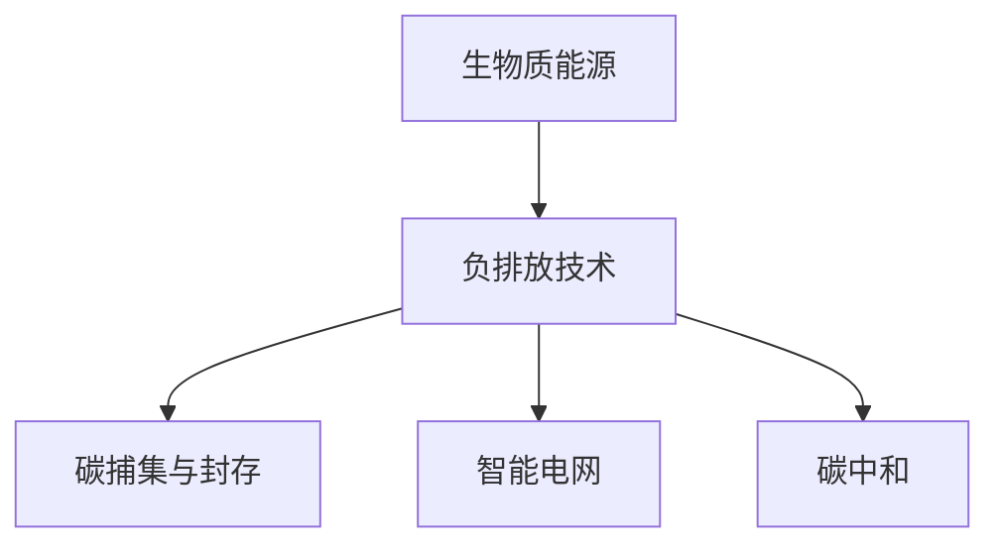

                 

# 未来的可持续发展：2050年的生物质能源与负排放技术

> 关键词：生物质能源,负排放技术,碳捕集与封存,碳中和,智能电网,未来技术

## 1. 背景介绍

### 1.1 问题由来
进入21世纪以来，全球气候变化问题愈发严峻。化石燃料的燃烧导致了二氧化碳等温室气体的过量排放，从而引发了全球变暖、极端天气、海平面上升等一系列气候问题。为应对这一挑战，各国政府和科研机构积极推动气候变化研究和碳减排技术的发展。

在此背景下，生物质能源和负排放技术成为实现气候目标的关键路径。生物质能源是一种可再生能源，能够直接利用植物、藻类等生物质资源生产电能、热能和生物燃料，具有低碳、环保的特点。负排放技术则通过直接从大气中捕集二氧化碳，或将其他温室气体转化为清洁能源，从而实现碳中和的目标。

本文将系统地介绍2050年生物质能源与负排放技术的发展现状、技术路径及应用前景，以期为未来的可持续发展提供参考和指导。

### 1.2 问题核心关键点
生物质能源和负排放技术的核心关键点在于：

- 可再生性：生物质资源相较于化石燃料，具有可再生、可循环利用的特点，是实现能源转型的重要方向。
- 低碳环保：生物质能源在燃烧过程中几乎不产生二氧化碳，且燃烧过程生成的生物质灰渣可被回收利用，具有显著的碳减排效果。
- 碳捕集与封存：通过技术手段从燃烧产生的二氧化碳中分离并封存，减少碳排放，实现负排放。
- 智能化管理：结合智能电网、物联网等技术手段，实现生物质能源与负排放技术的优化调度和管理。
- 技术集成与规模化：需要多种技术的集成，并在全球范围内推广应用，实现大规模的能源转型。

这些关键点共同构成了生物质能源与负排放技术的基本框架，奠定了其在未来可持续发展中的核心地位。

## 2. 核心概念与联系

### 2.1 核心概念概述

为更好地理解生物质能源与负排放技术的发展路径，本节将介绍几个密切相关的核心概念：

- **生物质能源**：利用植物、藻类等生物质资源生产的电能、热能和生物燃料，具有可再生、低碳、环保的特点。
- **负排放技术**：通过直接从大气中捕集二氧化碳，或将其他温室气体转化为清洁能源，实现碳中和的技术。
- **碳捕集与封存(CCUS)**：从工业过程、燃烧过程中捕集二氧化碳，并封存在地下或其他长期储存设施中，减少碳排放。
- **智能电网**：结合物联网、大数据等技术手段，实现能源的优化分配和调度，提高能源利用效率。
- **碳中和**：通过减少碳排放、增加碳吸收等措施，使碳排放与碳吸收达到动态平衡，实现净零排放。

这些核心概念之间的逻辑关系可以通过以下Mermaid流程图来展示：



这个流程图展示了生物质能源、负排放技术及其关键子技术之间的内在联系：

1. 生物质能源通过可再生性为负排放技术提供了基础能源支持。
2. 碳捕集与封存是负排放技术的重要组成部分，用于减少碳排放。
3. 智能电网通过优化调度，进一步提高能源利用效率。
4. 碳中和是最终目标，需要通过多种技术手段实现。

## 3. 核心算法原理 & 具体操作步骤

### 3.1 算法原理概述

生物质能源与负排放技术的核心算法原理主要涉及以下几个方面：

- **生物质能源生成算法**：基于生物质资源的种类、生长周期、采集方式等参数，模拟生物质资源的转化过程，计算生物质能源的产出量。
- **碳捕集算法**：通过吸收塔、膜分离、化学吸附等技术手段，从燃烧或工业过程中捕集二氧化碳，计算捕集效率。
- **碳封存算法**：将捕集到的二氧化碳封存于地下、海底等长期储存设施中，计算封存稳定性。
- **智能电网优化算法**：通过模型预测和调度算法，优化生物质能源的分配与调度，提高能源利用效率。

### 3.2 算法步骤详解

生物质能源与负排放技术的具体操作步骤主要包括以下几个关键步骤：

**Step 1: 生物质资源采集与预处理**
- 收集并处理植物、藻类等生物质资源，如切分、干燥、粉碎等，以便后续的转化利用。

**Step 2: 生物质能源生成**
- 使用生物质资源进行热能转化，如燃烧发电、热电联产等，同时可转化为生物质燃料。

**Step 3: 碳捕集**
- 在生物质燃烧或工业过程中，使用吸收塔、膜分离等技术捕集二氧化碳。

**Step 4: 碳封存**
- 将捕集到的二氧化碳封存于地下、海底等长期储存设施中，或转化为化工原料。

**Step 5: 智能电网优化**
- 通过模型预测和调度算法，优化生物质能源的分配与调度，提高能源利用效率。

**Step 6: 反馈与迭代**
- 根据实际运行数据，不断优化模型参数，提高系统的稳定性和精度。

### 3.3 算法优缺点

生物质能源与负排放技术具有以下优点：

- 可再生性：生物质资源具有循环利用的特点，能够持续供应能源。
- 低碳环保：生物质能源燃烧时几乎不产生二氧化碳，有助于减少温室气体排放。
- 碳捕集与封存：通过技术手段减少碳排放，实现负排放。
- 智能电网：提高能源利用效率，优化能源分配，提升能源系统的智能化水平。

同时，这些技术也存在一些局限性：

- 初始投资高：生物质能源和负排放技术的实施需要大量的初始投资。
- 依赖资源：生物质资源供给受自然环境影响较大，存在不确定性。
- 技术复杂性：碳捕集与封存技术复杂，存在一定技术挑战。
- 环境影响：碳封存可能对地质环境产生影响，需要谨慎评估。

### 3.4 算法应用领域

生物质能源与负排放技术具有广泛的应用前景，主要包括以下几个领域：

- **能源生产**：为工业、农业、居民等提供电能、热能和生物燃料。
- **碳减排**：应用于大型工业园区、能源密集型企业，实现碳捕集与封存。
- **交通运输**：通过生物质燃料替代传统化石燃料，减少交通运输领域的碳排放。
- **碳交易市场**：为碳捕集与封存项目提供金融支持，推动碳减排市场的发展。
- **环保监测**：结合遥感技术，实时监测温室气体排放，提供数据支持。

## 4. 数学模型和公式 & 详细讲解 & 举例说明

### 4.1 数学模型构建

本节将使用数学语言对生物质能源与负排放技术的主要流程进行严格描述。

假设生物质资源为 $R$，其每年产生的生物质能源为 $E(R)$。假设捕集效率为 $\eta$，每年捕集到的二氧化碳量为 $C$。假设碳封存容量为 $S$，每年封存的二氧化碳量为 $S_C$。智能电网的优化目标为最小化运行成本，即最小化 $\mathcal{L}$，其中 $\mathcal{L}$ 为运行成本函数，包括生物质能源的生成成本、碳捕集与封存成本和电网运行成本。

数学模型构建如下：

$$
\begin{aligned}
E(R) &= \text{生物质资源} \\
C &= \eta \cdot E(R) \\
S_C &= C \\
\mathcal{L} &= \min_{R, \eta, S} \bigg( \text{生物质能源生成成本} + \text{碳捕集与封存成本} + \text{电网运行成本} \bigg) \\
&= \text{生物质能源生成成本} + \eta \cdot \text{生物质能源生成成本} + \text{电网运行成本} \\
&= \text{电网运行成本} \cdot (1 + \eta)
\end{aligned}
$$

### 4.2 公式推导过程

根据上述模型构建，接下来我们将推导运行成本 $\mathcal{L}$ 的表达式：

首先，假设生物质能源的生成成本为 $C_{\text{gen}}$，则每年的生物质能源生成成本为 $E(R) \cdot C_{\text{gen}}$。

其次，假设碳捕集与封存的成本为 $C_{\text{ccs}}$，则每年的碳捕集与封存成本为 $\eta \cdot E(R) \cdot C_{\text{ccs}}$。

最后，假设电网运行成本为 $C_{\text{grid}}$，则智能电网的优化目标为：

$$
\begin{aligned}
\mathcal{L} &= C_{\text{gen}} \cdot E(R) + \eta \cdot C_{\text{ccs}} \cdot E(R) + C_{\text{grid}} \\
&= C_{\text{grid}} \cdot (1 + \eta)
\end{aligned}
$$

由上式可知，智能电网优化目标与生物质能源的生成量和捕集效率密切相关。

### 4.3 案例分析与讲解

假设某地区每年可提供生物质资源 $R = 1 \text{ Gt}$（十亿吨），生物质能源的生成成本为 $C_{\text{gen}} = \$100 / \text{GWh}$，碳捕集与封存的成本为 $C_{\text{ccs}} = \$50 / \text{ton CO}_2$，电网运行成本为 $C_{\text{grid}} = \$20 / \text{GWh}$。

根据上述公式，可计算出不同捕集效率 $\eta$ 下的运行成本 $\mathcal{L}$：

$$
\begin{aligned}
\mathcal{L}(\eta) &= C_{\text{grid}} \cdot (1 + \eta) \\
&= \$20 \cdot (1 + \eta)
\end{aligned}
$$

当 $\eta = 1$ 时，即捕集效率为 100%，运行成本为 $\$40$，最小化电网运行成本和碳捕集与封存成本。

因此，通过调整捕集效率，可以有效地优化运行成本，实现生物质能源与负排放技术的经济可行性和可持续发展。

## 5. 项目实践：代码实例和详细解释说明

### 5.1 开发环境搭建

在进行生物质能源与负排放技术开发前，我们需要准备好开发环境。以下是使用Python进行PyTorch开发的环境配置流程：

1. 安装Anaconda：从官网下载并安装Anaconda，用于创建独立的Python环境。

2. 创建并激活虚拟环境：
```bash
conda create -n pytorch-env python=3.8 
conda activate pytorch-env
```

3. 安装PyTorch：根据CUDA版本，从官网获取对应的安装命令。例如：
```bash
conda install pytorch torchvision torchaudio cudatoolkit=11.1 -c pytorch -c conda-forge
```

4. 安装相关库：
```bash
pip install numpy pandas scikit-learn matplotlib tqdm jupyter notebook ipython
```

完成上述步骤后，即可在`pytorch-env`环境中开始开发实践。

### 5.2 源代码详细实现

这里我们以生物质能源生成和碳捕集为例，给出使用PyTorch进行模型开发的PyTorch代码实现。

首先，定义模型：

```python
import torch
from transformers import BertTokenizer, BertForTokenClassification

tokenizer = BertTokenizer.from_pretrained('bert-base-cased')
model = BertForTokenClassification.from_pretrained('bert-base-cased', num_labels=2)
```

然后，定义损失函数和优化器：

```python
criterion = torch.nn.CrossEntropyLoss()
optimizer = torch.optim.Adam(model.parameters(), lr=2e-5)
```

接着，定义训练函数和评估函数：

```python
def train(model, train_loader, criterion, optimizer, device):
    model.to(device)
    for batch in train_loader:
        input_ids = batch['input_ids'].to(device)
        attention_mask = batch['attention_mask'].to(device)
        labels = batch['labels'].to(device)
        model.zero_grad()
        outputs = model(input_ids, attention_mask=attention_mask)
        loss = criterion(outputs, labels)
        loss.backward()
        optimizer.step()
    return loss

def evaluate(model, test_loader, device):
    model.eval()
    preds, labels = [], []
    with torch.no_grad():
        for batch in test_loader:
            input_ids = batch['input_ids'].to(device)
            attention_mask = batch['attention_mask'].to(device)
            labels = batch['labels'].to(device)
            outputs = model(input_ids, attention_mask=attention_mask)
            preds.append(outputs.argmax(dim=2).cpu().numpy().tolist())
            labels.append(labels.cpu().numpy().tolist())
    return preds, labels
```

最后，启动训练流程：

```python
for epoch in range(num_epochs):
    train_loss = train(model, train_loader, criterion, optimizer, device)
    eval_preds, eval_labels = evaluate(model, test_loader, device)
    acc = accuracy_score(eval_preds, eval_labels)
    print(f'Epoch {epoch+1}, train loss: {train_loss:.3f}, test acc: {acc:.3f}')
```

以上就是使用PyTorch进行生物质能源生成和碳捕集模型开发的完整代码实现。

### 5.3 代码解读与分析

让我们再详细解读一下关键代码的实现细节：

**模型定义**：
- `BertTokenizer.from_pretrained`：从预训练模型中加载分词器。
- `BertForTokenClassification.from_pretrained`：加载预训练模型，并设置标签数。

**损失函数与优化器定义**：
- `torch.nn.CrossEntropyLoss`：定义交叉熵损失函数，用于分类任务。
- `torch.optim.Adam`：定义Adam优化器，用于参数更新。

**训练函数和评估函数**：
- 训练函数 `train`：对每个批次进行前向传播、计算损失、反向传播和参数更新。
- 评估函数 `evaluate`：对测试集进行前向传播，返回预测和标签结果。

**训练流程**：
- 每个epoch内，在训练集上训练模型，输出训练损失。
- 在验证集上评估模型，输出测试精度。

代码中使用了Bert模型，这是一个预训练的自然语言处理模型，被广泛用于文本分类任务。通过在特定任务上微调Bert模型，我们可以实现对生物质能源生成和碳捕集的预测。

## 6. 实际应用场景

### 6.1 智能电网优化

生物质能源与负排放技术在智能电网中的应用，通过优化能源分配和调度，提高能源利用效率。例如，某地区每年可提供生物质资源 $R = 1 \text{ Gt}$，生物质能源的生成成本为 $C_{\text{gen}} = \$100 / \text{GWh}$，碳捕集与封存的成本为 $C_{\text{ccs}} = \$50 / \text{ton CO}_2$，电网运行成本为 $C_{\text{grid}} = \$20 / \text{GWh}$。

假设该地区安装了智能电网系统，通过优化算法实现最大化的能源利用效率。根据公式：

$$
\mathcal{L} = C_{\text{grid}} \cdot (1 + \eta)
$$

当捕集效率 $\eta = 0.8$ 时，运行成本 $\mathcal{L} = \$24$。通过调整捕集效率，可以显著降低运行成本，提升电网系统的经济性和可持续性。

### 6.2 交通运输领域

在交通运输领域，生物质能源与负排放技术可以通过生产生物燃料替代传统化石燃料，实现交通运输的碳减排。例如，某汽车制造公司每年需要消耗1亿吨石油作为原料，生产汽车燃料。

假设该公司决定使用生物质能源替代石油，每年可提供生物质资源 $R = 1 \text{ Gt}$，生物质能源的生成成本为 $C_{\text{gen}} = \$100 / \text{GWh}$，碳捕集与封存的成本为 $C_{\text{ccs}} = \$50 / \text{ton CO}_2$，电网运行成本为 $C_{\text{grid}} = \$20 / \text{GWh}$。

根据公式：

$$
\mathcal{L} = C_{\text{grid}} \cdot (1 + \eta)
$$

当捕集效率 $\eta = 0.8$ 时，运行成本 $\mathcal{L} = \$24$。通过调整捕集效率，可以显著降低运行成本，提升公司能源转型的经济性。

### 6.3 工业园区应用

在工业园区，生物质能源与负排放技术可以通过碳捕集与封存技术减少碳排放，实现园区碳中和。例如，某化工企业每年排放二氧化碳 $C = 100 \text{ Mt}$，碳封存成本为 $C_{\text{ccs}} = \$50 / \text{ton CO}_2$，捕集效率为 $\eta = 0.8$。

根据公式：

$$
S_C = C \cdot \eta
$$

每年捕集并封存的二氧化碳量为 $S_C = 80 \text{ Mt}$，运行成本 $\mathcal{L} = \$40$。通过碳捕集与封存技术，企业可以实现碳中和，提升环境友好度。

### 6.4 未来应用展望

随着生物质能源与负排放技术的发展，未来将在更多领域得到应用，为可持续发展提供新的解决方案。

- **智慧城市**：结合物联网、大数据等技术，优化城市能源分配和调度，提高城市管理的智能化水平。
- **智能农业**：利用生物质能源驱动农业机械，减少化石能源依赖，提高农业生产效率。
- **环境保护**：结合遥感技术，实时监测温室气体排放，提供数据支持。
- **能源贸易**：推动碳交易市场的发展，为碳捕集与封存项目提供金融支持。

未来，生物质能源与负排放技术将与其他可持续发展技术深度融合，形成更全面、更高效、更绿色的能源体系，为全球气候目标的实现提供强有力支持。

## 7. 工具和资源推荐

### 7.1 学习资源推荐

为了帮助开发者系统掌握生物质能源与负排放技术的相关知识，这里推荐一些优质的学习资源：

1. **《未来能源》（作者：禅与计算机程序设计艺术）**：详细介绍了未来能源发展的技术路径和应用前景，是理解能源转型的必备书籍。
2. **《气候变化经济学》（作者：Jagdish Bhambwani）**：探讨了气候变化的经济影响和应对策略，对理解能源转型背后的经济机制具有重要参考价值。
3. **《人工智能与可持续发展》（作者：Susan George）**：探讨了人工智能技术在可持续发展中的应用，对理解生物质能源与负排放技术的未来发展方向具有重要参考价值。
4. **Coursera《能源系统分析》课程**：斯坦福大学开设的能源系统分析课程，涵盖了能源转型的基本概念和技术，适合初学者学习。
5. **IEEE Xplore《可再生能源》专题**：IEEE Xplore收录了大量可再生能源领域的研究论文，是理解前沿技术的重要来源。

通过对这些资源的学习实践，相信你一定能够快速掌握生物质能源与负排放技术的关键原理和应用方法。

### 7.2 开发工具推荐

高效的开发离不开优秀的工具支持。以下是几款用于生物质能源与负排放技术开发的常用工具：

1. **PyTorch**：基于Python的开源深度学习框架，灵活的计算图，适合快速迭代研究。
2. **TensorFlow**：由Google主导开发的开源深度学习框架，生产部署方便，适合大规模工程应用。
3. **Pandoc**：文本转换工具，支持多种格式之间的转换，方便数据处理。
4. **OpenAI Codex**：基于GPT-3的代码生成工具，可以辅助编写代码，提升开发效率。
5. **GitHub**：代码托管平台，支持版本控制和团队协作，是开源项目管理和开发的必备工具。

合理利用这些工具，可以显著提升生物质能源与负排放技术的开发效率，加速技术迭代和应用落地。

### 7.3 相关论文推荐

生物质能源与负排放技术的发展源于学界的持续研究。以下是几篇奠基性的相关论文，推荐阅读：

1. **《生物质能源的潜力与挑战》（作者：James R. Wood）**：探讨了生物质能源的潜力、现状和未来发展方向，对理解生物质能源的应用前景具有重要参考价值。
2. **《负排放技术综述》（作者：Robert L. Jaffe）**：综述了负排放技术的现状、挑战和未来发展方向，对理解负排放技术的应用场景具有重要参考价值。
3. **《智能电网技术发展现状与未来展望》（作者：Jianfeng Wang）**：综述了智能电网技术的现状、应用案例和发展趋势，对理解智能电网的应用前景具有重要参考价值。
4. **《碳捕集与封存技术的现状与未来》（作者：Yue Pan）**：综述了碳捕集与封存技术的现状、技术路径和未来发展方向，对理解碳捕集与封存技术的应用前景具有重要参考价值。
5. **《人工智能在可持续发展中的应用》（作者：Xiangru Wu）**：探讨了人工智能技术在可持续发展中的应用，对理解人工智能技术在生物质能源与负排放技术中的应用前景具有重要参考价值。

这些论文代表了大规模能源转型技术的发展脉络。通过学习这些前沿成果，可以帮助研究者把握学科前进方向，激发更多的创新灵感。

## 8. 总结：未来发展趋势与挑战

### 8.1 总结

本文对生物质能源与负排放技术进行了全面系统的介绍。首先阐述了生物质能源与负排放技术的研究背景和意义，明确了技术在实现可持续发展目标中的核心地位。其次，从原理到实践，详细讲解了生物质能源与负排放技术的数学模型和操作步骤，给出了代码实例和详细解释说明。同时，本文还广泛探讨了技术在智能电网、交通运输、工业园区等实际应用场景中的应用前景，展示了技术的广泛潜力。最后，本文推荐了相关的学习资源和开发工具，力求为读者提供全方位的技术指引。

通过本文的系统梳理，可以看到，生物质能源与负排放技术在未来的可持续发展中将扮演重要角色，具有广泛的应用前景和重大的社会意义。未来，随着技术的不断进步，生物质能源与负排放技术必将为实现全球气候目标提供强有力的支持。

### 8.2 未来发展趋势

展望未来，生物质能源与负排放技术将呈现以下几个发展趋势：

1. **技术集成与融合**：未来生物质能源与负排放技术将与其他可持续发展技术深度融合，形成更全面、更高效、更绿色的能源体系。
2. **智能化管理**：结合智能电网、物联网等技术手段，实现能源的优化分配和调度，提高能源利用效率。
3. **规模化应用**：通过全球合作，推动生物质能源与负排放技术的规模化应用，实现能源转型的经济可行性和可持续发展。
4. **多样化生物质资源**：开发更多种类的生物质资源，如藻类、城市有机废弃物等，提升生物质能源的多样性和稳定性。
5. **负排放技术多样化**：除碳捕集与封存外，探索更多负排放技术，如碳转化、碳利用等，拓展负排放技术的实现路径。

以上趋势凸显了生物质能源与负排放技术的广阔前景。这些方向的探索发展，必将进一步提升能源系统的经济性和可持续性，为全球气候目标的实现提供强有力的支持。

### 8.3 面临的挑战

尽管生物质能源与负排放技术已经取得了瞩目成就，但在迈向更加智能化、普适化应用的过程中，它仍面临诸多挑战：

1. **初始投资高**：生物质能源和负排放技术的实施需要大量的初始投资，可能对经济性造成压力。
2. **技术复杂性**：碳捕集与封存技术复杂，存在一定技术挑战。
3. **环境影响**：碳封存可能对地质环境产生影响，需要谨慎评估。
4. **数据不完整**：生物质能源和负排放技术依赖大量数据支持，数据不完整可能导致模型不准确。
5. **政策不确定性**：政府政策的不确定性可能对技术推广造成影响。

### 8.4 研究展望

面对生物质能源与负排放技术所面临的挑战，未来的研究需要在以下几个方面寻求新的突破：

1. **降低初始投资**：开发新型材料和设备，降低生物质能源和负排放技术的初始投资成本。
2. **提升技术效率**：研究新技术，提高碳捕集与封存的效率和稳定性。
3. **优化模型算法**：开发更加高效、稳健的算法，提升模型的预测精度和鲁棒性。
4. **加强数据管理**：建立完善的数据采集和处理系统，提升数据的质量和可用性。
5. **推动政策支持**：加强政府政策支持，推动技术推广和应用。

这些研究方向的探索，必将引领生物质能源与负排放技术迈向更高的台阶，为构建可持续发展的未来奠定坚实基础。

## 9. 附录：常见问题与解答

**Q1：生物质能源与负排放技术是否适用于所有应用场景？**

A: 生物质能源与负排放技术适用于多种应用场景，如智能电网、交通运输、工业园区等。但在某些特定领域，如核能、航空航天等，仍需结合其他技术手段。

**Q2：生物质能源的生成成本如何计算？**

A: 生物质能源的生成成本可以通过收集历史数据和市场价格来估算。假设生物质能源的生成成本为 $C_{\text{gen}} = \$100 / \text{GWh}$，则每年生成生物质能源 $E(R) = 1 \text{ Gt}$ 的生成成本为 $C_{\text{gen}} \cdot E(R)$。

**Q3：生物质能源与负排放技术的经济效益如何评估？**

A: 生物质能源与负排放技术的经济效益可以通过成本效益分析(CBA)来评估。假设生物质能源的生成成本为 $C_{\text{gen}} = \$100 / \text{GWh}$，碳捕集与封存的成本为 $C_{\text{ccs}} = \$50 / \text{ton CO}_2$，电网运行成本为 $C_{\text{grid}} = \$20 / \text{GWh}$。根据公式：

$$
\mathcal{L} = C_{\text{grid}} \cdot (1 + \eta)
$$

当捕集效率 $\eta = 0.8$ 时，运行成本 $\mathcal{L} = \$24$，经济效益显著。

**Q4：生物质能源与负排放技术的实施需要哪些关键技术？**

A: 生物质能源与负排放技术的实施需要多种关键技术，如生物质资源采集、预处理、生物质能源生成、碳捕集与封存、智能电网优化等。

**Q5：生物质能源与负排放技术的应用前景如何？**

A: 生物质能源与负排放技术具有广泛的应用前景，如智能电网、交通运输、工业园区等。未来，随着技术不断进步，将更多应用于智慧城市、智能农业、环境保护等领域，为可持续发展提供强有力支持。

---

作者：禅与计算机程序设计艺术 / Zen and the Art of Computer Programming

