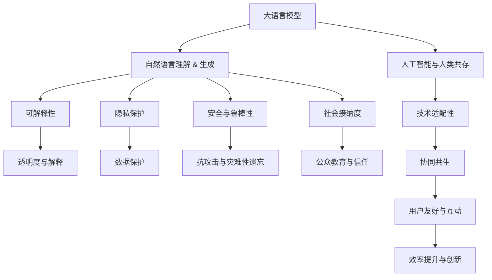

                 

# 未来的工作：与 LLM 共存

## 1. 背景介绍

### 1.1 问题由来
在21世纪的第三个十年，人工智能技术迎来了重大突破。尤其是大语言模型（Large Language Models, LLMs）的出现，让计算机在理解、生成自然语言的能力上迈出了革命性的一步。LLMs如GPT-3、BERT、T5等，已经在多个自然语言处理（NLP）任务上展示了卓越的性能，推动了NLP技术的深度应用。

然而，尽管LLMs能力出众，但在人类社会中广泛部署，并与人类共存，仍面临许多挑战。这些挑战不仅涉及技术层面，还涉及到伦理、安全、隐私等更广泛的社会维度。本文将深入探讨与LLMs共存的问题，并提出解决方案，展望未来人工智能与人类共生的前景。

### 1.2 问题核心关键点
未来工作与LLMs共存的挑战主要包括以下几个方面：

- **技术适配性**：如何在人类与机器之间建立有效沟通渠道，实现无缝衔接？
- **伦理与隐私**：如何确保LLMs的使用符合人类价值观和社会道德，保护用户隐私？
- **安全与可靠性**：如何提高LLMs的鲁棒性和安全性，防止恶意攻击和数据泄露？
- **社会接纳度**：如何提高社会对LLMs技术的接受度和信任度，普及其应用？

这些核心问题交织在一起，构成了与LLMs共存的复杂局面。本文将围绕这些问题，探讨技术、伦理、安全等各方面的策略，旨在构建一个和谐、安全的未来工作环境。

## 2. 核心概念与联系

### 2.1 核心概念概述

为更好地理解未来工作与LLMs共存的问题，本节将介绍几个密切相关的核心概念：

- **大语言模型(Large Language Models, LLMs)**：通过大规模无监督学习训练得到的深度神经网络模型，具备自然语言理解、生成、推理等能力。LLMs如GPT-3、BERT等，已经在多项NLP任务上展示了优异的表现。

- **人工智能与人类共存(Convergence of AI and Human)**：指在未来的工作环境中，人工智能技术（包括LLMs）与人类共同完成工作任务，形成协同共生的局面。这一概念强调了人工智能与人类之间的互补关系，而非替代。

- **机器理解与生成(Machine Understanding & Generation)**：LLMs通过预训练和微调，可以理解和生成符合语言规范的自然语言，是实现人工智能与人类共存的基石。

- **可解释性(Explainability)**：人工智能系统的决策过程能够被人类理解和解释，是确保系统透明、可控的关键。

- **隐私保护(Privacy Preservation)**：在人工智能系统中，保护用户数据隐私，确保数据使用符合法律法规，是构建信任关系的基础。

- **安全与鲁棒性(Security & Robustness)**：确保系统不受到恶意攻击，不出现灾难性遗忘，是维持系统稳定性的重要保障。

- **社会接纳度(Social Acceptance)**：提升社会对人工智能技术的理解和接纳，促进其广泛应用，是实现AI与人类共存的必要条件。

这些核心概念之间的逻辑关系可以通过以下Mermaid流程图来展示：



这个流程图展示了LLMs核心概念及其之间的关系：

1. LLMs通过自然语言理解与生成，为AI与人类共存提供了技术基础。
2. 可解释性、隐私保护、安全与鲁棒性等伦理与安全因素，确保LLMs的负责任使用。
3. 社会接纳度与技术适配性，促进LLMs在实际工作中的应用。

## 3. 核心算法原理 & 具体操作步骤
### 3.1 算法原理概述

与LLMs共存的核心算法原理涉及多个方面，包括自然语言理解与生成、技术适配性、伦理与隐私保护、安全与鲁棒性、社会接纳度等。下面我们将逐一介绍这些关键点。

### 3.2 算法步骤详解

**Step 1: 技术适配性**

1. **数据收集与预处理**：收集并标注与目标任务相关的数据集，包括对话数据、文本摘要、问答数据等。对数据进行清洗、分词、标注等预处理，确保数据质量和格式一致性。

2. **模型选择与微调**：选择合适的LLM作为初始模型，并在特定任务上微调模型参数。微调过程中，需设定合适的学习率、优化器、正则化参数等，避免过拟合。

3. **接口设计与集成**：设计API接口，将微调后的模型集成到实际应用系统中。API接口需考虑性能、安全性、易用性等因素。

**Step 2: 伦理与隐私保护**

1. **隐私保护**：设计数据加密、匿名化、去标识化等技术手段，保护用户隐私。确保数据使用符合法律法规，如GDPR等。

2. **伦理审查**：设立伦理委员会，对人工智能系统的设计、应用进行伦理审查。确保系统符合人类价值观和社会道德。

3. **透明度与解释**：开发可解释性模型，使用户能够理解系统决策过程。提供透明的解释机制，增强用户信任。

**Step 3: 安全与鲁棒性**

1. **对抗训练**：引入对抗样本，提高模型鲁棒性。通过对模型进行对抗训练，增强其对输入扰动的抵抗能力。

2. **数据增强**：使用数据增强技术，扩充训练集，提高模型泛化能力。例如，使用回译、近义词替换等方式扩充数据。

3. **模型裁剪与压缩**：对模型进行裁剪和压缩，减小模型尺寸，提高推理速度和资源效率。

**Step 4: 社会接纳度**

1. **公众教育与培训**：开展公众教育与培训活动，提升社会对人工智能技术的理解。提供实例演示和成功案例，增强公众信心。

2. **用户界面设计**：设计易于理解、操作的用户界面，减少用户使用障碍。增强用户友好性，提升用户体验。

3. **反馈与迭代改进**：建立用户反馈机制，及时收集用户意见和建议，不断优化模型和应用。

### 3.3 算法优缺点

与LLMs共存的算法具有以下优点：

- **效率提升**：通过自然语言理解与生成，LLMs可以显著提升任务处理效率，节省人力成本。
- **创新推动**：LLMs可以提供更多数据驱动的洞察，促进技术创新与业务变革。
- **灵活性**：LLMs可以适应不同应用场景，提供定制化解决方案。

同时，也存在一些缺点：

- **数据依赖**：LLMs依赖大量标注数据进行训练，数据获取成本较高。
- **模型鲁棒性**：LLMs在对抗样本和噪声数据下表现可能不稳定。
- **伦理与隐私问题**：LLMs的使用需符合伦理与隐私要求，法律法规约束较强。
- **社会接受度**：部分用户对人工智能技术存在抵触情绪，推广难度较大。

### 3.4 算法应用领域

与LLMs共存的方法在多个领域都有广泛应用，例如：

- **智能客服**：在智能客服系统中，LLMs可以提供24/7服务，提升客户服务效率与质量。
- **医学诊断**：在医学诊断领域，LLMs可以辅助医生进行疾病诊断，提供决策支持。
- **金融分析**：在金融领域，LLMs可以分析市场数据，提供投资建议。
- **教育培训**：在教育领域，LLMs可以辅助教师进行个性化教学，提高教学效果。
- **内容生成**：在内容生成领域，LLMs可以自动生成新闻报道、广告文案等。

除了这些经典应用，LLMs还在新闻推荐、语音识别、图像处理等多个领域展现出广泛的应用前景。

## 4. 数学模型和公式 & 详细讲解 & 举例说明

### 4.1 数学模型构建

与LLMs共存的数学模型构建涉及多个方面，包括模型选择、微调目标函数、损失函数等。

**模型选择**：选择预训练模型如GPT-3、BERT等作为初始化模型。

**微调目标函数**：根据特定任务，设计合适的输出层和损失函数。例如，在文本分类任务中，使用线性分类器作为输出层，交叉熵损失函数作为损失函数。

**损失函数**：定义损失函数，如交叉熵损失、均方误差损失等，衡量模型预测与真实标签之间的差异。

**学习率与优化器**：选择合适的学习率与优化器，如Adam、SGD等，更新模型参数。

### 4.2 公式推导过程

**交叉熵损失函数**：在文本分类任务中，交叉熵损失函数定义为：

$$
\mathcal{L}(\theta) = -\frac{1}{N}\sum_{i=1}^N [y_i\log \hat{y}_i + (1-y_i)\log(1-\hat{y}_i)]
$$

其中，$y_i$为真实标签，$\hat{y}_i$为模型预测概率。

**梯度更新**：使用梯度下降等优化算法，最小化损失函数，更新模型参数$\theta$：

$$
\theta \leftarrow \theta - \eta \nabla_{\theta}\mathcal{L}(\theta)
$$

其中，$\eta$为学习率，$\nabla_{\theta}\mathcal{L}(\theta)$为损失函数对参数$\theta$的梯度。

### 4.3 案例分析与讲解

**文本分类案例**：以文本分类任务为例，展示LLMs微调过程。

**数据集**：收集并标注文本数据集，如IMDB电影评论数据集。

**模型选择**：选择预训练模型BERT作为初始化模型。

**微调步骤**：
1. 加载BERT模型，设置微调参数。
2. 定义输出层为线性分类器，使用交叉熵损失函数。
3. 使用梯度下降算法，最小化损失函数，更新模型参数。

**结果展示**：在测试集上评估模型性能，输出分类报告。

## 5. 项目实践：代码实例和详细解释说明

### 5.1 开发环境搭建

在进行LLMs微调实践前，我们需要准备好开发环境。以下是使用Python进行PyTorch开发的环境配置流程：

1. 安装Anaconda：从官网下载并安装Anaconda，用于创建独立的Python环境。

2. 创建并激活虚拟环境：
```bash
conda create -n pytorch-env python=3.8 
conda activate pytorch-env
```

3. 安装PyTorch：根据CUDA版本，从官网获取对应的安装命令。例如：
```bash
conda install pytorch torchvision torchaudio cudatoolkit=11.1 -c pytorch -c conda-forge
```

4. 安装Transformers库：
```bash
pip install transformers
```

5. 安装各类工具包：
```bash
pip install numpy pandas scikit-learn matplotlib tqdm jupyter notebook ipython
```

完成上述步骤后，即可在`pytorch-env`环境中开始微调实践。

### 5.2 源代码详细实现

下面我们以情感分类任务为例，给出使用Transformers库对BERT模型进行微调的PyTorch代码实现。

首先，定义情感分类任务的数据处理函数：

```python
from transformers import BertTokenizer
from torch.utils.data import Dataset
import torch

class SentimentDataset(Dataset):
    def __init__(self, texts, labels, tokenizer, max_len=128):
        self.texts = texts
        self.labels = labels
        self.tokenizer = tokenizer
        self.max_len = max_len
        
    def __len__(self):
        return len(self.texts)
    
    def __getitem__(self, item):
        text = self.texts[item]
        label = self.labels[item]
        
        encoding = self.tokenizer(text, return_tensors='pt', max_length=self.max_len, padding='max_length', truncation=True)
        input_ids = encoding['input_ids'][0]
        attention_mask = encoding['attention_mask'][0]
        
        # 对标签进行编码
        encoded_labels = [1 if label == 'positive' else 0] 
        encoded_labels.extend([0] * (self.max_len - len(encoded_labels)))
        labels = torch.tensor(encoded_labels, dtype=torch.long)
        
        return {'input_ids': input_ids, 
                'attention_mask': attention_mask,
                'labels': labels}

# 标签与id的映射
tag2id = {'negative': 0, 'positive': 1}
id2tag = {v: k for k, v in tag2id.items()}

# 创建dataset
tokenizer = BertTokenizer.from_pretrained('bert-base-cased')

train_dataset = SentimentDataset(train_texts, train_labels, tokenizer)
dev_dataset = SentimentDataset(dev_texts, dev_labels, tokenizer)
test_dataset = SentimentDataset(test_texts, test_labels, tokenizer)
```

然后，定义模型和优化器：

```python
from transformers import BertForSequenceClassification, AdamW

model = BertForSequenceClassification.from_pretrained('bert-base-cased', num_labels=len(tag2id))

optimizer = AdamW(model.parameters(), lr=2e-5)
```

接着，定义训练和评估函数：

```python
from torch.utils.data import DataLoader
from tqdm import tqdm
from sklearn.metrics import classification_report

device = torch.device('cuda') if torch.cuda.is_available() else torch.device('cpu')
model.to(device)

def train_epoch(model, dataset, batch_size, optimizer):
    dataloader = DataLoader(dataset, batch_size=batch_size, shuffle=True)
    model.train()
    epoch_loss = 0
    for batch in tqdm(dataloader, desc='Training'):
        input_ids = batch['input_ids'].to(device)
        attention_mask = batch['attention_mask'].to(device)
        labels = batch['labels'].to(device)
        model.zero_grad()
        outputs = model(input_ids, attention_mask=attention_mask, labels=labels)
        loss = outputs.loss
        epoch_loss += loss.item()
        loss.backward()
        optimizer.step()
    return epoch_loss / len(dataloader)

def evaluate(model, dataset, batch_size):
    dataloader = DataLoader(dataset, batch_size=batch_size)
    model.eval()
    preds, labels = [], []
    with torch.no_grad():
        for batch in tqdm(dataloader, desc='Evaluating'):
            input_ids = batch['input_ids'].to(device)
            attention_mask = batch['attention_mask'].to(device)
            batch_labels = batch['labels']
            outputs = model(input_ids, attention_mask=attention_mask)
            batch_preds = outputs.logits.argmax(dim=2).to('cpu').tolist()
            batch_labels = batch_labels.to('cpu').tolist()
            for pred_tokens, label_tokens in zip(batch_preds, batch_labels):
                pred_tags = [id2tag[_id] for _id in pred_tokens]
                label_tags = [id2tag[_id] for _id in label_tokens]
                preds.append(pred_tags[:len(label_tags)])
                labels.append(label_tags)
                
    print(classification_report(labels, preds))
```

最后，启动训练流程并在测试集上评估：

```python
epochs = 5
batch_size = 16

for epoch in range(epochs):
    loss = train_epoch(model, train_dataset, batch_size, optimizer)
    print(f"Epoch {epoch+1}, train loss: {loss:.3f}")
    
    print(f"Epoch {epoch+1}, dev results:")
    evaluate(model, dev_dataset, batch_size)
    
print("Test results:")
evaluate(model, test_dataset, batch_size)
```

以上就是使用PyTorch对BERT进行情感分类任务微调的完整代码实现。可以看到，得益于Transformers库的强大封装，我们可以用相对简洁的代码完成BERT模型的加载和微调。

### 5.3 代码解读与分析

让我们再详细解读一下关键代码的实现细节：

**SentimentDataset类**：
- `__init__`方法：初始化文本、标签、分词器等关键组件。
- `__len__`方法：返回数据集的样本数量。
- `__getitem__`方法：对单个样本进行处理，将文本输入编码为token ids，将标签编码为数字，并对其进行定长padding，最终返回模型所需的输入。

**tag2id和id2tag字典**：
- 定义了标签与数字id之间的映射关系，用于将token-wise的预测结果解码回真实的标签。

**训练和评估函数**：
- 使用PyTorch的DataLoader对数据集进行批次化加载，供模型训练和推理使用。
- 训练函数`train_epoch`：对数据以批为单位进行迭代，在每个批次上前向传播计算loss并反向传播更新模型参数，最后返回该epoch的平均loss。
- 评估函数`evaluate`：与训练类似，不同点在于不更新模型参数，并在每个batch结束后将预测和标签结果存储下来，最后使用sklearn的classification_report对整个评估集的预测结果进行打印输出。

**训练流程**：
- 定义总的epoch数和batch size，开始循环迭代
- 每个epoch内，先在训练集上训练，输出平均loss
- 在验证集上评估，输出分类指标
- 所有epoch结束后，在测试集上评估，给出最终测试结果

可以看到，PyTorch配合Transformers库使得BERT微调的代码实现变得简洁高效。开发者可以将更多精力放在数据处理、模型改进等高层逻辑上，而不必过多关注底层的实现细节。

当然，工业级的系统实现还需考虑更多因素，如模型的保存和部署、超参数的自动搜索、更灵活的任务适配层等。但核心的微调范式基本与此类似。

## 6. 实际应用场景
### 6.1 智能客服系统

基于大语言模型微调的对话技术，可以广泛应用于智能客服系统的构建。传统客服往往需要配备大量人力，高峰期响应缓慢，且一致性和专业性难以保证。而使用微调后的对话模型，可以7x24小时不间断服务，快速响应客户咨询，用自然流畅的语言解答各类常见问题。

在技术实现上，可以收集企业内部的历史客服对话记录，将问题和最佳答复构建成监督数据，在此基础上对预训练对话模型进行微调。微调后的对话模型能够自动理解用户意图，匹配最合适的答案模板进行回复。对于客户提出的新问题，还可以接入检索系统实时搜索相关内容，动态组织生成回答。如此构建的智能客服系统，能大幅提升客户咨询体验和问题解决效率。

### 6.2 金融舆情监测

金融机构需要实时监测市场舆论动向，以便及时应对负面信息传播，规避金融风险。传统的人工监测方式成本高、效率低，难以应对网络时代海量信息爆发的挑战。基于大语言模型微调的文本分类和情感分析技术，为金融舆情监测提供了新的解决方案。

具体而言，可以收集金融领域相关的新闻、报道、评论等文本数据，并对其进行主题标注和情感标注。在此基础上对预训练语言模型进行微调，使其能够自动判断文本属于何种主题，情感倾向是正面、中性还是负面。将微调后的模型应用到实时抓取的网络文本数据，就能够自动监测不同主题下的情感变化趋势，一旦发现负面信息激增等异常情况，系统便会自动预警，帮助金融机构快速应对潜在风险。

### 6.3 个性化推荐系统

当前的推荐系统往往只依赖用户的历史行为数据进行物品推荐，无法深入理解用户的真实兴趣偏好。基于大语言模型微调技术，个性化推荐系统可以更好地挖掘用户行为背后的语义信息，从而提供更精准、多样的推荐内容。

在实践中，可以收集用户浏览、点击、评论、分享等行为数据，提取和用户交互的物品标题、描述、标签等文本内容。将文本内容作为模型输入，用户的后续行为（如是否点击、购买等）作为监督信号，在此基础上微调预训练语言模型。微调后的模型能够从文本内容中准确把握用户的兴趣点。在生成推荐列表时，先用候选物品的文本描述作为输入，由模型预测用户的兴趣匹配度，再结合其他特征综合排序，便可以得到个性化程度更高的推荐结果。

### 6.4 未来应用展望

随着大语言模型微调技术的发展，其在更多领域的应用前景将进一步拓展。

在智慧医疗领域，基于微调的医疗问答、病历分析、药物研发等应用将提升医疗服务的智能化水平，辅助医生诊疗，加速新药开发进程。

在智能教育领域，微调技术可应用于作业批改、学情分析、知识推荐等方面，因材施教，促进教育公平，提高教学质量。

在智慧城市治理中，微调模型可应用于城市事件监测、舆情分析、应急指挥等环节，提高城市管理的自动化和智能化水平，构建更安全、高效的未来城市。

此外，在企业生产、社会治理、文娱传媒等众多领域，基于大模型微调的人工智能应用也将不断涌现，为经济社会发展注入新的动力。相信随着预训练语言模型和微调方法的持续演进，未来人工智能与人类共存的局面将更加广阔，深刻影响人类的生产生活方式。

## 7. 工具和资源推荐
### 7.1 学习资源推荐

为了帮助开发者系统掌握大语言模型微调的理论基础和实践技巧，这里推荐一些优质的学习资源：

1. 《Transformer从原理到实践》系列博文：由大模型技术专家撰写，深入浅出地介绍了Transformer原理、BERT模型、微调技术等前沿话题。

2. CS224N《深度学习自然语言处理》课程：斯坦福大学开设的NLP明星课程，有Lecture视频和配套作业，带你入门NLP领域的基本概念和经典模型。

3. 《Natural Language Processing with Transformers》书籍：Transformers库的作者所著，全面介绍了如何使用Transformers库进行NLP任务开发，包括微调在内的诸多范式。

4. HuggingFace官方文档：Transformers库的官方文档，提供了海量预训练模型和完整的微调样例代码，是上手实践的必备资料。

5. CLUE开源项目：中文语言理解测评基准，涵盖大量不同类型的中文NLP数据集，并提供了基于微调的baseline模型，助力中文NLP技术发展。

通过对这些资源的学习实践，相信你一定能够快速掌握大语言模型微调的精髓，并用于解决实际的NLP问题。
###  7.2 开发工具推荐

高效的开发离不开优秀的工具支持。以下是几款用于大语言模型微调开发的常用工具：

1. PyTorch：基于Python的开源深度学习框架，灵活动态的计算图，适合快速迭代研究。大部分预训练语言模型都有PyTorch版本的实现。

2. TensorFlow：由Google主导开发的开源深度学习框架，生产部署方便，适合大规模工程应用。同样有丰富的预训练语言模型资源。

3. Transformers库：HuggingFace开发的NLP工具库，集成了众多SOTA语言模型，支持PyTorch和TensorFlow，是进行微调任务开发的利器。

4. Weights & Biases：模型训练的实验跟踪工具，可以记录和可视化模型训练过程中的各项指标，方便对比和调优。与主流深度学习框架无缝集成。

5. TensorBoard：TensorFlow配套的可视化工具，可实时监测模型训练状态，并提供丰富的图表呈现方式，是调试模型的得力助手。

6. Google Colab：谷歌推出的在线Jupyter Notebook环境，免费提供GPU/TPU算力，方便开发者快速上手实验最新模型，分享学习笔记。

合理利用这些工具，可以显著提升大语言模型微调的开发效率，加快创新迭代的步伐。

### 7.3 相关论文推荐

大语言模型和微调技术的发展源于学界的持续研究。以下是几篇奠基性的相关论文，推荐阅读：

1. Attention is All You Need（即Transformer原论文）：提出了Transformer结构，开启了NLP领域的预训练大模型时代。

2. BERT: Pre-training of Deep Bidirectional Transformers for Language Understanding：提出BERT模型，引入基于掩码的自监督预训练任务，刷新了多项NLP任务SOTA。

3. Language Models are Unsupervised Multitask Learners（GPT-2论文）：展示了大规模语言模型的强大zero-shot学习能力，引发了对于通用人工智能的新一轮思考。

4. Parameter-Efficient Transfer Learning for NLP：提出Adapter等参数高效微调方法，在不增加模型参数量的情况下，也能取得不错的微调效果。

5. Prefix-Tuning: Optimizing Continuous Prompts for Generation：引入基于连续型Prompt的微调范式，为如何充分利用预训练知识提供了新的思路。

6. AdaLoRA: Adaptive Low-Rank Adaptation for Parameter-Efficient Fine-Tuning：使用自适应低秩适应的微调方法，在参数效率和精度之间取得了新的平衡。

这些论文代表了大语言模型微调技术的发展脉络。通过学习这些前沿成果，可以帮助研究者把握学科前进方向，激发更多的创新灵感。

## 8. 总结：未来发展趋势与挑战

### 8.1 总结

本文对与大语言模型共存的问题进行了全面系统的介绍。首先阐述了与LLMs共存的背景与挑战，明确了在人工智能与人类共存的复杂环境中，如何通过技术适配性、伦理与隐私保护、安全与鲁棒性、社会接纳度等关键点，实现LLMs的负责任使用。其次，从原理到实践，详细讲解了与LLMs共存的核心算法步骤，给出了微调任务开发的完整代码实例。同时，本文还广泛探讨了LLMs在智能客服、金融舆情、个性化推荐等多个行业领域的应用前景，展示了LLMs在实际工作中的应用潜力。此外，本文精选了与LLMs共存的技术资源，力求为开发者提供全方位的技术指引。

通过本文的系统梳理，可以看到，与LLMs共存的过程是一个涉及技术、伦理、安全等多维度的复杂工程，需要多方面共同努力才能实现。LLMs在大语言模型的帮助下，已经在多个领域展现出了其强大的潜力和应用价值。未来，伴随着技术的不断进步和应用的深入探索，LLMs必将在更多场景中发挥重要作用，推动人工智能与人类社会的深度融合。

### 8.2 未来发展趋势

展望未来，与LLMs共存的技术将呈现以下几个发展趋势：

1. **技术融合**：LLMs将与更多人工智能技术如知识表示、因果推理、强化学习等进行深度融合，实现更加全面和高效的功能。

2. **模型可解释性**：提升模型的可解释性，使人类能够理解LLMs的决策过程，增强系统的透明度和可信度。

3. **隐私保护**：在数据收集、存储、处理等环节，加强隐私保护措施，确保数据安全。

4. **鲁棒性与可靠性**：提升模型的鲁棒性和可靠性，防止恶意攻击和数据泄露，确保系统稳定运行。

5. **社会接纳度**：通过公众教育和培训，提高社会对LLMs的认知和接纳，促进其广泛应用。

这些趋势凸显了与LLMs共存技术的发展方向，将推动LLMs在更广泛领域的应用，为人类社会带来更多便利和变革。

### 8.3 面临的挑战

尽管与LLMs共存技术取得了显著进展，但在实际应用中仍面临诸多挑战：

1. **数据获取与标注**：LLMs依赖大量标注数据进行训练，数据获取成本较高，且标注过程繁琐耗时。

2. **模型鲁棒性**：LLMs在对抗样本和噪声数据下表现可能不稳定，容易出现错误。

3. **伦理与隐私问题**：LLMs的使用需符合伦理与隐私要求，法律法规约束较强。

4. **社会接受度**：部分用户对LLMs存在抵触情绪，推广难度较大。

5. **资源限制**：大规模LLMs对算力、内存、存储等资源需求较高，难以在所有环境中部署。

6. **系统复杂性**：与LLMs共存系统需要考虑多方面因素，如系统设计、用户界面、数据管理等，复杂度较高。

解决这些挑战需要学术界和工业界共同努力，从技术、伦理、法律等多个层面进行综合治理。

### 8.4 研究展望

未来的研究需要从以下几个方面进行深入探索：

1. **数据增强与数据合成**：利用数据增强和数据合成技术，扩大训练数据规模，提高模型的泛化能力。

2. **参数高效微调**：开发更加参数高效的微调方法，如Prefix-Tuning、LoRA等，减少模型参数量，提升推理效率。

3. **对抗样本生成**：研究生成对抗样本的方法，增强模型的鲁棒性，防止攻击。

4. **多模态融合**：探索将视觉、语音等多模态信息与文本信息结合，实现更全面和精准的推理。

5. **伦理与隐私保护**：引入更多伦理与隐私保护措施，如差分隐私、联邦学习等，确保数据安全。

6. **社会化部署**：设计易于使用、易于维护的部署方案，降低使用门槛，提高系统可靠性。

通过这些方向的深入研究，相信未来与LLMs共存技术将取得更大的突破，为人类社会带来更多便利和变革。

## 9. 附录：常见问题与解答

**Q1：与LLMs共存的技术难点是什么？**

A: 与LLMs共存的技术难点主要包括：
1. 数据获取与标注：大量标注数据是训练LLMs的基础，获取和标注成本较高。
2. 模型鲁棒性：LLMs在对抗样本和噪声数据下可能表现不稳定，容易出现错误。
3. 伦理与隐私问题：LLMs的使用需符合伦理与隐私要求，法律法规约束较强。
4. 社会接受度：部分用户对LLMs存在抵触情绪，推广难度较大。
5. 资源限制：大规模LLMs对算力、内存、存储等资源需求较高，难以在所有环境中部署。

**Q2：如何提高LLMs的鲁棒性？**

A: 提高LLMs的鲁棒性可以从以下几个方面进行：
1. 对抗训练：引入对抗样本，训练模型对输入扰动的抵抗能力。
2. 数据增强：使用数据增强技术，扩充训练集，提高模型的泛化能力。
3. 模型裁剪与压缩：对模型进行裁剪和压缩，减小模型尺寸，提高推理速度和资源效率。

**Q3：如何确保LLMs的伦理与隐私保护？**

A: 确保LLMs的伦理与隐私保护可以从以下几个方面进行：
1. 数据加密与匿名化：对数据进行加密与匿名化处理，确保数据隐私。
2. 数据去标识化：在数据处理过程中，去除敏感信息，保护用户隐私。
3. 差分隐私：引入差分隐私技术，保护数据隐私。

**Q4：如何提升LLMs的可解释性？**

A: 提升LLMs的可解释性可以从以下几个方面进行：
1. 可解释性模型：开发可解释性模型，使人类能够理解LLMs的决策过程。
2. 解释机制：提供透明的解释机制，增强用户信任。
3. 模型可视化：使用模型可视化工具，帮助用户理解模型内部结构。

这些问题的解答旨在帮助开发者更好地应对与LLMs共存中的挑战，推动技术的不断进步和应用。通过不断探索与创新，相信未来与LLMs共存技术将取得更大的突破，为人类社会带来更多便利和变革。

---

作者：禅与计算机程序设计艺术 / Zen and the Art of Computer Programming

