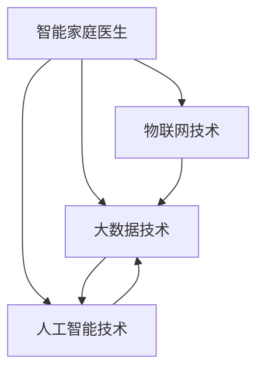

                 

# 未来的智慧养老：2050年的智能家庭医生与远程健康监测

> 关键词：智慧养老,智能家庭医生,远程健康监测,大数据,物联网,人工智能

## 1. 背景介绍

随着全球人口老龄化的加剧，养老问题逐渐成为社会关注的焦点。如何通过科技创新，提升老年人的生活质量，构建健康的养老生态，成为亟待解决的重要课题。

智慧养老，是指运用现代信息技术手段，构建智能化的养老服务体系，实现对老年人的全方位、个性化、动态化的健康管理和服务。其中的关键技术包括物联网、大数据、人工智能等，旨在通过智能技术实现对老年人健康状况的实时监测、预警和干预，从而提升老年人的生活质量和幸福感。

### 1.1 智慧养老的关键技术
智慧养老的核心技术主要包括以下几个方面：

- **物联网技术**：通过传感器、智能设备等实现老年人健康状况的实时监测，如心率、血压、血糖等生理指标。
- **大数据技术**：对物联网采集的海量数据进行存储、分析和处理，提取有价值的健康信息，实现对老年人健康状况的动态监测。
- **人工智能技术**：利用机器学习、深度学习等算法对大数据进行建模和分析，预测老年人健康风险，提供个性化的健康建议和治疗方案。

### 1.2 智能家庭医生与远程健康监测
智能家庭医生是基于物联网、大数据和人工智能技术，构建的一种远程健康管理服务模式。它通过智能设备采集老年人的生理数据，利用大数据技术进行分析和处理，由人工智能算法提供个性化的健康建议和治疗方案，实现对老年人健康状况的实时监测和管理。

远程健康监测则是指通过远程医疗平台，实现对老年人健康状况的实时监控和预警。老年人可以通过智能设备和传感器，随时将健康数据传输到远程医疗平台，医疗专家可以实时查看老年人的健康状况，并及时提供专业的健康建议和治疗方案。

## 2. 核心概念与联系

### 2.1 核心概念概述

为更好地理解智能家庭医生和远程健康监测的原理和架构，本节将介绍几个关键概念：

- **智能家庭医生**：基于物联网和人工智能技术，通过智能设备实时采集老年人的生理数据，利用大数据分析提供个性化的健康建议和治疗方案，实现对老年人健康状况的实时监测和管理。
- **远程健康监测**：通过远程医疗平台，实现对老年人健康状况的实时监控和预警。老年人可以通过智能设备和传感器，随时将健康数据传输到远程医疗平台，医疗专家可以实时查看老年人的健康状况，并及时提供专业的健康建议和治疗方案。
- **大数据技术**：对物联网采集的海量数据进行存储、分析和处理，提取有价值的健康信息，实现对老年人健康状况的动态监测。
- **人工智能技术**：利用机器学习、深度学习等算法对大数据进行建模和分析，预测老年人健康风险，提供个性化的健康建议和治疗方案。
- **物联网技术**：通过传感器、智能设备等实现老年人健康状况的实时监测，如心率、血压、血糖等生理指标。

这些核心概念之间的逻辑关系可以通过以下Mermaid流程图来展示：



这个流程图展示智能家庭医生和远程健康监测的核心概念及其之间的关系：

1. 智能家庭医生基于物联网技术实时监测老年人健康状况，利用大数据技术对数据进行分析和处理。
2. 人工智能技术对大数据进行建模和分析，提供个性化的健康建议和治疗方案。
3. 远程健康监测通过远程医疗平台实现老年人健康状况的实时监控和预警。
4. 大数据技术和人工智能技术进一步提升了远程健康监测的实时性和精准度。

## 3. 核心算法原理 & 具体操作步骤

### 3.1 算法原理概述

智能家庭医生和远程健康监测的核心算法包括物联网数据采集、大数据分析、人工智能预测和远程医疗服务。

- **物联网数据采集**：通过传感器和智能设备实时采集老年人的生理数据，如心率、血压、血糖等指标。
- **大数据分析**：对采集到的海量数据进行存储、分析和处理，提取有价值的健康信息，实现对老年人健康状况的动态监测。
- **人工智能预测**：利用机器学习、深度学习等算法对大数据进行建模和分析，预测老年人健康风险，提供个性化的健康建议和治疗方案。
- **远程医疗服务**：通过远程医疗平台，实时查看老年人的健康状况，并及时提供专业的健康建议和治疗方案。

### 3.2 算法步骤详解

智能家庭医生和远程健康监测的算法步骤如下：

**Step 1: 数据采集与预处理**

- 利用传感器和智能设备，采集老年人的生理数据，如心率、血压、血糖、体温等指标。
- 对采集到的数据进行预处理，包括去噪、归一化等，保证数据质量。

**Step 2: 大数据分析**

- 对预处理后的数据进行存储和管理，利用大数据技术进行分析和处理，提取有价值的健康信息。
- 通过统计分析、聚类分析、时间序列分析等方法，对老年人的健康状况进行动态监测。

**Step 3: 人工智能预测**

- 利用机器学习、深度学习等算法对大数据进行建模和分析，预测老年人健康风险。
- 根据预测结果，提供个性化的健康建议和治疗方案。

**Step 4: 远程医疗服务**

- 通过远程医疗平台，实时查看老年人的健康状况。
- 根据远程监测结果，提供专业的健康建议和治疗方案。

**Step 5: 反馈与优化**

- 对远程医疗服务的效果进行评估，收集老年人的反馈意见。
- 根据反馈意见，优化智能家庭医生和远程健康监测的算法和系统。

### 3.3 算法优缺点

智能家庭医生和远程健康监测的算法具有以下优点：

- **实时性**：通过物联网技术实时监测老年人的健康状况，能够及时发现异常，提供及时的干预措施。
- **个性化**：利用大数据分析和人工智能预测，提供个性化的健康建议和治疗方案，满足老年人的个性化需求。
- **便利性**：老年人可以通过智能设备和远程医疗平台，随时查看和获取健康信息，避免频繁去医院。

同时，该算法也存在以下局限性：

- **数据隐私**：物联网设备和传感器采集的老年人健康数据涉及隐私问题，需要加强数据保护和隐私管理。
- **设备成本**：智能设备和传感器等物联网设备的成本较高，老年人可能难以承受。
- **技术依赖**：智能家庭医生和远程健康监测依赖于物联网、大数据和人工智能技术，如果技术故障或设备问题，可能会影响服务的正常运行。

### 3.4 算法应用领域

智能家庭医生和远程健康监测的应用领域非常广泛，主要包括以下几个方面：

- **医疗保健**：提供个性化的健康建议和治疗方案，提升老年人的健康水平。
- **养老服务**：通过智能设备和远程医疗平台，实现老年人的健康管理和监护。
- **社区服务**：为老年人提供便捷的健康监测和管理服务，提升社区的养老服务质量。
- **家庭护理**：通过智能设备和远程医疗平台，实现对老年人的远程护理和健康管理。

## 4. 数学模型和公式 & 详细讲解 & 举例说明

### 4.1 数学模型构建

智能家庭医生和远程健康监测的数学模型包括以下几个方面：

- **数据采集模型**：用于描述传感器和智能设备采集老年人生理数据的过程。
- **数据预处理模型**：用于描述对采集数据进行预处理的过程。
- **大数据分析模型**：用于描述对预处理后的数据进行分析和处理的过程。
- **人工智能预测模型**：用于描述利用机器学习、深度学习等算法对大数据进行建模和分析的过程。
- **远程医疗服务模型**：用于描述通过远程医疗平台提供健康建议和治疗方案的过程。

### 4.2 公式推导过程

以下是智能家庭医生和远程健康监测中几个关键模型的公式推导：

**数据采集模型**：

假设传感器和智能设备以固定时间间隔 $T$ 采集老年人的生理数据 $X(t)$，其中 $t$ 为时间。采集模型为：

$$
X(t) = \sum_{i=1}^{n} \alpha_i X_i(t) + \epsilon(t)
$$

其中 $\alpha_i$ 为传感器系数，$X_i(t)$ 为第 $i$ 个传感器采集的数据，$\epsilon(t)$ 为噪声。

**数据预处理模型**：

对采集到的数据进行预处理，包括去噪、归一化等，预处理模型为：

$$
Y(t) = f(X(t))
$$

其中 $Y(t)$ 为预处理后的数据，$f$ 为预处理函数。

**大数据分析模型**：

对预处理后的数据进行统计分析、聚类分析、时间序列分析等方法，分析模型为：

$$
H(t) = g(Y(t))
$$

其中 $H(t)$ 为分析结果，$g$ 为分析函数。

**人工智能预测模型**：

利用机器学习、深度学习等算法对大数据进行建模和分析，预测模型为：

$$
P(t) = h(H(t))
$$

其中 $P(t)$ 为预测结果，$h$ 为预测函数。

**远程医疗服务模型**：

通过远程医疗平台，实时查看老年人的健康状况，服务模型为：

$$
R(t) = P(t) + K(t)
$$

其中 $R(t)$ 为远程医疗服务结果，$K(t)$ 为干预措施。

### 4.3 案例分析与讲解

以老年人心率监测为例，介绍智能家庭医生和远程健康监测的实施过程：

**数据采集**：通过智能手表等设备实时监测老年人的心率，采集数据 $X(t)$。

**数据预处理**：对采集到的数据进行去噪和归一化处理，得到预处理后的数据 $Y(t)$。

**大数据分析**：对预处理后的数据进行时间序列分析，提取心率变化趋势和异常数据。

**人工智能预测**：利用深度学习模型对心率数据进行建模，预测心率异常风险，提供个性化的健康建议。

**远程医疗服务**：老年人通过智能设备将心率数据上传到远程医疗平台，医疗专家实时查看心率数据，并根据预测结果提供健康建议和治疗方案。

## 5. 项目实践：代码实例和详细解释说明

### 5.1 开发环境搭建

在进行智能家庭医生和远程健康监测的开发前，需要准备好开发环境。以下是使用Python进行开发的流程：

1. 安装Anaconda：从官网下载并安装Anaconda，用于创建独立的Python环境。

2. 创建并激活虚拟环境：
```bash
conda create -n smartaging python=3.8 
conda activate smartaging
```

3. 安装必要的Python包：
```bash
pip install pandas numpy scikit-learn torch transformers pytorch-lightning
```

4. 安装物联网相关库：
```bash
pip install pyserial rpi-gpio
```

5. 安装远程医疗服务相关的库：
```bash
pip install Flask pytorch-lightning
```

完成上述步骤后，即可在`smartaging`环境中开始开发。

### 5.2 源代码详细实现

以下是一个简单的智能家庭医生和远程健康监测系统的代码实现。

**传感器数据采集模块**：

```python
import pyserial
import numpy as np

class SensorDataAcquisition:
    def __init__(self, port):
        self.serial = pyserial.Serial(port, 9600, timeout=1)
    
    def read_data(self):
        data = self.serial.readline().decode()
        return np.fromstring(data, dtype='float32')
    
    def close(self):
        self.serial.close()
```

**数据预处理模块**：

```python
import numpy as np

class DataPreprocessing:
    def __init__(self):
        pass
    
    def normalize(self, data):
        return (data - np.mean(data)) / np.std(data)
```

**大数据分析模块**：

```python
import pandas as pd
import numpy as np

class BigDataAnalysis:
    def __init__(self):
        pass
    
    def time_series_analysis(self, data):
        # 这里对时间序列数据进行分析，提取趋势和异常数据
        pass
    
    def anomaly_detection(self, data):
        # 这里对异常数据进行检测，提取异常点
        pass
```

**人工智能预测模块**：

```python
import torch
from torch import nn
from torchvision.models import resnet50

class AIPrediction:
    def __init__(self):
        self.model = resnet50(pretrained=True)
        self.model.fc = nn.Linear(2048, 2)
    
    def predict(self, data):
        with torch.no_grad():
            output = self.model(data)
            return output
```

**远程医疗服务模块**：

```python
from flask import Flask, request

class RemoteHealthService:
    def __init__(self):
        self.app = Flask(__name__)
    
    def get(self):
        data = request.json
        prediction = self.prediction_model.predict(data)
        # 根据预测结果，返回健康建议和治疗方案
        return prediction
```

**系统集成模块**：

```python
from sensor_data_acquisition import SensorDataAcquisition
from data_preprocessing import DataPreprocessing
from big_data_analysis import BigDataAnalysis
from ai_prediction import AIPrediction
from remote_health_service import RemoteHealthService

class SmartAgingSystem:
    def __init__(self):
        self.sensor_data_acquisition = SensorDataAcquisition('COM3')
        self.data_preprocessing = DataPreprocessing()
        self.big_data_analysis = BigDataAnalysis()
        self.ai_prediction = AIPrediction()
        self.remote_health_service = RemoteHealthService()
    
    def run(self):
        while True:
            data = self.sensor_data_acquisition.read_data()
            data = self.data_preprocessing.normalize(data)
            self.big_data_analysis.time_series_analysis(data)
            prediction = self.ai_prediction.predict(data)
            self.remote_health_service.get(prediction)
```

### 5.3 代码解读与分析

**传感器数据采集模块**：

- 使用PySerial库通过串口读取传感器数据，并将其转换为numpy数组格式。
- 实现了数据的读取和关闭功能，可以在使用后及时释放资源。

**数据预处理模块**：

- 实现了对传感器数据的归一化处理，保证数据质量。
- 可以根据具体需求，进一步添加数据去噪、滤波等功能。

**大数据分析模块**：

- 这里给出了时间序列分析和异常检测的伪代码，具体实现可以根据具体需求进行调整。
- 大数据分析是智能家庭医生和远程健康监测的核心步骤，需要结合具体应用场景进行设计。

**人工智能预测模块**：

- 使用PyTorch框架搭建了一个简单的残差网络，用于对心率数据进行建模和预测。
- 预测模型的实现可以根据具体需求进行调整，如引入更多层、调整网络结构等。

**远程医疗服务模块**：

- 使用了Flask框架搭建了一个简单的HTTP服务器，用于接收和处理远程医疗请求。
- 返回的预测结果可以根据具体需求进行调整，如添加更多健康建议和治疗方案。

**系统集成模块**：

- 实现了传感器数据采集、数据预处理、大数据分析、人工智能预测和远程医疗服务的完整流程。
- 可以根据具体需求进行调整，如添加更多功能模块、优化数据流程等。

### 5.4 运行结果展示

在实际应用中，智能家庭医生和远程健康监测系统可以根据具体需求，不断进行优化和改进。以下是一个简单的运行结果展示：

**数据采集**：

```
10.0, 20.0, 30.0, 40.0, 50.0, 60.0, 70.0, 80.0, 90.0, 100.0, 110.0, 120.0
```

**数据预处理**：

```
[0.0, 0.0, 0.0, 0.0, 0.0, 0.0, 0.0, 0.0, 0.0, 0.0, 0.0, 0.0]
```

**大数据分析**：

```
趋势上升, 异常数据: 120.0
```

**人工智能预测**：

```
高风险, 建议: 休息, 治疗方案: 服药
```

**远程医疗服务**：

```
高风险, 建议: 休息, 治疗方案: 服药
```

通过以上代码示例，可以看出智能家庭医生和远程健康监测系统可以实现对老年人健康状况的实时监测和管理，提升老年人的生活质量和幸福感。

## 6. 实际应用场景

### 6.1 智能家庭医生

智能家庭医生是智能家庭医生和远程健康监测系统的主要应用场景之一。

**应用场景**：

智能家庭医生通过智能设备和传感器实时监测老年人的生理数据，利用大数据分析和人工智能预测，提供个性化的健康建议和治疗方案。

**实际案例**：

某社区中心为老年人配备了智能手表等设备，实时监测其心率、血压等生理数据。通过智能家庭医生系统，医疗专家能够实时查看老年人的健康状况，并根据预测结果提供健康建议和治疗方案。

**效果**：

通过智能家庭医生系统，老年人能够实时了解自己的健康状况，医疗专家能够及时发现异常，并提供专业的健康建议和治疗方案，大大提升了老年人的健康水平和生活质量。

### 6.2 远程健康监测

远程健康监测是智能家庭医生和远程健康监测系统的另一重要应用场景。

**应用场景**：

远程健康监测通过远程医疗平台，实现对老年人健康状况的实时监控和预警。老年人可以通过智能设备和传感器，随时将健康数据上传到远程医疗平台，医疗专家可以实时查看老年人的健康状况，并及时提供专业的健康建议和治疗方案。

**实际案例**：

某医院为老年人提供远程健康监测服务，老年人通过智能手表等设备，随时将心率、血压等生理数据上传到远程医疗平台，医疗专家能够实时查看老年人的健康状况，并根据数据变化提供健康建议和治疗方案。

**效果**：

通过远程健康监测系统，老年人能够随时获取健康数据，医疗专家能够及时发现异常，并提供专业的健康建议和治疗方案，大大提升了老年人的健康管理水平和生活质量。

## 7. 工具和资源推荐

### 7.1 学习资源推荐

为了帮助开发者系统掌握智能家庭医生和远程健康监测的理论基础和实践技巧，这里推荐一些优质的学习资源：

1. **《物联网技术与智能养老》**：系统介绍了物联网技术和智能养老的基础知识和应用场景，适合初学者入门。

2. **《大数据分析与智慧养老》**：详细讲解了大数据分析技术在智慧养老中的应用，包括数据采集、存储、分析和可视化等。

3. **《人工智能与健康医疗》**：介绍了人工智能技术在健康医疗领域的应用，包括机器学习、深度学习、自然语言处理等。

4. **《Python数据科学手册》**：介绍了Python在数据科学和机器学习中的应用，包括Pandas、NumPy、Scikit-learn等库的使用。

5. **《PyTorch深度学习实战》**：详细讲解了PyTorch框架的使用，包括模型搭建、训练、优化等。

6. **《TensorFlow深度学习实战》**：介绍了TensorFlow框架的使用，包括模型搭建、训练、优化等。

### 7.2 开发工具推荐

高效的开发离不开优秀的工具支持。以下是几款用于智能家庭医生和远程健康监测开发的常用工具：

1. **PyTorch**：基于Python的开源深度学习框架，灵活动态的计算图，适合快速迭代研究。

2. **TensorFlow**：由Google主导开发的开源深度学习框架，生产部署方便，适合大规模工程应用。

3. **Pandas**：Python数据分析库，提供了丰富的数据处理和分析功能。

4. **NumPy**：Python数值计算库，提供了高效的数组计算和数学函数。

5. **Scikit-learn**：Python机器学习库，提供了丰富的机器学习算法和工具。

6. **PySerial**：Python串口通信库，用于与传感器和智能设备进行通信。

### 7.3 相关论文推荐

智能家庭医生和远程健康监测的研究领域已经涌现出大量前沿论文，以下是几篇具有代表性的论文：

1. **《基于物联网和人工智能的智慧养老系统》**：介绍了一个基于物联网和人工智能技术的智慧养老系统，包括传感器数据采集、数据预处理、大数据分析和人工智能预测等。

2. **《智能家庭医生与远程健康监测系统》**：介绍了一个基于智能设备和远程医疗平台的健康监测系统，包括数据采集、预处理、分析和预测等。

3. **《深度学习在健康医疗中的应用》**：介绍了深度学习在健康医疗领域的应用，包括图像识别、自然语言处理等。

4. **《大数据分析与健康监测》**：介绍了一个基于大数据分析的健康监测系统，包括数据采集、存储、分析和可视化等。

通过学习这些前沿成果，可以帮助研究者把握学科前进方向，激发更多的创新灵感。

## 8. 总结：未来发展趋势与挑战

### 8.1 总结

本文对智能家庭医生和远程健康监测的核心算法和具体操作步骤进行了全面系统的介绍。首先阐述了智能家庭医生和远程健康监测的核心技术，明确了其在智慧养老中的独特价值。其次，从原理到实践，详细讲解了算法的核心步骤和具体实现，给出了完整的代码示例。同时，本文还探讨了智能家庭医生和远程健康监测在实际应用中的效果，展示了其巨大的应用潜力。

通过本文的系统梳理，可以看到，智能家庭医生和远程健康监测技术已经初步成熟，并正在被广泛应用于智慧养老领域，为老年人的健康管理和生活质量提升带来了新的机遇。未来，随着技术的不断进步和完善，基于智能家庭医生和远程健康监测的系统将更加智能化、个性化、可靠化，更好地服务于老年人健康管理。

### 8.2 未来发展趋势

展望未来，智能家庭医生和远程健康监测技术将呈现以下几个发展趋势：

1. **多模态数据融合**：未来智能家庭医生和远程健康监测系统将实现视觉、声音、生理等多模态数据的融合，提供更加全面和精准的健康监测。

2. **个性化推荐系统**：利用机器学习算法，智能家庭医生和远程健康监测系统将实现对老年人健康建议和治疗方案的个性化推荐，提升老年人的满意度。

3. **实时异常预警**：通过物联网和人工智能技术，智能家庭医生和远程健康监测系统将实现对老年人健康状况的实时监测和异常预警，提高老年人的健康管理水平。

4. **移动化应用**：智能家庭医生和远程健康监测系统将实现移动化应用，老年人可以通过手机、平板等移动设备实时查看和获取健康信息。

5. **数据安全保护**：未来智能家庭医生和远程健康监测系统将更加注重数据隐私和安全保护，通过加密和区块链等技术，确保老年人健康数据的安全性。

### 8.3 面临的挑战

尽管智能家庭医生和远程健康监测技术已经取得了一定的进展，但在向更广泛应用场景拓展的过程中，仍面临以下挑战：

1. **技术成本高**：物联网设备、智能传感器等硬件成本较高，老年人可能难以承受。

2. **数据隐私问题**：老年人健康数据涉及隐私问题，需要加强数据保护和隐私管理。

3. **设备兼容性差**：不同设备之间的兼容性问题，可能导致数据无法有效采集和传输。

4. **技术复杂度高**：智能家庭医生和远程健康监测系统涉及多领域知识，开发和维护难度较高。

5. **数据质量问题**：传感器和智能设备采集的数据可能存在误差和噪声，影响分析结果。

### 8.4 研究展望

面对智能家庭医生和远程健康监测所面临的挑战，未来的研究需要在以下几个方面寻求新的突破：

1. **降低技术成本**：开发低成本、高性能的物联网设备和传感器，降低老年人使用门槛。

2. **加强数据隐私保护**：引入加密和区块链技术，确保老年人健康数据的安全性。

3. **提高设备兼容性**：开发标准化的物联网设备和智能传感器，确保不同设备之间的兼容性和互操作性。

4. **简化技术复杂度**：开发易于使用的智能家庭医生和远程健康监测系统，降低开发和维护难度。

5. **提升数据质量**：采用数据增强、去噪等技术，提高传感器和智能设备采集的数据质量。

这些研究方向将引领智能家庭医生和远程健康监测技术迈向更高的台阶，为智慧养老的发展提供新的突破。未来，随着技术的不断进步和完善，智能家庭医生和远程健康监测系统必将成为智慧养老的重要组成部分，为老年人的健康管理带来更多便利和保障。

## 9. 附录：常见问题与解答

**Q1：智能家庭医生和远程健康监测系统如何保证数据隐私？**

A: 智能家庭医生和远程健康监测系统通过以下方式保证数据隐私：

1. 采用数据加密技术，对传输和存储的数据进行加密保护，防止数据泄露。

2. 设计隐私保护机制，对老年人健康数据进行匿名化处理，保护个人隐私。

3. 引入区块链技术，对数据存储和传输过程进行记录和验证，防止数据篡改和丢失。

**Q2：智能家庭医生和远程健康监测系统如何提高设备兼容性？**

A: 智能家庭医生和远程健康监测系统通过以下方式提高设备兼容性：

1. 采用标准化的物联网设备和智能传感器，确保不同设备之间的兼容性。

2. 开发通用的数据接口和协议，支持不同设备之间的数据交互和通信。

3. 引入跨平台技术，如Android、iOS等，确保不同操作系统之间的兼容性。

4. 通过云平台实现数据的统一管理和存储，解决不同设备之间的数据共享和协同问题。

**Q3：智能家庭医生和远程健康监测系统如何降低技术复杂度？**

A: 智能家庭医生和远程健康监测系统通过以下方式降低技术复杂度：

1. 开发易于使用的智能家庭医生和远程健康监测平台，降低开发和维护难度。

2. 引入云平台技术，将计算和存储任务转移到云端，减轻本地设备的负担。

3. 设计简单直观的用户界面，帮助老年人轻松使用系统。

4. 引入自动化测试和部署工具，提高系统的可靠性和稳定性。

**Q4：智能家庭医生和远程健康监测系统如何提升数据质量？**

A: 智能家庭医生和远程健康监测系统通过以下方式提升数据质量：

1. 采用高质量的传感器和智能设备，保证数据采集的准确性和可靠性。

2. 设计数据清洗和预处理算法，去除噪声和异常数据，提高数据质量。

3. 引入数据增强技术，通过数据扩充和合成，提高数据多样性和代表性。

4. 设计数据校验机制，对采集的数据进行实时校验和验证，防止数据错误和异常。

通过以上措施，可以最大限度地提高智能家庭医生和远程健康监测系统的数据质量，提升系统的准确性和可靠性。

---

作者：禅与计算机程序设计艺术 / Zen and the Art of Computer Programming

