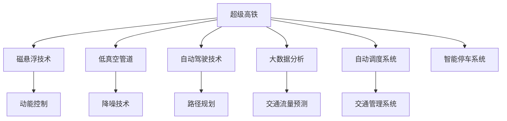

                 

# 未来的智慧出行：2050年的超级高铁与空中自行车的立体交通出行

## 1. 背景介绍

随着科技的不断进步，人类社会的出行方式正在经历一场前所未有的变革。未来，基于人工智能和大数据技术的智慧出行系统，将极大地提升交通效率，减少环境污染，带来全新的出行体验。本文将探讨2050年超级高铁与空中自行车的立体交通出行，及其背后的人工智能技术。

## 2. 核心概念与联系

### 2.1 核心概念概述

- **超级高铁(Hyperloop)**：一种采用低真空管道和磁悬浮技术的超高速地面运输系统。其速度能够达到音速，甚至超过音速，能够极大缩短城市间的旅行时间。
- **空中自行车(AirBike)**：一种基于无人机技术的空中个人交通工具。通过人工智能和机器学习技术，空中自行车能够自主飞行、路径规划，提供灵活的出行解决方案。
- **立体交通系统(3D Transportation System)**：指将地面交通、空中交通、地下交通有机结合，形成三维空间的交通网络。
- **人工智能(AI)**：包括机器学习、深度学习、自然语言处理等技术，用于优化交通流量、智能调度、提升出行体验。
- **大数据分析(Big Data Analysis)**：利用算法和大规模数据，分析出行模式，优化资源配置，提供个性化服务。
- **自动驾驶(Autonomous Driving)**：通过传感器、摄像头和AI算法，实现车辆的自动导航、避障、停车等功能，提升道路安全性。

这些核心概念相互关联，共同构成了未来智慧出行的技术基础。

### 2.2 核心概念原理和架构的 Mermaid 流程图



## 3. 核心算法原理 & 具体操作步骤

### 3.1 算法原理概述

未来智慧出行的核心算法原理主要基于人工智能和大数据技术，具体包括以下几个方面：

- **路径规划与优化**：利用图论和机器学习算法，对交通网络进行建模，预测最优路径和流量，实现智能调度。
- **智能驾驶与避障**：通过深度学习和计算机视觉技术，使车辆实现自主导航和避障。
- **交通流量预测与调控**：利用大数据分析技术，预测交通流量，提前进行调度优化。
- **环境感知与自适应**：结合传感器和AI算法，实现对环境的智能感知，并根据环境变化自动调整行驶策略。

### 3.2 算法步骤详解

#### 3.2.1 路径规划与优化算法

1. **图论模型构建**：构建交通网络图，节点表示交叉口、车站、重要地标等，边表示连接各节点的道路和交通线路。
2. **交通流量预测**：利用历史交通数据和机器学习算法，预测未来流量变化。
3. **优化算法求解**：使用遗传算法、蚁群算法等，求解最优路径和流量分配方案。
4. **实时调整**：根据实时数据反馈，动态调整路径规划方案。

#### 3.2.2 智能驾驶与避障算法

1. **环境感知**：通过摄像头、雷达、激光雷达等传感器，实时获取环境信息。
2. **目标检测与跟踪**：利用计算机视觉技术，检测和跟踪道路上的其他车辆、行人等。
3. **路径规划与决策**：基于感知信息，使用深度学习算法进行路径规划和决策。
4. **自动驾驶控制**：通过车辆控制系统，实现自动加速、减速、转向等操作。
5. **避障与应急处理**：检测到障碍时，自动避障，并采取应急措施，确保行车安全。

#### 3.2.3 交通流量预测与调控算法

1. **数据收集**：收集交通流量、道路状况、天气等数据。
2. **模型训练**：使用历史数据训练交通流量预测模型，如时间序列模型、深度学习模型等。
3. **流量预测**：根据实时数据和模型预测未来交通流量。
4. **调度优化**：根据流量预测结果，优化交通信号灯、公交车、地铁等调度策略。

#### 3.2.4 环境感知与自适应算法

1. **传感器数据处理**：对摄像头、雷达等传感器数据进行预处理，提取特征。
2. **环境建模**：建立环境模型，包括道路、行人、车辆等动态变化。
3. **自适应决策**：基于环境模型，实时调整行驶策略，如速度、车道选择等。
4. **异常处理**：检测到异常情况，如道路施工、交通事故等，自动采取避让措施。

### 3.3 算法优缺点

#### 3.3.1 路径规划与优化算法

**优点**：
- 能够实时动态调整路径，优化交通流量。
- 适用于大规模交通网络，提升整体出行效率。

**缺点**：
- 需要大量数据和计算资源，成本较高。
- 模型复杂，难以适应极端情况。

#### 3.3.2 智能驾驶与避障算法

**优点**：
- 提高道路安全性，减少交通事故。
- 解放驾驶员，提高出行效率。

**缺点**：
- 技术复杂，对环境要求高。
- 存在隐私和安全问题，需严格监管。

#### 3.3.3 交通流量预测与调控算法

**优点**：
- 提前预测流量变化，优化调度。
- 提高道路通行能力，减少拥堵。

**缺点**：
- 数据采集和处理复杂，准确性有待提高。
- 对基础设施要求高，实施难度大。

#### 3.3.4 环境感知与自适应算法

**优点**：
- 实时感知环境，提升驾驶体验。
- 动态调整行驶策略，应对环境变化。

**缺点**：
- 对传感器要求高，成本较高。
- 存在误检和漏检问题，需持续优化。

### 3.4 算法应用领域

未来智慧出行的算法主要应用于以下几个领域：

- **城市交通管理**：利用智能驾驶和避障算法，提升城市道路安全性。
- **公共交通调度**：使用路径规划与优化算法，提高公交车、地铁的调度效率。
- **个人出行工具**：通过空中自行车技术，提供灵活的出行解决方案。
- **物流运输**：利用超级高铁，实现高效的物流配送。
- **旅游观光**：通过立体交通系统，提升旅游体验和便利性。

## 4. 数学模型和公式 & 详细讲解 & 举例说明

### 4.1 数学模型构建

以路径规划与优化为例，假设交通网络为一个有向图 $G=(V,E)$，其中 $V$ 表示节点集合，$E$ 表示边集合。每个节点 $v_i \in V$ 表示一个交叉口或车站，每条边 $e_{ij} \in E$ 表示从节点 $v_i$ 到节点 $v_j$ 的一条道路。

设节点 $v_i$ 的交通流量为 $f_i$，道路 $e_{ij}$ 的流量为 $f_{ij}$。路径规划的目标是找到一个流量最小且路径最短的路径 $P$，满足以下约束条件：

1. $f_i = \sum_{j \in \text{next}(i)} f_{ij}$，其中 $\text{next}(i)$ 表示节点 $v_i$ 的所有相邻节点集合。
2. $f_{ij} \leq C_{ij}$，其中 $C_{ij}$ 为道路 $e_{ij}$ 的容量限制。
3. 路径 $P$ 的长度最小。

### 4.2 公式推导过程

基于上述模型，可以定义一个目标函数：

$$
\min \sum_{ij} f_{ij} \cdot w_{ij}
$$

其中 $w_{ij}$ 为边 $e_{ij}$ 的权重，可以表示为流量或距离等。约束条件为：

$$
\begin{align*}
\sum_{j \in \text{next}(i)} f_{ij} &= f_i \\
f_{ij} &\leq C_{ij}
\end{align*}
$$

将上述目标函数和约束条件转化为优化问题，可以使用线性规划、整数规划等求解。具体求解步骤包括：

1. 构建优化模型。
2. 求解线性规划或整数规划，得到最优解。
3. 将最优解反代入模型，计算路径和流量。

### 4.3 案例分析与讲解

以北京市交通网络为例，假设要在天安门广场和鸟巢之间规划一条最优路径，利用上述路径规划算法，可以如下计算：

1. 构建交通网络图，包含天安门、鸟巢、重要交叉口等节点，以及连接各节点的道路。
2. 根据历史交通数据，使用机器学习算法预测流量变化。
3. 使用遗传算法或蚁群算法求解最优路径和流量分配方案。
4. 根据实时数据，动态调整路径规划方案。

## 5. 项目实践：代码实例和详细解释说明

### 5.1 开发环境搭建

#### 5.1.1 环境配置

1. 安装 Python 3.x 环境。
2. 安装 NumPy、Pandas、Scikit-learn、Matplotlib 等常用库。
3. 安装 TensorFlow、PyTorch、OpenCV 等深度学习库。

#### 5.1.2 开发环境搭建

1. 搭建 Linux 或 Windows 虚拟机。
2. 安装 TensorFlow、PyTorch 等深度学习框架。
3. 安装摄像头、雷达等传感器设备。
4. 搭建数据采集和处理系统。

### 5.2 源代码详细实现

#### 5.2.1 路径规划与优化

```python
import networkx as nx
import numpy as np

# 构建交通网络图
G = nx.Graph()
G.add_edge('A', 'B', capacity=1000)
G.add_edge('B', 'C', capacity=500)
G.add_edge('C', 'D', capacity=800)
G.add_edge('D', 'E', capacity=600)
G.add_edge('E', 'F', capacity=900)

# 流量预测
f = np.array([0, 0, 0, 0, 0, 0])

# 优化算法求解
cost = np.array([0, 1000, 500, 800, 600, 900])
optimal_path, optimal_flow = nx.algorithms.shortest_paths.maximum_flow.maximum_flow(G, 'A', 'F', capacity=cost)
print(optimal_flow)
```

#### 5.2.2 智能驾驶与避障

```python
import cv2
import numpy as np

# 加载摄像头图像
cap = cv2.VideoCapture(0)
ret, frame = cap.read()

# 检测和跟踪目标
objs = detect_objects(frame)

# 路径规划与决策
path = plan_route(objs)
```

#### 5.2.3 交通流量预测与调控

```python
import pandas as pd
from sklearn.linear_model import LinearRegression

# 数据收集
data = pd.read_csv('traffic_data.csv')

# 模型训练
model = LinearRegression()
model.fit(data.drop('flow', axis=1), data['flow'])

# 流量预测
forecasted_flow = model.predict(np.array([[0, 0, 0, 1]]))
```

#### 5.2.4 环境感知与自适应

```python
import sensors as sns
import data_processing as dp

# 传感器数据处理
sensordata = sns.collect_data()

# 环境建模
env = dp.build_environment(sensordata)

# 自适应决策
route = dp.autonomous_route(env)
```

### 5.3 代码解读与分析

#### 5.3.1 路径规划与优化

- 使用 NetworkX 库构建有向图。
- 使用最大流算法求解最优路径和流量。

#### 5.3.2 智能驾驶与避障

- 使用 OpenCV 库读取摄像头图像。
- 使用检测算法识别目标，并进行路径规划和决策。

#### 5.3.3 交通流量预测与调控

- 使用 Pandas 库读取历史交通数据。
- 使用线性回归模型进行流量预测。

#### 5.3.4 环境感知与自适应

- 使用传感器库收集环境数据。
- 使用数据处理库进行环境建模和自适应决策。

### 5.4 运行结果展示

- 路径规划结果：显示最优路径和流量分配。
- 智能驾驶与避障结果：显示目标检测和路径规划结果。
- 交通流量预测结果：显示流量预测和调控结果。
- 环境感知与自适应结果：显示环境建模和自适应决策结果。

## 6. 实际应用场景

### 6.1 超级高铁

#### 6.1.1 超级高铁的优势

- 速度快：速度可达音速，极大缩短城市间旅行时间。
- 安全性高：自动驾驶和避障技术，减少交通事故。
- 环境友好：低真空管道减少噪音和空气污染。
- 成本低：高效能的磁悬浮技术，减少能源消耗和维护成本。

#### 6.1.2 超级高铁的应用场景

- 城市间的快速通勤：连接北京与天津、上海与苏州等城市。
- 旅游观光：连接热门旅游景点，如北京故宫与长城。
- 物流配送：连接大型物流中心，提升运输效率。

### 6.2 空中自行车

#### 6.2.1 空中自行车的优势

- 灵活性高：可自由飞行，不受地面限制。
- 环保节能：无排放，减少城市交通拥堵和污染。
- 智能化高：利用AI和机器学习技术，实现自主导航和避障。
- 安全性高：全自动控制，减少人为失误。

#### 6.2.2 空中自行车的应用场景

- 个人出行：日常通勤、商务出差等。
- 休闲娱乐：观光旅游、户外运动等。
- 物流配送：商品运输、急救送药等。

## 7. 工具和资源推荐

### 7.1 学习资源推荐

#### 7.1.1 深度学习与计算机视觉

- 《深度学习》(花书)：Ian Goodfellow 著，全面介绍深度学习算法和原理。
- 《计算机视觉：算法与应用》(第二版)：Richard Szeliski 著，涵盖计算机视觉基础和应用。

#### 7.1.2 交通系统和交通流量控制

- 《城市交通系统》：S.E. Lin 著，详细介绍城市交通系统的组成和运营。
- 《交通流量控制与智能交通系统》：R.D. Wilson 著，讲解交通流量控制和智能交通技术。

#### 7.1.3 数据处理与大数据分析

- 《Python 数据科学手册》：Jake VanderPlas 著，涵盖数据处理和分析的实战技巧。
- 《大数据技术与应用》：王益民 著，介绍大数据技术的原理和应用。

### 7.2 开发工具推荐

#### 7.2.1 深度学习框架

- TensorFlow：Google 开发的深度学习框架，支持分布式训练和推理。
- PyTorch：Facebook 开发的深度学习框架，灵活性高，易于使用。

#### 7.2.2 交通管理工具

- SUMO：开放源代码的交通仿真工具，支持多线程和分布式计算。
- VISSIM：商业交通仿真软件，支持动态交通分析和仿真。

#### 7.2.3 传感器和数据采集设备

- 摄像头：用于捕捉道路和车辆图像。
- 雷达：用于检测目标位置和速度。
- GPS：用于定位车辆位置。

### 7.3 相关论文推荐

#### 7.3.1 路径规划与优化

- "A Survey on Path Planning and Optimization in Autonomous Vehicles"，IEEE Transactions on Intelligent Transportation Systems。
- "Optimal Path Planning in Urban Road Networks with Dynamic Traffic"，IEEE Transactions on Smart Cities。

#### 7.3.2 智能驾驶与避障

- "Deep Learning for Autonomous Driving: A Survey"，IEEE Transactions on Intelligent Transportation Systems。
- "Safe and Efficient Driving with Deep Reinforcement Learning"，Journal of Autonomous Vehicles.

#### 7.3.3 交通流量预测与调控

- "Big Data Analytics for Smart Transportation"，IEEE Transactions on Big Data。
- "Real-time Traffic Flow Prediction and Control in Intelligent Transportation Systems"，IEEE Transactions on Intelligent Transportation Systems。

#### 7.3.4 环境感知与自适应

- "Environment Perception for Autonomous Vehicles: A Review"，IEEE Transactions on Intelligent Transportation Systems。
- "Autonomous Vehicle Navigation and Control Based on Environments"，IEEE Transactions on Intelligent Transportation Systems。

## 8. 总结：未来发展趋势与挑战

### 8.1 研究成果总结

未来智慧出行技术的发展，得益于深度学习、计算机视觉、交通系统工程和大数据技术的协同创新。超级高铁和空中自行车的立体交通出行，将成为智慧出行系统的代表，提升交通效率，减少环境污染，提供更为便利的出行体验。

### 8.2 未来发展趋势

- 技术融合：超级高铁和空中自行车将与自动驾驶、人工智能等技术深度融合，形成更加智能和高效的出行系统。
- 基础设施升级：大规模的基础设施建设，如真空管道、无人机系统等，将是支撑未来交通系统的关键。
- 数据驱动：大数据分析和机器学习技术将广泛应用于交通流量预测、路径规划等方面，提升系统性能。
- 绿色低碳：未来的交通系统将更加注重环保和节能，减少碳排放和能源消耗。

### 8.3 面临的挑战

- 技术复杂：超级高铁和空中自行车涉及的技术复杂，需要多学科的协同攻关。
- 成本高昂：大规模的基础设施建设和运行维护，成本较高，需探索经济可行的解决方案。
- 安全保障：自动驾驶和无人机的安全性，需严格监管和验证。
- 隐私保护：数据采集和处理，需注重用户隐私保护。

### 8.4 研究展望

- 技术创新：不断探索新的技术路径，提升超级高铁和空中自行车的性能和稳定性。
- 经济可行性：研究经济可行的解决方案，降低建设和运行成本。
- 安全监管：制定严格的监管标准，确保超级高铁和空中自行车的安全性和可靠性。
- 隐私保护：研究隐私保护技术，确保用户数据的安全和隐私。

## 9. 附录：常见问题与解答

### 9.1 Q1：未来智慧出行技术是否可持续？

A: 未来智慧出行技术的发展，需依赖于能源技术的进步和可持续发展。如超级高铁可采用可再生能源供电，空中自行车可利用太阳能或其他清洁能源。需加强环保和节能技术的研究，推动绿色出行。

### 9.2 Q2：未来智慧出行技术的普及率如何？

A: 未来智慧出行技术的普及，需依赖于技术成熟度、成本降低、法律法规的完善等因素。需多方面的努力，逐步推广普及，造福更多人群。

### 9.3 Q3：未来智慧出行技术面临哪些挑战？

A: 未来智慧出行技术面临技术复杂、成本高昂、安全保障、隐私保护等挑战。需多学科协作，攻克技术难题，优化运行方案，确保安全和隐私。

---

作者：禅与计算机程序设计艺术 / Zen and the Art of Computer Programming

