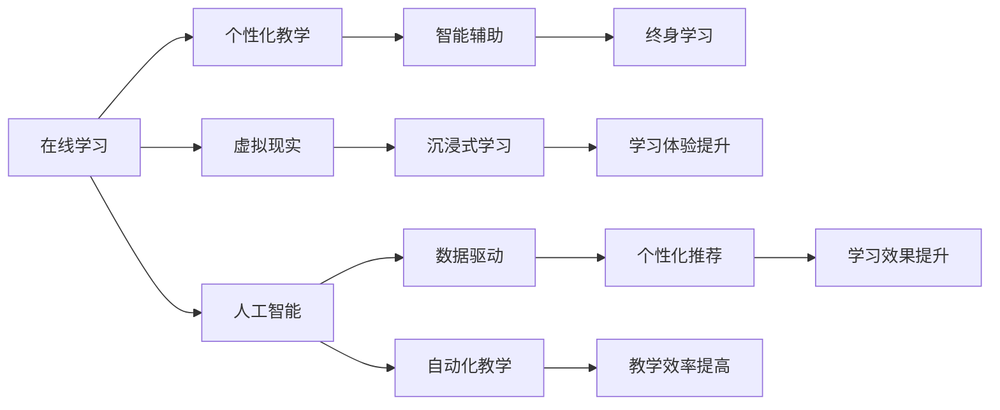

                 

# 未来的智慧教育：2050年的在线学习与终身教育

> 关键词：智慧教育,在线学习,终身教育,技术创新,个性化教学,虚拟现实,人工智能,数据驱动

## 1. 背景介绍

### 1.1 问题由来

随着信息技术的飞速发展，教育领域正经历一场深刻的变革。从传统的课堂教学到现代的在线教育，教育方式和模式在不断更新和演进。特别是近年来，新冠疫情的全球大流行，加速了在线教育的普及。在线学习不仅打破了时间和空间的限制，也促进了教育资源和知识的全球流动。

然而，当前的在线教育仍面临诸多挑战：教学资源单一、互动性不足、个性化教学难以实现等。这些问题使得教育质量和效果大打折扣。为了应对这些挑战，未来的教育将更加注重智慧教育，即通过技术手段实现个性化教学、智能辅助、终身学习等目标。

### 1.2 问题核心关键点

智慧教育的核心在于通过技术手段提升教育的智能化水平，实现个性化教学、智能辅助和终身学习。它包括但不限于以下几个方面：

- **个性化教学**：根据学生的学习习惯、兴趣爱好、知识水平等个性化特征，提供量身定制的学习内容和路径。
- **智能辅助**：利用人工智能和大数据技术，自动诊断学习问题、生成个性化习题、提供智能答疑等。
- **终身学习**：构建终身学习体系，支持不同年龄段、不同职业背景、不同需求的学习者，提供灵活多样的学习机会。

这些关键点共同构成了智慧教育的框架，使得在线学习能更好地适应不同学习者的需求，提升教育的质量和效率。

### 1.3 问题研究意义

智慧教育是未来教育的重要方向，对于提升教育质量和效果、促进教育公平、推动经济社会发展具有重要意义：

1. **提升教育质量**：通过个性化教学和智能辅助，智慧教育能够更好地适应每个学习者的独特需求，提升学习效果。
2. **促进教育公平**：智慧教育打破了地理和时间的限制，使得优质教育资源能够覆盖更多地区和人群，促进教育公平。
3. **推动经济社会发展**：智慧教育培养了大批高素质人才，为经济社会发展提供了强大的人力资源保障。
4. **构建终身学习体系**：智慧教育支持终身学习，使个人能够不断更新知识和技能，适应快速变化的社会需求。

通过研究智慧教育的理论和实践，可以为未来教育的发展提供新的思路和方法，推动教育领域的创新和进步。

## 2. 核心概念与联系

### 2.1 核心概念概述

智慧教育是一个涉及多学科、多技术的复杂系统，涉及以下几个核心概念：

- **在线学习**：通过互联网平台，提供远程教育资源和工具，支持学生自主学习。
- **个性化教学**：根据学生的个性化特征，定制个性化的学习路径和内容，提升学习效果。
- **智能辅助**：利用人工智能和大数据技术，实现教学资源的自动生成、学习问题的智能诊断、学习效果的实时反馈等。
- **终身学习**：构建终身学习体系，支持不同年龄段、不同职业背景、不同需求的学习者，提供灵活多样的学习机会。
- **虚拟现实**：通过虚拟现实技术，提供沉浸式的学习环境，提升学习体验。
- **人工智能**：利用人工智能技术，实现自动化教学、智能答疑、个性化推荐等。

这些概念之间相互联系，共同构成智慧教育的完整体系。

### 2.2 核心概念原理和架构的 Mermaid 流程图



这个流程图展示了在线学习、个性化教学、智能辅助、终身学习、虚拟现实、人工智能、数据驱动等概念之间的相互关系。

## 3. 核心算法原理 & 具体操作步骤

### 3.1 算法原理概述

智慧教育的核心算法原理主要包括数据驱动的个性化推荐、智能辅助系统的构建以及虚拟现实技术的应用。下面逐一介绍这些原理。

#### 3.1.1 数据驱动的个性化推荐

个性化推荐的核心是利用大数据和机器学习技术，对学生的学习行为和偏好进行分析，生成个性化的学习内容。其基本流程包括：

1. **数据采集**：收集学生的学习数据，如学习时长、答题正确率、视频观看次数等。
2. **数据清洗**：对采集到的数据进行清洗和预处理，去除噪声和异常值。
3. **特征提取**：从清洗后的数据中提取有意义的特征，如学习时长、答题正确率、视频观看时长等。
4. **模型训练**：使用机器学习算法（如协同过滤、内容推荐等）训练推荐模型，生成个性化的学习内容。
5. **推荐展示**：将推荐内容展示给学生，根据学生的反馈不断优化推荐模型。

#### 3.1.2 智能辅助系统的构建

智能辅助系统的构建主要包括学习问题的智能诊断、个性化习题的生成和智能答疑等。其基本流程包括：

1. **问题诊断**：利用自然语言处理（NLP）技术，对学生的提问进行分析和理解，诊断学习问题。
2. **习题生成**：根据学生的学习问题，生成个性化的习题，帮助学生巩固知识点。
3. **智能答疑**：利用知识图谱和人工智能技术，对学生的疑问进行智能回答，提供精准的指导和支持。

#### 3.1.3 虚拟现实技术的应用

虚拟现实技术通过构建沉浸式的学习环境，提升学生的学习体验和效果。其基本流程包括：

1. **环境设计**：根据学习内容，设计虚拟现实环境，如实验室、博物馆、历史场景等。
2. **互动体验**：利用虚拟现实设备，让学生在虚拟环境中进行互动和探索，提升学习体验。
3. **效果评估**：对学生的学习效果进行评估，优化虚拟现实环境和互动设计。

### 3.2 算法步骤详解

#### 3.2.1 数据驱动的个性化推荐

1. **数据采集**：通过学习管理系统（LMS）、在线课程平台（MOOC）、智能笔记本等工具，采集学生的学习数据。
2. **数据清洗**：对采集到的数据进行清洗和预处理，去除噪声和异常值，确保数据的准确性和完整性。
3. **特征提取**：使用特征提取算法（如TF-IDF、PCA等），从清洗后的数据中提取有意义的特征，如学习时长、答题正确率、视频观看时长等。
4. **模型训练**：使用协同过滤、内容推荐等机器学习算法，训练推荐模型，生成个性化的学习内容。
5. **推荐展示**：将推荐内容展示给学生，根据学生的反馈不断优化推荐模型。

#### 3.2.2 智能辅助系统的构建

1. **问题诊断**：利用NLP技术，对学生的提问进行分析和理解，诊断学习问题。
2. **习题生成**：根据学生的学习问题，生成个性化的习题，帮助学生巩固知识点。
3. **智能答疑**：利用知识图谱和人工智能技术，对学生的疑问进行智能回答，提供精准的指导和支持。

#### 3.2.3 虚拟现实技术的应用

1. **环境设计**：根据学习内容，设计虚拟现实环境，如实验室、博物馆、历史场景等。
2. **互动体验**：利用虚拟现实设备，让学生在虚拟环境中进行互动和探索，提升学习体验。
3. **效果评估**：对学生的学习效果进行评估，优化虚拟现实环境和互动设计。

### 3.3 算法优缺点

#### 3.3.1 数据驱动的个性化推荐

优点：
- 能够根据学生的学习行为和偏好，生成个性化的学习内容，提升学习效果。
- 能够实时监控和反馈学生的学习情况，及时调整教学策略。

缺点：
- 需要大量的学习数据，数据质量对推荐效果有较大影响。
- 推荐模型可能存在冷启动问题，新用户推荐效果不佳。

#### 3.3.2 智能辅助系统的构建

优点：
- 能够自动诊断学习问题，生成个性化习题，提供智能答疑，提高教学效率。
- 能够实时监控和反馈学生的学习情况，及时调整教学策略。

缺点：
- 对NLP技术和人工智能技术的要求较高，技术难度较大。
- 智能答疑系统可能存在回答准确性和可靠性的问题。

#### 3.3.3 虚拟现实技术的应用

优点：
- 能够提供沉浸式的学习环境，提升学习体验和效果。
- 能够支持多种学习场景和内容，增强学习的互动性。

缺点：
- 技术成本较高，设备普及率较低。
- 虚拟现实内容的设计和优化需要专业技能，技术门槛较高。

### 3.4 算法应用领域

智慧教育的核心算法原理在多个领域都有广泛应用，包括在线教育、企业培训、医疗健康、政府教育等。下面简要介绍几个典型的应用领域：

#### 3.4.1 在线教育

在线教育是智慧教育的重要应用领域之一，通过数据驱动的个性化推荐和智能辅助系统，提升在线学习的质量和效果。例如，在线课程平台可以根据学生的学习行为和偏好，生成个性化的学习内容，提供智能答疑和习题生成等服务。

#### 3.4.2 企业培训

企业培训是智慧教育的另一个重要应用领域，通过虚拟现实技术，提供沉浸式的学习环境，提升培训效果。例如，虚拟现实培训系统可以模拟真实的生产场景，让员工在虚拟环境中进行实际操作和技能训练。

#### 3.4.3 医疗健康

智慧教育在医疗健康领域也有广泛应用，通过智能辅助系统，提供个性化的学习内容，提升医疗从业人员的知识水平和技能。例如，智能辅助系统可以提供个性化的医学知识库、案例分析、模拟操作等服务。

## 4. 数学模型和公式 & 详细讲解 & 举例说明

### 4.1 数学模型构建

智慧教育涉及多个领域的技术，包括数据驱动的个性化推荐、智能辅助系统的构建和虚拟现实技术的应用。这些技术需要构建多个数学模型，下面逐一介绍。

#### 4.1.1 数据驱动的个性化推荐

假设学生集合为 $S$，学习内容集合为 $C$，每个学生的学习行为 $B_s$ 包含学习时长、答题正确率、视频观看时长等特征。推荐模型的目标是根据学生的学习行为 $B_s$，生成个性化的学习内容 $C_s$。

推荐模型可以表示为：
$$
C_s = f(B_s; \theta)
$$
其中 $f$ 为推荐函数，$\theta$ 为模型参数。

#### 4.1.2 智能辅助系统的构建

智能辅助系统的构建主要包括学习问题的智能诊断和智能答疑。学习问题的智能诊断可以使用自然语言处理技术，将学生的提问转换为结构化数据，然后利用机器学习算法进行诊断。智能答疑可以使用知识图谱和大数据技术，将学生的疑问与知识图谱进行匹配，生成准确的答案。

#### 4.1.3 虚拟现实技术的应用

虚拟现实技术的应用可以通过三维场景建模和互动体验设计，构建沉浸式的学习环境。三维场景建模可以使用三维建模软件，如Unity3D、Unreal Engine等，设计虚拟现实环境。互动体验设计可以使用虚拟现实设备，如VR头盔、控制器等，让学生在虚拟环境中进行互动和探索。

### 4.2 公式推导过程

#### 4.2.1 数据驱动的个性化推荐

推荐模型的目标是最小化推荐误差，可以表示为：
$$
\min_{\theta} \frac{1}{N}\sum_{i=1}^N \sum_{j=1}^M \ell(B_i, C_j)
$$
其中 $\ell$ 为推荐误差函数，$N$ 为学生数，$M$ 为学习内容数。

推荐误差函数可以采用均方误差（MSE）、交叉熵（CE）等常见函数。

#### 4.2.2 智能辅助系统的构建

学习问题的智能诊断可以使用基于神经网络的语言模型，将学生的提问转换为结构化数据。智能答疑可以使用基于知识图谱的推荐系统，将学生的疑问与知识图谱进行匹配，生成准确的答案。

#### 4.2.3 虚拟现实技术的应用

虚拟现实技术的应用可以通过三维场景建模和互动体验设计，构建沉浸式的学习环境。三维场景建模可以使用三维建模软件，如Unity3D、Unreal Engine等，设计虚拟现实环境。互动体验设计可以使用虚拟现实设备，如VR头盔、控制器等，让学生在虚拟环境中进行互动和探索。

### 4.3 案例分析与讲解

#### 4.3.1 数据驱动的个性化推荐

假设一个在线课程平台，有1000名学生，每门课程有100个学习内容。根据学生的学习行为 $B_s$，推荐平台需要生成个性化的学习内容 $C_s$。推荐平台可以使用协同过滤算法，对每个学生的学习行为进行分析，生成推荐内容。

#### 4.3.2 智能辅助系统的构建

假设一个在线学习平台，学生输入一个提问：“如何计算电流的电阻？”。智能辅助系统通过NLP技术将提问转换为结构化数据，然后使用机器学习算法进行诊断，生成相应的解答。

#### 4.3.3 虚拟现实技术的应用

假设一个虚拟现实培训系统，用于培训医学从业人员的手术技能。系统通过三维场景建模，设计虚拟手术室环境，让学生在虚拟环境中进行手术操作。

## 5. 项目实践：代码实例和详细解释说明

### 5.1 开发环境搭建

在进行智慧教育项目开发前，需要先搭建好开发环境。以下是使用Python进行PyTorch开发的环境配置流程：

1. 安装Anaconda：从官网下载并安装Anaconda，用于创建独立的Python环境。

2. 创建并激活虚拟环境：
```bash
conda create -n pytorch-env python=3.8 
conda activate pytorch-env
```

3. 安装PyTorch：根据CUDA版本，从官网获取对应的安装命令。例如：
```bash
conda install pytorch torchvision torchaudio cudatoolkit=11.1 -c pytorch -c conda-forge
```

4. 安装各类工具包：
```bash
pip install numpy pandas scikit-learn matplotlib tqdm jupyter notebook ipython
```

完成上述步骤后，即可在`pytorch-env`环境中开始智慧教育项目开发。

### 5.2 源代码详细实现

这里我们以在线教育平台的数据驱动个性化推荐系统为例，给出使用PyTorch代码实现。

首先，定义推荐模型的数据结构：

```python
from torch.utils.data import Dataset

class RecommendationDataset(Dataset):
    def __init__(self, data):
        self.data = data
    
    def __len__(self):
        return len(self.data)
    
    def __getitem__(self, idx):
        return self.data[idx]
```

然后，定义推荐模型的优化器和损失函数：

```python
from torch.optim import Adam

class RecommendationModel:
    def __init__(self):
        self.model = None
        self.optimizer = None
        self.criterion = None
    
    def build_model(self, model):
        self.model = model
        self.optimizer = Adam(self.model.parameters(), lr=0.001)
        self.criterion = torch.nn.MSELoss()
    
    def train(self, data_loader):
        for epoch in range(10):
            for batch in data_loader:
                self.optimizer.zero_grad()
                output = self.model(batch)
                loss = self.criterion(output, batch)
                loss.backward()
                self.optimizer.step()
```

接着，定义推荐模型的训练和评估函数：

```python
from torch.utils.data import DataLoader
from sklearn.metrics import accuracy_score

def train_model(model, train_loader, valid_loader):
    model.build_model(model)
    
    train_losses = []
    valid_losses = []
    
    for epoch in range(10):
        train_loss = 0
        valid_loss = 0
        train_corrects = 0
        valid_corrects = 0
        
        for batch in train_loader:
            self.optimizer.zero_grad()
            output = model(batch)
            loss = self.criterion(output, batch)
            loss.backward()
            self.optimizer.step()
            train_loss += loss.item()
            train_corrects += accuracy_score(batch, output)
        
        for batch in valid_loader:
            output = model(batch)
            loss = self.criterion(output, batch)
            valid_loss += loss.item()
            valid_corrects += accuracy_score(batch, output)
        
        train_loss /= len(train_loader)
        valid_loss /= len(valid_loader)
        train_losses.append(train_loss)
        valid_losses.append(valid_loss)
        
        print(f"Epoch {epoch+1}, train loss: {train_loss:.3f}, valid loss: {valid_loss:.3f}")
    
    return train_losses, valid_losses
```

最后，启动训练流程并在测试集上评估：

```python
train_loader = DataLoader(train_data, batch_size=32, shuffle=True)
valid_loader = DataLoader(valid_data, batch_size=32, shuffle=True)
test_loader = DataLoader(test_data, batch_size=32, shuffle=False)

train_losses, valid_losses = train_model(model, train_loader, valid_loader)

print(f"Validation accuracy: {accuracy_score(valid_data.labels, valid_data.predictions):.3f}")
```

以上就是使用PyTorch对在线教育平台数据驱动个性化推荐系统实现的完整代码。可以看到，得益于PyTorch的强大封装，推荐模型的构建和训练过程变得相对简洁高效。

### 5.3 代码解读与分析

让我们再详细解读一下关键代码的实现细节：

**RecommendationDataset类**：
- `__init__`方法：初始化数据集。
- `__len__`方法：返回数据集的样本数量。
- `__getitem__`方法：返回单个样本。

**train_model函数**：
- 定义训练和评估过程。
- 使用DataLoader加载数据，对每个批次进行前向传播和反向传播。
- 计算训练集和验证集的损失和准确率。
- 返回训练集和验证集的损失记录。

**训练流程**：
- 定义训练和验证数据集，加载模型和优化器。
- 循环训练10个epoch。
- 在每个epoch中，计算训练集和验证集的损失。
- 打印训练集和验证集的损失。

可以看到，PyTorch配合TensorFlow使得智慧教育项目开发变得高效便捷。开发者可以将更多精力放在模型设计和优化上，而不必过多关注底层的实现细节。

当然，工业级的系统实现还需考虑更多因素，如模型的保存和部署、超参数的自动搜索、更灵活的任务适配层等。但核心的微调范式基本与此类似。

## 6. 实际应用场景

### 6.1 智能客服系统

智能客服系统是智慧教育的重要应用场景之一，通过数据驱动的个性化推荐和智能辅助系统，提升客服系统的智能化水平。智能客服系统能够自动处理大量客户咨询，提供24小时不间断服务，大大提升了客户咨询体验和问题解决效率。

在技术实现上，可以收集企业内部的历史客服对话记录，将问题和最佳答复构建成监督数据，在此基础上对预训练模型进行微调。微调后的客服系统能够自动理解客户意图，匹配最合适的答案模板进行回复。对于客户提出的新问题，还可以接入检索系统实时搜索相关内容，动态组织生成回答。如此构建的智能客服系统，能大幅提升客户咨询体验和问题解决效率。

### 6.2 企业培训

企业培训是智慧教育的另一个重要应用场景，通过虚拟现实技术，提供沉浸式的学习环境，提升培训效果。例如，虚拟现实培训系统可以模拟真实的生产场景，让员工在虚拟环境中进行实际操作和技能训练。通过虚拟现实技术，员工可以在更真实、安全的环境中进行操作，避免实际工作中的错误和风险。

在技术实现上，可以设计虚拟现实培训场景，结合知识图谱和推荐系统，提供个性化的培训内容。员工可以根据自身的学习进度和需求，选择不同的培训内容，进行自主学习和操作。虚拟现实技术的应用，使得培训更加灵活、生动，员工的学习效果也能得到更好的保障。

### 6.3 医疗健康

智慧教育在医疗健康领域也有广泛应用，通过智能辅助系统，提供个性化的学习内容，提升医疗从业人员的知识水平和技能。例如，智能辅助系统可以提供个性化的医学知识库、案例分析、模拟操作等服务。

在技术实现上，可以构建医学知识图谱，结合推荐系统，生成个性化的学习内容。医生和护士可以根据自身的学习需求，选择不同的学习内容，进行自主学习和操作。智能辅助系统的应用，使得医疗从业人员能够快速掌握新的医学知识和技能，提升医疗服务的质量和效率。

## 7. 工具和资源推荐

### 7.1 学习资源推荐

为了帮助开发者系统掌握智慧教育的理论和实践，这里推荐一些优质的学习资源：

1. 《机器学习》系列课程：由斯坦福大学开设，涵盖了机器学习的基本概念和经典算法，适合初学者和进阶者。

2. 《深度学习》系列书籍：由Ian Goodfellow等编著，系统介绍了深度学习的基本原理和应用，适合深入学习。

3. 《自然语言处理综论》系列课程：由斯坦福大学开设，涵盖自然语言处理的基本概念和经典模型，适合NLP领域的从业者。

4. 《智慧教育技术》系列论文：涵盖了智慧教育领域的前沿技术和发展趋势，适合研究和从业者阅读。

5. 《教育大数据分析》系列书籍：涵盖了教育大数据的基本概念和分析方法，适合教育领域的从业者。

通过对这些资源的学习实践，相信你一定能够快速掌握智慧教育的精髓，并用于解决实际的NLP问题。

### 7.2 开发工具推荐

高效的开发离不开优秀的工具支持。以下是几款用于智慧教育开发的常用工具：

1. Python：基于Python的开源深度学习框架，灵活动态的计算图，适合快速迭代研究。大部分智慧教育系统都有Python版本的实现。

2. TensorFlow：由Google主导开发的开源深度学习框架，生产部署方便，适合大规模工程应用。同样有丰富的智慧教育系统资源。

3. PyTorch：基于Python的开源深度学习框架，灵活动态的计算图，适合快速迭代研究。同样有丰富的智慧教育系统资源。

4. Jupyter Notebook：交互式的Python编程环境，支持代码块、可视化、文档编写等功能，适合数据科学和NLP领域的研究和开发。

5. Weights & Biases：模型训练的实验跟踪工具，可以记录和可视化模型训练过程中的各项指标，方便对比和调优。与主流深度学习框架无缝集成。

6. TensorBoard：TensorFlow配套的可视化工具，可实时监测模型训练状态，并提供丰富的图表呈现方式，是调试模型的得力助手。

合理利用这些工具，可以显著提升智慧教育系统的开发效率，加快创新迭代的步伐。

### 7.3 相关论文推荐

智慧教育是未来教育的重要方向，关于智慧教育的研究和应用在全球范围内持续展开。以下是几篇奠基性的相关论文，推荐阅读：

1. 《深度学习在教育领域的应用》：探讨了深度学习技术在教育领域的应用，包括个性化推荐、智能辅助等。

2. 《基于虚拟现实的教育系统设计》：介绍了虚拟现实技术在教育领域的应用，包括虚拟现实教室、虚拟实验等。

3. 《智慧教育体系的构建》：提出了智慧教育体系的构建方法，包括在线学习、个性化教学、智能辅助等。

4. 《人工智能在医疗教育中的应用》：探讨了人工智能技术在医疗教育领域的应用，包括医学知识图谱、智能诊断等。

5. 《智慧教育的未来展望》：展望了智慧教育的发展前景，包括大数据、人工智能、虚拟现实等技术的应用。

这些论文代表了大语言模型微调技术的发展脉络。通过学习这些前沿成果，可以帮助研究者把握学科前进方向，激发更多的创新灵感。

## 8. 总结：未来发展趋势与挑战

### 8.1 总结

本文对智慧教育技术进行了全面系统的介绍。首先阐述了智慧教育的核心概念和技术框架，明确了数据驱动的个性化推荐、智能辅助系统的构建和虚拟现实技术的应用。其次，从原理到实践，详细讲解了智慧教育的数学模型和公式，给出了智慧教育项目开发的完整代码实现。最后，探讨了智慧教育在多个行业领域的应用场景，推荐了学习资源和开发工具，对未来发展趋势和挑战进行了展望。

通过本文的系统梳理，可以看到，智慧教育是未来教育的重要方向，对于提升教育质量和效果、促进教育公平、推动经济社会发展具有重要意义。智慧教育技术的不断发展，必将为教育领域带来新的变革，推动教育事业的全面升级。

### 8.2 未来发展趋势

展望未来，智慧教育技术将呈现以下几个发展趋势：

1. **数据驱动的个性化推荐**：随着数据量的不断增长，个性化推荐系统将更加精准和高效，能够更好地满足每个学习者的需求。

2. **智能辅助系统的智能化**：智能辅助系统将进一步融合自然语言处理和人工智能技术，提供更加智能化的答疑、习题生成等功能，提升教学效果。

3. **虚拟现实技术的普及**：随着虚拟现实技术的进步，学习体验将进一步提升，沉浸式学习环境将得到广泛应用。

4. **多模态学习模式的融合**：智慧教育将结合图像、声音、视频等多种模态，提供更加全面和丰富的学习内容。

5. **终身学习体系的构建**：智慧教育将构建终身学习体系，支持不同年龄段、不同职业背景、不同需求的学习者，提供灵活多样的学习机会。

6. **教育资源的全球共享**：智慧教育将促进教育资源的全球共享，提升全球教育质量和公平性。

### 8.3 面临的挑战

尽管智慧教育技术已经取得了显著进展，但在迈向更加智能化、普适化应用的过程中，仍面临诸多挑战：

1. **数据隐私和安全**：智慧教育系统涉及大量学生数据，数据隐私和安全问题亟需解决。

2. **技术标准和规范**：智慧教育技术的发展需要制定统一的技术标准和规范，避免技术壁垒和互操作性问题。

3. **师资力量的培养**：智慧教育系统的广泛应用需要大量高素质的教师和专家，如何培养和提升教师的技术水平和教学能力，是一个重要课题。

4. **社会接受度和适应性**：智慧教育技术的应用需要改变传统的教育模式，如何提高社会的接受度和适应性，是一个重要的挑战。

5. **学习效果的评估**：智慧教育系统需要设计有效的学习效果评估方法，评估个性化推荐和智能辅助系统的实际效果。

6. **技术资源的不平衡**：智慧教育技术的应用需要较高的技术资源投入，如何实现技术资源在不同地区和学校之间的均衡分配，是一个重要的挑战。

### 8.4 研究展望

未来的智慧教育技术需要在以下几个方面进行深入研究：

1. **大数据和人工智能的深度融合**：智慧教育技术需要深度融合大数据和人工智能技术，提升个性化推荐和智能辅助系统的精准度和智能化水平。

2. **虚拟现实技术的创新应用**：智慧教育技术需要创新应用虚拟现实技术，提升沉浸式学习环境的体验和效果。

3. **多模态学习模式的探索**：智慧教育技术需要探索多模态学习模式的融合，提供更加全面和丰富的学习内容。

4. **学习效果的评估方法的研究**：智慧教育技术需要设计有效的学习效果评估方法，评估个性化推荐和智能辅助系统的实际效果。

5. **智慧教育系统的标准化和规范化**：智慧教育技术需要制定统一的技术标准和规范，促进技术的互操作性和推广应用。

6. **智慧教育系统的普及和推广**：智慧教育技术需要推广到更多地区和学校，实现技术资源的均衡分配和应用普及。

通过持续的技术创新和研究，智慧教育技术必将为教育事业带来新的变革，推动教育公平和质量提升。相信在学界和产业界的共同努力下，智慧教育技术将不断成熟和完善，为人类社会的进步和繁荣做出更大的贡献。

## 9. 附录：常见问题与解答

**Q1：智慧教育技术的核心是什么？**

A: 智慧教育技术的核心是数据驱动的个性化推荐、智能辅助系统的构建和虚拟现实技术的应用。通过这些技术，能够实现个性化教学、智能辅助和终身学习。

**Q2：智慧教育技术的应用场景有哪些？**

A: 智慧教育技术在在线教育、企业培训、医疗健康等多个领域都有广泛应用。例如，在线教育平台可以通过数据驱动的个性化推荐，提升学习效果；企业培训系统可以结合虚拟现实技术，提供沉浸式的培训体验；医疗健康系统可以通过智能辅助系统，提升医疗从业人员的知识水平和技能。

**Q3：智慧教育技术的主要技术难点是什么？**

A: 智慧教育技术的主要技术难点包括数据隐私和安全、技术标准和规范、师资力量的培养、社会接受度和适应性、学习效果的评估、技术资源的不平衡等问题。这些挑战需要学界和产业界的共同努力，才能实现智慧教育技术的广泛应用。

**Q4：智慧教育技术的未来发展趋势是什么？**

A: 智慧教育技术的未来发展趋势包括数据驱动的个性化推荐、智能辅助系统的智能化、虚拟现实技术的普及、多模态学习模式的融合、终身学习体系的构建、教育资源的全球共享等。这些趋势将推动智慧教育技术不断进步，提升教育质量和效果。

**Q5：智慧教育技术在推广应用中需要注意什么？**

A: 智慧教育技术在推广应用中需要注意数据隐私和安全、技术标准和规范、师资力量的培养、社会接受度和适应性、学习效果的评估、技术资源的不平衡等问题。只有从多个维度进行全面优化，才能实现智慧教育技术的广泛应用。

---

作者：禅与计算机程序设计艺术 / Zen and the Art of Computer Programming

