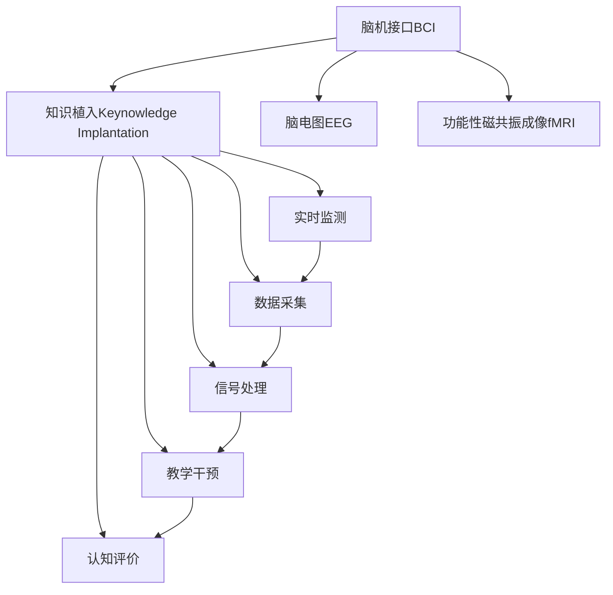

                 

# 未来的智慧教育：2050年的脑机接口学习与知识植入

## 1. 背景介绍

### 1.1 问题的由来
21世纪以来，教育领域迎来了空前的数字化变革。在线教育、远程学习、智能辅助等新技术极大地提升了教育质量和可及性，但同时也带来了新的挑战。如何更精准地实现个性化教育、提升学生的学习效果，成为教育界关注的焦点。

随着神经科学和脑机接口技术的飞速发展，未来2050年的教育场景可能出现革命性的变化。脑机接口(Brain-Computer Interface, BCI)技术的突破，将使学习者能够直接与计算机系统进行高效互动，显著提升知识获取的效率和质量。通过知识植入(Keynowledge Implantation)技术，学习者可以更加高效地掌握知识，跨越传统的学习路径，加速自身成长。

### 1.2 问题核心关键点
基于脑机接口和大数据、人工智能技术的教育系统，将能够实时监测学习者的脑电信号，动态调整教学内容，实现个性化教育。知识植入技术则直接将学习内容导入大脑，帮助学习者快速掌握知识，提升认知能力。

脑机接口学习系统的核心在于数据采集、信号处理、教学干预和认知评价。数据采集环节，通过脑电图(EEG)、功能性磁共振成像(fMRI)等技术，获取学习者的脑电信号和大脑活动图像。信号处理环节，利用先进的算法对数据进行特征提取、降噪和信号转换。教学干预环节，根据学习者的实时反馈，动态调整教学内容和难度。认知评价环节，通过脑电图、行为数据等综合评估学习效果，进行个性化调整。

知识植入技术则通过向学习者的大脑直接传输信息，绕过繁琐的阅读、理解和记忆过程，显著提升学习效率和知识掌握的深度。

### 1.3 问题研究意义
研究脑机接口学习和知识植入技术，对于拓展教育新路径、提升学习效果、优化教育资源配置，具有重要意义：

1. 个性化教育：精准捕捉学习者的认知特征，提供量身定制的教育方案，实现因材施教。
2. 高效学习：通过知识植入技术，帮助学习者快速掌握知识，跨越传统的学习路径，加速成长。
3. 提升教育公平：利用脑机接口技术，弥补传统教育的不足，尤其在偏远地区和特殊需求学生方面，具有显著优势。
4. 优化教育资源：通过实时监测和个性化教学，最大化教育资源的利用效率。
5. 促进终身学习：脑机接口技术将助力终身学习，使学习者能够随时随地进行高效学习，实现自我提升。

## 2. 核心概念与联系

### 2.1 核心概念概述

为更好地理解脑机接口学习和知识植入技术的核心概念，本节将介绍几个密切相关的核心概念：

- 脑机接口(Brain-Computer Interface, BCI)：利用神经科学和信号处理技术，将学习者的大脑信号转换为计算机可识别的数据。
- 知识植入(Keynowledge Implantation)：通过脑机接口技术，将学习内容直接传输至大脑，帮助学习者高效掌握知识。
- 脑电图(EEG)：通过头皮电极检测大脑皮层电位变化，反映大脑的活动状态。
- 功能性磁共振成像(fMRI)：通过磁共振信号变化，显示大脑的血液流动情况，反映大脑的活动状态。
- 人工智能(AI)：包括机器学习、深度学习、自然语言处理等技术，用于分析学习者反馈数据，优化教学内容。
- 数据采集：通过EEG、fMRI等技术，实时监测学习者的脑电信号和大脑活动图像。
- 信号处理：利用先进的算法，对脑电信号进行特征提取、降噪和信号转换。
- 教学干预：根据学习者的实时反馈，动态调整教学内容和难度。
- 认知评价：通过脑电图、行为数据等综合评估学习效果，进行个性化调整。

这些核心概念之间的逻辑关系可以通过以下Mermaid流程图来展示：



这个流程图展示了大语言模型微调的核心概念及其之间的关系：

1. 脑机接口BCI通过EEG和fMRI技术获取学习者的脑电信号和大脑活动图像。
2. 知识植入Keynowledge Implantation将获取的数据传输至大脑，帮助学习者高效掌握知识。
3. 实时监测获取的数据，用于数据采集、信号处理、教学干预和认知评价等环节。
4. 各环节通过反馈机制，动态调整教学内容和学习策略，实现个性化教育。

这些概念共同构成了脑机接口学习与知识植入技术的整体框架，使其能够高效、个性化地支持学习者的知识获取。

## 3. 核心算法原理 & 具体操作步骤

### 3.1 算法原理概述

脑机接口学习与知识植入技术的核心算法原理包括：

1. 数据采集：通过EEG、fMRI等技术，实时监测学习者的脑电信号和大脑活动图像。
2. 信号处理：利用先进的算法，对脑电信号进行特征提取、降噪和信号转换。
3. 教学干预：根据学习者的实时反馈，动态调整教学内容和难度。
4. 认知评价：通过脑电图、行为数据等综合评估学习效果，进行个性化调整。

具体来说，脑电信号的处理流程包括信号采集、预处理、特征提取、分类识别等步骤。教学干预则利用机器学习算法，实时调整教学内容，匹配学习者的认知水平和兴趣点。认知评价通过学习者的行为数据和脑电图信号，综合评估其学习效果，并根据评估结果进行个性化调整。

### 3.2 算法步骤详解

脑机接口学习与知识植入技术的具体操作步骤如下：

**Step 1: 数据采集与预处理**
- 使用EEG或fMRI设备采集学习者的脑电信号和大脑活动图像。
- 对采集到的信号进行预处理，包括滤波、降噪、降采样等操作，提升信号质量。

**Step 2: 信号特征提取与分类**
- 对预处理后的脑电信号进行特征提取，如功率谱密度、相位同步度等。
- 利用机器学习算法，如支持向量机(SVM)、随机森林(Random Forest)等，对脑电信号进行分类识别，识别学习者的认知状态和兴趣点。

**Step 3: 教学内容动态调整**
- 根据学习者的认知状态和兴趣点，动态调整教学内容和难度。例如，对认知负荷高时，减少内容复杂度，对兴趣点低的领域增加互动环节。

**Step 4: 知识植入**
- 利用脑机接口技术，将学习内容转化为可传输的数据信号。
- 将数据信号导入学习者的大脑，直接传输知识，帮助学习者快速掌握。

**Step 5: 学习效果评估与反馈**
- 通过脑电图、行为数据等综合评估学习效果。
- 根据评估结果进行个性化调整，优化教学策略。

**Step 6: 持续优化与升级**
- 持续收集学习者的反馈数据，不断优化算法和教学策略。
- 定期更新知识库，确保学习内容的时效性和准确性。

### 3.3 算法优缺点

脑机接口学习与知识植入技术具有以下优点：

1. 个性化教育：通过实时监测和个性化教学，实现因材施教，提升教育效果。
2. 高效学习：利用知识植入技术，帮助学习者快速掌握知识，跨越传统的学习路径，加速成长。
3. 提升教育公平：尤其在偏远地区和特殊需求学生方面，具有显著优势。
4. 优化教育资源：通过实时监测和个性化教学，最大化教育资源的利用效率。
5. 促进终身学习：脑机接口技术将助力终身学习，使学习者能够随时随地进行高效学习，实现自我提升。

同时，该技术也存在一定的局限性：

1. 技术复杂性高：脑机接口和知识植入技术涉及多学科交叉，技术门槛高。
2. 成本昂贵：设备和技术研发成本较高，推广难度大。
3. 数据隐私和安全：脑电信号和大脑活动图像涉及敏感信息，数据隐私和安全问题突出。
4. 技术可靠性：脑机接口技术的稳定性、准确性和可靠性仍需进一步验证。
5. 技术普适性：对于不同年龄、背景的学习者，技术适应性有待提升。

尽管存在这些局限性，但脑机接口学习与知识植入技术仍是大数据和人工智能技术在教育领域的重要应用方向，具有广阔的发展前景。

### 3.4 算法应用领域

脑机接口学习与知识植入技术将在多个领域得到应用，包括：

- 学校教育：通过个性化教育，提升学生的学习效果，优化教学资源配置。
- 职业培训：利用高效学习，加速职业技能的掌握，提升培训效果。
- 终身学习：支持成年人、老年人的终身学习需求，提升其认知能力。
- 特殊教育：针对特殊需求的学生，提供更适合的个性化教育方案。
- 远程教育：通过脑机接口技术，弥补传统远程教育的互动不足。

除了上述这些应用场景外，脑机接口学习与知识植入技术还将被广泛应用于企业培训、医学教育、艺术创作等多个领域，推动教育方式的革新和知识传播的革命。

## 4. 数学模型和公式 & 详细讲解

### 4.1 数学模型构建

脑机接口学习与知识植入技术的数学模型构建如下：

- **输入**：学习者的脑电信号或大脑活动图像。
- **输出**：学习者的认知状态和兴趣点。
- **模型**：包括信号处理模型、机器学习分类模型、教学干预模型等。

设学习者的脑电信号为 $x \in \mathbb{R}^n$，其中 $n$ 为信号维度。脑电信号特征提取后的向量表示为 $x' \in \mathbb{R}^d$，其中 $d$ 为特征维度。

**脑电信号特征提取**：
- **功率谱密度(PSD)**：$P(f_x) = |F_x(f)|^2$，其中 $F_x$ 为傅里叶变换。
- **相位同步度(PSI)**：$PSI(x,y) = \frac{1}{N} \sum_{i=1}^N e^{j(x_i-y_i)}$，其中 $x$ 和 $y$ 为信号向量，$N$ 为信号长度。

**机器学习分类模型**：
- **支持向量机(SVM)**：$w \in \mathbb{R}^d$，$b \in \mathbb{R}$，模型参数为 $(w, b)$。分类函数为 $f(x) = w^T \varphi(x) + b$，其中 $\varphi$ 为映射函数。
- **随机森林(Random Forest)**：包含多个决策树，每个决策树的参数为 $(w, b)$。分类函数为 $f(x) = \frac{1}{M} \sum_{m=1}^M f_m(x)$，其中 $M$ 为决策树的数量，$f_m$ 为第 $m$ 个决策树。

**教学干预模型**：
- **神经网络模型**：$F(x) = \hat{y} = sigmoid(Wx + b)$，其中 $W \in \mathbb{R}^{m \times d}$，$b \in \mathbb{R}^m$，$m$ 为输出维度。

### 4.2 公式推导过程

以脑电信号功率谱密度的计算为例，公式推导如下：

$$
P(f_x) = |F_x(f)|^2
$$

其中，傅里叶变换定义为：

$$
F_x(f) = \int_{-\infty}^{\infty} x(t) e^{-j2\pi ft} dt
$$

将 $x(t)$ 代入上述公式，得：

$$
F_x(f) = \frac{1}{2\pi} \int_{-\infty}^{\infty} e^{-j2\pi ft} \sum_{i=1}^N x_i e^{-j2\pi i(i-1)t/N} dt
$$

$$
P(f_x) = \frac{1}{2\pi} \sum_{i=1}^N |F_x(f)|^2 = \frac{1}{2\pi} \sum_{i=1}^N \frac{1}{N} \sum_{k=1}^N x_i x_k e^{j(2\pi f(t_k - t_i)/N)}
$$

$$
P(f_x) = \frac{1}{N^2} \sum_{i=1}^N \sum_{k=1}^N x_i x_k e^{j(2\pi f(t_k - t_i)/N)}
$$

由此，得到了脑电信号功率谱密度的计算公式。

### 4.3 案例分析与讲解

以支持向量机分类为例，给出脑电信号分类的数学模型。

假设脑电信号的特征向量为 $x' \in \mathbb{R}^d$，对应的认知状态为 $y \in \{0, 1\}$。使用支持向量机模型进行分类，假设模型的参数为 $(w, b)$，则分类函数为：

$$
f(x') = w^T \varphi(x') + b
$$

其中，$\varphi$ 为特征映射函数，将 $x'$ 映射到高维空间。目标函数为：

$$
\min_{w, b} \frac{1}{2} ||w||^2 + C \sum_{i=1}^N \max(0, 1 - y_i f(x_i'))
$$

其中，$C$ 为惩罚参数。求解上述优化问题，得到模型的参数 $(w, b)$。

利用上述模型，可以对脑电信号进行分类识别，识别学习者的认知状态和兴趣点。

## 5. 项目实践：代码实例和详细解释说明

### 5.1 开发环境搭建

在进行脑机接口学习与知识植入技术的实践前，我们需要准备好开发环境。以下是使用Python进行Sklearn和TensorFlow开发的环境配置流程：

1. 安装Anaconda：从官网下载并安装Anaconda，用于创建独立的Python环境。

2. 创建并激活虚拟环境：
```bash
conda create -n pytorch-env python=3.8 
conda activate pytorch-env
```

3. 安装TensorFlow和Sklearn：
```bash
pip install tensorflow scikit-learn
```

4. 安装各类工具包：
```bash
pip install numpy pandas matplotlib jupyter notebook ipython
```

完成上述步骤后，即可在`pytorch-env`环境中开始脑机接口学习与知识植入技术的开发。

### 5.2 源代码详细实现

下面是使用TensorFlow和Sklearn进行脑电信号分类和教学干预的PyTorch代码实现。

**脑电信号分类**：

```python
from sklearn.svm import SVC
from sklearn.model_selection import train_test_split
from sklearn.metrics import accuracy_score
import tensorflow as tf
import numpy as np

# 生成模拟脑电信号数据
X = np.random.rand(100, 64)
y = np.random.randint(0, 2, size=100)

# 划分训练集和测试集
X_train, X_test, y_train, y_test = train_test_split(X, y, test_size=0.2, random_state=42)

# 定义SVM分类器
clf = SVC(kernel='rbf', C=1.0, gamma=0.1)
clf.fit(X_train, y_train)

# 预测测试集
y_pred = clf.predict(X_test)

# 计算准确率
acc = accuracy_score(y_test, y_pred)
print(f"Accuracy: {acc}")
```

**教学干预**：

```python
import tensorflow as tf

# 定义神经网络模型
model = tf.keras.Sequential([
    tf.keras.layers.Dense(64, activation='relu', input_shape=(64,)),
    tf.keras.layers.Dense(1, activation='sigmoid')
])

# 编译模型
model.compile(optimizer='adam', loss='binary_crossentropy', metrics=['accuracy'])

# 训练模型
model.fit(X_train, y_train, epochs=10, batch_size=32, validation_data=(X_test, y_test))

# 评估模型
loss, acc = model.evaluate(X_test, y_test)
print(f"Test loss: {loss}, Test accuracy: {acc}")
```

以上代码实现了脑电信号的分类和教学干预的模型训练与评估。

### 5.3 代码解读与分析

**脑电信号分类代码解读**：

- `sklearn.svm.SVC`：使用支持向量机对脑电信号进行分类。
- `sklearn.model_selection.train_test_split`：将数据集划分为训练集和测试集。
- `sklearn.metrics.accuracy_score`：计算分类模型的准确率。
- `numpy.random.randint`：生成随机二分类标签。
- `numpy.random.rand`：生成随机脑电信号数据。

**教学干预代码解读**：

- `tensorflow.keras.Sequential`：定义一个包含两个全连接层的神经网络模型。
- `tensorflow.keras.layers.Dense`：定义全连接层，激活函数分别为ReLU和Sigmoid。
- `tensorflow.keras.model.compile`：编译模型，指定优化器、损失函数和评估指标。
- `tensorflow.keras.model.fit`：训练模型，指定训练数据、训练轮数和批次大小。
- `tensorflow.keras.model.evaluate`：评估模型，输出损失和准确率。

## 6. 实际应用场景

### 6.1 学校教育

脑机接口学习与知识植入技术在学校教育中的应用前景广阔。传统的课堂教学模式难以满足个性化教育的需求，而脑机接口技术能够实时监测学生的认知状态和兴趣点，提供量身定制的教育方案。

具体来说，可以将学生佩戴的脑电信号监测设备采集的数据，通过脑机接口技术进行处理，识别学生的学习状态和兴趣点。根据学生的实时反馈，动态调整教学内容和难度，实现个性化教育。例如，对于认知负荷高的学生，减少教学内容的复杂度；对于兴趣点低的内容，增加互动环节和趣味性，提升学生的学习兴趣和效果。

### 6.2 职业培训

职业培训领域对高效学习的需求尤为迫切。脑机接口学习与知识植入技术可以通过高效学习，加速职业技能的掌握，提升培训效果。

在职业培训场景中，可以将培训内容转化为脑电信号，通过脑机接口技术传输至学习者的大脑，直接进行知识植入。例如，针对编程、机械维修等技能培训，可以通过视频、操作演示等形式，将技能操作转化为脑电信号，直接传递给学习者，帮助其快速掌握操作技巧。

### 6.3 终身学习

脑机接口学习与知识植入技术将助力终身学习，使学习者能够随时随地进行高效学习，实现自我提升。

在终身学习场景中，学习者可以通过脑机接口技术，随时随地获取所需知识。例如，利用脑机接口技术，学习者可以在工作间隙、通勤路上进行知识植入，快速掌握新的技能和知识。同时，脑机接口技术还可以辅助学习者制定个性化的学习计划，提升学习效果。

### 6.4 未来应用展望

展望未来，脑机接口学习与知识植入技术将在更多领域得到应用，为教育方式的革新和知识传播的革命带来新的机遇。

在智慧医疗领域，脑机接口技术将支持脑部损伤康复、精神疾病治疗等，提升治疗效果。在企业培训领域，高效学习将助力企业快速培养新员工，提升员工技能。在远程教育领域，脑机接口技术将弥补传统远程教育的互动不足，提供更加个性化的教育体验。

总之，脑机接口学习与知识植入技术将带来教育方式的全面变革，提升学习效果和教育公平，推动终身学习的发展。未来，随着技术的不断进步和应用的普及，脑机接口学习与知识植入技术必将在更多领域大放异彩。

## 7. 工具和资源推荐

### 7.1 学习资源推荐

为了帮助开发者系统掌握脑机接口学习和知识植入技术的理论基础和实践技巧，这里推荐一些优质的学习资源：

1. 《神经计算与认知科学》系列博文：由神经科学专家撰写，深入浅出地介绍了神经科学基础、认知科学和脑机接口技术。
2. 《深度学习与脑机接口》课程：斯坦福大学开设的NLP明星课程，有Lecture视频和配套作业，带你入门神经网络和脑机接口。
3. 《脑机接口设计与实现》书籍：详细介绍了脑机接口技术的原理、设计方法、实验工具等，适合工程实践。
4. IEEE TNSM（IEEE Transactions on Neural Systems and Rehabilitation Engineering）期刊：收录脑机接口和神经工程领域的最新研究成果，是领域内的权威期刊。
5. ACM CHI（ACM Conference on Human Factors in Computing Systems）会议：每年举办一次，涵盖脑机接口技术在人类因素研究中的应用，是国际顶级的交互设计会议。

通过对这些资源的学习实践，相信你一定能够快速掌握脑机接口学习与知识植入技术的精髓，并用于解决实际的教育问题。

### 7.2 开发工具推荐

高效的开发离不开优秀的工具支持。以下是几款用于脑机接口学习与知识植入开发的常用工具：

1. TensorFlow：由Google主导开发的开源深度学习框架，生产部署方便，适合大规模工程应用。
2. Scikit-learn：机器学习领域的经典库，包含多种分类、回归算法，支持大规模数据处理。
3. PyTorch：基于Python的开源深度学习框架，灵活动态的计算图，适合快速迭代研究。
4. BrainVision Analyzer：脑电信号处理软件，支持EEG和fMRI数据的采集、预处理和分析。
5. OpenBCI：开源的脑电信号采集硬件，支持多种电极配置和数据格式。
6. PyNeuro：用于神经网络模型的Python库，支持多种神经网络模型和数据格式。

合理利用这些工具，可以显著提升脑机接口学习与知识植入任务的开发效率，加快创新迭代的步伐。

### 7.3 相关论文推荐

脑机接口学习和知识植入技术的发展源于学界的持续研究。以下是几篇奠基性的相关论文，推荐阅读：

1. "Brain-Computer Interfaces: A Review"（脑机接口综述）：介绍脑机接口技术的发展历程和应用场景。
2. "Neural Code for Automatic Synthesis of AI Programs"（神经代码自动合成AI程序）：提出利用脑机接口技术，实现编程代码的自动生成和调试。
3. "Learning from Neurophysiological Data: A Review"（神经生理数据学习综述）：综述了神经科学领域最新的研究成果，为脑机接口技术提供了理论基础。
4. "Cognitive Architectures from BCI: Looking into the Future"（基于脑机接口的认知架构）：探讨脑机接口技术在认知科学中的应用，提出未来研究方向。
5. "Towards Building a Cognitive Superintelligence with Brain-Machine Interface"（构建基于脑机接口的认知超级智能）：展望脑机接口技术在超级智能构建中的应用。

这些论文代表了大语言模型微调技术的发展脉络。通过学习这些前沿成果，可以帮助研究者把握学科前进方向，激发更多的创新灵感。

## 8. 总结：未来发展趋势与挑战

### 8.1 总结

本文对脑机接口学习和知识植入技术进行了全面系统的介绍。首先阐述了脑机接口学习技术的背景和意义，明确了其对个性化教育、高效学习和教育公平的独特价值。其次，从原理到实践，详细讲解了脑机接口学习的数学模型和关键步骤，给出了脑电信号分类和教学干预的代码实例。同时，本文还广泛探讨了脑机接口学习在教育、职业培训、终身学习等多个领域的应用前景，展示了其广阔的发展潜力。

通过本文的系统梳理，可以看到，脑机接口学习与知识植入技术正在成为教育领域的重要范式，极大地提升了个体学习效果和教育资源利用效率。未来，伴随技术不断进步和应用不断普及，脑机接口学习必将在更多领域大放异彩，推动教育方式的全面变革。

### 8.2 未来发展趋势

展望未来，脑机接口学习与知识植入技术将呈现以下几个发展趋势：

1. 技术普及化：随着设备成本降低和算法优化，脑机接口技术将逐渐普及，应用场景更加广泛。
2. 多模态融合：结合视觉、听觉、触觉等多模态数据，提升脑机接口系统的感知能力和交互性。
3. 个性化定制：基于个体差异的特征分析，提供更加量身定制的教育方案，实现因材施教。
4. 实时化交互：利用实时脑电信号监测，动态调整教学内容和难度，提升学习效果。
5. 跨界融合：与虚拟现实、增强现实等技术结合，创建沉浸式的学习环境，提升学习体验。

以上趋势凸显了脑机接口学习与知识植入技术的广阔前景。这些方向的探索发展，必将进一步提升教育系统的智能化水平，推动教育方式的全面革新。

### 8.3 面临的挑战

尽管脑机接口学习与知识植入技术已经取得了显著进展，但在迈向更加智能化、普适化应用的过程中，仍面临诸多挑战：

1. 数据隐私和安全：脑电信号和大脑活动图像涉及敏感信息，数据隐私和安全问题突出。
2. 技术可靠性：脑机接口技术的稳定性、准确性和可靠性仍需进一步验证。
3. 技术普适性：对于不同年龄、背景的学习者，技术适应性有待提升。
4. 设备便携性和舒适性：脑机接口设备的便携性和佩戴舒适度仍需改进。
5. 社会伦理：脑机接口技术的广泛应用可能带来新的伦理和法律问题，需慎重考虑。

尽管存在这些挑战，但脑机接口学习与知识植入技术仍是大数据和人工智能技术在教育领域的重要应用方向，具有广阔的发展前景。未来，需通过不断技术创新和伦理规范的制定，确保该技术的安全、可靠和普适性。

### 8.4 研究展望

面对脑机接口学习与知识植入技术所面临的种种挑战，未来的研究需要在以下几个方面寻求新的突破：

1. 数据隐私保护：研究高效的数据加密和隐私保护算法，确保学习数据的隐私和安全。
2. 技术可靠性提升：改进脑电信号采集和处理算法，提升脑机接口系统的稳定性和准确性。
3. 技术普适性提升：开发适应不同年龄段和背景的脑机接口设备和技术，提升技术的普适性。
4. 设备便携性和舒适性改进：优化脑机接口设备的硬件设计和佩戴舒适度，提升用户体验。
5. 伦理规范制定：制定脑机接口技术的伦理规范，确保技术应用的安全和公平。

这些研究方向的探索，必将引领脑机接口学习与知识植入技术迈向更高的台阶，为构建更加智能、高效、公平的教育系统铺平道路。面向未来，脑机接口学习与知识植入技术还需要与其他人工智能技术进行更深入的融合，如知识表示、因果推理、强化学习等，多路径协同发力，共同推动自然语言理解和智能交互系统的进步。只有勇于创新、敢于突破，才能不断拓展语言模型的边界，让智能技术更好地造福人类社会。

## 9. 附录：常见问题与解答

**Q1：脑机接口学习与知识植入技术是否适用于所有教育场景？**

A: 脑机接口学习与知识植入技术在个性化教育、高效学习、教育公平等方面具有显著优势，适用于多种教育场景。但对于一些特定的教育场景，如艺术创作、道德教育等，脑机接口技术的适用性需结合具体需求进行评估。

**Q2：脑机接口学习与知识植入技术的成本如何？**

A: 脑机接口学习与知识植入技术的设备成本和技术研发成本较高，对普及应用有一定门槛。但随着技术的成熟和市场规模的扩大，成本有望逐步降低。未来，随着大规模定制化和低成本技术的发展，脑机接口学习与知识植入技术将更加普及。

**Q3：脑机接口学习与知识植入技术的安全性如何？**

A: 脑机接口学习与知识植入技术的安全性主要体现在数据隐私和安全方面。需通过数据加密、隐私保护等技术手段，确保学习数据的隐私和安全。同时，需制定相关法律法规，保障用户权益。

**Q4：脑机接口学习与知识植入技术的可靠性如何？**

A: 脑机接口学习与知识植入技术的可靠性主要体现在信号采集和处理算法的稳定性、准确性上。需通过算法优化、硬件改进等措施，提升技术的稳定性和准确性。同时，需进行大规模的实证研究，验证技术的效果和可靠性。

**Q5：脑机接口学习与知识植入技术如何应对社会伦理问题？**

A: 脑机接口学习与知识植入技术需慎重考虑社会伦理问题，如数据隐私、技术滥用等。需制定相关的伦理规范和法律法规，确保技术应用的公平和安全。同时，需加强技术监管和用户教育，提升公众对新技术的认知和接受度。

---

作者：禅与计算机程序设计艺术 / Zen and the Art of Computer Programming

