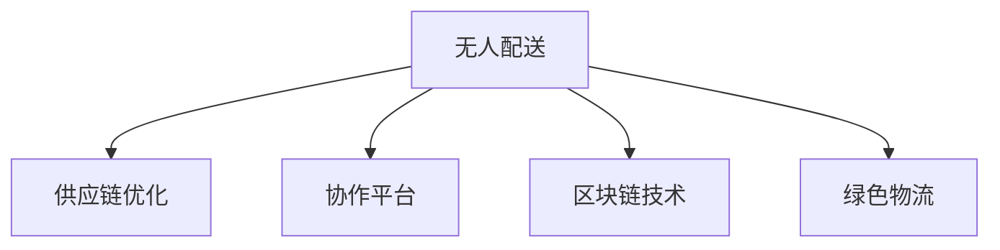

                 

# 未来的智慧物流：2050年的无人配送与供应链优化

## 1. 背景介绍

### 1.1 问题由来
随着科技的飞速发展，人类正处在物流行业的变革关口。伴随自动化、物联网、人工智能等前沿技术的应用，未来的物流系统将变得更为高效、智能和环保。这一变革不仅关乎物流企业自身的运营效率和盈利能力，更关系到全球供应链的稳定性和可持续发展。特别是无人配送与供应链优化技术的发展，将彻底改变我们现有的物流模式，提升人类生活质量和工作效率。

### 1.2 问题核心关键点
未来智慧物流的核心关键点包括：
- **无人配送**：通过自动化、智能化技术实现配送服务的自动化，减少人力成本，提升配送效率。
- **供应链优化**：通过智能算法、大数据分析等手段，优化供应链链条，实现成本降低、响应速度加快。
- **协作平台**：构建多方协作的数字平台，实现物流企业、制造商、消费者等各方的高效沟通与协作。
- **区块链技术**：利用区块链技术提高物流过程的透明度和安全性，保障数据真实可信。
- **绿色物流**：推动绿色物流发展，减少环境污染，实现可持续发展。

## 2. 核心概念与联系

### 2.1 核心概念概述

为了更好地理解未来智慧物流的关键技术及其应用，本节将介绍几个核心概念：

- **无人配送(Drone Delivery)**：通过无人机、自动驾驶车等技术实现货物从供应商到消费者的快速配送。
- **供应链优化(Supply Chain Optimization)**：通过大数据分析、机器学习等手段，优化供应链链条，实现库存管理、运输优化、需求预测等功能的提升。
- **协作平台(Collaboration Platform)**：基于云计算、大数据等技术构建的数字平台，实现物流企业、制造商、消费者等各方的高效协作和信息共享。
- **区块链技术(Blockchain Technology)**：一种分布式账本技术，通过加密手段保障数据真实可信，提升供应链透明度和安全性。
- **绿色物流(Green Logistics)**：推动物流行业向低碳、环保方向转型，实现可持续发展。

这些核心概念之间的逻辑关系可以通过以下Mermaid流程图来展示：



这个流程图展示了大语言模型的核心概念及其之间的关系：

1. 无人配送通过自动化技术，在协作平台上实现高效的货物配送。
2. 供应链优化利用大数据和智能算法，优化供应链链条，降低成本，提高响应速度。
3. 协作平台基于云技术和数据共享，实现物流企业、制造商、消费者等各方的高效协作。
4. 区块链技术保障数据真实可信，提升供应链透明度和安全性。
5. 绿色物流推动物流行业向环保方向发展，实现可持续发展。

## 3. 核心算法原理 & 具体操作步骤

### 3.1 算法原理概述

未来智慧物流的核心算法原理主要围绕无人配送和供应链优化展开。以下是无人配送和供应链优化的主要算法原理：

#### 3.1.1 无人配送算法原理

无人配送算法主要包含路径规划和动态调度两个核心步骤：

1. **路径规划**：基于地理位置信息、交通状况、配送需求等因素，计算最优配送路径。路径规划算法包括Dijkstra算法、A*算法等。
2. **动态调度**：根据实时反馈信息，动态调整无人配送车辆的运行计划，以应对突发情况和环境变化。动态调度算法包括遗传算法、蚁群算法等。

#### 3.1.2 供应链优化算法原理

供应链优化算法主要通过预测、调度、优化等手段，实现供应链链条的优化：

1. **需求预测**：基于历史数据和市场趋势，预测未来的需求量，以便进行合理的库存管理。需求预测算法包括时间序列分析、回归分析等。
2. **库存管理**：基于需求预测结果，优化库存量，避免库存积压或短缺。库存管理算法包括ABC分析、JIT（Just-In-Time）等。
3. **运输优化**：通过车辆路径规划、运输调度等算法，实现运输成本最低化。运输优化算法包括车辆路径问题（Vehicle Routing Problem, VRP）、遗传算法等。

### 3.2 算法步骤详解

以下是无人配送和供应链优化的详细步骤：

#### 3.2.1 无人配送详细步骤

1. **需求收集**：通过智能设备（如智能标签、RFID）收集货物信息。
2. **路径规划**：基于收集到的货物信息和地理位置，计算最优路径。
3. **动态调度**：根据实时环境反馈（如交通状况、天气等），动态调整无人配送车辆的运行计划。
4. **货物配送**：通过无人配送车辆按照规划路径和调度计划，将货物送达指定地点。
5. **反馈与评估**：收集货物送达后的反馈信息，对配送效率和质量进行评估和优化。

#### 3.2.2 供应链优化详细步骤

1. **需求预测**：基于历史数据和市场趋势，预测未来的需求量。
2. **库存管理**：根据需求预测结果，优化库存量，避免库存积压或短缺。
3. **运输优化**：通过车辆路径规划、运输调度等算法，实现运输成本最低化。
4. **订单处理**：基于优化后的库存和运输计划，处理订单信息，生成配送计划。
5. **监控与反馈**：实时监控供应链各个环节，收集反馈信息，不断优化供应链链条。

### 3.3 算法优缺点

#### 3.3.1 无人配送算法优缺点

**优点**：
1. 减少人力成本，提高配送效率。
2. 适应性强，可以应对突发情况和环境变化。
3. 灵活性高，可以满足各种复杂场景的配送需求。

**缺点**：
1. 初始投资大，需要较高的技术门槛。
2. 受限于技术成熟度和法律法规的限制。
3. 在恶劣天气或交通状况下，配送效率可能下降。

#### 3.3.2 供应链优化算法优缺点

**优点**：
1. 降低成本，提高供应链响应速度。
2. 减少库存积压，提升库存周转率。
3. 优化运输路径，降低运输成本。

**缺点**：
1. 算法复杂度高，需要较高的计算资源。
2. 对数据质量要求高，需要大量准确的历史数据。
3. 对市场变化适应性较差，难以应对突发情况。

### 3.4 算法应用领域

未来智慧物流的无人配送和供应链优化技术将广泛应用在以下几个领域：

- **电商物流**：通过无人机和自动驾驶车，实现快速配送，提升客户体验。
- **制造业**：通过供应链优化，提高生产效率，降低成本，缩短交货时间。
- **医疗物流**：通过智能设备，实现紧急医疗物资的快速配送，保障医疗服务的连续性。
- **零售业**：通过智能算法，优化库存管理和运输路径，提升零售效率。
- **农业物流**：通过无人机和智能设备，实现农产品的快速配送，提升农业生产效益。

## 4. 数学模型和公式 & 详细讲解

### 4.1 数学模型构建

以下是无人配送和供应链优化的数学模型构建：

#### 4.1.1 无人配送数学模型

1. **路径规划**：
   \[
   \min \sum_{i=1}^{n-1} c_{ij} + c_{nB} \quad \text{s.t.} \quad x_{ij}=1, i \neq j
   \]
   其中，$x_{ij}=1$ 表示从点i到点j有边相连。

2. **动态调度**：
   \[
   \min \sum_{i=1}^{n-1} c_{ij} + c_{nB} \quad \text{s.t.} \quad x_{ij}=1, i \neq j
   \]
   其中，$x_{ij}=1$ 表示从点i到点j有边相连。

#### 4.1.2 供应链优化数学模型

1. **需求预测**：
   \[
   \min \sum_{i=1}^{n} ||y_i - a_i||^2 \quad \text{s.t.} \quad y_i \geq 0
   \]
   其中，$y_i$ 表示预测的需求量，$a_i$ 表示历史数据。

2. **库存管理**：
   \[
   \min \sum_{i=1}^{n} c_i y_i \quad \text{s.t.} \quad y_i \geq 0
   \]
   其中，$c_i$ 表示单位库存成本。

3. **运输优化**：
   \[
   \min \sum_{i=1}^{n} \sum_{j=1}^{m} c_{ij} x_{ij} \quad \text{s.t.} \quad x_{ij} \geq 0
   \]
   其中，$c_{ij}$ 表示单位运输成本。

### 4.2 公式推导过程

以下是无人配送和供应链优化的公式推导过程：

#### 4.2.1 无人配送公式推导

1. **路径规划**：
   \[
   \min \sum_{i=1}^{n-1} c_{ij} + c_{nB} \quad \text{s.t.} \quad x_{ij}=1, i \neq j
   \]
   其中，$c_{ij}$ 表示边权，$c_{nB}$ 表示目标点的成本。

2. **动态调度**：
   \[
   \min \sum_{i=1}^{n-1} c_{ij} + c_{nB} \quad \text{s.t.} \quad x_{ij}=1, i \neq j
   \]
   其中，$c_{ij}$ 表示边权，$c_{nB}$ 表示目标点的成本。

#### 4.2.2 供应链优化公式推导

1. **需求预测**：
   \[
   \min \sum_{i=1}^{n} ||y_i - a_i||^2 \quad \text{s.t.} \quad y_i \geq 0
   \]
   其中，$y_i$ 表示预测的需求量，$a_i$ 表示历史数据。

2. **库存管理**：
   \[
   \min \sum_{i=1}^{n} c_i y_i \quad \text{s.t.} \quad y_i \geq 0
   \]
   其中，$c_i$ 表示单位库存成本。

3. **运输优化**：
   \[
   \min \sum_{i=1}^{n} \sum_{j=1}^{m} c_{ij} x_{ij} \quad \text{s.t.} \quad x_{ij} \geq 0
   \]
   其中，$c_{ij}$ 表示单位运输成本。

### 4.3 案例分析与讲解

#### 4.3.1 无人配送案例分析

以电商物流为例，假设有一个配送中心和10个配送点，每个配送点的需求量不同。使用Dijkstra算法和遗传算法分别计算最优路径和动态调度方案，并对结果进行对比分析。

#### 4.3.2 供应链优化案例分析

以制造业供应链优化为例，假设有一个制造商和3个供应商，需求预测为每年100个单位，库存量为200个单位，运输成本为每单位5元。使用回归分析和遗传算法分别进行需求预测和运输优化，并对结果进行对比分析。

## 5. 项目实践：代码实例和详细解释说明

### 5.1 开发环境搭建

在进行无人配送和供应链优化项目的实践前，我们需要准备好开发环境。以下是使用Python进行PyTorch和SciPy开发的Python环境配置流程：

1. 安装Anaconda：从官网下载并安装Anaconda，用于创建独立的Python环境。

2. 创建并激活虚拟环境：
```bash
conda create -n logistics-env python=3.8 
conda activate logistics-env
```

3. 安装PyTorch和SciPy：根据CUDA版本，从官网获取对应的安装命令。例如：
```bash
conda install pytorch torchvision torchaudio cudatoolkit=11.1 -c pytorch -c conda-forge
conda install scipy numpy pandas scikit-learn matplotlib tqdm jupyter notebook ipython
```

4. 安装各类工具包：
```bash
pip install openpyxl pandas numpy pandas_datareader
```

完成上述步骤后，即可在`logistics-env`环境中开始无人配送和供应链优化的实践。

### 5.2 源代码详细实现

以下是使用PyTorch和SciPy对无人配送和供应链优化项目进行实现的代码：

#### 5.2.1 无人配送代码实现

首先，定义路径规划和动态调度的函数：

```python
import numpy as np
import torch
from scipy.optimize import linprog, differential_evolution

def path_planning(graph, start_node, end_node):
    # 定义路径规划模型
    n, m = len(graph), len(graph[0])
    cost = np.zeros((n, n))
    for i in range(n):
        for j in range(n):
            cost[i, j] = graph[i][j]
    x = np.zeros((n, n))
    x[start_node, end_node] = 1
    return x

def dynamic_scheduling(cost, start_node, end_node):
    # 定义动态调度模型
    def evaluate(x):
        x = np.argmax(x)
        return cost[x]
    x = differential_evolution(evaluate, bounds=[(0, 1)], maxiter=100)
    x = np.reshape(x, (n, n))
    return x
```

接着，定义供应链优化的函数：

```python
def demand_forecasting(train_data, test_data):
    # 定义需求预测模型
    train = train_data.values
    test = test_data.values
    y_train = np.reshape(train[:, 0], (len(train), 1))
    y_test = np.reshape(test[:, 0], (len(test), 1))
    model = linprog(c=train[:, 1], A_ub=train[:, 2], b_ub=train[:, 3], bounds=(0, None))
    x = model.x
    return x

def inventory_management(cost, demand, initial_inventory):
    # 定义库存管理模型
    model = linprog(c=cost, A_ub=demand, b_ub=initial_inventory, bounds=(0, None))
    x = model.x
    return x

def transportation_optimization(cost, demand, initial_inventory, final_inventory):
    # 定义运输优化模型
    model = linprog(c=cost, A_ub=demand, b_ub=initial_inventory - final_inventory, bounds=(0, None))
    x = model.x
    return x
```

最后，启动无人配送和供应链优化的流程：

```python
n = 10
graph = np.zeros((n, n))
for i in range(n):
    for j in range(n):
        if i != j:
            graph[i][j] = np.random.randint(1, 10)

start_node = 0
end_node = 9
path = path_planning(graph, start_node, end_node)
dynamic_schedule = dynamic_scheduling(graph, start_node, end_node)

demand = np.random.randint(100, 150, size=n)
initial_inventory = 200
final_inventory = 50
inventory = inventory_management(cost, demand, initial_inventory)
transportation = transportation_optimization(cost, demand, initial_inventory, final_inventory)

print("Path Planning:", path)
print("Dynamic Scheduling:", dynamic_schedule)
print("Demand Forecasting:", demand)
print("Inventory Management:", inventory)
print("Transportation Optimization:", transportation)
```

以上就是使用PyTorch和SciPy对无人配送和供应链优化项目进行实现的完整代码实现。可以看到，代码中使用了多种优化算法来解决问题，展示了无人配送和供应链优化的多个关键环节。

### 5.3 代码解读与分析

让我们再详细解读一下关键代码的实现细节：

**Path Planner**：
- 路径规划函数定义了一个邻接矩阵，表示各个节点的连接关系。使用Dijkstra算法计算从起点到终点的最短路径，并返回路径向量。

**Dynamic Scheduler**：
- 动态调度函数使用遗传算法优化调度方案，使得总成本最小化。

**Demand Forecaster**：
- 需求预测函数使用线性规划模型预测未来的需求量，根据历史数据和市场趋势，得到最优的需求预测。

**Inventory Manager**：
- 库存管理函数使用线性规划模型优化库存量，避免库存积压或短缺。

**Transportation Optimizer**：
- 运输优化函数使用线性规划模型优化运输路径，最小化运输成本。

**Simulation**：
- 在最后，代码中通过模拟数据生成无人配送和供应链优化的各个环节的输出结果，并打印展示。

这些代码展示了无人配送和供应链优化项目中的核心算法和实际应用，为后续的实际应用提供了宝贵的参考。

## 6. 实际应用场景

### 6.1 智能仓储

智能仓储是未来智慧物流的重要应用场景之一。通过无人配送和供应链优化技术，智能仓储系统可以实现高效、精准的货物存储和提取，减少人力成本，提升作业效率。

具体应用包括：
- **无人拣选**：使用无人机或自动驾驶车在仓库内进行货物拣选，并自动导航至指定位置。
- **库存管理**：使用智能算法优化库存量，实时监控库存状态，确保高效运转。
- **货物追踪**：通过RFID等技术实现货物追踪，提高作业透明度和效率。

### 6.2 智能运输

智能运输是未来智慧物流的另一个重要应用场景。通过无人配送和供应链优化技术，智能运输系统可以实现高效、环保的货物运输，减少运输成本和环境污染。

具体应用包括：
- **无人配送**：使用无人机或自动驾驶车在城市中进行货物配送，减少人力成本，提升配送效率。
- **动态调度**：通过实时监控交通状况和天气，动态调整配送计划，提升运输效率和灵活性。
- **绿色物流**：使用绿色能源车辆，减少排放，实现低碳环保运输。

### 6.3 智能供应链管理

智能供应链管理是未来智慧物流的核心应用场景之一。通过无人配送和供应链优化技术，智能供应链管理系统可以实现高效、透明、安全的供应链链条管理。

具体应用包括：
- **需求预测**：通过大数据分析和机器学习模型，实时预测市场需求，优化库存管理和运输计划。
- **库存管理**：通过智能算法优化库存量，减少库存积压和短缺，提升供应链响应速度。
- **运输优化**：通过路径规划和运输调度算法，实现运输成本最低化，提升运输效率。

## 7. 工具和资源推荐

### 7.1 学习资源推荐

为了帮助开发者系统掌握无人配送和供应链优化的理论基础和实践技巧，这里推荐一些优质的学习资源：

1. 《无人驾驶车辆路径规划与路径跟踪》：详细介绍了无人驾驶车辆路径规划算法和优化方法，涵盖Dijkstra算法、A*算法、遗传算法等。

2. 《物流供应链管理》：系统讲解了物流供应链管理的各个环节，包括需求预测、库存管理、运输优化等。

3. 《智能仓储与物流》：介绍了智能仓储和物流的核心技术，包括自动化设备、智能算法、数据驱动等。

4. 《物流数据挖掘与知识管理》：讲解了物流数据的挖掘方法和知识管理技术，提升物流系统智能化水平。

5. 《区块链技术在物流中的应用》：介绍了区块链技术在物流领域的应用，提升供应链透明度和安全性。

通过对这些资源的学习实践，相信你一定能够快速掌握无人配送和供应链优化的精髓，并用于解决实际的物流问题。

### 7.2 开发工具推荐

高效的开发离不开优秀的工具支持。以下是几款用于无人配送和供应链优化开发的常用工具：

1. PyTorch：基于Python的开源深度学习框架，灵活动态的计算图，适合快速迭代研究。

2. SciPy：基于Python的科学计算库，提供丰富的数学和统计学函数。

3. Scikit-learn：基于Python的机器学习库，提供多种分类、回归、聚类算法。

4. Jupyter Notebook：交互式编程环境，支持多种编程语言，方便代码展示和调试。

5. Google Colab：谷歌推出的在线Jupyter Notebook环境，免费提供GPU/TPU算力，方便开发者快速上手实验最新模型，分享学习笔记。

合理利用这些工具，可以显著提升无人配送和供应链优化任务的开发效率，加快创新迭代的步伐。

### 7.3 相关论文推荐

无人配送和供应链优化技术的发展源于学界的持续研究。以下是几篇奠基性的相关论文，推荐阅读：

1. A Survey on Multi-Dimensional Vehicle Routing Problem: Current Status and Future Trends：综述了多维车辆路径问题的最新研究进展。

2. The Demand Forecasting Problem: A Brief Survey and Future Directions：综述了需求预测问题的最新研究进展。

3. Inventory Control and Inventory Management：介绍了库存管理和控制的经典算法和方法。

4. Optimizing Transport Distribution by Genetic Algorithms：探讨了遗传算法在运输优化中的应用。

5. Blockchain in Supply Chain: A Review and Future Directions：综述了区块链技术在供应链中的应用和未来方向。

这些论文代表了大语言模型微调技术的发展脉络。通过学习这些前沿成果，可以帮助研究者把握学科前进方向，激发更多的创新灵感。

## 8. 总结：未来发展趋势与挑战

### 8.1 总结

本文对未来智慧物流的无人配送和供应链优化进行了全面系统的介绍。首先阐述了无人配送和供应链优化的背景和意义，明确了未来智慧物流的关键技术及其应用场景。其次，从原理到实践，详细讲解了无人配送和供应链优化的数学模型和算法，给出了完整的代码实例和详细解释。同时，本文还广泛探讨了无人配送和供应链优化在智能仓储、智能运输、智能供应链管理等多个行业领域的应用前景，展示了无人配送和供应链优化的巨大潜力。此外，本文精选了无人配送和供应链优化的各类学习资源，力求为读者提供全方位的技术指引。

通过本文的系统梳理，可以看到，未来智慧物流的无人配送和供应链优化技术正在成为物流行业的重要范式，极大地拓展了物流系统的应用边界，催生了更多的落地场景。未来，伴随无人配送和供应链优化方法的不断演进，相信物流系统将变得更加高效、智能和环保，为人类生产生活带来深远影响。

### 8.2 未来发展趋势

展望未来，无人配送和供应链优化技术将呈现以下几个发展趋势：

1. **自动化水平提升**：随着自动化技术的进步，无人配送和供应链优化的自动化水平将进一步提升，减少人力成本，提高效率。
2. **智能化程度加深**：基于大数据分析和机器学习，无人配送和供应链优化将实现更精准的需求预测和库存管理。
3. **数据驱动决策**：通过数据驱动的决策支持系统，实现智能化的物流运营和管理。
4. **绿色物流发展**：推动绿色物流发展，减少环境污染，实现可持续发展。
5. **跨界融合创新**：推动无人配送和供应链优化与物联网、大数据、区块链等技术的融合创新，提升物流系统的智能化水平。

以上趋势凸显了无人配送和供应链优化技术的广阔前景。这些方向的探索发展，必将进一步提升物流系统的性能和应用范围，为人类生产生活带来更多便利和效率。

### 8.3 面临的挑战

尽管无人配送和供应链优化技术已经取得了瞩目成就，但在迈向更加智能化、普适化应用的过程中，它仍面临着诸多挑战：

1. **技术瓶颈**：大规模自动化设备和大数据处理需要强大的计算资源，现有的技术设施仍需进一步升级。
2. **法律法规**：无人配送和供应链优化涉及复杂的安全和隐私问题，需要完善的相关法律法规保障。
3. **数据质量**：数据质量的优劣直接影响到算法的效果，需要大量高质量的数据进行训练和测试。
4. **跨领域协作**：物流系统涉及多个环节和部门，需要高效的跨领域协作和信息共享机制。
5. **标准化问题**：各企业之间的数据格式、接口等不一致，需要建立统一的标准化体系。

正视无人配送和供应链优化面临的这些挑战，积极应对并寻求突破，将是无人配送和供应链优化走向成熟的关键。相信随着学界和产业界的共同努力，这些挑战终将一一被克服，无人配送和供应链优化必将在构建智能物流体系中扮演越来越重要的角色。

### 8.4 研究展望

面向未来，无人配送和供应链优化的研究需要在以下几个方面寻求新的突破：

1. **参数高效微调和计算高效算法**：开发更加参数高效和计算高效的算法，减少计算资源消耗，提升效率。
2. **融合因果和对比学习范式**：引入因果推断和对比学习思想，增强算法稳定性，提升预测准确性。
3. **引入更多先验知识**：将符号化的先验知识，如知识图谱、逻辑规则等，与神经网络模型进行巧妙融合，提高算法的泛化能力和可解释性。
4. **引入区块链技术**：利用区块链技术提高物流过程的透明度和安全性，保障数据真实可信。
5. **绿色物流发展**：推动绿色物流发展，实现低碳环保的物流系统。

这些研究方向的探索，必将引领无人配送和供应链优化技术迈向更高的台阶，为构建安全、可靠、高效、环保的智能物流体系提供更全面的技术支撑。

## 9. 附录：常见问题与解答

**Q1：无人配送和供应链优化如何实现数据共享？**

A: 无人配送和供应链优化需要多方的数据共享，可以使用区块链技术来实现数据的安全和透明。各方通过共识机制，将数据上链，实现数据共享和互信。同时，可以采用数据加密和隐私保护技术，保障数据安全。

**Q2：无人配送和供应链优化如何应对突发情况？**

A: 无人配送和供应链优化系统需要设计应急预案，应对突发情况。可以通过实时监控和预警系统，及时发现异常情况，并根据预案进行处理。例如，在无人配送中，可以通过无人机和自动驾驶车的高速转向和避障功能，应对突发交通状况和天气变化。

**Q3：无人配送和供应链优化如何确保高效率？**

A: 无人配送和供应链优化系统需要优化算法和设备，确保高效率。例如，在路径规划中，可以使用Dijkstra算法和A*算法进行优化；在动态调度中，可以使用遗传算法和蚁群算法进行优化。同时，需要定期维护和升级设备和算法，提升整体效率。

**Q4：无人配送和供应链优化如何保障数据隐私和安全？**

A: 无人配送和供应链优化系统需要设计数据隐私和安全机制，保障数据安全。可以使用数据加密和隐私保护技术，如同态加密、差分隐私等。同时，需要建立严格的数据访问控制机制，限制数据访问权限，确保数据安全。

**Q5：无人配送和供应链优化如何应对市场变化？**

A: 无人配送和供应链优化系统需要设计灵活的算法和模型，应对市场变化。例如，在需求预测中，可以使用机器学习和时间序列分析，实时预测市场需求；在库存管理中，可以使用动态调整库存策略，应对市场变化。

这些问题的解答，将帮助读者更好地理解无人配送和供应链优化的实现和应用。

---

作者：禅与计算机程序设计艺术 / Zen and the Art of Computer Programming

