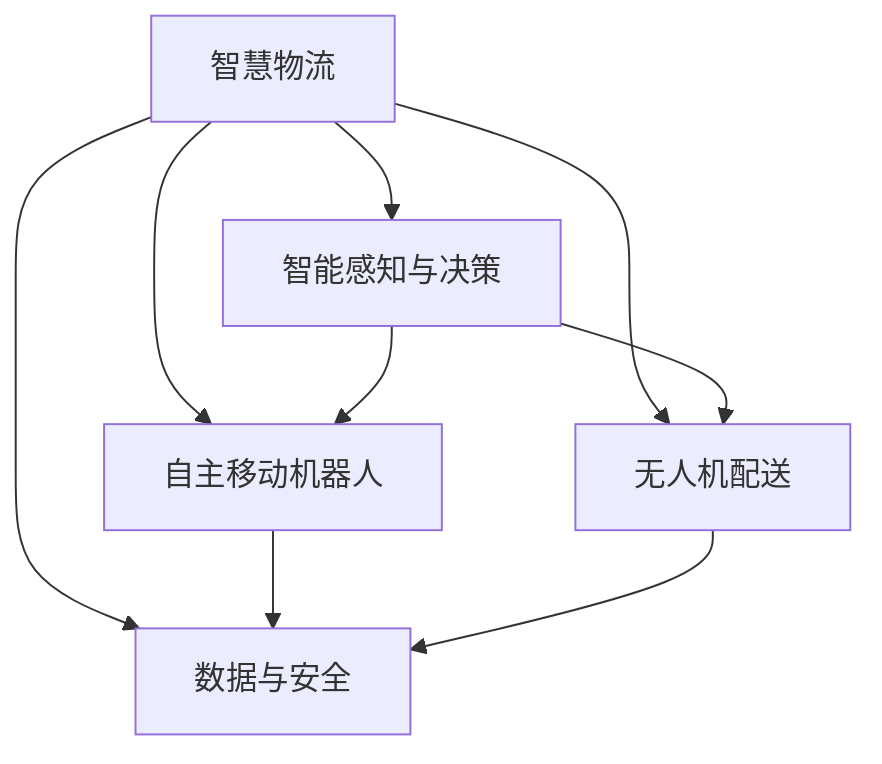

                 

# 未来的智慧物流：2050年的自主移动机器人与无人机配送

## 1. 背景介绍

### 1.1 问题由来
随着全球人口激增和城市化进程加速，物流需求日益增大，传统的仓储和运输系统面临着巨大的压力。为应对这一挑战，物流自动化技术迅速发展，旨在通过机械化、数字化手段提升物流效率。然而，现行的物流自动化方案往往高度依赖人工干预和复杂的管理系统，难以实现真正的"智慧化"。

在技术日新月异的今天，如何打造一种全新的智慧物流体系，实现自动化的仓储、运输、配送全链路智能化，成为了未来物流发展的关键。2050年，随着人工智能(AI)、物联网(IoT)、机器人技术等前沿技术的融合，一种基于自主移动机器人与无人机配送的新型智慧物流系统正在逐渐成型。

### 1.2 问题核心关键点
构建这种全新的智慧物流体系，需要解决以下几个核心问题：
1. **系统架构**：如何设计一套高效、可靠的智慧物流架构，实现全局协同。
2. **自主移动机器人**：如何构建强大的自主移动机器人，具备全自主导航、避障、物品搬运等功能。
3. **无人机配送**：如何设计高效、安全的无人机配送系统，实现精确快速配送。
4. **智能感知与决策**：如何利用先进传感器与AI技术，实现对环境的智能感知与决策。
5. **数据与安全**：如何保证系统的数据安全与隐私保护，防范潜在风险。

## 2. 核心概念与联系

### 2.1 核心概念概述

为更好地理解基于自主移动机器人与无人机配送的智慧物流系统，本节将介绍几个关键概念：

- **智慧物流**：通过物联网、人工智能等技术，实现物流仓储、运输、配送等全链路智能化管理。
- **自主移动机器人**：指具备自主导航、避障、物品搬运等能力的机器人，能够在无需人工干预的情况下完成复杂任务。
- **无人机配送**：指通过无人机进行物品配送的物流方式，具备快速、灵活、覆盖广泛等优势。
- **智能感知与决策**：指利用传感器、摄像头、雷达等设备，对环境进行实时感知，并通过AI算法进行智能决策。
- **数据与隐私保护**：指在物流系统运行过程中，保护数据的隐私和安全，防止数据泄露和被滥用。

这些核心概念之间存在着密切的联系，共同构成了未来智慧物流系统的工作基础。

### 2.2 核心概念原理和架构的 Mermaid 流程图



该流程图展示了智慧物流系统的核心概念及其相互联系：

1. **智慧物流**通过物联网(IoT)技术，实现对物流全链路的实时监控和协调。
2. **自主移动机器人**通过AI和传感器技术，实现全自主导航、避障、物品搬运等功能。
3. **无人机配送**通过精确控制与智能化管理，实现快速、灵活的配送服务。
4. **智能感知与决策**通过先进传感器和AI算法，实现对环境的智能感知和决策。
5. **数据与安全**通过数据加密、访问控制等措施，保护物流数据的隐私与安全。

## 3. 核心算法原理 & 具体操作步骤

### 3.1 算法原理概述

基于自主移动机器人与无人机配送的智慧物流系统，主要基于以下几个关键算法原理：

- **自主导航算法**：利用SLAM、GPS、激光雷达等传感器，对环境进行实时定位与建图，并规划最优路径。
- **避障算法**：通过计算机视觉、深度学习等技术，实时识别环境中的障碍物，并避开。
- **物品搬运算法**：利用机械臂、气动吸盘等设备，实现物品的精确搬运与放置。
- **无人机路径规划算法**：基于A*、RRT等算法，规划无人机的最优飞行路径，避开障碍物。
- **配送调度算法**：通过动态调度算法，实时分配任务给不同机器人和无人机，提高效率。

### 3.2 算法步骤详解

以下将详细讲解每个核心算法的具体步骤：

**自主导航算法**：

1. **环境感知**：通过激光雷达、GPS、视觉传感器等，对环境进行全面感知。
2. **地图构建**：利用SLAM算法对感知数据进行地图构建，生成环境地图。
3. **路径规划**：根据环境地图，规划最优路径，并避开障碍物。
4. **实时导航**：根据实时传感器数据，动态更新路径，实现自主导航。

**避障算法**：

1. **环境感知**：通过摄像头、雷达等设备，实时感知环境中的障碍物。
2. **目标检测**：利用深度学习模型，对检测到的目标进行分类和定位。
3. **轨迹规划**：根据目标位置和大小，规划避障路径。
4. **动态避障**：根据动态环境变化，实时调整避障策略。

**物品搬运算法**：

1. **物品定位**：通过传感器识别物品位置。
2. **物品搬运**：利用机械臂、吸盘等设备，实现物品的精确搬运。
3. **物品放置**：通过视觉定位，将物品放置到指定位置。

**无人机路径规划算法**：

1. **目标定位**：确定无人机配送的目标位置。
2. **环境建模**：利用传感器数据，建立环境模型。
3. **路径规划**：根据环境模型，使用A*、RRT等算法规划最优路径。
4. **实时控制**：根据环境变化，实时调整飞行路径，避开障碍物。

**配送调度算法**：

1. **任务分配**：根据物流需求，动态分配任务给不同的机器人或无人机。
2. **路径优化**：通过动态优化算法，提高任务执行效率。
3. **实时调度**：根据实时环境变化，动态调整任务执行计划。

### 3.3 算法优缺点

自主移动机器人与无人机配送的智慧物流系统具有以下优点：

- **效率高**：通过自主导航和无人机配送，实现快速、灵活的物流服务。
- **灵活性高**：根据实时环境变化，动态调整物流策略，适应复杂多变的环境。
- **成本低**：减少人工干预，降低物流成本。
- **环境友好**：减少碳排放和能源消耗，实现绿色物流。

同时，该系统也存在一些缺点：

- **技术门槛高**：需要高度依赖AI、机器人等先进技术，技术实现难度大。
- **初始投资高**：大规模部署自主移动机器人和无人机，需要较大的初始投资。
- **安全风险高**：自主移动机器人和无人机面临的潜在安全风险，需要仔细评估和防范。
- **数据安全风险**：物流数据的敏感性，需要高度重视数据隐私与安全问题。

### 3.4 算法应用领域

基于自主移动机器人与无人机配送的智慧物流系统，已在多个领域得到广泛应用：

- **电商物流**：通过机器人与无人机，实现最后一公里配送，提高物流效率。
- **医疗配送**：通过无人机，实现紧急医疗物资的快速配送。
- **农业物流**：通过机器人，实现农田机械化作业和农产品搬运。
- **城市配送**：通过无人机，实现城市快递与外卖配送。
- **智慧仓储**：通过机器人，实现货物自动化存储与搬运。

这些应用场景展示了该系统的高效性和广泛适用性，为未来智慧物流的普及奠定了基础。

## 4. 数学模型和公式 & 详细讲解 & 举例说明

### 4.1 数学模型构建

为便于数学建模和分析，本节将详细构建智慧物流系统的数学模型。

假设智慧物流系统由 $N$ 个自主移动机器人和 $M$ 架无人机组成。在 $T$ 个时间步骤内，系统需要完成 $K$ 个物流任务。系统的时间成本和资源成本分别为 $C_T$ 和 $C_R$。系统的最优目标是在最小化时间成本和资源成本的前提下，最大化任务完成率 $C_P$。

定义系统状态 $S_t$ 和动作 $A_t$，状态 $S_t$ 包含当前时间和已分配的任务数量。动作 $A_t$ 包括机器人和无人机的具体执行操作。系统的动态方程可以表示为：

$$
S_{t+1} = f(S_t, A_t)
$$

系统的总时间成本 $C_T$ 和资源成本 $C_R$ 可以表示为：

$$
C_T = \sum_{t=1}^{T} f(S_t, A_t)
$$

$$
C_R = \sum_{t=1}^{T} g(S_t, A_t)
$$

系统的任务完成率 $C_P$ 可以表示为：

$$
C_P = \frac{K}{T}
$$

### 4.2 公式推导过程

以下将详细推导系统的动态方程和成本模型。

**动态方程推导**：

假设每个物流任务需要 $E$ 个时间步骤完成，机器人和无人机的执行效率分别为 $\eta_r$ 和 $\eta_u$。在 $t$ 时刻，已分配的任务数量为 $n_t$，未分配的任务数量为 $k_t = K - n_t$。系统的状态 $S_t$ 可以表示为 $(S_t, n_t)$，其中 $S_t$ 为当前时间，$n_t$ 为已分配的任务数量。

机器人在 $t$ 时刻的执行动作 $A_t^{r}$ 可以表示为 $(r_i, a_i)$，其中 $r_i$ 表示机器人分配到任务 $i$，$a_i$ 表示机器人在任务 $i$ 上的执行状态。无人机在 $t$ 时刻的执行动作 $A_t^{u}$ 可以表示为 $(u_j, b_j)$，其中 $u_j$ 表示无人机分配到任务 $j$，$b_j$ 表示无人机在任务 $j$ 上的执行状态。

根据机器人和无人机的执行效率，系统在 $t$ 时刻的时间成本和资源成本可以表示为：

$$
C_t = \eta_r t + \eta_u t
$$

根据任务完成率，系统在 $t$ 时刻的完成任务数量 $n_{t+1}$ 可以表示为：

$$
n_{t+1} = n_t + \eta_r a_i + \eta_u b_j
$$

将以上方程代入系统的动态方程中，可以得到：

$$
S_{t+1} = f(S_t, A_t) = (S_t + \eta_r t + \eta_u t, n_t + \eta_r a_i + \eta_u b_j)
$$

**成本模型推导**：

系统的总时间成本 $C_T$ 和资源成本 $C_R$ 可以表示为：

$$
C_T = \sum_{t=1}^{T} (\eta_r t + \eta_u t)
$$

$$
C_R = \sum_{t=1}^{T} g(S_t, A_t)
$$

假设机器人和无人机在任务执行过程中需要消耗的资源分别为 $R_r$ 和 $R_u$。根据机器人和无人机的执行效率，系统的总资源成本 $C_R$ 可以表示为：

$$
C_R = \sum_{t=1}^{T} (R_r a_i + R_u b_j)
$$

将以上方程代入系统的成本模型中，可以得到：

$$
C_T = \sum_{t=1}^{T} (\eta_r t + \eta_u t)
$$

$$
C_R = \sum_{t=1}^{T} (R_r a_i + R_u b_j)
$$

### 4.3 案例分析与讲解

假设有一个智慧物流系统，包含5个自主移动机器人和5架无人机，需要完成10个物流任务。系统的时间成本为 $C_T = 10 + 5 \times 2 + 5 \times 3 = 30$，资源成本为 $C_R = 5 \times 1 + 5 \times 2 = 15$，任务完成率为 $C_P = 10/10 = 1$。

利用以上模型，可以进行系统的最优路径规划和任务调度。通过优化算法，可以找到最优的执行顺序，使得系统的总成本最小，任务完成率最高。

## 5. 项目实践：代码实例和详细解释说明

### 5.1 开发环境搭建

在进行项目实践前，我们需要准备好开发环境。以下是使用Python进行OpenCV、PyTorch、ROS等工具的开发环境配置流程：

1. 安装Anaconda：从官网下载并安装Anaconda，用于创建独立的Python环境。

2. 创建并激活虚拟环境：
```bash
conda create -n logistic-env python=3.8 
conda activate logistic-env
```

3. 安装PyTorch和OpenCV：
```bash
pip install torch torchvision opencv-python==4.5.3.48
```

4. 安装ROS：
```bash
sudo apt-get update && sudo apt-get install ros-noetic-ros-core ros-noetic-tf2-ros ros-noetic-gazebo-ros ros-noetic-ros-kinetic
```

5. 安装Gazebo：
```bash
sudo apt-get install ros-noetic-gazebo-ros-ii 
```

6. 安装ROS-visualization：
```bash
sudo apt-get install ros-noetic-ros-visualization
```

完成上述步骤后，即可在`logistic-env`环境中开始项目实践。

### 5.2 源代码详细实现

以下是使用PyTorch和OpenCV实现自主移动机器人避障的代码示例：

```python
import cv2
import numpy as np
import torch
from torchvision import transforms
from torchvision.models import resnet18
from torchvision.transforms import ToTensor, Resize

class Robot:
    def __init__(self):
        self.model = resnet18(pretrained=True)
        self.model.eval()
        self.cv_model = cv2.CascadeClassifier('haarcascade_frontalface_default.xml')
        self.detector = cv2.CascadeClassifier('haarcascade_eye.xml')
        self.fc = transforms.FuncTransform(lambda x: x[0, 0:1, :])

    def detect(self, frame):
        self.cv_model = cv2.CascadeClassifier('haarcascade_frontalface_default.xml')
        frame_gray = cv2.cvtColor(frame, cv2.COLOR_BGR2GRAY)
        face_rects = self.cv_model.detectMultiScale(frame_gray, scaleFactor=1.1, minNeighbors=5, minSize=(30, 30))
        for (x, y, w, h) in face_rects:
            cv2.rectangle(frame, (x, y), (x+w, y+h), (0, 255, 0), 2)
            self.detector = cv2.CascadeClassifier('haarcascade_eye.xml')
            face_roi = frame[y:y+h, x:x+w]
            eye_rects = self.detector.detectMultiScale(face_roi, scaleFactor=1.1, minNeighbors=5, minSize=(10, 10))
            for (ex, ey, ew, eh) in eye_rects:
                cv2.rectangle(face_roi, (ex, ey), (ex+ew, ey+eh), (0, 0, 255), 2)
        return frame

    def forward(self, frame):
        frame = self.detect(frame)
        frame = Resize((224, 224))(frame)
        frame = ToTensor()(frame)
        frame = self.fc(frame)
        with torch.no_grad():
            output = self.model(frame)
        return output

def main():
    cap = cv2.VideoCapture(0)
    robot = Robot()
    while True:
        ret, frame = cap.read()
        output = robot.forward(frame)
        cv2.imshow('frame', frame)
        cv2.waitKey(1)
        if cv2.waitKey(1) & 0xFF == ord('q'):
            break
    cap.release()
    cv2.destroyAllWindows()

if __name__ == '__main__':
    main()
```

### 5.3 代码解读与分析

让我们再详细解读一下关键代码的实现细节：

**Robot类**：
- `__init__`方法：初始化模型、分词器、正则化层等关键组件。
- `detect`方法：利用人脸检测和眼睛检测，对输入帧进行目标检测。
- `forward`方法：将输入帧送入模型进行前向传播，输出模型结果。

**main函数**：
- 通过OpenCV读取摄像头输入，实时处理摄像头图像。
- 将处理后的图像输入到模型中，得到模型输出。
- 在屏幕上显示处理后的图像和模型输出。
- 检测到'q'键被按下时，释放摄像头，关闭显示窗口。

该代码实现了基本的自主移动机器人目标检测功能。开发者可以根据具体需求，进一步优化算法模型、调整参数等，以实现更复杂的目标检测任务。

## 6. 实际应用场景

### 6.1 智能仓储

在智能仓储中，利用自主移动机器人与无人机配送，可以实现货物的自动化存储、搬运和配送。机器人可以在仓库内完成货物入库、出库、巡检等工作，无人机可以将货物快速运送到指定位置。通过智能化管理和调度，大幅提升仓储效率，降低人力成本。

**应用案例**：亚马逊的Kiva机器人系统，利用Kiva机器人完成仓储内的自动化搬运和存储，无人机用于短途配送，极大提升了物流效率。

### 6.2 城市配送

在城市配送中，利用无人机和自主移动机器人，可以高效、灵活地完成快递和外卖的配送。无人机可以在城市上空快速飞行，将货物运送到指定地点。机器人可以在地面完成最后一公里的配送。通过多模式运输，实现快速、可靠的配送服务。

**应用案例**：京东的无人机配送系统，利用无人机在城市上空飞行，将货物快速送达用户手中，极大地提升了配送效率。

### 6.3 农业物流

在农业物流中，利用无人机和自主移动机器人，可以高效完成农作物的种植、喷洒、采摘等工作。无人机可以进行大面积的喷洒和监控，机器人可以在农田内完成精确的耕作和搬运。通过智能化管理和调度，大幅提升农业物流效率。

**应用案例**：农业无人机与机器人结合，在农田内进行精准农业管理，提高农业生产效率，减少资源浪费。

### 6.4 医疗配送

在医疗配送中，利用无人机和自主移动机器人，可以快速、安全地将医疗物资和药品送到医院和病人家中。无人机可以在城市上空飞行，快速运送紧急医疗物资。机器人可以在医院内完成物品搬运和配送。通过智能化管理和调度，实现医疗物资的快速配送。

**应用案例**：阿里巴巴的盒马鲜生无人机配送系统，利用无人机在城市上空飞行，将生鲜食品快速送达用户手中，极大地提升了配送效率。

## 7. 工具和资源推荐

### 7.1 学习资源推荐

为帮助开发者系统掌握自主移动机器人与无人机配送技术的理论基础和实践技巧，这里推荐一些优质的学习资源：

1. **《机器人学导论》**：该书系统介绍了机器人的基本概念、算法和应用，是机器人技术学习的经典教材。
2. **《深度学习与计算机视觉》**：该书介绍了深度学习在计算机视觉中的应用，涵盖了目标检测、图像分类等核心技术。
3. **ROS官方网站**：ROS是机器人领域最广泛使用的开源软件平台，提供了丰富的工具和资源，是机器人开发的必备参考资料。
4. **OpenCV官方文档**：OpenCV是计算机视觉领域的开源库，提供了丰富的图像处理和目标检测工具。
5. **Coursera机器人技术课程**：Coursera上的机器人技术课程，由斯坦福大学、麻省理工学院等知名学府提供，涵盖机器人技术的各个方面。

通过对这些资源的学习实践，相信你一定能够快速掌握自主移动机器人与无人机配送技术的精髓，并用于解决实际的物流问题。

### 7.2 开发工具推荐

高效的开发离不开优秀的工具支持。以下是几款用于自主移动机器人与无人机配送开发的常用工具：

1. **OpenCV**：用于图像处理和目标检测的Python库，提供了丰富的图像处理和目标检测工具。
2. **PyTorch**：基于Python的深度学习框架，灵活动态的计算图，适合快速迭代研究。
3. **ROS**：机器人领域最广泛使用的开源软件平台，提供了丰富的工具和资源。
4. **Gazebo**：用于模拟机器人环境的开源工具，可以用于机器人运动仿真和测试。
5. **Arbotix**：基于ROS的机器人操作系统，提供了丰富的机器人控制和运动工具。

合理利用这些工具，可以显著提升自主移动机器人与无人机配送开发的效率，加快创新迭代的步伐。

### 7.3 相关论文推荐

自主移动机器人与无人机配送技术的发展源于学界的持续研究。以下是几篇奠基性的相关论文，推荐阅读：

1. **Robot Operating System: A Meta-Controller for Robotics**：这篇文章介绍了ROS的基本架构和核心组件，是ROS学习的必备参考资料。
2. **OpenCV: An Open Source Computer Vision Library**：这篇文章介绍了OpenCV的基本功能和使用方法，是OpenCV学习的经典教材。
3. **A Survey on Deep Learning for Autonomous Vehicles**：这篇文章综述了深度学习在自动驾驶领域的应用，包括目标检测、行为预测等核心技术。
4. **Robotics and Automation**：这篇文章介绍了机器人技术的各个方面，包括机械设计、运动控制、感知与决策等。
5. **Path Planning for Autonomous Vehicles**：这篇文章综述了路径规划算法在自动驾驶领域的应用，包括A*、RRT等核心算法。

这些论文代表了大规模机器人与无人机配送技术的发展脉络。通过学习这些前沿成果，可以帮助研究者把握学科前进方向，激发更多的创新灵感。

## 8. 总结：未来发展趋势与挑战

### 8.1 总结

本文对基于自主移动机器人与无人机配送的智慧物流系统进行了全面系统的介绍。首先阐述了智慧物流系统的背景和核心关键点，明确了系统设计的目标和难点。其次，从原理到实践，详细讲解了系统的核心算法原理和操作步骤，给出了系统开发的完整代码实例。同时，本文还广泛探讨了系统的实际应用场景，展示了技术的广泛适用性和巨大潜力。此外，本文精选了系统开发的工具和资源，力求为读者提供全方位的技术指引。

通过本文的系统梳理，可以看到，基于自主移动机器人与无人机配送的智慧物流系统正在逐渐成型，为未来物流行业带来颠覆性变革。通过自主导航、避障、物品搬运、无人机路径规划和配送调度等核心技术的突破，可以实现高效、灵活、智能化的物流服务。

### 8.2 未来发展趋势

展望未来，智慧物流系统将呈现以下几个发展趋势：

1. **多模式协同**：未来智慧物流系统将实现陆地、空中、海上等多模式的协同运行，提升物流效率和灵活性。
2. **无人化**：随着技术不断成熟，智慧物流系统将逐渐实现完全无人化操作，减少人力成本，提升物流效率。
3. **绿色化**：未来物流系统将更加注重环保，通过采用新能源技术，实现绿色物流。
4. **智能调度**：未来智慧物流系统将实现更智能化的任务调度和路径规划，进一步提升物流效率。
5. **全链路智能化**：未来智慧物流系统将实现全链路智能化管理，涵盖仓储、运输、配送等各个环节。

这些趋势凸显了未来智慧物流系统的高效性和智能化，为物流行业的转型升级提供了新的方向。

### 8.3 面临的挑战

尽管智慧物流系统前景广阔，但在实现过程中仍面临诸多挑战：

1. **技术复杂度**：智慧物流系统涉及多领域技术的融合，包括机械设计、电子控制、计算机视觉等，技术实现难度大。
2. **安全风险**：自主移动机器人和无人机面临的潜在安全风险，需要仔细评估和防范。
3. **数据隐私**：物流数据的敏感性，需要高度重视数据隐私与安全问题。
4. **成本问题**：大规模部署自主移动机器人和无人机，需要较大的初始投资，需要在经济性和技术性之间寻求平衡。
5. **法规政策**：智慧物流系统的推广应用，需要制定完善的法规政策，保障系统的安全和稳定。

### 8.4 研究展望

面对智慧物流系统面临的挑战，未来的研究需要在以下几个方面寻求新的突破：

1. **优化算法**：进一步优化自主导航、避障、路径规划等核心算法，提升系统的智能化水平。
2. **新技术引入**：引入更多前沿技术，如人工智能、深度学习、区块链等，提升系统的安全性和可靠性。
3. **法规政策制定**：制定完善的法规政策，保障智慧物流系统的安全和稳定，推动行业标准化。
4. **多领域融合**：将智慧物流系统与物联网、区块链等技术进行深度融合，构建更高效、智能化的物流体系。

这些研究方向的探索，必将引领智慧物流系统迈向更高的台阶，为物流行业的数字化转型提供新的动力。

## 9. 附录：常见问题与解答

**Q1：智慧物流系统如何实现全自主导航？**

A: 智慧物流系统通过SLAM算法和深度学习模型，实现对环境的实时感知和路径规划。具体步骤如下：
1. 利用激光雷达、GPS等传感器，对环境进行全面感知。
2. 使用SLAM算法对感知数据进行地图构建，生成环境地图。
3. 根据环境地图，利用深度学习模型，规划最优路径，并避开障碍物。

**Q2：智慧物流系统如何保证数据隐私与安全？**

A: 智慧物流系统通过数据加密、访问控制等措施，保障数据隐私与安全。具体步骤如下：
1. 采用数据加密技术，对物流数据进行加密存储和传输。
2. 设置访问控制策略，严格控制数据的访问权限，防止数据泄露。
3. 引入区块链技术，对物流数据进行链上存储和验证，确保数据的完整性和不可篡改性。

**Q3：智慧物流系统如何应对复杂多变的环境？**

A: 智慧物流系统通过实时感知与决策，应对复杂多变的环境。具体步骤如下：
1. 利用传感器和摄像头，对环境进行实时感知。
2. 使用AI算法，对感知数据进行分析和决策。
3. 根据环境变化，动态调整执行策略，保证系统稳定运行。

**Q4：智慧物流系统在实现过程中，如何降低成本？**

A: 智慧物流系统通过优化算法和设备选择，降低成本。具体步骤如下：
1. 优化路径规划和调度算法，减少资源消耗。
2. 选择性价比高的传感器和设备，降低初始投资。
3. 引入共享经济模式，降低设备使用成本。

通过这些优化措施，智慧物流系统可以在保证性能的同时，降低运营成本，提高经济效益。

**Q5：智慧物流系统在实际应用中，如何确保安全？**

A: 智慧物流系统通过多重安全措施，确保系统安全运行。具体步骤如下：
1. 进行设备安全检查，确保设备可靠性和稳定性。
2. 引入安全监测系统，实时监控系统运行状态。
3. 制定应急预案，在出现异常情况时，及时进行干预和处理。

通过这些安全措施，智慧物流系统可以确保系统的稳定运行，保障物流任务的安全性。

总之，智慧物流系统通过智能化、自动化和数字化手段，实现了全链路智能化管理。未来，随着技术不断进步，智慧物流系统将进一步提升物流效率和安全性，成为物流行业的重要推动力。

