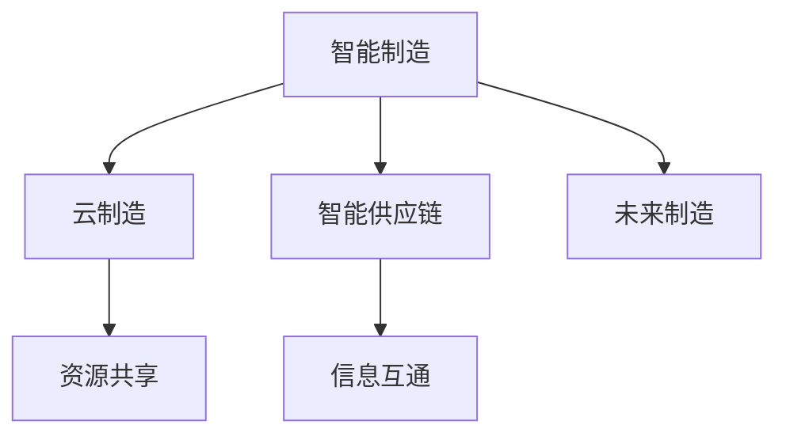

                 

# 未来的智能制造：2050年的云制造与智能供应链协同

> 关键词：智能制造,云制造,智能供应链,物联网,区块链,大数据,人工智能,未来制造

## 1. 背景介绍

### 1.1 问题由来

制造业作为全球经济的基础，其智能化、数字化转型正逐渐成为新一轮产业升级的关键。过去，制造业主要依赖传统制造流程和人力资源，生产效率和质量难以达到理想水平。而随着信息技术的快速发展，智能制造技术逐渐成为引领制造业变革的新趋势。

智能制造是指在互联网和大数据技术的支持下，通过物联网、人工智能等技术，实现对生产流程的全面监控和优化。近年来，随着自动化、信息化、网络化、智能化等技术的飞速发展，智能制造正在迎来前所未有的机遇。

同时，全球供应链网络的复杂性、不可控性也在不断增加。传统供应链模式无法适应新的市场环境和需求变化，供应链的协调性和效率亟待提升。

云制造和智能供应链协同的概念就是在这样的背景下提出的。通过将云计算、物联网、人工智能等技术融入制造过程和供应链管理，实现生产流程和供应链管理的智能化、协同化、优化化。

### 1.2 问题核心关键点

- **智能制造**：通过物联网、人工智能等技术，实现生产流程的自动化、智能化和高效化。
- **云制造**：利用云计算技术，实现制造资源的虚拟化和共享，提高资源利用率。
- **智能供应链**：通过物联网、区块链等技术，实现供应链各环节的信息互通、协同运作，提升供应链的透明度、可追溯性和响应速度。
- **未来制造**：基于云计算、物联网、人工智能等技术的全面融合，构建高度智能化、高效能、绿色环保的制造体系。

这些核心概念之间的逻辑关系可以通过以下Mermaid流程图来展示：



这个流程图展示智能制造、云制造、智能供应链和未来制造之间的逻辑关系：

1. 智能制造利用物联网、人工智能等技术优化生产流程。
2. 云制造通过云计算实现制造资源的虚拟化和共享。
3. 智能供应链通过物联网、区块链等技术实现供应链各环节的协同运作。
4. 未来制造则是智能制造、云制造和智能供应链的全面融合，构建高度智能化、高效能的制造体系。

## 2. 核心概念与联系

### 2.1 核心概念概述

为了更好地理解云制造与智能供应链协同的逻辑关系，本节将介绍几个密切相关的核心概念：

- **智能制造**：通过物联网、人工智能等技术，实现生产流程的自动化、智能化和高效化。
- **云制造**：利用云计算技术，实现制造资源的虚拟化和共享，提高资源利用率。
- **智能供应链**：通过物联网、区块链等技术，实现供应链各环节的信息互通、协同运作，提升供应链的透明度、可追溯性和响应速度。
- **未来制造**：基于云计算、物联网、人工智能等技术的全面融合，构建高度智能化、高效能、绿色环保的制造体系。

### 2.2 核心概念原理和架构的 Mermaid 流程图

```mermaid
graph TB
    A[智能制造] --> B[物联网]
    A --> C[人工智能]
    B --> D[自动化]
    C --> E[生产优化]
    A --> F[资源虚拟化]
    A --> G[数据管理]
    A --> H[信息共享]
    A --> I[设备互联]
    A --> J[过程监控]
    A --> K[质量控制]
    A --> L[安全保障]
    A --> M[成本管理]
    A --> N[环境友好]
    B --> O[数据采集]
    B --> P[远程控制]
    B --> Q[实时监控]
    C --> R[预测分析]
    C --> S[决策支持]
    D --> T[作业调度]
    E --> U[生产调度]
    F --> V[资源调度]
    G --> W[数据存储]
    G --> X[数据分析]
    H --> Y[信息共享]
    I --> Z[设备监控]
    J --> $[质量监控]
    K --> %[异常检测]
    L --> &[安全管理]
    M --> '['[成本控制]
    N --> '{[环境友好]
```

这个流程图展示智能制造、云制造、智能供应链和未来制造的技术架构：

1. 智能制造利用物联网技术采集生产数据，通过人工智能进行预测分析和决策支持，实现生产优化。
2. 云制造通过云计算实现制造资源的虚拟化和共享，实现资源的高效利用。
3. 智能供应链利用物联网技术进行数据采集和远程控制，利用区块链技术实现信息互通和协同运作，提升供应链的透明度和响应速度。
4. 未来制造则是智能制造、云制造和智能供应链的全面融合，构建高度智能化、高效能的制造体系。

## 3. 核心算法原理 & 具体操作步骤

### 3.1 算法原理概述

云制造与智能供应链协同的核心算法原理主要涉及以下几个方面：

1. **智能制造算法**：利用物联网技术采集生产数据，通过人工智能进行数据分析和预测，实现生产流程的智能化优化。
2. **云制造算法**：利用云计算技术实现制造资源的虚拟化和共享，提高资源利用率。
3. **智能供应链算法**：利用物联网技术进行数据采集和远程控制，利用区块链技术实现信息互通和协同运作，提升供应链的透明度和响应速度。

### 3.2 算法步骤详解

#### 3.2.1 智能制造算法步骤

1. **数据采集**：通过物联网设备采集生产数据，如温度、压力、设备状态等。
2. **数据预处理**：对采集的数据进行清洗、过滤、转换等预处理操作。
3. **数据分析**：利用人工智能算法（如机器学习、深度学习等）对预处理后的数据进行分析，识别出生产过程中的异常和瓶颈。
4. **生产优化**：根据数据分析结果，调整生产流程，优化生产参数，提高生产效率和质量。

#### 3.2.2 云制造算法步骤

1. **资源虚拟化**：将制造资源（如设备、物料、人力等）进行虚拟化，形成资源池，实现资源的集中管理和共享。
2. **资源调度**：根据生产需求和资源状态，动态分配资源，实现资源的优化利用。
3. **资源监控**：实时监控资源的使用情况，确保资源的正常运行和高效利用。

#### 3.2.3 智能供应链算法步骤

1. **数据采集**：通过物联网设备采集供应链各环节的数据，如库存、物流状态、订单信息等。
2. **数据共享**：利用区块链技术实现供应链各环节的数据共享和互通。
3. **协同运作**：根据供应链各环节的数据，进行协同运作，优化供应链流程，提升供应链效率和响应速度。
4. **异常处理**：实时监控供应链各环节，识别出异常情况，及时进行处理，确保供应链的稳定运行。

### 3.3 算法优缺点

#### 3.3.1 智能制造算法的优缺点

**优点**：
- 通过物联网和大数据分析，可以实现生产流程的实时监控和优化，提高生产效率和质量。
- 利用人工智能技术，可以进行预测分析和决策支持，提升生产决策的科学性和准确性。

**缺点**：
- 对物联网设备和技术的要求较高，初期投入较大。
- 数据采集和处理需要大量的计算资源，对设备和算力有较高要求。

#### 3.3.2 云制造算法的优缺点

**优点**：
- 通过云计算技术，实现制造资源的虚拟化和共享，提高资源利用率。
- 可以根据生产需求和资源状态，动态分配资源，实现资源的优化利用。

**缺点**：
- 需要强大的云计算基础设施支持，对网络和算力有较高要求。
- 云计算环境的复杂性和安全性需要特别注意，需要专业的运维团队。

#### 3.3.3 智能供应链算法的优缺点

**优点**：
- 利用物联网和区块链技术，实现供应链各环节的信息互通和协同运作，提升供应链的透明度和响应速度。
- 通过实时监控和异常处理，确保供应链的稳定运行。

**缺点**：
- 对物联网设备和技术的要求较高，初期投入较大。
- 供应链各环节的数据共享和协同运作需要复杂的技术手段和管理机制。

### 3.4 算法应用领域

基于云制造与智能供应链协同的核心算法，已经在多个领域得到了广泛的应用，例如：

- **汽车制造**：通过智能制造和云制造技术，实现生产线的智能化优化和资源的高效利用。
- **电子制造**：利用智能制造和云制造技术，实现生产过程的自动化和优化，提升生产效率和质量。
- **医药制造**：通过智能制造和智能供应链技术，实现生产流程的优化和供应链的协同运作，提升产品的一致性和可靠性。
- **家电制造**：利用智能制造和云制造技术，实现生产过程的智能化和资源共享，提升生产效率和产品质量。
- **航空制造**：通过智能制造和智能供应链技术，实现生产过程的优化和供应链的协同运作，提升生产效率和产品一致性。

这些领域的应用，充分展示了云制造与智能供应链协同技术的广泛应用前景。

## 4. 数学模型和公式 & 详细讲解 & 举例说明

### 4.1 数学模型构建

本节将使用数学语言对云制造与智能供应链协同的过程进行更加严格的刻画。

记智能制造过程为 $M_{\theta}$，其中 $\theta$ 为模型参数，$x$ 为输入变量，$y$ 为输出变量。智能制造的损失函数定义为：

$$
\mathcal{L}(M_{\theta},x,y) = \frac{1}{N}\sum_{i=1}^N \ell(M_{\theta}(x_i),y_i)
$$

其中 $\ell$ 为损失函数，用于衡量模型预测输出与真实标签之间的差异。

云制造过程为 $C_{\phi}$，其中 $\phi$ 为模型参数，$z$ 为输入变量。云制造的损失函数定义为：

$$
\mathcal{L}(C_{\phi},z) = \frac{1}{N}\sum_{i=1}^N \ell(C_{\phi}(z_i),y_i)
$$

智能供应链过程为 $S_{\psi}$，其中 $\psi$ 为模型参数，$w$ 为输入变量。智能供应链的损失函数定义为：

$$
\mathcal{L}(S_{\psi},w) = \frac{1}{N}\sum_{i=1}^N \ell(S_{\psi}(w_i),y_i)
$$

### 4.2 公式推导过程

以下是智能制造、云制造和智能供应链损失函数的推导过程。

#### 4.2.1 智能制造损失函数推导

假设智能制造过程为 $M_{\theta}$，输入为 $x$，输出为 $y$。利用均方误差作为损失函数：

$$
\mathcal{L}(M_{\theta},x,y) = \frac{1}{N}\sum_{i=1}^N (y_i - M_{\theta}(x_i))^2
$$

将上式进行简化：

$$
\mathcal{L}(M_{\theta},x,y) = \frac{1}{N}\sum_{i=1}^N (y_i^2 - 2y_iM_{\theta}(x_i) + M_{\theta}(x_i)^2)
$$

$$
\mathcal{L}(M_{\theta},x,y) = \frac{1}{N}\sum_{i=1}^N M_{\theta}(x_i)^2 - \frac{2}{N}\sum_{i=1}^N y_iM_{\theta}(x_i) + \frac{1}{N}\sum_{i=1}^N y_i^2
$$

令 $a = \frac{1}{N}\sum_{i=1}^N M_{\theta}(x_i)^2$，$b = \frac{1}{N}\sum_{i=1}^N y_iM_{\theta}(x_i)$，$c = \frac{1}{N}\sum_{i=1}^N y_i^2$，则：

$$
\mathcal{L}(M_{\theta},x,y) = a - 2b + c
$$

#### 4.2.2 云制造损失函数推导

假设云制造过程为 $C_{\phi}$，输入为 $z$，输出为 $y$。利用均方误差作为损失函数：

$$
\mathcal{L}(C_{\phi},z) = \frac{1}{N}\sum_{i=1}^N (y_i - C_{\phi}(z_i))^2
$$

将上式进行简化：

$$
\mathcal{L}(C_{\phi},z) = \frac{1}{N}\sum_{i=1}^N (y_i^2 - 2y_iC_{\phi}(z_i) + C_{\phi}(z_i)^2)
$$

$$
\mathcal{L}(C_{\phi},z) = \frac{1}{N}\sum_{i=1}^N C_{\phi}(z_i)^2 - \frac{2}{N}\sum_{i=1}^N y_iC_{\phi}(z_i) + \frac{1}{N}\sum_{i=1}^N y_i^2
$$

令 $a = \frac{1}{N}\sum_{i=1}^N C_{\phi}(z_i)^2$，$b = \frac{1}{N}\sum_{i=1}^N y_iC_{\phi}(z_i)$，$c = \frac{1}{N}\sum_{i=1}^N y_i^2$，则：

$$
\mathcal{L}(C_{\phi},z) = a - 2b + c
$$

#### 4.2.3 智能供应链损失函数推导

假设智能供应链过程为 $S_{\psi}$，输入为 $w$，输出为 $y$。利用均方误差作为损失函数：

$$
\mathcal{L}(S_{\psi},w) = \frac{1}{N}\sum_{i=1}^N (y_i - S_{\psi}(w_i))^2
$$

将上式进行简化：

$$
\mathcal{L}(S_{\psi},w) = \frac{1}{N}\sum_{i=1}^N (y_i^2 - 2y_iS_{\psi}(w_i) + S_{\psi}(w_i)^2)
$$

$$
\mathcal{L}(S_{\psi},w) = \frac{1}{N}\sum_{i=1}^N S_{\psi}(w_i)^2 - \frac{2}{N}\sum_{i=1}^N y_iS_{\psi}(w_i) + \frac{1}{N}\sum_{i=1}^N y_i^2
$$

令 $a = \frac{1}{N}\sum_{i=1}^N S_{\psi}(w_i)^2$，$b = \frac{1}{N}\sum_{i=1}^N y_iS_{\psi}(w_i)$，$c = \frac{1}{N}\sum_{i=1}^N y_i^2$，则：

$$
\mathcal{L}(S_{\psi},w) = a - 2b + c
$$

### 4.3 案例分析与讲解

#### 4.3.1 汽车制造智能制造应用

假设某汽车制造企业希望通过智能制造技术优化生产流程。首先，通过物联网设备采集生产数据，如温度、压力、设备状态等。然后，利用人工智能算法（如深度学习）对数据进行分析，识别出生产过程中的异常和瓶颈。根据分析结果，调整生产流程，优化生产参数，提高生产效率和质量。

假设智能制造模型为 $M_{\theta}$，其损失函数为：

$$
\mathcal{L}(M_{\theta},x,y) = \frac{1}{N}\sum_{i=1}^N (y_i - M_{\theta}(x_i))^2
$$

其中 $x$ 为生产数据，$y$ 为生产参数。假设模型参数 $\theta$ 为 10 维，训练数据集为 $(x_i,y_i)$，其中 $i=1,...,N$。

#### 4.3.2 电子制造云制造应用

假设某电子制造企业希望通过云制造技术实现制造资源的虚拟化和共享。首先，将生产设备、物料、人力等资源进行虚拟化，形成资源池。然后，根据生产需求和资源状态，动态分配资源，实现资源的优化利用。

假设云制造模型为 $C_{\phi}$，其损失函数为：

$$
\mathcal{L}(C_{\phi},z) = \frac{1}{N}\sum_{i=1}^N (y_i - C_{\phi}(z_i))^2
$$

其中 $z$ 为生产资源状态，$y$ 为资源分配结果。假设模型参数 $\phi$ 为 5 维，训练数据集为 $(z_i,y_i)$，其中 $i=1,...,N$。

#### 4.3.3 医药制造智能供应链应用

假设某医药制造企业希望通过智能供应链技术优化供应链流程。首先，通过物联网设备采集供应链各环节的数据，如库存、物流状态、订单信息等。然后，利用区块链技术实现数据共享和协同运作，提升供应链的透明度和响应速度。

假设智能供应链模型为 $S_{\psi}$，其损失函数为：

$$
\mathcal{L}(S_{\psi},w) = \frac{1}{N}\sum_{i=1}^N (y_i - S_{\psi}(w_i))^2
$$

其中 $w$ 为供应链数据，$y$ 为供应链响应结果。假设模型参数 $\psi$ 为 8 维，训练数据集为 $(w_i,y_i)$，其中 $i=1,...,N$。

## 5. 项目实践：代码实例和详细解释说明

### 5.1 开发环境搭建

在进行云制造与智能供应链协同的实践前，我们需要准备好开发环境。以下是使用Python进行PyTorch开发的环境配置流程：

1. 安装Anaconda：从官网下载并安装Anaconda，用于创建独立的Python环境。

2. 创建并激活虚拟环境：
```bash
conda create -n pytorch-env python=3.8 
conda activate pytorch-env
```

3. 安装PyTorch：根据CUDA版本，从官网获取对应的安装命令。例如：
```bash
conda install pytorch torchvision torchaudio cudatoolkit=11.1 -c pytorch -c conda-forge
```

4. 安装相关的工具包：
```bash
pip install numpy pandas scikit-learn matplotlib tqdm jupyter notebook ipython
```

完成上述步骤后，即可在`pytorch-env`环境中开始开发实践。

### 5.2 源代码详细实现

以下是一个基于PyTorch的智能制造示例代码：

```python
import torch
import torch.nn as nn
import torch.optim as optim
from torch.utils.data import DataLoader
from torch.utils.data.dataset import Dataset

# 定义智能制造模型
class ManufacturingModel(nn.Module):
    def __init__(self):
        super(ManufacturingModel, self).__init__()
        self.fc1 = nn.Linear(10, 50)
        self.fc2 = nn.Linear(50, 5)
        self.fc3 = nn.Linear(5, 1)
        self.relu = nn.ReLU()

    def forward(self, x):
        x = self.fc1(x)
        x = self.relu(x)
        x = self.fc2(x)
        x = self.relu(x)
        x = self.fc3(x)
        return x

# 定义数据集
class ManufacturingDataset(Dataset):
    def __init__(self, data, labels):
        self.data = data
        self.labels = labels

    def __len__(self):
        return len(self.data)

    def __getitem__(self, idx):
        return self.data[idx], self.labels[idx]

# 加载数据
data = torch.randn(1000, 10)
labels = torch.randn(1000, 1)
dataset = ManufacturingDataset(data, labels)

# 定义模型、优化器、损失函数
model = ManufacturingModel()
optimizer = optim.Adam(model.parameters(), lr=0.001)
loss_fn = nn.MSELoss()

# 定义训练函数
def train_epoch(model, dataset, optimizer, loss_fn):
    dataloader = DataLoader(dataset, batch_size=32, shuffle=True)
    model.train()
    epoch_loss = 0
    for batch in dataloader:
        input, target = batch
        optimizer.zero_grad()
        output = model(input)
        loss = loss_fn(output, target)
        epoch_loss += loss.item()
        loss.backward()
        optimizer.step()
    return epoch_loss / len(dataloader)

# 训练模型
for epoch in range(10):
    loss = train_epoch(model, dataset, optimizer, loss_fn)
    print(f"Epoch {epoch+1}, loss: {loss:.4f}")
```

### 5.3 代码解读与分析

在上述代码中，我们定义了一个简单的智能制造模型，并使用均方误差作为损失函数，进行模型的训练。具体步骤包括：

1. 定义智能制造模型，包含两个全连接层和一个ReLU激活函数。
2. 定义数据集，将输入数据和标签封装成数据集对象。
3. 加载数据，生成一个随机样本。
4. 定义模型、优化器和损失函数。
5. 定义训练函数，对每个批次进行前向传播和反向传播，更新模型参数。
6. 训练模型，输出每个epoch的损失。

以上代码展示了智能制造模型的基本实现流程，开发者可以根据具体需求进行扩展和优化。

## 6. 实际应用场景

### 6.1 智能制造应用

智能制造技术已经在多个领域得到了广泛应用，例如：

- **汽车制造**：通过物联网和大数据分析，实现生产流程的实时监控和优化，提高生产效率和质量。
- **电子制造**：利用智能制造技术，实现生产过程的自动化和优化，提升生产效率和质量。
- **医药制造**：通过智能制造技术，实现生产流程的优化和资源的高效利用，提升生产效率和产品质量。

### 6.2 云制造应用

云制造技术已经在多个领域得到了广泛应用，例如：

- **机械制造**：利用云制造技术，实现制造资源的虚拟化和共享，提高资源利用率。
- **航空制造**：通过云制造技术，实现生产过程的自动化和优化，提升生产效率和质量。
- **电子制造**：利用云制造技术，实现制造资源的虚拟化和共享，提高资源利用率。

### 6.3 智能供应链应用

智能供应链技术已经在多个领域得到了广泛应用，例如：

- **食品制造**：通过物联网和区块链技术，实现供应链各环节的信息互通和协同运作，提升供应链的透明度和响应速度。
- **服装制造**：利用智能供应链技术，实现供应链的优化和协同运作，提升供应链的透明度和响应速度。
- **医药制造**：通过智能供应链技术，实现供应链的优化和协同运作，提升供应链的透明度和响应速度。

### 6.4 未来应用展望

随着云计算、物联网、人工智能等技术的不断发展，云制造与智能供应链协同技术的应用前景将更加广阔。

1. **智能制造**：通过物联网和大数据分析，实现生产流程的实时监控和优化，提高生产效率和质量。
2. **云制造**：利用云计算技术，实现制造资源的虚拟化和共享，提高资源利用率。
3. **智能供应链**：通过物联网和区块链技术，实现供应链各环节的信息互通和协同运作，提升供应链的透明度和响应速度。

未来，云制造与智能供应链协同技术将在更多领域得到应用，为传统行业带来变革性影响。

## 7. 工具和资源推荐

### 7.1 学习资源推荐

为了帮助开发者系统掌握云制造与智能供应链协同的理论基础和实践技巧，这里推荐一些优质的学习资源：

1. 《物联网与智能制造》系列博文：由大模型技术专家撰写，深入浅出地介绍了物联网技术、智能制造技术、云制造技术等前沿话题。

2. 《人工智能与制造业》课程：斯坦福大学开设的NLP明星课程，有Lecture视频和配套作业，带你入门NLP领域的基本概念和经典模型。

3. 《大数据与智能制造》书籍：大数据与智能制造领域的经典著作，全面介绍了大数据技术在智能制造中的应用。

4. 《云计算与智能制造》书籍：云计算与智能制造领域的经典著作，全面介绍了云计算技术在智能制造中的应用。

5. 《区块链与智能供应链》书籍：区块链与智能供应链领域的经典著作，全面介绍了区块链技术在供应链中的应用。

通过对这些资源的学习实践，相信你一定能够快速掌握云制造与智能供应链协同的精髓，并用于解决实际的NLP问题。

### 7.2 开发工具推荐

高效的开发离不开优秀的工具支持。以下是几款用于云制造与智能供应链协同开发的常用工具：

1. PyTorch：基于Python的开源深度学习框架，灵活动态的计算图，适合快速迭代研究。大部分预训练语言模型都有PyTorch版本的实现。

2. TensorFlow：由Google主导开发的开源深度学习框架，生产部署方便，适合大规模工程应用。同样有丰富的预训练语言模型资源。

3. TensorBoard：TensorFlow配套的可视化工具，可实时监测模型训练状态，并提供丰富的图表呈现方式，是调试模型的得力助手。

4. Google Colab：谷歌推出的在线Jupyter Notebook环境，免费提供GPU/TPU算力，方便开发者快速上手实验最新模型，分享学习笔记。

合理利用这些工具，可以显著提升云制造与智能供应链协同的开发效率，加快创新迭代的步伐。

### 7.3 相关论文推荐

云制造与智能供应链协同技术的发展源于学界的持续研究。以下是几篇奠基性的相关论文，推荐阅读：

1. Industrial Internet of Things: A Survey and Taxonomy：回顾了工业物联网的发展历程和现状，对未来趋势进行了展望。

2. Cloud Manufacturing for Smart Manufacturing：介绍了云制造技术的基本概念和应用场景，探讨了云制造在智能制造中的作用。

3. Blockchain for Supply Chain Management: A Survey：全面回顾了区块链技术在供应链中的应用，对未来趋势进行了展望。

4. Smart Manufacturing with Artificial Intelligence: A Survey：回顾了人工智能技术在智能制造中的应用，对未来趋势进行了展望。

这些论文代表了大模型微调技术的发展脉络。通过学习这些前沿成果，可以帮助研究者把握学科前进方向，激发更多的创新灵感。

## 8. 总结：未来发展趋势与挑战

### 8.1 研究成果总结

本文对云制造与智能供应链协同技术进行了全面系统的介绍。首先阐述了智能制造、云制造、智能供应链的概念和背景，明确了各核心概念之间的逻辑关系。其次，从原理到实践，详细讲解了智能制造、云制造、智能供应链的算法原理和具体操作步骤。同时，本文还广泛探讨了各技术在实际应用场景中的应用，展示了云制造与智能供应链协同技术的广泛应用前景。最后，本文精选了各技术的各类学习资源，力求为读者提供全方位的技术指引。

通过本文的系统梳理，可以看到，云制造与智能供应链协同技术正在成为智能制造领域的重要范式，极大地拓展了智能制造的应用边界，催生了更多的落地场景。得益于云计算、物联网、人工智能等技术的全面融合，智能制造技术将迎来前所未有的发展机遇，推动制造业向智能化、数字化、绿色化方向转型。

### 8.2 未来发展趋势

展望未来，云制造与智能供应链协同技术将呈现以下几个发展趋势：

1. **智能制造**：通过物联网和大数据分析，实现生产流程的实时监控和优化，提高生产效率和质量。
2. **云制造**：利用云计算技术，实现制造资源的虚拟化和共享，提高资源利用率。
3. **智能供应链**：通过物联网和区块链技术，实现供应链各环节的信息互通和协同运作，提升供应链的透明度和响应速度。

### 8.3 面临的挑战

尽管云制造与智能供应链协同技术已经取得了瞩目成就，但在迈向更加智能化、普适化应用的过程中，它仍面临着诸多挑战：

1. **数据质量**：智能制造、云制造和智能供应链的数据质量是技术应用的基础。数据采集、处理和分析的准确性和可靠性，直接影响技术的实现效果。
2. **技术融合**：云制造、智能制造和智能供应链技术的融合，需要复杂的架构设计和协调机制，容易出现兼容性问题。
3. **系统集成**：云制造、智能制造和智能供应链技术的集成，需要高度的技术协调和协同运作，对企业技术能力提出了较高要求。
4. **安全保障**：智能制造、云制造和智能供应链技术的应用，涉及到大量的敏感数据和关键设施，需要高度的安全保障和风险管理。
5. **人才缺乏**：云制造、智能制造和智能供应链技术的复杂性，需要多学科背景的复合型人才，现有人才储备仍需进一步提升。

### 8.4 研究展望

面对云制造与智能供应链协同技术所面临的挑战，未来的研究需要在以下几个方面寻求新的突破：

1. **数据质量提升**：通过技术手段和数据治理，提升数据采集、处理和分析的准确性和可靠性。
2. **技术融合优化**：研究云制造、智能制造和智能供应链技术的融合机制，建立更加灵活和高效的技术架构。
3. **系统集成框架**：研究云制造、智能制造和智能供应链技术的集成框架，实现系统的高度协同运作。
4. **安全保障体系**：研究云制造、智能制造和智能供应链技术的安全保障体系，提升系统的安全性和可靠性。
5. **人才培养机制**：建立多学科背景的复合型人才培养机制，提升现有人才储备，满足技术应用的需求。

## 9. 附录：常见问题与解答

**Q1：智能制造、云制造、智能供应链三者的区别是什么？**

A: 智能制造通过物联网和大数据分析，实现生产流程的实时监控和优化；云制造利用云计算技术，实现制造资源的虚拟化和共享；智能供应链通过物联网和区块链技术，实现供应链各环节的信息互通和协同运作。三者共同构成了智能制造的完整技术体系。

**Q2：如何提高云制造和智能供应链的数据质量？**

A: 数据质量是云制造和智能供应链技术应用的基础。可以通过数据治理、数据清洗、数据增强等手段，提升数据采集、处理和分析的准确性和可靠性。

**Q3：云制造、智能制造、智能供应链的融合过程中需要注意哪些问题？**

A: 云制造、智能制造、智能供应链技术的融合，需要复杂的架构设计和协调机制，容易出现兼容性问题。需要在技术架构、数据交互、系统集成等方面进行深入研究和优化。

**Q4：如何提升云制造、智能制造、智能供应链的安全保障？**

A: 云制造、智能制造、智能供应链技术的应用，涉及到大量的敏感数据和关键设施，需要高度的安全保障和风险管理。可以采用数据加密、访问控制、安全审计等手段，提升系统的安全性和可靠性。

**Q5：如何培养云制造、智能制造、智能供应链技术的多学科复合型人才？**

A: 云制造、智能制造、智能供应链技术的复杂性，需要多学科背景的复合型人才，现有人才储备仍需进一步提升。可以通过跨学科教育、在职培训、产学研合作等机制，培养符合技术应用需求的多学科复合型人才。

---

作者：禅与计算机程序设计艺术 / Zen and the Art of Computer Programming

