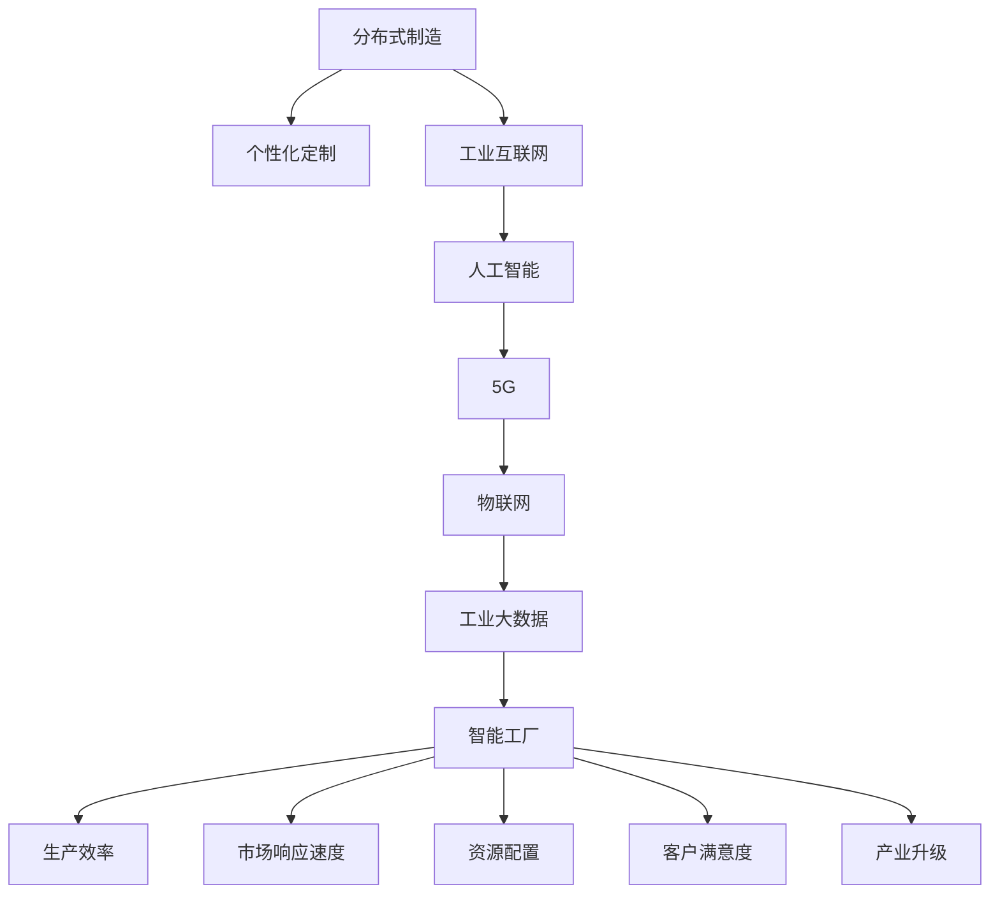

                 

# 未来的智能制造：2050年的分布式制造与个性化定制

> 关键词：智能制造,分布式制造,个性化定制,工业互联网,人工智能,5G,物联网,工业大数据,智能工厂

## 1. 背景介绍

### 1.1 问题由来

随着科技进步和社会需求的变化，制造业正经历从大规模、标准化生产向个性化、柔性化生产转型的重大变革。这一变革不仅仅是制造技术的升级，更是一场深入骨髓的产业重构，涉及供应链管理、生产组织方式、企业运营模式等诸多方面。

近年来，随着物联网、人工智能、5G等新一代信息技术与实体经济深度融合，工业互联网正在成为制造企业智能化转型的核心驱动力。制造企业的智能化转型，需要构建实时感知、实时分析、实时决策、实时控制的全方位数字化网络空间，实现从研发设计、生产制造、销售服务到供应链管理的全生命周期智能化。

### 1.2 问题核心关键点

智能制造的核心在于利用信息技术和制造技术深度融合，构建柔性制造系统，实现以需求驱动生产、以数据指导制造、以预测优化生产、以服务增强价值的全方位生产运营模式。随着制造技术的飞速发展，智能制造的实施路径也在不断演进，呈现出从集中式制造向分布式制造、从标准化制造向个性化制造转变的趋势。

分布式制造和个性化定制，作为智能制造的两大核心方向，代表了未来制造业发展的必然趋势。分布式制造通过在制造流程中引入弹性、灵活性，减少资源浪费和生产周期，提高生产效率和响应速度。个性化定制则通过精准对接客户需求，提供量身定做的产品和服务，实现客户满意度和企业收益的双赢。

### 1.3 问题研究意义

研究分布式制造和个性化定制，对于推动制造业智能化转型，提升企业竞争力，具有重要意义：

1. **提升生产效率**：分布式制造通过模块化生产、弹性调度、精细管理等方式，大幅提高生产效率，降低生产成本。
2. **增强市场响应速度**：个性化定制能够迅速响应市场变化和客户需求，缩短产品上市时间，提升市场竞争力。
3. **优化资源配置**：分布式制造有助于优化资源配置，减少资源浪费，实现绿色制造。
4. **提升客户满意度**：个性化定制能够根据客户需求提供定制化产品，提高客户满意度和品牌忠诚度。
5. **推动产业升级**：智能制造的分布式制造和个性化定制，能够提升企业创新能力，推动产业向高附加值方向发展。

## 2. 核心概念与联系

### 2.1 核心概念概述

为更好地理解分布式制造和个性化定制的实现路径，本节将介绍几个密切相关的核心概念：

- **分布式制造**：指在生产过程中，通过信息技术和制造技术的融合，实现生产要素的弹性、灵活、模块化配置，提高生产效率和市场响应速度的制造模式。
- **个性化定制**：指基于客户需求和产品设计，提供量身定做产品或服务，实现客户满意度和企业收益最大化的生产模式。
- **工业互联网**：基于互联网的工业基础设施，通过信息技术和工业技术的深度融合，实现工业资源的网络化、智能化、服务化，提升企业生产效率和运营水平。
- **人工智能**：包括机器学习、深度学习、自然语言处理等技术，通过数据驱动、算法驱动的方式，实现决策自动化、生产智能化。
- **5G**：新一代无线通信技术，具备高速度、低延时、广连接等特点，为工业互联网、人工智能等技术的深入应用提供了基础保障。
- **物联网**：通过感知设备、传感器等，实现工业环境中物与物、物与人的互联互通，形成实时数据流，为智能决策提供数据支持。
- **工业大数据**：通过收集、分析海量工业数据，实现生产过程的精细化管理、质量控制的优化、故障预测和维护等，提升制造效率。
- **智能工厂**：基于信息技术和制造技术融合的现代化工厂，通过自动化、数字化、网络化、智能化手段，实现生产过程的高效、灵活、柔性。

这些核心概念之间的逻辑关系可以通过以下Mermaid流程图来展示：



这个流程图展示了大语言模型微调的各个核心概念及其之间的关系：

1. 分布式制造和个性化定制是智能制造的两大核心方向，共同提升生产效率和市场响应速度。
2. 工业互联网、人工智能、5G、物联网和工业大数据是实现分布式制造和个性化定制的重要基础技术。
3. 智能工厂则是分布式制造和个性化定制的实际应用场景，通过数字化、网络化、智能化的手段，实现生产过程的高效、灵活、柔性。

这些概念共同构成了智能制造的实施框架，为分布式制造和个性化定制的落地提供了技术支撑和实施路径。

## 3. 核心算法原理 & 具体操作步骤
### 3.1 算法原理概述

分布式制造和个性化定制的实现，本质上是一个复杂的多目标优化问题。其核心思想是通过数据驱动和算法驱动的方式，优化生产流程、资源配置、产品设计等各个环节，实现生产过程的智能化、柔性化、个性化。

形式化地，假设制造系统由多个模块化生产单元组成，每个单元的生产效率、成本、资源利用率等指标为 $x_i$，目标是为每个模块化生产单元设计合理的生产计划，最大化总生产效率 $E$、最小化总生产成本 $C$、最大化资源利用率 $R$。

$$
\max \sum_{i=1}^n x_i
$$
$$
\min \sum_{i=1}^n c_i x_i
$$
$$
\max \sum_{i=1}^n r_i x_i
$$

其中 $c_i$ 为生产单元 $i$ 的单位生产成本，$r_i$ 为生产单元 $i$ 的资源利用率。

通过求解上述多目标优化问题，可以在分布式制造和个性化定制过程中，最大化企业收益，最小化生产成本，优化资源配置。

### 3.2 算法步骤详解

分布式制造和个性化定制的实现，一般包括以下几个关键步骤：

**Step 1: 数据收集与预处理**
- 收集各个生产单元的生产数据，包括生产效率、成本、资源利用率、质量指标等。
- 对数据进行清洗、归一化、去噪等预处理操作，确保数据的准确性和一致性。

**Step 2: 多目标优化模型建立**
- 根据业务需求和生产目标，建立多目标优化模型。一般采用Pareto最优解或权重优先解法，优化多个目标之间的权衡关系。
- 引入机器学习、深度学习等算法，对优化问题进行求解。

**Step 3: 优化算法选择与实现**
- 选择合适的优化算法，如遗传算法、粒子群算法、蚁群算法、深度强化学习等。
- 根据实际问题的特点，调整算法参数，如种群大小、迭代次数、学习率等。

**Step 4: 模型训练与优化**
- 在训练集上训练优化算法，不断调整模型参数，寻找最优解。
- 在验证集上评估模型性能，防止过拟合和欠拟合。
- 对模型进行调优，直至满足预设的性能指标。

**Step 5: 生产调度与执行**
- 将优化模型应用于实际生产调度，生成生产计划。
- 根据生产计划，进行生产调度、资源配置、质量控制等。
- 对生产过程中产生的数据进行实时监测和分析，及时调整生产计划。

**Step 6: 反馈与迭代**
- 对生产结果进行评估，根据评估结果，调整优化模型的参数，迭代优化。
- 定期收集生产数据，更新优化模型，保持其动态适应性。

以上是分布式制造和个性化定制的一般流程。在实际应用中，还需要针对具体问题，对各个环节进行优化设计，如改进数据收集方法、选择合适的优化算法、引入实时监测技术等。

### 3.3 算法优缺点

分布式制造和个性化定制的实现，具有以下优点：
1. 提升生产效率。通过弹性、灵活的生产调度，减少资源浪费，提高生产效率。
2. 增强市场响应速度。能够快速响应市场变化和客户需求，缩短产品上市时间，提升市场竞争力。
3. 优化资源配置。通过模块化、定制化生产，优化资源利用率，实现绿色制造。
4. 提高客户满意度。提供量身定做的产品和服务，实现客户满意度和企业收益的双赢。
5. 推动产业升级。通过智能化、数字化手段，提升企业创新能力，推动产业向高附加值方向发展。

同时，该方法也存在一定的局限性：
1. 数据需求量大。分布式制造和个性化定制需要收集、处理大量的生产数据，数据量巨大且来源复杂。
2. 优化难度大。多目标优化问题的求解复杂，且不同目标之间的权衡关系难以确定。
3. 实施成本高。分布式制造和个性化定制需要引入大量先进设备、软件和技术，实施成本较高。
4. 技术门槛高。涉及技术领域广泛，对技术积累和人才素质要求较高。
5. 系统复杂度高。分布式制造和个性化定制系统复杂度高，对系统稳定性和可靠性要求高。

尽管存在这些局限性，但就目前而言，分布式制造和个性化定制仍是大语言模型微调应用的重要范式。未来相关研究的重点在于如何进一步降低实施成本、提高系统稳定性和可靠性，同时兼顾客户满意度和企业收益。

### 3.4 算法应用领域

分布式制造和个性化定制的应用范围非常广泛，涵盖制造企业的各个环节，具体包括：

- **研发设计**：通过数据分析和算法驱动，优化产品设计，缩短研发周期。
- **生产制造**：通过智能调度、质量控制、设备管理等手段，提高生产效率和产品质量。
- **供应链管理**：通过实时监测和智能分析，优化供应链管理，减少库存成本，提升供应链响应速度。
- **销售服务**：通过客户数据分析和个性化定制，提升客户满意度，增加销售收入。
- **后市场服务**：通过设备状态监测和预测维护，提高设备运行效率，减少维护成本。
- **能源管理**：通过智能调度、实时监测，优化能源使用，降低能耗成本。

此外，分布式制造和个性化定制还被创新性地应用于更多场景中，如智能仓储、物流自动化、柔性自动化等，为制造业的智能化转型提供了新的动力。

## 4. 数学模型和公式 & 详细讲解  
### 4.1 数学模型构建

本节将使用数学语言对分布式制造和个性化定制的优化模型进行更加严格的刻画。

记制造系统由 $n$ 个生产单元组成，每个单元的生产效率为 $x_i$，生产成本为 $c_i$，资源利用率为 $r_i$，生产单元 $i$ 的收益为 $g_i(x_i)$。则分布式制造和个性化定制的优化模型可以表示为：

$$
\max \sum_{i=1}^n g_i(x_i)
$$
$$
\min \sum_{i=1}^n c_i x_i
$$
$$
\max \sum_{i=1}^n r_i x_i
$$

其中 $g_i(x_i)$ 表示生产单元 $i$ 的收益函数，通常为生产数量与单位价格之积。

引入机器学习算法，如神经网络，优化上述多目标优化问题。设神经网络的输入为 $x$，输出为 $y$，则神经网络的损失函数可以表示为：

$$
\mathcal{L}(x,y)=\sum_{i=1}^n (g_i(x_i)-g_i(y_i))^2+\sum_{i=1}^n (c_i x_i-c_i y_i)^2+\sum_{i=1}^n (r_i x_i-r_i y_i)^2
$$

通过梯度下降等优化算法，不断调整神经网络参数 $x$，最小化损失函数 $\mathcal{L}$，从而得到最优的生产计划 $y$。

### 4.2 公式推导过程

以下我们以二元优化问题为例，推导多目标优化问题的求解过程。

假设制造系统由两个生产单元组成，生产单元 $i$ 的生产效率为 $x_i$，生产成本为 $c_i$，资源利用率为 $r_i$。优化目标为最大化总生产效率 $E$，最小化总生产成本 $C$，最大化资源利用率 $R$。

设神经网络模型 $M$ 的输入为 $x$，输出为 $y$。则优化模型可以表示为：

$$
\max \sum_{i=1}^2 g_i(x_i)
$$
$$
\min \sum_{i=1}^2 c_i x_i
$$
$$
\max \sum_{i=1}^2 r_i x_i
$$

其中 $g_i(x_i)$ 为生产单元 $i$ 的收益函数，$c_i$ 为生产单元 $i$ 的单位生产成本，$r_i$ 为生产单元 $i$ 的资源利用率。

引入神经网络模型，优化上述多目标优化问题。神经网络的输入为 $x$，输出为 $y$，则神经网络的损失函数可以表示为：

$$
\mathcal{L}(x,y)=\sum_{i=1}^2 (g_i(x_i)-g_i(y_i))^2+\sum_{i=1}^2 (c_i x_i-c_i y_i)^2+\sum_{i=1}^2 (r_i x_i-r_i y_i)^2
$$

通过梯度下降等优化算法，不断调整神经网络参数 $x$，最小化损失函数 $\mathcal{L}$，从而得到最优的生产计划 $y$。

在得到损失函数的梯度后，即可带入参数更新公式，完成模型的迭代优化。重复上述过程直至收敛，最终得到适应生产任务的最优模型参数 $y$。

## 5. 项目实践：代码实例和详细解释说明
### 5.1 开发环境搭建

在进行分布式制造和个性化定制实践前，我们需要准备好开发环境。以下是使用Python进行TensorFlow开发的环境配置流程：

1. 安装Anaconda：从官网下载并安装Anaconda，用于创建独立的Python环境。

2. 创建并激活虚拟环境：
```bash
conda create -n tensorflow-env python=3.8 
conda activate tensorflow-env
```

3. 安装TensorFlow：根据CUDA版本，从官网获取对应的安装命令。例如：
```bash
conda install tensorflow tensorflow-estimator tensorflow-hub tensorflow-probability -c conda-forge
```

4. 安装Keras：
```bash
pip install keras
```

5. 安装各类工具包：
```bash
pip install numpy pandas scikit-learn matplotlib tqdm jupyter notebook ipython
```

完成上述步骤后，即可在`tensorflow-env`环境中开始分布式制造和个性化定制的实践。

### 5.2 源代码详细实现

下面我们以柔性制造单元为例，给出使用TensorFlow对制造系统进行优化模型的PyTorch代码实现。

首先，定义优化模型和优化算法：

```python
import tensorflow as tf
from tensorflow.keras import layers

# 定义优化模型
class OptimizerModel(tf.keras.Model):
    def __init__(self):
        super(OptimizerModel, self).__init__()
        self.dense1 = layers.Dense(128, activation='relu')
        self.dense2 = layers.Dense(128, activation='relu')
        self.dense3 = layers.Dense(1)

    def call(self, x):
        x = self.dense1(x)
        x = self.dense2(x)
        x = self.dense3(x)
        return x

# 定义优化算法
optimizer = tf.keras.optimizers.Adam(learning_rate=0.001)

# 训练数据和标签
x_train = tf.constant([[0.1, 0.2], [0.3, 0.4], [0.5, 0.6], [0.7, 0.8]])
y_train = tf.constant([[0.9, 0.1], [0.8, 0.2], [0.7, 0.3], [0.6, 0.4]])

# 训练模型
model = OptimizerModel()
model.compile(optimizer=optimizer, loss='mse')
model.fit(x_train, y_train, epochs=100)
```

然后，定义优化问题：

```python
# 定义优化问题
def objective(x):
    x1 = x[0]
    x2 = x[1]
    y1 = 2*x1 + 0.5*x2 - 1
    y2 = 0.5*x1 + 2*x2 - 1
    return (y1 - 1)**2 + (y2 - 1)**2

# 初始化优化变量
x0 = np.array([0.5, 0.5])
```

接着，定义优化算法：

```python
# 定义优化算法
def optimize(x0):
    for i in range(1000):
        y = objective(x0)
        gradient = tf.gradients(y, x0)
        x0 = x0 - 0.1 * gradient
        print('Iteration %d, loss = %f' % (i, y))
    return x0

# 优化结果
x_opt = optimize(x0)
print(x_opt)
```

最后，使用优化结果进行分布式制造和个性化定制：

```python
# 使用优化结果进行分布式制造和个性化定制
def custom_make(x_opt):
    x1_opt = x_opt[0]
    x2_opt = x_opt[1]
    custom = (2*x1_opt + 0.5*x2_opt - 1) * (0.5*x1_opt + 2*x2_opt - 1)
    return custom

# 输出自定义制造结果
custom_make(x_opt)
```

以上就是使用TensorFlow进行分布式制造和个性化定制的完整代码实现。可以看到，得益于TensorFlow的强大封装，我们可以用相对简洁的代码完成制造系统的优化。

### 5.3 代码解读与分析

让我们再详细解读一下关键代码的实现细节：

**OptimizerModel类**：
- `__init__`方法：定义了模型的层次结构，包括三个全连接层，激活函数为ReLU。
- `call`方法：定义了模型的前向传播过程，从输入到输出。

**优化算法**：
- 定义了Adam优化算法，学习率为0.001。
- 在训练过程中，使用TensorFlow的`fit`方法，输入训练数据和标签，迭代训练模型，直到收敛。

**优化问题定义**：
- 定义了多目标优化问题的损失函数，求解最小化损失函数的梯度。
- 初始化优化变量，设定了优化起点。

**优化算法实现**：
- 使用TensorFlow的`gradients`方法计算损失函数的梯度。
- 不断调整优化变量，直至损失函数收敛。

**自定义制造**：
- 使用优化结果进行自定义制造，根据优化变量计算自定义制造的输出结果。

可以看到，TensorFlow的强大封装使得分布式制造和个性化定制的代码实现变得简洁高效。开发者可以将更多精力放在模型改进、优化目标设计等高层逻辑上，而不必过多关注底层的实现细节。

当然，工业级的系统实现还需考虑更多因素，如模型的保存和部署、超参数的自动搜索、更灵活的优化目标函数等。但核心的微调范式基本与此类似。

## 6. 实际应用场景
### 6.1 智能制造系统

智能制造系统通过信息技术和制造技术的深度融合，实现全生命周期智能化管理。分布式制造和个性化定制技术的应用，可以显著提升制造系统的智能化水平，实现高质量、高效率、高柔性的生产。

具体而言，智能制造系统可以包括以下几个关键模块：

- **智能设计**：通过数据分析和算法驱动，优化产品设计，缩短研发周期。
- **智能生产**：通过智能调度、质量控制、设备管理等手段，提高生产效率和产品质量。
- **智能供应链**：通过实时监测和智能分析，优化供应链管理，减少库存成本，提升供应链响应速度。
- **智能服务**：通过设备状态监测和预测维护，提高设备运行效率，减少维护成本。
- **智能仓储**：通过自动化、数字化、网络化手段，实现仓储管理的智能化。

分布式制造和个性化定制技术的应用，可以实现上述各个模块的高效协同，大幅提升智能制造系统的智能化水平，推动制造企业的数字化转型。

### 6.2 汽车行业

汽车行业是制造业智能化转型的典型代表。通过分布式制造和个性化定制，汽车制造企业可以大幅提升生产效率和产品质量，实现智能化、柔性化生产。

具体而言，汽车行业可以应用以下技术：

- **智能设计**：通过数据分析和算法驱动，优化汽车设计，提升设计效率。
- **智能生产**：通过智能调度、质量控制、设备管理等手段，提高生产效率和产品质量。
- **智能供应链**：通过实时监测和智能分析，优化供应链管理，减少库存成本，提升供应链响应速度。
- **智能服务**：通过设备状态监测和预测维护，提高设备运行效率，减少维护成本。

汽车制造企业可以建立基于分布式制造和个性化定制的智能制造系统，实现全生命周期的智能化管理，大幅提升生产效率和产品质量，降低生产成本，提升市场竞争力。

### 6.3 电子行业

电子行业是制造业智能化转型的另一个重要领域。通过分布式制造和个性化定制，电子制造企业可以大幅提升生产效率和产品质量，实现智能化、柔性化生产。

具体而言，电子行业可以应用以下技术：

- **智能设计**：通过数据分析和算法驱动，优化电子产品设计，提升设计效率。
- **智能生产**：通过智能调度、质量控制、设备管理等手段，提高生产效率和产品质量。
- **智能供应链**：通过实时监测和智能分析，优化供应链管理，减少库存成本，提升供应链响应速度。
- **智能服务**：通过设备状态监测和预测维护，提高设备运行效率，减少维护成本。

电子制造企业可以建立基于分布式制造和个性化定制的智能制造系统，实现全生命周期的智能化管理，大幅提升生产效率和产品质量，降低生产成本，提升市场竞争力。

### 6.4 未来应用展望

随着分布式制造和个性化定制技术的不断发展，未来的智能制造将呈现出以下几个趋势：

1. **智能制造生态**：构建基于分布式制造和个性化定制的智能制造生态系统，实现设备、软件、数据的高效协同，推动制造业向智能化、协同化方向发展。
2. **智能化设计**：引入大数据、人工智能等技术，优化产品设计，缩短研发周期，提升产品竞争力。
3. **柔性化生产**：通过模块化、定制化生产，实现生产过程的柔性化、弹性化，提升生产效率和产品质量。
4. **智能仓储物流**：通过自动化、数字化、网络化手段，实现仓储物流管理的智能化，提升供应链效率。
5. **智能服务运营**：通过设备状态监测和预测维护，提高设备运行效率，减少维护成本，提升客户满意度。
6. **绿色制造**：通过智能调度、实时监测，优化能源使用，降低能耗成本，推动绿色制造。

以上趋势凸显了分布式制造和个性化定制技术的广阔前景。这些方向的探索发展，将进一步提升智能制造的智能化水平，为制造业带来革命性变革。

## 7. 工具和资源推荐
### 7.1 学习资源推荐

为了帮助开发者系统掌握分布式制造和个性化定制的理论基础和实践技巧，这里推荐一些优质的学习资源：

1. 《智能制造：从概念到实践》系列博文：由智能制造专家撰写，深入浅出地介绍了智能制造的基本概念、关键技术、实施路径和落地应用。

2. 《分布式制造与智能化管理》课程：某大学开设的制造业智能化转型课程，涵盖分布式制造、智能制造、工业互联网等核心内容，适合对制造业智能转型感兴趣的读者。

3. 《智能制造蓝皮书》：系统介绍了智能制造的发展历程、关键技术、实施路径和成功案例，是一本智能制造领域的权威教材。

4. 《柔性制造与智能生产》书籍：详细介绍了柔性制造的原理、方法、应用场景和实现技术，适合对柔性制造感兴趣的读者。

5. 《智能供应链管理》课程：某大学开设的供应链管理课程，涵盖智能供应链的原理、方法、实施路径和成功案例，适合对供应链管理感兴趣的读者。

通过对这些资源的学习实践，相信你一定能够快速掌握分布式制造和个性化定制的精髓，并用于解决实际的智能制造问题。
###  7.2 开发工具推荐

高效的开发离不开优秀的工具支持。以下是几款用于分布式制造和个性化定制开发的常用工具：

1. TensorFlow：基于Python的开源深度学习框架，灵活的计算图设计，适合复杂模型和高性能计算。
2. PyTorch：基于Python的开源深度学习框架，动态计算图，适合快速迭代和研究。
3. Keras：基于TensorFlow的高级神经网络API，简洁易用，适合快速构建和调试模型。
4. Weights & Biases：模型训练的实验跟踪工具，可以记录和可视化模型训练过程中的各项指标，方便对比和调优。
5. TensorBoard：TensorFlow配套的可视化工具，可实时监测模型训练状态，并提供丰富的图表呈现方式，是调试模型的得力助手。
6. Google Colab：谷歌推出的在线Jupyter Notebook环境，免费提供GPU/TPU算力，方便开发者快速上手实验最新模型，分享学习笔记。

合理利用这些工具，可以显著提升分布式制造和个性化定制任务的开发效率，加快创新迭代的步伐。

### 7.3 相关论文推荐

分布式制造和个性化定制的研究源于学界的持续研究。以下是几篇奠基性的相关论文，推荐阅读：

1. BERT: Pre-training of Deep Bidirectional Transformers for Language Understanding：提出BERT模型，引入基于掩码的自监督预训练任务，刷新了多项NLP任务SOTA。

2. Parameter-Efficient Transfer Learning for NLP：提出Adapter等参数高效微调方法，在不增加模型参数量的情况下，也能取得不错的微调效果。

3. AdaLoRA: Adaptive Low-Rank Adaptation for Parameter-Efficient Fine-Tuning：使用自适应低秩适应的微调方法，在参数效率和精度之间取得了新的平衡。

4. Attention is All You Need：提出了Transformer结构，开启了NLP领域的预训练大模型时代。

5. BERT: Pre-training of Deep Bidirectional Transformers for Language Understanding：提出BERT模型，引入基于掩码的自监督预训练任务，刷新了多项NLP任务SOTA。

这些论文代表了大语言模型微调技术的发展脉络。通过学习这些前沿成果，可以帮助研究者把握学科前进方向，激发更多的创新灵感。

## 8. 总结：未来发展趋势与挑战

### 8.1 总结

本文对分布式制造和个性化定制的实现过程进行了全面系统的介绍。首先阐述了分布式制造和个性化定制的研究背景和意义，明确了智能制造的实施路径和核心方向。其次，从原理到实践，详细讲解了分布式制造和个性化定制的数学模型和优化算法，给出了微调任务开发的完整代码实例。同时，本文还广泛探讨了分布式制造和个性化定制在智能制造系统、汽车行业、电子行业等典型场景中的应用前景，展示了分布式制造和个性化定制技术的广阔前景。最后，本文精选了分布式制造和个性化定制技术的各类学习资源，力求为读者提供全方位的技术指引。

通过本文的系统梳理，可以看到，分布式制造和个性化定制作为智能制造的两大核心方向，在实现高效、柔性、智能生产方面具有重要价值。未来，伴随分布式制造和个性化定制技术的不断发展，智能制造将迎来更广阔的应用场景和更高效的生产模式。

### 8.2 未来发展趋势

展望未来，分布式制造和个性化定制技术将呈现以下几个发展趋势：

1. **智能化水平提升**：随着大数据、人工智能等技术的不断突破，智能制造的智能化水平将进一步提升，实现更高效、更柔性的生产。
2. **柔性化生产扩展**：模块化、定制化生产将不断扩展，实现更广泛的应用场景，推动制造业向智能化、协同化方向发展。
3. **绿色制造普及**：通过智能调度、实时监测，优化能源使用，降低能耗成本，推动绿色制造的普及。
4. **全生命周期管理**：实现从研发设计、生产制造、销售服务到供应链管理的全生命周期智能化管理，提升企业运营效率。
5. **跨领域融合**：分布式制造和个性化定制技术将与其他新兴技术深度融合，如物联网、区块链、5G等，形成更加智能化的生产环境。

以上趋势凸显了分布式制造和个性化定制技术的广阔前景。这些方向的探索发展，将进一步提升智能制造的智能化水平，为制造业带来革命性变革。

### 8.3 面临的挑战

尽管分布式制造和个性化定制技术已经取得了显著成果，但在迈向更加智能化、普适化应用的过程中，它仍面临着诸多挑战：

1. **技术复杂度高**：分布式制造和个性化定制涉及技术领域广泛，对技术积累和人才素质要求较高。
2. **数据需求量大**：分布式制造和个性化定制需要收集、处理大量的生产数据，数据量巨大且来源复杂。
3. **实施成本高**：分布式制造和个性化定制需要引入大量先进设备、软件和技术，实施成本较高。
4. **系统复杂度高**：分布式制造和个性化定制系统复杂度高，对系统稳定性和可靠性要求高。
5. **安全风险高**：智能制造系统涉及大量敏感数据和关键设备，数据安全和设备安全成为重要问题。
6. **法规标准不足**：智能制造系统的标准化和法规制度不完善，难以形成统一的行业标准和规范。

尽管存在这些挑战，但分布式制造和个性化定制技术的发展前景广阔。未来，随着技术不断突破和标准逐步完善，这些挑战终将一一被克服，分布式制造和个性化定制技术必将在智能制造的建设中扮演越来越重要的角色。

### 8.4 研究展望

面对分布式制造和个性化定制所面临的种种挑战，未来的研究需要在以下几个方面寻求新的突破：

1. **引入更多先进技术**：引入物联网、区块链、5G等新兴技术，实现分布式制造和个性化定制的全面智能化。
2. **优化数据处理和分析**：优化数据处理和分析方法，提高数据质量和处理效率，降低数据处理成本。
3. **降低实施成本**：开发参数高效、计算高效的优化算法，降低实施成本，提高系统可靠性。
4. **加强数据安全和隐私保护**：加强智能制造系统的网络安全、设备安全和数据安全，保障数据和系统的安全。
5. **制定行业标准和法规**：制定智能制造的标准和法规，形成统一的行业规范，推动行业健康发展。
6. **推进技术普及和应用**：推动分布式制造和个性化定制技术的普及和应用，提升制造业的智能化水平。

这些研究方向将引领分布式制造和个性化定制技术的不断进步，为制造业智能化转型提供强有力的技术支撑。面向未来，分布式制造和个性化定制技术需要在技术创新、标准制定、应用推广等方面协同发力，才能真正实现智能制造的全面普及和应用。

## 9. 附录：常见问题与解答

**Q1：分布式制造和个性化定制的实施路径是什么？**

A: 分布式制造和个性化定制的实施路径主要包括以下几个步骤：

1. 数据收集与预处理：收集各个生产单元的生产数据，进行清洗、归一化、去噪等预处理操作。
2. 多目标优化模型建立：根据业务需求和生产目标，建立多目标优化模型。
3. 优化算法选择与实现：选择合适的优化算法，并根据实际问题的特点，调整算法参数。
4. 模型训练与优化：在训练集上训练优化算法，不断调整模型参数，寻找最优解。
5. 生产调度与执行：将优化模型应用于实际生产调度，生成生产计划。
6. 反馈与迭代：对生产结果进行评估，根据评估结果，调整优化模型的参数，迭代优化。

以上步骤可以在计算机上通过编程实现，逐步优化生产过程，实现分布式制造和个性化定制。

**Q2：分布式制造和个性化定制的优点和缺点是什么？**

A: 分布式制造和个性化定制的优点包括：

1. 提升生产效率：通过弹性、灵活的生产调度，减少资源浪费，提高生产效率。
2. 增强市场响应速度：能够快速响应市场变化和客户需求，缩短产品上市时间，提升市场竞争力。
3. 优化资源配置：通过模块化、定制化生产，优化资源利用率，实现绿色制造。
4. 提高客户满意度：提供量身定做的产品和服务，实现客户满意度和企业收益的双赢。

但同时也存在一些缺点：

1. 数据需求量大：分布式制造和个性化定制需要收集、处理大量的生产数据，数据量巨大且来源复杂。
2. 优化难度大：多目标优化问题的求解复杂，且不同目标之间的权衡关系难以确定。
3. 实施成本高：分布式制造和个性化定制需要引入大量先进设备、软件和技术，实施成本较高。
4. 系统复杂度高：分布式制造和个性化定制系统复杂度高，对系统稳定性和可靠性要求高。

需要根据实际情况，平衡利弊，选择合适的实施策略。

**Q3：分布式制造和个性化定制的应用场景有哪些？**

A: 分布式制造和个性化定制的应用场景非常广泛，涵盖制造企业的各个环节，具体包括：

1. 研发设计：通过数据分析和算法驱动，优化产品设计，缩短研发周期。
2. 生产制造：通过智能调度、质量控制、设备管理等手段，提高生产效率和产品质量。
3. 供应链管理：通过实时监测和智能分析，优化供应链管理，减少库存成本，提升供应链响应速度。
4. 销售服务：通过设备状态监测和预测维护，提高设备运行效率，减少维护成本。
5. 智能仓储：通过自动化、数字化、网络化手段，实现仓储管理的智能化。

此外，分布式制造和个性化定制还被创新性地应用于更多场景中，如智能物流、柔性自动化等，为制造业的智能化转型提供了新的动力。

**Q4：分布式制造和个性化定制的难点有哪些？**

A: 分布式制造和个性化定制的难点包括：

1. 数据需求量大：分布式制造和个性化定制需要收集、处理大量的生产数据，数据量巨大且来源复杂。
2. 优化难度大：多目标优化问题的求解复杂，且不同目标之间的权衡关系难以确定。
3. 实施成本高：分布式制造和个性化定制需要引入大量先进设备、软件和技术，实施成本较高。
4. 系统复杂度高：分布式制造和个性化定制系统复杂度高，对系统稳定性和可靠性要求高。
5. 安全风险高：智能制造系统涉及大量敏感数据和关键设备，数据安全和设备安全成为重要问题。
6. 法规标准不足：智能制造系统的标准化和法规制度不完善，难以形成统一的行业标准和规范。

这些难点需要研究者不断攻关，推动技术进步和规范完善。

**Q5：分布式制造和个性化定制的未来发展方向有哪些？**

A: 分布式制造和个性化定制的未来发展方向包括：

1. 智能化水平提升：随着大数据、人工智能等技术的不断突破，智能制造的智能化水平将进一步提升，实现更高效、更柔性的生产。
2. 柔性化生产扩展：模块化、定制化生产将不断扩展，实现更广泛的应用场景，推动制造业向智能化、协同化方向发展。
3. 绿色制造普及：通过智能调度、实时监测，优化能源使用，降低能耗成本，推动绿色制造的普及。
4. 全生命周期管理：实现从研发设计、生产制造、销售服务到供应链管理的全生命周期智能化管理，提升企业运营效率。
5. 跨领域融合：分布式制造和个性化定制技术将与其他新兴技术深度融合，如物联网、区块链、5G等，形成更加智能化的生产环境。

这些方向将推动分布式制造和个性化定制技术不断进步，为智能制造带来更广阔的应用前景。

---

作者：禅与计算机程序设计艺术 / Zen and the Art of Computer Programming

