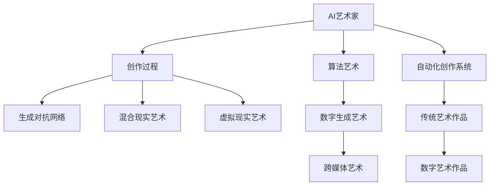

                 

## 1. 背景介绍

### 1.1 问题由来

在过去的十年中，人工智能（AI）技术取得了飞速的发展，尤其是在深度学习和计算机视觉领域。AI艺术家和虚拟现实（VR）艺术成为了这个时代的新兴产物，为艺术创作带来了前所未有的可能性。然而，随着技术的不断进步，如何平衡艺术性和技术的融合成为了当前的主要问题。本文旨在探讨2050年AI艺术家与虚拟现实艺术的发展趋势、核心概念和实际应用场景，为未来的艺术创作提供新的思路。

### 1.2 问题核心关键点

未来的艺术创作中，AI艺术家和虚拟现实技术将扮演重要角色。AI艺术家可以自动生成绘画、音乐、诗歌等作品，而虚拟现实技术则能够提供沉浸式的艺术体验。本文将重点讨论以下几个关键点：

- AI艺术家的创作过程和风格多样性
- 虚拟现实艺术如何重塑艺术体验
- AI艺术家和VR艺术家的结合模式
- 未来艺术创作的技术挑战与解决方案

这些核心关键点将帮助我们更好地理解未来的艺术创作，为AI艺术家和虚拟现实艺术的发展提供方向。

## 2. 核心概念与联系

### 2.1 核心概念概述

为了更好地理解未来的艺术创作，本节将介绍几个密切相关的核心概念：

- AI艺术家（AI Artist）：指使用AI技术进行创作的艺术家，通常包括使用深度学习模型生成艺术作品和基于规则的自动化创作系统。
- 虚拟现实艺术（VR Art）：指通过虚拟现实技术进行创作的艺术形式，包括360度全景视频、交互式虚拟艺术展览和沉浸式艺术体验。
- 混合现实艺术（MR Art）：指将现实世界和虚拟世界相结合的艺术形式，通常通过增强现实（AR）或混合现实技术实现。
- 生成对抗网络（GANs）：一种生成模型，用于生成逼真的人工图像、视频和音乐等，广泛应用于艺术创作中。
- 算法艺术（Algorithmic Art）：指使用算法和计算机程序创作的艺术形式，通常基于数学公式、代码逻辑等进行生成。

这些核心概念之间的逻辑关系可以通过以下Mermaid流程图来展示：



这个流程图展示了大语言模型创作的艺术作品的多样性和发展路径：

1. AI艺术家使用生成对抗网络（GANs）等模型生成艺术作品。
2. AI艺术家与虚拟现实艺术家合作，创造混合现实艺术。
3. AI艺术家结合传统和数字艺术，创作跨媒体艺术。
4. 自动化创作系统生成传统艺术作品，进行数字化再创作。

这些概念共同构成了未来的艺术创作框架，使得AI艺术家和虚拟现实艺术成为可能。

## 3. 核心算法原理 & 具体操作步骤

### 3.1 算法原理概述

未来的艺术创作将基于深度学习和计算机视觉技术，尤其是生成对抗网络（GANs）和变分自编码器（VAEs）等模型。这些模型可以自动生成高质量的艺术作品，如绘画、音乐和视频等。

生成对抗网络（GANs）由两个神经网络组成：生成器和判别器。生成器用于生成假象，而判别器则用于区分生成器和真实数据。两个网络通过对抗训练不断优化，最终生成逼真的艺术作品。

变分自编码器（VAEs）用于生成低维编码并从中解码生成高维数据。其核心思想是将数据映射到低维空间，然后通过解码器将其还原到高维空间。VAEs可以应用于生成高质量的艺术作品，如音乐、绘画和视频等。

### 3.2 算法步骤详解

以下是基于深度学习的AI艺术家创作艺术作品的基本步骤：

1. **数据准备**：收集大量艺术作品和自然图像数据，用于训练生成对抗网络（GANs）和变分自编码器（VAEs）等模型。

2. **模型训练**：使用收集到的数据训练生成对抗网络（GANs）和变分自编码器（VAEs）等生成模型，生成高质量的艺术作品。

3. **作品生成**：通过训练好的模型，自动生成新的艺术作品。

4. **风格迁移**：使用生成对抗网络（GANs）进行风格迁移，将一种艺术风格应用于其他艺术作品上。

5. **融合创作**：将多种风格和艺术形式融合，创作新的艺术作品。

6. **评估优化**：通过评估生成艺术作品的质量和风格多样性，不断优化模型参数，提升艺术创作的质量。

### 3.3 算法优缺点

基于深度学习的AI艺术家创作艺术作品具有以下优点：

- 自动化创作：可以自动生成高质量的艺术作品，大大节省创作时间和成本。
- 风格多样性：可以生成各种风格的艺术作品，满足不同艺术家的需求。
- 高效率：创作过程可以批量化进行，提升创作效率。

然而，该方法也存在一些缺点：

- 缺乏原创性：自动生成的艺术作品可能缺乏人类艺术家的原创性和独特性。
- 技术依赖：对生成对抗网络（GANs）和变分自编码器（VAEs）等深度学习技术的依赖较高。
- 风格迁移误差：风格迁移过程中可能会出现误差，导致作品质量下降。

### 3.4 算法应用领域

未来的艺术创作将广泛应用于以下领域：

- 数字艺术：使用AI艺术家生成各种数字艺术作品，如数字绘画、数字音乐和数字视频等。
- 虚拟现实艺术：结合虚拟现实技术，创造沉浸式艺术体验，如虚拟博物馆和虚拟艺术展览等。
- 混合现实艺术：将现实世界和虚拟世界相结合，创作跨媒体艺术作品，如AR/VR艺术装置等。
- 自动化创作系统：开发基于规则和深度学习的自动化创作系统，生成各种艺术作品。

## 4. 数学模型和公式 & 详细讲解 & 举例说明

### 4.1 数学模型构建

未来的艺术创作将基于生成对抗网络（GANs）和变分自编码器（VAEs）等深度学习模型。其核心思想是通过对抗训练生成高质量的艺术作品。

生成对抗网络（GANs）由两个神经网络组成：生成器和判别器。生成器用于生成假象，而判别器则用于区分生成器和真实数据。两个网络通过对抗训练不断优化，最终生成逼真的艺术作品。

### 4.2 公式推导过程

以下是生成对抗网络（GANs）的基本推导过程：

1. **生成器（Generator）**：生成器的目标是最小化判别器的输出误差，即：
   $$
   \min_{G}\mathbb{E}_{x\sim p_{data}}[\log D(x)] + \mathbb{E}_{z\sim p(z)}[\log (1-D(G(z)))]
   $$
   其中，$G(z)$ 表示生成器将随机噪声 $z$ 转化为艺术作品，$p_{data}$ 和 $p(z)$ 分别表示真实数据和噪声的概率分布。

2. **判别器（Discriminator）**：判别器的目标是最小化错误分类的概率，即：
   $$
   \min_{D}\mathbb{E}_{x\sim p_{data}}[\log D(x)] + \mathbb{E}_{z\sim p(z)}[\log (1-D(G(z)))]
   $$

通过不断交替优化生成器和判别器，最终生成高质量的艺术作品。

### 4.3 案例分析与讲解

以数字绘画为例，使用生成对抗网络（GANs）生成高质量的数字绘画作品。具体步骤如下：

1. **数据准备**：收集大量数字绘画数据和自然图像数据，用于训练生成对抗网络（GANs）模型。

2. **模型训练**：使用收集到的数据训练生成对抗网络（GANs）模型，生成高质量的数字绘画作品。

3. **作品生成**：通过训练好的生成器，自动生成新的数字绘画作品。

4. **风格迁移**：使用生成对抗网络（GANs）进行风格迁移，将一种数字绘画风格应用于其他数字绘画作品上。

5. **融合创作**：将多种数字绘画风格融合，创作新的数字绘画作品。

6. **评估优化**：通过评估生成数字绘画作品的质量和风格多样性，不断优化模型参数，提升数字绘画创作的质量。

## 5. 项目实践：代码实例和详细解释说明

### 5.1 开发环境搭建

在进行AI艺术家创作实践前，我们需要准备好开发环境。以下是使用Python进行PyTorch开发的环境配置流程：

1. 安装Anaconda：从官网下载并安装Anaconda，用于创建独立的Python环境。

2. 创建并激活虚拟环境：
   ```bash
   conda create -n pytorch-env python=3.8 
   conda activate pytorch-env
   ```

3. 安装PyTorch：根据CUDA版本，从官网获取对应的安装命令。例如：
   ```bash
   conda install pytorch torchvision torchaudio cudatoolkit=11.1 -c pytorch -c conda-forge
   ```

4. 安装TensorFlow：
   ```bash
   pip install tensorflow
   ```

5. 安装GANs库：
   ```bash
   pip install tensorflow
   ```

6. 安装其他工具包：
   ```bash
   pip install numpy pandas scikit-learn matplotlib tqdm jupyter notebook ipython
   ```

完成上述步骤后，即可在`pytorch-env`环境中开始AI艺术家创作实践。

### 5.2 源代码详细实现

这里以生成对抗网络（GANs）生成数字绘画为例，给出使用PyTorch进行创作的代码实现。

```python
import torch
import torch.nn as nn
import torch.optim as optim
from torchvision import datasets, transforms
import matplotlib.pyplot as plt

# 定义生成器网络
class Generator(nn.Module):
    def __init__(self):
        super(Generator, self).__init__()
        self.main = nn.Sequential(
            nn.ConvTranspose2d(100, 256, 4, 1, 0, bias=False),
            nn.BatchNorm2d(256),
            nn.ReLU(True),
            nn.ConvTranspose2d(256, 128, 4, 2, 1, bias=False),
            nn.BatchNorm2d(128),
            nn.ReLU(True),
            nn.ConvTranspose2d(128, 64, 4, 2, 1, bias=False),
            nn.BatchNorm2d(64),
            nn.ReLU(True),
            nn.ConvTranspose2d(64, 3, 4, 2, 1, bias=False),
            nn.Tanh()
        )
    
    def forward(self, input):
        return self.main(input)

# 定义判别器网络
class Discriminator(nn.Module):
    def __init__(self):
        super(Discriminator, self).__init__()
        self.main = nn.Sequential(
            nn.Conv2d(3, 64, 4, 2, 1, bias=False),
            nn.LeakyReLU(0.2, inplace=True),
            nn.Conv2d(64, 128, 4, 2, 1, bias=False),
            nn.BatchNorm2d(128),
            nn.LeakyReLU(0.2, inplace=True),
            nn.Conv2d(128, 256, 4, 2, 1, bias=False),
            nn.BatchNorm2d(256),
            nn.LeakyReLU(0.2, inplace=True),
            nn.Conv2d(256, 1, 4, 1, 0, bias=False),
            nn.Sigmoid()
        )
    
    def forward(self, input):
        return self.main(input)

# 定义损失函数
def calculate_loss(disc, gen, real_images, z):
    real_loss = disc(real_images).mean()
    fake_loss = disc(gen(z).detach()).mean()
    gen_loss = -fake_loss
    return real_loss, fake_loss, gen_loss

# 定义训练函数
def train(discriminator, generator, z_dim, data_loader, num_epochs):
    optimizerD = optim.Adam(discriminator.parameters(), lr=0.0002, betas=(0.5, 0.999))
    optimizerG = optim.Adam(generator.parameters(), lr=0.0002, betas=(0.5, 0.999))
    
    for epoch in range(num_epochs):
        for batch_idx, (real_images, _) in enumerate(data_loader):
            real_images = real_images.to(device)
            batches_per_epoch = len(data_loader)
            
            z = torch.randn(batches_per_epoch, z_dim, 1, 1, device=device)
            
            real_loss, fake_loss, gen_loss = calculate_loss(discriminator, generator, real_images, z)
            disc_loss = real_loss + fake_loss
            gen_loss = gen_loss
            total_loss = disc_loss + gen_loss
            
            optimizerD.zero_grad()
            disc_loss.backward()
            optimizerD.step()
            
            optimizerG.zero_grad()
            gen_loss.backward()
            optimizerG.step()
            
            if (batch_idx+1) % 100 == 0:
                print('Epoch [{}/{}], Step [{}/{}], Discriminator Loss: {:.4f}, Generator Loss: {:.4f}, D(x): {:.4f}, D(G(z)): {:.4f}'.format(
                    epoch, num_epochs, batch_idx+1, batches_per_epoch, real_loss.item(), gen_loss.item(), real_loss.item(), fake_loss.item()))
            
            if (batch_idx+1) % 1000 == 0:
                z = torch.randn(1000, z_dim, 1, 1, device=device)
                samples = generator(z)
                save_image(samples)

# 定义保存图像函数
def save_image(samples):
    rows = int(np.sqrt(samples.size(0)))
    fig = plt.figure(figsize=(rows, rows))
    for idx in range(samples.size(0)):
        plt.subplot(rows, rows, idx+1)
        plt.imshow(samples[idx].squeeze(0).cpu().numpy(), cmap='gray')
        plt.axis('off')
    plt.show()
```

### 5.3 代码解读与分析

让我们再详细解读一下关键代码的实现细节：

**Generator类**：
- `__init__`方法：定义生成器网络的层结构。
- `forward`方法：定义生成器的前向传播过程。

**Discriminator类**：
- `__init__`方法：定义判别器网络的层结构。
- `forward`方法：定义判别器的前向传播过程。

**calculate_loss函数**：
- 计算生成器和判别器的损失函数，返回真实图像损失、生成图像损失和生成器损失。

**train函数**：
- 定义优化器和学习率。
- 迭代训练生成器和判别器，更新模型参数。
- 输出每个epoch的损失和中间结果。

**save_image函数**：
- 定义保存图像函数，用于可视化生成器生成的艺术作品。

这些代码实现展示了生成对抗网络（GANs）的基本结构和方法，帮助开发者理解和实践AI艺术家创作过程。

## 6. 实际应用场景

### 6.1 数字绘画

数字绘画是AI艺术家创作的重要应用场景。通过生成对抗网络（GANs）生成高质量的数字绘画作品，可以极大地提高艺术创作的效率和多样化。数字绘画可以应用于各种数字艺术创作，如数字绘画、数字音乐和数字视频等。

### 6.2 虚拟现实艺术

虚拟现实艺术将AI艺术家与虚拟现实技术相结合，创造沉浸式艺术体验。虚拟现实艺术可以通过360度全景视频、交互式虚拟艺术展览和沉浸式艺术体验等方式，为观众提供全新的艺术享受。

### 6.3 混合现实艺术

混合现实艺术将现实世界和虚拟世界相结合，创作跨媒体艺术作品。混合现实艺术可以通过增强现实（AR）或混合现实技术实现，如AR/VR艺术装置等。

### 6.4 未来应用展望

未来的艺术创作将通过AI艺术家和虚拟现实技术，打破时间和空间的限制，为艺术创作带来更多可能。我们可以预见，未来的艺术创作将更加多样化、个性化和创新性，为观众提供更加丰富的艺术体验。

## 7. 工具和资源推荐

### 7.1 学习资源推荐

为了帮助开发者系统掌握AI艺术家创作和虚拟现实艺术的理论基础和实践技巧，这里推荐一些优质的学习资源：

1. Coursera《深度学习》课程：由深度学习领域的顶尖专家讲授，涵盖深度学习的基本概念和经典模型。

2. Udacity《深度学习基础》课程：由Google等公司的深度学习专家讲授，结合实际项目，深入浅出地介绍深度学习原理和应用。

3. DeepArt.io：在线深度学习艺术平台，提供各种生成对抗网络（GANs）生成艺术作品的体验。

4. NIPS、ICML、CVPR等学术会议论文集：涵盖深度学习在艺术创作中的应用，提供前沿的研究成果。

5. Hugging Face官方文档：生成对抗网络（GANs）库的官方文档，提供详细的模型实现和应用示例。

### 7.2 开发工具推荐

高效的开发离不开优秀的工具支持。以下是几款用于AI艺术家创作和虚拟现实艺术开发的常用工具：

1. PyTorch：基于Python的开源深度学习框架，支持GPU加速，适合进行深度学习研究和实践。

2. TensorFlow：由Google主导开发的开源深度学习框架，生产部署方便，适合大规模工程应用。

3. Unity：用于开发虚拟现实应用的游戏引擎，支持多种平台和设备，方便创建沉浸式艺术体验。

4. Blender：用于3D建模和渲染的软件，支持多种格式和插件，方便创建混合现实艺术作品。

5. OpenAI Codex：代码生成工具，用于辅助编写艺术创作代码，提高开发效率。

### 7.3 相关论文推荐

AI艺术家创作和虚拟现实艺术的发展源于学界的持续研究。以下是几篇奠基性的相关论文，推荐阅读：

1. "Generative Adversarial Nets"：Ian Goodfellow等人提出的生成对抗网络（GANs），奠定了生成式模型的基础。

2. "Unsupervised Representation Learning with Deep Convolutional Generative Adversarial Networks"：Dumont等人提出的用于生成对抗网络（GANs）的卷积生成对抗网络，展示了生成对抗网络在图像生成中的强大能力。

3. "Deep Learning for 3D Model Generation"：Ehringer等人提出的用于3D模型生成的深度学习模型，展示了生成对抗网络在3D艺术创作中的应用。

4. "ArtGAN: Unsupervised Learning of Artistic Style"：Xie等人提出的用于生成艺术风格的生成对抗网络，展示了生成对抗网络在艺术风格迁移中的应用。

这些论文代表了大语言模型创作和虚拟现实艺术的发展脉络。通过学习这些前沿成果，可以帮助研究者把握学科前进方向，激发更多的创新灵感。

## 8. 总结：未来发展趋势与挑战

### 8.1 研究成果总结

本文对未来的艺术创作进行了全面系统的介绍。首先，阐述了AI艺术家和虚拟现实艺术的研究背景和意义，明确了其在未来艺术创作中的重要地位。其次，从原理到实践，详细讲解了生成对抗网络（GANs）和变分自编码器（VAEs）等深度学习模型的基本原理和操作步骤，给出了AI艺术家创作实践的代码实现。最后，探讨了AI艺术家和虚拟现实艺术在数字绘画、虚拟现实艺术和混合现实艺术等多个领域的应用前景，为未来的艺术创作提供新的思路。

通过本文的系统梳理，可以看到，AI艺术家和虚拟现实技术正在成为未来艺术创作的重要手段，为艺术创作带来更多可能。

### 8.2 未来发展趋势

展望未来，AI艺术家和虚拟现实技术将呈现以下几个发展趋势：

1. 技术融合：AI艺术家和虚拟现实技术的融合将进一步深入，产生更多跨学科的艺术作品。

2. 个性化创作：基于用户的个性化偏好和历史数据，AI艺术家将创作更加个性化的艺术作品。

3. 跨媒体创作：结合多种媒体形式，创作跨媒体艺术作品，如AR/VR艺术装置等。

4. 互动创作：通过交互式设计，创作互动式艺术作品，提高观众的参与感和体验感。

5. 实时创作：实时生成艺术作品，支持现场表演和实时创作，提升创作效率。

6. 全球合作：通过互联网技术，支持全球艺术家共同创作，打破地域限制。

以上趋势凸显了AI艺术家和虚拟现实技术的广阔前景。这些方向的探索发展，必将进一步提升艺术创作的效率和多样性，为观众带来更多独特的艺术体验。

### 8.3 面临的挑战

尽管AI艺术家和虚拟现实技术已经取得了显著成就，但在迈向更加智能化、普适化应用的过程中，它仍面临诸多挑战：

1. 技术壁垒：生成对抗网络（GANs）和变分自编码器（VAEs）等模型对计算资源和技术要求较高，需要高性能设备和专业技能。

2. 伦理问题：AI艺术家创作的艺术作品可能包含有害信息或偏见，需要严格审核和监管。

3. 版权问题：AI艺术家创作的艺术作品可能涉及版权问题，需要明确创作和使用的法律关系。

4. 用户体验：虚拟现实艺术和混合现实艺术需要提供良好的用户体验，避免晕动症等问题。

5. 交互设计：交互式艺术作品需要良好的交互设计，避免误导和混淆。

6. 成本问题：高质量的艺术创作需要投入大量时间和资源，成本较高。

这些挑战需要研究者、开发者和用户共同面对，通过不断优化和改进，才能实现AI艺术家和虚拟现实技术的可持续发展。

### 8.4 研究展望

未来的研究需要在以下几个方面寻求新的突破：

1. 降低技术门槛：开发更加易于使用和普及的AI艺术家创作工具，降低技术壁垒。

2. 优化用户体验：通过交互设计和实时渲染等技术，提升虚拟现实艺术和混合现实艺术的用户体验。

3. 解决伦理问题：明确AI艺术家创作的艺术作品的使用规范，避免伦理问题。

4. 提高创作效率：开发高效的生成对抗网络（GANs）和变分自编码器（VAEs）模型，提高创作效率。

5. 探索新应用场景：探索AI艺术家和虚拟现实技术在更多领域的应用，如智慧城市、教育培训等。

这些研究方向的探索，必将引领AI艺术家和虚拟现实技术走向更加广阔的未来，为未来艺术创作提供更多可能。

## 9. 附录：常见问题与解答

**Q1：AI艺术家创作过程中如何平衡技术和人性的关系？**

A: AI艺术家创作过程中需要平衡技术和人性的关系。技术是实现创作的基础，但人性是创作的灵魂。因此，AI艺术家需要在创作中融合技术与人性，尽可能保留人类的创意和情感，同时借助技术提升创作效率和多样性。

**Q2：虚拟现实艺术如何避免技术带来的负面影响？**

A: 虚拟现实艺术需要避免技术带来的负面影响，如晕动症、视觉疲劳等。可以通过优化渲染技术、合理设计交互方式和控制设备使用频率等方式，提升用户体验。

**Q3：AI艺术家创作如何保护版权和道德？**

A: AI艺术家创作需要保护版权和道德。可以通过明确版权归属和使用规范、引入伦理审核机制等方式，确保创作过程和作品符合道德标准。

**Q4：AI艺术家创作过程中如何避免过拟合问题？**

A: AI艺术家创作过程中需要避免过拟合问题。可以通过增加训练数据、使用正则化技术、调整超参数等方式，减少过拟合风险，提升创作效果。

**Q5：AI艺术家创作如何应对多样化的艺术需求？**

A: AI艺术家创作需要应对多样化的艺术需求。可以通过设计多种风格的生成对抗网络（GANs）和变分自编码器（VAEs）模型，满足不同艺术家的需求，提升创作多样性。

这些问题的解答展示了AI艺术家和虚拟现实技术在实际应用中需要注意的关键点，帮助开发者更好地理解和应用这些技术。

---

作者：禅与计算机程序设计艺术 / Zen and the Art of Computer Programming

