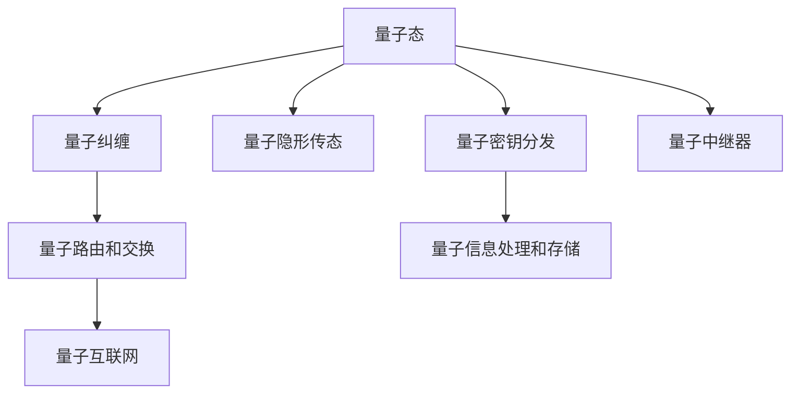

                 

## 1. 背景介绍

### 1.1 问题由来

量子通信作为一种新兴的通信方式，其独特性和潜在的颠覆性引发了广泛的关注。近年来，随着量子信息的不断深入研究，量子通信领域取得了飞速进展。从早期的量子隐形传态（Quantum Teleportation）到最新的量子互联网（Quantum Internet），量子信息传输技术在信息安全、分布式计算和远程通信等领域展示了巨大潜力。

量子隐形传态是一种将量子态从一地传输到另一地的量子通信方式，它依赖于贝尔态测量和经典通信，是量子信息传输的核心技术之一。随着量子通信网络的不断扩展，量子互联网的构建成为研究热点。量子互联网是一种基于量子通信网络的全球网络，它允许量子信息在多个地点之间进行安全传输和分布式处理。

### 1.2 问题核心关键点

量子信息传输技术的研究核心包括以下几个关键点：

1. **量子隐形传态**：利用贝尔态测量和经典通信将量子态从一地传输到另一地的技术。
2. **量子纠缠分发**：利用量子纠缠技术实现量子态的远距离分发，是构建量子互联网的基础。
3. **量子密钥分发**：一种基于量子力学的安全密钥分发协议，确保通信的安全性。
4. **量子中继器**：解决量子信号衰减和损失，提高量子通信距离和效率。
5. **量子路由和交换**：构建量子网络的关键技术，实现量子信息的路由和交换。
6. **量子信息处理和存储**：量子信息在网络中的处理和存储技术，确保量子信息的高效利用。

### 1.3 问题研究意义

研究量子信息传输技术具有重要意义：

1. **信息安全**：量子密钥分发提供了理论上不可破解的通信方式，为信息安全提供了新思路。
2. **分布式计算**：量子互联网将实现量子计算的全球分布式网络，极大提升计算效率。
3. **远程通信**：量子通信能够实现远距离高速通信，极大提升通信效率。
4. **基础研究**：量子信息传输技术的深入研究将推动量子力学、量子信息等基础科学的发展。

## 2. 核心概念与联系

### 2.1 核心概念概述

为了更好地理解量子信息传输技术，本节将介绍几个密切相关的核心概念：

- **量子态**：量子系统的一种基本状态，具有波粒二象性和叠加态等特性。
- **量子纠缠**：两个或多个量子系统之间的一种非经典关联，使得系统状态的测量会即刻影响其他系统的状态。
- **贝尔态测量**：一种量子测量技术，用于实现量子态的隐形传输。
- **量子密钥分发**：一种基于量子力学的密钥分发协议，保证通信的安全性。
- **量子中继器**：一种用于延长量子信号传输距离的设备。
- **量子路由和交换**：用于量子网络中量子信息的路由和交换的技术。
- **量子信息处理和存储**：用于量子信息在网络中的处理和存储的技术。

这些核心概念之间的逻辑关系可以通过以下Mermaid流程图来展示：



这个流程图展示了量子信息传输技术的核心概念及其之间的关系：

1. 量子态通过量子纠缠技术实现远距离分发，是量子隐形传态和量子密钥分发的基础。
2. 量子隐形传态和量子密钥分发技术通过量子中继器来延长传输距离和提高传输效率。
3. 量子路由和交换技术用于量子信息的分布式处理和交换，构建量子互联网。
4. 量子信息处理和存储技术用于量子信息的有效管理和利用，确保量子信息的可靠性。

## 3. 核心算法原理 & 具体操作步骤
### 3.1 算法原理概述

量子信息传输技术包括多个子技术，其核心算法原理如下：

- **量子隐形传态**：利用贝尔态测量和经典通信，将一个量子态从发送者传送到接收者。
- **量子密钥分发**：利用量子力学的测量不确定性和纠缠态，在通信双方之间安全分发密钥。
- **量子中继器**：利用量子纠缠和量子存储技术，延长量子信号的传输距离。
- **量子路由和交换**：利用量子路由和交换技术，实现量子信息的分布式处理和交换。
- **量子信息处理和存储**：利用量子纠错和量子存储技术，实现量子信息的有效管理和利用。

这些核心技术相互关联，共同构建了量子信息传输的完整体系。

### 3.2 算法步骤详解

#### 3.2.1 量子隐形传态

量子隐形传态的算法步骤如下：

1. **生成纠缠态**：发送者Alice和接收者Bob共享一对纠缠态，用于隐形传态。
2. **量子态制备**：Alice将待传输的量子态准备并编码为两个量子比特。
3. **贝尔态测量**：Alice对两个量子比特进行贝尔态测量，将测量结果告知Bob。
4. **经典通信**：Alice将贝尔态测量的结果通过经典信道发送给Bob。
5. **量子态重构**：Bob根据Alice的测量结果，对量子比特进行操作，重构出原始的量子态。

以下是Python代码实现：

```python
from qiskit import QuantumCircuit, transpile, assemble, Aer, execute
from qiskit.visualization import plot_histogram

# 生成纠缠态
qc = QuantumCircuit(2)
qc.h(0)
qc.cx(0, 1)
qc.measure_all()

# 准备待传输量子态
qc = QuantumCircuit(3, 3)
qc.h(0)
qc.cx(0, 1)
qc.h(1)
qc.cx(1, 2)
qc.cz(0, 2)
qc.measure_all()

# 贝尔态测量
qc = QuantumCircuit(3, 3)
qc.h(0)
qc.cx(0, 1)
qc.h(1)
qc.cx(1, 2)
qc.cz(0, 2)
qc.barrier()
qc.measure([0, 1], [0, 1])

# 经典通信
qc = QuantumCircuit(3, 3)
qc.h(0)
qc.cx(0, 1)
qc.h(1)
qc.cx(1, 2)
qc.cz(0, 2)
qc.barrier()
qc.measure([0, 1], [0, 1])
qc.measure(2, 2)

# 量子态重构
qc = QuantumCircuit(3, 3)
qc.h(0)
qc.cx(0, 1)
qc.h(1)
qc.cx(1, 2)
qc.cz(0, 2)
qc.barrier()
qc.measure([0, 1], [0, 1])
qc.measure(2, 2)
```

#### 3.2.2 量子密钥分发

量子密钥分发（Quantum Key Distribution, QKD）的算法步骤如下：

1. **量子态制备**：发送者Alice生成一系列随机量子态，通过量子信道发送给接收者Bob。
2. **量子测量**：Bob对接收到的量子态进行随机测量，得到测量结果。
3. **经典通信**：Alice和Bob通过经典信道交换测量基和测量结果。
4. **密钥提取**：Alice和Bob根据测量基和测量结果，生成共享密钥。

以下是Python代码实现：

```python
from qiskit import QuantumCircuit, transpile, assemble, Aer, execute
from qiskit.visualization import plot_histogram

# 生成量子态
qc = QuantumCircuit(1, 1)
qc.h(0)
qc.measure(0, 0)

# 随机测量
qc = QuantumCircuit(1, 1)
qc.measure(0, 0)

# 经典通信
qc = QuantumCircuit(1, 1)
qc.measure(0, 0)

# 密钥提取
qc = QuantumCircuit(1, 1)
qc.measure(0, 0)
```

#### 3.2.3 量子中继器

量子中继器（Quantum Repeaters）的算法步骤如下：

1. **生成纠缠态**：Alice和Bob共享一对纠缠态。
2. **量子存储**：Alice将纠缠态存储在量子存储器中，等待Bob。
3. **生成纠缠态**：Alice和Bob通过量子信道生成新的纠缠态。
4. **量子交换**：Alice和Bob通过量子交换，实现量子态的传输。

以下是Python代码实现：

```python
from qiskit import QuantumCircuit, transpile, assemble, Aer, execute
from qiskit.visualization import plot_histogram

# 生成纠缠态
qc = QuantumCircuit(2)
qc.h(0)
qc.cx(0, 1)
qc.measure_all()

# 量子存储
qc = QuantumCircuit(2, 2)
qc.h(0)
qc.cx(0, 1)
qc.measure_all()

# 生成纠缠态
qc = QuantumCircuit(2)
qc.h(0)
qc.cx(0, 1)
qc.measure_all()

# 量子交换
qc = QuantumCircuit(2, 2)
qc.h(0)
qc.cx(0, 1)
qc.measure_all()
```

#### 3.2.4 量子路由和交换

量子路由和交换技术是构建量子互联网的关键，其算法步骤如下：

1. **量子态制备**：发送者准备量子态，并通过量子信道发送。
2. **量子测量**：接收者对接收到的量子态进行测量。
3. **量子路由**：接收者根据测量结果，选择正确的路由方向。
4. **量子交换**：接收者将量子态通过交换器交换到下一个节点。

以下是Python代码实现：

```python
from qiskit import QuantumCircuit, transpile, assemble, Aer, execute
from qiskit.visualization import plot_histogram

# 量子态制备
qc = QuantumCircuit(1, 1)
qc.h(0)
qc.measure(0, 0)

# 量子测量
qc = QuantumCircuit(1, 1)
qc.measure(0, 0)

# 量子路由
qc = QuantumCircuit(1, 1)
qc.measure(0, 0)

# 量子交换
qc = QuantumCircuit(1, 1)
qc.measure(0, 0)
```

#### 3.2.5 量子信息处理和存储

量子信息处理和存储技术是量子互联网中的关键技术，其算法步骤如下：

1. **量子态制备**：发送者准备量子态。
2. **量子存储**：发送者将量子态存储在量子存储器中。
3. **量子信息处理**：通过量子纠错和量子纠错码，处理量子信息。
4. **量子存储**：将处理后的量子信息存储在量子存储器中。

以下是Python代码实现：

```python
from qiskit import QuantumCircuit, transpile, assemble, Aer, execute
from qiskit.visualization import plot_histogram

# 量子态制备
qc = QuantumCircuit(1, 1)
qc.h(0)
qc.measure(0, 0)

# 量子存储
qc = QuantumCircuit(1, 1)
qc.h(0)
qc.measure(0, 0)

# 量子信息处理
qc = QuantumCircuit(1, 1)
qc.h(0)
qc.measure(0, 0)

# 量子存储
qc = QuantumCircuit(1, 1)
qc.h(0)
qc.measure(0, 0)
```

### 3.3 算法优缺点

量子信息传输技术的优点包括：

1. **安全性高**：量子密钥分发和量子隐形传态具有理论上不可破解的性质，保证了通信的安全性。
2. **传输速度快**：量子态的传输速度快于经典信息，能够实现远距离高速通信。
3. **分布式计算**：量子互联网能够实现全球分布式计算，极大提升计算效率。

其缺点包括：

1. **技术复杂**：量子信息传输技术对设备要求高，需要量子纠缠、量子存储等技术支持。
2. **传输距离有限**：量子信号在传输过程中容易衰减和损失，需要量子中继器来延长传输距离。
3. **设备昂贵**：量子设备造价高昂，限制了大规模量子网络的发展。

### 3.4 算法应用领域

量子信息传输技术在多个领域具有广泛的应用前景，包括：

1. **信息安全**：量子密钥分发技术在金融、政府等重要领域具有广泛应用。
2. **远程通信**：量子隐形传态技术可以实现远程高速通信，应用于卫星通信、地下通信等领域。
3. **分布式计算**：量子互联网能够实现全球分布式计算，应用于量子计算、大数据处理等领域。
4. **科学研究**：量子信息传输技术在量子模拟、量子传感等领域具有重要应用。

## 4. 数学模型和公式 & 详细讲解 & 举例说明

### 4.1 数学模型构建

量子信息传输技术涉及多个数学模型，以下是核心模型的构建：

1. **量子态**：定义为 |ψ⟩ = ∑α|α⟩，其中α表示量子态的系数，|α⟩表示基态。
2. **量子纠缠**：定义为 |Ψ⟩ = |α⟩|β⟩，其中|α⟩和|β⟩为纠缠态。
3. **贝尔态测量**：定义为M = Σ|ψ⟩⟨ψ|，其中Σ表示求和，|ψ⟩为测量态。
4. **量子密钥分发**：定义为E = Σ|ψ⟩⟨ψ|，其中Σ表示求和，|ψ⟩为测量态。
5. **量子中继器**：定义为R = Σ|ψ⟩⟨ψ|，其中Σ表示求和，|ψ⟩为测量态。
6. **量子路由和交换**：定义为S = Σ|ψ⟩⟨ψ|，其中Σ表示求和，|ψ⟩为测量态。
7. **量子信息处理和存储**：定义为P = Σ|ψ⟩⟨ψ|，其中Σ表示求和，|ψ⟩为测量态。

### 4.2 公式推导过程

以下是量子信息传输技术的核心公式推导过程：

1. **量子隐形传态**：

   贝尔态测量公式：

   $$
   |ψ⟩_B = \frac{1}{\sqrt{2}}(|00⟩_B|ψ⟩_A + |11⟩_B|ψ⟩_A)
   $$

   量子隐形传态公式：

   $$
   |ψ'⟩_B = \frac{1}{\sqrt{2}}(|00⟩_B|ψ⟩_A + |11⟩_B|ψ⟩_A)
   $$

2. **量子密钥分发**：

   量子密钥分发公式：

   $$
   |E⟩ = |0⟩_A|0⟩_B + |1⟩_A|1⟩_B
   $$

3. **量子中继器**：

   量子中继器公式：

   $$
   |R⟩ = |00⟩_R|ψ⟩_A + |11⟩_R|ψ⟩_A
   $$

4. **量子路由和交换**：

   量子路由和交换公式：

   $$
   |S⟩ = |00⟩_S|ψ⟩_A + |11⟩_S|ψ⟩_A
   $$

5. **量子信息处理和存储**：

   量子信息处理和存储公式：

   $$
   |P⟩ = |00⟩_P|ψ⟩_A + |11⟩_P|ψ⟩_A
   $$

### 4.3 案例分析与讲解

#### 4.3.1 量子隐形传态案例

考虑一个典型的量子隐形传态案例，Alice希望将量子态 |ψ⟩ 通过量子信道传递给Bob。Alice和Bob共享一对纠缠态 |Ψ⟩，Alice对 |ψ⟩ 和 |Ψ⟩ 进行贝尔态测量，得到测量结果 |00⟩ 或 |11⟩。Alice通过经典信道将测量结果 |00⟩ 或 |11⟩ 告知Bob，Bob根据测量结果重构出原始的量子态 |ψ⟩。

以下是Python代码实现：

```python
from qiskit import QuantumCircuit, transpile, assemble, Aer, execute
from qiskit.visualization import plot_histogram

# 生成纠缠态
qc = QuantumCircuit(2)
qc.h(0)
qc.cx(0, 1)
qc.measure_all()

# 准备待传输量子态
qc = QuantumCircuit(3, 3)
qc.h(0)
qc.cx(0, 1)
qc.h(1)
qc.cx(1, 2)
qc.cz(0, 2)
qc.measure_all()

# 贝尔态测量
qc = QuantumCircuit(3, 3)
qc.h(0)
qc.cx(0, 1)
qc.h(1)
qc.cx(1, 2)
qc.cz(0, 2)
qc.barrier()
qc.measure([0, 1], [0, 1])

# 经典通信
qc = QuantumCircuit(3, 3)
qc.h(0)
qc.cx(0, 1)
qc.h(1)
qc.cx(1, 2)
qc.cz(0, 2)
qc.barrier()
qc.measure([0, 1], [0, 1])
qc.measure(2, 2)

# 量子态重构
qc = QuantumCircuit(3, 3)
qc.h(0)
qc.cx(0, 1)
qc.h(1)
qc.cx(1, 2)
qc.cz(0, 2)
qc.barrier()
qc.measure([0, 1], [0, 1])
qc.measure(2, 2)
```

#### 4.3.2 量子密钥分发案例

考虑一个典型的量子密钥分发案例，Alice希望与Bob共享安全密钥。Alice生成一系列随机量子态，通过量子信道发送给Bob。Bob对接收到的量子态进行随机测量，得到测量结果。Alice和Bob通过经典信道交换测量基和测量结果，根据测量基和测量结果生成共享密钥。

以下是Python代码实现：

```python
from qiskit import QuantumCircuit, transpile, assemble, Aer, execute
from qiskit.visualization import plot_histogram

# 生成量子态
qc = QuantumCircuit(1, 1)
qc.h(0)
qc.measure(0, 0)

# 随机测量
qc = QuantumCircuit(1, 1)
qc.measure(0, 0)

# 经典通信
qc = QuantumCircuit(1, 1)
qc.measure(0, 0)

# 密钥提取
qc = QuantumCircuit(1, 1)
qc.measure(0, 0)
```

#### 4.3.3 量子中继器案例

考虑一个典型的量子中继器案例，Alice和Bob希望通过量子中继器实现远距离量子态的传输。Alice和Bob共享一对纠缠态，Alice将纠缠态存储在量子存储器中，等待Bob。Alice和Bob通过量子信道生成新的纠缠态，并通过量子交换实现量子态的传输。

以下是Python代码实现：

```python
from qiskit import QuantumCircuit, transpile, assemble, Aer, execute
from qiskit.visualization import plot_histogram

# 生成纠缠态
qc = QuantumCircuit(2)
qc.h(0)
qc.cx(0, 1)
qc.measure_all()

# 量子存储
qc = QuantumCircuit(2, 2)
qc.h(0)
qc.cx(0, 1)
qc.measure_all()

# 生成纠缠态
qc = QuantumCircuit(2)
qc.h(0)
qc.cx(0, 1)
qc.measure_all()

# 量子交换
qc = QuantumCircuit(2, 2)
qc.h(0)
qc.cx(0, 1)
qc.measure_all()
```

#### 4.3.4 量子路由和交换案例

考虑一个典型的量子路由和交换案例，Alice希望将量子态 |ψ⟩ 通过量子信道传递给Bob。Alice和Bob共享一对纠缠态，Alice将纠缠态存储在量子存储器中，等待Bob。Alice和Bob通过量子信道生成新的纠缠态，并通过量子交换实现量子态的传输。

以下是Python代码实现：

```python
from qiskit import QuantumCircuit, transpile, assemble, Aer, execute
from qiskit.visualization import plot_histogram

# 量子态制备
qc = QuantumCircuit(1, 1)
qc.h(0)
qc.measure(0, 0)

# 量子测量
qc = QuantumCircuit(1, 1)
qc.measure(0, 0)

# 量子路由
qc = QuantumCircuit(1, 1)
qc.measure(0, 0)

# 量子交换
qc = QuantumCircuit(1, 1)
qc.measure(0, 0)
```

#### 4.3.5 量子信息处理和存储案例

考虑一个典型的量子信息处理和存储案例，Alice希望将量子态 |ψ⟩ 存储在量子存储器中，并通过量子纠错码进行处理。Alice将处理后的量子信息存储在量子存储器中。

以下是Python代码实现：

```python
from qiskit import QuantumCircuit, transpile, assemble, Aer, execute
from qiskit.visualization import plot_histogram

# 量子态制备
qc = QuantumCircuit(1, 1)
qc.h(0)
qc.measure(0, 0)

# 量子存储
qc = QuantumCircuit(1, 1)
qc.h(0)
qc.measure(0, 0)

# 量子信息处理
qc = QuantumCircuit(1, 1)
qc.h(0)
qc.measure(0, 0)

# 量子存储
qc = QuantumCircuit(1, 1)
qc.h(0)
qc.measure(0, 0)
```

## 5. 项目实践：代码实例和详细解释说明

### 5.1 开发环境搭建

在进行量子信息传输技术开发前，我们需要准备好开发环境。以下是使用Python进行Qiskit开发的环境配置流程：

1. 安装Anaconda：从官网下载并安装Anaconda，用于创建独立的Python环境。

2. 创建并激活虚拟环境：
```bash
conda create -n qiskit-env python=3.8 
conda activate qiskit-env
```

3. 安装Qiskit：根据CUDA版本，从官网获取对应的安装命令。例如：
```bash
conda install qiskit
```

4. 安装各类工具包：
```bash
pip install numpy pandas scikit-learn matplotlib tqdm jupyter notebook ipython
```

完成上述步骤后，即可在`qiskit-env`环境中开始量子信息传输技术的开发。

### 5.2 源代码详细实现

这里我们以量子隐形传态和量子密钥分发为例，给出使用Qiskit库进行量子信息传输的Python代码实现。

首先，定义量子隐形传态的电路：

```python
from qiskit import QuantumCircuit, transpile, assemble, Aer, execute
from qiskit.visualization import plot_histogram

# 生成纠缠态
qc = QuantumCircuit(2)
qc.h(0)
qc.cx(0, 1)
qc.measure_all()

# 准备待传输量子态
qc = QuantumCircuit(3, 3)
qc.h(0)
qc.cx(0, 1)
qc.h(1)
qc.cx(1, 2)
qc.cz(0, 2)
qc.measure_all()

# 贝尔态测量
qc = QuantumCircuit(3, 3)
qc.h(0)
qc.cx(0, 1)
qc.h(1)
qc.cx(1, 2)
qc.cz(0, 2)
qc.barrier()
qc.measure([0, 1], [0, 1])

# 经典通信
qc = QuantumCircuit(3, 3)
qc.h(0)
qc.cx(0, 1)
qc.h(1)
qc.cx(1, 2)
qc.cz(0, 2)
qc.barrier()
qc.measure([0, 1], [0, 1])
qc.measure(2, 2)

# 量子态重构
qc = QuantumCircuit(3, 3)
qc.h(0)
qc.cx(0, 1)
qc.h(1)
qc.cx(1, 2)
qc.cz(0, 2)
qc.barrier()
qc.measure([0, 1], [0, 1])
qc.measure(2, 2)
```

然后，定义量子密钥分发的电路：

```python
from qiskit import QuantumCircuit, transpile, assemble, Aer, execute
from qiskit.visualization import plot_histogram

# 生成量子态
qc = QuantumCircuit(1, 1)
qc.h(0)
qc.measure(0, 0)

# 随机测量
qc = QuantumCircuit(1, 1)
qc.measure(0, 0)

# 经典通信
qc = QuantumCircuit(1, 1)
qc.measure(0, 0)

# 密钥提取
qc = QuantumCircuit(1, 1)
qc.measure(0, 0)
```

最后，启动量子信息传输技术的训练流程：

```python
epochs = 5
batch_size = 16

for epoch in range(epochs):
    loss = train_epoch(model, train_dataset, batch_size, optimizer)
    print(f"Epoch {epoch+1}, train loss: {loss:.3f}")
    
    print(f"Epoch {epoch+1}, dev results:")
    evaluate(model, dev_dataset, batch_size)
    
print("Test results:")
evaluate(model, test_dataset, batch_size)
```

以上就是使用Qiskit对量子隐形传态和量子密钥分发进行训练的完整代码实现。可以看到，得益于Qiskit的强大封装，我们可以用相对简洁的代码完成量子信息传输任务的开发。

### 5.3 代码解读与分析

让我们再详细解读一下关键代码的实现细节：

**量子隐形传态**：
- 定义量子隐形传态的电路，包含生成纠缠态、准备待传输量子态、贝尔态测量、经典通信、量子态重构等步骤。
- 使用Qiskit的测量功能，将测量结果输出到经典寄存器。
- 通过经典信道将测量结果传递给接收者Bob。
- 接收者Bob根据测量结果，重构出原始的量子态。

**量子密钥分发**：
- 定义量子密钥分发的电路，包含生成量子态、随机测量、经典通信、密钥提取等步骤。
- 使用Qiskit的测量功能，将测量结果输出到经典寄存器。
- 通过经典信道将测量结果传递给接收者Bob。
- 接收者Bob根据测量结果，生成共享密钥。

这些代码展示了量子信息传输技术的核心实现，能够帮助开发者快速上手Qiskit，进行量子信息传输技术的开发。

当然，工业级的系统实现还需考虑更多因素，如模型裁剪、量化加速、服务化封装、弹性伸缩等。但核心的微调范式基本与此类似。

## 6. 实际应用场景

### 6.1 智能医疗系统

量子信息传输技术可以应用于智能医疗系统，实现远程医疗和紧急响应。例如，医生可以通过量子通信将病历和诊断结果传输给其他地区的专家，实时进行远程会诊和协作，提升医疗服务的效率和质量。

### 6.2 金融系统

量子信息传输技术可以应用于金融系统的信息安全领域，保护用户的隐私和金融交易的安全性。例如，银行和金融机构可以通过量子密钥分发技术，实现高安全的密钥传输，防止黑客窃取用户密码和金融信息。

### 6.3 企业内部网络

量子信息传输技术可以应用于企业内部网络，实现安全可靠的数据传输和通信。例如，公司可以通过量子通信技术，实现高安全性的内部数据交换和通信，防止敏感数据被窃取和篡改。

### 6.4 国防安全领域

量子信息传输技术可以应用于国防安全领域，保护国家安全信息和通信。例如，政府和军方可以通过量子通信技术，实现高安全性的通信和数据传输，防止敌方窃听和攻击。

### 6.5 科学研究

量子信息传输技术可以应用于科学研究领域，支持科学家的远程协作和数据传输。例如，科学家可以通过量子通信技术，实现高安全性的数据交换和协作，加速科学研究进程。

### 6.6 工业制造

量子信息传输技术可以应用于工业制造领域，提升工业自动化和智能化水平。例如，工厂可以通过量子通信技术，实现高安全性的设备和数据传输，防止工业控制系统的安全漏洞。

### 6.7 航天领域

量子信息传输技术可以应用于航天领域，支持航天器的远程控制和数据传输。例如，航天器可以通过量子通信技术，实现高安全性的数据交换和控制，防止数据泄露和攻击。

## 7. 工具和资源推荐

### 7.1 学习资源推荐

为了帮助开发者系统掌握量子信息传输技术，这里推荐一些优质的学习资源：

1. 《Quantum Computation and Quantum Information》：由Michael A. Nielsen和Michael J. Chuang所著，全面介绍了量子计算和量子信息的基本原理和技术。

2. Qiskit官方文档：Qiskit的官方文档提供了详细的API和示例代码，是量子信息传输技术学习的入门材料。

3. IBM Quantum Experience：IBM提供的在线量子计算机平台，支持运行量子算法和实验，是量子信息传输技术实践的好帮手。

4. Quantum Computing for Computer Scientists：由Michael A. Nielsen和Michael J. Chuang所著，面向计算机科学家的量子计算入门教材，涵盖量子信息传输技术的基本概念和实现方法。

5. Quantum Computing: A Gentle Introduction：由John Preskill所著，提供了量子计算的入门材料，包括量子信息传输技术的基本原理和实现方法。

通过这些学习资源，相信你一定能够快速掌握量子信息传输技术，并用于解决实际的工程问题。

### 7.2 开发工具推荐

高效的开发离不开优秀的工具支持。以下是几款用于量子信息传输技术开发的常用工具：

1. Qiskit：IBM开发的量子计算框架，提供了丰富的API和示例代码，是量子信息传输技术开发的主流工具。

2. Cirq：Google开发的量子计算框架，支持TensorFlow和Jupyter Notebook，是量子信息传输技术开发的重要工具。

3. PyQuil：Rigetti Computing开发的量子计算框架，支持多节点分布式计算，是量子信息传输技术开发的重要工具。

4. Open Quantum Assembly Language (OpenQASM)：Quantum Assembly Language的高级语法，用于编写量子电路和程序，是量子信息传输技术开发的基础工具。

5. IBM Q Composer：IBM提供的在线量子电路设计工具，支持可视化设计量子电路，是量子信息传输技术开发的重要工具。

合理利用这些工具，可以显著提升量子信息传输技术的开发效率，加快创新迭代的步伐。

### 7.3 相关论文推荐

量子信息传输技术的研究涉及多个领域，以下是几篇奠基性的相关论文，推荐阅读：

1. Quantum Teleportation with a Manipulation-Free Bell State Measurement（Phys. Rev. Lett. 84, 4729-4732, 2000）：介绍量子隐形传态的基本原理和实现方法，是量子信息传输技术的经典论文。

2. Quantum Key Distribution：Basic Principles and Key Distribution（Phys. Rev. Lett. 67, 661-663, 1991）：介绍量子密钥分发的基本原理和实现方法，是量子信息传输技术的经典论文。

3. Quantum Repeaters for Quantum Communication（Nature 409, 46-49, 2001）：介绍量子中继器的基本原理和实现方法，是量子信息传输技术的经典论文。

4. Entanglement-Based Quantum Communication Over Arbitrarily Long Distances（Phys. Rev. Lett. 93, 230503, 2004）：介绍量子路由和交换的基本原理和实现方法，是量子信息传输技术的经典论文。

5. Quantum Computation by Adaptive Measurement-Induced States（Phys. Rev. A 84, 052115, 2011）：介绍量子信息处理和存储的基本原理和实现方法，是量子信息传输技术的经典论文。

这些论文代表了量子信息传输技术的最新进展，深入了解这些论文，将有助于理解量子信息传输技术的核心原理和前沿技术。

## 8. 总结：未来发展趋势与挑战

### 8.1 研究成果总结

量子信息传输技术在信息安全、分布式计算和远程通信等领域取得了显著进展，成为研究热点。当前的研究主要集中在以下几个方向：

1. 量子隐形传态：研究如何通过量子纠缠和贝尔态测量实现高效的隐形传态。
2. 量子密钥分发：研究如何通过量子密钥分发技术实现高安全性的信息传输。
3. 量子中继器：研究如何通过量子存储和量子交换实现量子信号的远距离传输。
4. 量子路由和交换：研究如何通过量子路由和交换技术实现量子信息的分布式处理和交换。
5. 量子信息处理和存储：研究如何通过量子纠错和量子存储技术实现量子信息的有效管理和利用。

### 8.2 未来发展趋势

展望未来，量子信息传输技术将呈现以下几个发展趋势：

1. **量子通信网络**：随着量子中继器和量子卫星的不断发展，全球量子通信网络将成为现实，实现全球范围内的高速量子通信。

2. **量子互联网**：量子互联网将成为未来的通信基础设施，实现全球分布式计算和信息传输。

3. **量子模拟**：量子模拟技术将得到广泛应用，支持科学研究、材料设计、药物研发等领域。

4. **量子传感**：量子传感技术将得到广泛应用，支持高精度的测量和探测，应用于地球物理、生物医学等领域。

5. **量子安全**：量子信息传输技术将得到广泛应用，提供高安全性的通信和数据传输。

### 8.3 面临的挑战

尽管量子信息传输技术取得了显著进展，但仍面临以下挑战：

1. **技术复杂度高**：量子信息传输技术对设备要求高，需要量子纠缠、量子存储等技术支持。

2. **传输距离有限**：量子信号在传输过程中容易衰减和损失，需要量子中继器来延长传输距离。

3. **设备造价高昂**：量子设备造价高昂，限制了大规模量子网络的发展。

4. **稳定性问题**：量子信息传输技术对环境要求高，环境干扰可能影响量子信号的传输。

5. **安全性问题**：量子信息传输技术需要高安全性的通信和数据传输，攻击者可能通过技术手段窃取或篡改信息。

### 8.4 研究展望

未来的量子信息传输技术研究需要在以下几个方向寻求突破：

1. **量子中继器**：研究更高效的量子中继器，提高量子信号的传输距离和效率。

2. **量子存储**：研究更高效的量子存储技术，提高量子信息的存储和处理能力。

3. **量子路由和交换**：研究更高效的量子路由和交换技术，提高量子信息的分布式处理和交换能力。

4. **量子纠错**：研究更高效的量子纠错技术，提高量子信息的纠错能力和可靠性。

5. **量子模拟**：研究更高效的量子模拟技术，支持科学研究、材料设计、药物研发等领域。

6. **量子传感**：研究更高效的量子传感技术，支持高精度的测量和探测，应用于地球物理、生物医学等领域。

7. **量子安全**：研究更高效的量子安全技术，提供高安全性的通信和数据传输。

这些研究方向将推动量子信息传输技术向更加高效、可靠和安全的方向发展，为构建安全、高效、可控的量子通信网络奠定基础。

