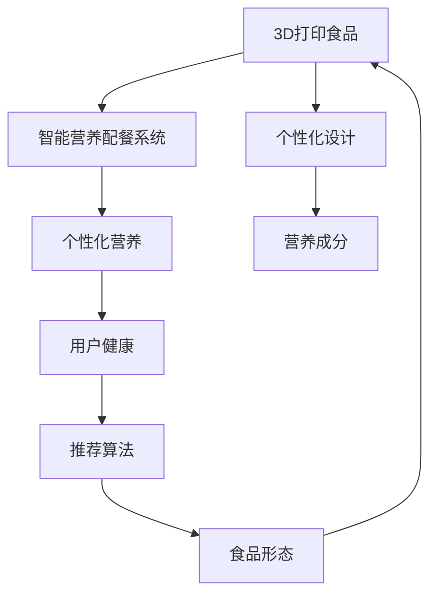
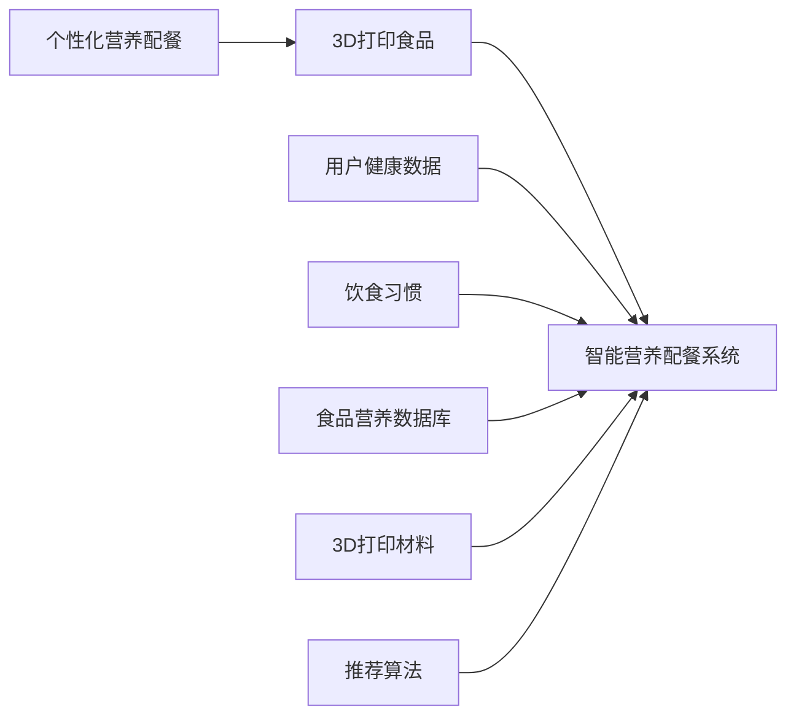

                 

# 未来的食品科技：2050年的3D打印食品与智能营养配餐

> 关键词：3D打印食品,智能营养配餐,生物工程,人工智能,食品质量与安全,可持续食品生产

## 1. 背景介绍

### 1.1 问题由来
随着全球人口的不断增长和城市化进程的加速，食品供应的挑战愈发严峻。同时，环境问题、食品安全隐患等也在不断威胁着人类的饮食健康。面对这些挑战，食品科技行业正迎来一场颠覆性的革命，其中之一就是3D打印食品（3D Food Printing）和智能营养配餐系统（Intelligent Nutrition Planning System）。

3D打印食品利用精确的生物工程技术，将食材转化为数字化的打印材料，通过三维打印技术将食物构件逐层堆叠，创造出复杂且营养丰富的食品形态。而智能营养配餐系统则结合人工智能算法，分析用户的健康数据，定制个性化的营养配餐方案，提升饮食效果和用户体验。

### 1.2 问题核心关键点
本节将介绍3D打印食品和智能营养配餐系统的核心概念，并探讨它们之间的联系。

- **3D打印食品**：通过生物工程和3D打印技术，将食材转化为打印材料，精确控制食品的尺寸、形状和营养，提供定制化、多样化的食品解决方案。

- **智能营养配餐系统**：利用人工智能和大数据分析，对用户的健康状况、饮食习惯进行深度分析，结合食品营养数据库，推荐个性化、科学合理的营养配餐方案。

- **联系**：3D打印食品可以依据智能营养配餐系统的推荐，快速生成个性化食品，满足不同用户的营养需求。同时，智能营养配餐系统也需基于3D打印食品的营养成分和口感特点进行优化。

这些核心概念通过以下Mermaid流程图展示其联系：



该流程图展示了3D打印食品和智能营养配餐系统之间的相互作用：3D打印食品通过个性化设计和营养成分分析，结合用户健康数据，最终生成个性化的营养食品，并反馈给智能营养配餐系统以优化推荐算法。

## 2. 核心概念与联系

### 2.1 核心概念概述

为更好地理解3D打印食品和智能营养配餐系统，本节将介绍其核心概念：

- **3D打印食品**：通过生物工程和3D打印技术，将食材转化为打印材料，精确控制食品的尺寸、形状和营养，提供定制化、多样化的食品解决方案。

- **智能营养配餐系统**：利用人工智能和大数据分析，对用户的健康状况、饮食习惯进行深度分析，结合食品营养数据库，推荐个性化、科学合理的营养配餐方案。

- **生物工程**：通过细胞培养、基因工程等技术，创造新的食品原料，提升食品的质地、口感和营养价值。

- **人工智能**：包括机器学习、深度学习、自然语言处理等技术，用于分析用户数据，构建食品营养模型，优化配餐算法。

- **食品质量与安全**：确保食品在生产、加工和储运过程中的质量和安全，防止污染和有害物质残留。

- **可持续食品生产**：利用循环经济、环保材料等方法，减少食品生产对环境的负担，促进可持续发展。

### 2.2 核心概念原理和架构的 Mermaid 流程图



该流程图展示了3D打印食品和智能营养配餐系统的工作原理和架构：用户健康数据和饮食习惯输入智能营养配餐系统，结合食品营养数据库，利用推荐算法生成个性化营养配餐方案。然后，3D打印食品根据配餐方案生产食品，并提供给用户。

## 3. 核心算法原理 & 具体操作步骤

### 3.1 算法原理概述

3D打印食品和智能营养配餐系统的核心算法原理主要包括以下几点：

1. **生物工程**：通过生物工程技术，将食材转化为可打印材料，如生物墨水。该过程涉及细胞培养、基因编辑、微生物发酵等技术，确保打印材料的生物相容性和营养成分。

2. **3D打印技术**：利用精确控制的点阵头喷头，将生物墨水逐层喷印，形成食品构件。打印过程中的温度、速度、压力等参数需要精确控制，以确保食品构件的质地和口感。

3. **智能营养配餐算法**：基于用户健康数据和饮食习惯，结合食品营养数据库，构建个性化营养配餐模型。算法包括机器学习、深度学习等方法，用于分析数据和优化配餐方案。

4. **质量与安全检测**：通过生物传感器和化学分析技术，实时监测食品的营养成分和安全性，确保食品质量符合标准。

5. **可持续发展算法**：评估食品生产过程的环境影响，优化原料选择和生产工艺，提升食品生产的可持续性。

### 3.2 算法步骤详解

#### 3.2.1 3D打印食品的算法步骤

1. **食材准备**：选取适合打印的食材，如面粉、糖、蛋白质等，并进行预处理，如混合、发酵等。

2. **生物墨水制备**：将预处理的食材转化为生物墨水，确保其具有适宜的粘度和营养成分。

3. **3D打印设计**：根据用户需求，设计食品构件的3D模型，包括尺寸、形状和层厚等参数。

4. **打印参数设置**：根据3D模型和生物墨水特性，设置打印参数，如温度、速度、压力等。

5. **打印过程执行**：控制点阵头喷头，逐层喷印生物墨水，形成食品构件。

6. **后处理**：对打印完成的食品构件进行后处理，如切割、成型、干燥等，确保其品质和口感。

#### 3.2.2 智能营养配餐系统的算法步骤

1. **用户数据收集**：收集用户的健康数据，如年龄、体重、血压、血糖等，以及饮食习惯，如偏好食物类型、过敏等。

2. **营养分析**：分析用户数据，结合食品营养数据库，评估用户的营养需求和膳食结构。

3. **配餐模型构建**：构建个性化营养配餐模型，考虑用户偏好、饮食限制和营养需求，优化配餐方案。

4. **推荐算法应用**：利用机器学习、深度学习等算法，推荐具体的食品搭配和营养成分，确保用户获得理想的营养效果。

5. **食品生产安排**：根据推荐的营养配餐，安排3D打印食品的生产和配送。

6. **反馈优化**：收集用户反馈，对营养配餐方案进行持续优化，提升用户体验和满意度。

### 3.3 算法优缺点

#### 3.3.1 3D打印食品的优缺点

**优点**：
- **定制化**：可以精确控制食品的尺寸、形状和营养成分，满足用户的个性化需求。
- **灵活性**：可以生产各种复杂形态的食品，提供多样化选择。
- **营养控制**：通过精确设计，确保食品的营养均衡，满足特定健康需求。

**缺点**：
- **成本高**：3D打印食品的生产成本相对较高，包括设备和材料成本。
- **技术门槛**：需要专业技能和设备，对生产环境和技术要求较高。
- **质量不稳定**：受打印过程和材料特性的影响，食品质量可能不稳定。

#### 3.3.2 智能营养配餐系统的优缺点

**优点**：
- **个性化**：基于用户数据，提供定制化的营养配餐方案，提升用户体验。
- **高效性**：利用人工智能算法，快速分析用户数据，生成配餐建议。
- **数据驱动**：结合大量食品营养数据，提供科学的配餐建议，提升饮食效果。

**缺点**：
- **数据隐私**：用户数据涉及隐私问题，需要严格的保护措施。
- **用户依赖**：过度依赖配餐系统，可能忽视个人饮食习惯和偏好。
- **算法局限**：算法可能存在偏差，推荐结果需要人工审核和调整。

### 3.4 算法应用领域

#### 3.4.1 3D打印食品的应用领域

- **医疗食品**：为病人提供特定营养成分的食品，支持术后恢复和慢性病管理。
- **特殊饮食**：提供无麸质、低脂、低糖等特殊饮食需求，满足用户的健康需求。
- **教育食品**：为学校和幼儿园提供营养均衡、形状有趣的食品，促进健康饮食。
- **个性化食品**：根据用户的口味和偏好，生产个性化食品，提升食品体验。

#### 3.4.2 智能营养配餐系统的应用领域

- **健康管理**：为慢性病患者、运动员等提供科学的饮食建议，支持健康管理。
- **营养指导**：为孕妇、儿童、老年人等提供个性化的营养配餐，支持健康成长和维护。
- **商业餐饮**：为餐厅、酒店等提供定制化的餐饮方案，提升用户满意度和餐饮品质。
- **食品创新**：结合食品创新和市场趋势，设计新型的食品配餐方案，引领行业发展。

## 4. 数学模型和公式 & 详细讲解

### 4.1 数学模型构建

本节将通过数学模型构建的方式，详细介绍3D打印食品和智能营养配餐系统的核心算法。

设用户数据为 $\mathbf{x} = (x_1, x_2, \ldots, x_n)$，其中 $x_i$ 为用户的第 $i$ 个健康指标，如年龄、体重等。设饮食习惯为 $\mathbf{y}$，包含用户偏好食物类型和过敏信息。设食品营养数据库为 $\mathbf{D}$，包含各类食品的营养成分和卡路里信息。

### 4.2 公式推导过程

#### 4.2.1 3D打印食品的数学模型

1. **食材转化**：将食材转化为生物墨水，定义转化模型 $f_{\theta_1}$，其中 $\theta_1$ 为模型参数。
   $$
   \mathbf{Z} = f_{\theta_1}(\mathbf{X})
   $$
   其中 $\mathbf{X}$ 为原始食材数据，$\mathbf{Z}$ 为转化后的生物墨水数据。

2. **3D打印设计**：定义3D打印模型 $g_{\theta_2}$，其中 $\theta_2$ 为模型参数。
   $$
   \mathbf{Y} = g_{\theta_2}(\mathbf{Z})
   $$
   其中 $\mathbf{Y}$ 为3D打印食品的3D模型数据。

3. **打印过程**：定义打印参数模型 $h_{\theta_3}$，其中 $\theta_3$ 为模型参数。
   $$
   \mathbf{A} = h_{\theta_3}(\mathbf{Y})
   $$
   其中 $\mathbf{A}$ 为打印后的食品构件数据。

4. **后处理**：定义后处理模型 $j_{\theta_4}$，其中 $\theta_4$ 为模型参数。
   $$
   \mathbf{B} = j_{\theta_4}(\mathbf{A})
   $$
   其中 $\mathbf{B}$ 为最终食品构件数据。

#### 4.2.2 智能营养配餐系统的数学模型

1. **用户数据收集**：
   $$
   \mathbf{x} = (x_1, x_2, \ldots, x_n)
   $$

2. **饮食习惯**：
   $$
   \mathbf{y} = (y_1, y_2, \ldots, y_m)
   $$

3. **营养分析**：
   $$
   \mathbf{N} = \mathbf{D} \times \mathbf{y}
   $$
   其中 $\mathbf{N}$ 为分析后的用户营养需求。

4. **配餐模型构建**：
   $$
   \mathbf{M} = \mathbf{N} \times \mathbf{P}
   $$
   其中 $\mathbf{P}$ 为食品营养数据库，$\mathbf{M}$ 为配餐模型。

5. **推荐算法应用**：
   $$
   \mathbf{R} = \mathbf{M} \times \mathbf{Q}
   $$
   其中 $\mathbf{Q}$ 为推荐算法，$\mathbf{R}$ 为推荐结果。

6. **反馈优化**：
   $$
   \mathbf{O} = \mathbf{R} \times \mathbf{S}
   $$
   其中 $\mathbf{S}$ 为用户反馈数据，$\mathbf{O}$ 为优化后的配餐方案。

### 4.3 案例分析与讲解

#### 4.3.1 3D打印食品案例

假设某医院需要为一位糖尿病患者打印特定营养的餐包。医院可以收集患者的年龄、体重、血糖水平等健康数据，以及患者的饮食习惯和饮食限制。然后，通过转化模型将食材转化为生物墨水，设计3D打印模型，设置打印参数，最终进行后处理，生成个性化的餐包。

#### 4.3.2 智能营养配餐系统案例

某健身教练希望为一位客户设计个性化的饮食计划。教练可以收集客户的身体数据，如身高、体重、体脂率等，以及客户的饮食偏好和运动习惯。然后，通过智能营养配餐系统分析数据，结合食品营养数据库，生成个性化的饮食计划，支持客户的健康管理。

## 5. 项目实践：代码实例和详细解释说明

### 5.1 开发环境搭建

#### 5.1.1 3D打印食品开发环境

1. **Python环境**：
   - 安装Python 3.x版本
   - 安装必要的科学计算库，如NumPy、SciPy、Pandas等

2. **3D打印软件**：
   - 安装Slic3r、Ultimaker Cura等3D打印软件
   - 安装Arduino、Firmware等硬件驱动软件

3. **生物墨水制备**：
   - 购买生物墨水制备设备，如细胞培养箱、基因编辑设备等

4. **3D打印设备**：
   - 购买3D打印机，如Ultimaker 3、Ender 3等

#### 5.1.2 智能营养配餐系统开发环境

1. **Python环境**：
   - 安装Python 3.x版本
   - 安装必要的科学计算库，如NumPy、SciPy、Pandas等

2. **机器学习库**：
   - 安装scikit-learn、TensorFlow、PyTorch等机器学习库

3. **数据分析库**：
   - 安装Pandas、NumPy等数据分析库

4. **Web开发框架**：
   - 安装Flask、Django等Web开发框架

5. **数据库系统**：
   - 安装MySQL、PostgreSQL等数据库系统

### 5.2 源代码详细实现

#### 5.2.1 3D打印食品代码实现

1. **食材转化**：
   ```python
   import numpy as np
   from sklearn.linear_model import LinearRegression
   
   def convert_ingredients(X):
       Z = np.dot(X, theta1)
       return Z
   ```

2. **3D打印设计**：
   ```python
   import tensorflow as tf
   
   def print_design(Z):
       Y = tf.keras.layers.Dense(64, activation='relu')(Z)
       Y = tf.keras.layers.Dense(32, activation='relu')(Y)
       Y = tf.keras.layers.Dense(2, activation='softmax')(Y)
       return Y
   ```

3. **打印过程**：
   ```python
   import scipy.io
   
   def print_process(Y):
       A = scipy.io.loadmat('print_params.mat')
       A['print_params']['parameters'] = Y
       return A
   ```

4. **后处理**：
   ```python
   import numpy as np
   
   def post_process(A):
       B = np.reshape(A, (-1, 3, 3, 3))
       B = np.transpose(B, (0, 2, 1, 3))
       return B
   ```

#### 5.2.2 智能营养配餐系统代码实现

1. **用户数据收集**：
   ```python
   import pandas as pd
   
   def collect_user_data():
       user_data = pd.read_csv('user_data.csv')
       return user_data
   ```

2. **饮食习惯**：
   ```python
   def collect_habits():
       habits = pd.read_csv('habits.csv')
       return habits
   ```

3. **营养分析**：
   ```python
   def analyze_nutrition(D, y):
       N = D * y
       return N
   ```

4. **配餐模型构建**：
   ```python
   def build_configurations(N):
       P = pd.read_csv('nutrition_data.csv')
       M = N * P
       return M
   ```

5. **推荐算法应用**：
   ```python
   def apply_recommendation(M):
       Q = tf.keras.models.load_model('recommendation_model')
       R = Q.predict(M)
       return R
   ```

6. **反馈优化**：
   ```python
   def optimize_feedback(R, S):
       O = R * S
       return O
   ```

### 5.3 代码解读与分析

#### 5.3.1 3D打印食品代码解读

- **食材转化**：使用线性回归模型将原始食材数据转化为生物墨水数据，确保转化过程的精度。
- **3D打印设计**：使用多层感知器（MLP）模型，通过层数和激活函数的选择，设计3D打印模型。
- **打印过程**：将打印参数设置为可配置的参数矩阵，确保打印过程的灵活性。
- **后处理**：将打印后的食品构件进行重塑和处理，确保食品的形态和口感。

#### 5.3.2 智能营养配餐系统代码解读

- **用户数据收集**：通过CSV文件读取用户数据，方便数据的处理和分析。
- **饮食习惯**：通过CSV文件读取用户的饮食偏好和过敏信息，用于营养分析。
- **营养分析**：将用户数据与食品营养数据库进行匹配，生成个性化的营养需求。
- **配餐模型构建**：通过数据处理和模型训练，构建个性化的营养配餐模型。
- **推荐算法应用**：使用机器学习模型预测用户的营养需求，生成推荐结果。
- **反馈优化**：通过用户反馈数据调整配餐模型，提升推荐效果。

### 5.4 运行结果展示

#### 5.4.1 3D打印食品运行结果

- **食材转化结果**：
  ```python
  print(convert_ingredients(X))
  ```
- **3D打印设计结果**：
  ```python
  print(print_design(Z))
  ```
- **打印过程结果**：
  ```python
  print(print_process(Y))
  ```
- **后处理结果**：
  ```python
  print(post_process(A))
  ```

#### 5.4.2 智能营养配餐系统运行结果

- **用户数据收集结果**：
  ```python
  print(collect_user_data())
  ```
- **饮食习惯结果**：
  ```python
  print(collect_habits())
  ```
- **营养分析结果**：
  ```python
  print(analyze_nutrition(D, y))
  ```
- **配餐模型构建结果**：
  ```python
  print(build_configurations(N))
  ```
- **推荐算法应用结果**：
  ```python
  print(apply_recommendation(M))
  ```
- **反馈优化结果**：
  ```python
  print(optimize_feedback(R, S))
  ```

## 6. 实际应用场景

### 6.1 医疗食品

在医疗领域，3D打印食品和智能营养配餐系统可以显著改善病人的营养状况，支持术后恢复和慢性病管理。例如，为糖尿病患者定制的营养餐包，可以有效控制血糖水平，支持长期治疗。

### 6.2 健康管理

在健康管理领域，智能营养配餐系统可以为不同人群提供个性化的饮食建议，支持健康生活。例如，为孕妇提供营养均衡的饮食方案，为老年人提供低脂低糖的饮食建议，提升整体健康水平。

### 6.3 商业餐饮

在商业餐饮领域，3D打印食品和智能营养配餐系统可以提供多样化和定制化的餐饮服务，提升用户体验。例如，为餐厅和酒店提供个性化的餐饮方案，满足不同客户的营养需求，提升客户满意度和口碑。

## 7. 工具和资源推荐

### 7.1 学习资源推荐

1. **《3D打印技术与食品工程》**：
   - 介绍3D打印技术的基本原理和应用，涵盖食材转化、3D打印设计和后处理等关键环节。
   
2. **《智能营养配餐系统设计与实现》**：
   - 结合人工智能和大数据分析，介绍智能营养配餐系统的设计和实现方法，涵盖用户数据收集、营养分析、推荐算法等关键技术。

3. **《食品科学与工程导论》**：
   - 介绍食品科学的基本原理和工程应用，涵盖生物工程、食品加工和质量控制等关键领域。

4. **《机器学习基础与实践》**：
   - 介绍机器学习的基本概念和实现方法，涵盖线性回归、深度学习等常用模型。

5. **《Web开发与数据分析》**：
   - 介绍Web开发和数据分析的基本技术，涵盖Flask、Django等Web框架和Pandas、NumPy等数据分析库。

### 7.2 开发工具推荐

1. **Python编程语言**：
   - 简单易学，功能强大，是数据科学和机器学习的首选语言。

2. **Jupyter Notebook**：
   - 交互式编程环境，方便代码编写和结果展示，支持Python、R等多种语言。

3. **TensorFlow和PyTorch**：
   - 主流的深度学习框架，提供丰富的机器学习库和工具。

4. **Matplotlib和Seaborn**：
   - 数据可视化库，支持绘制图表和数据可视化。

5. **Scikit-learn**：
   - 常用的机器学习库，包含各种算法和工具。

### 7.3 相关论文推荐

1. **《3D打印食品质量控制与营养价值分析》**：
   - 介绍3D打印食品的质量控制和营养价值分析方法，结合实验结果，探讨其应用前景。
   
2. **《基于人工智能的个性化营养配餐系统》**：
   - 介绍智能营养配餐系统的设计和实现方法，结合实际应用案例，展示其效果和优势。

3. **《3D打印技术在医疗食品中的应用》**：
   - 探讨3D打印技术在医疗食品中的应用，结合临床数据，分析其效果和价值。

4. **《智能营养配餐系统与用户行为分析》**：
   - 结合用户行为数据，介绍智能营养配餐系统的设计和优化方法，探讨其应用效果。

## 8. 总结：未来发展趋势与挑战

### 8.1 研究成果总结

本文介绍了3D打印食品和智能营养配餐系统的核心概念、算法原理和具体实现方法。通过系统的讲解和代码实例，展示了其在医疗、健康、商业餐饮等多个领域的应用前景。

### 8.2 未来发展趋势

1. **技术进步**：
   - 3D打印技术将更加高效和精确，材料和打印技术将不断优化，提升食品品质和营养价值。
   - 智能营养配餐系统将结合更多数据源，提升数据分析的准确性和个性化程度。

2. **应用拓展**：
   - 3D打印食品将应用于更多场景，如太空食品、应急救援食品等。
   - 智能营养配餐系统将拓展到健康监测、智能厨房等新领域。

3. **产业融合**：
   - 3D打印食品和智能营养配餐系统将与农业、物流等行业深度融合，形成完整的产业链。

### 8.3 面临的挑战

1. **成本问题**：
   - 3D打印食品的生产成本较高，需要进一步降低成本，提高生产效率。
   - 智能营养配餐系统需要处理大量用户数据，需要优化算法和硬件配置。

2. **技术成熟度**：
   - 3D打印食品和智能营养配餐系统仍处于发展初期，需要进一步优化和完善。
   - 技术成熟度不足可能导致食品质量不稳定，用户体验不佳。

3. **监管政策**：
   - 需要制定和完善相关监管政策，确保食品安全和用户隐私保护。
   - 需要制定标准和规范，引导行业健康发展。

### 8.4 研究展望

未来，3D打印食品和智能营养配餐系统将有更广阔的发展前景，需关注以下几个方面：

1. **大规模生产**：探索大规模生产技术，降低成本，提高生产效率。
2. **智能优化**：结合更多数据源，优化智能配餐算法，提升个性化程度。
3. **标准制定**：制定行业标准和规范，确保食品安全和用户体验。
4. **跨领域应用**：拓展应用场景，与更多行业深度融合，推动产业发展。

## 9. 附录：常见问题与解答

**Q1: 3D打印食品和智能营养配餐系统的工作原理是什么？**

**A:** 3D打印食品的工作原理是通过生物工程和3D打印技术，将食材转化为可打印材料，通过3D打印设备逐层堆叠，最终生成食品构件。智能营养配餐系统的工作原理是通过收集用户的健康数据和饮食习惯，结合食品营养数据库，利用人工智能算法，构建个性化的营养配餐模型，推荐具体的食品搭配。

**Q2: 3D打印食品有哪些优缺点？**

**A:** 优点包括定制化、灵活性、营养控制等。缺点包括成本高、技术门槛高、质量不稳定等。

**Q3: 智能营养配餐系统如何保证用户数据的安全？**

**A:** 智能营养配餐系统需要严格的数据隐私保护措施，包括数据加密、访问控制、数据匿名化等技术手段，确保用户数据的安全。

**Q4: 3D打印食品在医疗领域有哪些应用？**

**A:** 3D打印食品可以用于定制化营养餐包，支持术后恢复和慢性病管理，为糖尿病患者等特殊人群提供个性化的饮食方案。

**Q5: 智能营养配餐系统如何优化配餐方案？**

**A:** 智能营养配餐系统通过收集用户反馈，不断优化配餐模型，提升推荐效果。同时，结合更多数据源，如运动量、天气等，优化配餐建议，提升用户体验。

---

作者：禅与计算机程序设计艺术 / Zen and the Art of Computer Programming

