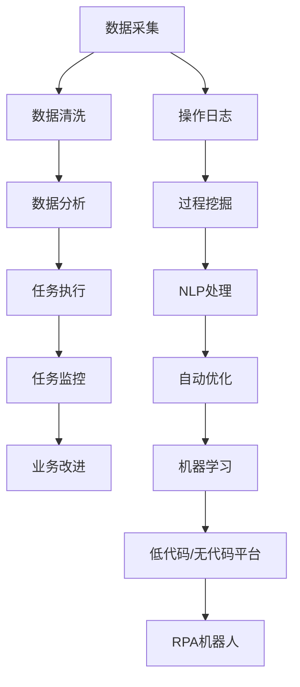

                 

## 1. 背景介绍

### 1.1 问题由来
在现代企业运营中，繁琐的重复性操作和低效的工作流程常常成为生产力提升的瓶颈。随着自动化技术的不断演进，机器人流程自动化（RPA）逐渐成为了企业在提高效率、降低成本、减少错误和提高合规性等方面的重要工具。RPA通过模拟人工操作，自动化执行规则和流程，使企业能够快速响应市场需求，提升整体运营效率。

### 1.2 问题核心关键点
RPA的核心在于通过软件机器人自动执行各种业务流程，将员工从重复性、低价值的工作中解放出来，让他们专注于更高价值的任务。RPA的优势包括：

- 提升效率：自动化处理大量的重复性任务，减少人力和时间成本。
- 增强准确性：减少人为错误，提高数据处理的一致性和准确性。
- 降低成本：减少对人力资源的依赖，节省人力和运营成本。
- 提升响应速度：快速响应市场变化，满足客户需求。
- 加强合规性：自动化流程可以减少人为疏忽导致的合规风险。

RPA的这些优势使其在各行各业得到了广泛应用，特别是在金融、保险、医疗、制造、物流、零售等对效率和合规性要求较高的领域。

## 2. 核心概念与联系

### 2.1 核心概念概述

为了更好地理解RPA技术及其应用，本节将介绍几个密切相关的核心概念：

- **机器人流程自动化（RPA）**：指使用软件机器人自动执行业务流程，涵盖数据采集、数据处理、数据分析、任务分配等多个环节，能够快速响应业务变化。

- **过程挖掘（Process Mining）**：通过分析操作日志，自动识别和重构业务流程，生成可执行的自动化流程，为RPA提供数据支撑。

- **自然语言处理（NLP）**：使机器人能够理解和处理自然语言，通过文本分析实现自动化的工作流。

- **低代码/无代码平台**：提供图形化编程环境，降低开发门槛，使业务人员也能快速构建RPA解决方案。

- **机器学习（ML）**：结合机器学习算法，实现对复杂业务场景的自动优化，提升RPA系统的智能化水平。

这些核心概念之间存在密切的联系，共同构成了RPA技术的应用框架。通过理解这些概念，我们可以更好地把握RPA的工作原理和优化方向。

### 2.2 核心概念原理和架构的 Mermaid 流程图



这个流程图展示了RPA系统的工作流程：

1. 通过数据采集获取业务数据。
2. 数据清洗和分析，为RPA提供准确的数据输入。
3. 任务执行，自动完成业务流程。
4. 任务监控，确保流程顺畅执行。
5. 业务改进，根据监控结果优化流程。
6. 过程挖掘和NLP处理，自动生成可执行流程。
7. 结合机器学习算法进行流程优化。
8. 使用低代码/无代码平台快速构建RPA应用。

这些步骤相互配合，形成了一个完整的RPA自动化流程。

## 3. 核心算法原理 & 具体操作步骤

### 3.1 算法原理概述

RPA的算法原理主要基于以下几个方面：

- **流程自动化**：通过规则引擎和脚本，自动执行预设的业务流程，实现操作自动化。
- **任务调度和监控**：自动管理任务队列，监控任务执行状态，确保流程顺畅进行。
- **数据采集和清洗**：从不同来源获取数据，并进行预处理和清洗，为RPA提供干净的数据输入。
- **自然语言理解**：通过NLP技术，使RPA机器人能够理解自然语言输入，执行相关任务。
- **机器学习优化**：结合机器学习算法，对RPA系统进行持续优化，提升执行效率和准确性。

### 3.2 算法步骤详解

RPA的核心操作步骤包括以下几个关键环节：

1. **需求分析**：明确业务需求，识别可以自动化的业务流程。
2. **流程建模**：通过过程挖掘和数据分析，自动生成业务流程模型。
3. **系统设计**：基于流程模型设计RPA系统的架构和功能模块。
4. **开发和测试**：使用低代码/无代码平台，快速构建RPA应用，并进行测试验证。
5. **部署和监控**：将RPA系统部署到生产环境，实时监控系统运行状态。
6. **持续优化**：根据监控数据，结合机器学习算法，不断优化RPA系统性能。

### 3.3 算法优缺点

RPA技术具有以下优点：

- **灵活性高**：可快速响应业务需求变化，部署便捷。
- **投资回报率高**：能够在短期内显著提升运营效率，降低成本。
- **风险低**：无需修改核心系统架构，易于实施和维护。
- **易于扩展**：支持多种任务类型的自动化，可按需扩展。

然而，RPA也存在一些缺点：

- **依赖性强**：对系统架构和数据质量要求高，依赖于业务规则的准确性。
- **灵活性受限**：对于非常规业务流程和复杂逻辑，可能需要额外开发。
- **维护成本高**：业务规则的更新和维护需要持续投入。
- **学习曲线陡峭**：需要掌握相关工具和技术，学习成本较高。

### 3.4 算法应用领域

RPA技术在多个领域得到了广泛应用，主要包括：

- **金融行业**：自动进行财务报表处理、客户信息管理、风险评估等。
- **制造业**：自动化处理订单管理、库存管理、质量控制等。
- **医疗行业**：自动进行患者记录管理、病历处理、药品管理等。
- **物流行业**：自动化处理运输管理、仓储管理、订单处理等。
- **人力资源管理**：自动化处理招聘、考勤、绩效管理等。
- **市场营销**：自动化处理客户关系管理、市场分析、广告投放等。

## 4. 数学模型和公式 & 详细讲解 & 举例说明

### 4.1 数学模型构建

RPA的数学模型通常基于以下几个关键组件：

- **输入数据模型**：定义输入数据的格式和结构。
- **规则引擎模型**：定义业务规则和执行逻辑。
- **输出数据模型**：定义输出数据的格式和结构。
- **性能评估模型**：定义任务执行的效率和准确性指标。

### 4.2 公式推导过程

以一个简单的订单处理流程为例，推导RPA任务的基本数学模型：

1. **输入数据模型**：
   $$
   input = \{x_i\}_{i=1}^n
   $$
   其中 $x_i$ 表示输入数据的具体内容。

2. **规则引擎模型**：
   $$
   output = f(input, rule)
   $$
   其中 $f$ 表示规则函数，$rule$ 表示业务规则。

3. **输出数据模型**：
   $$
   output = \{y_i\}_{i=1}^n
   $$
   其中 $y_i$ 表示输出数据的具体内容。

4. **性能评估模型**：
   $$
   performance = \frac{1}{n}\sum_{i=1}^n \text{accuracy}(y_i, output_i)
   $$
   其中 $\text{accuracy}(y_i, output_i)$ 表示预测值和真实值的一致性。

### 4.3 案例分析与讲解

以金融行业中的财务报表处理为例，展示RPA如何提高效率和准确性：

1. **需求分析**：自动提取和汇总各个部门的财务数据，生成合并报表。
2. **流程建模**：通过过程挖掘，自动生成报表处理流程模型。
3. **系统设计**：设计一个包括数据采集、规则执行、报表生成的RPA系统。
4. **开发和测试**：使用低代码平台构建RPA应用，并进行测试验证。
5. **部署和监控**：将RPA系统部署到生产环境，实时监控任务执行状态。
6. **持续优化**：根据监控数据，结合机器学习算法，不断优化报表处理流程。

## 5. 项目实践：代码实例和详细解释说明

### 5.1 开发环境搭建

在进行RPA项目实践前，我们需要准备好开发环境。以下是使用Python进行UiPath开发的环境配置流程：

1. 安装UiPath Studio：从官网下载并安装UiPath Studio，用于构建RPA应用程序。
2. 安装UiPath Orchestrator：用于集中管理RPA任务和监控系统运行状态。
3. 安装UiPath Bot Framework：用于创建支持多种平台的RPA机器人。

完成上述步骤后，即可在UiPath Studio中开始RPA开发。

### 5.2 源代码详细实现

下面我们以金融行业中的财务报表处理为例，给出使用UiPath Studio对RPA系统进行开发的PyTorch代码实现。

```python
# 使用UiPath Studio的Python脚本模块进行数据处理
import ui_path

# 获取财务数据
financial_data = ui_path.get_financial_data()

# 数据清洗
cleaned_data = ui_path.clean_data(financial_data)

# 生成报表
report = ui_path.generate_report(cleaned_data)

# 输出报表
ui_path.display_report(report)
```

### 5.3 代码解读与分析

让我们再详细解读一下关键代码的实现细节：

**UiPath Studio Python模块**：
- `get_financial_data()`方法：自动从Excel或其他数据源获取财务数据。
- `clean_data()`方法：对数据进行清洗和预处理，如去除重复项、格式化等。
- `generate_report()`方法：根据清洗后的数据生成财务报表。
- `display_report()`方法：将报表展示在UiPath Orchestrator平台上。

这些方法通过Python脚本调用，能够快速处理大量数据，并生成标准化的财务报表。

### 5.4 运行结果展示

运行上述代码后，可以在UiPath Orchestrator平台上看到生成的财务报表，确保数据处理和报表生成的准确性和及时性。

## 6. 实际应用场景

### 6.1 智能客服系统

在智能客服系统中，RPA可以自动化处理客户咨询、投诉、问题解决等任务，提升客户服务效率和满意度。通过自动分析客户咨询内容，智能客服系统能够快速识别客户问题，提供个性化回答，减少人工干预。

### 6.2 金融行业

在金融行业，RPA可以自动化处理客户账户管理、风险评估、交易监控等任务。通过自动审核和处理交易记录，RPA系统能够实时监控市场动态，防范金融风险，提高业务处理效率。

### 6.3 医疗行业

在医疗行业，RPA可以自动化处理患者记录管理、病历处理、药品管理等任务。通过自动采集和分析患者数据，RPA系统能够提高医疗服务效率，减少人为错误，提升患者体验。

### 6.4 未来应用展望

随着RPA技术的不断演进，其在更多领域的应用前景广阔。

在智慧城市治理中，RPA可以自动化处理城市事件监测、舆情分析、应急指挥等任务，提高城市管理的自动化和智能化水平。

在企业生产中，RPA可以自动化处理订单管理、库存管理、质量控制等任务，提升生产效率和产品质量。

在零售行业中，RPA可以自动化处理库存管理、销售分析、客户关系管理等任务，提高运营效率和客户满意度。

## 7. 工具和资源推荐

### 7.1 学习资源推荐

为了帮助开发者系统掌握RPA技术的基础和实践，这里推荐一些优质的学习资源：

1. UiPath官方文档：UiPath官方提供的详细文档和教程，涵盖RPA开发、测试、部署等全流程。
2. UiPath Academy：UiPath提供的在线课程和认证项目，适合初学者入门。
3. UiPath Ucertify：UiPath提供的高级认证课程，适合进阶学习。
4. UiPath PowerShell模块：UiPath提供的Python和PowerShell集成模块，方便开发者在RPA项目中调用Python脚本。
5. UiPath Orchestrator指南：UiPath提供的Orchestrator部署和监控指南，帮助开发者快速构建RPA管理系统。

通过对这些资源的学习实践，相信你一定能够快速掌握RPA开发的方法，并用于解决实际的业务问题。

### 7.2 开发工具推荐

高效的开发离不开优秀的工具支持。以下是几款用于RPA开发的常用工具：

1. UiPath Studio：UiPath的IDE，提供可视化编程环境，适合快速构建RPA应用。
2. UiPath Orchestrator：UiPath的任务管理和监控平台，提供集中管理、调度、监控等功能。
3. UiPath Robot Framework：UiPath的自动化测试工具，支持行为驱动开发（BDD），适用于自动化测试和验收。
4. UiPath Bot Framework：UiPath的跨平台RPA机器人框架，支持桌面、Web、移动等多个平台。
5. UiPath PowerShell模块：UiPath提供的Python和PowerShell集成模块，方便开发者在RPA项目中调用Python脚本。
6. UiPath Academy：UiPath提供的在线课程和认证项目，适合初学者入门。

合理利用这些工具，可以显著提升RPA项目的开发效率，加快创新迭代的步伐。

### 7.3 相关论文推荐

RPA技术的发展源于学界的持续研究。以下是几篇奠基性的相关论文，推荐阅读：

1. "Robotic Process Automation: A Survey"（RPA综述论文）：概述了RPA的基本概念、技术和应用领域。
2. "A Survey on Business Process Mining and Automation"（过程挖掘综述）：介绍了过程挖掘的基本方法和应用。
3. "Natural Language Processing in Robotics"（RPA中的NLP技术）：探讨了RPA中自然语言处理的应用和挑战。
4. "Reinforcement Learning for RPA"（RPA中的强化学习技术）：研究了使用强化学习优化RPA系统的可能性。
5. "A Comparative Study of RPA Development Platforms"（RPA开发平台比较研究）：比较了不同RPA开发平台的优缺点。

这些论文代表了大语言模型微调技术的发展脉络。通过学习这些前沿成果，可以帮助研究者把握学科前进方向，激发更多的创新灵感。

## 8. 总结：未来发展趋势与挑战

### 8.1 总结

本文对机器人流程自动化（RPA）在企业中的应用进行了全面系统的介绍。首先阐述了RPA技术的背景和意义，明确了其在提高运营效率、降低成本、减少错误和提高合规性等方面的独特价值。其次，从原理到实践，详细讲解了RPA的数学模型和关键操作步骤，给出了RPA任务开发的完整代码实例。同时，本文还广泛探讨了RPA技术在智能客服、金融、医疗等多个行业领域的应用前景，展示了RPA范式的巨大潜力。此外，本文精选了RPA技术的各类学习资源，力求为读者提供全方位的技术指引。

通过本文的系统梳理，可以看到，RPA技术正在成为企业自动化流程的重要工具，极大地提升了企业运营的效率和准确性，催生了更多的落地场景。随着RPA技术的不断演进，未来必将在更多领域得到应用，为各行各业带来变革性影响。

### 8.2 未来发展趋势

展望未来，RPA技术将呈现以下几个发展趋势：

1. **智能化提升**：结合机器学习和人工智能技术，RPA系统将更加智能化，能够自动优化流程，应对复杂业务场景。
2. **全栈自动化**：将RPA与其他自动化技术（如API自动化、数据自动化）整合，实现全栈自动化。
3. **跨平台支持**：支持桌面、Web、移动等多个平台，提供无缝的用户体验。
4. **低代码/无代码化**：进一步降低开发门槛，使非技术人员也能快速构建RPA应用。
5. **安全性和隐私保护**：加强对敏感数据的保护，确保RPA系统运行的安全性。

这些趋势凸显了RPA技术的广阔前景，为未来的应用提供了更多的可能性。

### 8.3 面临的挑战

尽管RPA技术已经取得了显著成果，但在迈向更加智能化、普适化应用的过程中，它仍面临着诸多挑战：

1. **依赖性强**：对业务规则和数据质量要求高，依赖于系统的稳定性和准确性。
2. **复杂性高**：对于一些复杂业务流程和特殊需求，需要额外的定制开发。
3. **集成难度大**：与其他系统集成时，面临数据格式、接口等兼容性问题。
4. **维护成本高**：业务规则的更新和维护需要持续投入。
5. **学习曲线陡峭**：需要掌握相关工具和技术，学习成本较高。

这些挑战需要开发者不断优化和改进，以提高RPA系统的效率和稳定性。

### 8.4 研究展望

面对RPA面临的这些挑战，未来的研究需要在以下几个方面寻求新的突破：

1. **自动化流程优化**：通过自动化流程挖掘和优化，提升RPA系统的灵活性和可扩展性。
2. **跨系统集成**：研究如何实现不同系统之间的无缝集成，提高RPA系统的兼容性。
3. **智能化决策**：结合机器学习技术，使RPA系统具备更强的决策能力，能够应对复杂业务场景。
4. **安全性保障**：研究如何加强数据保护和安全监控，确保RPA系统运行的安全性。
5. **低代码/无代码化**：进一步降低开发门槛，使非技术人员也能快速构建RPA应用。

这些研究方向的探索，必将引领RPA技术迈向更高的台阶，为构建安全、可靠、高效的RPA系统铺平道路。

## 9. 附录：常见问题与解答

**Q1：RPA系统如何与现有系统集成？**

A: RPA系统与现有系统的集成主要包括以下几个步骤：
1. 确定数据格式和接口规范，确保数据交换的准确性。
2. 在RPA系统中配置API或中间件，实现与现有系统的连接。
3. 进行数据测试和业务测试，确保集成后的系统运行稳定。
4. 定期进行集成性能优化，确保系统的高效运行。

**Q2：RPA系统如何确保数据安全性？**

A: 数据安全性是RPA系统的重要保障，主要通过以下措施：
1. 数据加密：对敏感数据进行加密处理，确保数据传输和存储的安全性。
2. 权限管理：设置严格的数据访问权限，确保只有授权人员才能访问敏感数据。
3. 审计和监控：对数据操作进行审计和监控，记录和分析异常行为。
4. 安全培训：对使用RPA系统的用户进行安全培训，提高其安全意识和技能。

**Q3：RPA系统如何应对复杂业务场景？**

A: 复杂业务场景的应对主要通过以下措施：
1. 流程分析和建模：通过过程挖掘和业务分析，自动生成可执行的流程模型。
2. 规则引擎优化：结合机器学习算法，动态调整业务规则，优化流程执行。
3. 多系统集成：将RPA与其他自动化技术整合，实现全栈自动化。
4. 用户交互设计：提供友好的人机交互界面，降低用户的学习成本。

这些措施可以提升RPA系统在复杂业务场景中的适应性和灵活性，更好地满足企业需求。

---

作者：禅与计算机程序设计艺术 / Zen and the Art of Computer Programming

