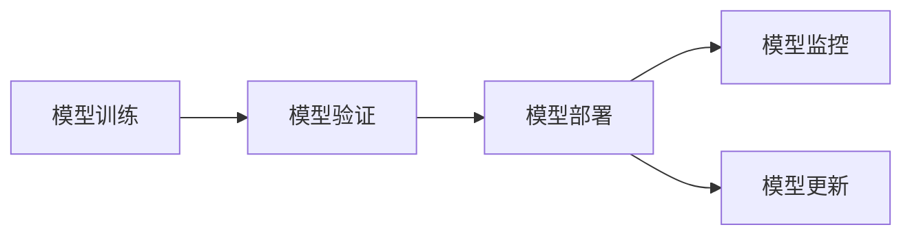

                 

## 1. 背景介绍

### 1.1 问题由来
在机器学习领域，模型训练通常是一个高复杂度的过程，需要经历大量的数据预处理、特征工程、模型构建和参数调优等环节。然而，将训练好的模型部署到生产环境中，却是一个常常被忽视但同样重要的问题。许多模型训练出色，但到了生产环境却面临各种挑战，如资源限制、性能下降、稳定性差、难以维护等，无法达到预期的效果。

### 1.2 问题核心关键点
模型部署的核心问题是如何在有限的时间和资源内，将训练好的模型转化为一个能够在实际应用场景中稳定、高效、可扩展的解决方案。以下是一些关键的考虑点：

- **资源限制**：生产环境的硬件资源往往不同于训练环境，如CPU、GPU、内存等资源限制。
- **性能要求**：模型在生产环境中的性能要求与训练环境可能不同，如响应时间、处理能力、并发量等。
- **稳定性需求**：模型需要稳定运行，避免因硬件故障、软件错误等导致的系统宕机或错误。
- **可扩展性**：模型需要具有良好的水平和垂直扩展能力，适应不断变化的业务需求。
- **易用性和维护性**：模型需要易于部署、监控和更新，降低运维成本。

### 1.3 问题研究意义
一个成功的模型部署能够：

- 降低开发和运维成本，缩短项目周期。
- 提升模型性能和可用性，保障业务连续性。
- 提升用户体验，提升业务满意度。
- 构建系统级智能，助力业务创新。

模型部署的研究意义在于构建一个完整的机器学习生态系统，将模型从研发阶段无缝过渡到生产阶段，从而在实际应用中发挥其最大效能。

## 2. 核心概念与联系

### 2.1 核心概念概述

为更好地理解模型部署的核心概念，本节将介绍几个紧密相关的核心概念：

- **模型训练(Training)**：使用训练数据集和训练算法，对模型参数进行优化，使模型能够对给定输入输出正确的预测。
- **模型验证(Validation)**：使用验证数据集评估模型性能，确定模型是否过拟合或欠拟合，并进行必要的参数调整。
- **模型部署(Deployment)**：将训练好的模型部署到生产环境中，实现实时预测或决策。
- **模型监控(Monitoring)**：持续跟踪模型的性能和稳定性，及时发现并解决潜在问题。
- **模型更新(Updating)**：定期或根据需求对模型进行重新训练和部署，保持模型性能和适应性。

这些概念之间有着密切的联系和依赖关系，如图示：



这个流程图展示了模型训练、验证、部署、监控和更新之间的逻辑关系：

1. 训练模型后，进行验证，确保模型性能。
2. 将验证通过的模型部署到生产环境。
3. 监控模型在生产环境中的表现。
4. 根据监控结果，定期或动态更新模型。

## 3. 核心算法原理 & 具体操作步骤

### 3.1 算法原理概述

模型部署的核心在于如何将训练好的模型转化为能够在实际应用场景中稳定、高效、可扩展的解决方案。这涉及以下几个关键算法：

- **模型封装(Model Wrapping)**：将模型封装成标准化的接口，方便集成和调用。
- **分布式训练(Distributed Training)**：将训练任务分配到多个计算节点，加速训练过程。
- **模型压缩(Model Compression)**：减小模型尺寸，提升模型推理速度。
- **模型量化(Model Quantization)**：将浮点模型转化为定点模型，进一步提升模型推理速度和存储效率。
- **模型监控(Model Monitoring)**：实时监测模型性能，及时发现和解决潜在问题。

这些算法共同构成了模型部署的核心框架，使得模型能够从训练环境无缝过渡到生产环境，实现高质量的机器学习应用。

### 3.2 算法步骤详解

模型部署的具体操作步骤如下：

**Step 1: 准备训练和测试数据**
- 收集和预处理训练数据集和测试数据集，确保数据的质量和多样性。
- 划分为训练集、验证集和测试集，确保模型在训练集上过拟合，在验证集上泛化，在测试集上评估效果。

**Step 2: 选择和训练模型**
- 选择合适的模型架构，如线性回归、决策树、神经网络等。
- 使用训练集对模型进行训练，并在验证集上进行验证和调参。
- 选择性能最佳的模型，进行模型保存。

**Step 3: 模型封装和接口设计**
- 将训练好的模型封装为标准化的接口，如RESTful API、gRPC接口等。
- 设计合适的输入和输出格式，确保模型易于集成和使用。

**Step 4: 分布式训练和模型压缩**
- 将训练任务分配到多个计算节点，使用分布式训练加速训练过程。
- 使用模型压缩技术，如剪枝、量化、蒸馏等，减小模型尺寸，提升模型推理速度。

**Step 5: 模型部署和生产环境搭建**
- 在生产环境中搭建所需的计算资源，如服务器、数据库、缓存等。
- 安装和配置必要的软件环境，如Python解释器、TensorFlow、PyTorch等。
- 部署模型到生产环境，并进行必要的测试和验证。

**Step 6: 模型监控和性能优化**
- 使用监控工具，如Prometheus、Grafana等，实时监测模型性能。
- 分析监控数据，及时发现和解决模型问题，如内存泄漏、超时、错误等。
- 根据监控结果，进行模型优化，如调整超参数、重训练模型等。

**Step 7: 模型更新和维护**
- 定期或根据业务需求，对模型进行重新训练和部署。
- 使用A/B测试等方法，验证新模型的效果，决定是否替换原有模型。
- 建立模型版本管理机制，确保模型的历史和当前状态可追溯。

以上是模型部署的一般流程。在实际应用中，还需要针对具体任务和环境，对每个步骤进行优化设计，以确保模型在生产环境中的最佳表现。

### 3.3 算法优缺点

模型部署的优点：
1. 加速模型训练和推理速度，提升应用效率。
2. 提高模型的可扩展性和鲁棒性，适应不同的业务场景。
3. 确保模型的稳定性和可靠性，保障业务连续性。

模型部署的缺点：
1. 部署过程复杂，需要具备一定的技术水平。
2. 模型压缩和量化可能会降低模型精度。
3. 监控和维护成本较高，需要持续投入人力和资源。

尽管存在这些缺点，但模型部署仍是实现高质量机器学习应用的重要步骤。合理使用部署技术，可以有效提升模型的性能和可用性，推动业务创新。

### 3.4 算法应用领域

模型部署技术广泛应用于各种机器学习应用中，如：

- 自然语言处理(NLP)：将预训练语言模型部署到实际应用中，实现文本分类、情感分析、机器翻译等任务。
- 计算机视觉(CV)：将深度学习模型部署到图像识别、目标检测、人脸识别等应用中。
- 推荐系统：将模型部署到推荐引擎中，实现个性化推荐。
- 金融风控：将模型部署到实时监控系统中，实现风险预警和欺诈检测。
- 智能客服：将模型部署到客服系统中，实现自动化问答和情感识别。

除了这些经典应用外，模型部署技术还被创新性地应用到更多场景中，如医疗诊断、智能制造、智能交通等，为各行业带来新的解决方案。随着预训练模型和部署技术的不断进步，相信机器学习应用将更加广泛，推动人工智能技术的普及和落地。

## 4. 数学模型和公式 & 详细讲解  
### 4.1 数学模型构建

模型部署的数学模型涉及模型训练、验证、部署、监控和更新等多个环节。以下是对模型部署过程的数学建模。

记模型为 $M(x; \theta)$，其中 $x$ 为输入，$\theta$ 为模型参数。假设训练集为 $D=\{(x_i, y_i)\}_{i=1}^N$，其中 $y_i$ 为标签。

**模型训练**：最小化损失函数 $L(\theta)$，使得 $M(x; \theta)$ 能够对给定输入 $x$ 输出正确的标签 $y$。

$$
\theta^* = \mathop{\arg\min}_{\theta} \sum_{i=1}^N L(M(x_i; \theta), y_i)
$$

**模型验证**：使用验证集 $D_v$ 评估模型性能，确定模型是否过拟合或欠拟合。

$$
L_v(\theta) = \frac{1}{N_v} \sum_{i=1}^{N_v} L(M(x_i; \theta), y_i)
$$

**模型部署**：将训练好的模型 $M(x; \theta^*)$ 部署到生产环境，实现实时预测或决策。

**模型监控**：实时监测模型性能，记录各项指标。

$$
M_{monitor}(x; \theta^*, t) = M(x; \theta^*) + Noise(t)
$$

**模型更新**：根据监控结果，选择最优的模型版本，进行重新训练和部署。

$$
\theta^*_{new} = \mathop{\arg\min}_{\theta} L(M(x; \theta), y) + \alpha M_{monitor}(x; \theta, t)
$$

### 4.2 公式推导过程

以下是模型部署的详细数学推导过程：

1. **模型训练**：
   - 假设模型为线性回归模型，损失函数为均方误差：
   $$
   L(\theta) = \frac{1}{2N} \sum_{i=1}^N (y_i - M(x_i; \theta))^2
   $$
   - 使用梯度下降算法，更新模型参数 $\theta$：
   $$
   \theta_{t+1} = \theta_t - \eta \nabla_{\theta} L(\theta_t)
   $$

2. **模型验证**：
   - 使用验证集，计算模型在验证集上的损失：
   $$
   L_v(\theta) = \frac{1}{N_v} \sum_{i=1}^{N_v} (y_i - M(x_i; \theta))^2
   $$
   - 根据验证集损失，判断模型是否过拟合或欠拟合，并进行参数调整。

3. **模型部署**：
   - 将训练好的模型 $M(x; \theta^*)$ 部署到生产环境，实现实时预测或决策。
   - 部署后，模型输出为 $M_{deploy}(x; \theta^*)$。

4. **模型监控**：
   - 实时监测模型性能，记录各项指标，如响应时间、错误率等。
   - 假设模型输出中存在噪声，可以表示为：
   $$
   M_{monitor}(x; \theta^*, t) = M(x; \theta^*) + Noise(t)
   $$
   - 噪声 $Noise(t)$ 服从正态分布，均值为0，方差为 $\sigma^2$。

5. **模型更新**：
   - 根据监控结果，选择最优的模型版本，进行重新训练和部署。
   - 假设模型在更新后的参数为 $\theta_{new}$，更新后的损失为 $L_{new}$：
   $$
   \theta_{new} = \mathop{\arg\min}_{\theta} L(M(x; \theta), y) + \alpha M_{monitor}(x; \theta, t)
   $$
   - 其中 $\alpha$ 为监控权重，控制监控结果对更新的影响。

### 4.3 案例分析与讲解

**案例1：图像分类任务**
- 数据集：CIFAR-10，包含60000个32x32彩色图片，10个类别。
- 模型：VGG16，卷积神经网络架构。
- 部署工具：TensorFlow Serving。
- 部署流程：
  1. 将训练好的模型权重保存。
  2. 搭建TensorFlow Serving服务，加载模型权重。
  3. 通过RESTful API进行模型预测。
  4. 实时监控服务性能，如响应时间、吞吐量等。
  5. 定期对模型进行重新训练和部署。

**案例2：推荐系统**
- 数据集：Amazon商品数据集，包含用户行为数据和商品信息。
- 模型：基于深度神经网络的协同过滤模型。
- 部署工具：Spark。
- 部署流程：
  1. 将训练好的模型保存为模型文件。
  2. 搭建Spark集群，加载模型文件。
  3. 通过Spark Streaming进行实时推荐。
  4. 实时监控推荐效果和系统性能。
  5. 定期对模型进行重新训练和部署。

通过以上案例可以看出，不同领域的模型部署流程有所不同，但总体框架类似。合理使用部署技术，可以显著提升模型的性能和可用性，推动业务创新。

## 5. 项目实践：代码实例和详细解释说明

### 5.1 开发环境搭建

在进行模型部署实践前，我们需要准备好开发环境。以下是使用Python进行TensorFlow开发的环境配置流程：

1. 安装Anaconda：从官网下载并安装Anaconda，用于创建独立的Python环境。

2. 创建并激活虚拟环境：
```bash
conda create -n tf-env python=3.8 
conda activate tf-env
```

3. 安装TensorFlow：根据CUDA版本，从官网获取对应的安装命令。例如：
```bash
conda install tensorflow -c tf -c conda-forge
```

4. 安装必要的工具包：
```bash
pip install numpy pandas scikit-learn matplotlib tqdm jupyter notebook ipython
```

完成上述步骤后，即可在`tf-env`环境中开始模型部署实践。

### 5.2 源代码详细实现

下面是使用TensorFlow进行模型部署的PyTorch代码实现。

首先，定义图像分类任务的模型：

```python
import tensorflow as tf
from tensorflow.keras import layers

class ImageClassifier(tf.keras.Model):
    def __init__(self, input_shape):
        super(ImageClassifier, self).__init__()
        self.conv1 = layers.Conv2D(32, 3, activation='relu', input_shape=input_shape)
        self.pool1 = layers.MaxPooling2D(2)
        self.flatten = layers.Flatten()
        self.fc1 = layers.Dense(64, activation='relu')
        self.fc2 = layers.Dense(10, activation='softmax')
        
    def call(self, inputs):
        x = self.conv1(inputs)
        x = self.pool1(x)
        x = self.flatten(x)
        x = self.fc1(x)
        return self.fc2(x)
        
model = ImageClassifier(input_shape=(32, 32, 3))
```

然后，定义模型保存和加载函数：

```python
def save_model(model, path):
    tf.saved_model.save(model, path)

def load_model(path):
    return tf.saved_model.load(path)
```

接着，定义模型封装和接口设计：

```python
class ImageClassifierAPI:
    def __init__(self, model):
        self.model = model
        
    def predict(self, x):
        return self.model.predict(x)

api = ImageClassifierAPI(model)
```

最后，启动部署流程并在生产环境搭建：

```python
save_model(model, 'model.savedmodel')

# 搭建TensorFlow Serving服务
gpus = tf.config.list_physical_devices('GPU')
tf.config.set_logical_device_configuration(gpus[0], [tf.config.LogicalDeviceConfiguration(memory_limit=512), tf.config.LogicalDeviceConfiguration(memory_limit=512)])
tf.config.set_visible_devices(gpus[0], 'GPU')

# 启动TensorFlow Serving服务
server = tf.distribute.Server(tf.distribute.cluster_resolver.TFConfigClusterResolver({'chief': 'localhost:8470'}), job_name='chief')
predictor = tf.saved_model.load('model.savedmodel')
server.join()

# 实时调用模型进行预测
x = tf.random.normal([1, 32, 32, 3])
result = predictor(x)
print(result.numpy())
```

以上就是使用TensorFlow进行图像分类任务模型部署的完整代码实现。可以看到，得益于TensorFlow Serving的强大封装，我们可以用相对简洁的代码完成模型部署。

### 5.3 代码解读与分析

让我们再详细解读一下关键代码的实现细节：

**ImageClassifier类**：
- `__init__`方法：定义模型架构，包含卷积层、池化层、全连接层等。
- `call`方法：定义前向传播过程，计算模型输出。

**模型保存和加载函数**：
- `save_model`方法：将训练好的模型保存为TensorFlow SavedModel格式。
- `load_model`方法：从指定路径加载TensorFlow SavedModel格式的模型。

**ImageClassifierAPI类**：
- `__init__`方法：将训练好的模型封装为API，方便调用。
- `predict`方法：定义API接口，接收输入数据，返回预测结果。

**部署流程**：
- 将训练好的模型保存为TensorFlow SavedModel格式。
- 搭建TensorFlow Serving服务，加载模型文件。
- 启动TensorFlow Serving服务。
- 实时调用模型进行预测。

可以看到，TensorFlow Serving使得模型部署的代码实现变得简洁高效。开发者可以将更多精力放在模型构建和验证上，而不必过多关注底层的实现细节。

当然，工业级的系统实现还需考虑更多因素，如模型的保存和加载格式、服务器的资源配置、API接口的设计等。但核心的部署范式基本与此类似。

## 6. 实际应用场景
### 6.1 智能客服系统

基于模型部署的智能客服系统，能够7x24小时不间断服务，快速响应客户咨询，用自然流畅的语言解答各类常见问题。

在技术实现上，可以收集企业内部的历史客服对话记录，将问题和最佳答复构建成监督数据，在此基础上对预训练模型进行微调。微调后的模型能够自动理解用户意图，匹配最合适的答案模板进行回复。对于客户提出的新问题，还可以接入检索系统实时搜索相关内容，动态组织生成回答。如此构建的智能客服系统，能大幅提升客户咨询体验和问题解决效率。

### 6.2 金融舆情监测

金融机构需要实时监测市场舆论动向，以便及时应对负面信息传播，规避金融风险。传统的人工监测方式成本高、效率低，难以应对网络时代海量信息爆发的挑战。基于模型部署的文本分类和情感分析技术，为金融舆情监测提供了新的解决方案。

具体而言，可以收集金融领域相关的新闻、报道、评论等文本数据，并对其进行主题标注和情感标注。在此基础上对预训练语言模型进行微调，使其能够自动判断文本属于何种主题，情感倾向是正面、中性还是负面。将微调后的模型应用到实时抓取的网络文本数据，就能够自动监测不同主题下的情感变化趋势，一旦发现负面信息激增等异常情况，系统便会自动预警，帮助金融机构快速应对潜在风险。

### 6.3 个性化推荐系统

当前的推荐系统往往只依赖用户的历史行为数据进行物品推荐，无法深入理解用户的真实兴趣偏好。基于模型部署的个性化推荐系统可以更好地挖掘用户行为背后的语义信息，从而提供更精准、多样的推荐内容。

在实践中，可以收集用户浏览、点击、评论、分享等行为数据，提取和用户交互的物品标题、描述、标签等文本内容。将文本内容作为模型输入，用户的后续行为（如是否点击、购买等）作为监督信号，在此基础上微调预训练语言模型。微调后的模型能够从文本内容中准确把握用户的兴趣点。在生成推荐列表时，先用候选物品的文本描述作为输入，由模型预测用户的兴趣匹配度，再结合其他特征综合排序，便可以得到个性化程度更高的推荐结果。

### 6.4 未来应用展望

随着模型部署技术的不断发展，基于微调的模型将会在更多领域得到应用，为传统行业带来变革性影响。

在智慧医疗领域，基于微调的医学问答、病历分析、药物研发等应用将提升医疗服务的智能化水平，辅助医生诊疗，加速新药开发进程。

在智能教育领域，基于微调的作业批改、学情分析、知识推荐等应用将因材施教，促进教育公平，提高教学质量。

在智慧城市治理中，基于微调的智能交通、公共安全、环境监测等应用将提高城市管理的自动化和智能化水平，构建更安全、高效的未来城市。

此外，在企业生产、社会治理、文娱传媒等众多领域，基于微调的智能应用也将不断涌现，为各行各业带来新的解决方案。相信随着技术的日益成熟，模型部署技术将成为人工智能落地应用的重要范式，推动人工智能技术向更广阔的领域加速渗透。

## 7. 工具和资源推荐
### 7.1 学习资源推荐

为了帮助开发者系统掌握模型部署的理论基础和实践技巧，这里推荐一些优质的学习资源：

1. TensorFlow官方文档：提供详细的TensorFlow API和最佳实践，是学习模型部署的重要资料。
2. TensorFlow Serving官方文档：提供TensorFlow Serving的搭建和使用方法，适合实战练习。
3. PyTorch官方文档：提供PyTorch API和最佳实践，是学习模型部署的重要资料。
4. Keras官方文档：提供Keras API和最佳实践，适合初学者上手。
5. NVIDIA Deep Learning AIO：提供GPU加速模型训练和推理的实战教程。
6. Google Cloud AI平台：提供云上模型部署和微调的平台和教程。

通过对这些资源的学习实践，相信你一定能够快速掌握模型部署的精髓，并用于解决实际的机器学习问题。
###  7.2 开发工具推荐

高效的开发离不开优秀的工具支持。以下是几款用于模型部署开发的常用工具：

1. TensorFlow：由Google主导开发的深度学习框架，生产部署方便，适合大规模工程应用。
2. PyTorch：基于Python的开源深度学习框架，灵活动态的计算图，适合快速迭代研究。
3. TensorFlow Serving：谷歌开源的模型服务框架，提供高效的模型部署和推理能力。
4. TensorBoard：TensorFlow配套的可视化工具，可实时监测模型训练状态，并提供丰富的图表呈现方式。
5. Weights & Biases：模型训练的实验跟踪工具，可以记录和可视化模型训练过程中的各项指标，方便对比和调优。
6. Prometheus：开源的监控系统，支持多种数据源，实时监测系统性能和状态。

合理利用这些工具，可以显著提升模型部署的开发效率，加快创新迭代的步伐。

### 7.3 相关论文推荐

模型部署技术的发展源于学界的持续研究。以下是几篇奠基性的相关论文，推荐阅读：

1. TensorFlow Serving: A Generic Framework for Serving TensorFlow Models:介绍TensorFlow Serving的基本架构和使用方法。
2. TensorFlow Extended: A TensorFlow-Based Framework for Serving Machine Learning Models:介绍TensorFlow Extended的基本架构和使用方法。
3. Model Compression and Optimization: Algorithms and Strategies for Deep Learning:介绍模型压缩和优化技术的原理和实现方法。
4. A Survey of Model Compression: From Theory to Practice:综述模型压缩技术的原理和实际应用案例。
5. Model-based Continuous Multi-task Learning with Personalization and Online Learning:介绍多任务学习的模型部署和优化方法。
6. Model-based Reinforcement Learning: Theory, Algorithms, and Applications:介绍基于模型的强化学习模型部署和优化方法。

这些论文代表了大模型部署技术的发展脉络。通过学习这些前沿成果，可以帮助研究者把握学科前进方向，激发更多的创新灵感。

## 8. 总结：未来发展趋势与挑战

### 8.1 总结

本文对基于模型训练的模型部署过程进行了全面系统的介绍。首先阐述了模型部署的核心概念和流程，明确了模型从训练到生产的关键步骤。其次，从原理到实践，详细讲解了模型部署的数学模型和关键算法。最后，通过案例分析与讲解，展示了模型部署在实际应用中的具体实现和应用场景。

通过本文的系统梳理，可以看到，模型部署技术能够将训练好的模型转化为能够在实际应用场景中稳定、高效、可扩展的解决方案，是机器学习应用落地的重要步骤。合理使用部署技术，可以有效提升模型的性能和可用性，推动业务创新。

### 8.2 未来发展趋势

展望未来，模型部署技术将呈现以下几个发展趋势：

1. 自动化和易用性提升：自动化部署工具和平台将更多地被应用，使得模型部署过程更加简单和高效。
2. 动态部署和弹性伸缩：动态部署工具和云服务将支持更灵活的部署模式，实现自动化的水平和垂直扩展。
3. 多模型版本管理：建立更精细的模型版本管理机制，确保模型历史的可追溯性。
4. 实时监控和智能调优：实时监控工具和自动调优算法将提升模型部署的稳定性和性能。
5. 跨平台和跨语言部署：支持更多平台和语言，如ARM、嵌入式系统、Rust等，拓展模型部署的应用场景。

以上趋势凸显了模型部署技术的广阔前景。这些方向的探索发展，必将进一步提升模型的性能和可用性，推动业务创新。

### 8.3 面临的挑战

尽管模型部署技术已经取得了一定成果，但在迈向更加智能化、普适化应用的过程中，它仍面临诸多挑战：

1. 硬件资源限制：生产环境的硬件资源往往不同于训练环境，如CPU、GPU、内存等资源限制。
2. 部署过程复杂：模型部署涉及模型封装、接口设计、数据迁移、版本管理等环节，需要具备一定的技术水平。
3. 监控成本较高：实时监控工具和自动化调优算法需要持续投入人力和资源，成本较高。
4. 更新维护困难：模型更新和维护需要反复迭代和测试，周期长，成本高。

尽管存在这些挑战，但模型部署仍是实现高质量机器学习应用的重要步骤。合理使用部署技术，可以有效提升模型的性能和可用性，推动业务创新。

### 8.4 研究展望

面对模型部署面临的种种挑战，未来的研究需要在以下几个方面寻求新的突破：

1. 自动化和易用性提升：开发更智能的自动化部署工具和平台，使得模型部署过程更加简单和高效。
2. 动态部署和弹性伸缩：开发更灵活的动态部署工具和云服务，实现自动化的水平和垂直扩展。
3. 多模型版本管理：建立更精细的模型版本管理机制，确保模型历史的可追溯性。
4. 实时监控和智能调优：开发更高效的实时监控工具和自动调优算法，提升模型部署的稳定性和性能。
5. 跨平台和跨语言部署：支持更多平台和语言，如ARM、嵌入式系统、Rust等，拓展模型部署的应用场景。

这些研究方向的探索，必将引领模型部署技术迈向更高的台阶，为构建安全、可靠、可解释、可控的智能系统铺平道路。面向未来，模型部署技术还需要与其他人工智能技术进行更深入的融合，如知识表示、因果推理、强化学习等，多路径协同发力，共同推动机器学习技术的普及和落地。只有勇于创新、敢于突破，才能不断拓展模型部署的边界，让智能技术更好地造福人类社会。

## 9. 附录：常见问题与解答

**Q1：模型部署过程中，如何确保模型的安全性和可靠性？**

A: 确保模型部署的安全性和可靠性，需要从数据、模型和系统三个方面进行保障：

1. 数据安全：确保训练数据和测试数据的来源可靠，数据加密传输，防止数据泄露和篡改。
2. 模型安全：定期对模型进行安全性审查，避免模型输出恶意内容，如攻击代码、不实信息等。
3. 系统安全：建立模型部署的监控和预警系统，实时检测异常行为，防止模型被恶意篡改或攻击。

**Q2：模型部署过程中，如何降低监控成本？**

A: 降低监控成本，可以采用以下方法：

1. 自动化监控工具：使用自动化监控工具和平台，如Prometheus、Grafana等，自动化记录和分析模型性能指标，减少人工监控工作量。
2. 动态监控策略：根据业务需求，动态调整监控策略，避免过度的资源消耗。
3. 异常告警机制：建立异常告警机制，自动发送告警信息，快速定位和解决模型问题。

**Q3：模型部署过程中，如何处理模型压缩和量化的问题？**

A: 模型压缩和量化是提升模型部署效率和资源利用率的重要手段，但可能会降低模型精度。以下是一些常见方法：

1. 剪枝：删除模型中的冗余连接和参数，减小模型尺寸，提升推理速度。
2. 量化：将浮点模型转化为定点模型，压缩存储空间，提高计算效率。
3. 蒸馏：使用较小的模型替代大模型，减少资源消耗，提升推理速度。

**Q4：模型部署过程中，如何提高模型的可扩展性和鲁棒性？**

A: 提高模型的可扩展性和鲁棒性，需要从模型架构和训练策略两个方面进行优化：

1. 模型架构：设计更高效的模型架构，如深度可分离卷积、Transformer等，提升模型的可扩展性和鲁棒性。
2. 训练策略：使用更好的训练策略，如自适应学习率、对抗训练等，提升模型的鲁棒性和泛化能力。

**Q5：模型部署过程中，如何优化模型的推理速度？**

A: 优化模型的推理速度，可以采用以下方法：

1. 模型压缩：使用剪枝、量化、蒸馏等技术，减小模型尺寸，提升推理速度。
2. 模型并行：使用模型并行技术，加速模型推理。
3. 模型缓存：使用模型缓存技术，减少重复计算，提升推理速度。

通过以上方法，可以显著提升模型的推理速度和资源利用率，使得模型能够在实际应用中快速响应和处理大量请求。

---

作者：禅与计算机程序设计艺术 / Zen and the Art of Computer Programming

