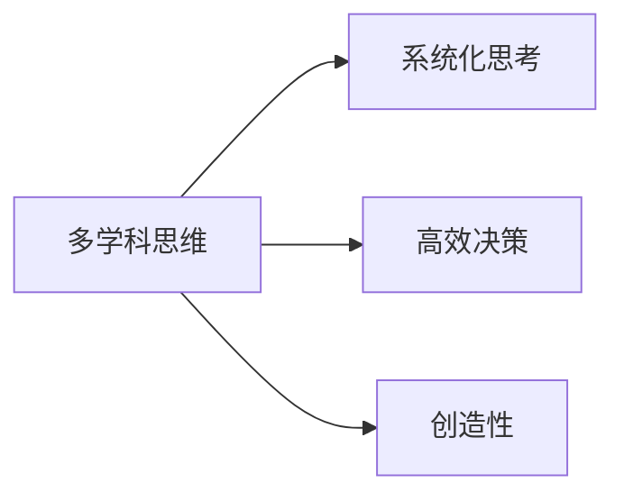
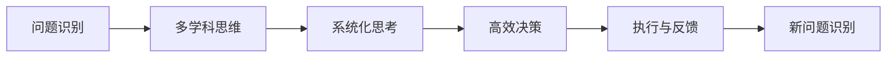

                 

# 查理芒格的100种思维模型

> 关键词：查理芒格, 多学科思维, 思维模型, 高效决策, 创造性

## 1. 背景介绍

### 1.1 问题由来
在投资和企业管理中，查理芒格（Charlie Munger）以其独特的“多学科思维”闻名于世。他深信人类智慧的最佳方式不是专注单一学科，而是从各个领域中提取原则，并巧妙地将它们应用到实际决策中。芒格坚持使用100种不同的思维模型进行思考和决策，涵盖数学、心理学、经济学、社会学等多个学科。这些模型帮助他避免陷入单一思维定式，从而做出更高效、更有创造性的决策。

### 1.2 问题核心关键点
查理芒格的思维模型不仅仅是一种学习方法，更是高效决策的利器。这些模型帮助他在复杂多变的世界中识别关键信息，发现潜在问题，制定合理的解决方案。芒格的思维模型覆盖了认知心理学、数学逻辑、经济学原理等多个领域，是多元化思维的具体体现。通过掌握这些模型，读者可以更好地理解芒格的决策过程，提升自身的多学科思维能力。

## 2. 核心概念与联系

### 2.1 核心概念概述

查理芒格的100种思维模型是一套系统化的思考工具，旨在帮助人们从多个角度审视问题，做出更加全面、准确的决策。这些模型涉及心理学、数学、经济学、历史等多个学科，涵盖知识、情感、行为等多个维度。掌握这些模型，将使读者具备以下能力：

- **多学科思维**：从不同学科中提取原则，将它们应用到实际决策中，避免单一思维定式。
- **系统化思考**：将问题分解为多个子问题，利用不同模型分别解决，保证全面覆盖。
- **高效决策**：利用模型快速识别关键信息，制定合理的解决方案，提升决策效率和质量。
- **创造性**：打破常规思维模式，开拓新的思考路径，促进创新与突破。

这些概念之间的逻辑关系可以通过以下Mermaid流程图来展示：



### 2.2 核心概念原理和架构的 Mermaid 流程图
由于篇幅限制，无法直接展示100种思维模型的全部流程，但以下是一个简化版流程图，展示了多学科思维、系统化思考、高效决策和创造性之间的关系：



## 3. 核心算法原理 & 具体操作步骤
### 3.1 算法原理概述

查理芒格的100种思维模型基于以下核心原理：

1. **多学科交叉**：芒格认为，不同学科的知识之间存在相互关联，能够相互促进。例如，数学模型可以提供严谨的数据分析，而心理学模型则可以帮助理解人类行为。
2. **模型组合**：芒格主张，对于复杂问题，单一模型往往不足以解决问题，需要结合多个模型进行系统分析。
3. **反复验证**：在决策过程中，模型不是一次性使用的工具，而是需要不断验证和调整的动态系统。

查理芒格的决策流程大致分为四个步骤：

1. **问题识别**：明确决策目标，理解问题本质。
2. **多学科思维**：选择相关模型，从不同学科中提取原则。
3. **系统化思考**：将问题分解为多个子问题，利用模型分别解决。
4. **高效决策**：整合模型结果，制定最优解决方案。

### 3.2 算法步骤详解

查理芒格的决策过程可以分为以下五个关键步骤：

**Step 1: 问题识别**
- 明确决策目标，理解问题的核心。
- 识别问题中的关键信息和不确定性。

**Step 2: 多学科思维**
- 选择与问题相关的模型。
- 阅读和理解每个模型的基础原理和应用场景。
- 根据问题特点，选择最合适的模型进行应用。

**Step 3: 系统化思考**
- 将问题分解为多个子问题。
- 为每个子问题选择相应的模型，进行分析和推理。
- 整合各个子问题的结果，形成对整体问题的理解。

**Step 4: 高效决策**
- 根据整合后的信息，制定最优解决方案。
- 评估方案的优缺点，考虑可能的风险和后果。
- 根据评估结果，选择最佳的决策方案。

**Step 5: 执行与反馈**
- 实施决策方案，并持续监控其效果。
- 根据执行结果和反馈信息，调整和优化决策。

### 3.3 算法优缺点

查理芒格的100种思维模型具有以下优点：

1. **全面覆盖**：涵盖多个学科，提供多角度的观察和分析。
2. **系统性**：将复杂问题分解为多个子问题，系统化解决。
3. **高效性**：利用模型快速识别关键信息，制定合理方案。
4. **创造性**：打破常规思维模式，开拓新思路。

同时，该方法也存在一些局限性：

1. **学习成本高**：需要掌握多种学科知识，对于初学者可能较为困难。
2. **模型选择复杂**：面对复杂问题，选择适合的模型需要经验和时间。
3. **过度依赖模型**：模型的应用需要结合实际情况，过度依赖可能导致误判。
4. **实际应用难度大**：在实际决策中，模型的应用和验证往往需要大量时间和资源。

### 3.4 算法应用领域

查理芒格的100种思维模型广泛应用于投资管理、企业管理、教育培训等多个领域。以下是几个典型的应用场景：

- **投资管理**：在分析股票、债券等金融资产时，芒格会综合使用价值投资、行为金融学、统计分析等多个模型，进行全面评估。
- **企业管理**：芒格在伯克希尔·哈撒韦公司担任副主席期间，采用多学科思维和系统化方法，优化公司决策过程，提升企业价值。
- **教育培训**：芒格的教育理念中，强调跨学科学习和思维方式，鼓励学生从多个角度理解和解决问题。
- **个人发展**：芒格认为，个人成长需要跨学科学习和系统化思考，利用各种思维模型提升决策能力。

## 4. 数学模型和公式 & 详细讲解 & 举例说明

### 4.1 数学模型构建

芒格的100种思维模型中，很多涉及数学和统计学的模型。以下是几个经典模型及其应用：

- **回归分析**：用于分析变量之间的线性关系，预测未来趋势。
- **蒙特卡洛模拟**：通过随机抽样模拟不同场景，评估风险和收益。
- **贝叶斯定理**：用于更新概率分布，在信息不完全情况下做出合理推断。
- **博弈论**：分析多个决策者之间的交互，制定最优策略。

### 4.2 公式推导过程

以回归分析为例，其基本公式为：

$$
y = \beta_0 + \beta_1x_1 + \beta_2x_2 + \ldots + \beta_nx_n + \epsilon
$$

其中，$y$ 为预测变量，$x_1, x_2, \ldots, x_n$ 为解释变量，$\beta_0, \beta_1, \beta_2, \ldots, \beta_n$ 为回归系数，$\epsilon$ 为误差项。

该模型的关键在于计算回归系数 $\beta$，常用的方法包括普通最小二乘法（OLS）和最大似然估计（MLE）。

### 4.3 案例分析与讲解

假设我们需要预测一个企业的未来收入，可以选择回归分析模型。以下是具体步骤：

1. **数据准备**：收集历史收入数据和相关解释变量，如市场规模、行业增长率、竞争对手数量等。
2. **模型选择**：选择合适的回归模型，如线性回归、多元回归等。
3. **模型训练**：利用历史数据训练模型，计算回归系数 $\beta$。
4. **预测结果**：将新数据输入模型，得到未来收入的预测值。
5. **评估效果**：利用误差项 $\epsilon$ 评估模型预测的准确度，并进行模型优化。

## 5. 项目实践：代码实例和详细解释说明

### 5.1 开发环境搭建

为了实践查理芒格的思维模型，可以使用Python和相关库进行实现。以下是基本的环境配置：

1. 安装Python：使用Anaconda或Miniconda安装Python 3.7以上版本。
2. 安装相关库：安装NumPy、Pandas、Scikit-learn等库，用于数据处理和模型训练。
3. 配置Jupyter Notebook：安装Jupyter Notebook，方便进行代码编写和结果展示。

### 5.2 源代码详细实现

以下是一个简单的回归分析模型实现：

```python
import numpy as np
import pandas as pd
from sklearn.linear_model import LinearRegression

# 准备数据
data = pd.read_csv('income_data.csv')

# 数据清洗和预处理
X = data[['market_size', 'growth_rate', 'competitors']]
y = data['income']

# 模型训练
model = LinearRegression()
model.fit(X, y)

# 预测新数据
new_data = np.array([[5000, 0.05, 10]]).T
prediction = model.predict(new_data)

# 输出结果
print(prediction)
```

### 5.3 代码解读与分析

上述代码中，我们使用了NumPy和Pandas进行数据处理，利用Scikit-learn的LinearRegression模型进行回归分析。具体步骤如下：

1. **数据准备**：读取历史收入数据和相关解释变量。
2. **数据清洗**：选择和处理解释变量，确保数据的准确性和完整性。
3. **模型训练**：使用LinearRegression模型训练回归系数，得到预测模型。
4. **预测结果**：利用新数据进行预测，得到未来收入的估计值。
5. **结果输出**：打印预测结果，进行评估和优化。

## 6. 实际应用场景

查理芒格的思维模型在实际应用中展现出了强大的威力。以下是几个具体应用场景：

### 6.1 投资管理

在投资决策中，芒格会综合使用多种模型进行分析和评估。例如，他利用价值投资模型评估股票的内在价值，利用行为金融学模型分析市场情绪和投资者心理，通过回归分析预测市场趋势等。

### 6.2 企业管理

芒格在伯克希尔·哈撒韦公司担任副主席期间，采用系统化思维和多学科方法，优化公司决策过程，提升企业价值。例如，在并购决策中，他综合使用财务分析、市场调研、战略规划等多个模型，确保并购的成功和效益。

### 6.3 教育培训

芒格的教育理念中，强调跨学科学习和思维方式。他认为，成功的教育应培养学生的批判性思维、系统化思考和多学科思维能力。

## 7. 工具和资源推荐

### 7.1 学习资源推荐

1. **《芒格的智慧》**：芒格自传，涵盖其投资理念、企业管理、教育思想等多个方面，是理解芒格思维模型的重要参考资料。
2. **《查理芒格思想精粹》**：芒格的文章和演讲集，包含其对多个学科的深入思考和应用。
3. **《快速入门多元思维模型》**：详细介绍100种芒格思维模型，帮助读者掌握系统化思维方法。
4. **《多学科决策分析》**：介绍芒格在决策过程中使用的多种模型及其应用。

### 7.2 开发工具推荐

1. **Python**：简单易用的编程语言，具有丰富的第三方库和框架，支持多种数据处理和模型训练。
2. **Jupyter Notebook**：交互式编程环境，支持代码编写、数据可视化、结果展示等功能。
3. **GitHub**：代码托管平台，支持版本控制和协作开发，方便代码共享和合作。

### 7.3 相关论文推荐

1. **《查理芒格的多学科思维》**：详细介绍芒格的多学科思维方法及其应用。
2. **《投资决策的数学模型》**：分析芒格在投资决策中使用的多种数学模型及其效果。

## 8. 总结：未来发展趋势与挑战

### 8.1 研究成果总结

查理芒格的100种思维模型在投资、管理、教育等多个领域展示了其强大的应用价值。通过多学科交叉、系统化思考、高效决策和创造性思维，芒格在复杂多变的世界中做出更全面、准确的决策。这些模型为读者提供了系统化思考和高效决策的新视角。

### 8.2 未来发展趋势

未来，芒格的思维模型将在更多领域得到应用，促进跨学科融合和创新突破。以下是几个可能的发展趋势：

1. **人工智能与思维模型的结合**：利用AI技术，自动化处理和分析数据，提升模型的应用效率。
2. **跨学科模型的融合**：将不同领域的模型进行有机结合，形成新的复合模型，提高决策的全面性和准确性。
3. **知识图谱的应用**：利用知识图谱技术，构建更丰富、更准确的模型，增强决策的深度和广度。
4. **数据驱动决策**：利用大数据技术，从海量数据中提取关键信息，支持更科学的决策过程。

### 8.3 面临的挑战

尽管芒格的思维模型具有广泛的应用价值，但在实际应用中也面临一些挑战：

1. **模型复杂性**：多种模型结合应用，增加了决策过程的复杂性，需要更高的技术水平和经验。
2. **数据质量问题**：数据的不完整、不准确、不一致等问题，可能导致模型结果的不稳定和误判。
3. **计算资源限制**：复杂的模型和数据处理需要大量的计算资源，需要高效的算法和优化技术。
4. **应用场景局限**：不同的应用场景对模型要求不同，需要根据具体情况进行模型选择和优化。

### 8.4 研究展望

未来，对芒格的思维模型进行深入研究和应用，将有助于提升决策的科学性和有效性。以下是几个研究方向：

1. **模型自动化**：利用AI技术，自动选择和优化模型，减少人工干预，提升决策效率。
2. **数据融合技术**：研究数据融合算法，提高数据质量和一致性，支持更可靠的决策。
3. **跨领域应用**：将芒格的思维模型应用于更多领域，如医疗、法律、金融等，推动跨学科融合。
4. **伦理与安全性**：研究模型伦理和安全性问题，确保决策过程符合社会道德和法律规范。

## 9. 附录：常见问题与解答

**Q1: 如何理解和应用查理芒格的100种思维模型？**

A: 理解和应用芒格的思维模型需要逐步学习，从多个学科中提取原则，并将其应用到实际决策中。初学者可以从简单的模型开始，逐步扩展到复杂的模型。同时，不断进行实践和反馈，提高模型的应用效果。

**Q2: 在实际决策中，如何选择合适的思维模型？**

A: 选择思维模型需要考虑问题的特点和目标。例如，面对复杂多变的问题，选择多种模型进行系统化分析；面对单一问题，选择最适合的模型进行解决。同时，不断学习和积累经验，提升模型选择的准确性。

**Q3: 如何提升多学科思维能力？**

A: 提升多学科思维能力需要跨学科学习和系统化思考。阅读和理解不同学科的基础知识，并进行跨学科的案例分析和讨论，积累跨学科应用的经验。

---

作者：禅与计算机程序设计艺术 / Zen and the Art of Computer Programming

