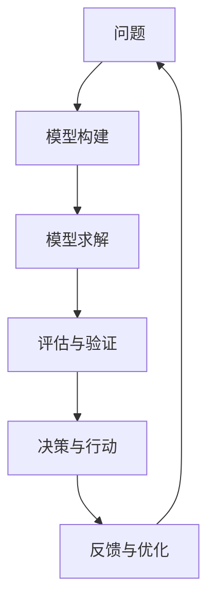

                 

## 1. 背景介绍

在日新月异的科技世界里，掌握新知识、新技术已成为每个从业者的核心竞争力。但是，繁杂的知识体系和快速变化的技术环境，让人感到望而却步。如何在这片知识海洋中游刃有余，找到快速学习和掌握新知识的捷径？本文将为您揭晓答案。

### 1.1 问题由来
随着人工智能(AI)和机器学习(ML)技术的快速发展，模型思维（Model Thinking）逐渐成为一种重要的思维方式。模型思维不仅帮助人们构建起更丰富的知识体系，还能有效提升问题解决的效率和质量。

### 1.2 问题核心关键点
- **模型思维**：通过对现实世界问题的抽象，建立数学模型，通过求解模型的最优解来指导决策。
- **高效学习**：模型思维使人们能够快速识别问题的本质，构建出更高效的学习路径。
- **系统性思维**：模型思维有助于建立系统性的知识体系，提高思考的深度和广度。
- **数据驱动决策**：模型思维通过数据分析，提供科学依据支持决策。
- **迭代优化**：模型思维鼓励持续优化模型，实现不断的进步。

### 1.3 问题研究意义
掌握模型思维不仅能有效提升个人技术水平，还能增强组织创新能力。在快速变化的技术环境中，具备模型思维的人能更快地获取新知识，解决复杂问题，适应未来的发展需求。

## 2. 核心概念与联系

### 2.1 核心概念概述

- **模型思维**：基于数学模型和统计模型的思维方式，通过建立和分析模型来解决问题和决策。
- **高效学习**：通过模型思维，可以快速识别关键知识，聚焦学习重点，提升学习效率。
- **系统性思维**：模型思维有助于将问题分解成可管理的小模块，逐步构建系统性知识体系。
- **数据驱动决策**：通过模型计算，可以客观评估数据的重要性，做出基于证据的决策。
- **迭代优化**：模型思维强调持续改进，不断优化模型，提升预测和决策能力。

### 2.2 核心概念原理和架构的 Mermaid 流程图



这个流程图展示了模型思维的基本流程：首先识别问题，然后构建模型、求解模型、评估与验证模型，最后根据反馈进行迭代优化。

## 3. 核心算法原理 & 具体操作步骤
### 3.1 算法原理概述

模型思维的核心在于通过数学模型来理解和解决问题。典型的模型思维流程包括问题识别、模型构建、求解、评估与验证、决策和反馈优化。下面，我们将分别介绍这些步骤的具体操作。

### 3.2 算法步骤详解

#### 3.2.1 问题识别
- **明确目标**：明确需要解决的问题和目标。
- **收集数据**：收集与问题相关的数据和信息。
- **数据预处理**：对数据进行清洗、标准化等处理，准备模型训练。

#### 3.2.2 模型构建
- **选择模型**：根据问题的特点选择合适的数学模型或统计模型。
- **模型定义**：定义模型的变量、参数和约束条件。
- **构建方程**：建立模型的数学表达式。

#### 3.2.3 求解
- **初始化模型**：给模型赋初值，通常采用统计学上的估计值。
- **求解方程**：使用求解器（如梯度下降法、牛顿法等）求解模型方程。
- **优化调整**：根据求解结果，调整模型参数和结构，优化模型性能。

#### 3.2.4 评估与验证
- **测试数据集**：使用未参与模型训练的数据集对模型进行测试。
- **性能指标**：根据测试结果评估模型性能，如准确率、召回率、F1分数等。
- **交叉验证**：通过交叉验证，评估模型的泛化能力。

#### 3.2.5 决策与行动
- **模型应用**：将训练好的模型应用于实际问题解决。
- **实时调整**：根据实时反馈，动态调整模型参数和策略。

#### 3.2.6 反馈与优化
- **收集反馈**：收集模型应用过程中的反馈信息。
- **迭代优化**：根据反馈信息，进行模型迭代优化。
- **模型更新**：更新模型，提升模型的预测能力和鲁棒性。

### 3.3 算法优缺点

模型思维的主要优点包括：
- **系统性**：模型思维能够将问题分解为可管理的部分，构建系统性知识体系。
- **可验证性**：通过模型评估和验证，可以客观评估模型的性能。
- **科学性**：模型思维强调基于数据和科学的决策，减少主观偏见。

缺点包括：
- **复杂性**：模型构建和求解过程相对复杂，需要一定的数学和编程基础。
- **数据依赖**：模型性能高度依赖于数据的质量和数量。
- **过拟合风险**：模型过于复杂或数据量不足可能导致过拟合。

### 3.4 算法应用领域

模型思维广泛应用于各类决策和问题解决场景中，例如：

- **金融风险评估**：通过构建金融风险模型，评估信贷和投资的风险。
- **医疗诊断**：通过构建疾病诊断模型，辅助医生进行疾病预测和诊断。
- **智能推荐**：通过构建用户行为模型，实现个性化推荐。
- **供应链优化**：通过构建供应链管理模型，优化资源配置和物流管理。
- **市场需求分析**：通过构建市场需求模型，预测市场趋势和消费者行为。

## 4. 数学模型和公式 & 详细讲解 & 举例说明

### 4.1 数学模型构建

在模型思维中，数学模型是解决问题的核心工具。常见的数学模型包括线性回归、逻辑回归、决策树、支持向量机等。这里以线性回归为例，介绍模型构建的基本步骤。

线性回归模型可以表示为：

$$
y = \beta_0 + \beta_1x_1 + \beta_2x_2 + \ldots + \beta_nx_n + \epsilon
$$

其中，$y$ 为因变量，$\beta_i$ 为模型系数，$x_i$ 为自变量，$\epsilon$ 为误差项。

### 4.2 公式推导过程

假设我们有一个包含 $n$ 个样本的数据集，其中每个样本包含 $m$ 个特征 $x_i$ 和目标值 $y_i$。我们的目标是通过这些样本训练一个线性回归模型，使其能够对新的输入进行预测。

为了得到最优的模型系数 $\beta_i$，我们使用最小二乘法（Least Squares Method），最小化预测值与实际值之间的平方误差：

$$
\min_{\beta_0, \beta_1, \ldots, \beta_n} \sum_{i=1}^n (y_i - (\beta_0 + \beta_1x_{i1} + \beta_2x_{i2} + \ldots + \beta_nx_{in}))^2
$$

将误差项 $\epsilon$ 展开，并求导，得到：

$$
\frac{\partial \sum_{i=1}^n (y_i - (\beta_0 + \beta_1x_{i1} + \beta_2x_{i2} + \ldots + \beta_nx_{in}))^2}{\partial \beta_j} = 0
$$

通过求解上述方程组，即可得到模型系数 $\beta_i$。

### 4.3 案例分析与讲解

假设我们要预测房价，已有历史数据集包含房屋面积 $x_1$、房间数 $x_2$、楼层数 $x_3$ 和价格 $y$。我们构建线性回归模型，使用最小二乘法求解模型系数。

首先，将数据标准化，然后计算回归系数：

$$
\beta_0 = \frac{\sum_{i=1}^n y_i - n\bar{y}}{n}
$$
$$
\beta_j = \frac{\sum_{i=1}^n x_{ij}y_i - n\bar{x}_j\bar{y}}{\sum_{i=1}^n x_{ij}^2 - n\bar{x}_j^2}
$$

最后，根据得到的系数，对新房屋的价格进行预测。

## 5. 项目实践：代码实例和详细解释说明

### 5.1 开发环境搭建

为了实践模型思维，我们需要搭建一个Python开发环境。以下是在PyTorch和Numpy库下搭建Python开发环境的详细步骤：

1. 安装Python：从官网下载并安装Python 3.8版本。
2. 创建虚拟环境：
```bash
python -m venv myenv
source myenv/bin/activate
```
3. 安装依赖库：
```bash
pip install numpy pandas scikit-learn matplotlib torch torchvision transformers
```

### 5.2 源代码详细实现

以下是一个简单的线性回归模型实现，用于房价预测：

```python
import numpy as np
from sklearn.linear_model import LinearRegression

# 准备数据
X = np.array([[2000, 3], [3000, 4], [4000, 5], [5000, 6]])
y = np.array([250000, 350000, 450000, 550000])

# 训练模型
model = LinearRegression().fit(X, y)

# 预测房价
new_x = np.array([[5000, 5]])
print(model.predict(new_x))
```

### 5.3 代码解读与分析

该代码实现了一个简单的线性回归模型，用于预测房价。首先，我们使用Numpy生成了一个包含四个样本的数据集，其中每个样本包含房屋面积和价格。然后，我们使用Scikit-Learn的LinearRegression模型训练模型，并使用模型预测新样本的价格。

## 6. 实际应用场景

### 6.1 金融风险评估

在金融领域，风险评估是核心任务之一。通过构建风险模型，金融机构可以评估贷款申请者的违约概率，并进行信贷决策。例如，可以使用逻辑回归模型，对申请者的收入、年龄、职业等信息进行建模，预测其违约概率。

### 6.2 医疗诊断

医疗诊断中，模型思维广泛应用于疾病预测和诊断。例如，通过构建支持向量机模型，可以预测患者是否有某种疾病，从而辅助医生进行诊断和治疗决策。

### 6.3 智能推荐

在电商和社交媒体领域，推荐系统是提高用户满意度的关键。通过构建用户行为模型，推荐系统可以为用户推荐个性化的商品或内容，提升用户体验。

### 6.4 供应链优化

供应链管理中，模型思维用于优化资源配置和物流管理。例如，通过构建库存管理模型，企业可以预测库存水平，优化订货策略，降低运营成本。

### 6.5 市场需求分析

市场营销中，模型思维用于预测市场趋势和消费者行为。例如，通过构建市场趋势模型，企业可以预测产品的市场需求，制定销售策略。

## 7. 工具和资源推荐

### 7.1 学习资源推荐

为了掌握模型思维，以下是几个推荐的学习资源：

1. 《模型思维：从数学到应用》：介绍模型思维的基本原理和应用案例。
2. 《Python数据分析与机器学习》：详细介绍Python在数据分析和机器学习中的应用。
3. Coursera《机器学习基础》：由斯坦福大学教授讲授的机器学习入门课程。
4. Udacity《机器学习工程师纳米学位》：涵盖机器学习从基础到应用的系统课程。
5. Kaggle竞赛平台：通过参与实际数据竞赛，提升数据处理和模型构建能力。

### 7.2 开发工具推荐

以下是几个推荐的开发工具：

1. PyTorch：基于Python的深度学习框架，广泛用于模型构建和训练。
2. TensorFlow：Google开发的深度学习框架，适用于大规模模型训练。
3. Jupyter Notebook：交互式的代码编辑器，方便实时调试和可视化。
4. Scikit-Learn：Python数据科学库，提供多种机器学习算法和工具。
5. R：用于统计分析和数据建模的编程语言，适用于模型构建和验证。

### 7.3 相关论文推荐

以下是几篇关于模型思维的经典论文，推荐阅读：

1. "Linear Regression"（线性回归）：W. S. Cleveland, J. E. McRae, W. S. Cleveland, J. E. McRae. 1985.
2. "Logistic Regression"（逻辑回归）：John H. McKean Jr., S. T. Smith. 1974.
3. "Decision Trees"（决策树）：J. H. Friedman. 1974.
4. "Support Vector Machines"（支持向量机）：V. N. Vapnik. 1995.
5. "Neural Networks"（神经网络）：Geoffrey Hinton. 2012.

## 8. 总结：未来发展趋势与挑战

### 8.1 研究成果总结

模型思维在各个领域的应用已经取得了显著成效。通过建立数学模型，可以有效解决各类复杂问题，提升决策的科学性和准确性。

### 8.2 未来发展趋势

未来，模型思维的发展趋势包括：
- **多模态融合**：结合多种数据类型（如文本、图像、语音等），构建多模态模型，提升决策的全面性和准确性。
- **深度学习**：通过深度神经网络模型，处理更复杂的数据结构和关系。
- **分布式计算**：利用分布式计算框架，提升模型训练和推理的效率和规模。
- **自适应学习**：结合强化学习等方法，实现模型参数的自适应调整，提升模型的动态适应能力。
- **隐私保护**：在模型构建和应用过程中，注重数据隐私和安全保护。

### 8.3 面临的挑战

尽管模型思维在应用中取得了成功，但仍面临一些挑战：
- **数据质量**：模型的性能高度依赖于数据的质量和数量，数据收集和预处理需要大量时间和资源。
- **模型复杂性**：构建和优化复杂模型需要深厚的数学和编程基础，对从业者要求较高。
- **计算资源**：大规模模型训练和推理需要高性能计算资源，如GPU和TPU。
- **模型解释**：模型决策过程复杂，难以解释和调试，需要开发更好的模型解释工具。
- **伦理与安全**：模型应用过程中可能涉及数据隐私和安全问题，需要制定相应的伦理规范和保护措施。

### 8.4 研究展望

未来，模型思维的研究重点包括：
- **高效模型构建**：开发高效模型构建方法，降低模型构建难度和时间成本。
- **模型解释与可解释性**：研究模型解释方法和可解释性技术，提升模型的透明性和可信度。
- **多模态与跨领域应用**：探索多模态数据融合和跨领域应用，提升模型的综合应用能力。
- **自动化与自适应**：开发自动化模型构建和自适应学习技术，降低从业者的技术和资源门槛。

## 9. 附录：常见问题与解答

**Q1：如何理解模型思维的基本原理？**

A: 模型思维是通过建立数学模型来解决问题和决策的过程。关键步骤包括问题识别、模型构建、求解、评估与验证、决策和反馈优化。通过这一过程，可以将复杂问题分解为可管理的部分，逐步构建系统性知识体系。

**Q2：如何选择合适的模型？**

A: 选择模型需要考虑问题的性质、数据的特征和可获取性。线性回归适用于连续型数据，逻辑回归适用于分类问题，决策树适用于特征重要性明显的问题。选择适合的模型是建立有效模型的关键。

**Q3：如何评估模型性能？**

A: 模型性能评估包括准确率、召回率、F1分数、AUC等指标。通过测试集验证模型的泛化能力，并使用交叉验证评估模型的稳定性。

**Q4：如何优化模型？**

A: 模型优化包括调整模型参数、改进模型结构和引入正则化等方法。使用梯度下降等优化算法，通过反向传播更新模型参数，并根据评估结果调整模型。

**Q5：模型思维在实际应用中有哪些挑战？**

A: 模型思维面临的主要挑战包括数据质量、模型复杂性、计算资源、模型解释和伦理安全。应对这些挑战需要多方面的努力，如数据预处理、模型简化、分布式计算、模型解释工具和伦理规范的制定。

总之，模型思维是快速掌握新知识的有效途径。通过构建和分析模型，可以系统地理解和解决问题，提升决策的科学性和效率。随着技术的发展，模型思维的应用范围将进一步扩大，为解决复杂问题提供新的思路和方法。

