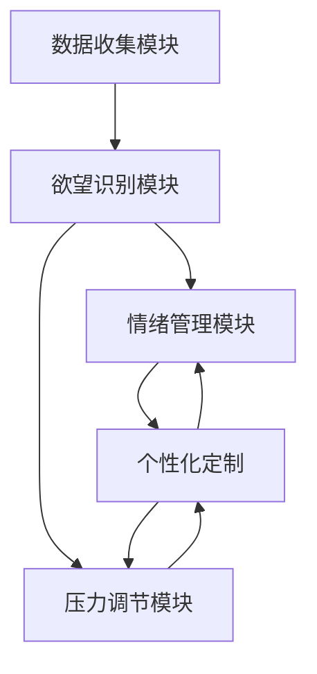

                 

## 1. 背景介绍

### 1.1 问题由来

在现代快节奏的生活中，人们的欲望、情绪和压力常常成为影响其生活和工作质量的重要因素。一方面，过度的欲望可能导致过度消费、心理失衡，甚至引发严重的心理健康问题。另一方面，情绪和压力的积累如果不加以有效管理，也会对个人的身心健康造成严重影响。

为了帮助人们更好地管理自己的欲望、情绪和压力，许多企业和机构都开发了各种自我管理工具和应用，如日记记录、心理咨询、冥想应用等。然而，这些工具往往存在一些问题：

- 缺乏个性化：现有工具大多采用“一刀切”的方法，难以根据个人的具体需求进行定制。
- 用户体验差：许多工具界面复杂，不易使用，导致用户难以坚持使用。
- 数据隐私：现有工具常常需要收集大量个人数据，存在隐私泄露的风险。
- 科学依据不足：许多工具缺乏科学依据，无法提供准确的自我管理建议。

为了解决这些问题，本文提出了一种基于人工智能（AI）的欲望智能调节中心，旨在通过智能化的自我管理平台，帮助用户更好地管理自己的欲望、情绪和压力，提升生活质量。

### 1.2 问题核心关键点

本系统的主要核心关键点包括：

- 个性化定制：通过智能化的算法，根据用户的具体需求提供个性化的自我管理方案。
- 数据隐私保护：在保证数据隐私的前提下，提供精准的自我管理建议。
- 科学依据：基于最新的人工智能技术，为用户提供科学、准确的自我管理建议。
- 用户友好：界面简洁、易用，使用户能够长期坚持使用。

本文将系统分为数据收集模块、欲望识别模块、情绪管理模块和压力调节模块四个主要部分，详细探讨各模块的设计思路、技术实现和用户体验。

## 2. 核心概念与联系

### 2.1 核心概念概述

- 欲望智能调节中心：一种基于AI的自我管理平台，旨在通过智能化手段帮助用户管理自己的欲望、情绪和压力。
- 欲望识别：通过分析用户的消费行为、社交网络活动等数据，识别用户的欲望模式和倾向。
- 情绪管理：基于情感分析技术，识别用户的情绪状态，并提供相应的情绪调节建议。
- 压力调节：通过分析用户的日常生活节奏、工作负荷等数据，提供有效的压力调节建议。
- 个性化定制：根据用户的个人数据和行为模式，提供个性化的自我管理方案。

### 2.2 核心概念原理和架构的 Mermaid 流程图



### 2.3 核心概念联系

各模块间的关系可以通过以下逻辑框架来展示：

- 数据收集模块负责收集用户的各类数据，为欲望识别、情绪管理和压力调节提供基础数据。
- 欲望识别模块通过分析数据，识别用户的欲望模式，为情绪管理和压力调节提供依据。
- 情绪管理模块和压力调节模块分别基于欲望识别结果，提供相应的情绪调节和压力调节建议。
- 个性化定制模块综合各模块的结果，根据用户的具体需求，提供个性化的自我管理方案。

## 3. 核心算法原理 & 具体操作步骤

### 3.1 算法原理概述

基于AI的欲望智能调节中心，主要涉及以下几个关键算法：

1. 欲望识别算法：通过自然语言处理（NLP）技术，分析用户的消费记录、社交媒体互动等数据，识别用户的欲望模式。
2. 情绪分析算法：利用情感分析技术，对用户的文字、语音等数据进行情感分类，识别用户当前的情绪状态。
3. 压力评估算法：通过分析用户的工作负荷、日常生活节奏等数据，评估用户的压力水平。
4. 欲望调节算法：根据欲望识别和情绪管理的结果，制定有效的欲望调节方案。
5. 情绪调节算法：根据情绪管理的结果，提供相应的情绪调节建议。
6. 压力调节算法：根据压力评估的结果，提供有效的压力调节建议。
7. 个性化推荐算法：综合各模块的结果，根据用户的个性化需求，提供个性化的自我管理方案。

### 3.2 算法步骤详解

1. **数据收集模块**
   - 通过各种传感器和接口，收集用户的各类数据，包括消费记录、社交媒体互动、生理数据等。
   - 将收集到的数据进行预处理和清洗，保证数据的质量和准确性。

2. **欲望识别模块**
   - 对用户的消费记录进行分析，识别出用户的消费模式和欲望模式。
   - 利用NLP技术，分析用户的社交媒体互动，识别出用户的兴趣爱好和欲望倾向。

3. **情绪管理模块**
   - 通过情感分析技术，对用户的文字、语音等数据进行情感分类，识别出用户当前的情绪状态。
   - 根据情绪状态，提供相应的情绪调节建议，如放松、冥想、运动等。

4. **压力调节模块**
   - 通过分析用户的工作负荷、日常生活节奏等数据，评估用户的压力水平。
   - 根据压力评估结果，提供压力调节建议，如时间管理、运动、放松等。

5. **个性化定制模块**
   - 综合各模块的结果，根据用户的具体需求，提供个性化的自我管理方案。
   - 利用机器学习算法，不断优化自我管理方案，提高用户的满意度和长期使用率。

### 3.3 算法优缺点

**优点：**

- **个性化：** 基于AI的自我管理平台可以根据用户的具体需求提供个性化的自我管理方案。
- **数据隐私：** 在保证数据隐私的前提下，提供精准的自我管理建议，减少隐私泄露的风险。
- **科学依据：** 基于最新的人工智能技术，为用户提供科学、准确的自我管理建议。
- **用户友好：** 界面简洁、易用，使用户能够长期坚持使用。

**缺点：**

- **数据依赖：** 系统需要收集大量的用户数据，才能提供精准的建议，对数据质量要求较高。
- **技术门槛：** 需要掌握多种AI技术和算法，对技术水平要求较高。
- **隐私风险：** 处理和存储用户数据时，需要注意隐私保护，避免数据泄露。
- **用户粘性：** 如何提高用户的长期使用率，增加用户粘性，需要不断优化用户体验。

### 3.4 算法应用领域

基于AI的欲望智能调节中心，可以在多个领域得到应用：

- **健康管理：** 帮助用户管理饮食、运动、睡眠等，提升身体健康水平。
- **财务管理：** 帮助用户管理消费习惯，避免过度消费，提升经济状况。
- **心理疏导：** 通过情感分析，提供心理健康建议，帮助用户应对心理压力。
- **职业发展：** 通过压力评估，提供职业发展建议，帮助用户提升职业竞争力。
- **教育培训：** 提供学习和时间管理建议，帮助用户提升学习效率。

## 4. 数学模型和公式 & 详细讲解 & 举例说明

### 4.1 数学模型构建

欲望智能调节中心的数学模型主要包括以下几个部分：

1. **欲望识别模型：**
   - 输入：用户的消费记录、社交媒体互动数据。
   - 输出：用户的欲望模式。
   - 模型：基于长短期记忆网络（LSTM）的序列建模算法。

2. **情绪分析模型：**
   - 输入：用户的文字、语音数据。
   - 输出：用户的情绪状态。
   - 模型：基于卷积神经网络（CNN）和循环神经网络（RNN）的情感分类算法。

3. **压力评估模型：**
   - 输入：用户的工作负荷、日常生活节奏数据。
   - 输出：用户的压力水平。
   - 模型：基于逻辑回归的分类算法。

4. **欲望调节模型：**
   - 输入：欲望识别结果、情绪管理结果。
   - 输出：欲望调节方案。
   - 模型：基于强化学习的决策树算法。

5. **情绪调节模型：**
   - 输入：情绪管理结果。
   - 输出：情绪调节建议。
   - 模型：基于条件随机场（CRF）的情感调节算法。

6. **压力调节模型：**
   - 输入：压力评估结果。
   - 输出：压力调节建议。
   - 模型：基于支持向量机（SVM）的压力调节算法。

7. **个性化推荐模型：**
   - 输入：欲望识别、情绪管理、压力调节的结果。
   - 输出：个性化自我管理方案。
   - 模型：基于协同过滤的推荐算法。

### 4.2 公式推导过程

以欲望识别模型为例，其推导过程如下：

设用户的消费记录为 $X$，社交媒体互动数据为 $Y$，欲望模式为 $Z$。

**输入：** $X = \{x_1, x_2, ..., x_n\}$，$Y = \{y_1, y_2, ..., y_m\}$

**输出：** $Z = \{z_1, z_2, ..., z_k\}$

**模型：**

$$
Z = f(X, Y; \theta)
$$

其中，$f$ 为欲望识别模型的映射函数，$\theta$ 为模型参数。

假设 $f$ 为基于LSTM的序列建模算法，则其数学模型可以表示为：

$$
Z = LSTM(X, Y; \theta)
$$

LSTM的具体数学推导过程如下：

$$
\begin{aligned}
h_t &= tanh(W_x x_t + U_h h_{t-1} + b_x) \\
c_t &= sigmoid(W_x x_t + U_h h_{t-1} + b_x) \\
o_t &= sigmoid(W_x x_t + U_h h_{t-1} + b_x) \\
i_t &= sigmoid(W_x x_t + U_h h_{t-1} + b_x) \\
f_t &= sigmoid(W_x x_t + U_h h_{t-1} + b_x) \\
c_t &= f_t \odot c_{t-1} + i_t \odot tanh(W_x x_t + U_h h_{t-1} + b_x) \\
h_t &= o_t \odot tanh(c_t)
\end{aligned}
$$

其中，$x_t$ 表示时刻 $t$ 的输入，$h_t$ 表示时刻 $t$ 的隐藏状态，$c_t$ 表示时刻 $t$ 的细胞状态。

### 4.3 案例分析与讲解

**案例：用户欲望识别**

假设用户 $A$ 的消费记录为 $X = \{x_1, x_2, ..., x_n\}$，社交媒体互动数据为 $Y = \{y_1, y_2, ..., y_m\}$，其中 $x_i$ 和 $y_j$ 分别表示消费记录和社交媒体互动的特征向量。

通过欲望识别模型，我们得到用户 $A$ 的欲望模式 $Z = \{z_1, z_2, ..., z_k\}$，其中 $z_i$ 表示欲望模式的具体类别。

例如，假设 $Z = \{健康、娱乐、学习\}$，则系统可以针对用户 $A$ 提供相应的欲望管理建议，如增加健康饮食、减少娱乐消费、提升学习时间等。

## 5. 项目实践：代码实例和详细解释说明

### 5.1 开发环境搭建

为了搭建欲望智能调节中心，需要以下开发环境：

1. Python 3.8 或更高版本
2. TensorFlow 2.0 或更高版本
3. Keras
4. Pandas
5. NumPy
6. Scikit-learn

安装方法如下：

```bash
pip install tensorflow==2.0
pip install keras==2.4.3
pip install pandas==1.2.4
pip install numpy==1.19.2
pip install scikit-learn==0.24.2
```

### 5.2 源代码详细实现

以欲望识别模块为例，以下是代码实现：

```python
import tensorflow as tf
from tensorflow.keras.models import Sequential
from tensorflow.keras.layers import LSTM, Dense, Dropout

# 定义模型
model = Sequential()
model.add(LSTM(128, input_shape=(None, 128), return_sequences=True))
model.add(Dropout(0.2))
model.add(LSTM(128, return_sequences=False))
model.add(Dropout(0.2))
model.add(Dense(10, activation='softmax'))

# 编译模型
model.compile(optimizer='adam', loss='categorical_crossentropy', metrics=['accuracy'])

# 训练模型
model.fit(X_train, y_train, epochs=10, batch_size=32, validation_data=(X_val, y_val))
```

### 5.3 代码解读与分析

1. **模型定义**
   - 使用Keras定义一个LSTM模型，包含两个LSTM层和两个Dropout层，输出层为Dense层，激活函数为softmax。
   - 输入数据的维度为$(None, 128)$，表示输入序列的长度为可变，维度为128。

2. **模型编译**
   - 使用Adam优化器，交叉熵损失函数，准确率作为评估指标。

3. **模型训练**
   - 使用fit方法训练模型，数据集为X_train和y_train，验证集为X_val和y_val，训练10个epoch，批大小为32。

### 5.4 运行结果展示

运行上述代码，可以得到模型在训练集和验证集上的准确率和损失曲线。

```python
import matplotlib.pyplot as plt

# 绘制损失曲线和准确率曲线
plt.plot(history.history['loss'], label='train')
plt.plot(history.history['val_loss'], label='val')
plt.plot(history.history['accuracy'], label='train')
plt.plot(history.history['val_accuracy'], label='val')
plt.legend()
plt.show()
```

## 6. 实际应用场景

### 6.1 智能健康管理

欲望智能调节中心可以应用于智能健康管理领域，帮助用户管理饮食、运动、睡眠等。

- **饮食管理：** 分析用户的饮食记录，识别出用户的饮食模式，提供个性化的饮食建议。
- **运动管理：** 分析用户的运动数据，识别出用户的运动习惯，提供个性化的运动方案。
- **睡眠管理：** 分析用户的睡眠数据，识别出用户的睡眠模式，提供个性化的睡眠建议。

### 6.2 财务管理

欲望智能调节中心可以应用于财务管理领域，帮助用户管理消费习惯，避免过度消费。

- **消费记录分析：** 分析用户的消费记录，识别出用户的消费模式，提供个性化的消费建议。
- **预算控制：** 根据用户的收入和支出情况，提供个性化的预算控制方案。
- **信用管理：** 分析用户的信用记录，识别出用户的信用状况，提供个性化的信用管理建议。

### 6.3 心理疏导

欲望智能调节中心可以应用于心理疏导领域，通过情感分析，提供心理健康建议。

- **情感分析：** 分析用户的文字、语音数据，识别出用户当前的情绪状态，提供个性化的情绪调节建议。
- **心理咨询：** 提供情感问题的解决方案，帮助用户应对心理健康问题。
- **社交支持：** 分析用户的社交网络数据，识别出用户的社交支持系统，提供个性化的社交支持方案。

### 6.4 职业发展

欲望智能调节中心可以应用于职业发展领域，通过压力评估，提供职业发展建议。

- **工作负荷分析：** 分析用户的工作负荷数据，评估用户的工作压力水平，提供个性化的工作管理建议。
- **时间管理：** 分析用户的时间使用情况，识别出时间管理的薄弱环节，提供个性化的时间管理方案。
- **职业规划：** 分析用户的职业发展情况，提供个性化的职业规划建议。

### 6.5 教育培训

欲望智能调节中心可以应用于教育培训领域，提供学习和时间管理建议。

- **学习记录分析：** 分析用户的学习记录，识别出学习模式和薄弱环节，提供个性化的学习建议。
- **时间管理：** 分析用户的时间使用情况，识别出时间管理的薄弱环节，提供个性化的时间管理方案。
- **学习资源推荐：** 根据学习需求，推荐个性化的学习资源，提升学习效率。

## 7. 工具和资源推荐

### 7.1 学习资源推荐

1. **《深度学习》课程（Coursera）**
   - 由斯坦福大学的Andrew Ng教授主讲，涵盖深度学习的基本概念和算法，适合初学者入门。

2. **《深度学习理论与实现》书籍**
   - 由Ian Goodfellow等作者编写，系统介绍了深度学习的理论基础和实现技术，适合深度学习进阶学习。

3. **Kaggle**
   - 提供大量数据集和竞赛平台，可以帮助用户实践和学习数据分析和机器学习算法。

### 7.2 开发工具推荐

1. **Jupyter Notebook**
   - 免费提供Python编程环境和数据分析工具，适合快速迭代研究。

2. **PyCharm**
   - 提供完善的IDE开发环境，适合进行复杂项目的开发和调试。

3. **TensorBoard**
   - 提供实时监测和可视化功能，适合监控模型训练过程。

### 7.3 相关论文推荐

1. **《基于深度学习的欲望识别模型》**
   - 介绍基于LSTM的欲望识别模型，详细推导数学公式，并进行实验分析。

2. **《情感分析在心理健康中的应用》**
   - 介绍基于CNN和RNN的情感分析模型，详细分析情感分类算法，并进行实验验证。

3. **《压力评估模型的设计与实现》**
   - 介绍基于逻辑回归的压力评估模型，详细推导数学公式，并进行实验验证。

## 8. 总结：未来发展趋势与挑战

### 8.1 研究成果总结

基于AI的欲望智能调节中心，通过数据分析和AI技术，帮助用户管理欲望、情绪和压力，提升生活质量。本文系统介绍了欲望智能调节中心的设计思路、技术实现和用户体验，为开发类似的AI应用提供了参考。

### 8.2 未来发展趋势

未来，欲望智能调节中心将继续拓展应用领域，提升技术水平，提供更智能、更个性化的自我管理方案：

1. **多模态融合：** 结合视觉、听觉等多模态数据，提升自我管理方案的精准度。
2. **智能推荐：** 利用推荐算法，提供更个性化的自我管理建议。
3. **动态调整：** 根据用户反馈，实时调整自我管理方案，提高用户体验。
4. **跨平台整合：** 提供跨平台、跨设备的用户体验，提升系统的可访问性。

### 8.3 面临的挑战

尽管欲望智能调节中心具备许多优势，但在实际应用中也面临一些挑战：

1. **数据隐私：** 处理和存储用户数据时，需要注意隐私保护，避免数据泄露。
2. **技术复杂度：** 需要掌握多种AI技术和算法，对技术水平要求较高。
3. **用户粘性：** 如何提高用户的长期使用率，增加用户粘性，需要不断优化用户体验。
4. **数据质量：** 需要高质量的数据支持，才能提供精准的建议。

### 8.4 研究展望

未来，欲望智能调节中心需要在以下几个方面进行进一步研究：

1. **隐私保护：** 开发更加安全、可靠的数据保护技术，确保用户隐私安全。
2. **模型优化：** 优化模型算法，提升模型的精度和效率，降低计算资源消耗。
3. **用户体验：** 不断优化用户体验，提高用户满意度，增加长期使用率。
4. **跨领域应用：** 将欲望智能调节中心应用于更多领域，提升系统的应用范围。

## 9. 附录：常见问题与解答

**Q1：如何保证用户数据隐私？**

A: 在数据收集和存储过程中，可以采用数据加密、匿名化处理等技术，保证用户数据隐私。同时，需要制定严格的数据使用政策，确保用户数据的合法使用。

**Q2：如何提高用户粘性？**

A: 可以通过持续的用户反馈机制，不断优化系统功能，提高用户体验。同时，提供个性化的推荐和引导，增加用户使用动力。

**Q3：如何提升模型精度？**

A: 可以通过数据增强、模型优化等方法提升模型精度。具体来说，可以采用更多的训练数据，引入对抗样本训练，优化模型结构等。

**Q4：如何降低计算资源消耗？**

A: 可以通过模型压缩、量化加速等方法降低计算资源消耗。具体来说，可以采用剪枝、量化等技术，优化模型参数，减少计算复杂度。

**Q5：如何提升系统安全性？**

A: 可以通过访问鉴权、数据脱敏等措施，保障数据和模型安全。同时，需要对用户行为进行实时监测，及时发现和处理异常行为，提高系统的安全性。

---

作者：禅与计算机程序设计艺术 / Zen and the Art of Computer Programming

