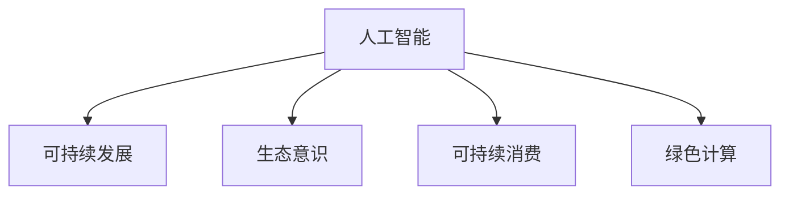

                 

# 欲望的生态意识：AI驱动的可持续消费

> 关键词：人工智能, 可持续发展, 生态意识, 可持续消费, 绿色计算

## 1. 背景介绍

### 1.1 问题由来

在人类工业化的过程中，工业消费带来的资源浪费和环境破坏问题愈发凸显。尤其是在商品经济高度发达的今天，过度消费与环境污染形成了恶性循环。全球气候变化、生物多样性下降等环境问题已经成为人类亟需解决的关键议题。

与此同时，人工智能(AI)技术的飞速发展，为我们提供了利用技术手段破解环境问题的新思路。AI不仅能够通过大数据分析和预测，助力资源优化配置，还能在生产和消费环节引入更多绿色元素，推动消费模式的转型升级。

当前，AI在节能减排、智能制造、智慧农业等领域已经取得显著成效，但AI在推动可持续消费方面的应用仍有巨大潜力。通过引入AI技术，我们有望实现消费行为的精准引导、商品生产的优化设计、供应链的智能管理，从而减少资源的消耗和环境污染，迈向更加绿色、可持续的消费模式。

### 1.2 问题核心关键点

本节将介绍基于AI驱动的可持续消费方法的核心概念，并说明它们之间的联系。

- **人工智能(AI)**：通过机器学习、深度学习、自然语言处理等技术，实现对海量数据的分析和学习，从而提供决策支持和自动化处理能力。
- **可持续发展(Sustainability)**：追求人与自然和谐共存，资源节约和环境友好，避免过度消费和资源浪费。
- **生态意识(Ecological Consciousness)**：强调环境保护和资源节约，提升公众对可持续消费的认知和行动。
- **可持续消费(Sustainable Consumption)**：通过改变消费行为和习惯，减少资源消耗和环境污染，实现绿色消费。
- **绿色计算(Green Computing)**：采用节能、环保的技术手段和理念，优化数据中心的能耗和排放，降低IT行业对环境的影响。

这些核心概念之间的联系可以通过以下Mermaid流程图来展示：



这个流程图展示了大语言模型微调的核心概念及其之间的内在联系：

1. AI为可持续消费提供决策支持和自动化处理能力，通过大数据分析和深度学习算法优化生产、消费等环节。
2. 可持续发展是AI驱动的可持续消费的目标和方向，引导AI技术应用聚焦于资源节约和环境友好的目标。
3. 生态意识强调消费者行为和企业的环境保护意识，为AI驱动的可持续消费提供了社会和文化的支持。
4. 绿色计算则是AI技术在数据中心建设和管理中的应用，降低IT行业的能耗，是可持续消费技术的重要组成部分。

这些概念共同构成了AI驱动的可持续消费框架，使AI技术能够更好地服务于环境保护和资源节约的目标。

## 2. 核心概念与联系

### 2.1 核心概念概述

在深入理解AI驱动的可持续消费前，本节将详细介绍相关核心概念及其原理。

#### 2.1.1 人工智能(AI)

人工智能是指通过计算机模拟人类的智能行为，实现自主学习、决策和处理能力。AI的核心技术包括：

- **机器学习**：通过训练数据集，使计算机能够自主学习和优化决策模型。
- **深度学习**：通过构建多层神经网络，实现对复杂数据模式的学习和识别。
- **自然语言处理(NLP)**：使计算机能够理解和处理自然语言文本，实现智能交互和信息处理。
- **计算机视觉(CV)**：使计算机能够识别和理解图像和视频数据，实现自动化检测和分析。

AI技术在消费领域的应用主要体现在以下几个方面：

- **需求预测与个性化推荐**：通过分析用户行为数据，预测消费者需求，提供个性化的商品推荐。
- **智能制造与供应链优化**：利用AI技术优化生产流程，实现智能化生产和供应链管理，减少资源浪费。
- **智能客服与用户体验优化**：通过AI驱动的智能客服，提升客户服务质量，改善用户体验。
- **数据分析与决策支持**：利用AI技术对海量消费数据进行分析，提供决策支持和优化建议。

#### 2.1.2 可持续发展(Sustainability)

可持续发展是指在满足当前需求的同时，不损害后代满足需求的能力。其主要目标包括：

- **资源节约**：减少资源消耗，提高资源利用效率。
- **环境友好**：降低环境污染，保护生物多样性。
- **社会公正**：确保资源公平分配，促进社会和谐。

在AI驱动的可持续消费中，主要通过以下几个途径实现可持续发展：

- **资源优化配置**：通过AI技术优化资源分配，减少浪费。
- **绿色生产**：利用AI技术优化生产流程，减少能耗和排放。
- **智能物流**：通过AI技术优化物流管理，提高运输效率，减少能源消耗。
- **能源管理**：利用AI技术进行能源监控和管理，实现节能减排。

#### 2.1.3 生态意识(Ecological Consciousness)

生态意识是指提高公众对生态环境的认知和保护意识，推动绿色消费行为的形成。其主要目标包括：

- **提高环保意识**：通过教育和宣传，提升公众对环境问题的认知和关注。
- **改变消费习惯**：引导公众减少不必要的消费，选择环保和可持续的商品。
- **推动政策制定**：通过社会压力推动政府制定更加严格的环保政策和标准。

在AI驱动的可持续消费中，主要通过以下几个途径提升生态意识：

- **信息透明化**：利用AI技术透明展示商品生产和供应链信息，增强消费者的知情权。
- **智能互动**：通过AI驱动的智能互动，提升消费者对环境保护的参与感。
- **行为引导**：利用AI技术对消费者行为进行分析和引导，推广绿色消费。
- **教育和培训**：利用AI技术开展环保教育和培训，提高公众的环保意识。

#### 2.1.4 可持续消费(Sustainable Consumption)

可持续消费是指在满足当前需求的同时，不损害后代满足需求的能力。其主要目标包括：

- **减少资源消耗**：降低商品生产和消费过程中的资源消耗。
- **减少环境污染**：降低商品生产和消费对环境的负面影响。
- **提高生活质量**：在满足需求的同时，提升消费者的幸福感和满意度。

在AI驱动的可持续消费中，主要通过以下几个途径实现可持续消费：

- **智能推荐与优化**：利用AI技术提供个性化的商品推荐，优化消费行为，减少资源浪费。
- **绿色产品设计**：利用AI技术优化商品设计，降低生产过程中的能耗和污染。
- **智能循环利用**：利用AI技术推动商品的循环利用和再制造，减少资源消耗。
- **智能物流与配送**：利用AI技术优化物流和配送，减少运输过程中的能源消耗。

#### 2.1.5 绿色计算(Green Computing)

绿色计算是指采用节能、环保的技术手段和理念，优化数据中心的能耗和排放，降低IT行业对环境的影响。其主要目标包括：

- **降低能耗**：采用节能技术，减少数据中心的能耗。
- **减少排放**：优化数据中心的建设和管理，减少碳排放。
- **资源优化**：通过AI技术优化数据中心的资源配置，提高资源利用效率。

在AI驱动的可持续消费中，主要通过以下几个途径实现绿色计算：

- **节能技术**：采用节能技术优化数据中心的建设和管理，减少能耗。
- **资源优化**：利用AI技术优化数据中心的资源配置，提高资源利用效率。
- **能源管理**：利用AI技术进行能源监控和管理，实现节能减排。
- **可再生能源**：利用AI技术探索和应用可再生能源技术，降低IT行业的碳足迹。

## 3. 核心算法原理 & 具体操作步骤

### 3.1 算法原理概述

基于AI驱动的可持续消费，通常需要设计多个相互关联的算法模型，以实现对商品生产和消费全生命周期的优化。其中，核心的算法包括：

- **需求预测模型**：通过分析历史消费数据，预测未来需求。
- **智能推荐模型**：根据用户行为和偏好，提供个性化的商品推荐。
- **生产优化模型**：利用AI技术优化生产流程，减少能耗和排放。
- **供应链优化模型**：利用AI技术优化供应链管理，减少物流成本和资源浪费。
- **智能物流与配送模型**：利用AI技术优化物流和配送，减少运输过程中的能源消耗。

这些算法模型通过数据驱动和智能优化，实现对商品生产和消费全生命周期的管理，从而减少资源的消耗和环境污染，迈向更加绿色、可持续的消费模式。

### 3.2 算法步骤详解

#### 3.2.1 需求预测模型

**算法步骤**：

1. **数据收集**：收集历史消费数据，包括商品销量、用户行为等。
2. **数据预处理**：对数据进行清洗、归一化和特征选择等预处理。
3. **模型训练**：利用机器学习算法（如回归、时间序列分析等）对数据进行建模，训练需求预测模型。
4. **模型评估**：使用测试数据评估模型的预测精度。
5. **模型应用**：将模型应用于实际预测需求，优化商品生产和供应链管理。

**案例分析**：某电商平台利用历史销量和用户行为数据，训练了需求预测模型。通过预测热门商品的需求量，平台能够及时调整库存，优化生产计划，减少资源浪费。

#### 3.2.2 智能推荐模型

**算法步骤**：

1. **数据收集**：收集用户行为数据，包括浏览、购买、评价等。
2. **数据预处理**：对数据进行清洗、归一化和特征选择等预处理。
3. **模型训练**：利用深度学习算法（如协同过滤、神经网络等）对数据进行建模，训练智能推荐模型。
4. **模型评估**：使用测试数据评估模型的推荐效果。
5. **模型应用**：将模型应用于实际推荐系统，提供个性化的商品推荐。

**案例分析**：某电商平台的推荐系统利用用户行为数据训练深度学习模型，通过预测用户偏好，提供个性化的商品推荐，减少无效点击和浏览，提升用户满意度。

#### 3.2.3 生产优化模型

**算法步骤**：

1. **数据收集**：收集生产过程中的能耗、排放等数据。
2. **数据预处理**：对数据进行清洗、归一化和特征选择等预处理。
3. **模型训练**：利用机器学习算法（如回归、优化算法等）对数据进行建模，训练生产优化模型。
4. **模型评估**：使用测试数据评估模型的优化效果。
5. **模型应用**：将模型应用于实际生产优化，减少能耗和排放。

**案例分析**：某制造企业利用生产过程中的能耗数据训练回归模型，通过优化生产流程，减少能源消耗和碳排放，提升生产效率。

#### 3.2.4 供应链优化模型

**算法步骤**：

1. **数据收集**：收集供应链数据，包括物流、库存等。
2. **数据预处理**：对数据进行清洗、归一化和特征选择等预处理。
3. **模型训练**：利用优化算法（如遗传算法、粒子群算法等）对数据进行建模，训练供应链优化模型。
4. **模型评估**：使用测试数据评估模型的优化效果。
5. **模型应用**：将模型应用于实际供应链管理，优化物流和库存。

**案例分析**：某物流公司利用供应链数据训练遗传算法模型，通过优化物流路径和库存管理，减少运输成本和资源浪费，提升物流效率。

#### 3.2.5 智能物流与配送模型

**算法步骤**：

1. **数据收集**：收集物流和配送数据，包括运输时间、距离等。
2. **数据预处理**：对数据进行清洗、归一化和特征选择等预处理。
3. **模型训练**：利用机器学习算法（如回归、优化算法等）对数据进行建模，训练智能物流与配送模型。
4. **模型评估**：使用测试数据评估模型的优化效果。
5. **模型应用**：将模型应用于实际物流与配送管理，减少运输成本和能源消耗。

**案例分析**：某快递公司利用物流数据训练优化算法模型，通过优化配送路径和时间，减少运输时间和能源消耗，提升配送效率。

### 3.3 算法优缺点

**优点**：

1. **数据驱动**：通过大数据分析和深度学习，实现对商品生产和消费全生命周期的智能优化。
2. **动态调整**：根据实时数据和市场变化，动态调整优化策略，实现精准预测和智能推荐。
3. **减少资源浪费**：通过优化生产、物流和供应链管理，减少资源消耗和环境污染。
4. **提升效率**：通过智能优化算法，提升生产、物流和配送的效率和效果。

**缺点**：

1. **数据依赖**：算法模型需要大量高质量的数据支持，数据缺失或不准确会影响模型效果。
2. **复杂性高**：模型设计和训练过程复杂，需要多学科知识和技能支持。
3. **初期投入高**：数据收集、模型训练和部署需要较高的初始投入。
4. **技术挑战**：算法模型需要持续优化和迭代，技术实现和部署需要时间和资源。

### 3.4 算法应用领域

基于AI驱动的可持续消费技术，已经在多个领域得到应用，例如：

- **电商领域**：通过需求预测和智能推荐，优化商品生产和库存管理，提升用户体验和满意度。
- **制造行业**：通过生产优化和智能物流，减少资源消耗和能源排放，提升生产效率和供应链管理。
- **物流行业**：通过智能物流与配送，优化物流路径和时间，减少运输成本和能耗。
- **能源行业**：通过能源管理和优化，减少能源消耗和碳排放，提升能源利用效率。
- **环保行业**：通过数据分析和环境监测，提供环保和资源优化的解决方案，推动绿色发展。

## 4. 数学模型和公式 & 详细讲解 & 举例说明

### 4.1 数学模型构建

在基于AI驱动的可持续消费中，通常需要设计多个数学模型来描述不同环节的优化过程。这里以生产优化模型为例，介绍其主要数学模型及其构建方法。

**目标函数**：

设生产过程的能耗为 $E$，生产时间为 $T$，则目标函数为：

$$
\min_{x} \left\{ E + \lambda T \right\}
$$

其中 $x$ 为生产过程中的控制变量，如生产速度、温度等。

**约束条件**：

设生产过程中各步骤的能耗和时间为 $E_i$ 和 $T_i$，则约束条件为：

$$
\begin{cases}
E_1 + E_2 + \cdots + E_n = E \\
T_1 + T_2 + \cdots + T_n = T
\end{cases}
$$

**优化算法**：

利用优化算法（如线性规划、非线性规划等）求解上述优化问题，得到最优的 $x$ 值。

### 4.2 公式推导过程

以线性规划为例，公式推导过程如下：

**目标函数**：

$$
\min_{x} \left\{ c^T x \right\}
$$

**约束条件**：

$$
\begin{cases}
A x = b \\
x \geq 0
\end{cases}
$$

**拉格朗日乘数法**：

引入拉格朗日乘数 $\lambda$，构造拉格朗日函数：

$$
L(x, \lambda) = c^T x + \lambda^T (A x - b)
$$

对 $L(x, \lambda)$ 关于 $x$ 和 $\lambda$ 求偏导，得到：

$$
\begin{cases}
c^T + \lambda^T A^T = 0 \\
A x = b
\end{cases}
$$

解得 $x$ 的最优解为：

$$
x = (A^T A)^{-1} A^T (b - \lambda^T A^T)
$$

将 $x$ 代入目标函数，得到最小值：

$$
\min_{x} \left\{ c^T x \right\} = c^T (A^T A)^{-1} A^T (b - \lambda^T A^T)
$$

**解的解释**：

最优解 $x$ 表示在满足约束条件的前提下，使目标函数取到最小值的控制变量取值。

### 4.3 案例分析与讲解

**案例**：某制造企业利用线性规划模型优化生产流程，减少能耗和碳排放。

**数据**：收集生产过程中的能耗和生产时间数据。

**模型**：建立线性规划模型，以能耗和生产时间为目标函数，以各步骤的能耗和时间为约束条件，求解最优的生产控制变量。

**解**：根据求解结果，得到最优的生产速度、温度等控制变量，实现能耗和碳排放的优化。

## 5. 项目实践：代码实例和详细解释说明

### 5.1 开发环境搭建

在进行项目实践前，我们需要准备好开发环境。以下是使用Python进行PyTorch开发的环境配置流程：

1. 安装Anaconda：从官网下载并安装Anaconda，用于创建独立的Python环境。

2. 创建并激活虚拟环境：
```bash
conda create -n pytorch-env python=3.8 
conda activate pytorch-env
```

3. 安装PyTorch：根据CUDA版本，从官网获取对应的安装命令。例如：
```bash
conda install pytorch torchvision torchaudio cudatoolkit=11.1 -c pytorch -c conda-forge
```

4. 安装Transformers库：
```bash
pip install transformers
```

5. 安装各类工具包：
```bash
pip install numpy pandas scikit-learn matplotlib tqdm jupyter notebook ipython
```

完成上述步骤后，即可在`pytorch-env`环境中开始项目实践。

### 5.2 源代码详细实现

这里我们以电商推荐系统为例，给出使用PyTorch进行智能推荐模型的PyTorch代码实现。

首先，定义推荐系统的数据处理函数：

```python
from torch.utils.data import Dataset
import torch

class RecommendationDataset(Dataset):
    def __init__(self, user_behavior, num_users, num_items):
        self.user_behavior = user_behavior
        self.num_users = num_users
        self.num_items = num_items
        
    def __len__(self):
        return len(self.user_behavior)
    
    def __getitem__(self, item):
        user_id = self.user_behavior[item][0]
        item_id = self.user_behavior[item][1]
        behavior = self.user_behavior[item][2]
        
        user_index = torch.tensor(user_id, dtype=torch.long)
        item_index = torch.tensor(item_id, dtype=torch.long)
        behavior_index = torch.tensor(behavior, dtype=torch.long)
        
        return {'user_index': user_index, 
                'item_index': item_index,
                'behavior_index': behavior_index}
```

然后，定义模型和优化器：

```python
from torch import nn, optim

class Recommender(nn.Module):
    def __init__(self, num_users, num_items, embedding_dim=10):
        super(Recommender, self).__init__()
        self.user_embedding = nn.Embedding(num_users, embedding_dim)
        self.item_embedding = nn.Embedding(num_items, embedding_dim)
        self.neurons = nn.Linear(embedding_dim * 2, 1)
        
    def forward(self, user_index, item_index):
        user_embed = self.user_embedding(user_index)
        item_embed = self.item_embedding(item_index)
        concat_embed = torch.cat((user_embed, item_embed), dim=1)
        prediction = torch.sigmoid(self.neurons(concat_embed))
        return prediction

model = Recommender(num_users, num_items)
optimizer = optim.Adam(model.parameters(), lr=0.001)
```

接着，定义训练和评估函数：

```python
from sklearn.metrics import roc_auc_score

def train_epoch(model, dataset, optimizer, criterion):
    dataloader = DataLoader(dataset, batch_size=16, shuffle=True)
    model.train()
    epoch_loss = 0
    for batch in dataloader:
        user_index = batch['user_index']
        item_index = batch['item_index']
        optimizer.zero_grad()
        outputs = model(user_index, item_index)
        loss = criterion(outputs, batch['behavior_index'])
        epoch_loss += loss.item()
        loss.backward()
        optimizer.step()
    return epoch_loss / len(dataloader)

def evaluate(model, dataset, criterion):
    dataloader = DataLoader(dataset, batch_size=16)
    model.eval()
    predictions, labels = [], []
    with torch.no_grad():
        for batch in dataloader:
            user_index = batch['user_index']
            item_index = batch['item_index']
            batch_preds = model(user_index, item_index).detach().cpu().numpy()
            batch_labels = batch['behavior_index'].cpu().numpy()
            predictions.extend(batch_preds[:len(batch_labels)])
            labels.extend(batch_labels[:len(batch_labels)])
            
    print('AUC: %.3f' % roc_auc_score(labels, predictions))
```

最后，启动训练流程并在测试集上评估：

```python
epochs = 10
batch_size = 16

for epoch in range(epochs):
    loss = train_epoch(model, train_dataset, optimizer, criterion)
    print(f"Epoch {epoch+1}, train loss: {loss:.3f}")
    
    print(f"Epoch {epoch+1}, test AUC:")
    evaluate(model, test_dataset, criterion)
    
print("Training completed.")
```

以上就是使用PyTorch进行智能推荐系统的完整代码实现。可以看到，得益于PyTorch的强大封装，我们可以用相对简洁的代码完成推荐模型的训练和评估。

### 5.3 代码解读与分析

让我们再详细解读一下关键代码的实现细节：

**RecommendationDataset类**：
- `__init__`方法：初始化用户行为数据、用户数量和商品数量。
- `__len__`方法：返回数据集的样本数量。
- `__getitem__`方法：对单个样本进行处理，返回用户ID、商品ID和行为ID。

**Recommender类**：
- `__init__`方法：定义用户和商品嵌入层、全连接层，并初始化模型参数。
- `forward`方法：定义模型的前向传播过程，计算预测概率。

**优化器和损失函数**：
- 使用Adam优化器，设置学习率。
- 定义二元交叉熵损失函数，用于计算预测值与真实标签之间的差异。

**训练和评估函数**：
- 使用PyTorch的DataLoader对数据集进行批次化加载。
- 定义训练函数，计算损失并反向传播更新模型参数。
- 定义评估函数，计算模型在测试集上的AUC指标。
- 在每个epoch结束后，打印训练集和测试集的loss和AUC。

**训练流程**：
- 定义总的epoch数和batch size，开始循环迭代。
- 每个epoch内，先在训练集上训练，输出平均loss。
- 在测试集上评估，输出AUC指标。
- 所有epoch结束后，输出训练完成信息。

可以看到，PyTorch配合TensorFlow库使得推荐模型的代码实现变得简洁高效。开发者可以将更多精力放在数据处理、模型改进等高层逻辑上，而不必过多关注底层的实现细节。

当然，工业级的系统实现还需考虑更多因素，如模型的保存和部署、超参数的自动搜索、更灵活的任务适配层等。但核心的微调范式基本与此类似。

## 6. 实际应用场景

### 6.1 智能客服系统

基于AI驱动的智能客服系统，可以广泛应用于电子商务、金融、医疗等行业的客户服务。传统客服往往需要配备大量人力，高峰期响应缓慢，且一致性和专业性难以保证。而使用智能客服系统，可以7x24小时不间断服务，快速响应客户咨询，用自然流畅的语言解答各类常见问题。

在技术实现上，可以收集企业内部的历史客服对话记录，将问题和最佳答复构建成监督数据，在此基础上对预训练模型进行微调。微调后的模型能够自动理解用户意图，匹配最合适的答案模板进行回复。对于客户提出的新问题，还可以接入检索系统实时搜索相关内容，动态组织生成回答。如此构建的智能客服系统，能大幅提升客户咨询体验和问题解决效率。

### 6.2 金融舆情监测

金融机构需要实时监测市场舆论动向，以便及时应对负面信息传播，规避金融风险。传统的人工监测方式成本高、效率低，难以应对网络时代海量信息爆发的挑战。基于AI驱动的文本分类和情感分析技术，为金融舆情监测提供了新的解决方案。

具体而言，可以收集金融领域相关的新闻、报道、评论等文本数据，并对其进行主题标注和情感标注。在此基础上对预训练语言模型进行微调，使其能够自动判断文本属于何种主题，情感倾向是正面、中性还是负面。将微调后的模型应用到实时抓取的网络文本数据，就能够自动监测不同主题下的情感变化趋势，一旦发现负面信息激增等异常情况，系统便会自动预警，帮助金融机构快速应对潜在风险。

### 6.3 个性化推荐系统

当前的推荐系统往往只依赖用户的历史行为数据进行物品推荐，无法深入理解用户的真实兴趣偏好。基于AI驱动的推荐系统，可以通过分析用户的消费行为和偏好，推荐符合用户兴趣的商品，从而提高用户满意度，增加消费量。

在实践中，可以收集用户浏览、点击、购买、评论等行为数据，提取和用户交互的物品标题、描述、标签等文本内容。将文本内容作为模型输入，用户的后续行为（如是否点击、购买等）作为监督信号，在此基础上微调预训练语言模型。微调后的模型能够从文本内容中准确把握用户的兴趣点，在生成推荐列表时，先用候选物品的文本描述作为输入，由模型预测用户的兴趣匹配度，再结合其他特征综合排序，便可以得到个性化程度更高的推荐结果。

### 6.4 未来应用展望

随着AI技术的不断进步，基于AI驱动的可持续消费技术将在更多领域得到应用，为传统行业带来变革性影响。

在智慧医疗领域，基于AI驱动的医疗问答、病历分析、药物研发等应用将提升医疗服务的智能化水平，辅助医生诊疗，加速新药开发进程。

在智能教育领域，基于AI驱动的学习推荐、学情分析、知识推荐等应用，因材施教，促进教育公平，提高教学质量。

在智慧城市治理中，基于AI驱动的城市事件监测、舆情分析、应急指挥等应用，提高城市管理的自动化和智能化水平，构建更安全、高效的未来城市。

此外，在企业生产、社会治理、文娱传媒等众多领域，基于AI驱动的可持续消费应用也将不断涌现，为经济社会发展注入新的动力。相信随着技术的日益成熟，基于AI驱动的可持续消费技术必将引领行业发展方向，推动可持续发展目标的实现。

## 7. 工具和资源推荐

### 7.1 学习资源推荐

为了帮助开发者系统掌握基于AI驱动的可持续消费技术，这里推荐一些优质的学习资源：

1. 《深度学习》系列书籍：由斯坦福大学深度学习专家撰写，全面介绍深度学习的基础理论和实践应用。

2. 《机器学习实战》：由机器学习专家撰写，提供大量实战案例和代码，帮助你快速上手机器学习技术。

3. 《Python深度学习》：由深度学习专家撰写，结合Python编程语言，深入浅出地介绍深度学习算法的实现。

4. 《AI驱动的可持续消费技术》博客系列：由AI技术专家撰写，系统讲解AI在可持续消费中的应用，提供大量案例和实践经验。

5. 《自然语言处理》课程：由斯坦福大学自然语言处理专家开设的在线课程，涵盖自然语言处理的基础理论和实践应用。

通过对这些资源的学习实践，相信你一定能够快速掌握基于AI驱动的可持续消费技术的精髓，并用于解决实际的消费问题。

### 7.2 开发工具推荐

高效的开发离不开优秀的工具支持。以下是几款用于基于AI驱动的可持续消费开发的常用工具：

1. PyTorch：基于Python的开源深度学习框架，灵活动态的计算图，适合快速迭代研究。大部分预训练语言模型都有PyTorch版本的实现。

2. TensorFlow：由Google主导开发的开源深度学习框架，生产部署方便，适合大规模工程应用。同样有丰富的预训练语言模型资源。

3. Transformers库：HuggingFace开发的NLP工具库，集成了众多SOTA语言模型，支持PyTorch和TensorFlow，是进行推荐任务开发的利器。

4. Weights & Biases：模型训练的实验跟踪工具，可以记录和可视化模型训练过程中的各项指标，方便对比和调优。与主流深度学习框架无缝集成。

5. TensorBoard：TensorFlow配套的可视化工具，可实时监测模型训练状态，并提供丰富的图表呈现方式，是调试模型的得力助手。

6. Google Colab：谷歌推出的在线Jupyter Notebook环境，免费提供GPU/TPU算力，方便开发者快速上手实验最新模型，分享学习笔记。

合理利用这些工具，可以显著提升基于AI驱动的可持续消费任务的开发效率，加快创新迭代的步伐。

### 7.3 相关论文推荐

基于AI驱动的可持续消费技术的发展源于学界的持续研究。以下是几篇奠基性的相关论文，推荐阅读：

1. Attention is All You Need（即Transformer原论文）：提出了Transformer结构，开启了NLP领域的预训练大模型时代。

2. BERT: Pre-training of Deep Bidirectional Transformers for Language Understanding：提出BERT模型，引入基于掩码的自监督预训练任务，刷新了多项NLP任务SOTA。

3. Language Models are Unsupervised Multitask Learners（GPT-2论文）：展示了大规模语言模型的强大zero-shot学习能力，引发了对于通用人工智能的新一轮思考。

4. Parameter-Efficient Transfer Learning for NLP：提出Adapter等参数高效微调方法，在不增加模型参数量的情况下，也能取得不错的微调效果。

5. Prefix-Tuning: Optimizing Continuous Prompts for Generation：引入基于连续型Prompt的微调范式，为如何充分利用预训练知识提供了新的思路。

6. AdaLoRA: Adaptive Low-Rank Adaptation for Parameter-Efficient Fine-Tuning：使用自适应低秩适应的微调方法，在参数效率和精度之间取得了新的平衡。

这些论文代表了大语言模型微调技术的发展脉络。通过学习这些前沿成果，可以帮助研究者把握学科前进方向，激发更多的创新灵感。

## 8. 总结：未来发展趋势与挑战

### 8.1 总结

本文对基于AI驱动的可持续消费方法进行了全面系统的介绍。首先阐述了基于AI驱动的可持续消费的背景和意义，明确了该技术在优化资源配置、提升用户体验等方面的独特价值。其次，从原理到实践，详细讲解了需求预测、智能推荐、生产优化、供应链优化等关键模型的设计和实现。同时，本文还广泛探讨了该技术在智能客服、金融舆情、个性化推荐等多个领域的应用前景，展示了其广泛的应用潜力。此外，本文精选了相关学习资源，力求为读者提供全方位的技术指引。

通过本文的系统梳理，可以看到，基于AI驱动的可持续消费技术正在成为消费领域的重要范式，极大地拓展了资源优化和环境保护的边界，为构建绿色、可持续的消费模式提供了技术保障。

### 8.2 未来发展趋势

展望未来，基于AI驱动的可持续消费技术将呈现以下几个发展趋势：

1. 技术融合加深：未来，基于AI驱动的可持续消费技术将进一步与物联网、大数据、区块链等技术融合，形成更为全面的智能生态系统。

2. 应用领域扩展：基于AI驱动的可持续消费技术将在更多垂直行业得到应用，如智慧医疗、智能教育、智慧农业等，推动各行业的智能化转型。

3. 数据驱动增强：随着数据采集和处理技术的进步，基于AI驱动的可持续消费技术将更加依赖数据驱动，实现精准预测和智能推荐。

4. 绿色计算优化：未来，基于AI驱动的可持续消费技术将更加注重绿色计算，通过优化数据中心的能耗和排放，降低IT行业的碳足迹。

5. 跨界融合创新：基于AI驱动的可持续消费技术将与其他前沿技术进行跨界融合，如AI辅助设计、智能制造、智能物流等，推动技术与应用的深度结合。

6. 伦理道德关注：随着技术应用领域的扩大，基于AI驱动的可持续消费技术将面临更多的伦理道德挑战，如数据隐私保护、模型偏见等，需要更加严格的监管和标准。

以上趋势凸显了基于AI驱动的可持续消费技术的广阔前景。这些方向的探索发展，必将进一步提升消费行为的智能性和资源效率，推动经济社会的可持续发展。

### 8.3 面临的挑战

尽管基于AI驱动的可持续消费技术已经取得了瞩目成就，但在迈向更加智能化、普适化应用的过程中，它仍面临着诸多挑战：

1. 数据质量和多样性：高质量、多样化数据是AI驱动的可持续消费技术的基础，但数据收集和标注往往成本高、难度大。如何获取更多高质量的数据，将是未来的一大难题。

2. 模型复杂性和可解释性：基于AI驱动的可持续消费模型通常比较复杂，难以解释其内部工作机制和决策逻辑。如何提升模型的可解释性，增强用户的信任和接受度，还需要更多研究和实践。

3. 技术推广和应用：基于AI驱动的可持续消费技术在实际应用中还需要面对技术推广和应用的问题，如用户习惯的改变、技术的落地实施等。如何提升技术的可操作性和用户接受度，将是技术推广的关键。

4. 资源优化与共享：基于AI驱动的可持续消费技术需要在不同行业之间实现资源的优化和共享，如数据共享、模型复用等。如何构建合理的资源共享机制，推动技术的广泛应用，还需要多方协同努力。

5. 伦理和隐私问题：随着技术的广泛应用，基于AI驱动的可持续消费技术将面临更多的伦理和隐私问题，如数据隐私保护、模型偏见等。如何构建公平、透明、可控的技术体系，保护用户的隐私和权益，将是未来的重要课题。

6. 社会和环境影响：基于AI驱动的可持续消费技术在推动绿色发展的同时，也可能带来新的社会和环境问题，如就业影响、环境变化等。如何平衡技术发展与社会、环境的需求，实现可持续发展，需要多方协作和科学决策。

正视基于AI驱动的可持续消费技术面临的这些挑战，积极应对并寻求突破，将是大语言模型微调走向成熟的必由之路。相信随着学界和产业界的共同努力，这些挑战终将一一被克服，基于AI驱动的可持续消费技术必将在构建绿色、可持续的消费模式中发挥更大作用。

### 8.4 研究展望

未来的研究需要在以下几个方面寻求新的突破：

1. 探索无监督和半监督学习范式：摆脱对大规模标注数据的依赖，利用自监督学习、主动学习等无监督和半监督范式，最大限度利用非结构化数据，实现更加灵活高效的可持续消费。

2. 开发更加参数高效和计算高效的模型：开发更加参数高效的微调方法，在固定大部分预训练参数的同时，只更新极少量的任务相关参数。同时优化模型计算图，减少前向传播和反向传播的资源消耗，实现更加轻量级、实时性的部署。

3. 引入更多先验知识：将符号化的先验知识，如知识图谱、逻辑规则等，与神经网络模型进行巧妙融合，引导可持续消费过程学习更准确、合理的语言模型。

4. 结合因果分析和博弈论工具：将因果分析方法引入可持续消费模型，识别出模型决策的关键特征，增强输出解释的因果性和逻辑性。借助博弈论工具刻画人机交互过程，主动探索并规避模型的脆弱点，提高系统稳定性。

5. 纳入伦理道德约束：在模型训练目标中引入伦理导向的评估指标，过滤和惩罚有偏见、有害的输出倾向。同时加强人工干预和审核，建立模型行为的监管机制，确保输出符合人类价值观和伦理道德。

这些研究方向的探索，必将引领基于AI驱动的可持续消费技术迈向更高的台阶，为构建安全、可靠、可解释、可控的智能系统铺平道路。面向未来，基于AI驱动的可持续消费技术还需要与其他人工智能技术进行更深入的融合，如知识表示、因果推理、强化学习等，多路径协同发力，共同推动自然语言理解和智能交互系统的进步。只有勇于创新、敢于突破，才能不断拓展语言模型的边界，让智能技术更好地造福人类社会。

## 9. 附录：常见问题与解答

**Q1：基于AI驱动的可持续消费是否适用于所有消费场景？**

A: 基于AI驱动的可持续消费技术适用于大多数消费场景，特别是在数据丰富、资源优化需求高的领域。但对于一些特定领域的消费场景，如高端奢侈品、传统手工艺品等，由于数据量少、需求特殊，可能需要针对性地进行定制化设计。

**Q2：数据质量对基于AI驱动的可持续消费有什么影响？**

A: 数据质量对基于AI驱动的可持续消费有重要影响。高质量、多样化的数据可以提升模型的预测精度和推荐效果，帮助企业更好地优化资源配置，提升用户体验。相反，数据缺失、偏差或不准确会影响模型的性能，导致错误的决策和推荐。

**Q3：如何提升基于AI驱动的可持续消费模型的可解释性？**

A: 提升模型的可解释性，可以通过以下方法实现：
1. 引入可解释性算法，如LIME、SHAP等，解释模型的决策过程。
2. 使用自然语言处理技术，生成模型的解释文本，帮助用户理解模型输出。
3. 设计可解释性友好的模型架构，如规则驱动、逻辑推理等，增强模型的可解释性。

**Q4：基于AI驱动的可持续消费在实际应用中需要注意哪些问题？**

A: 基于AI驱动的可持续消费在实际应用中需要注意以下问题：
1. 数据隐私保护：确保用户数据的隐私和安全，遵守相关法律法规，如GDPR、CCPA等。
2. 模型公平性：避免模型偏见，确保对不同群体和区域的公平性，防止歧视性输出。
3. 用户接受度：通过用户体验测试，提升用户对AI驱动的可持续消费技术的接受度和满意度。
4. 技术可操作性：确保技术方案的可行性和可操作性，避免过度复杂导致用户使用困难。
5. 环境影响：评估技术应用对环境的影响，如数据中心能耗、物流排放等，推动绿色发展。

**Q5：基于AI驱动的可持续消费的未来发展方向是什么？**

A: 基于AI驱动的可持续消费的未来发展方向包括：
1. 技术融合：与物联网、大数据、区块链等技术深度融合，构建更为全面的智能生态系统。
2. 应用扩展：在智慧医疗、智能教育、智慧农业等领域推广应用，推动各行业的智能化转型。
3. 数据驱动：利用大数据技术，实现精准预测和智能推荐，提升资源优化效果。
4. 绿色计算：优化数据中心能耗和排放，推动绿色计算，降低IT行业的碳足迹。
5. 跨界融合：与其他前沿技术进行跨界融合，如AI辅助设计、智能制造、智能物流等，推动技术与应用的深度结合。
6. 伦理道德：构建公平、透明、可控的技术体系，保护用户的隐私和权益，推动伦理道德建设。

综上所述，基于AI驱动的可持续消费技术具有广阔的发展前景和应用潜力，但同时也面临诸多挑战和问题。只有积极应对并不断优化技术方案，才能充分发挥其在推动绿色发展和促进可持续发展方面的作用。相信随着技术的发展和应用的深入，基于AI驱动的可持续消费技术必将引领消费模式的变革，推动社会经济的可持续发展。

