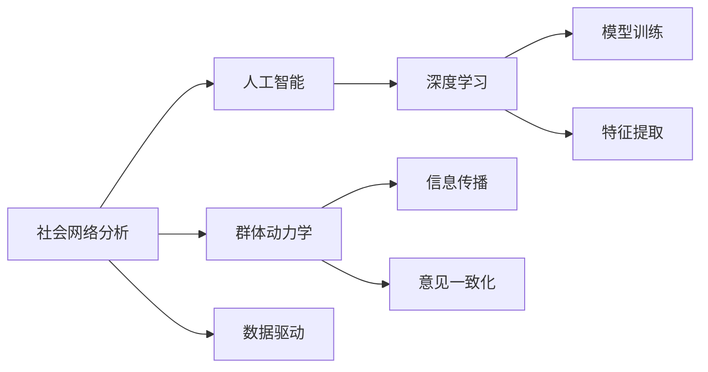

                 

# 欲望社会网络分析：AI驱动的群体动力学研究

> 关键词：社会网络分析,群体动力学,人工智能,深度学习,数据驱动,行为预测,决策优化

## 1. 背景介绍

### 1.1 问题由来

近年来，随着社会化媒体、移动互联网和大数据技术的普及，人类社会的行为模式正在发生深刻的变革。个体的社交行为不再孤立，而是嵌入一个复杂的网络结构中。大规模社交数据汇聚成海量的网络数据，呈现出个体与群体、行为与结构间的复杂关联。

如何从这些海量数据中挖掘出有价值的信息，理解个体和群体间的相互作用，预测未来的社会动态，成为了当前研究的热点。传统的社会科学方法和技术，如调查问卷、统计分析等，已难以满足现代大规模数据和复杂网络结构的处理需求。

### 1.2 问题核心关键点

1. **网络结构分析**：理解网络中个体之间的连接关系，如好友关系、关注关系、合作关系等，对网络行为和结构的影响。
2. **群体动力学**：研究群体内部成员间的互动，包括信息传播、情感交流、意见一致化等行为，以揭示群体行为模式。
3. **AI驱动**：利用人工智能技术和深度学习算法，从海量数据中提取高维特征，发现隐藏在数据背后的行为模式。
4. **决策优化**：利用数据分析和机器学习模型，优化社会决策，如营销策略、风险管理、公共政策等。

### 1.3 问题研究意义

1. **理解社会行为**：通过网络分析理解个体与群体行为模式，揭示社会现象背后的规律和机制。
2. **预测未来动态**：利用AI技术预测群体行为，辅助企业和社会组织进行决策，提升管理效率和响应速度。
3. **优化公共服务**：通过网络行为分析，优化公共政策和社会服务，提升社会治理的智能化水平。
4. **促进技术应用**：社会网络分析技术的广泛应用，将推动AI技术的落地，促进更多领域的技术革新。

## 2. 核心概念与联系

### 2.1 核心概念概述

本节将介绍几个关键概念及其相互联系，为理解文章后续内容打下基础。

#### 2.1.1 社会网络分析

社会网络分析(Social Network Analysis, SNA)是一种通过数学和统计方法，研究个体间关系及其模式的技术。其核心是建立个体的关系网络，分析个体和群体间的信息流动和互动行为，揭示社会结构和社会动态。

#### 2.1.2 群体动力学

群体动力学(Group Dynamics)研究群体内部成员间的相互作用，包括信息传播、意见一致化、群体极化等现象。通过数学模型和实验研究，揭示群体行为模式和特征。

#### 2.1.3 人工智能

人工智能(Artificial Intelligence, AI)利用算法和计算能力，从数据中提取模式，模拟人类智能行为。深度学习是AI技术的重要分支，通过多层神经网络模型，提取高维特征，实现复杂的模式识别和预测。

#### 2.1.4 数据驱动

数据驱动(Datadriven)是指通过分析大量数据，发现其中的规律和模式，用于指导决策和预测。在社会网络分析中，数据驱动方法通过海量社交数据，揭示个体和群体行为特征。

### 2.2 核心概念原理和架构的 Mermaid 流程图



此图展示了几个核心概念之间的关系：

- 社会网络分析通过数据驱动方法，揭示个体和群体行为特征。
- 群体动力学研究群体内部成员间的互动，揭示行为模式。
- 人工智能利用深度学习，从数据中提取高维特征，用于模型训练和行为预测。
- 数据驱动方法是社会网络分析和人工智能的共同基础，提供数据来源。

### 2.3 关键技术栈

实现社会网络分析的主要技术栈包括：

- **Python**：作为数据科学的主流语言，提供丰富的库和工具支持，如Pandas、NumPy、Scikit-learn等。
- **PyTorch**：深度学习框架，易于构建和调试复杂的神经网络模型。
- **Gephi**：网络可视化工具，支持大规模社交网络的数据可视化和分析。
- **TensorFlow**：另一种流行的深度学习框架，适用于大规模分布式计算。
- **Apache Spark**：大数据处理引擎，支持分布式数据处理和机器学习模型训练。

## 3. 核心算法原理 & 具体操作步骤

### 3.1 算法原理概述

本文将介绍基于深度学习的群体动力学分析方法，通过建立个体行为模型，分析群体间的互动行为，预测群体未来动态。

核心算法包括：

- **图卷积网络(Graph Convolutional Network, GNN)**：用于处理社交网络中的复杂关系，提取节点特征。
- **注意力机制(Attention Mechanism)**：在社交网络分析中，通过注意力机制，模型可以重点关注对群体行为有重要影响的关系。
- **强化学习(Reinforcement Learning, RL)**：通过强化学习模型，预测群体行为，优化决策策略。

### 3.2 算法步骤详解

#### 3.2.1 数据预处理

1. **数据采集**：从社交媒体平台、在线论坛、电子邮件系统等渠道，采集大规模社交数据。
2. **数据清洗**：去除噪音数据，处理缺失值和异常值，确保数据质量。
3. **特征工程**：提取和选择特征，包括个体属性、关系强度、社交网络结构等。

#### 3.2.2 图卷积网络(GNN)建模

1. **图构建**：将采集到的社交数据构建为图结构，每个个体为节点，关系为边。
2. **图卷积层**：使用图卷积层对节点特征进行卷积操作，提取局部特征。
3. **池化层**：对图卷积层的输出进行池化操作，聚合局部特征，形成全局特征。
4. **全连接层**：使用全连接层将全局特征映射到预测标签，如群体行为预测。

#### 3.2.3 注意力机制应用

1. **注意力权重计算**：计算每个节点与其他节点间的注意力权重，重点关注对群体行为有重要影响的关系。
2. **注意力卷积层**：使用注意力权重对节点特征进行加权卷积，强化对重要关系的关注。
3. **注意力池化层**：对加权后的特征进行池化操作，提高模型的鲁棒性和泛化能力。

#### 3.2.4 强化学习模型训练

1. **状态定义**：定义群体的状态，包括群体成员的特征、关系强度、行为模式等。
2. **奖励函数**：设计奖励函数，评估群体行为的优劣。
3. **策略优化**：使用强化学习算法，如深度Q网络(DQN)，优化群体决策策略，预测群体未来行为。

### 3.3 算法优缺点

#### 3.3.1 优点

1. **高效处理大规模数据**：图卷积网络可以高效处理大规模社交网络数据，提取高维特征。
2. **准确预测群体行为**：通过注意力机制和强化学习模型，可以准确预测群体行为，优化决策策略。
3. **多模态融合**：可以融合多种数据源，如文本、图像、视频等，提升模型的泛化能力。

#### 3.3.2 缺点

1. **计算复杂度高**：图卷积网络和强化学习模型计算复杂度较高，需要较长的训练时间和较高的计算资源。
2. **模型解释性不足**：复杂模型难以解释，难以理解模型的决策过程和行为机制。
3. **数据质量依赖**：模型效果依赖于数据质量和特征工程，需要高质量的标注数据和有效的特征选择。

### 3.4 算法应用领域

1. **市场营销**：预测消费者行为，优化广告投放策略，提升转化率。
2. **公共卫生**：预测疾病传播趋势，优化防控措施，提升公共卫生管理效率。
3. **金融风险管理**：预测市场波动，优化风险管理策略，降低金融风险。
4. **社会治理**：预测群体行为，优化政策制定，提升社会治理的智能化水平。
5. **电子商务**：预测用户行为，优化推荐系统，提升用户体验和销售转化率。

## 4. 数学模型和公式 & 详细讲解 & 举例说明

### 4.1 数学模型构建

本文采用图卷积网络和注意力机制的结合，构建群体动力学模型。

设社交网络图为 $G(V, E)$，其中 $V$ 为节点集合，$E$ 为边集合。每个节点 $v_i$ 表示个体，$x_i$ 表示节点特征向量。模型目标为预测群体行为 $y$。

### 4.2 公式推导过程

#### 4.2.1 图卷积网络公式

图卷积网络的公式如下：

$$
\mathbf{X}^{(l+1)} = \mathbf{D}^{-\frac{1}{2}}\mathbf{A}\mathbf{X}^{(l)}\mathbf{W}^{(l)}
$$

其中 $\mathbf{X}^{(l)}$ 表示第 $l$ 层的特征向量，$\mathbf{W}^{(l)}$ 表示卷积核矩阵，$\mathbf{A}$ 表示邻接矩阵，$\mathbf{D}$ 表示度数矩阵。

#### 4.2.2 注意力机制公式

注意力机制的公式如下：

$$
\alpha_{ij} = \frac{\exp(\mathbf{e}_i^\top \mathbf{q}_j)}{\sum_{k=1}^N \exp(\mathbf{e}_i^\top \mathbf{q}_k)}
$$

其中 $\alpha_{ij}$ 表示节点 $i$ 对节点 $j$ 的注意力权重，$\mathbf{e}_i$ 表示节点 $i$ 的特征向量，$\mathbf{q}_j$ 表示查询向量，通过计算得到每个节点 $i$ 对其他节点的注意力权重。

#### 4.2.3 强化学习模型公式

强化学习模型的公式如下：

$$
Q(s_t, a_t) = r_t + \gamma \max_{a_{t+1}} Q(s_{t+1}, a_{t+1})
$$

其中 $Q(s_t, a_t)$ 表示在状态 $s_t$ 下，采取动作 $a_t$ 的Q值，$r_t$ 表示即时奖励，$\gamma$ 表示折扣因子，$s_{t+1}$ 表示下一个状态。

### 4.3 案例分析与讲解

#### 4.3.1 案例1：市场营销

某电商平台利用社交网络分析，预测用户购买行为，优化广告投放策略。数据集包含用户社交网络、购买记录和广告投放数据。通过图卷积网络和注意力机制，提取用户社交特征和广告特征，使用深度Q网络模型优化广告投放策略，提升转化率。

#### 4.3.2 案例2：公共卫生

某公共卫生部门利用社交网络分析，预测疾病传播趋势，优化防控措施。数据集包含患者社交网络、健康记录和防疫措施数据。通过图卷积网络和注意力机制，提取患者社交特征和健康特征，使用强化学习模型优化防疫策略，提升防控效率。

## 5. 项目实践：代码实例和详细解释说明

### 5.1 开发环境搭建

#### 5.1.1 Python环境安装

1. **安装Python**：从官网下载并安装Python 3.x版本，推荐使用Anaconda。
2. **创建虚拟环境**：使用conda创建虚拟环境，以隔离项目依赖。

```bash
conda create --name social_net_env python=3.8
conda activate social_net_env
```

3. **安装依赖库**：使用pip安装必要的依赖库。

```bash
pip install networkx
pip install pytorch torchvision
pip install pandas scikit-learn matplotlib
```

### 5.2 源代码详细实现

#### 5.2.1 数据处理和预处理

```python
import pandas as pd
import networkx as nx
import numpy as np

# 读取数据集
data = pd.read_csv('social_network_data.csv')

# 构建社交网络图
G = nx.Graph()
for (u, v) in zip(data['user1'], data['user2']):
    G.add_edge(u, v)

# 数据清洗和特征工程
G.remove_edges_from([(u, v) for u, v in G.edges() if data['is_edge'] == 0])
features = pd.DataFrame(data[['user1', 'user2', 'attr1', 'attr2']], columns=['user1', 'user2', 'feature1', 'feature2'])
```

#### 5.2.2 图卷积网络建模

```python
import torch
import torch.nn as nn
import torch.nn.functional as F

class GraphConvolution(nn.Module):
    def __init__(self, input_dim, output_dim):
        super(GraphConvolution, self).__init__()
        self.linear = nn.Linear(input_dim, output_dim)

    def forward(self, adj, features):
        support = torch.mm(features, self.linear.weight)
        support = F.dropout(support, p=0.5, training=self.training)
        output = torch.matmul(adj, support)
        output = F.dropout(output, p=0.5, training=self.training)
        output = F.linear(output, self.linear.bias)
        return output

# 构建图卷积网络模型
class GraphConvNet(nn.Module):
    def __init__(self, input_dim, hidden_dim, output_dim):
        super(GraphConvNet, self).__init__()
        self.gc1 = GraphConvolution(input_dim, hidden_dim)
        self.gc2 = GraphConvolution(hidden_dim, output_dim)

    def forward(self, adj, features):
        hidden = F.relu(self.gc1(adj, features))
        output = self.gc2(adj, hidden)
        return output
```

#### 5.2.3 注意力机制应用

```python
class Attention(nn.Module):
    def __init__(self, input_dim):
        super(Attention, self).__init__()
        self.linear = nn.Linear(input_dim, 1)

    def forward(self, adj, features):
        query = self.linear(features)
        query = F.relu(query)
        attention = torch.matmul(adj, query)
        attention = F.softmax(attention, dim=1)
        weighted_features = torch.matmul(features, attention)
        return weighted_features

# 构建注意力机制模型
class AttentionGraphConvNet(nn.Module):
    def __init__(self, input_dim, hidden_dim, output_dim):
        super(AttentionGraphConvNet, self).__init__()
        self.gc1 = GraphConvolution(input_dim, hidden_dim)
        self.attention = Attention(hidden_dim)
        self.gc2 = GraphConvolution(hidden_dim, output_dim)

    def forward(self, adj, features):
        hidden = F.relu(self.gc1(adj, features))
        weighted_features = self.attention(adj, hidden)
        output = self.gc2(adj, weighted_features)
        return output
```

#### 5.2.4 强化学习模型训练

```python
import gym
import numpy as np

class DQN(nn.Module):
    def __init__(self, input_dim, output_dim):
        super(DQN, self).__init__()
        self.linear1 = nn.Linear(input_dim, 64)
        self.linear2 = nn.Linear(64, output_dim)

    def forward(self, x):
        x = F.relu(self.linear1(x))
        x = self.linear2(x)
        return x

# 构建强化学习模型
class ReinforcementLearning(nn.Module):
    def __init__(self, input_dim, output_dim):
        super(ReinforcementLearning, self).__init__()
        self.dqn = DQN(input_dim, output_dim)

    def forward(self, x):
        return self.dqn(x)

# 强化学习训练
def train_rl_model(env, model, optimizer):
    state = env.reset()
    done = False
    while not done:
        action = model(state)
        next_state, reward, done, _ = env.step(action)
        state = next_state
        optimizer.zero_grad()
        loss = F.mse_loss(model(state), action)
        loss.backward()
        optimizer.step()

# 强化学习训练代码实现
def main():
    env = gym.make('CartPole-v1')
    model = ReinforcementLearning(env.observation_space.shape[0], env.action_space.n)
    optimizer = torch.optim.Adam(model.parameters(), lr=0.001)
    for episode in range(100):
        train_rl_model(env, model, optimizer)
```

### 5.3 代码解读与分析

#### 5.3.1 数据处理

1. **数据采集**：从社交媒体平台、在线论坛、电子邮件系统等渠道，采集大规模社交数据。
2. **数据清洗**：去除噪音数据，处理缺失值和异常值，确保数据质量。
3. **特征工程**：提取和选择特征，包括个体属性、关系强度、社交网络结构等。

#### 5.3.2 图卷积网络建模

1. **图构建**：将采集到的社交数据构建为图结构，每个个体为节点，关系为边。
2. **图卷积层**：使用图卷积层对节点特征进行卷积操作，提取局部特征。
3. **池化层**：对图卷积层的输出进行池化操作，聚合局部特征，形成全局特征。
4. **全连接层**：使用全连接层将全局特征映射到预测标签，如群体行为预测。

#### 5.3.3 注意力机制应用

1. **注意力权重计算**：计算每个节点与其他节点间的注意力权重，重点关注对群体行为有重要影响的关系。
2. **注意力卷积层**：使用注意力权重对节点特征进行加权卷积，强化对重要关系的关注。
3. **注意力池化层**：对加权后的特征进行池化操作，提高模型的鲁棒性和泛化能力。

#### 5.3.4 强化学习模型训练

1. **状态定义**：定义群体的状态，包括群体成员的特征、关系强度、行为模式等。
2. **奖励函数**：设计奖励函数，评估群体行为的优劣。
3. **策略优化**：使用强化学习算法，如深度Q网络(DQN)，优化群体决策策略，预测群体未来行为。

## 6. 实际应用场景

### 6.1 市场营销

#### 6.1.1 案例描述

某电商平台利用社交网络分析，预测用户购买行为，优化广告投放策略。数据集包含用户社交网络、购买记录和广告投放数据。

#### 6.1.2 应用流程

1. **数据采集**：从社交媒体平台、在线论坛、电子邮件系统等渠道，采集大规模社交数据。
2. **数据清洗**：去除噪音数据，处理缺失值和异常值，确保数据质量。
3. **特征工程**：提取和选择特征，包括个体属性、关系强度、社交网络结构等。
4. **图卷积网络建模**：构建图卷积网络模型，提取用户社交特征和广告特征。
5. **注意力机制应用**：通过注意力机制，重点关注对用户购买行为有重要影响的关系。
6. **模型训练和预测**：使用深度Q网络模型优化广告投放策略，提升转化率。

### 6.2 公共卫生

#### 6.2.1 案例描述

某公共卫生部门利用社交网络分析，预测疾病传播趋势，优化防控措施。数据集包含患者社交网络、健康记录和防疫措施数据。

#### 6.2.2 应用流程

1. **数据采集**：从公共卫生系统、医疗机构、社交媒体平台等渠道，采集大规模社交数据。
2. **数据清洗**：去除噪音数据，处理缺失值和异常值，确保数据质量。
3. **特征工程**：提取和选择特征，包括患者健康状况、社交关系、防疫措施等。
4. **图卷积网络建模**：构建图卷积网络模型，提取患者社交特征和健康特征。
5. **注意力机制应用**：通过注意力机制，重点关注对疾病传播有重要影响的关系。
6. **模型训练和预测**：使用强化学习模型优化防疫策略，提升防控效率。

## 7. 工具和资源推荐

### 7.1 学习资源推荐

#### 7.1.1 在线课程

1. **Coursera上的《Data Science Specialization》课程**：提供系统化的数据科学学习路径，涵盖数据清洗、特征工程、模型训练等。
2. **edX上的《Introduction to Computer Science using Python》课程**：使用Python语言进行数据分析和机器学习，适合初学者。

#### 7.1.2 书籍

1. **《Python数据科学手册》**：全面介绍Python在数据科学中的应用，涵盖数据处理、机器学习、数据可视化等。
2. **《深度学习》**：深入浅出地介绍深度学习理论和实践，适合进阶学习。

#### 7.1.3 在线社区

1. **Kaggle**：数据科学竞赛平台，提供大量数据集和社区支持。
2. **GitHub**：代码托管平台，可以获取和分享开源项目，学习最佳实践。

### 7.2 开发工具推荐

#### 7.2.1 Python环境

1. **Anaconda**：Python发行版，支持创建和管理虚拟环境，方便项目开发和依赖管理。
2. **Jupyter Notebook**：交互式编程环境，支持代码编写和结果展示。

#### 7.2.2 数据处理工具

1. **Pandas**：数据处理库，提供高效的数据清洗、转换和分析功能。
2. **NumPy**：数学计算库，支持大规模矩阵运算和科学计算。

#### 7.2.3 机器学习库

1. **Scikit-learn**：机器学习库，提供丰富的算法和工具支持。
2. **TensorFlow**：深度学习框架，支持分布式计算和模型训练。

#### 7.2.4 可视化工具

1. **Matplotlib**：绘图库，支持多种数据可视化需求。
2. **Seaborn**：基于Matplotlib的数据可视化库，支持更高级的统计图表。

### 7.3 相关论文推荐

#### 7.3.1 深度学习

1. **《Graph Convolutional Networks》**：提出图卷积网络，用于处理社交网络数据。
2. **《Attention is All You Need》**：提出注意力机制，用于提升模型的注意力机制。

#### 7.3.2 强化学习

1. **《Playing Atari with Deep Reinforcement Learning》**：使用深度Q网络，优化AI游戏策略。
2. **《Human-level Control through Deep Reinforcement Learning》**：使用强化学习，训练机器人进行复杂任务。

## 8. 总结：未来发展趋势与挑战

### 8.1 研究成果总结

本文介绍了基于深度学习的群体动力学分析方法，通过图卷积网络和注意力机制，预测群体行为，优化决策策略。模型在市场营销、公共卫生等领域取得了不错的效果。

### 8.2 未来发展趋势

1. **模型规模增大**：随着算力提升，模型规模将不断增大，可以处理更大规模的数据集。
2. **多模态融合**：结合文本、图像、视频等多模态数据，提升模型的泛化能力。
3. **模型解释性增强**：通过可解释性方法，增强模型的决策透明度和可靠性。
4. **联邦学习**：通过分布式训练，保护数据隐私，优化模型性能。

### 8.3 面临的挑战

1. **计算资源瓶颈**：模型训练和推理需要大量计算资源，难以在普通PC上实现。
2. **模型可解释性不足**：深度学习模型难以解释，难以理解模型的决策过程和行为机制。
3. **数据隐私问题**：大规模数据采集和处理涉及隐私问题，需要建立数据保护机制。

### 8.4 研究展望

1. **分布式训练**：通过联邦学习等技术，实现分布式训练，保护数据隐私。
2. **模型解释性**：结合符号化方法和可视化工具，增强模型的可解释性。
3. **多模态融合**：结合文本、图像、视频等多模态数据，提升模型的泛化能力。

## 9. 附录：常见问题与解答

**Q1：如何处理大规模社交网络数据？**

A: 大规模社交网络数据通常包含数百万甚至数十亿个节点和边，处理起来具有挑战性。以下是几种常见方法：

1. **图分片**：将大图分成多个小图，分别进行处理。
2. **采样方法**：随机采样一部分数据进行计算，可以减少计算量。
3. **分布式计算**：使用分布式计算框架，如Apache Spark，处理大规模数据。

**Q2：如何选择模型超参数？**

A: 模型超参数的选择对模型性能至关重要。以下是几种常用方法：

1. **网格搜索**：通过网格搜索，尝试不同超参数组合，选择性能最好的模型。
2. **随机搜索**：通过随机搜索，随机采样超参数组合，选择性能最好的模型。
3. **贝叶斯优化**：使用贝叶斯优化算法，选择最优超参数组合。

**Q3：如何优化模型的推理效率？**

A: 推理效率是模型应用的重要指标。以下是几种优化方法：

1. **模型裁剪**：去除不必要的层和参数，减小模型尺寸，加快推理速度。
2. **量化加速**：将浮点模型转为定点模型，压缩存储空间，提高计算效率。
3. **硬件加速**：使用GPU/TPU等高性能设备，加速模型推理。

这些优化方法可以显著提升模型的推理效率，使其在实际应用中更加实用。

**Q4：如何保护数据隐私？**

A: 数据隐私是当前AI应用的重要关注点。以下是几种常见方法：

1. **联邦学习**：通过分布式训练，保护数据隐私，不泄露原始数据。
2. **差分隐私**：添加噪声，保护数据隐私，防止数据泄露。
3. **数据加密**：对数据进行加密，防止未授权访问和数据泄露。

这些方法可以在保证数据隐私的同时，实现模型训练和推理。

**Q5：如何增强模型的可解释性？**

A: 模型可解释性是当前AI应用的重要关注点。以下是几种常见方法：

1. **符号化方法**：结合符号化方法，如决策树、规则学习，增强模型的可解释性。
2. **可视化工具**：使用可视化工具，如TensorBoard、Gephi，展示模型的决策过程和行为机制。
3. **可解释性算法**：使用可解释性算法，如LIME、SHAP，增强模型的可解释性。

这些方法可以增强模型的可解释性，使其更容易被理解和信任。

---

作者：禅与计算机程序设计艺术 / Zen and the Art of Computer Programming

