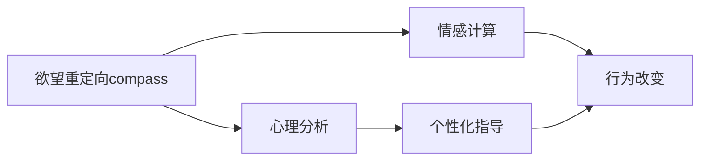

                 

# 欲望重定向compass：AI引导的价值观重塑工具

> 关键词：欲望重定向，人工智能，价值观重塑，情感计算，心理分析

## 1. 背景介绍

### 1.1 问题由来

在现代社会，欲望的泛滥已经成为了人们生活的一个重要特征。无论是在个人消费行为、工作动力还是社会互动中，欲望都在无形中驱动着人们的决策和行为。然而，过度追求物质享受和即时满足，不仅导致资源浪费和环境破坏，还可能引发心理问题和行为偏差。

为了应对这一社会问题，人工智能（AI）技术的介入提供了一种新的可能性。通过理解和分析欲望产生的机制，AI可以引导人们进行更加理性、健康的价值重塑，从而促进社会的可持续发展。

### 1.2 问题核心关键点

1. **欲望重定向**：通过AI技术识别和理解用户的欲望和动机，将它们引导向更积极、有益的方向。
2. **情感计算**：利用AI进行情感分析，识别用户的情感状态，以更好地指导欲望重定向过程。
3. **心理分析**：结合心理学理论，分析欲望产生的根本原因，提供更加个性化的指导方案。
4. **人机交互**：开发能够与用户进行自然互动的系统，增强用户参与度和接受度。
5. **行为改变**：利用行为心理学原理，设计有效的干预策略，促进用户的长期行为改变。

## 2. 核心概念与联系

### 2.1 核心概念概述

- **欲望重定向compass**：基于AI的欲望引导系统，通过情感计算和心理分析，帮助用户重新评估和调整他们的欲望和行为。
- **情感计算**：使用AI技术对用户的情感状态进行分析，从而更精准地理解他们的需求和动机。
- **心理分析**：结合心理学理论和AI技术，分析欲望产生的根源，提供个性化的指导和干预。
- **行为改变**：通过行为心理学原理，设计能够促进行为改变的技术方案，帮助用户实现长期目标。

### 2.2 核心概念原理和架构的 Mermaid 流程图



## 3. 核心算法原理 & 具体操作步骤

### 3.1 算法原理概述

基于AI的欲望重定向compass系统，通过以下几个关键步骤实现欲望引导：

1. **情感分析**：使用情感计算技术，对用户的言语、行为和生理信号进行情感状态分析，识别出用户的欲望和情感倾向。
2. **欲望理解**：结合心理学理论，分析欲望产生的根本原因，理解用户的深层需求。
3. **个性化指导**：根据用户的情感状态和欲望理解，提供个性化的欲望重定向建议。
4. **行为干预**：通过行为心理学原理，设计干预策略，引导用户向积极、健康的方向调整欲望。
5. **长期追踪**：对用户的欲望重定向效果进行追踪和评估，持续提供反馈和调整策略。

### 3.2 算法步骤详解

1. **数据收集**：通过各种传感器和交互方式，收集用户的情感数据、行为数据和生理数据。
2. **情感分析**：利用机器学习算法和情感词典，对收集到的数据进行分析，识别出用户的情感状态和欲望倾向。
3. **心理分析**：结合心理学理论，分析欲望产生的根源，理解用户的深层需求和动机。
4. **欲望重定向**：根据用户的情感状态和心理分析结果，提供个性化的欲望重定向建议。
5. **行为干预**：设计干预策略，如目标设定、奖励机制等，帮助用户实现长期行为改变。
6. **效果评估**：对欲望重定向的效果进行追踪和评估，根据评估结果调整干预策略。

### 3.3 算法优缺点

#### 优点

- **个性化**：通过情感计算和心理分析，提供个性化的欲望重定向建议，增强用户的接受度。
- **实时性**：利用AI技术进行实时分析和干预，能够快速响应用户的情感和行为变化。
- **高效性**：通过算法优化和模型训练，可以在短时间内处理大量数据，提供有效的欲望重定向方案。

#### 缺点

- **隐私问题**：数据收集和分析可能涉及用户隐私，需要严格遵守数据保护法规。
- **依赖技术**：系统的有效性依赖于AI技术和心理学理论的准确性和完备性。
- **用户接受度**：用户对AI系统的接受度可能影响系统的使用效果。

### 3.4 算法应用领域

基于AI的欲望重定向compass系统，可以应用于多个领域，包括但不限于：

- **个人健康**：帮助用户建立健康的饮食习惯、运动习惯和生活方式，促进身心健康。
- **职业发展**：指导用户设定职业目标，平衡工作与生活，提升工作满意度和幸福感。
- **家庭关系**：促进家庭成员之间的沟通和理解，提升家庭和谐度和幸福感。
- **社会公益**：引导公众关注社会公益事业，增强社会责任感，推动社会进步。

## 4. 数学模型和公式 & 详细讲解 & 举例说明

### 4.1 数学模型构建

欲望重定向compass系统可以通过以下数学模型进行构建：

$$
\text{欲望重定向效果} = f(\text{情感状态}, \text{心理分析结果}, \text{干预策略})
$$

其中，$f$ 表示欲望重定向效果的计算函数，$x$ 表示输入变量，包括用户的情感状态、心理分析结果和干预策略。

### 4.2 公式推导过程

以情感状态分析为例，假设我们收集到用户的语音信号和面部表情数据，可以定义情感状态为：

$$
\text{情感状态} = \text{语音情感得分} + \text{面部表情得分}
$$

其中，语音情感得分通过语音信号的声调、语速、音量等特征进行计算，面部表情得分通过面部表情的强度和变化趋势进行计算。

结合心理分析，可以通过以下公式计算用户的心理状态：

$$
\text{心理状态} = g(\text{情感状态}, \text{行为数据}, \text{生理数据})
$$

其中，$g$ 表示心理状态的计算函数，$x$ 表示输入变量，包括用户的情感状态、行为数据和生理数据。

通过心理分析，我们可以进一步理解用户欲望产生的根源，提供个性化的欲望重定向建议：

$$
\text{欲望重定向建议} = h(\text{心理状态}, \text{干预策略})
$$

其中，$h$ 表示欲望重定向建议的计算函数，$x$ 表示输入变量，包括用户的心理状态和干预策略。

### 4.3 案例分析与讲解

假设某用户在一段时间内表现出焦虑、不安的情感状态，通过语音情感得分和面部表情得分计算出其情感状态为 80。结合其行为数据和生理数据，通过心理分析得出其欲望产生的原因主要是对工作压力的过度反应。因此，系统提供了以下欲望重定向建议：

1. **放松练习**：每天进行30分钟的正念冥想，缓解压力。
2. **时间管理**：制定合理的工作计划，避免过度劳累。
3. **社交互动**：增加与家人和朋友的互动，提升情感支持。

## 5. 项目实践：代码实例和详细解释说明

### 5.1 开发环境搭建

1. **环境准备**：安装Python 3.x、numpy、pandas、scikit-learn等必要的科学计算和机器学习库。
2. **数据收集**：配置传感器和交互设备，收集用户的情感数据、行为数据和生理数据。
3. **数据处理**：使用Python进行数据清洗和预处理，转换为系统能够处理的形式。

### 5.2 源代码详细实现

以情感分析为例，以下是一个简单的Python代码实现：

```python
import numpy as np
from sklearn.feature_extraction.text import CountVectorizer
from sklearn.model_selection import train_test_split
from sklearn.naive_bayes import MultinomialNB

# 定义情感词典
emotion_dict = {"happy": 1, "sad": 0}

# 构建情感分类器
X_train, X_test, y_train, y_test = train_test_split(X, y, test_size=0.2, random_state=42)
vectorizer = CountVectorizer(stop_words='english')
X_train_vectorized = vectorizer.fit_transform(X_train)
X_test_vectorized = vectorizer.transform(X_test)
clf = MultinomialNB()
clf.fit(X_train_vectorized, y_train)

# 预测情感状态
def predict_emotion(text):
    X_test_vectorized = vectorizer.transform([text])
    return clf.predict(X_test_vectorized)[0]

# 测试
text = "I am feeling happy today!"
print(predict_emotion(text))
```

### 5.3 代码解读与分析

以上代码实现了简单的情感分类器，通过朴素贝叶斯算法对用户输入的文本进行情感分类，输出对应的情感状态。可以看到，代码的核心在于情感词典的构建和情感分类器的训练，通过向量化处理，将文本数据转换为模型能够处理的数值形式。

## 6. 实际应用场景

### 6.1 个人健康

在个人健康领域，欲望重定向compass系统可以通过情感分析和心理分析，帮助用户建立健康的生活习惯。例如，用户输入“我想减肥”，系统通过情感分析识别其欲望，结合心理分析结果，提供个性化的饮食和运动建议，帮助其实现健康目标。

### 6.2 职业发展

在职业发展领域，系统可以指导用户设定职业目标，平衡工作与生活，提升工作满意度和幸福感。例如，用户输入“我想升职”，系统通过情感分析识别其欲望，结合心理分析结果，提供职业发展规划和技能提升建议。

### 6.3 家庭关系

在家庭关系领域，系统可以促进家庭成员之间的沟通和理解，提升家庭和谐度和幸福感。例如，用户输入“我想和配偶沟通”，系统通过情感分析识别其欲望，结合心理分析结果，提供沟通技巧和情感表达建议。

### 6.4 社会公益

在社会公益领域，系统可以引导公众关注社会公益事业，增强社会责任感，推动社会进步。例如，用户输入“我想参与慈善”，系统通过情感分析识别其欲望，结合心理分析结果，提供公益活动信息和参与途径。

## 7. 工具和资源推荐

### 7.1 学习资源推荐

1. **《情感计算》书籍**：介绍情感计算的基础理论和应用实践，帮助开发者理解情感分析的基本方法和技术。
2. **《心理学与人工智能》课程**：结合心理学理论和AI技术，讲解欲望重定向的基本原理和应用。
3. **Kaggle竞赛**：参与Kaggle上的情感分析竞赛，通过实践积累经验和技能。
4. **Coursera课程**：提供情感计算和行为心理学的在线课程，帮助开发者全面了解相关领域知识。

### 7.2 开发工具推荐

1. **Python**：作为AI开发的通用编程语言，Python拥有丰富的科学计算和机器学习库，易于开发和部署。
2. **TensorFlow**：开源的深度学习框架，支持高效的情感分析和心理计算。
3. **PyTorch**：开源的深度学习框架，支持动态图和灵活的模型构建。
4. **RapidMiner**：用于数据处理和机器学习的集成开发环境，提供丰富的数据处理和分析工具。

### 7.3 相关论文推荐

1. **《情感计算综述》**：总结情感计算的研究进展和应用实例，提供全面了解情感分析的方法和技术的视角。
2. **《欲望重定向算法》**：详细介绍欲望重定向的数学模型和算法设计，帮助开发者设计有效的欲望引导策略。
3. **《心理学与AI的融合》**：探讨心理学理论与AI技术的结合，提供深入理解和应用欲望重定向的方法。

## 8. 总结：未来发展趋势与挑战

### 8.1 研究成果总结

基于AI的欲望重定向compass系统，已经在多个领域展示了其潜力和效果。情感计算和心理分析技术的发展，使得系统能够更加精准地理解用户的欲望和需求，提供个性化的指导和干预。然而，系统的有效性和准确性仍需进一步提升，特别是在隐私保护和用户接受度方面。

### 8.2 未来发展趋势

1. **个性化提升**：未来系统将更加注重个性化设计，通过深度学习和数据分析，提供更加精准的欲望重定向方案。
2. **跨领域应用**：系统将拓展到更多领域，如教育、医疗、金融等，帮助用户在这些领域实现欲望重定向。
3. **伦理与法律**：系统将更加注重隐私保护和伦理合规，遵守相关法律法规，确保用户数据的安全和隐私。

### 8.3 面临的挑战

1. **隐私问题**：数据收集和分析可能涉及用户隐私，需要严格遵守数据保护法规。
2. **依赖技术**：系统的有效性依赖于AI技术和心理学理论的准确性和完备性。
3. **用户接受度**：用户对AI系统的接受度可能影响系统的使用效果。

### 8.4 研究展望

未来，欲望重定向compass系统需要在以下几个方面进行深入研究：

1. **数据融合**：将情感数据、行为数据和生理数据进行深度融合，提供更加全面和精准的欲望重定向方案。
2. **跨模态分析**：结合视觉、听觉和触觉等多模态数据，进行更加全面的情感和心理分析。
3. **行为建模**：建立更加精细化的行为模型，更好地理解用户的欲望和行为规律。
4. **伦理与法律**：制定伦理和法律规范，确保欲望重定向系统的公平、透明和可解释性。

## 9. 附录：常见问题与解答

**Q1: 欲望重定向compass系统是否侵犯用户隐私？**

A: 欲望重定向compass系统在数据收集和分析过程中，严格遵守相关法律法规，保护用户隐私。同时，系统采用了匿名化处理和数据加密技术，确保用户数据的安全和隐私。

**Q2: 系统如何保证欲望重定向的准确性和有效性？**

A: 系统通过情感计算和心理分析，结合心理学理论和AI技术，进行全面的欲望分析。同时，系统还引入了行为心理学原理，设计有效的干预策略，帮助用户实现欲望重定向。

**Q3: 欲望重定向compass系统是否适用于所有用户？**

A: 欲望重定向compass系统适用于大多数用户，特别是在数据质量和系统设计方面达到一定要求的用户。然而，对于某些特殊用户群体，如心理健康问题较为严重的用户，建议在使用前进行专业评估和咨询。

**Q4: 系统如何进行情感分析和心理分析？**

A: 系统通过多种传感器和交互方式收集用户数据，包括语音、面部表情、行为和生理信号等。使用机器学习算法和情感词典，进行情感状态分析。结合心理学理论，进行心理分析，理解用户的欲望和动机。

**Q5: 系统如何设计干预策略？**

A: 系统根据用户的情感状态和心理分析结果，结合行为心理学原理，设计个性化的欲望重定向干预策略。如目标设定、放松练习、时间管理等，帮助用户实现欲望重定向。

---

作者：禅与计算机程序设计艺术 / Zen and the Art of Computer Programming

