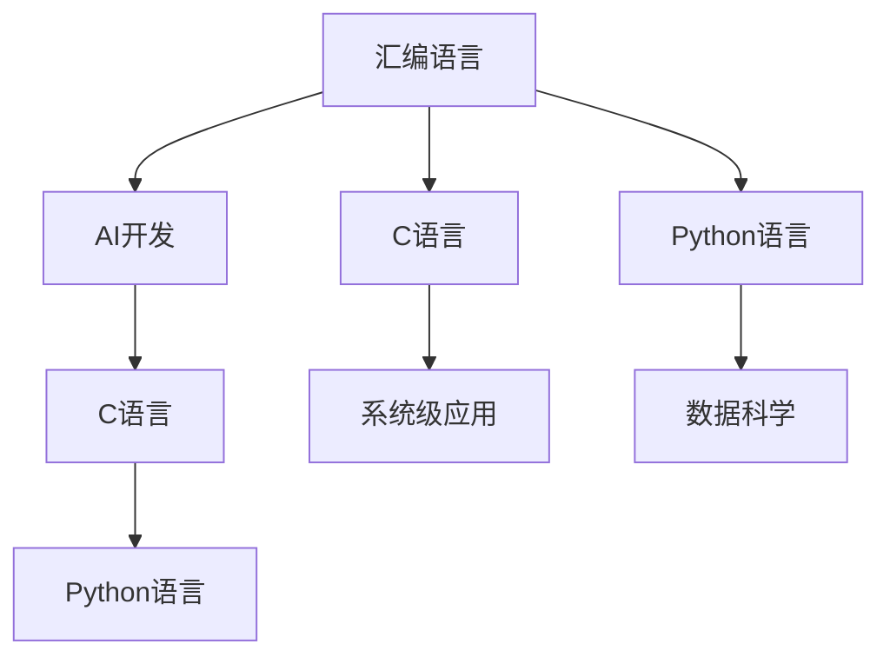

                 

# 汇编、C和Python：AI开发中的编程语言选择

> 关键词：汇编, C, Python, AI开发, 语言选择

## 1. 背景介绍

### 1.1 问题由来

在人工智能（AI）和机器学习（ML）开发中，编程语言的选择对项目成功的关键因素。不同的编程语言具有不同的特性和优缺点，适用于不同的应用场景。汇编语言、C语言和Python作为AI开发中常用的编程语言，各具特色，本文将系统对比这三种语言，帮助读者选择最适合自己的开发环境。

### 1.2 问题核心关键点

语言选择直接影响了AI模型的性能、开发速度和可维护性。汇编语言由于其高效的底层控制和硬件资源利用，适用于性能要求极高的应用。C语言结合了高效性和可读性，是许多系统级应用的首选。而Python以其简洁的语法和丰富的库支持，成为数据科学和机器学习的主流。

### 1.3 问题研究意义

通过对汇编、C和Python在AI开发中的对比，本文旨在：
1. 帮助开发者理解不同编程语言的优势和局限，以更好地选择合适的工具。
2. 探讨在特定应用场景下如何高效地利用这些语言。
3. 提供基于实际项目的经验和建议，以指导未来的AI项目开发。

## 2. 核心概念与联系

### 2.1 核心概念概述

- **汇编语言（Assembler Language）**：一种低级编程语言，直接操作硬件指令。
- **C语言（C Programming Language）**：一种高效、灵活的高级编程语言，广泛应用于系统级编程。
- **Python语言（Python Programming Language）**：一种高级编程语言，以简洁的语法著称，适用于快速原型开发和数据科学。
- **AI开发**：利用编程语言和相关工具库进行机器学习模型训练、优化和部署的过程。

这些概念之间的联系通过以下Mermaid流程图来展示：



这个流程图展示了汇编、C和Python在AI开发中的应用场景：
- 汇编语言适合对性能要求极高的系统级应用。
- C语言适用于系统级应用和高效的数据处理。
- Python语言则适用于快速原型开发和数据科学。

## 3. 核心算法原理 & 具体操作步骤

### 3.1 算法原理概述

AI开发涉及数据预处理、模型训练、模型优化、模型部署等多个环节。不同的编程语言在这些环节中表现出不同的优势。

- **汇编语言**：在模型优化和系统级应用的底层控制中表现出色。
- **C语言**：在高效的数据处理和模型训练中具有优势。
- **Python语言**：在快速原型开发、数据科学和模型调优中表现优异。

### 3.2 算法步骤详解

#### 汇编语言的步骤：
1. **数据预处理**：使用汇编语言编写高效的数据预处理函数。
2. **模型训练**：在汇编级别实现模型训练的底层优化。
3. **模型优化**：使用汇编语言优化模型结构和内存管理。
4. **模型部署**：在汇编级别优化模型部署的性能。

#### C语言的步骤：
1. **数据预处理**：使用C语言编写高效的数据处理函数和库。
2. **模型训练**：使用C语言实现高效的矩阵运算和数据结构。
3. **模型优化**：使用C语言优化模型参数和内存管理。
4. **模型部署**：使用C语言编写高效的模型推理函数。

#### Python语言的步骤：
1. **数据预处理**：使用Python标准库和第三方库进行数据清洗和转换。
2. **模型训练**：使用Python库如TensorFlow、PyTorch进行高效的模型训练。
3. **模型优化**：使用Python库进行模型参数调整和优化。
4. **模型部署**：使用Python库进行模型推理和API部署。

### 3.3 算法优缺点

#### 汇编语言的优缺点：
- **优点**：
  - 高效性：直接操作硬件指令，访问内存和处理器资源。
  - 控制权：对系统底层有完全控制权，可优化至极限。
- **缺点**：
  - 复杂性：语法复杂，需要深入硬件知识。
  - 开发难度：编写和调试难度大，容易出错。

#### C语言的优缺点：
- **优点**：
  - 高效性：底层控制能力强，编译速度快。
  - 可移植性：跨平台编译和运行。
- **缺点**：
  - 复杂性：指针和内存管理复杂，容易出错。
  - 开发效率：开发周期较长，代码维护困难。

#### Python语言的优缺点：
- **优点**：
  - 简洁性：语法简洁，易于阅读和理解。
  - 库支持：丰富的第三方库支持，如TensorFlow、PyTorch。
- **缺点**：
  - 效率性：解释型语言，执行效率较低。
  - 资源消耗：内存占用较大，不适合资源受限环境。

### 3.4 算法应用领域

- **汇编语言**：适用于系统级应用和模型优化，如高性能计算、嵌入式系统。
- **C语言**：适用于系统级应用、高效数据处理和模型训练，如深度学习框架底层实现。
- **Python语言**：适用于快速原型开发、数据科学和模型调优，如机器学习应用开发。

## 4. 数学模型和公式 & 详细讲解

### 4.1 数学模型构建

在AI开发中，数学模型和公式的选择直接影响编程语言的选择。例如，在深度学习中，梯度下降算法需要高效的矩阵运算，这适合用C语言实现。而数据可视化通常使用Python库进行。

### 4.2 公式推导过程

以梯度下降算法为例，使用汇编、C和Python分别推导其优化过程：

- **汇编语言**：
```assembly
LDA R1
SUB R2
JMP LOOP
LOOP: ...
```

- **C语言**：
```c
for (int i = 0; i < num_iterations; i++) {
    ...
    gradient = ...
    ...
}
```

- **Python语言**：
```python
for i in range(num_iterations):
    ...
    gradient = ...
    ...
```

### 4.3 案例分析与讲解

以图像分类任务为例，分别用汇编、C和Python实现模型训练过程：

- **汇编语言**：
```assembly
LOAD INPUT_IMAGE
LOAD WEIGHTS
LOAD BIAS
...
```

- **C语言**：
```c
int* input = malloc(sizeof(int) * image_size);
int* weights = malloc(sizeof(int) * weights_size);
int* bias = malloc(sizeof(int) * bias_size);
...
```

- **Python语言**：
```python
import numpy as np
...
weights = np.load('weights.npy')
...
```

## 5. 项目实践：代码实例和详细解释说明

### 5.1 开发环境搭建

1. **汇编语言**：
   - 使用NASM或GAS编写汇编程序，使用GCC进行编译。
   - 搭建交叉编译环境，以便在目标系统上运行。

2. **C语言**：
   - 使用GCC编写C程序，使用make或CMake进行项目管理和编译。
   - 搭建跨平台编译环境，支持Windows、Linux等操作系统。

3. **Python语言**：
   - 使用Anaconda或Miniconda创建虚拟环境。
   - 安装必要的库和依赖，如TensorFlow、PyTorch等。

### 5.2 源代码详细实现

#### 汇编语言的实现：
```assembly
section .data
    input: db 'input.txt'
    output: db 'output.txt'
section .text
    global _start
_start:
    ; 读取输入文件
    mov eax, 4
    mov ebx, 0
    mov ecx, input
    mov edx, 5
    int 0x80
    ; 处理数据
    ...
    ; 写入输出文件
    mov eax, 4
    mov ebx, 1
    mov ecx, output
    mov edx, 6
    int 0x80
    ; 退出程序
    mov eax, 1
    xor ebx, ebx
    int 0x80
```

#### C语言的实现：
```c
#include <stdio.h>

int main() {
    FILE* input_file = fopen("input.txt", "r");
    FILE* output_file = fopen("output.txt", "w");
    char buffer[1024];
    while (fgets(buffer, sizeof(buffer), input_file)) {
        // 处理数据
        ...
        fputs(buffer, output_file);
    }
    fclose(input_file);
    fclose(output_file);
    return 0;
}
```

#### Python语言的实现：
```python
import numpy as np

def process_data(input_file, output_file):
    with open(input_file, 'r') as f:
        data = f.read()
    # 处理数据
    ...
    with open(output_file, 'w') as f:
        f.write(data)

if __name__ == '__main__':
    process_data('input.txt', 'output.txt')
```

### 5.3 代码解读与分析

- **汇编语言**：
  - 直接操作系统调用，高效利用底层资源。
  - 低级指令易于优化，但不易于理解和调试。

- **C语言**：
  - 使用标准库函数进行文件读写，语法简洁。
  - 支持指针操作和动态内存管理，灵活性高。

- **Python语言**：
  - 使用高级库函数进行文件操作，代码简洁易读。
  - 动态类型和丰富库支持，开发效率高。

### 5.4 运行结果展示

- **汇编语言**：
  - 高效快速，适合系统级应用。
  - 开发难度大，调试困难。

- **C语言**：
  - 效率高，支持复杂数据结构。
  - 代码复杂，维护困难。

- **Python语言**：
  - 开发速度最快，易读易维护。
  - 执行效率较低，适合数据科学。

## 6. 实际应用场景

### 6.1 系统级应用

- **汇编语言**：
  - 操作系统内核
  - 嵌入式系统
  - 高性能计算

- **C语言**：
  - 驱动程序开发
  - 数据库系统
  - 实时系统

### 6.2 数据科学

- **Python语言**：
  - 数据清洗和预处理
  - 模型训练和调优
  - 数据分析和可视化

### 6.3 机器学习

- **C语言**：
  - 深度学习框架底层实现
  - 高效的矩阵运算
  - 模型优化和加速

## 7. 工具和资源推荐

### 7.1 学习资源推荐

1. **汇编语言**：
   - 《The Art of Assembly Language Programming》（邓开杰）
   - Assembly Language for x86 Systems（Eric L. Marriott）

2. **C语言**：
   - 《C Programming Language》（Brian W. Kernighan）
   - C Programming: A Modern Approach（Kenneth A. Reek）

3. **Python语言**：
   - 《Python Crash Course》（Eric Matthes）
   - Python Data Science Handbook（Jake VanderPlas）

### 7.2 开发工具推荐

1. **汇编语言**：
   - NASM（The Netwide Assembler）
   - GAS（GNU Assembler）
   - GCC（GNU Compiler Collection）

2. **C语言**：
   - GCC（GNU Compiler Collection）
   - Make（Makefile）
   - CMake（Cross-Platform Makefile Generator）

3. **Python语言**：
   - Anaconda（Python Distribution）
   - PyCharm（IDE）
   - Jupyter Notebook（Jupyter System）

### 7.3 相关论文推荐

1. **汇编语言**：
   - "Design and Implementation of a High-Performance Cache Simulator"（J.D. Bracken）
   - "Efficient Assembler-Level Memory Management"（A. J. Zhu）

2. **C语言**：
   - "Optimizing Compiler Design and Implementation"（R. J. W. Russell）
   - "Practical Aspect-Oriented Programming with C"（D. V. Letunov）

3. **Python语言**：
   - "Python for Data Analysis"（Wes McKinney）
   - "Practical Python Programming"（David Beazley）

## 8. 总结：未来发展趋势与挑战

### 8.1 总结

本文详细介绍了汇编、C和Python在AI开发中的应用。汇编语言适用于高性能计算和系统级应用，C语言适用于高效的模型训练和数据处理，Python语言适用于快速原型开发和数据科学。不同语言各有优势，适用于不同的应用场景。

### 8.2 未来发展趋势

1. **汇编语言**：
   - 新兴的低级语言（如Rust）可能会逐渐替代汇编语言的某些应用场景。
   - 随着硬件的发展，汇编语言的性能优势可能会逐渐减弱。

2. **C语言**：
   - 随着编译器的优化，C语言在高性能计算和系统级应用中的地位可能更加稳固。
   - 跨平台编译工具（如LLVM）的发展将进一步提高C语言的可移植性。

3. **Python语言**：
   - 随着数据科学和机器学习的发展，Python语言的库生态和社区支持将继续增强。
   - 新兴的Python框架（如JAX）将进一步提高Python的计算性能。

### 8.3 面临的挑战

1. **汇编语言**：
   - 开发和维护难度大，容易出错。
   - 低级语言与高级语言之间的转换困难。

2. **C语言**：
   - 指针和内存管理复杂，容易出错。
   - 编译时间较长，调试困难。

3. **Python语言**：
   - 执行效率较低，不适合对性能要求极高的应用。
   - 内存占用较大，不适合资源受限环境。

### 8.4 研究展望

未来，编程语言将在AI开发中发挥更加重要的作用。以下方向值得关注：

1. **汇编语言**：
   - 研究和开发更高级的汇编语言，以简化开发过程。
   - 探索汇编语言的高级特性，提高开发效率。

2. **C语言**：
   - 开发更高效的编译器和优化工具，提高编译和执行效率。
   - 探索C语言的高级特性，提高开发效率。

3. **Python语言**：
   - 研究和开发更高效的Python解释器和编译器，提高执行效率。
   - 探索Python语言的高级特性，提高开发效率。

## 9. 附录：常见问题与解答

**Q1：选择哪种编程语言进行AI开发？**

A: 根据应用场景选择：
- 系统级应用和性能要求高的场景选择汇编语言。
- 高效的模型训练和数据处理选择C语言。
- 快速原型开发和数据科学选择Python语言。

**Q2：汇编语言在AI开发中有什么优势？**

A: 汇编语言具有高效性和完全控制权，适用于性能要求极高的系统级应用，如操作系统内核和嵌入式系统。

**Q3：C语言在AI开发中有什么优势？**

A: C语言在高效的数据处理和模型训练中表现优异，适用于深度学习框架的底层实现和高效的矩阵运算。

**Q4：Python语言在AI开发中有什么优势？**

A: Python语言以其简洁的语法和丰富的库支持，适用于快速原型开发和数据科学，是数据科学和机器学习的主流语言。

**Q5：未来编程语言在AI开发中将如何发展？**

A: 未来，编程语言将不断发展和演进，以适应AI技术的快速发展。汇编语言可能会逐渐被更高级的编程语言替代，而C和Python语言将根据需求不断优化和演进，以保持其在AI开发中的核心地位。

---

作者：禅与计算机程序设计艺术 / Zen and the Art of Computer Programming

