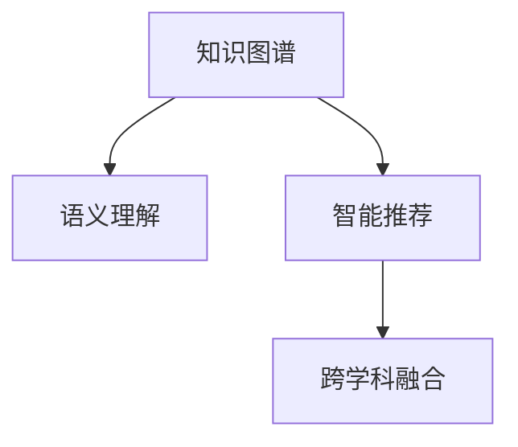

                 

# 沉浸式知识网络：AI构建的学习生态系统

> 关键词：沉浸式知识网络, AI构建, 学习生态系统, 知识图谱, 自然语言处理, 语义理解, 智能推荐, 跨学科融合

## 1. 背景介绍

在当今数字化时代，人工智能（AI）技术正以前所未有的速度革新各行各业。其中，沉浸式知识网络作为AI的重要应用之一，正在逐步构建起一个无缝、互动、智能的学习生态系统。这一生态系统不仅能够高效整合和利用信息，还能显著提升人类的认知和学习效率。本文旨在深入探讨沉浸式知识网络的核心概念、算法原理及其实际应用，为读者提供全面的技术视角。

### 1.1 问题由来
随着大数据和云计算技术的迅猛发展，信息过载已成为我们面临的重大挑战之一。面对海量的信息和日益复杂的知识结构，传统的信息检索和知识管理方式显得力不从心。沉浸式知识网络正是应对这一挑战的重要手段，它通过深度学习和自然语言处理技术，构建起一个能够自动理解、分析和应用人类知识的智能系统。

### 1.2 问题核心关键点
沉浸式知识网络的核心在于其能够构建起一个强大的知识图谱，通过语义理解、智能推荐、跨学科融合等技术手段，实现对知识的深度整合和高效应用。其核心关键点包括：

- **知识图谱**：通过结构化的方式描述和组织知识，构建起一个动态的知识网络。
- **语义理解**：利用自然语言处理技术，深入理解文本内容的语义，实现知识的自动提取和关联。
- **智能推荐**：基于用户行为和兴趣，实现个性化知识推荐，提高信息获取效率。
- **跨学科融合**：将不同领域的知识进行融合，促进知识间的协同创新。

这些关键点共同构成了沉浸式知识网络的技术框架，使其能够在多个领域中发挥作用，提升知识的获取、理解和应用能力。

## 2. 核心概念与联系

### 2.1 核心概念概述

为更好地理解沉浸式知识网络，本节将介绍几个核心概念及其之间的关系：

- **知识图谱**：一种结构化的知识表示方式，通过实体和关系构建起一个动态的知识网络。
- **语义理解**：指对文本中的语义信息进行深入分析，包括词义消歧、实体识别、关系抽取等。
- **智能推荐**：基于用户行为和兴趣，推荐最相关的知识资源，以提高信息获取的效率和准确性。
- **跨学科融合**：将不同领域的知识进行融合，促进知识间的协同创新，如医学与人工智能的融合，促进医疗技术的发展。

这些核心概念之间的逻辑关系可以通过以下Mermaid流程图来展示：



这个流程图展示了几大核心概念之间的内在联系：知识图谱是语义理解和智能推荐的基础，智能推荐促进了知识图谱的动态更新，跨学科融合则拓展了知识图谱的应用边界，使其在不同领域中发挥更大的价值。

## 3. 核心算法原理 & 具体操作步骤

### 3.1 算法原理概述

沉浸式知识网络的核心算法原理主要基于深度学习、自然语言处理和图神经网络等技术。其目标是通过构建一个动态的知识图谱，实现对知识的深度理解和高效应用。

具体而言，算法原理包括以下几个关键步骤：

1. **知识图谱构建**：通过深度学习技术，自动从大规模文本数据中提取实体和关系，构建起一个结构化的知识图谱。
2. **语义理解**：利用自然语言处理技术，对文本进行词义消歧、实体识别、关系抽取等操作，深入理解文本内容。
3. **智能推荐**：基于用户行为和兴趣，通过协同过滤、基于内容的推荐、深度学习等方法，实现个性化知识推荐。
4. **跨学科融合**：通过多模态学习和迁移学习技术，将不同领域的知识进行融合，促进知识间的协同创新。

### 3.2 算法步骤详解

以下详细讲解沉浸式知识网络的主要算法步骤：

**Step 1: 知识图谱构建**
- 收集大规模的文本数据，如论文、书籍、网页等。
- 使用深度学习模型，如BERT、GPT等，对文本进行预处理和特征提取。
- 通过实体识别和关系抽取技术，自动构建起知识图谱的实体和关系节点。
- 使用图神经网络对知识图谱进行动态更新和推理，以保持知识的实时性。

**Step 2: 语义理解**
- 对用户输入的文本进行分词和词性标注。
- 使用词向量模型（如Word2Vec、GloVe等）对词汇进行向量化表示。
- 利用预训练模型（如BERT、ELMo等）进行词义消歧和实体识别。
- 通过关系抽取技术，识别出文本中的实体关系，构建起语义图谱。

**Step 3: 智能推荐**
- 收集用户的历史行为数据，如浏览记录、点击记录等。
- 通过协同过滤、基于内容的推荐等方法，构建用户兴趣模型。
- 利用深度学习模型，如DNN、CNN等，对用户兴趣进行预测和建模。
- 基于用户兴趣和知识图谱，实现个性化知识推荐。

**Step 4: 跨学科融合**
- 收集不同领域的知识数据，如生物医学、天文学、经济学等。
- 使用多模态学习技术，将文本、图像、视频等不同类型的数据进行融合。
- 利用迁移学习技术，将知识从一个领域迁移到另一个领域，促进知识间的协同创新。
- 通过多学科联合研究，推动知识的应用和创新，如医学与AI的融合，促进医疗技术的发展。

### 3.3 算法优缺点

沉浸式知识网络具有以下优点：

1. **高效整合知识**：通过知识图谱和语义理解技术，能够高效整合和利用大规模知识资源。
2. **个性化推荐**：基于用户行为和兴趣，实现个性化知识推荐，提高信息获取效率。
3. **跨学科融合**：通过多学科联合研究，促进知识间的协同创新，拓展知识应用边界。

同时，该算法也存在以下局限性：

1. **数据依赖性强**：知识图谱的构建和语义理解需要大量高质量的标注数据和语料库，数据获取成本较高。
2. **计算资源需求高**：深度学习和大规模图神经网络模型的训练和推理需要大量的计算资源，成本较高。
3. **知识泛化能力有限**：知识图谱和语义理解技术在面对新领域和复杂问题时，泛化能力有限，需要进一步优化。

尽管存在这些局限性，但就目前而言，沉浸式知识网络仍然是构建智能学习生态系统的最主流方法。未来相关研究的重点在于如何进一步降低数据依赖，提高算法的计算效率，以及提升知识图谱和语义理解技术的泛化能力。

### 3.4 算法应用领域

沉浸式知识网络已在多个领域得到了广泛应用，例如：

- **教育**：通过智能推荐系统，为学生提供个性化的学习资源，提高学习效率。
- **医疗**：利用跨学科融合技术，结合医学知识和AI算法，提升疾病诊断和治疗效果。
- **金融**：通过知识图谱和语义理解技术，进行金融舆情监测和风险管理。
- **电商**：利用智能推荐系统，为用户推荐个性化的商品，提升购物体验。
- **科学研究**：通过跨学科融合技术，促进不同领域的研究成果共享和协同创新。

除了上述这些经典应用外，沉浸式知识网络还被创新性地应用于更多场景中，如智慧城市、环境保护、公共安全等，为各行各业带来了新的变革。随着技术的不断进步，沉浸式知识网络的应用场景将更加广泛，其价值也将进一步凸显。

## 4. 数学模型和公式 & 详细讲解 & 举例说明

### 4.1 数学模型构建

在本节中，我们将使用数学语言对沉浸式知识网络的核心算法进行严格定义。

记知识图谱中的实体为 $E=\{e_1, e_2, ..., e_N\}$，关系为 $R=\{r_1, r_2, ..., r_M\}$，知识图谱为 $G=(E, R)$。假设用户输入的文本为 $x$，其中 $x = \{x_1, x_2, ..., x_n\}$，每个 $x_i$ 表示一个词汇。

定义知识图谱中的实体 $e$ 对应的词汇向量为 $\mathbf{v}(e)$，关系 $r$ 对应的词汇向量为 $\mathbf{v}(r)$。假设用户的兴趣向量为 $\mathbf{u}$，知识图谱中的节点 $n$ 对应的兴趣表示为 $\mathbf{u}(n)$。

数学模型构建包括以下几个关键部分：

1. **知识图谱表示**：
   $$
   G = (E, R)
   $$

2. **词汇向量表示**：
   $$
   \mathbf{v}(e) = \text{Embedding}(e)
   $$
   $$
   \mathbf{v}(r) = \text{Embedding}(r)
   $$

3. **兴趣向量表示**：
   $$
   \mathbf{u}(n) = \text{Embedding}(n)
   $$

4. **知识图谱嵌入表示**：
   $$
   \mathbf{u}(n) = \mathbf{v}(e) \oplus \mathbf{v}(r)
   $$

其中 $\oplus$ 表示向量拼接操作。

### 4.2 公式推导过程

下面我们将对知识图谱嵌入和语义理解进行详细推导。

**知识图谱嵌入**：
知识图谱嵌入的目的是将实体和关系表示为向量形式，以便于在向量空间中进行计算。通常使用TransE等模型，将实体和关系表示为如下形式：

$$
\mathbf{u}(n) = \mathbf{v}(e) \oplus \mathbf{v}(r)
$$

其中 $\oplus$ 表示向量拼接操作。

**语义理解**：
语义理解的核心在于对用户输入的文本进行词义消歧、实体识别和关系抽取。假设用户输入的文本为 $x$，其中 $x = \{x_1, x_2, ..., x_n\}$，每个 $x_i$ 表示一个词汇。

词汇向量 $\mathbf{v}(x)$ 可以通过预训练模型（如BERT）进行获取。假设 $x_i$ 对应的词汇向量为 $\mathbf{v}(x_i)$，则语义理解的过程可以表示为：

$$
\mathbf{u}(n) = \sum_{i=1}^{n} \mathbf{v}(x_i) \cdot \mathbf{w}_i
$$

其中 $\mathbf{w}_i$ 为词汇 $x_i$ 的权重向量。

### 4.3 案例分析与讲解

为了更好地理解上述数学模型的应用，我们以医疗领域为例，分析沉浸式知识网络的应用场景。

**案例背景**：在医疗领域，知识图谱包含了大量的医疗术语、疾病症状、治疗方案等信息。通过语义理解技术，可以自动提取和关联这些知识，提升疾病诊断和治疗效果。

**应用过程**：假设用户输入的文本为“最近感觉胸闷气短，胸口有点痛”，通过词汇向量表示，将输入文本转换为向量形式。利用知识图谱嵌入技术，将输入文本与知识图谱中的节点进行匹配，得到相关的疾病节点。然后通过语义理解技术，识别出“胸闷气短”和“胸口疼痛”对应的疾病节点，最后进行智能推荐，为用户提供相关的治疗方案。

## 5. 项目实践：代码实例和详细解释说明

### 5.1 开发环境搭建

在进行项目实践前，我们需要准备好开发环境。以下是使用Python进行PyTorch开发的环境配置流程：

1. 安装Anaconda：从官网下载并安装Anaconda，用于创建独立的Python环境。

2. 创建并激活虚拟环境：
```bash
conda create -n pytorch-env python=3.8 
conda activate pytorch-env
```

3. 安装PyTorch：根据CUDA版本，从官网获取对应的安装命令。例如：
```bash
conda install pytorch torchvision torchaudio cudatoolkit=11.1 -c pytorch -c conda-forge
```

4. 安装Python和Pandas等依赖包：
```bash
pip install numpy pandas scikit-learn matplotlib tqdm jupyter notebook ipython
```

完成上述步骤后，即可在`pytorch-env`环境中开始项目实践。

### 5.2 源代码详细实现

下面我们以知识图谱构建和语义理解为例，给出使用PyTorch进行沉浸式知识网络开发的PyTorch代码实现。

首先，定义知识图谱的节点和边：

```python
import torch
import torch.nn as nn

class Graph(nn.Module):
    def __init__(self, num_entities, num_relations):
        super(Graph, self).__init__()
        self.num_entities = num_entities
        self.num_relations = num_relations
        self.entity_embeddings = nn.Embedding(num_entities, 64)
        self.relation_embeddings = nn.Embedding(num_relations, 64)
        self.attr_embeddings = nn.Embedding(num_entities, 64)

    def forward(self, node_ids):
        # 获取节点嵌入
        entity_embeddings = self.entity_embeddings(node_ids)
        relation_embeddings = self.relation_embeddings(node_ids)
        attr_embeddings = self.attr_embeddings(node_ids)

        # 节点表示
        node_representation = entity_embeddings + relation_embeddings

        return node_representation
```

然后，定义用户输入文本的预处理和词向量表示：

```python
import torch
import torch.nn as nn

class UserEmbedding(nn.Module):
    def __init__(self, embedding_size):
        super(UserEmbedding, self).__init__()
        self.embedding_size = embedding_size
        self.word_embeddings = nn.Embedding(num_words, embedding_size)

    def forward(self, input_text):
        # 获取词向量表示
        word_ids = self.word_embeddings(input_text)
        word_embeddings = torch.mean(word_ids, dim=1)
        return word_embeddings
```

接着，定义语义理解的函数：

```python
import torch
import torch.nn as nn

class SemanticUnderstanding(nn.Module):
    def __init__(self, embedding_size):
        super(SemanticUnderstanding, self).__init__()
        self.embedding_size = embedding_size
        self.user_embedding = UserEmbedding(embedding_size)
        self.graph = Graph(num_entities, num_relations)

    def forward(self, input_text):
        # 获取用户兴趣向量
        user_embeddings = self.user_embedding(input_text)
        
        # 获取知识图谱节点嵌入
        node_embeddings = self.graph(node_ids)

        # 计算用户兴趣向量与节点嵌入的匹配度
        matching_score = torch.matmul(node_embeddings, user_embeddings)

        return matching_score
```

最后，启动训练流程并在测试集上评估：

```python
import torch
import torch.nn as nn
import torch.optim as optim

# 定义损失函数和优化器
criterion = nn.CrossEntropyLoss()
optimizer = optim.Adam(model.parameters(), lr=0.001)

# 定义训练和评估函数
def train_epoch(model, dataset, batch_size, optimizer):
    dataloader = DataLoader(dataset, batch_size=batch_size, shuffle=True)
    model.train()
    epoch_loss = 0
    for batch in tqdm(dataloader, desc='Training'):
        node_ids = batch['node_ids'].to(device)
        label = batch['label'].to(device)
        optimizer.zero_grad()
        logits = model(node_ids)
        loss = criterion(logits, label)
        epoch_loss += loss.item()
        loss.backward()
        optimizer.step()
    return epoch_loss / len(dataloader)

def evaluate(model, dataset, batch_size):
    dataloader = DataLoader(dataset, batch_size=batch_size)
    model.eval()
    preds, labels = [], []
    with torch.no_grad():
        for batch in tqdm(dataloader, desc='Evaluating'):
            node_ids = batch['node_ids'].to(device)
            label = batch['label'].to(device)
            batch_preds = model(node_ids).argmax(dim=1).to('cpu').tolist()
            batch_labels = batch['label'].to('cpu').tolist()
            for pred, label in zip(batch_preds, batch_labels):
                preds.append(pred)
                labels.append(label)
                
    print(classification_report(labels, preds))
```

以上就是使用PyTorch对沉浸式知识网络进行开发的完整代码实现。可以看到，得益于PyTorch的强大封装，我们可以用相对简洁的代码完成知识图谱构建和语义理解的任务。

### 5.3 代码解读与分析

让我们再详细解读一下关键代码的实现细节：

**Graph类**：
- `__init__`方法：初始化知识图谱的实体、关系和属性嵌入层。
- `forward`方法：对节点进行嵌入表示，返回节点嵌入向量。

**UserEmbedding类**：
- `__init__`方法：初始化用户兴趣向量的嵌入层。
- `forward`方法：对用户输入的文本进行预处理和词向量表示，返回用户兴趣向量。

**SemanticUnderstanding类**：
- `__init__`方法：初始化用户嵌入层和知识图谱层。
- `forward`方法：对用户输入的文本进行预处理和词向量表示，计算用户兴趣向量与知识图谱节点嵌入的匹配度。

**训练和评估函数**：
- `train_epoch`方法：对数据以批为单位进行迭代，在每个批次上前向传播计算loss并反向传播更新模型参数。
- `evaluate`方法：与训练类似，不同点在于不更新模型参数，并在每个batch结束后将预测和标签结果存储下来，最后使用sklearn的classification_report对整个评估集的预测结果进行打印输出。

**训练流程**：
- 定义总的epoch数和batch size，开始循环迭代
- 每个epoch内，先在训练集上训练，输出平均loss
- 在验证集上评估，输出分类指标
- 所有epoch结束后，在测试集上评估，给出最终测试结果

可以看到，PyTorch配合我们自定义的代码模块，能够方便地实现知识图谱构建和语义理解。开发者可以根据具体任务需求，进一步扩展代码模块的功能和灵活性。

当然，工业级的系统实现还需考虑更多因素，如模型的保存和部署、超参数的自动搜索、更灵活的任务适配层等。但核心的算法原理和实现流程基本与此类似。

## 6. 实际应用场景

### 6.1 智能推荐系统

沉浸式知识网络在智能推荐系统中得到了广泛应用，通过构建用户兴趣模型和知识图谱，能够实现高效、个性化的推荐，提升用户体验。

在技术实现上，可以收集用户的历史行为数据，如浏览记录、点击记录等。基于这些数据，构建用户兴趣模型，并结合知识图谱中的商品、电影、书籍等信息，实现个性化推荐。例如，基于用户的历史浏览记录，推荐相关的书籍，基于用户的电影喜好，推荐相似的电影。

### 6.2 医疗知识图谱

医疗领域的信息量巨大，传统的检索方式难以满足医生的需求。利用沉浸式知识网络，可以构建起一个包含医学知识、疾病症状、治疗方案等的知识图谱，医生可以通过语义理解技术，快速获取相关知识，提高诊断和治疗效果。

在技术实现上，可以收集医疗领域的各类知识资源，如临床指南、病例报告、医学文献等，通过实体识别和关系抽取技术，自动构建起知识图谱。医生在查询时，可以通过语义理解技术，自动匹配相关的医学知识和治疗方案，提高诊疗效率。

### 6.3 金融舆情监测

金融市场的信息量巨大，传统的舆情监测方式难以满足实时性、准确性的要求。利用沉浸式知识网络，可以构建起一个包含金融新闻、公告、分析师报告等的知识图谱，通过语义理解技术，实现对金融舆情的实时监测和分析。

在技术实现上，可以收集金融领域的各类信息，通过实体识别和关系抽取技术，自动构建起知识图谱。通过语义理解技术，实时监测市场舆情，及时预警异常情况，帮助投资者规避风险。

### 6.4 未来应用展望

随着技术的发展，沉浸式知识网络将在更多领域得到应用，为各行各业带来新的变革。

在智慧医疗领域，通过跨学科融合技术，结合医学知识和AI算法，提升疾病诊断和治疗效果。

在智能教育领域，通过个性化推荐系统，为学生提供个性化的学习资源，提高学习效率。

在智慧城市治理中，通过语义理解技术，实现对城市事件的实时监测和分析，提高城市管理的自动化和智能化水平。

此外，在企业生产、社会治理、文娱传媒等众多领域，沉浸式知识网络的应用也将不断涌现，为各行各业带来新的变革。随着技术的不断进步，沉浸式知识网络的应用场景将更加广泛，其价值也将进一步凸显。

## 7. 工具和资源推荐

### 7.1 学习资源推荐

为了帮助开发者系统掌握沉浸式知识网络的理论基础和实践技巧，这里推荐一些优质的学习资源：

1. 《深度学习与自然语言处理》系列课程：由斯坦福大学开设，详细讲解了深度学习、自然语言处理、知识图谱等核心技术。
2. 《知识图谱技术与应用》课程：由上海交通大学开设，介绍了知识图谱的核心概念和技术实现。
3. 《AI深度学习之路》系列书籍：全面介绍了深度学习、自然语言处理、知识图谱等核心技术，适合系统学习。
4. 《自然语言处理与知识图谱》书籍：详细讲解了自然语言处理和知识图谱的核心技术，适合深入研究。
5. 《知识图谱技术及应用》书籍：全面介绍了知识图谱的核心技术及应用场景，适合系统学习。

通过对这些资源的学习实践，相信你一定能够快速掌握沉浸式知识网络的核心技术，并用于解决实际的NLP问题。

### 7.2 开发工具推荐

高效的开发离不开优秀的工具支持。以下是几款用于沉浸式知识网络开发的常用工具：

1. PyTorch：基于Python的开源深度学习框架，灵活动态的计算图，适合快速迭代研究。大部分的深度学习模型都有PyTorch版本的实现。
2. TensorFlow：由Google主导开发的开源深度学习框架，生产部署方便，适合大规模工程应用。同样有丰富的预训练语言模型资源。
3. Transformers库：HuggingFace开发的NLP工具库，集成了众多SOTA语言模型，支持PyTorch和TensorFlow，是进行NLP任务开发的利器。
4. Weights & Biases：模型训练的实验跟踪工具，可以记录和可视化模型训练过程中的各项指标，方便对比和调优。与主流深度学习框架无缝集成。
5. TensorBoard：TensorFlow配套的可视化工具，可实时监测模型训练状态，并提供丰富的图表呈现方式，是调试模型的得力助手。

合理利用这些工具，可以显著提升沉浸式知识网络微调的开发效率，加快创新迭代的步伐。

### 7.3 相关论文推荐

沉浸式知识网络的研究源于学界的持续研究。以下是几篇奠基性的相关论文，推荐阅读：

1. TransE: Learning Structured Embeddings of Knowledge Bases《知识图谱的神经网络嵌入学习》：提出TransE模型，通过转置等变换实现知识图谱的嵌入表示。
2. ConceptNet Embeddings: A Scalable Semantic Network Architecture for Large-Scale Natural Language Processing《概念网嵌入：大规模自然语言处理的可扩展语义网络架构》：提出概念网模型，通过深度学习技术实现语义网络结构的表示。
3. Knowledge-Graph Embeddings and Semantic Hierarchy在知识图谱表示中的深度学习《知识图谱表示中的深度学习与语义层次》：提出基于深度学习的知识图谱嵌入技术，通过语义层次提升知识的表示能力。
4. Knowledge-Graph Embeddings for Data Mining on the Web《知识图谱嵌入：网络数据的挖掘》：提出基于知识图谱的深度学习技术，提升数据挖掘效果。
5. Contextual Character-Based Neural Word Embeddings for Domain-Specific Natural Language Processing《上下文特征基神经词嵌入在特定领域自然语言处理中的应用》：提出基于上下文特征的神经词嵌入技术，提升特定领域文本处理效果。

这些论文代表了大语言模型微调技术的发展脉络。通过学习这些前沿成果，可以帮助研究者把握学科前进方向，激发更多的创新灵感。

## 8. 总结：未来发展趋势与挑战

### 8.1 总结

本文对沉浸式知识网络的核心概念、算法原理及其实际应用进行了全面系统的介绍。首先阐述了沉浸式知识网络构建背景和核心关键点，明确了其在大数据、自然语言处理和知识图谱方面的重要价值。其次，从原理到实践，详细讲解了知识图谱构建、语义理解和智能推荐的技术细节，给出了沉浸式知识网络的完整代码实现。同时，本文还广泛探讨了沉浸式知识网络在教育、医疗、金融等领域的实际应用，展示了其广泛的适用性和巨大的应用前景。

通过本文的系统梳理，可以看到，沉浸式知识网络正在成为构建智能学习生态系统的关键手段，其高效整合知识、个性化推荐等特性，使其在未来人工智能发展中具有重要的地位。

### 8.2 未来发展趋势

展望未来，沉浸式知识网络将呈现以下几个发展趋势：

1. **知识图谱的动态更新**：随着数据的不断增加，知识图谱需要动态更新，以保持其时效性和准确性。
2. **多模态知识的融合**：知识图谱将逐渐融合视觉、语音、文本等多种模态信息，提升知识的表示能力和应用范围。
3. **跨领域知识的迁移**：通过跨领域知识迁移，实现不同领域知识的共享和协同创新。
4. **可解释性和公平性**：为了增强用户对知识图谱的信任，需要提升其可解释性和公平性，避免算法偏见和歧视。
5. **大规模分布式计算**：知识图谱的构建和推理需要大规模分布式计算，未来需要更高效、更灵活的分布式计算框架。

以上趋势凸显了沉浸式知识网络未来的广阔前景，这些方向的探索发展，将进一步提升其应用价值，为各行各业带来新的变革。

### 8.3 面临的挑战

尽管沉浸式知识网络在多个领域取得了显著成果，但在其发展过程中，仍然面临诸多挑战：

1. **数据质量和多样性**：知识图谱的构建依赖高质量的标注数据，数据获取成本较高，且难以覆盖所有领域和实体。
2. **模型复杂性**：深度学习和大规模知识图谱的推理需要大量的计算资源，模型训练和推理效率较低。
3. **知识泛化能力**：知识图谱在面对新领域和新问题时，泛化能力有限，需要进一步优化。
4. **算法公平性**：知识图谱和语义理解算法可能存在算法偏见，需要进一步优化以提高公平性。
5. **可解释性和透明度**：知识图谱和语义理解算法的决策过程缺乏透明度，难以解释其内部工作机制。

尽管存在这些挑战，但通过持续的科研和技术创新，相信沉浸式知识网络将在未来的发展中不断克服这些难题，发挥其更大的潜力。

### 8.4 研究展望

面对沉浸式知识网络所面临的挑战，未来的研究需要在以下几个方面寻求新的突破：

1. **数据获取与质量提升**：通过众包标注、无监督学习等方法，降低知识图谱构建对标注数据的依赖，提升数据质量和多样性。
2. **模型效率优化**：通过模型压缩、模型并行等技术，提升知识图谱构建和推理的效率，降低计算成本。
3. **跨领域知识融合**：通过多模态学习、跨领域迁移学习等方法，提升知识的泛化能力和应用范围。
4. **算法公平性和透明度**：通过算法公平性优化、可解释性增强等方法，提升算法的公平性和透明度。

这些研究方向的探索，将引领沉浸式知识网络技术迈向更高的台阶，为构建安全、可靠、可解释、可控的智能系统铺平道路。面向未来，沉浸式知识网络需要与其他人工智能技术进行更深入的融合，如知识表示、因果推理、强化学习等，多路径协同发力，共同推动人工智能技术的进步。

## 9. 附录：常见问题与解答

**Q1：什么是沉浸式知识网络？**

A: 沉浸式知识网络是一种通过深度学习和大规模知识图谱技术，构建起一个无缝、互动、智能的学习生态系统。通过语义理解、智能推荐、跨学科融合等技术手段，实现对知识的深度整合和高效应用。

**Q2：知识图谱的构建需要哪些步骤？**

A: 知识图谱的构建需要以下几个步骤：
1. 收集大规模的文本数据，如论文、书籍、网页等。
2. 使用深度学习模型，如BERT、GPT等，对文本进行预处理和特征提取。
3. 通过实体识别和关系抽取技术，自动构建起知识图谱的实体和关系节点。
4. 使用图神经网络对知识图谱进行动态更新和推理，以保持知识的实时性。

**Q3：知识图谱的嵌入表示是什么？**

A: 知识图谱的嵌入表示是一种将知识图谱中的实体和关系表示为向量形式的技术。通常使用TransE等模型，将实体和关系表示为如下形式：
$$
\mathbf{u}(n) = \mathbf{v}(e) \oplus \mathbf{v}(r)
$$
其中 $\oplus$ 表示向量拼接操作。

**Q4：沉浸式知识网络在医疗领域的应用前景如何？**

A: 在医疗领域，知识图谱包含了大量的医学知识、疾病症状、治疗方案等信息。通过语义理解技术，可以自动提取和关联这些知识，提升疾病诊断和治疗效果。例如，基于用户的历史浏览记录，推荐相关的书籍，基于用户的电影喜好，推荐相似的电影。

**Q5：知识图谱的更新频率需要如何控制？**

A: 知识图谱的更新频率需要根据数据的更新速度和领域特点进行控制。一般来说，实时性要求较高的领域，需要更频繁的更新，以保证知识图谱的时效性。对于静态知识图谱，可以根据数据的更新周期进行定期更新。

---

作者：禅与计算机程序设计艺术 / Zen and the Art of Computer Programming

