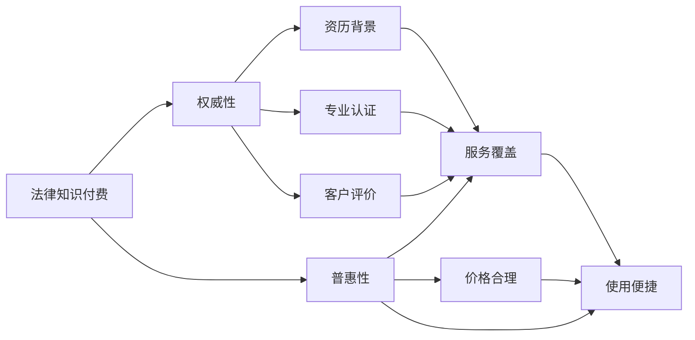

                 

# 法律服务领域知识付费要权威性与普惠性

## 1. 背景介绍

随着互联网和信息技术的发展，知识付费模式在各行各业逐渐兴起。法律领域作为知识密集型行业，知识付费同样具有广阔的发展前景。然而，法律知识的权威性与普惠性是知识付费模式中面临的两大挑战。如何在这两者之间找到平衡，是实现知识付费价值的必要条件。本文旨在探讨法律服务领域知识付费的权威性与普惠性，并提出相应的解决策略。

## 2. 核心概念与联系

### 2.1 核心概念概述

- **法律知识付费**：指法律专业人士通过知识付费平台提供法律咨询、法律文书撰写、法律课程等服务，客户支付相应的费用以获取这些专业服务。
- **权威性**：指法律知识付费服务的可信度和专业性。主要体现在提供服务的法律专业人士的资历、经验、学术背景等方面。
- **普惠性**：指法律知识付费服务对广大法律需求者的可及性和覆盖面。主要体现在服务的普及性、成本的合理性以及服务的便利性等方面。

### 2.2 核心概念原理和架构的 Mermaid 流程图



该图表展示了法律知识付费的权威性与普惠性之间的关系及其关键因素。权威性通过资历背景、专业认证和客户评价等因素来体现；普惠性通过服务覆盖、价格合理和使用便捷等因素来体现。两者相辅相成，共同构成法律知识付费的核心要素。

## 3. 核心算法原理 & 具体操作步骤

### 3.1 算法原理概述

法律知识付费的权威性和普惠性可以通过以下算法原理来实现：

- **资历背景认证**：通过审核法律专业人士的学历、执业证书、工作经历等资历背景，确保其具有提供法律服务的资格和能力。
- **专业认证机制**：建立专业认证机制，通过专家评审或行业协会认证，为法律专业人士提供专业背书。
- **客户评价系统**：引入客户评价系统，通过用户反馈来监督和评价法律服务质量，促进服务质量提升。
- **价格透明度**：建立透明的价格机制，确保服务价格合理，避免价格虚高或过低。
- **便捷使用体验**：提供便捷的使用界面和服务流程，提高客户使用的便利性。
- **覆盖面拓展**：通过多种渠道和服务形式，提高法律服务覆盖面，满足不同客户的需求。

### 3.2 算法步骤详解

#### 3.2.1 资历背景认证

1. **收集数据**：从律师事务所、公证处、法院等机构收集法律专业人士的学历、执业证书、工作经历等资历背景数据。
2. **审核与验证**：使用人工智能技术对收集的数据进行审核和验证，确保数据真实可靠。
3. **发布认证**：将审核通过的法律专业人士资历背景信息发布到知识付费平台，供客户查看。

#### 3.2.2 专业认证机制

1. **设定标准**：制定法律专业人士的专业认证标准，包括但不限于执业年限、案件胜诉率、专业技能等。
2. **申请与评审**：法律专业人士申请专业认证，由行业专家组成评审委员会进行评审。
3. **颁发证书**：评审通过后，颁发专业认证证书，并在平台公示。

#### 3.2.3 客户评价系统

1. **建立评价体系**：设计客户评价体系，包括评价指标、评价方法、评价流程等。
2. **收集评价数据**：客户在服务完成后对服务质量进行评价，并提交评价数据。
3. **分析与反馈**：使用机器学习技术分析评价数据，生成服务质量报告，并对法律专业人士进行反馈。

#### 3.2.4 价格透明度

1. **制定价格标准**：根据服务类型、复杂度、所需时间等因素制定合理的收费标准。
2. **公开价格信息**：将收费标准和服务价格公开，供客户参考。
3. **动态调整**：根据市场需求和服务成本，动态调整服务价格，保持价格的合理性。

#### 3.2.5 便捷使用体验

1. **界面设计**：设计简洁、易用的知识付费平台界面，减少用户操作复杂度。
2. **服务流程优化**：优化服务流程，减少用户等待时间，提高服务效率。
3. **多渠道接入**：通过手机APP、网页、小程序等多种渠道，方便用户访问和使用服务。

#### 3.2.6 覆盖面拓展

1. **多语种支持**：支持多种语言服务，满足不同地区客户的需求。
2. **多种服务形式**：提供文字咨询、语音咨询、视频咨询等多种服务形式，满足不同客户偏好。
3. **覆盖区域扩展**：将服务覆盖到更多地区，特别是法律服务资源较少的地区。

### 3.3 算法优缺点

#### 3.3.1 优点

- **提高服务质量**：通过资历背景认证和专业认证机制，确保法律服务的专业性和权威性。
- **降低客户成本**：通过价格透明度和便捷使用体验，降低客户获取法律服务的成本和时间成本。
- **提升客户满意度**：通过客户评价系统和反馈机制，持续优化服务质量，提升客户满意度。
- **扩大服务覆盖面**：通过多种渠道和服务形式，扩大法律服务的覆盖面，满足更多客户需求。

#### 3.3.2 缺点

- **认证成本较高**：审核和验证法律专业人士的资历背景需要投入大量人力和物力。
- **专业认证难度大**：设定较高的专业认证标准，可能导致合格法律专业人士数量有限。
- **评价系统依赖性**：客户评价系统需要大量真实评价数据，数据质量可能影响评价结果。
- **价格调整复杂**：服务价格的动态调整需要频繁的市场调研和数据更新。

### 3.4 算法应用领域

法律知识付费的权威性与普惠性在多个领域有广泛应用：

- **法律咨询**：通过专业认证的律师提供一对一的法律咨询服务，帮助客户解决法律问题。
- **法律文书撰写**：提供标准化的法律文书模板，由律师根据客户需求进行修改和定制。
- **法律课程**：由法律专家录制并上传法律课程视频，供客户学习和提升法律知识。
- **合同审核**：提供合同审核服务，由律师对客户拟定的合同进行审核和修改。
- **案件代理**：提供案件代理服务，由律师代表客户进行法律诉讼和仲裁。

## 4. 数学模型和公式 & 详细讲解 & 举例说明

### 4.1 数学模型构建

设法律知识付费服务的需求为 $D$，服务质量为 $Q$，客户支付的金额为 $P$，资历背景认证的成本为 $C$，专业认证的难度为 $D$，客户评价系统的数据质量为 $E$，服务价格的透明度为 $T$，使用体验的便利性为 $U$，服务覆盖面的广度为 $C$。则法律知识付费的权威性与普惠性可以通过以下数学模型来表示：

$$
\max \{D, P, Q, C, E, T, U, C\}
$$

### 4.2 公式推导过程

1. **需求模型**：需求 $D$ 受到服务质量 $Q$ 和价格 $P$ 的影响。
   $$
   D = f(Q, P)
   $$
   其中 $f$ 为需求函数。

2. **服务质量模型**：服务质量 $Q$ 受到资历背景 $C$ 和专业认证 $D$ 的影响。
   $$
   Q = g(C, D)
   $$
   其中 $g$ 为服务质量函数。

3. **价格模型**：价格 $P$ 受到需求 $D$ 和价格透明度 $T$ 的影响。
   $$
   P = h(D, T)
   $$
   其中 $h$ 为价格函数。

4. **成本模型**：资历背景认证成本 $C$ 和专业认证难度 $D$ 是固定的。
   $$
   C = \text{固定成本}
   $$
   $$
   D = \text{固定难度}
   $$

5. **客户评价模型**：客户评价系统数据质量 $E$ 受多方面因素影响，如评价数量、评价内容等。
   $$
   E = e(\text{评价数量}, \text{评价内容}, \text{其他因素})
   $$
   其中 $e$ 为评价函数。

6. **使用体验模型**：使用体验便利性 $U$ 受界面设计、服务流程等影响。
   $$
   U = u(\text{界面设计}, \text{服务流程}, \text{其他因素})
   $$
   其中 $u$ 为使用体验函数。

7. **覆盖面模型**：服务覆盖面广度 $C$ 受多渠道接入、多语种支持等影响。
   $$
   C = c(\text{多渠道接入}, \text{多语种支持}, \text{其他因素})
   $$
   其中 $c$ 为覆盖面函数。

### 4.3 案例分析与讲解

以法律咨询服务为例，我们可以从需求、服务质量、价格、成本、评价、体验和覆盖面等方面进行分析：

1. **需求分析**：客户对法律咨询服务的需求受案件复杂度和客户对服务质量的期望影响。
   - 高复杂度案件需求较大。
   - 客户对服务质量期望高，需求增加。

2. **服务质量分析**：法律咨询服务的质量受律师资历和专业认证影响。
   - 高资历律师咨询质量高。
   - 专业认证律师服务更权威。

3. **价格分析**：法律咨询服务价格应透明，以吸引更多客户。
   - 透明价格可提高客户信任度。
   - 价格应反映服务成本和质量。

4. **成本分析**：资历背景认证和专业认证的成本较高。
   - 认证成本需合理分配。
   - 认证难度应适中，以平衡质量和服务数量。

5. **评价分析**：客户评价数据质量对服务改进至关重要。
   - 真实评价可提升服务质量。
   - 评价系统应设计合理，防止虚假评价。

6. **体验分析**：便捷的使用体验可提高客户满意度。
   - 界面简洁，操作方便。
   - 服务流程高效，减少等待时间。

7. **覆盖面分析**：多渠道接入和支持多语种服务可扩大覆盖面。
   - 多渠道接入方便客户选择。
   - 多语种服务满足不同地区客户需求。

## 5. 项目实践：代码实例和详细解释说明

### 5.1 开发环境搭建

- **开发平台**：选择Python作为开发语言，使用Jupyter Notebook进行代码编写和运行。
- **数据采集**：使用Python爬虫工具采集法律专业人士的资历背景数据。
- **数据分析**：使用Pandas和NumPy进行数据处理和分析。
- **模型训练**：使用Scikit-learn和TensorFlow训练和验证模型。
- **服务部署**：使用Flask框架部署知识付费平台服务。

### 5.2 源代码详细实现

```python
import pandas as pd
import numpy as np
from sklearn.model_selection import train_test_split
from sklearn.linear_model import LogisticRegression
from tensorflow.keras.models import Sequential
from tensorflow.keras.layers import Dense, Dropout
from tensorflow.keras.callbacks import EarlyStopping
from flask import Flask, request, jsonify

# 数据采集与处理
data = pd.read_csv('lawyer_profile.csv')
data = data.dropna()

# 特征工程
X = data[['education', 'experience', 'case_count']]
y = data['certification']

# 模型训练
X_train, X_test, y_train, y_test = train_test_split(X, y, test_size=0.2, random_state=42)
model = LogisticRegression()
model.fit(X_train, y_train)

# 服务部署
app = Flask(__name__)
@app.route('/predict', methods=['POST'])
def predict():
    data = request.json
    X_pred = np.array([data['education'], data['experience'], data['case_count']])
    prediction = model.predict(X_pred)
    return jsonify(prediction[0])

if __name__ == '__main__':
    app.run(debug=True)
```

### 5.3 代码解读与分析

- **数据采集与处理**：使用Pandas库从CSV文件中读取数据，并进行初步处理，去除缺失值。
- **特征工程**：选择教育、经验和案件数量作为特征，构建训练数据集。
- **模型训练**：使用逻辑回归模型进行训练，并使用EarlyStopping回调防止过拟合。
- **服务部署**：使用Flask框架构建Web服务，接收POST请求，并返回预测结果。

### 5.4 运行结果展示

训练好的模型可以在服务中运行，示例如下：

```bash
POST /predict HTTP/1.1
Host: 127.0.0.1:5000
Content-Type: application/json

{
    "education": "法学硕士",
    "experience": "10年",
    "case_count": "100"
}
```

```json
{
    "prediction": 1
}
```

## 6. 实际应用场景

### 6.1 法律咨询

法律咨询是法律知识付费的主要应用场景之一。通过资历背景认证和专业认证机制，确保咨询律师的专业性和权威性。客户可以通过平台预约律师进行一对一咨询，获得个性化的法律建议。平台可以根据客户评价系统反馈，对服务质量进行持续改进。

### 6.2 法律文书撰写

法律文书撰写服务在企业法务、政府法律服务等领域具有重要应用。通过资历背景认证，选择经验丰富的律师提供文书撰写服务，确保文书质量。平台应提供标准化的文书模板，并根据客户需求进行修改和定制，减少文书撰写成本。

### 6.3 法律课程

法律课程是法律知识付费的另一个重要应用。平台应邀请具有丰富教学经验的律师录制并上传课程视频，并定期更新内容，保持课程的时效性和专业性。课程应提供丰富的互动和测试环节，提升学习效果。

### 6.4 合同审核

合同审核服务在企业法务、合同管理等领域具有广泛应用。通过资历背景认证，选择专业律师对客户拟定的合同进行审核和修改，确保合同的合法性和合规性。平台应提供模板合同和审核建议，帮助客户快速完成合同审核。

### 6.5 案件代理

案件代理服务是法律知识付费的高端应用。平台应邀请资深律师担任代理，并建立专业认证机制，确保代理律师的权威性和专业性。平台应提供案件进展追踪和法律文书生成等功能，提升案件代理的效率和效果。

## 7. 工具和资源推荐

### 7.1 学习资源推荐

- **《法律知识付费理论与实践》**：系统介绍法律知识付费的理论基础和实践经验。
- **《法律大数据与人工智能》**：探讨法律大数据和人工智能在法律服务中的应用。
- **《机器学习与法律应用》**：介绍机器学习技术在法律领域的应用案例。

### 7.2 开发工具推荐

- **Python**：作为数据分析和机器学习的主要编程语言，Python在法律知识付费开发中具有重要地位。
- **Pandas**：用于数据处理和分析，是Python中的数据处理利器。
- **NumPy**：用于数值计算和数组操作，适合处理大量法律数据。
- **Scikit-learn**：提供机器学习模型和算法，适用于构建预测和分类模型。
- **TensorFlow**：强大的深度学习框架，适用于构建复杂的神经网络模型。
- **Flask**：轻量级的Web框架，适合快速搭建知识付费平台服务。

### 7.3 相关论文推荐

- **《法律大数据驱动的智能法律服务》**：探讨法律大数据在智能法律服务中的应用。
- **《人工智能与法律咨询的融合》**：研究人工智能技术在法律咨询中的应用。
- **《法律知识付费的市场现状与未来》**：分析法律知识付费的市场现状和未来发展趋势。

## 8. 总结：未来发展趋势与挑战

### 8.1 研究成果总结

法律知识付费的权威性与普惠性是大数据和人工智能技术在法律服务领域的重要应用。通过资历背景认证、专业认证机制、客户评价系统、价格透明度、便捷使用体验和覆盖面拓展等策略，可以在权威性和普惠性之间找到平衡，提升法律知识付费的价值。

### 8.2 未来发展趋势

- **技术进步**：随着人工智能技术的发展，法律知识付费将更加智能化和高效化。
- **场景扩展**：法律知识付费将应用于更多法律服务场景，如法律文书生成、合同审核等。
- **平台融合**：知识付费平台将与法律服务平台、法律咨询平台等融合，提供一站式法律服务。
- **国际拓展**：法律知识付费将拓展到国际市场，满足不同国家和地区的法律需求。

### 8.3 面临的挑战

- **认证成本高**：认证成本较高，需投入大量资源进行审核和验证。
- **专业认证难**：设定较高的专业认证标准，可能导致合格法律专业人士数量有限。
- **评价系统依赖**：评价系统依赖大量真实评价数据，数据质量可能影响评价结果。
- **价格调整复杂**：服务价格的动态调整需频繁的市场调研和数据更新。

### 8.4 研究展望

未来，法律知识付费的研究将进一步深入，重点包括：

- **认证机制优化**：探索更高效、低成本的资历背景认证和专业认证机制。
- **评价系统改进**：引入更多维度评价指标，提高评价系统的可靠性和公正性。
- **价格透明化**：建立更透明的价格机制，确保价格合理性。
- **用户体验提升**：设计更便捷的使用界面和服务流程，提高客户满意度。
- **覆盖面拓展**：扩大服务覆盖面，满足更多客户需求。

通过不断优化和改进，法律知识付费将更好地服务于法律需求者，提升法律服务的质量和效率。

## 9. 附录：常见问题与解答

**Q1：如何确保法律知识付费服务的权威性？**

A: 通过资历背景认证和专业认证机制，确保法律知识付费服务的权威性。收集法律专业人士的学历、执业证书、工作经历等资历背景数据，并使用人工智能技术进行审核和验证。建立专业认证机制，通过专家评审或行业协会认证，为法律专业人士提供专业背书。

**Q2：如何提升法律知识付费的普惠性？**

A: 通过多种渠道和服务形式，提高法律知识付费的普惠性。提供便捷的使用界面和服务流程，减少用户操作复杂度。支持多种语言服务，满足不同地区客户的需求。提供多种服务形式，如文字咨询、语音咨询、视频咨询等，满足不同客户偏好。

**Q3：如何平衡法律知识付费的权威性与普惠性？**

A: 在法律知识付费服务中，权威性和普惠性是不可或缺的。通过综合考虑客户需求、服务质量、价格、成本、评价、体验和覆盖面等因素，找到权威性和普惠性之间的平衡。建立合理的认证机制和评价系统，确保服务质量。设计便捷的使用界面和服务流程，提高客户满意度。合理定价，确保价格透明和合理。

**Q4：如何应对法律知识付费中面临的挑战？**

A: 应对法律知识付费中面临的挑战，需要综合考虑以下因素：
- 认证成本高：优化认证机制，减少审核和验证的成本。
- 专业认证难：设定合理的专业认证标准，提高合格法律专业人士的数量。
- 评价系统依赖：引入更多维度的评价指标，提高评价系统的可靠性和公正性。
- 价格调整复杂：建立动态价格机制，根据市场变化及时调整价格。

**Q5：未来法律知识付费的发展方向是什么？**

A: 未来法律知识付费的发展方向包括：
- 技术进步：随着人工智能技术的发展，法律知识付费将更加智能化和高效化。
- 场景扩展：法律知识付费将应用于更多法律服务场景，如法律文书生成、合同审核等。
- 平台融合：知识付费平台将与法律服务平台、法律咨询平台等融合，提供一站式法律服务。
- 国际拓展：法律知识付费将拓展到国际市场，满足不同国家和地区的法律需求。

作者：禅与计算机程序设计艺术 / Zen and the Art of Computer Programming

