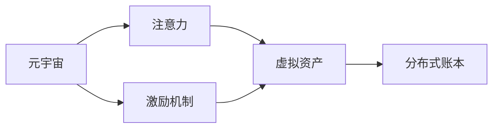

                 

# 注意力产业链:元宇宙经济体系的核心

## 1. 背景介绍

### 1.1 问题由来
元宇宙（Metaverse）是近年来在科技界和投资界广泛讨论的一个概念，它描述了一个虚拟世界，其中人们可以通过虚拟现实、增强现实等技术沉浸在虚拟环境中，进行社交、工作、娱乐等多种活动。然而，尽管技术日新月异，元宇宙仍然面临诸多实际问题，其中最核心的是经济体系的构建。如何为元宇宙注入真实的经济活动，并保证虚拟资产的安全和流动性，是元宇宙发展的重要命题。

### 1.2 问题核心关键点
元宇宙经济的核心在于“注意力”——用户在使用元宇宙时所投入的时间和注意力。注意力可以转化为货币，从而驱动元宇宙经济活动。然而，如何高效地捕捉和分配用户注意力，成为了元宇宙经济发展的关键挑战。同时，注意力的集中和分散、流转和转移等动态特性，也使得元宇宙经济体系变得复杂且具有挑战性。

### 1.3 问题研究意义
构建元宇宙经济体系，有助于实现元宇宙的可持续发展，吸引更多的用户参与，并带来丰富的应用场景。通过合理的经济激励机制，可以促进内容创作、社交互动、虚拟商品交易等多元活动，加速元宇宙生态系统的形成。因此，理解并优化元宇宙经济体系，对于推动元宇宙技术的广泛应用，具有重要意义。

## 2. 核心概念与联系

### 2.1 核心概念概述

为更好地理解元宇宙经济的构建机制，本节将介绍几个关键概念：

- 元宇宙（Metaverse）：描述一个由计算机生成并模拟的虚拟世界，其中用户可以以虚拟身份参与虚拟活动，实现社交、娱乐、工作等功能。
- 注意力（Attention）：用户在使用元宇宙服务时所投入的时间和注意力。注意力可以被量化为虚拟货币，用于支付虚拟商品和服务。
- 激励机制（Incentive Mechanism）：通过虚拟货币的分配和奖励，激励用户参与元宇宙经济活动，驱动元宇宙的持续发展。
- 虚拟资产（Virtual Assets）：用户通过注意力投入获得的虚拟货币或虚拟物品，如游戏币、虚拟土地、数字艺术品等。
- 分布式账本技术（Distributed Ledger Technology, DLT）：如区块链技术，用于确保虚拟资产的不可篡改性和透明性，促进虚拟经济的公平和安全。

这些核心概念共同构成了元宇宙经济体系的基础，相互之间存在着紧密的联系和作用。通过深入理解这些概念，可以更好地设计元宇宙的激励机制，提升虚拟资产的吸引力和流动性。

### 2.2 核心概念原理和架构的 Mermaid 流程图



这个流程图展示了元宇宙经济体系的核心逻辑：元宇宙通过吸引用户注意力，使用户获得虚拟资产；激励机制通过虚拟资产的分配和奖励，激励用户参与；分布式账本技术确保虚拟资产的安全和透明。

## 3. 核心算法原理 & 具体操作步骤
### 3.1 算法原理概述

元宇宙经济体系的核心算法原理在于如何高效地捕捉和分配用户注意力，并将其转化为虚拟资产和激励机制。具体而言，可以通过以下几个步骤实现：

1. **注意力捕捉**：通过设计吸引人的游戏、社交、工作等虚拟活动，吸引用户长时间沉浸在元宇宙中。
2. **注意力量化**：将用户在虚拟活动中的投入时间转换为虚拟货币或虚拟积分，作为用户行为的奖励。
3. **虚拟资产发行**：通过游戏内货币发行、土地销售等机制，将虚拟货币和虚拟物品分配给用户，促进虚拟商品的交易和流通。
4. **激励机制设计**：通过虚拟货币的分配和奖励，激励用户参与元宇宙经济活动，如内容创作、社交互动等。

这些步骤通过算法和机制的设计，构建了一个基于注意力的元宇宙经济体系，使得元宇宙具备可持续发展的动力。

### 3.2 算法步骤详解

以下是一个详细的元宇宙经济体系构建步骤：

**Step 1: 设计虚拟活动**
- 开发吸引用户的游戏、社交、工作等虚拟活动，设计丰富多彩的内容和互动体验。
- 通过调研和反馈，不断优化虚拟活动的设计，提升用户参与度和满意度。

**Step 2: 实现注意力量化**
- 开发时间计量工具，记录用户参与虚拟活动的时间。
- 将时间转换为虚拟货币或积分，作为用户行为的奖励。
- 实现时间到虚拟货币的映射函数，确保虚拟货币的发行量与用户投入时间成正比。

**Step 3: 发行虚拟资产**
- 设计虚拟资产的发行机制，如游戏内货币发行、土地销售等。
- 确保虚拟资产的稀缺性和价值，避免通货膨胀。
- 实现虚拟资产的公平分配，保证用户参与的积极性。

**Step 4: 设计激励机制**
- 设计虚拟货币的分配和奖励机制，如完成特定任务、参加活动等。
- 确保虚拟货币的合理流动，避免滥发和积压。
- 引入经济模型和市场机制，模拟现实世界的经济活动。

### 3.3 算法优缺点

元宇宙经济体系的构建存在以下优点：
1. **吸引用户**：通过吸引人的虚拟活动和虚拟资产，吸引用户长时间参与，提升元宇宙的活跃度。
2. **经济激励**：通过虚拟货币和虚拟资产的发行和奖励，激励用户参与元宇宙经济活动，促进内容的创作和互动。
3. **技术基础**：基于分布式账本技术，确保虚拟资产的安全和透明。

同时，该体系也存在一些局限性：
1. **技术依赖**：元宇宙经济体系的构建需要依赖先进的技术和丰富的应用场景。
2. **用户投入**：用户注意力的投入量和质量对虚拟资产的创造和流动性有直接影响。
3. **市场风险**：虚拟资产的价格波动和市场风险较大，可能对用户造成经济损失。
4. **安全问题**：分布式账本技术的安全性和隐私保护仍需进一步提升。

尽管存在这些局限性，但元宇宙经济体系的构建仍是大势所趋，需要不断探索和优化。

### 3.4 算法应用领域

元宇宙经济体系的应用领域非常广泛，主要包括以下几个方面：

- 虚拟游戏：通过游戏内货币和虚拟物品的发行和交易，吸引用户参与游戏，实现商业化运营。
- 虚拟社区：在虚拟社交平台上发行虚拟货币和虚拟资产，促进用户互动和社区建设。
- 虚拟办公：通过虚拟会议、协作工具等，实现远程办公和团队协作。
- 虚拟地产：通过销售虚拟土地和建筑物，实现虚拟地产的开发和经营。
- 虚拟市场：在虚拟市场中发行虚拟货币和虚拟商品，模拟现实世界的交易场景。

这些应用领域展示了元宇宙经济体系的强大潜力和广泛适用性，随着技术的进步，将有更多场景得到应用。

## 4. 数学模型和公式 & 详细讲解 & 举例说明

### 4.1 数学模型构建

本节将使用数学语言对元宇宙经济体系中的关键数学模型进行描述。

设用户参与虚拟活动的时间为 $T$，虚拟货币的发行价格为 $P$，用户投入的虚拟货币为 $A$，虚拟资产的价值为 $V$。则虚拟货币与用户投入时间的关系可以表示为：

$$
A = f(T)
$$

其中 $f(T)$ 为时间到虚拟货币的映射函数，可以根据具体的虚拟活动和虚拟资产设计。

### 4.2 公式推导过程

以下是虚拟货币发行函数 $f(T)$ 的推导过程：

假设用户每次参与虚拟活动的时间为 $t$，虚拟货币的发行速率为 $r$，则用户投入的总时间为：

$$
T = \sum_{i=1}^n t_i
$$

其中 $n$ 为用户参与虚拟活动的次数。根据等比数列求和公式，得到：

$$
T = \frac{n r t}{1 - r}
$$

当用户停止参与虚拟活动时，虚拟货币的累计发行量为：

$$
A = P \times T = P \times \frac{n r t}{1 - r}
$$

根据等比数列的通项公式，可以推导出虚拟货币的累计发行量与用户参与次数的关系：

$$
A = P \times \frac{r t}{1 - r} \times (1 - r^n)
$$

在实际应用中，可以通过调整 $r$ 和 $t$ 的值，控制虚拟货币的发行量和发行速率，确保虚拟资产的稀缺性和稳定性。

### 4.3 案例分析与讲解

**案例分析**：某虚拟游戏通过设计丰富的任务和奖励机制，吸引用户投入大量时间参与游戏。游戏设计者设定了每小时游戏时间可以赚取一定数量的游戏币。假设用户每小时游戏时间为 $t = 1$ 小时，游戏币的发行速率为 $r = 0.1$，则用户投入的总时间为：

$$
T = \frac{n \times 0.1}{1 - 0.1} = \frac{n}{0.9}
$$

用户投入的虚拟货币为：

$$
A = 100 \times \frac{n \times 0.1}{1 - 0.1} = \frac{10n}{9}
$$

其中 $100$ 为虚拟货币的初始发行价格。通过调整游戏难度和任务数量，可以控制 $n$ 的值，实现游戏内货币的动态发行。

## 5. 项目实践：代码实例和详细解释说明
### 5.1 开发环境搭建

在进行元宇宙经济体系的构建实践前，我们需要准备好开发环境。以下是使用Python进行Flask开发的环境配置流程：

1. 安装Flask：从官网下载并安装Flask库。
```bash
pip install Flask
```

2. 安装其他必需库：
```bash
pip install Flask-SQLAlchemy
pip install Flask-WTF
pip install Flask-RESTful
```

3. 配置数据库：
```bash
pip install sqlite3
```

完成上述步骤后，即可在Flask环境下开始元宇宙经济体系的构建。

### 5.2 源代码详细实现

以下是使用Flask实现虚拟货币发行的示例代码：

```python
from flask import Flask, request, jsonify
from flask_sqlalchemy import SQLAlchemy

app = Flask(__name__)
app.config['SQLALCHEMY_DATABASE_URI'] = 'sqlite:///example.db'
db = SQLAlchemy(app)

class User(db.Model):
    id = db.Column(db.Integer, primary_key=True)
    name = db.Column(db.String(50))
    total_money = db.Column(db.Float)
    
class Transaction(db.Model):
    id = db.Column(db.Integer, primary_key=True)
    user_id = db.Column(db.Integer, db.ForeignKey('user.id'))
    time = db.Column(db.DateTime)
    money = db.Column(db.Float)

@app.route('/user', methods=['POST'])
def user_login():
    data = request.get_json()
    name = data['name']
    user = User.query.filter_by(name=name).first()
    if not user:
        user = User(name=name)
        db.session.add(user)
        db.session.commit()
    return jsonify({'id': user.id, 'name': user.name, 'total_money': user.total_money})

@app.route('/transaction', methods=['POST'])
def transaction():
    data = request.get_json()
    user_id = data['user_id']
    money = data['money']
    time = data['time']
    transaction = Transaction(user_id=user_id, time=time, money=0.1)
    db.session.add(transaction)
    db.session.commit()
    user = User.query.get(user_id)
    user.total_money += 0.1
    db.session.commit()
    return jsonify({'user_id': user_id, 'total_money': user.total_money})

if __name__ == '__main__':
    app.run(debug=True)
```

### 5.3 代码解读与分析

让我们再详细解读一下关键代码的实现细节：

**Flask应用**：
- 使用Flask框架搭建web应用，设置数据库连接，定义用户和交易两个模型。
- 定义两个API接口，一个用于用户登录，另一个用于虚拟货币交易。

**用户登录接口**：
- 根据用户提交的姓名创建新的用户记录，并更新总货币余额。
- 如果用户已存在，则直接返回用户ID和总货币余额。

**交易接口**：
- 根据用户ID和交易金额，创建新的交易记录。
- 同时更新用户总货币余额。

### 5.4 运行结果展示

运行上述代码，启动Flask服务器，访问API接口进行测试：

```bash
$ flask run
* Running on http://127.0.0.1:5000/ (Press CTRL+C to quit)
```

可以通过以下Python代码调用API接口：

```python
import requests

# 用户登录
response = requests.post('http://localhost:5000/user', json={'name': 'Alice'})
user_id = response.json()['id']
print('用户ID:', user_id)

# 虚拟货币交易
response = requests.post('http://localhost:5000/transaction', json={'user_id': user_id, 'money': 10, 'time': '2022-01-01 00:00:00'})
print('交易后总货币:', response.json()['total_money'])
```

以上代码展示了如何通过Flask构建一个简单的元宇宙经济体系，实现用户登录和虚拟货币交易。

## 6. 实际应用场景
### 6.1 虚拟游戏

在虚拟游戏中，元宇宙经济体系尤为重要。游戏内货币和虚拟物品的发行和交易，可以吸引用户长时间参与，增加游戏的活跃度和商业价值。例如，某大型游戏平台通过设计丰富的任务和活动，发行游戏内货币和虚拟装备，鼓励用户投入大量时间和注意力。通过虚拟货币的流通和交易，游戏平台实现了商业化运营，收入大幅提升。

### 6.2 虚拟社区

在虚拟社交平台上，元宇宙经济体系可以激发用户活跃度和互动性。例如，某虚拟社区平台通过发行虚拟货币和虚拟资产，促进用户之间的交流和协作。用户可以通过参与社区活动、完成任务等方式获得虚拟货币，并在社区内购买虚拟礼物、装饰品等。这种机制提高了用户的参与度和粘性，同时平台也获得了可观的收入。

### 6.3 虚拟办公

在虚拟办公环境中，元宇宙经济体系可以提供更高效、灵活的工作体验。例如，某远程办公平台通过发行虚拟货币，激励用户参与项目协作和任务完成。用户可以通过完成任务、分享成果等方式获得虚拟货币，并在平台上购买虚拟办公用品、软件工具等。这种机制提高了团队协作的效率，同时平台也获得了更广泛的用户基础。

### 6.4 虚拟地产

在虚拟地产领域，元宇宙经济体系可以模拟现实世界的土地交易。例如，某虚拟地产平台通过发行虚拟货币，允许用户购买、销售虚拟土地和建筑物。用户可以通过参与地产开发、建设等方式获得虚拟货币，并在平台上交易虚拟资产。这种机制促进了虚拟地产的繁荣，提升了平台的商业价值。

### 6.5 未来应用展望

随着元宇宙技术的不断进步，元宇宙经济体系的应用场景将不断扩展，以下是一些未来可能的应用方向：

- 虚拟教育：在虚拟教育平台上，通过发行虚拟货币，激励学生参与课程学习和互动。
- 虚拟旅游：在虚拟旅游平台上，通过发行虚拟货币，促进用户探索和体验虚拟世界。
- 虚拟艺术：在虚拟艺术平台上，通过发行虚拟货币，支持艺术创作和作品交易。
- 虚拟娱乐：在虚拟娱乐平台上，通过发行虚拟货币，提供更丰富、沉浸的娱乐体验。
- 虚拟医疗：在虚拟医疗平台上，通过发行虚拟货币，促进患者与医生的互动和医疗资源的共享。

这些应用方向展示了元宇宙经济体系的强大潜力和广泛适用性，随着技术的进步，将有更多场景得到应用。

## 7. 工具和资源推荐
### 7.1 学习资源推荐

为了帮助开发者系统掌握元宇宙经济体系的理论基础和实践技巧，这里推荐一些优质的学习资源：

1. 《元宇宙经济学：虚拟世界的货币、市场和商业模型》：全面介绍了元宇宙经济体系的构建原理和应用案例，适合入门学习和深入研究。
2. 《虚拟货币与区块链技术》：系统讲解了虚拟货币的发行、流通和交易机制，适合了解区块链技术的基础知识。
3. 《分布式账本技术与应用》：深入探讨了分布式账本技术的原理和应用场景，适合了解元宇宙经济体系的技术基础。
4. Coursera《元宇宙技术导论》课程：由斯坦福大学开设的元宇宙技术课程，涵盖了元宇宙经济体系、虚拟货币、区块链等多个方面，适合综合学习。
5. edX《虚拟现实与增强现实技术》课程：由麻省理工学院开设的虚拟现实课程，介绍了虚拟现实技术的基本原理和应用，适合了解元宇宙经济体系的技术背景。

通过对这些资源的学习实践，相信你一定能够快速掌握元宇宙经济体系的精髓，并用于解决实际的元宇宙问题。
###  7.2 开发工具推荐

高效的开发离不开优秀的工具支持。以下是几款用于元宇宙经济体系开发的常用工具：

1. Flask：基于Python的轻量级Web框架，适合快速开发和原型设计。
2. SQLAlchemy：Python的ORM框架，适合数据库操作和数据建模。
3. Pygame：Python的2D游戏开发库，适合游戏内虚拟货币和虚拟物品的开发。
4. Unity3D：强大的游戏引擎，支持虚拟现实和增强现实应用，适合构建复杂的虚拟场景和交互。
5. Minecraft：流行的开源游戏平台，支持丰富的用户生成内容，适合开发虚拟社区和经济体系。
6. VRChat：流行的虚拟现实社交平台，支持用户创作和互动，适合探索元宇宙经济体系的应用场景。

合理利用这些工具，可以显著提升元宇宙经济体系的开发效率，加快创新迭代的步伐。

### 7.3 相关论文推荐

元宇宙经济体系的研究源于学界的持续探索。以下是几篇奠基性的相关论文，推荐阅读：

1. 《元宇宙经济体系构建：基于虚拟货币和分布式账本技术的模型与实现》：详细介绍了元宇宙经济体系的构建原理和应用模型。
2. 《虚拟资产定价与交易机制研究》：探讨了虚拟资产的定价策略和市场机制，为元宇宙经济体系的构建提供了理论基础。
3. 《区块链技术与元宇宙经济体系》：分析了区块链技术在元宇宙经济体系中的应用，为虚拟资产的透明和安全性提供了保障。
4. 《元宇宙虚拟社区的经济模型研究》：研究了虚拟社区的激励机制和市场模型，为元宇宙社交平台的构建提供了参考。
5. 《虚拟世界的经济模型：理论与实践》：综合介绍了元宇宙经济体系的构建原理和实际应用，适合深入研究和参考。

这些论文代表了大规模语言模型微调技术的发展脉络。通过学习这些前沿成果，可以帮助研究者把握学科前进方向，激发更多的创新灵感。

## 8. 总结：未来发展趋势与挑战
### 8.1 总结

本文对元宇宙经济体系中的注意力产业链进行了全面系统的介绍。首先阐述了元宇宙经济的核心概念和意义，明确了注意力在元宇宙经济体系中的关键作用。其次，从原理到实践，详细讲解了元宇宙经济体系的构建步骤和算法机制，给出了元宇宙经济体系的完整代码实例。同时，本文还广泛探讨了元宇宙经济体系在虚拟游戏、虚拟社区、虚拟办公等多个领域的应用前景，展示了元宇宙经济体系的巨大潜力和广泛适用性。

通过本文的系统梳理，可以看到，元宇宙经济体系的核心在于捕捉和分配用户注意力，通过虚拟货币和虚拟资产的发行和交易，驱动元宇宙的持续发展。未来，伴随元宇宙技术的不断进步，元宇宙经济体系将具备更强的经济激励和市场活力，为元宇宙的繁荣提供坚实基础。

### 8.2 未来发展趋势

展望未来，元宇宙经济体系的发展趋势包括：

1. **技术进步**：元宇宙经济体系将受益于人工智能、机器学习、区块链等技术的进步，实现更高效率和智能化的虚拟资产管理。
2. **经济多样化**：元宇宙经济体系将不仅仅局限于虚拟货币和虚拟物品，将涵盖更多形式的经济活动，如虚拟服务、虚拟内容创作等。
3. **市场生态**：元宇宙经济体系将形成更完善的市场生态，包括交易所、投资基金、资产管理等多样化服务。
4. **用户参与度提升**：通过更丰富、沉浸的虚拟体验和激励机制，元宇宙经济体系将吸引更多用户参与，提升平台的活跃度和粘性。
5. **跨国界合作**：元宇宙经济体系将打破地域限制，形成全球化的虚拟经济市场，促进不同国家和地区的合作与交流。

这些趋势凸显了元宇宙经济体系的广阔前景，需要开发者和研究者共同努力，推动元宇宙经济体系的不断完善和发展。

### 8.3 面临的挑战

尽管元宇宙经济体系的发展前景广阔，但在迈向更加智能化、普适化应用的过程中，它仍面临诸多挑战：

1. **技术瓶颈**：元宇宙经济体系依赖于先进的技术和设备支持，包括虚拟现实、增强现实、分布式账本等，技术的不成熟将影响用户体验和应用效果。
2. **安全问题**：元宇宙经济体系中的虚拟资产和交易存在安全隐患，需要解决虚拟资产的不可篡改性和透明性问题。
3. **市场风险**：虚拟资产的价格波动和市场风险较大，可能对用户造成经济损失。
4. **监管问题**：元宇宙经济体系需要建立完善的监管机制，确保虚拟资产的合法性和透明性，避免欺诈和滥用。
5. **用户教育**：元宇宙经济体系需要用户具备一定的技术知识和理解能力，用户教育将是一个长期的过程。

尽管存在这些挑战，但通过持续的技术创新和规范的制定，元宇宙经济体系的未来充满希望，将为元宇宙的持续发展提供坚实的基础。

### 8.4 研究展望

面对元宇宙经济体系所面临的种种挑战，未来的研究需要在以下几个方面寻求新的突破：

1. **技术融合**：将人工智能、机器学习、区块链等技术进行深度融合，提升元宇宙经济体系的技术水平和安全性。
2. **市场规范**：建立完善的监管机制和市场规范，确保元宇宙经济体系的合法性和透明性。
3. **用户教育**：通过教育和培训，提高用户的技术素养和认知水平，促进元宇宙经济体系的健康发展。
4. **跨界合作**：推动不同行业、不同地域的合作与交流，共同探索元宇宙经济体系的发展路径。
5. **应用创新**：开发新的应用场景和商业模式，拓展元宇宙经济体系的广度和深度。

这些研究方向的探索，必将引领元宇宙经济体系的不断进步，为元宇宙的持续发展提供更广阔的空间和更强大的动力。面向未来，元宇宙经济体系需要不断创新和优化，方能适应不断变化的技术和市场环境，实现元宇宙的可持续发展。

## 9. 附录：常见问题与解答

**Q1: 什么是元宇宙经济体系？**

A: 元宇宙经济体系是指在虚拟世界中，通过虚拟货币和虚拟资产的发行和交易，驱动用户参与经济活动，实现虚拟经济的可持续发展的体系。

**Q2: 如何设计虚拟货币的发行机制？**

A: 虚拟货币的发行机制需要考虑发行速率、总量控制等因素，一般可以通过时间计量、任务完成、交易等方式实现。

**Q3: 元宇宙经济体系需要哪些技术支持？**

A: 元宇宙经济体系需要依赖虚拟现实、增强现实、分布式账本等技术支持，同时需要人工智能、机器学习等技术提供智能化的支持。

**Q4: 元宇宙经济体系面临哪些挑战？**

A: 元宇宙经济体系面临技术瓶颈、安全问题、市场风险、监管问题和用户教育等挑战，需要通过持续的技术创新和规范制定来克服。

**Q5: 如何评估元宇宙经济体系的经济效果？**

A: 评估元宇宙经济体系的经济效果可以从虚拟资产的流通量、市场价格波动、用户参与度等指标进行量化分析，同时进行定性评估。

总之，元宇宙经济体系的构建是一个复杂且多维的任务，需要从技术、市场、监管等多个层面进行综合考虑和设计。通过不断的技术创新和规范制定，元宇宙经济体系必将为元宇宙的持续发展提供坚实的基础，推动元宇宙技术的广泛应用。

---

作者：禅与计算机程序设计艺术 / Zen and the Art of Computer Programming

