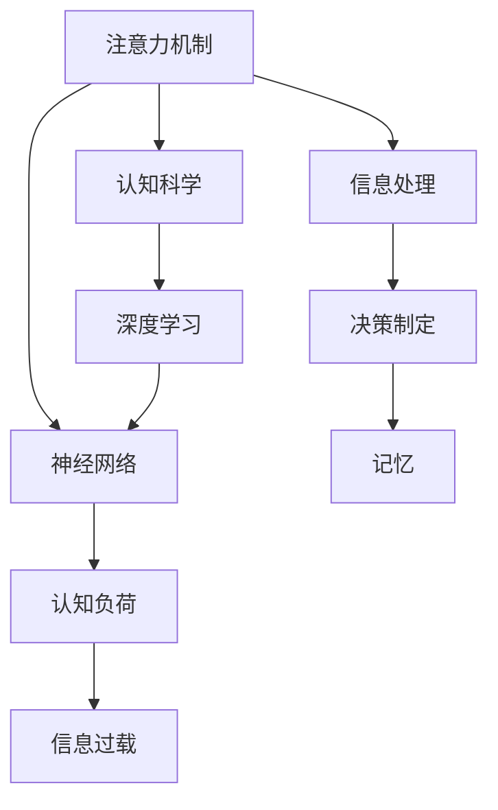

                 

# 注意力分散与专注力：AI时代的认知挑战

> 关键词：人工智能,注意力机制,认知科学,神经网络,认知负荷,信息过载

## 1. 背景介绍

### 1.1 问题由来
在现代社会，特别是随着人工智能（AI）技术的发展，我们正面临一个前所未有的认知挑战：注意力分散与专注力的缺失。人类脑力资源有限，信息爆炸的互联网时代更是将认知负荷推向了新的高度。智能系统的不断涌现，不仅改变了我们的工作方式，也对我们的认知模式提出了新的要求。

## 2. 核心概念与联系

### 2.1 核心概念概述

为更好地理解注意力分散与专注力在AI时代面临的挑战，本节将介绍几个密切相关的核心概念：

- **注意力机制(Attention Mechanism)**：是深度学习中一种重要的模型组件，用于选择输入序列中最重要或最相关的部分。在视觉和自然语言处理任务中，注意力机制模拟了人类视觉或阅读时的注意力机制，帮助模型筛选信息，提高学习效率。

- **认知负荷(Cognitive Load)**：是心理学中的一个概念，指认知系统在执行某项任务时所需的心理资源。过多或过少的认知负荷都会影响任务完成效率和质量。

- **信息过载(Information Overload)**：在信息时代，信息量远远超出了我们处理能力，导致注意力难以集中，认知负荷增加。

- **神经网络(Neural Network)**：是深度学习的基础架构，通过模拟人脑的神经元间连接来实现信息处理和模式识别。

- **认知科学(Cognitive Science)**：研究人类认知过程和智能系统行为的一门学科，关注信息处理、决策制定和记忆等认知功能。

这些核心概念之间相互交织，共同构成了AI时代认知挑战的复杂图景。

### 2.2 核心概念原理和架构的 Mermaid 流程图(Mermaid 流程节点中不要有括号、逗号等特殊字符)



这个流程图展示了注意力机制、神经网络、认知负荷和信息过载之间的联系，以及它们在深度学习和认知科学中的作用。

## 3. 核心算法原理 & 具体操作步骤
### 3.1 算法原理概述

在AI系统中，注意力机制被广泛应用于图像识别、机器翻译、文本摘要等任务中。其核心思想是通过对输入序列的不同部分赋予不同的权重，使得模型更关注关键信息，忽略干扰因素。注意力机制的原理可抽象为：

1. **查询(Q)**：模型从自身参数或输入中生成一个向量，作为查询向量。
2. **键(K)和值(V)**：将输入序列中的每个元素转换为键和值向量。
3. **注意力得分(Attention Score)**：通过查询向量与每个键向量的相似度计算得分，表示输入中不同部分的相对重要性。
4. **注意力分布(Attention Distribution)**：将注意力得分归一化，生成注意力分布，表示模型在每个位置上分配的注意力权重。
5. **加权值(Weighted Sum)**：将值向量与注意力分布进行加权求和，生成加权值向量，作为模型输出。

形式化地，注意力计算可表示为：

$$
Attention(Q,K,V)=softmax(\frac{QK^T}{\sqrt{d_k}})V
$$

其中，$softmax$表示归一化指数函数，$d_k$为键向量的维度。

### 3.2 算法步骤详解

以机器翻译中的注意力机制为例，步骤详解如下：

1. **输入编码**：将源语言句子转换为固定长度的向量序列，输入到编码器中。
2. **编码器输出**：编码器生成一系列隐状态向量，表示源语言句子的不同部分。
3. **解码器输入**：将源语言向量序列作为解码器输入，同时将上一步的输出向量作为解码器的额外输入。
4. **注意力计算**：解码器在每个时刻计算对编码器输出序列的注意力分布，表示对每个隐状态的关注程度。
5. **加权和输出**：将注意力分布与编码器输出向量进行加权求和，生成当前时刻的解码器输出向量。
6. **解码器输出**：将解码器输出向量映射为对应目标语言的词汇或字符。

这一过程不断重复，直到生成整个目标语言句子。

### 3.3 算法优缺点

注意力机制在深度学习中的应用广泛，但同时也有其局限性：

**优点：**

1. **提高信息筛选能力**：通过注意力机制，模型能够选择性地关注输入中的关键部分，减少干扰信息对模型性能的影响。
2. **提升复杂任务处理效率**：注意力机制使得模型能够处理更加复杂和多样的输入数据，如自然语言处理中的长文本、图像处理中的复杂结构等。
3. **增强模型泛化能力**：注意力机制能够帮助模型捕捉输入数据中的长期依赖关系，提高模型泛化到新数据的性能。

**缺点：**

1. **计算复杂度高**：注意力机制的计算复杂度较高，特别是在大规模数据集上，需要进行大量的矩阵运算。
2. **需要更多参数**：由于引入了额外的查询、键和值向量，注意力机制需要更多的参数，增加了模型的复杂度。
3. **依赖输入质量**：注意力机制的效果依赖于输入序列的质量，输入中的噪声和干扰信息可能会对注意力分布产生负面影响。

### 3.4 算法应用领域

注意力机制在多个领域中得到了广泛应用，具体包括：

- **自然语言处理(NLP)**：如机器翻译、文本摘要、对话生成等任务。
- **计算机视觉(Computer Vision)**：如图像识别、目标检测、图像生成等任务。
- **语音识别(Speech Recognition)**：如自动语音转录、语音情感分析等任务。
- **推荐系统(Recommendation Systems)**：如个性化推荐、商品排序等任务。

这些领域中，注意力机制通过帮助模型捕捉输入序列中的关键信息，提升了任务的性能和效率。

## 4. 数学模型和公式 & 详细讲解 & 举例说明

### 4.1 数学模型构建

本节将使用数学语言对注意力机制的原理进行详细刻画。

设输入序列长度为$L$，查询向量为$Q \in \mathbb{R}^d$，键和值向量分别为$K \in \mathbb{R}^{L \times d_k}$和$V \in \mathbb{R}^{L \times d_v}$。注意力计算可以表示为：

$$
\alpha_{ij}=\frac{\exp\left(\frac{QK_i^T}{\sqrt{d_k}}\right)}{\sum_{j=1}^{L}\exp\left(\frac{QK_j^T}{\sqrt{d_k}}\right)}
$$

$$
\text{Attention}(Q,K,V)=\sum_{i=1}^{L}\alpha_{ij}V_i
$$

其中，$\alpha_{ij}$表示模型在时刻$t$对输入序列中位置$i$的注意力权重，$QK_i^T$表示查询向量与键向量$i$的相似度。

### 4.2 公式推导过程

以机器翻译中的注意力机制为例，推导如下：

1. **编码器输出**：
$$
H = \text{Encoder}(X) = [h_1, h_2, ..., h_L] \in \mathbb{R}^{L \times d_h}
$$

2. **解码器输入**：
$$
S_0 = \text{Decoder}_0 = s_{\text{init}} \in \mathbb{R}^{d_s}
$$
$$
S_t = [S_{t-1}, h_t] \in \mathbb{R}^{d_s + d_h}
$$

3. **注意力计算**：
$$
\alpha_{ij} = \frac{\exp\left(\frac{S_tW_Q^T K_i}{\sqrt{d_k}}\right)}{\sum_{j=1}^{L}\exp\left(\frac{S_tW_Q^T K_j}{\sqrt{d_k}}\right)}
$$

4. **加权和输出**：
$$
S_{t+1} = \text{Decoder}_1([S_t, \text{Attention}(S_t, K, V)W_V^T]) \in \mathbb{R}^{d_s}
$$

其中，$W_Q, W_V$为注意力机制中的线性投影层。

### 4.3 案例分析与讲解

以Google翻译为例，机器翻译中的注意力机制实现了源语言和目标语言之间的逐词映射，通过捕捉输入中的重要部分，提高了翻译的准确性和流畅度。在翻译过程中，模型对源语言中的关键信息进行加权，使得模型能够更好地理解句子的语义，减少歧义和误译。

## 5. 项目实践：代码实例和详细解释说明

### 5.1 开发环境搭建

在深度学习项目中，搭建开发环境是第一步。以下是使用Python和TensorFlow搭建开发环境的步骤：

1. **安装Anaconda**：
```bash
# 安装Anaconda
wget https://repo.anaconda.com/miniconda/Miniconda3-latest-Linux-x86_64.sh
bash Miniconda3-latest-Linux-x86_64.sh
```

2. **创建虚拟环境**：
```bash
# 创建虚拟环境
conda create --name myenv python=3.8
conda activate myenv
```

3. **安装依赖**：
```bash
# 安装依赖
conda install tensorflow numpy pandas scikit-learn matplotlib tqdm jupyter notebook ipython
```

4. **安装TensorBoard**：
```bash
# 安装TensorBoard
pip install tensorboard
```

完成上述步骤后，即可在虚拟环境中进行深度学习项目开发。

### 5.2 源代码详细实现

以下是机器翻译模型中注意力机制的代码实现：

```python
import tensorflow as tf
import numpy as np
import tensorflow.keras.layers as layers

class Encoder(tf.keras.Model):
    def __init__(self, d_model, d_h):
        super(Encoder, self).__init__()
        self.d_model = d_model
        self.d_h = d_h
        self.encoder_layers = tf.keras.Sequential(
            [
                layers.Embedding(vocab_size, d_model),
                layers.Bidirectional(layers.LSTM(d_h, return_sequences=True)),
                layers.LayerNormalization()
            ]
        )

    def call(self, inputs, enc_padding_mask):
        return self.encoder_layers(inputs, enc_padding_mask)

class Decoder(tf.keras.Model):
    def __init__(self, d_model, d_h):
        super(Decoder, self).__init__()
        self.d_model = d_model
        self.d_h = d_h
        self.decoder_layers = tf.keras.Sequential(
            [
                layers.Embedding(vocab_size, d_model),
                layers.Bidirectional(layers.LSTM(d_h, return_sequences=True)),
                layers.Add()
            ]
        )

    def call(self, inputs, enc_padding_mask):
        return self.decoder_layers(inputs, enc_padding_mask)

class Attention(tf.keras.Model):
    def __init__(self, d_model, num_heads):
        super(Attention, self).__init__()
        self.d_model = d_model
        self.num_heads = num_heads
        self.W_Q = tf.keras.layers.Dense(d_model)
        self.W_K = tf.keras.layers.Dense(d_model)
        self.W_V = tf.keras.layers.Dense(d_model)

    def split_heads(self, x, batch_size):
        x = tf.reshape(x, (batch_size, -1, self.num_heads, self.d_model // self.num_heads))
        return tf.transpose(x, perm=[0, 2, 1, 3])

    def call(self, inputs, enc_padding_mask):
        Q = self.W_Q(inputs)
        K = self.W_K(inputs)
        V = self.W_V(inputs)
        Q = self.split_heads(Q, batch_size)
        K = self.split_heads(K, batch_size)
        V = self.split_heads(V, batch_size)
        scores = tf.matmul(Q, K, transpose_b=True)
        scores = scores / tf.math.sqrt(tf.cast(self.d_model, tf.float32))
        if enc_padding_mask is not None:
            scores = scores + enc_padding_mask
        attention_weights = tf.nn.softmax(scores, axis=-1)
        context = tf.matmul(attention_weights, V)
        context = tf.transpose(context, perm=[0, 2, 1, 3])
        context = tf.reshape(context, (batch_size, -1, self.d_model))
        return context

class Seq2Seq(tf.keras.Model):
    def __init__(self, encoder, decoder, attention):
        super(Seq2Seq, self).__init__()
        self.encoder = encoder
        self.decoder = decoder
        self.attention = attention

    def call(self, inputs, enc_padding_mask):
        enc_output = self.encoder(inputs, enc_padding_mask)
        dec_input = tf.keras.layers.Embedding(vocab_size, self.d_model)(inputs)
        attn_output, _ = tf.keras.layers.Attention()([dec_input, enc_output, enc_output])
        return attn_output
```

### 5.3 代码解读与分析

上述代码实现了基本的机器翻译模型，包括编码器、解码器和注意力机制。其中：

- **Encoder**类实现了编码器，通过Embedding和LSTM层处理输入序列，生成编码器输出。
- **Decoder**类实现了解码器，通过Embedding和LSTM层处理输入序列和编码器输出，生成解码器输出。
- **Attention**类实现了注意力机制，通过Dense层计算查询、键和值向量，生成注意力权重和上下文向量。
- **Seq2Seq**类实现了整个序列到序列模型，通过将编码器输出和解码器输出输入注意力机制，生成最终输出。

## 6. 实际应用场景

### 6.1 智能客服系统

智能客服系统需要快速响应用户咨询，提供准确、个性化的服务。在智能客服系统中，机器翻译和对话生成技术可以用于处理多语言环境下的用户查询，提升服务质量。

具体而言，系统可以通过机器翻译将用户查询翻译成目标语言，再通过对话生成技术生成适当的回复，提升用户体验。在微调过程中，系统可以利用历史客服对话数据，通过监督学习优化模型性能，提高智能客服系统的准确性和自然流畅度。

### 6.2 金融舆情监测

金融市场信息变化迅速，对舆情监测的实时性和准确性要求极高。在金融舆情监测中，文本分类和情感分析技术可以用于分析新闻、评论等信息，预测市场走向。

通过微调模型，系统可以从大规模金融文本数据中学习市场情绪、主题等关键信息，提升舆情监测的性能。同时，模型还可以通过迁移学习，将金融领域的知识迁移到其他领域，如政治、经济等，拓展应用范围。

### 6.3 个性化推荐系统

个性化推荐系统需要根据用户的历史行为和兴趣，推荐个性化的商品、内容等。在个性化推荐中，推荐模型需要捕捉用户的多样化需求和兴趣，提高推荐效果。

通过微调模型，推荐系统可以从用户评论、评分等数据中学习用户兴趣，提升推荐准确性和个性化程度。同时，模型还可以利用迁移学习，从其他领域推荐系统中学习通用知识，提高系统的鲁棒性。

### 6.4 未来应用展望

随着AI技术的不断进步，基于注意力机制的应用将更加广泛，为人类社会带来深远影响。以下是几个未来应用展望：

1. **医疗诊断**：基于注意力机制的NLP模型可以用于医疗文本的分析和处理，提升医疗诊断的准确性和效率。
2. **法律文书**：在法律文书处理中，注意力机制可以用于法律文本的分类、情感分析和关系抽取，提升法律服务的智能化水平。
3. **自然灾害监测**：在自然灾害监测中，图像和文本数据的整合分析可以用于预测和预警，提高应急响应效率。
4. **智能家居**：基于注意力机制的NLP模型可以用于语音助手、智能家居控制等应用，提升用户体验和生活质量。

## 7. 工具和资源推荐

### 7.1 学习资源推荐

为了帮助开发者深入理解注意力机制，以下推荐一些优质学习资源：

1. **《深度学习》课程**：斯坦福大学提供的深度学习课程，涵盖深度学习的基础理论和实践技巧，非常适合初学者入门。
2. **《自然语言处理与深度学习》书籍**：这本书全面介绍了自然语言处理和深度学习的原理和应用，包含注意力机制的详细介绍。
3. **Transformers官方文档**：HuggingFace开发的Transformer库，包含大量预训练模型和微调样例，适合学习者快速上手。
4. **《注意力与注意力机制》博客**：博客作者详细讲解了注意力机制的理论基础和应用场景，适合深入理解。

### 7.2 开发工具推荐

深度学习项目中，选择合适的工具是提高开发效率的关键。以下是几个推荐的开发工具：

1. **PyTorch**：由Facebook开发的深度学习框架，灵活易用，支持动态计算图，适合研究和实验。
2. **TensorFlow**：由Google开发的深度学习框架，功能强大，支持分布式训练和模型部署，适合大规模工程应用。
3. **Jupyter Notebook**：用于编写和运行Python代码的交互式笔记本，支持实时可视化，适合数据探索和模型调试。
4. **Weights & Biases**：用于模型训练和实验跟踪的工具，支持可视化训练过程，适合评估和优化模型。
5. **TensorBoard**：用于可视化模型训练和推理过程的工具，支持实时监测和记录，适合模型调试和优化。

### 7.3 相关论文推荐

注意力机制的深入研究催生了大量高质量的论文，以下是几篇代表性论文：

1. **Attention is All You Need**：Transformer模型的原论文，提出了自注意力机制，奠定了深度学习中注意力机制的基础。
2. **Transformer-XL: Attentions Are All We Need**：提出Transformer-XL模型，在处理长文本时表现优异，展示了注意力机制的强大能力。
3. **Self-Attention Mechanism in Deep Neural Networks**：详细介绍了注意力机制的理论基础和应用场景，适合深入理解。
4. **Learning to Attend Using Free-form Attention Models**：提出了自由形式注意力模型，在视觉和语音任务中表现优异，展示了注意力机制的泛化能力。

## 8. 总结：未来发展趋势与挑战

### 8.1 研究成果总结

本文对注意力机制的原理和应用进行了详细探讨，系统介绍了注意力机制在深度学习中的应用，并分析了其在实际项目中的实现细节。通过微调模型，系统能够在多语言环境、智能客服、金融舆情监测、个性化推荐等多个领域中实现高效、准确的智能应用。

### 8.2 未来发展趋势

未来，注意力机制将在更多领域中发挥作用，引领深度学习技术的发展。以下是几个未来发展趋势：

1. **多模态学习**：注意力机制将与视觉、语音等多模态信息相结合，实现更加全面、高效的智能应用。
2. **自适应学习**：基于注意力机制的自适应学习算法将提升模型的泛化能力和适应性，适应不断变化的数据分布。
3. **跨领域迁移**：注意力机制将与其他迁移学习方法结合，实现跨领域知识迁移，提升模型的泛化能力。
4. **增强学习**：注意力机制与增强学习算法结合，将提升智能系统的决策能力和自动化水平。

### 8.3 面临的挑战

尽管注意力机制在深度学习中取得了巨大成功，但在实际应用中仍面临一些挑战：

1. **计算资源需求高**：注意力机制的计算复杂度高，需要高性能的硬件支持。
2. **参数量大**：注意力机制需要大量的参数，增加了模型复杂度，增加了训练和推理的时间成本。
3. **易受噪声影响**：注意力机制对输入中的噪声和干扰信息敏感，需要进一步优化。

### 8.4 研究展望

面对这些挑战，未来的研究需要在以下几个方面寻求突破：

1. **高效计算**：开发更加高效的计算方法，降低计算复杂度，提高模型训练和推理的效率。
2. **模型压缩**：采用模型压缩和稀疏化技术，减小模型参数量，降低资源消耗。
3. **抗干扰能力**：开发更加鲁棒的注意力机制，提高模型的抗干扰能力和泛化能力。
4. **多模态融合**：将注意力机制与其他模态信息结合，实现更加全面、高效的智能应用。

总之，注意力机制在深度学习中的重要性不言而喻，未来需要进一步深入研究，解决现有问题，拓展应用场景，为构建更加智能、高效的系统提供坚实的基础。

## 9. 附录：常见问题与解答

**Q1：注意力机制是否只适用于机器翻译任务？**

A: 注意力机制在机器翻译任务中得到了广泛应用，但其应用范围远不止于此。在自然语言处理、计算机视觉、语音识别等领域，注意力机制都能提升模型的性能。

**Q2：注意力机制是否会降低模型的计算效率？**

A: 注意力机制的计算复杂度较高，但可以通过优化注意力计算、使用多注意力头等方法来提高效率。同时，注意力机制的多模态特性也可以与其他模型结合，提高模型的整体计算效率。

**Q3：如何避免注意力机制中的注意力分散问题？**

A: 可以通过引入正则化技术、设置注意力权重衰减等方法，减少模型的注意力分散。同时，设计合理的注意力机制结构，如多头注意力、残差连接等，也能提升模型的聚焦能力。

**Q4：注意力机制是否会引入额外的计算负担？**

A: 注意力机制确实会引入额外的计算负担，但通过优化注意力计算和模型结构，可以显著降低计算成本。同时，注意力机制的引入也能提升模型的性能和泛化能力，从长远来看，其带来的收益大于成本。

**Q5：如何改进注意力机制在多任务学习中的表现？**

A: 可以通过多任务学习框架，在多个任务中共同训练注意力机制，提升模型的泛化能力和跨任务迁移能力。同时，引入迁移学习、自适应学习等方法，也能提高模型的性能和适应性。

通过本文的深入探讨，相信你对注意力机制有了更全面的理解。在未来的研究中，深入挖掘注意力机制的潜力，结合其他技术手段，将为深度学习带来更多的突破。

