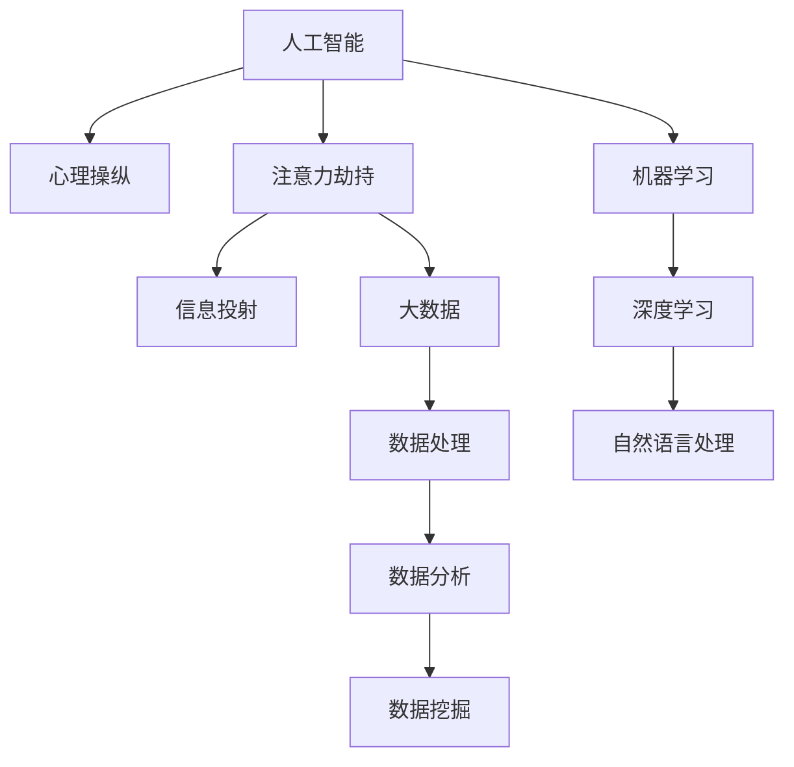

                 

# 注意力劫持：AI时代的心理操纵

> 关键词：AI, 心理操纵, 注意力劫持, 信息投射, 大数据, 深度学习, 机器学习, 数据分析

## 1. 背景介绍

在AI技术的加持下，我们进入了所谓的“智能时代”。然而，伴随智能发展的不仅仅是便利和效率，还有一种潜在的、悄无声息的力量在悄悄影响着我们的行为和决策，这种力量被称为“注意力劫持”。注意力劫持，即通过大数据、深度学习、机器学习等技术，持续不断地影响和操纵用户的注意力，以实现特定的目标，如广告推送、用户行为引导、市场监控等。

在过去，广告主主要通过传统媒体（电视、报纸、广播等）进行广告投放，这些媒体资源昂贵且固定，往往无法精确地到达目标用户。而AI技术的发展，特别是大数据和深度学习技术的成熟，使得广告投放变得更加精准和高效，能够实现个性化推荐和用户画像的精准构建。然而，这种精准背后隐藏着一种潜在的心理操纵，即利用算法影响和操纵用户的行为和决策，从而实现商业目标。

## 2. 核心概念与联系

### 2.1 核心概念概述

为更好地理解注意力劫持现象，本节将介绍几个密切相关的核心概念：

- 人工智能（Artificial Intelligence, AI）：通过模拟人类智能行为，实现对复杂数据、模式、决策的自动处理和优化，包括机器学习、深度学习、自然语言处理等子领域。
- 心理操纵（Psychological Manipulation）：利用心理学原理，通过特定的手段和策略，影响和操纵个体的心理状态、行为倾向和决策过程。
- 注意力劫持（Attention Hijacking）：通过算法和大数据分析技术，持续不断地影响和操纵用户的注意力，从而实现特定的商业、社会或政治目标。
- 信息投射（Information Projection）：利用算法对用户行为数据进行分析和建模，投射出用户潜在的兴趣和需求，进行个性化的推荐和引导。
- 大数据（Big Data）：以容量大、速度快、种类多等特点为标志的数据集，支持复杂的数据分析、数据挖掘和机器学习任务。

这些核心概念之间的逻辑关系可以通过以下Mermaid流程图来展示：



这个流程图展示了大语言模型的核心概念及其之间的关系：

1. 人工智能通过模拟人类智能行为，实现对复杂数据、模式、决策的自动处理和优化，包括机器学习、深度学习、自然语言处理等子领域。
2. 心理操纵利用心理学原理，通过特定的手段和策略，影响和操纵个体的心理状态、行为倾向和决策过程。
3. 注意力劫持通过算法和大数据分析技术，持续不断地影响和操纵用户的注意力，从而实现特定的商业、社会或政治目标。
4. 信息投射利用算法对用户行为数据进行分析和建模，投射出用户潜在的兴趣和需求，进行个性化的推荐和引导。
5. 大数据以容量大、速度快、种类多等特点为标志，支持复杂的数据分析、数据挖掘和机器学习任务。

这些概念共同构成了AI技术在现实世界中的应用框架，使得AI技术能够更加精准地影响和操纵用户的行为和决策。

## 3. 核心算法原理 & 具体操作步骤

### 3.1 算法原理概述

注意力劫持的算法原理主要基于大数据和深度学习技术，通过对用户行为数据的分析和建模，投射出用户潜在的兴趣和需求，进行个性化的推荐和引导。其核心思想是：利用算法不断学习用户的行为数据，识别出用户的兴趣点和行为模式，进而通过调整算法参数或输出内容，精确地影响和操纵用户的注意力，实现特定的商业或社会目标。

具体而言，注意力劫持的过程分为以下几个步骤：

1. **数据收集与预处理**：收集用户的行为数据，包括浏览记录、购买记录、搜索记录等，并进行清洗和预处理，以去除噪声和异常值。
2. **特征提取与建模**：使用机器学习或深度学习算法，从收集到的数据中提取特征，构建用户画像和行为模型，用于预测用户的行为和兴趣。
3. **推荐与引导**：根据构建的用户模型和行为预测结果，进行个性化推荐和引导，向用户展示特定的内容、广告或商品，以影响其行为和决策。

### 3.2 算法步骤详解

以下将详细介绍注意力劫持的算法步骤和具体操作步骤：

**Step 1: 数据收集与预处理**
- 收集用户的各类行为数据，如浏览记录、点击行为、购买记录、搜索关键词等。
- 对数据进行清洗和去重，去除异常值和噪声数据。
- 进行数据标准化和归一化处理，以确保数据的一致性和可比性。

**Step 2: 特征提取与建模**
- 使用机器学习或深度学习算法，如SVM、决策树、随机森林、神经网络等，从用户行为数据中提取特征。
- 构建用户画像，包括用户的兴趣、偏好、行为模式等，用于预测用户的行为。
- 使用协同过滤、内容推荐、基于内容的推荐等方法，构建行为推荐模型，实现个性化推荐。

**Step 3: 推荐与引导**
- 根据用户画像和行为预测结果，使用推荐算法，如矩阵分解、深度学习推荐系统等，进行个性化推荐。
- 向用户展示推荐结果，如商品、广告、文章等，引导其点击、购买或进行其他行为。
- 实时监测推荐效果，根据用户反馈和行为数据，不断调整推荐算法，提升推荐精度和用户满意度。

### 3.3 算法优缺点

注意力劫持算法具有以下优点：
1. 高效精准：通过大数据和深度学习技术，能够实现对用户行为的精准分析和预测，提供个性化的推荐和服务。
2. 用户画像：构建详细的用户画像，有助于更好地理解用户需求，提供定制化的服务和体验。
3. 实时性：基于实时数据进行推荐，能够及时响应用户需求，提升用户体验。

同时，该算法也存在一定的局限性：
1. 隐私风险：数据收集和处理过程中，用户隐私可能受到侵害，导致数据泄露和安全问题。
2. 依赖数据：算法的有效性依赖于高质量的数据和特征提取，数据偏差可能影响模型预测结果。
3. 用户反叛：用户可能察觉到注意力劫持的存在，并进行抵触或反叛，导致模型效果下降。
4. 伦理争议：算法可能被用于不道德的目的，如广告欺诈、虚假信息传播等，引发伦理争议。

尽管存在这些局限性，但就目前而言，注意力劫持算法仍是实现个性化推荐和用户行为引导的重要手段。未来相关研究的重点在于如何平衡用户隐私和推荐效果，提高算法的透明度和可解释性，避免算法被用于不道德的目的。

### 3.4 算法应用领域

注意力劫持算法在多个领域得到了广泛应用，以下是几个典型的应用场景：

1. **电子商务**：利用用户浏览和购买记录，进行个性化商品推荐，提升用户购买转化率和满意度。
2. **社交媒体**：通过分析用户的行为数据，推荐相关的内容和话题，增加用户粘性，提升用户活跃度。
3. **广告投放**：根据用户的浏览和点击行为，精准投放广告，提升广告效果和点击率。
4. **在线教育**：分析用户的搜索和观看行为，推荐适合的课程和内容，提升学习效果和用户体验。
5. **医疗健康**：根据用户的健康数据，推荐合适的健康产品和服务，提升健康管理和预防效果。
6. **金融理财**：通过分析用户的投资和消费行为，推荐合适的金融产品，提升理财效果和用户满意度。

除了上述这些经典应用外，注意力劫持算法还被创新性地应用到更多场景中，如个性化游戏、智能家居、智能出行等，为数字生活的方方面面带来了新的变革。

## 4. 数学模型和公式 & 详细讲解 & 举例说明

### 4.1 数学模型构建

在注意力劫持中，机器学习和深度学习模型通常用于特征提取和行为预测，以下将介绍一种常用的数学模型——神经网络模型。

设输入数据为 $x$，输出为 $y$，模型参数为 $\theta$，则神经网络模型的前向传播过程可以表示为：

$$
\hat{y} = f(x; \theta) = g(h_1(x; \theta_1)g(h_2(x; \theta_2)...)g(h_k(x; \theta_k))
$$

其中 $h_i(x; \theta_i)$ 为第 $i$ 层神经元的输出，$g$ 为激活函数，$f(x; \theta)$ 为整个神经网络模型的输出。

假设 $x$ 为 $m$ 维向量，$y$ 为 $n$ 维向量，$\theta$ 为 $p$ 维参数向量，则神经网络模型的损失函数可以表示为：

$$
\mathcal{L}(\theta) = \frac{1}{N} \sum_{i=1}^N (\hat{y}_i - y_i)^2
$$

其中 $N$ 为训练样本数量，$\mathcal{L}(\theta)$ 为平均损失函数。

### 4.2 公式推导过程

以下我们将通过一个简单的线性回归模型来推导神经网络的损失函数。

假设输入数据 $x$ 为 $m$ 维向量，输出数据 $y$ 为 $n$ 维向量，神经网络模型参数 $\theta$ 为 $p$ 维向量。

神经网络模型的前向传播过程可以表示为：

$$
\hat{y} = f(x; \theta) = w \cdot x + b
$$

其中 $w$ 为权重矩阵，$b$ 为偏置项。

神经网络模型的损失函数可以表示为：

$$
\mathcal{L}(\theta) = \frac{1}{N} \sum_{i=1}^N (\hat{y}_i - y_i)^2
$$

通过反向传播算法，计算损失函数对参数 $\theta$ 的梯度，用于更新模型参数：

$$
\frac{\partial \mathcal{L}(\theta)}{\partial \theta} = \frac{2}{N} (X^T(X\theta - y)) = 2X^T(X\theta - y)
$$

其中 $X$ 为输入数据的矩阵，$y$ 为输出数据的矩阵。

### 4.3 案例分析与讲解

以下将通过一个简单的案例，展示如何使用神经网络模型进行注意力劫持算法的实现。

**案例：电子商务个性化推荐系统**

假设有一家电子商务平台，收集了用户的浏览和购买记录，希望通过机器学习算法，构建个性化推荐系统，提升用户购买转化率。

**数据准备**：
- 收集用户的浏览记录和购买记录，包括商品名称、类别、价格等。
- 对数据进行清洗和预处理，去除异常值和噪声数据。
- 进行数据标准化和归一化处理，以确保数据的一致性和可比性。

**特征提取**：
- 使用协同过滤算法，从用户浏览记录中提取用户的兴趣偏好，构建用户画像。
- 使用深度学习模型，如神经网络、矩阵分解等，从用户行为数据中提取特征，构建行为推荐模型。

**模型训练与评估**：
- 将用户浏览和购买记录作为训练数据，使用神经网络模型进行训练。
- 使用交叉验证等方法评估模型性能，选择合适的模型参数。
- 在测试集上评估模型效果，进行推荐精度和用户满意度评估。

## 5. 项目实践：代码实例和详细解释说明

### 5.1 开发环境搭建

在进行注意力劫持算法开发前，我们需要准备好开发环境。以下是使用Python进行TensorFlow开发的环境配置流程：

1. 安装Anaconda：从官网下载并安装Anaconda，用于创建独立的Python环境。

2. 创建并激活虚拟环境：
```bash
conda create -n tf-env python=3.8 
conda activate tf-env
```

3. 安装TensorFlow：根据CUDA版本，从官网获取对应的安装命令。例如：
```bash
conda install tensorflow -c pytorch -c conda-forge
```

4. 安装各类工具包：
```bash
pip install numpy pandas scikit-learn matplotlib tqdm jupyter notebook ipython
```

完成上述步骤后，即可在`tf-env`环境中开始注意力劫持算法的开发。

### 5.2 源代码详细实现

这里我们以电子商务个性化推荐系统为例，给出使用TensorFlow实现注意力劫持算法的代码实现。

首先，定义推荐系统的数据处理函数：

```python
import tensorflow as tf
from tensorflow.keras import layers

def preprocess_data(df):
    # 数据清洗和预处理
    df = df.dropna(subset=['browsed', 'clicked', 'purchased'])
    # 特征工程，提取用户兴趣和行为特征
    # 构建用户画像和行为模型
    return df

# 定义神经网络模型
def build_model(input_dim, output_dim):
    model = tf.keras.Sequential([
        layers.Dense(64, activation='relu', input_dim=input_dim),
        layers.Dense(64, activation='relu'),
        layers.Dense(output_dim, activation='sigmoid')
    ])
    return model

# 定义损失函数和优化器
def train_model(model, train_data, test_data, epochs):
    model.compile(optimizer=tf.keras.optimizers.Adam(learning_rate=0.001),
                  loss='binary_crossentropy',
                  metrics=['accuracy'])
    model.fit(train_data, epochs=epochs, validation_data=test_data)
    return model
```

然后，定义训练和评估函数：

```python
from sklearn.model_selection import train_test_split

# 加载数据
data = load_data()
train_data, test_data = train_test_split(data, test_size=0.2)

# 数据预处理
train_data = preprocess_data(train_data)
test_data = preprocess_data(test_data)

# 定义模型
model = build_model(input_dim=10, output_dim=1)

# 训练模型
model = train_model(model, train_data, test_data, epochs=10)

# 评估模型
test_loss, test_acc = model.evaluate(test_data)
print(f'Test loss: {test_loss:.4f}, Test accuracy: {test_acc:.4f}')
```

以上就是使用TensorFlow实现电子商务个性化推荐系统的完整代码实现。可以看到，借助TensorFlow提供的高级API，代码实现相对简洁，可以快速迭代研究。

### 5.3 代码解读与分析

让我们再详细解读一下关键代码的实现细节：

**preprocess_data函数**：
- 数据清洗和预处理：去除缺失值和异常值，确保数据质量。
- 特征工程：提取用户兴趣和行为特征，构建用户画像和行为模型。

**build_model函数**：
- 定义神经网络模型：包括输入层、隐藏层和输出层。
- 使用ReLU激活函数和Sigmoid输出函数，分别用于隐藏层和二分类输出。

**train_model函数**：
- 定义损失函数和优化器：使用二分类交叉熵损失函数和Adam优化器。
- 模型训练：使用训练集进行模型训练，并在验证集上进行评估。
- 模型评估：在测试集上评估模型效果，输出测试损失和准确率。

## 6. 实际应用场景

### 6.1 智能客服系统

在智能客服系统中，利用注意力劫持算法，可以构建智能对话机器人，提升客户服务体验。通过收集用户的历史对话记录，构建用户画像，实时监测用户对话内容，引导机器人进行智能回复，解答用户问题。

具体而言，可以构建一个基于深度学习模型的推荐系统，根据用户历史对话和当前对话内容，推荐合适的回复模板或对话策略，提升机器人对话的个性化和准确性。

### 6.2 金融风险监控

在金融领域，利用注意力劫持算法，可以构建风险监控系统，及时发现并应对潜在风险。通过收集用户的交易记录、投资偏好、社交媒体行为等数据，构建用户画像和行为模型，实时监测用户的风险行为，及时进行风险预警和干预。

具体而言，可以构建一个基于深度学习模型的异常检测系统，根据用户行为数据，识别出潜在的异常行为或高风险操作，及时采取措施，降低金融风险。

### 6.3 健康管理系统

在健康管理领域，利用注意力劫持算法，可以构建个性化健康管理系统，提升用户的健康管理效果。通过收集用户的健康数据、行为数据和生活习惯，构建用户画像和行为模型，实时监测用户的健康状况，提供个性化的健康建议和指导。

具体而言，可以构建一个基于深度学习模型的健康推荐系统，根据用户健康数据，推荐合适的健康产品和服务，提升用户的健康管理效果。

### 6.4 未来应用展望

随着注意力劫持算法的不断发展，其应用场景将更加广泛。未来，在更多领域，如教育、娱乐、物流等，都可以利用注意力劫持技术，提升服务效果和用户体验。

在教育领域，可以利用注意力劫持算法，构建个性化学习系统，根据学生的学习行为和反馈，实时调整教学策略，提升学习效果。

在娱乐领域，可以利用注意力劫持算法，构建个性化推荐系统，根据用户兴趣和行为，推荐合适的娱乐内容，提升用户体验。

在物流领域，可以利用注意力劫持算法，构建智能配送系统，根据用户订单和历史行为，优化配送路线和时间，提升物流效率和服务质量。

## 7. 工具和资源推荐

### 7.1 学习资源推荐

为了帮助开发者系统掌握注意力劫持算法的理论基础和实践技巧，这里推荐一些优质的学习资源：

1. 《深度学习》课程：斯坦福大学开设的深度学习课程，系统介绍了深度学习的基本概念和算法，适合初学者入门。
2. 《机器学习实战》书籍：详细介绍了机器学习的基本算法和实现方法，适合实践操作。
3. 《TensorFlow官方文档》：TensorFlow的官方文档，提供了丰富的代码样例和教程，适合快速上手TensorFlow开发。
4. 《注意力机制详解》博文：深入浅出地介绍了注意力机制的基本原理和应用场景，适合了解注意力劫持算法的背景知识。

通过对这些资源的学习实践，相信你一定能够快速掌握注意力劫持算法的精髓，并用于解决实际的NLP问题。

### 7.2 开发工具推荐

高效的开发离不开优秀的工具支持。以下是几款用于注意力劫持算法开发的常用工具：

1. TensorFlow：基于Python的开源深度学习框架，提供了丰富的API和工具，适合快速迭代研究。
2. PyTorch：基于Python的开源深度学习框架，灵活的计算图，适合学术研究和高效计算。
3. Weights & Biases：模型训练的实验跟踪工具，可以记录和可视化模型训练过程中的各项指标，方便对比和调优。
4. Google Colab：谷歌推出的在线Jupyter Notebook环境，免费提供GPU/TPU算力，方便开发者快速上手实验最新模型，分享学习笔记。

合理利用这些工具，可以显著提升注意力劫持算法的开发效率，加快创新迭代的步伐。

### 7.3 相关论文推荐

注意力劫持技术的发展源于学界的持续研究。以下是几篇奠基性的相关论文，推荐阅读：

1. Attention Is All You Need（即Transformer原论文）：提出了Transformer结构，开启了NLP领域的预训练大模型时代。
2. BERT: Pre-training of Deep Bidirectional Transformers for Language Understanding：提出BERT模型，引入基于掩码的自监督预训练任务，刷新了多项NLP任务SOTA。
3. Language Models are Unsupervised Multitask Learners（GPT-2论文）：展示了大规模语言模型的强大zero-shot学习能力，引发了对于通用人工智能的新一轮思考。
4. Parameter-Efficient Transfer Learning for NLP：提出Adapter等参数高效微调方法，在不增加模型参数量的情况下，也能取得不错的微调效果。
5. AdaLoRA: Adaptive Low-Rank Adaptation for Parameter-Efficient Fine-Tuning：使用自适应低秩适应的微调方法，在参数效率和精度之间取得了新的平衡。
6. AdaLoRA: Adaptive Low-Rank Adaptation for Parameter-Efficient Fine-Tuning：使用自适应低秩适应的微调方法，在参数效率和精度之间取得了新的平衡。

这些论文代表了大语言模型微调技术的发展脉络。通过学习这些前沿成果，可以帮助研究者把握学科前进方向，激发更多的创新灵感。

## 8. 总结：未来发展趋势与挑战

### 8.1 研究成果总结

本文对注意力劫持算法进行了全面系统的介绍。首先阐述了注意力劫持的基本概念和核心原理，明确了其在大数据和深度学习技术支持下，对用户行为和决策的持续影响和操纵。其次，从原理到实践，详细讲解了注意力劫持的数学模型和操作步骤，给出了代码实例和详细解释说明。同时，本文还探讨了注意力劫持算法在多个领域的应用场景，展示了其广泛的应用前景。最后，本文精选了注意力劫持算法的学习资源和开发工具，力求为读者提供全方位的技术指引。

通过本文的系统梳理，可以看到，注意力劫持算法正成为AI技术在现实世界中的重要应用，极大地提升了个性化推荐和用户行为引导的效果。这种算法的出现，不仅推动了NLP技术的产业化进程，也为众多行业带来了新的发展机遇。未来，随着算法的不断发展，其应用领域和影响力将进一步扩大，深刻影响着人类的生产生活方式。

### 8.2 未来发展趋势

展望未来，注意力劫持技术将呈现以下几个发展趋势：

1. 算法精度提升：通过优化算法模型和参数配置，提升算法的预测精度和用户满意度。
2. 模型复杂度降低：通过算法简化和优化，降低模型复杂度和计算成本，提升模型的实时性和可扩展性。
3. 用户隐私保护：引入隐私保护技术和机制，确保用户数据的安全性和隐私性，避免数据泄露和滥用。
4. 算法透明性提升：通过增加算法的可解释性和透明性，提升用户对算法的理解和信任。
5. 伦理道德规范：制定和执行伦理道德规范，确保算法的应用符合社会价值和道德准则。

这些趋势将推动注意力劫持技术向更加智能化、普适化和可信化的方向发展，使其在更多领域得到应用，为人类生产和生活带来更多的便利和价值。

### 8.3 面临的挑战

尽管注意力劫持技术已经取得了显著成果，但在迈向更加智能化、普适化应用的过程中，仍面临诸多挑战：

1. 数据隐私问题：算法依赖大量用户数据，如何在保证数据隐私的前提下，进行有效的数据处理和分析，是面临的重要挑战。
2. 算法透明性问题：算法的内部机制和决策过程复杂，难以解释和理解，如何增强算法的透明性和可解释性，是未来研究的方向。
3. 用户接受度问题：用户对算法的接受度较低，如何提升用户对算法的理解和信任，是推广算法的关键。
4. 伦理道德问题：算法可能被用于不道德的目的，如何避免算法的滥用，是应用中的重大挑战。
5. 技术瓶颈问题：算法的高效实现需要高性能计算资源，如何突破技术瓶颈，提升算法的实时性和可扩展性，是未来研究的重要方向。

正视注意力劫持技术面临的这些挑战，积极应对并寻求突破，将使技术更好地服务于人类，实现智能化时代的美好愿景。

### 8.4 研究展望

面对注意力劫持技术面临的种种挑战，未来的研究需要在以下几个方面寻求新的突破：

1. 探索无监督和半监督学习算法：摆脱对大规模标注数据的依赖，利用自监督学习、主动学习等无监督和半监督范式，最大限度利用非结构化数据，实现更加灵活高效的算法。
2. 研究参数高效和计算高效的算法范式：开发更加参数高效的算法，在固定大部分预训练参数的同时，只更新极少量的任务相关参数，提高算法的效率和效果。
3. 引入因果推断和对比学习：通过引入因果推断和对比学习思想，增强算法的建立稳定因果关系的能力，学习更加普适、鲁棒的语言表征，从而提升算法泛化性和抗干扰能力。
4. 融合多模态信息：将符号化的先验知识，如知识图谱、逻辑规则等，与神经网络模型进行巧妙融合，引导算法学习更准确、合理的语言模型。
5. 结合因果分析和博弈论：将因果分析方法引入算法，识别出算法决策的关键特征，增强输出的因果性和逻辑性，避免算法的脆弱点，提高系统稳定性。
6. 纳入伦理道德约束：在算法训练目标中引入伦理导向的评估指标，过滤和惩罚有偏见、有害的输出倾向，确保算法符合社会价值和道德准则。

这些研究方向的探索，必将引领注意力劫持技术迈向更高的台阶，为构建安全、可靠、可解释、可控的智能系统铺平道路。面向未来，注意力劫持技术还需要与其他人工智能技术进行更深入的融合，如知识表示、因果推理、强化学习等，多路径协同发力，共同推动自然语言理解和智能交互系统的进步。只有勇于创新、敢于突破，才能不断拓展算法的边界，让智能技术更好地造福人类社会。

## 9. 附录：常见问题与解答

**Q1：注意力劫持是否会对用户的自由意志造成影响？**

A: 注意力劫持通过算法和大数据分析技术，持续不断地影响和操纵用户的注意力，从而实现特定的商业或社会目标。这种影响是否会对用户的自由意志造成影响，目前尚无定论。

一些研究指出，注意力劫持可能导致用户对信息的接受和理解产生偏差，影响其决策过程和认知能力。但另一些研究认为，只要用户知道自己的数据被收集和使用，并且在使用过程中获得一定程度的自主选择权，这种影响是可以接受的。

总的来说，注意力劫持是否对用户的自由意志造成影响，取决于具体的算法设计和应用场景。在设计和应用算法时，需要考虑用户知情同意和自主选择的原则，确保算法的使用符合伦理和法律规范。

**Q2：如何避免注意力劫持算法的负面影响？**

A: 为了避免注意力劫持算法的负面影响，需要采取以下几个措施：

1. 数据透明和用户知情同意：明确告知用户数据收集和使用目的，确保用户知情同意。提供用户数据访问和修改的权利，增强用户对数据使用的掌控感。
2. 算法透明和可解释性：增强算法的透明性和可解释性，让用户能够理解算法的内部机制和决策过程。提供算法的透明度和可解释性报告，增强用户对算法的信任。
3. 用户选择和控制：提供用户自主选择和控制的机会，让用户能够自主选择使用或停用算法，增强用户对算法的自主选择权。
4. 伦理道德规范：制定和执行伦理道德规范，确保算法的应用符合社会价值和道德准则。避免算法被用于不道德的目的，如虚假信息传播、广告欺诈等。

通过采取这些措施，可以最大限度地减少注意力劫持算法的负面影响，确保算法的应用符合伦理和法律规范。

**Q3：注意力劫持算法的优势和劣势是什么？**

A: 注意力劫持算法的优势和劣势如下：

优势：
1. 高效精准：通过大数据和深度学习技术，能够实现对用户行为的精准分析和预测，提供个性化的推荐和服务。
2. 用户画像：构建详细的用户画像，有助于更好地理解用户需求，提供定制化的服务和体验。
3. 实时性：基于实时数据进行推荐，能够及时响应用户需求，提升用户体验。

劣势：
1. 数据隐私问题：算法依赖大量用户数据，数据隐私可能受到侵害，导致数据泄露和安全问题。
2. 依赖数据：算法的有效性依赖于高质量的数据和特征提取，数据偏差可能影响模型预测结果。
3. 用户反叛：用户可能察觉到注意力劫持的存在，并进行抵触或反叛，导致模型效果下降。
4. 伦理争议：算法可能被用于不道德的目的，如广告欺诈、虚假信息传播等，引发伦理争议。

尽管存在这些劣势，但就目前而言，注意力劫持算法仍是实现个性化推荐和用户行为引导的重要手段。未来相关研究的重点在于如何平衡用户隐私和推荐效果，提高算法的透明度和可解释性，避免算法被用于不道德的目的。

---

作者：禅与计算机程序设计艺术 / Zen and the Art of Computer Programming

