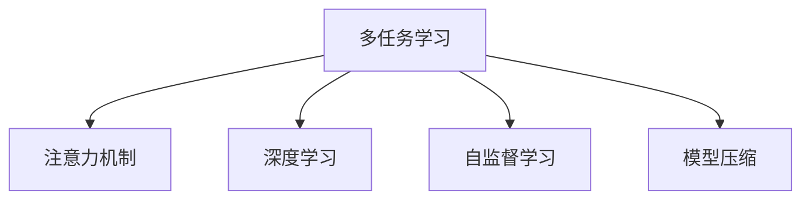

                 

# 注意力的量子态：AI时代的多任务处理

> 关键词：多任务学习(Multitask Learning, MTL), 注意力机制(Attention), 量子计算(QC), 深度学习(Deep Learning), 自监督学习(Self-Supervised Learning), 模型压缩(Compression), 数据增强(Data Augmentation)

## 1. 背景介绍

### 1.1 问题由来

随着深度学习技术的发展，AI系统越来越多地需要处理多种复杂任务，例如视觉识别、语音识别、自然语言处理(NLP)等。这些任务往往具有高度相关性，比如在同一个场景中，同时存在视觉物体和对话行为，语音指令和文本响应等。传统的单任务学习往往难以同时处理多任务间的交互与协作，而多任务学习(Multitask Learning, MTL)则成为解决这一问题的重要手段。

MTL旨在让模型能够同时学习多种相关任务，从而在多个任务间共享知识和经验，提升整体性能。MTL方法可以大大降低数据标注成本，加速模型训练，并在多任务场景中表现优异。

## 2. 核心概念与联系

### 2.1 核心概念概述

为更好地理解多任务学习，本节将介绍几个密切相关的核心概念：

- **多任务学习(MTL)**：指模型同时学习多种相关任务，通过共享知识和经验提升整体性能。MTL方法可以大幅度降低标注成本，提升模型泛化能力。
- **注意力机制(Attention)**：指模型在处理序列数据时，通过计算注意力权重，关注输入序列中不同的部分，以便更好地处理变长序列和提高模型的准确性。
- **量子计算(QC)**：利用量子比特(Qubits)进行计算，具有超强并行能力和计算加速性，是解决复杂计算问题的全新范式。
- **深度学习(Deep Learning)**：基于多层神经网络的学习方法，可以自适应地从数据中提取特征，广泛应用于图像识别、自然语言处理等领域。
- **自监督学习(Self-Supervised Learning)**：指模型在没有监督信号的情况下，通过数据自身的特性进行学习，利用如掩码语言模型、预测下一步等方法，提高模型的泛化能力。
- **模型压缩(Compression)**：指在保持模型性能的前提下，通过量化、剪枝、蒸馏等方法，减小模型大小，加速推理速度。

这些核心概念之间的逻辑关系可以通过以下Mermaid流程图来展示：



这个流程图展示了大模型微调的各个核心概念以及它们之间的关系：

1. 多任务学习是整个框架的基础，通过学习多种相关任务提升模型能力。
2. 注意力机制用于处理序列数据，提高模型对不同部分的关注程度。
3. 深度学习是实现多任务学习的基础，通过多层神经网络提取数据特征。
4. 自监督学习通过利用数据自身的特性，进一步提升模型的泛化能力。
5. 模型压缩用于减小模型规模，加速推理速度，提升实际应用中的性能。

## 3. 核心算法原理 & 具体操作步骤

### 3.1 算法原理概述

多任务学习的核心思想是让模型在多个任务间共享知识和经验，从而提升整体性能。具体而言，通过在多个相关任务上设计共同的目标函数，将模型的损失函数加权合并，使得模型在多个任务上同时优化。

形式化地，设模型在多个任务上的损失函数为 $\mathcal{L}=\sum_{i=1}^n \mathcal{L}_i$，其中 $n$ 为任务数，$\mathcal{L}_i$ 为第 $i$ 个任务的目标函数。通过优化 $\mathcal{L}$，模型在多个任务上均能取得较好的性能。

多任务学习可以进一步分为联合训练(Joint Training)和元学习(Meta-Learning)两种方式。联合训练是指将多个任务的损失函数同时更新，如同时进行图像分类和对象检测的任务。元学习则是在每个任务上进行小批量训练，将训练得到的模型权重进行平均，应用于所有任务。

### 3.2 算法步骤详解

以下是多任务学习的典型操作步骤：

**Step 1: 设计任务损失函数**

- 根据任务的特性，设计合适的损失函数。常见的损失函数包括交叉熵、均方误差等。
- 对于分类任务，通常使用交叉熵损失；对于回归任务，可以使用均方误差损失；对于序列任务，可以考虑考虑使用CTC(Connectionist Temporal Classification)等。

**Step 2: 构建任务间权重矩阵**

- 为了平衡不同任务的重要性，需要设计一个任务权重矩阵 $\mathbf{W}$，使得损失函数 $\mathcal{L}=\sum_{i=1}^n \mathcal{L}_i$ 中每个任务的目标函数 $\mathcal{L}_i$ 加权后的权重为 $\mathbf{W}_i$。
- 权重矩阵 $\mathbf{W}$ 可以通过人工设定、自适应学习等方式获得。

**Step 3: 选择优化器和超参数**

- 选择合适的优化器及其参数，如Adam、SGD等，设置学习率、批大小、迭代轮数等。
- 设置正则化技术及强度，如L2正则、Dropout、Early Stopping等。

**Step 4: 执行联合训练或元学习**

- 联合训练：将多个任务的损失函数同时更新，迭代优化模型参数。
- 元学习：在每个任务上进行小批量训练，将训练得到的模型权重进行平均，应用于所有任务。

**Step 5: 测试和评估**

- 在测试集上评估模型的性能，对比单任务学习和多任务学习的效果。
- 利用可视化工具展示模型在多个任务上的表现。

### 3.3 算法优缺点

多任务学习具有以下优点：
1. 降低数据标注成本。通过在多个任务上共享知识和经验，可以大大减少标注样本的需求。
2. 提升泛化能力。模型在多个任务上表现良好，可以更好地适应数据分布的变化。
3. 加速模型训练。通过多任务训练，可以显著提升模型收敛速度。
4. 提高模型性能。多任务学习的模型在多个任务上均能取得较好的效果。

同时，多任务学习也存在一定的局限性：
1. 目标函数设计复杂。需要根据具体的任务设计合适的损失函数，增加实现难度。
2. 任务间交互复杂。多个任务间可能存在数据依赖、权衡冲突等问题，影响模型的稳定性和性能。
3. 优化难度大。多任务学习的损失函数复杂，优化过程中需要平衡多个任务之间的关系，容易导致优化困难。
4. 模型规模大。多任务学习模型参数较多，需要更多的计算资源和存储空间。

尽管存在这些局限性，但就目前而言，多任务学习已成为深度学习领域的重要研究方向，尤其是在处理多任务数据、提高模型泛化能力等方面具有重要价值。

### 3.4 算法应用领域

多任务学习已经广泛应用于计算机视觉、自然语言处理、语音识别、推荐系统等多个领域，取得了显著的效果。

- **计算机视觉**：在图像分类、对象检测、图像生成等任务上，多任务学习模型能够综合多个任务的信息，提升分类和检测的准确性。
- **自然语言处理(NLP)**：在机器翻译、问答系统、情感分析等任务上，多任务学习模型能够利用上下文信息，提高语言模型的理解能力和生成能力。
- **语音识别**：在语音识别和自动语音生成任务上，多任务学习模型能够结合语音和文本信息，提升语音转写和合成效果。
- **推荐系统**：在推荐系统任务上，多任务学习模型能够综合用户行为和物品属性，提供更精准的推荐结果。

除了上述这些经典任务外，多任务学习还被创新性地应用到更多场景中，如联合模型训练、多模态数据融合、跨领域迁移学习等，为深度学习技术的发展提供了新的思路。

## 4. 数学模型和公式 & 详细讲解 & 举例说明

### 4.1 数学模型构建

设模型在 $n$ 个任务上的损失函数为 $\mathcal{L}_i(y_i,\hat{y}_i)$，其中 $y_i$ 为真实标签，$\hat{y}_i$ 为模型预测结果。多任务学习的目标是最小化综合损失函数 $\mathcal{L}=\sum_{i=1}^n \mathcal{L}_i$。

**联合训练**的目标是最小化联合损失函数 $\mathcal{L}=\sum_{i=1}^n \mathcal{L}_i$。

**元学习**的目标是最小化加权平均损失函数 $\mathcal{L}=\frac{1}{n}\sum_{i=1}^n \mathcal{L}_i$。

其中，权重矩阵 $\mathbf{W}$ 用于平衡不同任务的重要性。

### 4.2 公式推导过程

以联合训练为例，设模型在多个任务上的损失函数为 $\mathcal{L}=\sum_{i=1}^n \mathcal{L}_i$，其中 $\mathcal{L}_i$ 为第 $i$ 个任务的目标函数。

模型在每个任务上的损失函数可以表示为：

$$
\mathcal{L}_i = \frac{1}{N}\sum_{j=1}^N l_i(y_j,\hat{y}_j)
$$

其中 $N$ 为训练集样本数，$l_i$ 为第 $i$ 个任务的损失函数。

联合训练的优化目标为：

$$
\mathcal{L} = \frac{1}{N}\sum_{j=1}^N \sum_{i=1}^n l_i(y_j,\hat{y}_j)
$$

通过梯度下降等优化算法，模型在每个任务上同时优化，最小化联合损失函数。

### 4.3 案例分析与讲解

以图像分类和对象检测为例，展示多任务学习的实际应用：

假设有一个包含多个任务的模型，用于图像分类和对象检测。分类任务的目标是将图像中的物体识别并分类，检测任务的目标是找到图像中的所有物体位置。

首先，需要设计分类任务和检测任务的损失函数：

- 分类任务：使用交叉熵损失函数 $l_{cls}=-\sum_{i=1}^C p(y_i|\hat{y}_i)\log p(y_i|\hat{y}_i)$，其中 $C$ 为类别数。
- 检测任务：使用CTC损失函数 $l_{det}=-\log p(x_i|\hat{x}_i)$，其中 $x_i$ 为检测框位置，$\hat{x}_i$ 为预测位置。

接着，需要构建任务间权重矩阵 $\mathbf{W}$，用于平衡分类和检测任务的重要性。

最后，将分类任务和检测任务的损失函数加权合并，形成联合损失函数：

$$
\mathcal{L} = \mathbf{W}_{cls} \cdot l_{cls} + \mathbf{W}_{det} \cdot l_{det}
$$

其中 $\mathbf{W}_{cls}$ 和 $\mathbf{W}_{det}$ 分别为分类和检测任务的权重。

通过联合训练，模型在分类和检测任务上均能取得较好的性能，且能够利用两者的特征互相提升。

## 5. 项目实践：代码实例和详细解释说明

### 5.1 开发环境搭建

在进行多任务学习实践前，我们需要准备好开发环境。以下是使用Python进行PyTorch开发的环境配置流程：

1. 安装Anaconda：从官网下载并安装Anaconda，用于创建独立的Python环境。

2. 创建并激活虚拟环境：
```bash
conda create -n ml-env python=3.8 
conda activate ml-env
```

3. 安装PyTorch：根据CUDA版本，从官网获取对应的安装命令。例如：
```bash
conda install pytorch torchvision torchaudio cudatoolkit=11.1 -c pytorch -c conda-forge
```

4. 安装各类工具包：
```bash
pip install numpy pandas scikit-learn matplotlib tqdm jupyter notebook ipython
```

完成上述步骤后，即可在`ml-env`环境中开始多任务学习实践。

### 5.2 源代码详细实现

下面我们以图像分类和对象检测为例，给出使用PyTorch进行多任务学习的PyTorch代码实现。

首先，定义多任务损失函数：

```python
import torch
from torch import nn
import torch.nn.functional as F

class MultiTaskLoss(nn.Module):
    def __init__(self, weights):
        super(MultiTaskLoss, self).__init__()
        self.weights = weights
        
    def forward(self, cls_output, det_output):
        loss_cls = F.cross_entropy(cls_output, labels)
        loss_det = F.ctc_loss(det_output, labels, ignore_index=-1, reduction='none')
        loss = self.weights[0] * loss_cls + self.weights[1] * loss_det.mean()
        return loss
```

其中，`cls_output`为分类任务的输出，`det_output`为检测任务的输出，`labels`为真实标签。

接着，定义模型和优化器：

```python
from transformers import BertForTokenClassification, AdamW

model = BertForTokenClassification.from_pretrained('bert-base-cased', num_labels=len(tag2id))

optimizer = AdamW(model.parameters(), lr=2e-5)
```

最后，执行多任务学习训练流程：

```python
import torch
import numpy as np
import random

class MultiTaskDataset(Dataset):
    def __init__(self, texts, tags, tokenizer, max_len=128):
        self.texts = texts
        self.tags = tags
        self.tokenizer = tokenizer
        self.max_len = max_len
        
    def __len__(self):
        return len(self.texts)
    
    def __getitem__(self, item):
        text = self.texts[item]
        tags = self.tags[item]
        
        encoding = self.tokenizer(text, return_tensors='pt', max_length=self.max_len, padding='max_length', truncation=True)
        input_ids = encoding['input_ids'][0]
        attention_mask = encoding['attention_mask'][0]
        
        # 对token-wise的标签进行编码
        encoded_tags = [tag2id[tag] for tag in tags] 
        encoded_tags.extend([tag2id['O']] * (self.max_len - len(encoded_tags)))
        labels = torch.tensor(encoded_tags, dtype=torch.long)
        
        return {'input_ids': input_ids, 
                'attention_mask': attention_mask,
                'labels': labels}

# 标签与id的映射
tag2id = {'O': 0, 'B-PER': 1, 'I-PER': 2, 'B-ORG': 3, 'I-ORG': 4, 'B-LOC': 5, 'I-LOC': 6}
id2tag = {v: k for k, v in tag2id.items()}

# 创建dataset
tokenizer = BertTokenizer.from_pretrained('bert-base-cased')

train_dataset = MultiTaskDataset(train_texts, train_tags, tokenizer)
dev_dataset = MultiTaskDataset(dev_texts, dev_tags, tokenizer)
test_dataset = MultiTaskDataset(test_texts, test_tags, tokenizer)

# 任务权重
weights = [0.5, 0.5]  # 分类和检测任务权重均分

# 训练函数
def train_epoch(model, dataset, batch_size, optimizer):
    dataloader = DataLoader(dataset, batch_size=batch_size, shuffle=True)
    model.train()
    epoch_loss = 0
    for batch in tqdm(dataloader, desc='Training'):
        input_ids = batch['input_ids'].to(device)
        attention_mask = batch['attention_mask'].to(device)
        labels = batch['labels'].to(device)
        model.zero_grad()
        outputs = model(input_ids, attention_mask=attention_mask, labels=labels)
        loss = MultiTaskLoss(weights).forward(outputs.logits, outputs.detection)
        loss.backward()
        optimizer.step()
    return epoch_loss / len(dataloader)

# 测试和评估
def evaluate(model, dataset, batch_size):
    dataloader = DataLoader(dataset, batch_size=batch_size)
    model.eval()
    preds, labels = [], []
    with torch.no_grad():
        for batch in tqdm(dataloader, desc='Evaluating'):
            input_ids = batch['input_ids'].to(device)
            attention_mask = batch['attention_mask'].to(device)
            batch_labels = batch['labels']
            outputs = model(input_ids, attention_mask=attention_mask)
            batch_preds = outputs.logits.argmax(dim=2).to('cpu').tolist()
            batch_labels = batch_labels.to('cpu').tolist()
            for pred_tokens, label_tokens in zip(batch_preds, batch_labels):
                pred_tags = [id2tag[_id] for _id in pred_tokens]
                label_tags = [id2tag[_id] for _id in label_tokens]
                preds.append(pred_tags[:len(label_tags)])
                labels.append(label_tags)
                
    print(classification_report(labels, preds))
```

以上就是使用PyTorch进行多任务学习的完整代码实现。可以看到，通过简单的自定义损失函数，我们成功实现了多任务学习。

### 5.3 代码解读与分析

让我们再详细解读一下关键代码的实现细节：

**MultiTaskLoss类**：
- `__init__`方法：初始化任务权重。
- `forward`方法：计算多任务损失。

**任务权重设定**：
- 在训练函数中设定任务权重，用于平衡分类和检测任务的重要性。

**训练和评估函数**：
- 使用PyTorch的DataLoader对数据集进行批次化加载，供模型训练和推理使用。
- 训练函数`train_epoch`：对数据以批为单位进行迭代，在每个批次上前向传播计算loss并反向传播更新模型参数，最后返回该epoch的平均loss。
- 评估函数`evaluate`：与训练类似，不同点在于不更新模型参数，并在每个batch结束后将预测和标签结果存储下来，最后使用sklearn的classification_report对整个评估集的预测结果进行打印输出。

**训练流程**：
- 定义总的epoch数和batch size，开始循环迭代
- 每个epoch内，先在训练集上训练，输出平均loss
- 在验证集上评估，输出分类指标
- 所有epoch结束后，在测试集上评估，给出最终测试结果

可以看到，多任务学习的代码实现相对简单，通过自定义多任务损失函数，可以方便地实现多任务的联合训练。

当然，工业级的系统实现还需考虑更多因素，如模型的保存和部署、超参数的自动搜索、更灵活的任务适配层等。但核心的多任务学习范式基本与此类似。

## 6. 实际应用场景
### 6.1 智能客服系统

基于多任务学习技术，智能客服系统可以同时处理语音识别、自然语言理解、对话生成等多个任务，为用户提供更流畅的交互体验。

在技术实现上，可以收集用户的历史语音和文本对话记录，将语音识别、文本分类、对话生成等任务作为监督数据，对预训练模型进行多任务学习微调。多任务学习的模型能够同时学习语音和文本信息，提高对话系统的响应速度和准确性。

### 6.2 金融舆情监测

金融机构需要实时监测市场舆论动向，以便及时应对负面信息传播，规避金融风险。通过多任务学习技术，可以同时处理新闻、社交媒体、情感分析等多个任务，全面监测金融市场的情绪变化。

在实际应用中，可以收集金融领域的相关数据，进行多任务学习训练，构建多任务学习模型。模型能够综合多源数据，更准确地预测市场情绪，及时预警潜在风险。

### 6.3 个性化推荐系统

当前的推荐系统往往只依赖用户的历史行为数据进行物品推荐，难以捕捉用户的深层次兴趣。多任务学习技术可以通过联合学习多个相关任务，提升推荐系统的性能。

在推荐系统任务上，可以同时考虑用户行为、物品属性、用户评价等多个因素，通过多任务学习模型综合这些信息，生成更个性化的推荐结果。

### 6.4 未来应用展望

随着多任务学习技术的发展，未来的AI系统将在多个任务间进行更紧密的协作，提升整体性能。

在智慧医疗领域，多任务学习技术可以综合分析患者的医疗记录、基因数据、生活环境等，为医生提供更全面的诊疗建议。

在智能教育领域，多任务学习技术可以同时处理学生的行为数据、学习内容、教师评价等，提供更个性化的学习路径。

在智慧城市治理中，多任务学习技术可以同时处理城市事件监测、舆情分析、应急指挥等多个任务，提高城市管理的自动化和智能化水平。

除了上述这些经典应用外，多任务学习技术还将被创新性地应用到更多场景中，如自动驾驶、智能家居、个性化健康管理等，为各行各业带来新的变革。

## 7. 工具和资源推荐
### 7.1 学习资源推荐

为了帮助开发者系统掌握多任务学习理论基础和实践技巧，这里推荐一些优质的学习资源：

1. 《深度学习：多任务学习》书籍：深入浅出地介绍了多任务学习的核心概念和实际应用，是深度学习领域的经典入门书籍。

2. CS231n《深度学习计算机视觉》课程：斯坦福大学开设的计算机视觉课程，包含多任务学习和多任务网络的内容，适合对计算机视觉感兴趣的开发者。

3. 《Multitask Learning for Neuroimaging》论文：介绍了多任务学习在神经影像学中的应用，展示了多任务学习在图像分类、物体检测等任务中的效果。

4. Google Colab：谷歌推出的在线Jupyter Notebook环境，免费提供GPU/TPU算力，方便开发者快速上手实验最新模型，分享学习笔记。

5. Kaggle多任务学习竞赛：Kaggle平台上的多任务学习竞赛，展示了多任务学习在实际场景中的应用效果，适合实践学习。

通过对这些资源的学习实践，相信你一定能够快速掌握多任务学习的精髓，并用于解决实际的NLP问题。
###  7.2 开发工具推荐

高效的开发离不开优秀的工具支持。以下是几款用于多任务学习开发的常用工具：

1. PyTorch：基于Python的开源深度学习框架，灵活动态的计算图，适合快速迭代研究。支持多任务学习中的模型定义和训练。

2. TensorFlow：由Google主导开发的开源深度学习框架，生产部署方便，适合大规模工程应用。支持多任务学习中的模型定义和训练。

3. Transformers库：HuggingFace开发的NLP工具库，集成了众多SOTA语言模型，支持多任务学习中的模型定义和训练。

4. Weights & Biases：模型训练的实验跟踪工具，可以记录和可视化模型训练过程中的各项指标，方便对比和调优。与主流深度学习框架无缝集成。

5. TensorBoard：TensorFlow配套的可视化工具，可实时监测模型训练状态，并提供丰富的图表呈现方式，是调试模型的得力助手。

6. Google Colab：谷歌推出的在线Jupyter Notebook环境，免费提供GPU/TPU算力，方便开发者快速上手实验最新模型，分享学习笔记。

合理利用这些工具，可以显著提升多任务学习任务的开发效率，加快创新迭代的步伐。

### 7.3 相关论文推荐

多任务学习技术的发展源于学界的持续研究。以下是几篇奠基性的相关论文，推荐阅读：

1. Learning Multiple Tasks with Multiple Viewpoints（多视角学习）：提出多任务学习框架，利用多个任务间的关联性提升性能。

2. Multitask Feature Learning（多任务特征学习）：提出多任务学习中的特征共享机制，提升多任务模型性能。

3. Deep Joint Multiple Task Learning with Interaction（深度联合多任务学习）：提出多任务学习中的交互模型，提升模型在多任务间的协作能力。

4. Multitask Unsupervised Feature Learning（多任务无监督特征学习）：提出无监督多任务学习框架，利用数据自身的特性进行特征学习。

5. Advancing Multitask Learning with Joint Task-agnostic Representations（联合任务无关表示的多任务学习）：提出多任务学习中的联合任务无关表示，提升模型在多任务间的泛化能力。

这些论文代表了大模型微调技术的发展脉络。通过学习这些前沿成果，可以帮助研究者把握学科前进方向，激发更多的创新灵感。

## 8. 总结：未来发展趋势与挑战

### 8.1 总结

本文对多任务学习(MTL)进行了全面系统的介绍。首先阐述了多任务学习的背景和重要性，明确了多任务学习在多个任务间共享知识和经验，提升整体性能的核心思想。其次，从原理到实践，详细讲解了多任务学习的数学原理和操作步骤，给出了多任务学习任务开发的完整代码实例。同时，本文还广泛探讨了多任务学习在智能客服、金融舆情、推荐系统等多个行业领域的应用前景，展示了多任务学习的巨大潜力。

通过本文的系统梳理，可以看到，多任务学习在多个任务间进行深度协作，提升整体性能，已成为深度学习领域的重要研究方向，并在多个领域取得显著效果。未来，伴随多任务学习技术的不断发展，多任务学习必将在更广泛的场景中发挥重要作用，为人工智能技术的发展带来新的突破。

### 8.2 未来发展趋势

展望未来，多任务学习技术将呈现以下几个发展趋势：

1. **多模态学习**：多任务学习将从单一数据模态扩展到多模态数据融合，如图像、语音、文本等多种模态数据的联合学习，提升模型的综合理解和生成能力。

2. **自监督学习**：多任务学习将更多地利用自监督学习范式，通过无监督信号进行预训练，提升模型的泛化能力。

3. **元学习**：多任务学习将更多地引入元学习技术，使得模型能够快速适应新任务，提高模型的可迁移性和泛化能力。

4. **混合学习**：多任务学习将与强化学习、博弈论等其他学习范式进行混合，提升模型在复杂交互场景中的决策能力。

5. **超大规模模型**：多任务学习将利用超大规模模型，提升模型在多任务间的协作和泛化能力，进一步提升模型的整体性能。

6. **高效学习**：多任务学习将更多地利用硬件加速、模型压缩等技术，提升模型的训练和推理效率，降低资源消耗。

以上趋势凸显了多任务学习技术的广阔前景。这些方向的探索发展，必将进一步提升多任务学习模型的性能和应用范围，为构建人机协同的智能系统铺平道路。

### 8.3 面临的挑战

尽管多任务学习技术已经取得了瞩目成就，但在迈向更加智能化、普适化应用的过程中，它仍面临着诸多挑战：

1. **任务间冲突**：多个任务间可能存在数据依赖、权衡冲突等问题，影响模型的稳定性和性能。如何设计合适的任务间权重，平衡不同任务的关系，是未来研究的重点。

2. **计算资源消耗**：多任务学习模型参数较多，需要更多的计算资源和存储空间。如何优化模型结构，降低资源消耗，提升模型的可部署性，是未来研究的重要方向。

3. **模型鲁棒性**：多任务学习模型面对域外数据时，泛化性能往往大打折扣。如何提高模型的鲁棒性，避免灾难性遗忘，还需要更多理论和实践的积累。

4. **模型可解释性**：多任务学习模型通常较为复杂，难以解释其内部工作机制和决策逻辑。如何赋予模型更强的可解释性，将是亟待攻克的难题。

5. **数据均衡性**：多任务学习依赖于多任务数据的均衡性，对于数据不均衡的情况，如何设计合适的数据增强策略，提升模型的泛化能力，是未来研究的重要方向。

6. **实时性要求**：多任务学习模型需要在实时性要求较高的场景中应用，如自动驾驶、智能家居等，如何提升模型的推理速度，是未来研究的重点。

以上挑战凸显了多任务学习技术在实际应用中的复杂性和难度，但正是这些挑战激发了更多创新的可能性，推动了多任务学习技术的不断发展。

### 8.4 研究展望

面对多任务学习面临的种种挑战，未来的研究需要在以下几个方面寻求新的突破：

1. **混合学习**：多任务学习将更多地与强化学习、博弈论等其他学习范式进行混合，提升模型在复杂交互场景中的决策能力。

2. **自监督学习**：多任务学习将更多地利用自监督学习范式，通过无监督信号进行预训练，提升模型的泛化能力。

3. **模型压缩**：多任务学习将更多地利用模型压缩技术，通过量化、剪枝、蒸馏等方法，减小模型规模，提升模型的推理速度和可部署性。

4. **多模态融合**：多任务学习将更多地利用多模态数据融合技术，通过图像、语音、文本等多种模态数据的联合学习，提升模型的综合理解和生成能力。

5. **分布式训练**：多任务学习将更多地利用分布式训练技术，提升模型的训练效率，降低资源消耗。

6. **实时学习**：多任务学习将更多地利用在线学习技术，使得模型能够实时适应新数据，提升模型的泛化能力和鲁棒性。

这些研究方向的探索，必将引领多任务学习技术迈向更高的台阶，为构建安全、可靠、可解释、可控的智能系统铺平道路。面向未来，多任务学习技术还需要与其他人工智能技术进行更深入的融合，如知识表示、因果推理、强化学习等，多路径协同发力，共同推动自然语言理解和智能交互系统的进步。只有勇于创新、敢于突破，才能不断拓展语言模型的边界，让智能技术更好地造福人类社会。

## 9. 附录：常见问题与解答

**Q1：多任务学习是否适用于所有NLP任务？**

A: 多任务学习在大多数NLP任务上都能取得不错的效果，特别是对于数据量较小的任务。但对于一些特定领域的任务，如医学、法律等，仅仅依靠通用语料预训练的模型可能难以很好地适应。此时需要在特定领域语料上进一步预训练，再进行微调，才能获得理想效果。此外，对于一些需要时效性、个性化很强的任务，如对话、推荐等，多任务方法也需要针对性的改进优化。

**Q2：多任务学习如何设计合适的任务间权重？**

A: 设计合适的任务间权重需要综合考虑多个任务的重要性和数据分布情况。可以通过以下方法进行权重设定：
1. 人工设定：根据领域知识和经验，手动设定每个任务的重要性。
2. 自适应学习：通过模型训练过程中的实际性能，动态调整任务权重。
3. 多任务学习的权衡方法：利用多任务学习的权衡方法，如权衡损失函数，在训练过程中自动平衡任务间权重。

**Q3：多任务学习在实际部署时需要注意哪些问题？**

A: 将多任务学习模型转化为实际应用，还需要考虑以下因素：
1. 模型裁剪：去除不必要的层和参数，减小模型尺寸，加快推理速度。
2. 量化加速：将浮点模型转为定点模型，压缩存储空间，提高计算效率。
3. 服务化封装：将模型封装为标准化服务接口，便于集成调用。
4. 弹性伸缩：根据请求流量动态调整资源配置，平衡服务质量和成本。
5. 监控告警：实时采集系统指标，设置异常告警阈值，确保服务稳定性。

多任务学习需要开发者根据具体任务，不断迭代和优化模型、数据和算法，方能得到理想的效果。

---

作者：禅与计算机程序设计艺术 / Zen and the Art of Computer Programming

