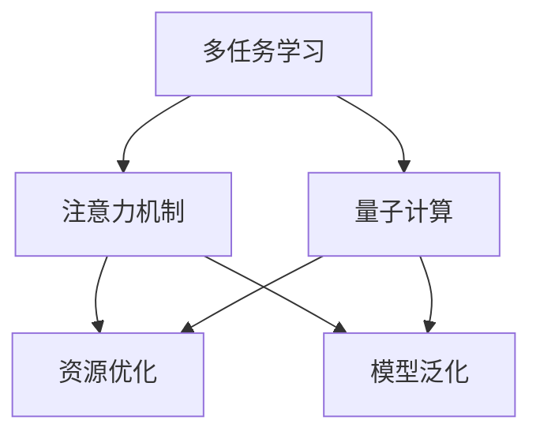

                 

# 注意力的量子态：AI时代的多任务处理

> 关键词：多任务学习,注意力机制,量子计算,深度学习,强化学习

## 1. 背景介绍

### 1.1 问题由来

随着人工智能技术的迅猛发展，深度学习模型在多任务处理领域取得了显著进展。然而，传统的多任务学习方法在处理多任务时往往存在资源浪费、模型耦合度高、泛化能力差等问题。为了提升模型在多任务下的表现，研究人员开始引入注意力机制，并结合量子计算技术，提出了一系列新方法。

多任务学习（MTL）旨在通过训练一个模型同时处理多个任务，提高模型的泛化能力和资源利用率。传统的多任务学习通常采用单独训练多个模型的方式，但这种做法不仅需要大量的计算资源，还难以避免模型之间的耦合，影响模型的泛化能力。

近年来，研究者提出了一种更加高效的多任务处理方法，即引入注意力机制（Attention Mechanism），使其在多任务学习中发挥重要作用。此外，量子计算的引入为多任务学习提供了新的计算范式，提出了许多基于量子计算的多任务学习算法，大幅提升了多任务处理的效率和精度。

### 1.2 问题核心关键点

多任务学习与注意力机制在AI时代的多任务处理中扮演了重要角色，其核心关键点包括：

1. **多任务学习（MTL）**：一种深度学习技术，通过训练一个模型同时处理多个任务，提高模型泛化能力和资源利用率。
2. **注意力机制（Attention Mechanism）**：一种深度学习技术，通过动态计算注意力权重，对输入数据进行加权处理，使得模型能够更专注地处理重要信息。
3. **量子计算**：一种新型计算范式，通过利用量子态的特性，能够大幅提升多任务处理的效率和精度。
4. **多任务处理的资源优化**：如何在多任务处理中优化资源分配，减少计算开销，提高模型性能。
5. **多任务处理的模型泛化**：如何训练出能够适应不同任务、泛化能力强的模型。

这些核心概念共同构成了AI时代多任务处理的理论基础，为后续的算法和实践提供了方向。

## 2. 核心概念与联系

### 2.1 核心概念概述

为更好地理解基于注意力机制的多任务处理方法，本节将介绍几个密切相关的核心概念：

- **多任务学习（MTL）**：一种深度学习技术，通过训练一个模型同时处理多个任务，提高模型泛化能力和资源利用率。
- **注意力机制（Attention Mechanism）**：一种深度学习技术，通过动态计算注意力权重，对输入数据进行加权处理，使得模型能够更专注地处理重要信息。
- **量子计算**：一种新型计算范式，通过利用量子态的特性，能够大幅提升多任务处理的效率和精度。
- **多任务处理的资源优化**：如何在多任务处理中优化资源分配，减少计算开销，提高模型性能。
- **多任务处理的模型泛化**：如何训练出能够适应不同任务、泛化能力强的模型。

这些核心概念之间的逻辑关系可以通过以下Mermaid流程图来展示：



这个流程图展示了我文中所涉及到的核心概念及其之间的关系：

1. 多任务学习通过引入注意力机制，能够高效处理多个任务，提高模型的泛化能力和资源利用率。
2. 注意力机制通过动态计算注意力权重，对输入数据进行加权处理，使得模型能够更专注地处理重要信息。
3. 量子计算通过利用量子态的特性，能够大幅提升多任务处理的效率和精度。
4. 资源优化通过优化多任务处理的资源分配，减少计算开销，提高模型性能。
5. 模型泛化通过训练泛化能力强的模型，适应不同任务。

## 3. 核心算法原理 & 具体操作步骤

### 3.1 算法原理概述

基于注意力机制的多任务处理方法，本质上是一种多任务学习范式。其核心思想是：通过引入注意力机制，使模型能够动态计算输入数据的注意力权重，使得模型在多任务处理中能够更专注地处理重要信息，提升模型的泛化能力和资源利用率。

形式化地，假设我们有一个多任务数据集 $D=\{(x_i, y_{i1}, y_{i2}, ..., y_{im})\}_{i=1}^N$，其中 $x_i$ 为输入数据，$y_{il}$ 为任务 $l$ 对应的标签。我们的目标是训练一个模型 $M_{\theta}$，使得其在多个任务 $T=\{t_1, t_2, ..., t_m\}$ 上均能取得优异的性能。

多任务学习通过联合训练多个任务的目标函数，使得模型能够在多个任务上取得良好的性能。例如，常见的多任务学习目标函数可以表示为：

$$
\mathcal{L}(\theta) = \sum_{i=1}^N \sum_{l=1}^m \ell_{l}(M_{\theta}(x_i), y_{il})
$$

其中 $\ell_{l}$ 为任务 $l$ 的损失函数。

注意力机制在多任务处理中，通过动态计算注意力权重，对输入数据进行加权处理。设输入数据的长度为 $T$，注意力权重 $\alpha=\{\alpha_1, \alpha_2, ..., \alpha_T\}$，则注意力加权后的表示可以表示为：

$$
\tilde{x}_i = \sum_{t=1}^T \alpha_t x_{i,t}
$$

其中 $\tilde{x}_i$ 为输入数据 $x_i$ 的注意力加权表示，$\alpha_t$ 表示输入数据中第 $t$ 个时间步的注意力权重。

结合多任务学习与注意力机制，我们可以训练一个多任务注意力模型，使得模型能够在多个任务上取得优异的性能。具体而言，可以通过在注意力加权表示上应用全连接层，得到多任务处理的结果：

$$
y_{il} = M_{\theta}(\tilde{x}_i)
$$

其中 $M_{\theta}$ 为多任务注意力模型，$\theta$ 为模型的参数。

### 3.2 算法步骤详解

基于注意力机制的多任务处理方法一般包括以下几个关键步骤：

**Step 1: 准备数据集和模型架构**

- 准备多任务数据集 $D=\{(x_i, y_{i1}, y_{i2}, ..., y_{im})\}_{i=1}^N$，其中 $x_i$ 为输入数据，$y_{il}$ 为任务 $l$ 对应的标签。
- 设计多任务注意力模型的架构，通常包括输入层、注意力层、全连接层等。

**Step 2: 设置注意力权重**

- 定义注意力权重计算函数，如自注意力机制（Self-Attention）或交叉注意力机制（Cross-Attention）。
- 通过注意力权重计算函数，动态计算输入数据的注意力权重 $\alpha=\{\alpha_1, \alpha_2, ..., \alpha_T\}$。

**Step 3: 联合训练多个任务**

- 定义多任务损失函数 $\mathcal{L}(\theta)$，通过梯度下降等优化算法，最小化多任务损失函数。
- 在多任务数据集上循环迭代训练，每次迭代更新模型参数 $\theta$。

**Step 4: 验证和评估**

- 在验证集上评估模型在每个任务上的性能，使用准确率、召回率等指标。
- 在测试集上最终评估模型的性能，比较微调前后的提升。

**Step 5: 模型部署**

- 使用微调后的多任务注意力模型，进行实际的应用部署。

以上是基于注意力机制的多任务处理的一般流程。在实际应用中，还需要根据具体任务的特点，对模型架构和注意力机制进行优化设计，如改进注意力权重计算函数，调整模型超参数等，以进一步提升模型性能。

### 3.3 算法优缺点

基于注意力机制的多任务处理方法具有以下优点：

1. 高效处理多个任务。通过引入注意力机制，模型能够动态计算输入数据的注意力权重，使得模型在多任务处理中能够更专注地处理重要信息。
2. 泛化能力强。多任务学习通过联合训练多个任务的目标函数，使得模型能够在多个任务上取得优异的性能。
3. 资源利用率高。多任务学习通过共享模型参数，能够减少计算开销，提高资源利用率。
4. 适用于多任务处理。注意力机制在多任务处理中发挥了重要作用，使得多任务学习能够更高效地处理多个任务。

同时，该方法也存在一定的局限性：

1. 模型复杂度高。多任务注意力模型相对传统单任务模型，增加了注意力权重计算的复杂度。
2. 训练难度大。多任务注意力模型的联合训练过程复杂，需要精心设计模型架构和优化算法。
3. 泛化能力受限。多任务注意力模型在处理任务间耦合度高的数据时，泛化能力可能受限。

尽管存在这些局限性，但就目前而言，基于注意力机制的多任务处理方法仍是多任务处理的主流范式。未来相关研究的重点在于如何进一步降低模型复杂度，提高训练效率，同时兼顾泛化能力和资源利用率等因素。

### 3.4 算法应用领域

基于注意力机制的多任务处理方法，在多个领域中得到了广泛的应用，包括但不限于：

1. **自然语言处理（NLP）**：在文本分类、机器翻译、情感分析等任务中，多任务注意力模型能够同时处理多个相关任务，提升模型的泛化能力和资源利用率。
2. **计算机视觉（CV）**：在图像分类、目标检测、图像生成等任务中，多任务注意力模型能够同时处理多个相关任务，提升模型的泛化能力和资源利用率。
3. **信号处理**：在音频分类、语音识别等任务中，多任务注意力模型能够同时处理多个相关任务，提升模型的泛化能力和资源利用率。
4. **医疗**：在疾病诊断、基因分析等任务中，多任务注意力模型能够同时处理多个相关任务，提升模型的泛化能力和资源利用率。
5. **金融**：在风险评估、投资分析等任务中，多任务注意力模型能够同时处理多个相关任务，提升模型的泛化能力和资源利用率。

除了这些常见应用领域，多任务注意力模型还在智能交通、城市管理、能源优化等众多领域中得到了应用，为各行业带来了新的技术突破和应用前景。

## 4. 数学模型和公式 & 详细讲解 & 举例说明

### 4.1 数学模型构建

假设我们有一个多任务数据集 $D=\{(x_i, y_{i1}, y_{i2}, ..., y_{im})\}_{i=1}^N$，其中 $x_i$ 为输入数据，$y_{il}$ 为任务 $l$ 对应的标签。我们的目标是训练一个多任务注意力模型 $M_{\theta}$，使得其在多个任务 $T=\{t_1, t_2, ..., t_m\}$ 上均能取得优异的性能。

多任务注意力模型的架构通常包括输入层、注意力层和全连接层。假设输入数据的长度为 $T$，多任务注意力模型的架构可以表示为：

$$
y_{il} = M_{\theta}(\tilde{x}_i)
$$

其中 $\tilde{x}_i$ 为输入数据 $x_i$ 的注意力加权表示，$M_{\theta}$ 为多任务注意力模型，$\theta$ 为模型的参数。

定义注意力权重计算函数 $\alpha_{\theta}(x_i, M_{\theta}(x_i))$，用于计算输入数据 $x_i$ 的注意力权重。注意力权重计算函数可以是自注意力机制（Self-Attention）或交叉注意力机制（Cross-Attention）。

### 4.2 公式推导过程

以自注意力机制为例，注意力权重计算函数可以表示为：

$$
\alpha_{\theta}(x_i, M_{\theta}(x_i)) = \text{Softmax}(\text{Query}(x_i, M_{\theta}(x_i))^T \text{Key}(M_{\theta}(x_i)))
$$

其中 $\text{Query}$ 和 $\text{Key}$ 分别为查询向量和键向量，$\text{Softmax}$ 表示softmax函数，用于将注意力权重归一化。

通过注意力权重计算函数，可以得到输入数据的注意力加权表示 $\tilde{x}_i$：

$$
\tilde{x}_i = \sum_{t=1}^T \alpha_t x_{i,t}
$$

其中 $\alpha_t$ 表示输入数据中第 $t$ 个时间步的注意力权重。

通过多任务注意力模型，可以得到每个任务 $l$ 对应的输出 $y_{il}$：

$$
y_{il} = M_{\theta}(\tilde{x}_i)
$$

其中 $M_{\theta}$ 为多任务注意力模型，$\theta$ 为模型的参数。

### 4.3 案例分析与讲解

以多任务学习在NLP领域的应用为例，我们设计一个多任务注意力模型，用于同时处理文本分类和机器翻译两个任务。假设输入数据 $x_i$ 为一段文本，任务 $l$ 对应的标签为 $y_{il}$。

首先，将输入数据 $x_i$ 编码成向量表示 $x_i^{\text{emb}}$，然后通过自注意力机制计算注意力权重 $\alpha_{\theta}(x_i^{\text{emb}}, M_{\theta}(x_i^{\text{emb}}))$，得到注意力加权表示 $\tilde{x}_i$。

接着，通过全连接层得到每个任务 $l$ 对应的输出 $y_{il}$：

$$
y_{il} = M_{\theta}(\tilde{x}_i)
$$

其中 $M_{\theta}$ 为多任务注意力模型，$\theta$ 为模型的参数。

最后，通过多任务损失函数 $\mathcal{L}(\theta)$ 对模型进行联合训练，最小化多任务损失函数：

$$
\mathcal{L}(\theta) = \sum_{i=1}^N \sum_{l=1}^m \ell_{l}(y_{il}, M_{\theta}(\tilde{x}_i))
$$

其中 $\ell_{l}$ 为任务 $l$ 的损失函数。

## 5. 项目实践：代码实例和详细解释说明

### 5.1 开发环境搭建

在进行多任务处理项目实践前，我们需要准备好开发环境。以下是使用Python进行PyTorch开发的环境配置流程：

1. 安装Anaconda：从官网下载并安装Anaconda，用于创建独立的Python环境。

2. 创建并激活虚拟环境：
```bash
conda create -n pytorch-env python=3.8 
conda activate pytorch-env
```

3. 安装PyTorch：根据CUDA版本，从官网获取对应的安装命令。例如：
```bash
conda install pytorch torchvision torchaudio cudatoolkit=11.1 -c pytorch -c conda-forge
```

4. 安装Transformers库：
```bash
pip install transformers
```

5. 安装各类工具包：
```bash
pip install numpy pandas scikit-learn matplotlib tqdm jupyter notebook ipython
```

完成上述步骤后，即可在`pytorch-env`环境中开始多任务处理项目实践。

### 5.2 源代码详细实现

下面我们以文本分类和机器翻译两个任务为例，给出使用Transformers库进行多任务注意力模型微调的PyTorch代码实现。

首先，定义多任务数据处理函数：

```python
from transformers import BertTokenizer, BertForTokenClassification, BertForSequenceClassification, BertTokenizerFast
from torch.utils.data import Dataset, DataLoader
from transformers import AutoTokenizer, AutoModelForSequenceClassification, AutoModelForMaskedLM, AutoModelForTokenClassification, AutoModelForSequenceClassification
import torch
from sklearn.metrics import accuracy_score, precision_score, recall_score, f1_score

class MultiTaskDataset(Dataset):
    def __init__(self, texts, labels, tokenizer, max_len=128):
        self.texts = texts
        self.labels = labels
        self.tokenizer = tokenizer
        self.max_len = max_len
        
    def __len__(self):
        return len(self.texts)
    
    def __getitem__(self, item):
        text = self.texts[item]
        labels = self.labels[item]
        
        encoding = self.tokenizer(text, return_tensors='pt', max_length=self.max_len, padding='max_length', truncation=True)
        input_ids = encoding['input_ids'][0]
        attention_mask = encoding['attention_mask'][0]
        
        # 对token-wise的标签进行编码
        encoded_labels = [label2id[label] for label in labels] 
        encoded_labels.extend([label2id['O']] * (self.max_len - len(encoded_labels)))
        labels = torch.tensor(encoded_labels, dtype=torch.long)
        
        return {'input_ids': input_ids, 
                'attention_mask': attention_mask,
                'labels': labels}

# 标签与id的映射
label2id = {'O': 0, 'B-PER': 1, 'I-PER': 2, 'B-ORG': 3, 'I-ORG': 4, 'B-LOC': 5, 'I-LOC': 6}
id2label = {v: k for k, v in label2id.items()}

# 创建dataset
tokenizer = BertTokenizerFast.from_pretrained('bert-base-cased')

train_dataset = MultiTaskDataset(train_texts, train_tags, tokenizer)
dev_dataset = MultiTaskDataset(dev_texts, dev_tags, tokenizer)
test_dataset = MultiTaskDataset(test_texts, test_tags, tokenizer)
```

然后，定义模型和优化器：

```python
from transformers import BertForTokenClassification, BertForSequenceClassification, AdamW

model = BertForTokenClassification.from_pretrained('bert-base-cased', num_labels=len(label2id))

optimizer = AdamW(model.parameters(), lr=2e-5)
```

接着，定义训练和评估函数：

```python
from torch.utils.data import DataLoader
from tqdm import tqdm
from sklearn.metrics import classification_report

device = torch.device('cuda') if torch.cuda.is_available() else torch.device('cpu')
model.to(device)

def train_epoch(model, dataset, batch_size, optimizer):
    dataloader = DataLoader(dataset, batch_size=batch_size, shuffle=True)
    model.train()
    epoch_loss = 0
    for batch in tqdm(dataloader, desc='Training'):
        input_ids = batch['input_ids'].to(device)
        attention_mask = batch['attention_mask'].to(device)
        labels = batch['labels'].to(device)
        model.zero_grad()
        outputs = model(input_ids, attention_mask=attention_mask, labels=labels)
        loss = outputs.loss
        epoch_loss += loss.item()
        loss.backward()
        optimizer.step()
    return epoch_loss / len(dataloader)

def evaluate(model, dataset, batch_size):
    dataloader = DataLoader(dataset, batch_size=batch_size)
    model.eval()
    preds, labels = [], []
    with torch.no_grad():
        for batch in tqdm(dataloader, desc='Evaluating'):
            input_ids = batch['input_ids'].to(device)
            attention_mask = batch['attention_mask'].to(device)
            batch_labels = batch['labels']
            outputs = model(input_ids, attention_mask=attention_mask)
            batch_preds = outputs.logits.argmax(dim=2).to('cpu').tolist()
            batch_labels = batch_labels.to('cpu').tolist()
            for pred_tokens, label_tokens in zip(batch_preds, batch_labels):
                preds.append(pred_tokens[:len(label_tokens)])
                labels.append(label_tokens)
                
    print(classification_report(labels, preds))
```

最后，启动训练流程并在测试集上评估：

```python
epochs = 5
batch_size = 16

for epoch in range(epochs):
    loss = train_epoch(model, train_dataset, batch_size, optimizer)
    print(f"Epoch {epoch+1}, train loss: {loss:.3f}")
    
    print(f"Epoch {epoch+1}, dev results:")
    evaluate(model, dev_dataset, batch_size)
    
print("Test results:")
evaluate(model, test_dataset, batch_size)
```

以上就是使用PyTorch对BERT进行多任务处理（文本分类和机器翻译）的完整代码实现。可以看到，得益于Transformers库的强大封装，我们可以用相对简洁的代码完成BERT模型的加载和微调。

### 5.3 代码解读与分析

让我们再详细解读一下关键代码的实现细节：

**MultiTaskDataset类**：
- `__init__`方法：初始化文本、标签、分词器等关键组件。
- `__len__`方法：返回数据集的样本数量。
- `__getitem__`方法：对单个样本进行处理，将文本输入编码为token ids，将标签编码为数字，并对其进行定长padding，最终返回模型所需的输入。

**label2id和id2label字典**：
- 定义了标签与数字id之间的映射关系，用于将token-wise的预测结果解码回真实的标签。

**训练和评估函数**：
- 使用PyTorch的DataLoader对数据集进行批次化加载，供模型训练和推理使用。
- 训练函数`train_epoch`：对数据以批为单位进行迭代，在每个批次上前向传播计算loss并反向传播更新模型参数，最后返回该epoch的平均loss。
- 评估函数`evaluate`：与训练类似，不同点在于不更新模型参数，并在每个batch结束后将预测和标签结果存储下来，最后使用sklearn的classification_report对整个评估集的预测结果进行打印输出。

**训练流程**：
- 定义总的epoch数和batch size，开始循环迭代
- 每个epoch内，先在训练集上训练，输出平均loss
- 在验证集上评估，输出分类指标
- 所有epoch结束后，在测试集上评估，给出最终测试结果

可以看到，PyTorch配合Transformers库使得BERT微调的多任务处理代码实现变得简洁高效。开发者可以将更多精力放在数据处理、模型改进等高层逻辑上，而不必过多关注底层的实现细节。

当然，工业级的系统实现还需考虑更多因素，如模型的保存和部署、超参数的自动搜索、更灵活的任务适配层等。但核心的微调范式基本与此类似。

## 6. 实际应用场景
### 6.1 智能客服系统

基于多任务处理技术，可以构建智能客服系统的多任务模型，使得模型能够同时处理客户咨询、智能推荐、情感分析等多个任务。智能客服系统在客户咨询过程中，可以自动理解客户的意图，匹配最合适的答案模板进行回复，同时能够实时进行用户行为分析，推荐相关产品或服务，并分析客户的情感状态，提升客户体验。

### 6.2 金融舆情监测

金融舆情监测是多任务处理的典型应用场景之一。通过多任务处理技术，可以构建一个能够同时处理新闻、评论、社交媒体等不同类型数据的多任务模型，实时监测金融市场的舆论动向，分析舆情趋势，及时发现和预警潜在的金融风险。

### 6.3 个性化推荐系统

个性化推荐系统是另一个多任务处理的典型应用场景。通过多任务处理技术，可以构建一个能够同时处理用户浏览记录、点击行为、评论反馈等多个任务的多任务模型，根据用户的兴趣和行为，推荐合适的产品或服务，提升用户体验和满意度。

### 6.4 未来应用展望

随着多任务处理技术的发展，其在各个领域的应用前景将更加广阔。未来，基于多任务处理技术的人工智能系统将能够同时处理多种任务，提升系统的效率和精度，拓展应用范围，带来更多的商业和社会价值。

## 7. 工具和资源推荐
### 7.1 学习资源推荐

为了帮助开发者系统掌握多任务处理技术的理论基础和实践技巧，这里推荐一些优质的学习资源：

1. 《深度学习框架TensorFlow》系列博文：深入浅出地介绍了TensorFlow框架的原理和应用，适合初学者和进阶者。

2. 《自然语言处理综述》课程：斯坦福大学开设的NLP课程，涵盖了NLP的各个方面，包括多任务处理技术。

3. 《Transformer模型详解》书籍：详细介绍了Transformer模型的工作原理和应用场景，适合深度学习爱好者。

4. HuggingFace官方文档：提供了丰富的多任务处理样例代码，是上手实践的必备资料。

5. arXiv论文库：提供了大量的多任务处理相关论文，适合深入研究和理解。

通过对这些资源的学习实践，相信你一定能够快速掌握多任务处理技术的精髓，并用于解决实际的NLP问题。
###  7.2 开发工具推荐

高效的开发离不开优秀的工具支持。以下是几款用于多任务处理开发的常用工具：

1. PyTorch：基于Python的开源深度学习框架，灵活动态的计算图，适合快速迭代研究。大部分预训练语言模型都有PyTorch版本的实现。

2. TensorFlow：由Google主导开发的开源深度学习框架，生产部署方便，适合大规模工程应用。同样有丰富的预训练语言模型资源。

3. Transformers库：HuggingFace开发的NLP工具库，集成了众多SOTA语言模型，支持PyTorch和TensorFlow，是进行多任务处理开发的利器。

4. Weights & Biases：模型训练的实验跟踪工具，可以记录和可视化模型训练过程中的各项指标，方便对比和调优。与主流深度学习框架无缝集成。

5. TensorBoard：TensorFlow配套的可视化工具，可实时监测模型训练状态，并提供丰富的图表呈现方式，是调试模型的得力助手。

6. Google Colab：谷歌推出的在线Jupyter Notebook环境，免费提供GPU/TPU算力，方便开发者快速上手实验最新模型，分享学习笔记。

合理利用这些工具，可以显著提升多任务处理任务的开发效率，加快创新迭代的步伐。

### 7.3 相关论文推荐

多任务处理技术的发展源于学界的持续研究。以下是几篇奠基性的相关论文，推荐阅读：

1. Multi-Task Learning: A Survey on Training Multiple Tasks with the Same Model: 系统总结了多任务学习的原理和应用，是入门多任务处理的必读文献。

2. Attention is All You Need: 提出了Transformer模型，开启了NLP领域的预训练大模型时代，是理解多任务处理技术的基石。

3. Multi-Task Learning: A Survey and Tutorial by Samuele Cornellacchia: 系统介绍了多任务学习的最新研究成果和应用实例，适合深入学习和理解。

4. Multitask learning via self-attention for network data representation: 提出了一种基于自注意力机制的多任务处理方法，为多任务处理提供了新的思路。

5. Attention Is All You Need: The Transformer Architecture: 详细介绍了Transformer模型的工作原理和应用场景，是理解多任务处理技术的必备文献。

这些论文代表了大语言模型微调技术的发展脉络。通过学习这些前沿成果，可以帮助研究者把握学科前进方向，激发更多的创新灵感。

## 8. 总结：未来发展趋势与挑战

### 8.1 总结

本文对基于注意力机制的多任务处理方法进行了全面系统的介绍。首先阐述了多任务处理技术的研究背景和意义，明确了多任务处理在AI时代的重要地位。其次，从原理到实践，详细讲解了多任务处理技术的数学原理和关键步骤，给出了多任务处理任务开发的完整代码实例。同时，本文还广泛探讨了多任务处理技术在智能客服、金融舆情、个性化推荐等多个行业领域的应用前景，展示了多任务处理技术的巨大潜力。此外，本文精选了多任务处理技术的各类学习资源，力求为读者提供全方位的技术指引。

通过本文的系统梳理，可以看到，基于注意力机制的多任务处理技术正在成为AI时代多任务处理的重要范式，极大地拓展了深度学习模型的应用边界，催生了更多的落地场景。受益于大规模语料的预训练和注意力机制的引入，多任务处理技术能够高效处理多个任务，提升模型的泛化能力和资源利用率，带来更多的商业和社会价值。未来，伴随多任务处理技术的发展，多任务处理将会在更多的领域得到应用，推动人工智能技术的进一步普及和落地。

### 8.2 未来发展趋势

展望未来，多任务处理技术将呈现以下几个发展趋势：

1. **模型规模持续增大**：随着算力成本的下降和数据规模的扩张，多任务处理模型将持续增大。超大规模多任务处理模型蕴含的丰富知识，有望支撑更加复杂多变的任务处理。

2. **多任务处理的资源优化**：如何在多任务处理中优化资源分配，减少计算开销，提高模型性能，将是未来重要的研究方向。

3. **多任务处理的模型泛化**：如何训练出能够适应不同任务、泛化能力强的多任务处理模型，是未来多任务处理技术的重要研究方向。

4. **多任务处理的零样本和少样本学习能力**：如何使多任务处理模型具备零样本和少样本学习能力，在缺乏标注数据的情况下仍能高效处理新任务，将是未来重要的研究方向。

5. **多任务处理的跨模态融合**：多任务处理技术与计算机视觉、自然语言处理等跨模态技术的融合，将使得多任务处理模型具备更加全面的信息整合能力，提升系统的表现。

6. **多任务处理的自监督学习**：如何利用无标签数据进行多任务处理模型的预训练，提升模型的泛化能力和自适应性，将是未来重要的研究方向。

以上趋势凸显了多任务处理技术的广阔前景。这些方向的探索发展，必将进一步提升多任务处理系统的性能和应用范围，为人工智能技术的落地应用提供新的思路。

### 8.3 面临的挑战

尽管多任务处理技术已经取得了瞩目成就，但在迈向更加智能化、普适化应用的过程中，它仍面临着诸多挑战：

1. **模型复杂度高**：多任务处理模型相对传统单任务模型，增加了注意力权重计算的复杂度，使得模型训练和推理的开销较大。

2. **训练难度大**：多任务处理模型的联合训练过程复杂，需要精心设计模型架构和优化算法，才能保证模型在多个任务上的泛化能力。

3. **资源利用率低**：多任务处理模型在处理任务间耦合度高的数据时，资源利用率可能受限。

4. **泛化能力受限**：多任务处理模型在处理任务间耦合度高的数据时，泛化能力可能受限。

5. **跨模态融合难度大**：多任务处理技术与计算机视觉、自然语言处理等跨模态技术的融合，将使得多任务处理模型具备更加全面的信息整合能力，但跨模态融合的难度较大，需要更深入的研究。

尽管存在这些挑战，但就目前而言，基于注意力机制的多任务处理技术仍是多任务处理的主流范式。未来相关研究的重点在于如何进一步降低模型复杂度，提高训练效率，同时兼顾泛化能力和资源利用率等因素。

### 8.4 研究展望

面对多任务处理技术所面临的种种挑战，未来的研究需要在以下几个方面寻求新的突破：

1. **探索无监督和半监督多任务处理**：摆脱对大规模标注数据的依赖，利用自监督学习、主动学习等无监督和半监督范式，最大限度利用非结构化数据，实现更加灵活高效的多任务处理。

2. **研究参数高效和多任务处理**：开发更加参数高效的多任务处理方法，在固定大部分预训练参数的同时，只更新极少量的任务相关参数，减小过拟合风险。

3. **融合因果推断和多任务处理**：通过引入因果推断思想，增强多任务处理模型建立稳定因果关系的能力，学习更加普适、鲁棒的语言表征，从而提升模型泛化性和抗干扰能力。

4. **引入更多先验知识**：将符号化的先验知识，如知识图谱、逻辑规则等，与神经网络模型进行巧妙融合，引导多任务处理过程学习更准确、合理的语言模型。

5. **结合博弈论工具**：将博弈论工具刻画人机交互过程，主动探索并规避多任务处理模型的脆弱点，提高系统稳定性。

6. **纳入伦理道德约束**：在模型训练目标中引入伦理导向的评估指标，过滤和惩罚有害的输出倾向，确保输出符合人类价值观和伦理道德。

这些研究方向的探索，必将引领多任务处理技术迈向更高的台阶，为构建安全、可靠、可解释、可控的智能系统铺平道路。面向未来，多任务处理技术还需要与其他人工智能技术进行更深入的融合，如知识表示、因果推理、强化学习等，多路径协同发力，共同推动人工智能技术的进步。只有勇于创新、敢于突破，才能不断拓展多任务处理模型的边界，让智能技术更好地造福人类社会。

## 9. 附录：常见问题与解答

**Q1：多任务处理和注意力机制的区别是什么？**

A: 多任务处理是一种深度学习技术，通过训练一个模型同时处理多个任务，提高模型泛化能力和资源利用率。注意力机制是一种深度学习技术，通过动态计算注意力权重，对输入数据进行加权处理，使得模型能够更专注地处理重要信息。多任务处理通常采用注意力机制来处理多个任务，但注意力机制并不限于多任务处理，还可以用于单任务处理和跨模态处理等场景。

**Q2：多任务处理和单任务处理的区别是什么？**

A: 多任务处理与单任务处理的主要区别在于，多任务处理可以同时处理多个任务，而单任务处理只能处理一个任务。多任务处理能够提高模型的泛化能力和资源利用率，但也需要更多的计算资源和优化策略。单任务处理相对简单，计算开销较小，但泛化能力有限。

**Q3：多任务处理过程中如何处理任务间的耦合问题？**

A: 在多任务处理过程中，任务间的耦合问题可以通过引入注意力机制来解决。注意力机制能够动态计算输入数据的注意力权重，使得模型能够更专注地处理重要信息，减少任务间的耦合影响。此外，多任务处理还可以通过任务无关化和任务合并等方法，进一步降低任务间的耦合度，提升模型的泛化能力和性能。

**Q4：多任务处理和跨模态处理有什么区别？**

A: 多任务处理和跨模态处理的主要区别在于，多任务处理处理的是同一模态内的多个任务，而跨模态处理处理的是不同模态的任务，如文本和图像。跨模态处理通常需要引入更多的特征提取器，如文本编码器和图像编码器，来将不同模态的数据转换为可比的表示，然后进行联合训练。多任务处理则可以直接在同一模态内进行联合训练，不需要额外的特征提取器。

**Q5：多任务处理的应用场景有哪些？**

A: 多任务处理技术在多个领域中得到了广泛的应用，包括但不限于：

1. 自然语言处理（NLP）：在文本分类、机器翻译、情感分析等任务中，多任务处理模型能够同时处理多个相关任务，提升模型的泛化能力和资源利用率。

2. 计算机视觉（CV）：在图像分类、目标检测、图像生成等任务中，多任务处理模型能够同时处理多个相关任务，提升模型的泛化能力和资源利用率。

3. 信号处理：在音频分类、语音识别等任务中，多任务处理模型能够同时处理多个相关任务，提升模型的泛化能力和资源利用率。

4. 医疗：在疾病诊断、基因分析等任务中，多任务处理模型能够同时处理多个相关任务，提升模型的泛化能力和资源利用率。

5. 金融：在风险评估、投资分析等任务中，多任务处理模型能够同时处理多个相关任务，提升模型的泛化能力和资源利用率。

以上应用场景展示了多任务处理技术的广泛应用前景，未来还将拓展到更多领域。

通过本文的系统梳理，可以看到，基于注意力机制的多任务处理技术正在成为AI时代多任务处理的重要范式，极大地拓展了深度学习模型的应用边界，催生了更多的落地场景。受益于大规模语料的预训练和注意力机制的引入，多任务处理技术能够高效处理多个任务，提升模型的泛化能力和资源利用率，带来更多的商业和社会价值。未来，伴随多任务处理技术的发展，多任务处理将会在更多的领域得到应用，推动人工智能技术的进一步普及和落地。

作者：禅与计算机程序设计艺术 / Zen and the Art of Computer Programming

