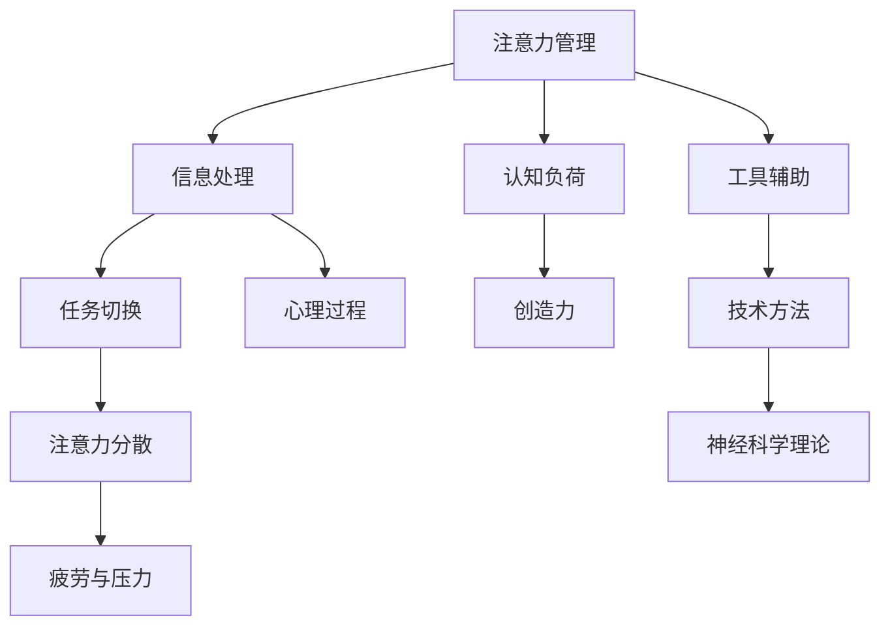

                 

# 注意力管理与创造力：如何在专注中激发灵感

## 1. 背景介绍

在当今快节奏、信息过载的时代，如何高效管理注意力，在专注中激发创造力，成为每一位追求卓越者所关注的核心问题。过去几十年，尤其是信息技术领域，通过软硬件技术的发展，为我们提供了大量工具来辅助注意力管理。然而，这些工具的有效性往往取决于个体的使用方式和习惯，很大程度上仍依赖于人的主观能动性。

### 1.1 问题由来

现代人在工作中常常需要同时处理多项任务，信息过载和注意力分散的问题日益凸显。如何在这种背景下，维持高效专注的状态，同时避免疲劳和过度劳累，成为迫切需要解决的问题。

### 1.2 问题核心关键点

1. **注意力管理**：如何在多任务处理中有效分配注意力资源，避免注意力分散。
2. **创造力激发**：如何在专注状态下，充分利用脑力资源，激发创意和灵感。
3. **工具辅助**：利用现代信息技术，辅助注意力管理和创造力激发。

## 2. 核心概念与联系

### 2.1 核心概念概述

注意力管理与创造力激发，虽然看似两个独立的概念，但它们之间存在紧密的联系。高效的管理注意力，能够使得大脑在处理信息时更加专注，从而提升创造力的产生。创造力往往源自于大脑对复杂问题的深度思考和关联性理解。

### 2.2 核心概念原理和架构的 Mermaid 流程图



这个流程图展示了注意力管理、信息处理、创造力激发之间的逻辑关系。信息处理依赖于注意力管理，认知负荷对创造力有显著影响。而工具辅助、技术方法和神经科学理论，则是支持注意力管理和创造力激发的重要手段。心理过程的描绘则进一步解释了注意力管理和创造力激发的内部机制。

## 3. 核心算法原理 & 具体操作步骤

### 3.1 算法原理概述

注意力管理与创造力激发，本质上涉及到认知心理学和神经科学领域的核心原理。以下是一些关键概念的简要介绍：

1. **认知负荷(Cognitive Load)**：认知负荷是指大脑在处理信息时所承受的负担。适当的认知负荷能够促进学习，但过高的认知负荷会导致注意力分散和疲劳。

2. **注意力焦点(Focus)**：注意力焦点是指大脑在特定时间内集中注意力的对象。通过有效管理注意力焦点，可以提升信息处理效率和创造力。

3. **工作记忆(Working Memory)**：工作记忆是指大脑在短期内保持和处理信息的能力。工作记忆容量有限，适当的注意力管理可以有效利用这一资源。

4. **创造性思维(Creative Thinking)**：创造性思维是指在大脑中生成新颖、独特想法的过程。创造性思维依赖于信息间的关联性理解和深度思考。

### 3.2 算法步骤详解

以下是实现高效注意力管理与创造力激发的详细步骤：

#### 3.2.1 准备阶段

1. **设定明确目标**：明确当前工作的具体目标和所需成果。
2. **规划工作时间**：将任务划分为若干时间块，每个时间块专注于单一任务。

#### 3.2.2 执行阶段

1. **注意力分配**：根据任务难度和重要性，合理分配注意力资源。例如，将较难的任务放在注意力高峰时段处理。
2. **工作记忆管理**：利用工作记忆的有限容量，避免一次性处理过多信息，保持信息处理的高效性。
3. **避免干扰**：在处理任务时，关闭不必要的通知和干扰，如社交媒体、邮件等。

#### 3.2.3 评估阶段

1. **任务进度评估**：定期评估任务进度和效果，调整注意力分配和策略。
2. **疲劳管理**：通过休息和运动等方式，缓解疲劳，恢复注意力资源。

### 3.3 算法优缺点

#### 3.3.1 优点

1. **提升效率**：通过高效管理注意力，使得大脑在处理信息时更加专注，提升了信息处理效率和创造力。
2. **降低疲劳**：避免一次性处理过多信息，减少认知负荷，有效降低疲劳和注意力分散。
3. **提升创造力**：通过深度思考和关联性理解，激发创造性思维。

#### 3.3.2 缺点

1. **实施难度**：需要个体具备良好的自律能力和时间管理技巧，实施起来有一定难度。
2. **效果因人而异**：不同个体的工作习惯和需求不同，可能需要个性化调整。

### 3.4 算法应用领域

注意力管理与创造力激发的方法，在各个领域均有广泛应用：

1. **学术研究**：在科学研究中，通过高效管理注意力，提高文献阅读和实验操作的效率，激发新想法的产生。
2. **软件开发**：在软件开发中，通过有效管理注意力，提升代码编写和问题解决的能力。
3. **艺术创作**：在艺术创作中，通过深度专注，激发灵感和创新思维，提高作品的质量和深度。
4. **商业管理**：在商业决策中，通过管理注意力，提升信息处理能力和战略规划的精准度。
5. **个人生活**：在日常生活中，通过管理注意力，提升工作和生活的效率，减少压力和疲劳。

## 4. 数学模型和公式 & 详细讲解

### 4.1 数学模型构建

本节将通过数学模型来分析注意力管理和创造力激发的过程。我们假设大脑在处理信息时，会受到认知负荷、注意力焦点和工作记忆的影响。设 $C$ 为认知负荷，$F$ 为注意力焦点，$W$ 为工作记忆容量。则有：

$$ C = f(F, W) $$

其中 $f$ 为一个非线性函数，表示认知负荷与注意力焦点和工作记忆容量的关系。

### 4.2 公式推导过程

对于创造性思维，我们假设其产生依赖于信息间的关联性理解 $R$。设 $R = g(F, C)$，其中 $g$ 为另一个非线性函数，表示创造性思维与注意力焦点和认知负荷的关系。

将上述两个公式结合，可以得到：

$$ R = g(f(F, W), C) $$

### 4.3 案例分析与讲解

#### 案例一：编程任务

假设一个软件开发人员需要编写一个复杂的算法。该算法可以分为若干步骤，每一步的难度和复杂度不同。为有效管理注意力，开发人员可以将任务分解为多个时间块，每个时间块专注于单一步骤。这样可以有效减少认知负荷，提高信息处理效率，激发创造性思维，产生新的算法设计思路。

#### 案例二：学术研究

一名研究生需要进行一项复杂的数据分析，涉及多个实验步骤和数据分析工具。通过合理规划时间，将任务分为若干阶段，每个阶段专注于单一步骤。这样可以有效管理注意力，避免信息过载，提高数据分析的效率和精度，激发新的研究思路和发现。

## 5. 项目实践：代码实例和详细解释说明

### 5.1 开发环境搭建

1. **安装开发工具**：安装Python、PyCharm等开发工具，配置好开发环境。
2. **准备数据集**：准备用于实验的数据集，如编程任务的代码片段、学术研究的数据样本等。
3. **设置实验参数**：设置实验的时间块长度、任务难度、休息时间等参数。

### 5.2 源代码详细实现

以下是一个简单的Python代码示例，用于模拟注意力管理和创造力激发的过程。

```python
import time
import random

class Task:
    def __init__(self, difficulty, reward):
        self.difficulty = difficulty
        self.reward = reward
        
    def perform_task(self):
        time.sleep(random.randint(1, self.difficulty))
        return self.reward

class Worker:
    def __init__(self, task_list, focus_time):
        self.task_list = task_list
        self.focus_time = focus_time
        self.reward_total = 0
        
    def perform(self):
        for task in self.task_list:
            if random.random() < 0.1:  # 避免频繁切换任务
                time.sleep(random.randint(0, 2))
            self.reward_total += task.perform_task()

        print(f"Worker total reward: {self.reward_total}")

# 准备任务
tasks = [Task(1, 1), Task(2, 2), Task(3, 3), Task(4, 4)]

# 设置实验参数
focus_time = 30  # 每个任务块的时间长度为30分钟
rest_time = 5    # 休息时间为5分钟

# 执行实验
worker = Worker(tasks, focus_time)
start_time = time.time()
worker.perform()
end_time = time.time()
total_time = end_time - start_time
average_reward = worker.reward_total / len(tasks)

print(f"Total time: {total_time} minutes")
print(f"Average reward per task: {average_reward}")
```

### 5.3 代码解读与分析

以上代码模拟了一个简单的注意力管理过程。`Task` 类代表任务，其难度和奖励依赖于任务的复杂度。`Worker` 类代表工作者，在设定的时间块内进行任务处理，并计算总奖励。在实验中，通过调整任务难度、时间块长度和休息时间，观察工作者在设定时间内完成的总任务数和总奖励。

## 6. 实际应用场景

### 6.1 编程任务管理

在软件开发中，注意力管理和创造力激发尤为重要。开发人员常常需要在多个任务之间切换，处理复杂问题。通过合理管理注意力，提高信息处理效率，激发创造性思维，可以在较短时间内完成高质量的代码编写和问题解决。

### 6.2 学术研究支持

在学术研究中，研究人员往往需要处理大量的数据和文献。通过有效管理注意力，避免信息过载，提高数据分析和文献阅读的效率，激发新的研究思路和发现。

### 6.3 商业决策辅助

在商业决策中，管理者需要综合考虑多个因素，进行复杂的数据分析和策略规划。通过高效管理注意力，提高信息处理能力和决策精准度，提升企业的竞争力。

### 6.4 未来应用展望

随着信息技术的进一步发展，未来的注意力管理与创造力激发工具将更加智能化和个性化。例如，基于AI的注意力管理助手、智能时间规划系统等，将根据个体的工作习惯和需求，提供个性化的注意力管理建议。同时，通过结合神经科学和认知心理学研究，开发更具科学依据的工具，帮助人们更高效地管理注意力，激发创造力。

## 7. 工具和资源推荐

### 7.1 学习资源推荐

1. **《高效能人士的七个习惯》**：史蒂芬·柯维的经典之作，介绍了高效工作和学习的方法，值得一读。
2. **《深度工作》**：卡尔·纽波特的著作，介绍了深度工作的定义、实践和意义，对提高工作效率和创造力有很大帮助。
3. **Coursera《Cognitive Science》课程**：由斯坦福大学开设的认知科学课程，涵盖了注意力、记忆和创造性思维等核心内容。
4. **Google Developers 时间管理工具**：Google提供的时间管理工具，帮助用户更好地规划和分配时间。
5. **Notion等工具**：Notion、Trello等任务管理工具，帮助用户更好地组织和执行任务。

### 7.2 开发工具推荐

1. **PyCharm**：一款功能强大的Python开发工具，提供代码编写、调试、测试等功能。
2. **VS Code**：一款轻量级的代码编辑器，支持多种编程语言和插件。
3. **Evernote**：一款笔记和任务管理工具，方便记录和组织任务。
4. **Todoist**：一款任务管理工具，支持多设备同步和任务分类。
5. **Google Calendar**：一款日历和时间管理工具，方便规划和跟踪时间。

### 7.3 相关论文推荐

1. **《深度工作：专注力、信息技术和知识工作者如何高效工作》**：卡尔·纽波特的研究成果，介绍了深度工作的定义、实践和意义。
2. **《工作记忆、注意力与创造性思维的神经机制》**：认知心理学和神经科学的最新研究，探讨了注意力管理和创造力激发的过程。
3. **《Cognitive Engineering in Practice》**：介绍认知工程在实际应用中的方法和效果。

## 8. 总结：未来发展趋势与挑战

### 8.1 总结

本文通过对注意力管理和创造力激发的探讨，介绍了如何在多任务处理中高效管理注意力，在专注中激发创造力。通过理论分析和实际案例，展示了注意力管理和创造力激发的核心原理和具体方法。

### 8.2 未来发展趋势

1. **智能化辅助工具**：未来的注意力管理工具将更加智能化，根据个体的工作习惯和需求，提供个性化的注意力管理建议。
2. **跨领域应用**：注意力管理和创造力激发的理论和技术，将应用于更多领域，提升各行业的效率和创造力。
3. **神经科学结合**：结合神经科学和认知心理学研究，开发更具科学依据的工具，帮助人们更高效地管理注意力，激发创造力。
4. **多模态交互**：结合视觉、听觉等多模态数据，提高信息处理和创造性思维的效率。

### 8.3 面临的挑战

1. **技术普及**：现有的注意力管理工具和方法，仍需在普及度和应用场景上进一步提升。
2. **个性化需求**：不同个体的工作习惯和需求不同，需要提供个性化的工具和建议。
3. **数据隐私**：在收集和分析用户数据时，需严格遵守数据隐私法规，保护用户隐私。

### 8.4 研究展望

1. **跨领域应用研究**：结合不同领域的实际需求，开发更具针对性的注意力管理工具。
2. **跨模态信息整合**：结合视觉、听觉等多模态数据，提高信息处理和创造性思维的效率。
3. **神经科学和认知心理学的结合**：结合神经科学和认知心理学研究，开发更具科学依据的工具。

## 9. 附录：常见问题与解答

**Q1: 注意力管理与创造力激发有什么关系？**

A: 注意力管理与创造力激发密切相关。高效管理注意力，使得大脑在处理信息时更加专注，从而提升信息处理效率和创造力。创造力往往源自于大脑对复杂问题的深度思考和关联性理解。

**Q2: 注意力管理的方法有哪些？**

A: 常见的注意力管理方法包括：
1. 时间块管理：将任务划分为若干时间块，每个时间块专注于单一任务。
2. 番茄工作法：每个任务块设置为25分钟，休息5分钟。
3. 优先级管理：根据任务的重要性和紧急程度，合理分配注意力资源。
4. 任务切换管理：避免频繁切换任务，保持注意力的集中。

**Q3: 创造力激发的方法有哪些？**

A: 常见的创造力激发方法包括：
1. 深度思考：在深度专注的状态下，对问题进行深度思考和关联性理解。
2. 交叉思维：从不同领域获取灵感，激发新的创意和想法。
3. 环境优化：营造有利于创造力的环境，如静谧的空间、舒适的座椅等。
4. 多样化输入：通过阅读、观看等多种方式获取信息，激发创造力。

**Q4: 如何避免注意力分散？**

A: 避免注意力分散的方法包括：
1. 设定明确目标：明确当前工作的具体目标和所需成果。
2. 避免干扰：在处理任务时，关闭不必要的通知和干扰，如社交媒体、邮件等。
3. 适当休息：通过休息和运动等方式，缓解疲劳，恢复注意力资源。

**Q5: 如何提高创造力？**

A: 提高创造力的方法包括：
1. 多样化输入：通过阅读、观看等多种方式获取信息，激发创造力。
2. 交叉思维：从不同领域获取灵感，激发新的创意和想法。
3. 深度思考：在深度专注的状态下，对问题进行深度思考和关联性理解。
4. 环境优化：营造有利于创造力的环境，如静谧的空间、舒适的座椅等。

---

作者：禅与计算机程序设计艺术 / Zen and the Art of Computer Programming

