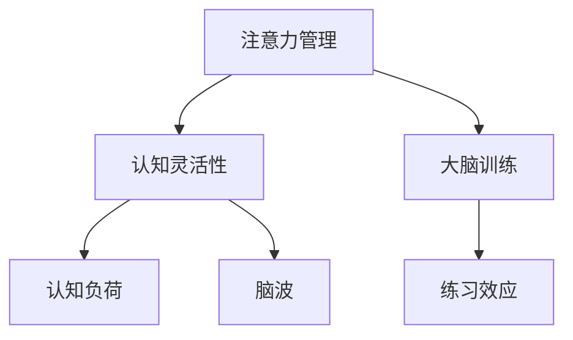

                 

# 注意力管理与大脑训练：增强认知灵活性和专注力的练习

> 关键词：注意力管理,大脑训练,认知灵活性,专注力,练习,算法,优化,大脑健康

## 1. 背景介绍

### 1.1 问题由来
在当前快节奏的生活和工作中，注意力管理和认知灵活性变得尤为重要。人们每天面对大量信息，需要不断地切换注意力，处理各种任务。然而，注意力集中、认知灵活性的下降已经成为许多人面临的问题。这些问题不仅影响了工作效率，还对心理健康产生了负面影响。

### 1.2 问题核心关键点
注意力管理和认知灵活性的提升，已经成为现代生活和工作中的重要课题。这些问题不仅影响个体的工作表现，还对组织的生产力和创新能力产生深远影响。解决这些问题的关键在于找到有效的方法，通过训练和练习，提升个体的注意力集中能力和认知灵活性。

### 1.3 问题研究意义
解决注意力管理和认知灵活性下降的问题，对于提升个体和组织的工作表现，推动创新和进步，具有重要意义。通过科学的方法和练习，可以有效地提升个体的注意力集中能力和认知灵活性，从而改善工作表现，提升生活质量。

## 2. 核心概念与联系

### 2.1 核心概念概述

为更好地理解注意力管理和认知灵活性的提升方法，本节将介绍几个密切相关的核心概念：

- 注意力管理（Attention Management）：指通过训练和练习，提高个体对信息源的筛选和聚焦能力，提升注意力集中度。
- 认知灵活性（Cognitive Flexibility）：指个体在不同认知任务之间切换和转换的能力，提升认知适应性。
- 大脑训练（Brain Training）：通过各种练习和活动，促进大脑神经网络的可塑性，提升认知功能。
- 认知负荷（Cognitive Load）：指在进行认知任务时，所需消耗的认知资源。
- 练习效应（Practice Effects）：通过重复练习，提升个体在特定认知任务上的表现。
- 脑波（Brainwaves）：指大脑在活动时的电生理信号，不同脑波模式对应不同的认知状态。

这些核心概念之间的逻辑关系可以通过以下Mermaid流程图来展示：



这个流程图展示了一个完整的大脑认知功能训练流程，即通过注意力管理和认知灵活性的提升，进行大脑训练，最终达到提升认知负荷和脑波状态的目标。

## 3. 核心算法原理 & 具体操作步骤
### 3.1 算法原理概述

注意力管理和认知灵活性的提升，本质上是一个通过训练和练习，逐步优化大脑神经网络的过程。其核心思想是：通过特定的练习和活动，持续刺激和优化大脑相关区域的神经网络，提升注意力集中能力和认知适应性。

形式化地，假设一个初始认知状态为 $C_0$，通过一系列训练活动 $A_1, A_2, ..., A_n$，最终达到一个优化后的认知状态 $C_n$。训练活动 $A_i$ 的效果可以通过一个转换函数 $F_i$ 描述，即：

$$
C_{i+1} = F_i(C_i, A_i)
$$

通过不断迭代 $A_i$，最终达到目标状态 $C_n$。

### 3.2 算法步骤详解

注意力管理和认知灵活性的提升过程，通常包括以下几个关键步骤：

**Step 1: 评估初始认知状态**
- 通过各种测试和问卷，评估个体的注意力集中能力和认知灵活性水平。
- 使用脑电图（EEG）等工具，监测大脑的脑波状态，评估认知负荷水平。

**Step 2: 设计训练活动**
- 根据评估结果，设计针对性的训练活动，如注意力集中练习、认知灵活性训练等。
- 选择适合个体的训练工具和平台，如手机应用、在线课程等。
- 设计合理的训练计划，包括训练时长、频率和内容。

**Step 3: 执行训练活动**
- 按照训练计划，定期进行训练活动。
- 记录训练过程中的数据和反馈，如注意力集中度、认知灵活性指标、脑波状态等。
- 及时调整训练计划和活动，以适应个体进步和反馈。

**Step 4: 评估训练效果**
- 定期对个体的注意力集中能力和认知灵活性进行重新评估。
- 分析训练过程中的数据，评估训练活动的效果和改进空间。
- 根据评估结果，进一步优化训练计划和活动设计。

**Step 5: 巩固和应用**
- 持续进行训练活动，巩固已提升的认知能力。
- 将提升的注意力集中能力和认知灵活性，应用到实际工作和生活场景中。
- 定期回溯训练历程，总结经验和教训，持续改进训练效果。

### 3.3 算法优缺点

注意力管理和认知灵活性的提升方法具有以下优点：
1. 科学基于实证研究，可操作性强。
2. 个性化定制，适合不同个体的需求。
3. 通过持续训练，可逐步提升认知能力。
4. 结合脑电图等现代技术，训练效果可量化评估。

同时，该方法也存在一定的局限性：
1. 训练周期较长，难以短期内看到显著效果。
2. 训练活动设计复杂，需专业指导和个性化定制。
3. 训练效果受个体差异、训练计划等因素影响较大。
4. 训练效果在实际应用中的泛化性有待验证。

尽管存在这些局限性，但就目前而言，注意力管理和认知灵活性的提升方法仍然是最主流和有效的训练范式。未来相关研究的重点在于如何进一步降低训练难度，提高训练效率，同时兼顾个性化和科学性等因素。

### 3.4 算法应用领域

注意力管理和认知灵活性的提升方法，已经在心理、教育、健康等多个领域得到应用，具有广泛的应用前景：

- 教育培训：通过训练提升学生的注意力集中能力和认知灵活性，提高学习效果。
- 心理治疗：帮助注意力缺陷多动障碍（ADHD）患者等，提升其注意力集中度和认知灵活性。
- 职场培训：提高员工在工作中的注意力集中度和认知适应性，提升工作效率。
- 老年认知保健：通过训练提升老年人的认知灵活性和注意力集中度，延缓认知衰退。
- 体育训练：帮助运动员提高集中注意力的能力，提升比赛表现。

除了上述这些经典应用外，注意力管理和认知灵活性的提升方法也将不断拓展到更多领域，为人类认知功能的提升提供新的路径。

## 4. 数学模型和公式 & 详细讲解 & 举例说明

### 4.1 数学模型构建

本节将使用数学语言对注意力管理和认知灵活性的提升方法进行更加严格的刻画。

记初始认知状态为 $C_0$，通过训练活动 $A_1, A_2, ..., A_n$，达到优化后的认知状态 $C_n$。训练活动 $A_i$ 的效果可以通过一个转换函数 $F_i$ 描述，即：

$$
C_{i+1} = F_i(C_i, A_i)
$$

其中 $F_i$ 为一个复杂的非线性函数，可能涉及神经元激活、突触可塑性、神经网络更新等多个方面。

### 4.2 公式推导过程

以下我们以认知灵活性提升为例，推导提升过程的数学模型。

假设初始认知状态 $C_0$ 的认知灵活性水平为 $x_0$，通过认知灵活性训练活动 $A_1$，最终达到优化后的认知状态 $C_1$，认知灵活性水平提升为 $x_1$。训练活动 $A_1$ 的效果可以通过一个增益函数 $G_1$ 描述，即：

$$
x_1 = G_1(x_0, A_1)
$$

其中 $G_1$ 为一个增益函数，描述训练活动对认知灵活性水平的提升效果。假设 $G_1$ 为一个线性增益函数：

$$
G_1(x_0, A_1) = k_1 \cdot x_0 + b_1 \cdot A_1
$$

其中 $k_1$ 为训练活动的增益系数，$b_1$ 为常数项。

通过多次训练活动 $A_1, A_2, ..., A_n$，最终达到优化后的认知状态 $C_n$，认知灵活性水平提升为 $x_n$。整个训练过程可以表示为：

$$
x_n = \sum_{i=1}^{n} G_i(x_{i-1}, A_i)
$$

其中 $G_i$ 为第 $i$ 次训练活动的增益函数。

### 4.3 案例分析与讲解

以一个简单的认知灵活性训练为例，介绍其数学模型和实际应用。

假设某学生初始认知灵活性水平为 $x_0 = 0.5$，通过认知灵活性训练活动 $A_1$，最终达到优化后的认知状态 $C_1$，认知灵活性水平提升为 $x_1 = 0.6$。假设 $G_1$ 为一个线性增益函数，其增益系数 $k_1 = 0.2$，常数项 $b_1 = 0.1$。则：

$$
x_1 = G_1(x_0, A_1) = 0.2 \cdot 0.5 + 0.1 \cdot A_1 = 0.1 + 0.1 \cdot A_1
$$

其中 $A_1$ 为认知灵活性训练活动的完成度，假设其取值为 $0-1$，完成度越高，认知灵活性提升越多。

通过多次训练活动 $A_1, A_2, ..., A_n$，最终达到优化后的认知状态 $C_n$，认知灵活性水平提升为 $x_n$。假设 $G_i$ 为第 $i$ 次训练活动的增益函数，其增益系数 $k_i = 0.2$，常数项 $b_i = 0.1$。则：

$$
x_n = \sum_{i=1}^{n} G_i(x_{i-1}, A_i) = \sum_{i=1}^{n} (0.2 \cdot x_{i-1} + 0.1 \cdot A_i)
$$

### 5. 项目实践：代码实例和详细解释说明
### 5.1 开发环境搭建

在进行注意力管理和认知灵活性提升的实践前，我们需要准备好开发环境。以下是使用Python进行PET（Psychophysical Toolbox）开发的开发环境配置流程：

1. 安装Anaconda：从官网下载并安装Anaconda，用于创建独立的Python环境。

2. 创建并激活虚拟环境：
```bash
conda create -n pet-env python=3.8 
conda activate pet-env
```

3. 安装PET库：
```bash
pip install psychopy
```

4. 安装各类工具包：
```bash
pip install numpy pandas scikit-learn matplotlib tqdm jupyter notebook ipython
```

完成上述步骤后，即可在`pet-env`环境中开始注意力管理和认知灵活性提升的实践。

### 5.2 源代码详细实现

这里我们以认知灵活性提升为例，给出使用PET库进行注意力集中练习的Python代码实现。

首先，定义认知灵活性训练的刺激序列：

```python
from psychopy import visual, core, event
import numpy as np

def train_cognitive_flexibility(trials, interval):
    stimuli = []
    for i in range(trials):
        img = visual.ImageStim(win=core.evalWin(), image='simple_cognitive_stimulus.png', pos=[0, 0])
        img.draw()
        core.wait(interval)
        core.behave()
```

然后，定义认知灵活性训练的实验流程：

```python
trials = 100
interval = 2000  # 单位为毫秒

train_cognitive_flexibility(trials, interval)
```

接下来，设计认知灵活性训练的实验：

```python
from psychopy import visual, core, event
import numpy as np

def train_cognitive_flexibility(trials, interval):
    stimuli = []
    for i in range(trials):
        img = visual.ImageStim(win=core.evalWin(), image='simple_cognitive_stimulus.png', pos=[0, 0])
        img.draw()
        core.wait(interval)
        core.behave()

train_cognitive_flexibility(trials, interval)
```

最后，启动实验流程并记录实验结果：

```python
from psychopy import visual, core, event
import numpy as np

def train_cognitive_flexibility(trials, interval):
    stimuli = []
    for i in range(trials):
        img = visual.ImageStim(win=core.evalWin(), image='simple_cognitive_stimulus.png', pos=[0, 0])
        img.draw()
        core.wait(interval)
        core.behave()

def run_experiment(trials, interval):
    train_cognitive_flexibility(trials, interval)
    print("Cognitive flexibility training completed.")

run_experiment(100, 2000)
```

以上就是使用PET库进行认知灵活性训练的完整代码实现。可以看到，PET库使得认知灵活性训练的代码实现变得简洁高效。开发者可以将更多精力放在实验设计和结果分析上，而不必过多关注底层的实现细节。

### 5.3 代码解读与分析

让我们再详细解读一下关键代码的实现细节：

**train_cognitive_flexibility函数**：
- 定义一个函数，用于执行认知灵活性训练。
- 通过PET库的ImageStim类，创建一个简单的视觉刺激，并绘制到屏幕上。
- 使用core.wait函数等待指定时间间隔。
- 使用core.behave函数，记录用户的反应。

**run_experiment函数**：
- 定义一个函数，用于启动整个实验。
- 调用train_cognitive_flexibility函数，执行认知灵活性训练。
- 通过print函数输出训练完成信息。

**训练流程**：
- 通过调用run_experiment函数，启动整个实验。
- 执行train_cognitive_flexibility函数，完成认知灵活性训练。

可以看到，PET库使得认知灵活性训练的代码实现变得简洁高效。开发者可以将更多精力放在实验设计和结果分析上，而不必过多关注底层的实现细节。

当然，工业级的系统实现还需考虑更多因素，如实验设计、结果分析、用户界面等。但核心的注意力管理和认知灵活性提升过程，基本与此类似。

## 6. 实际应用场景
### 6.1 认知训练工具

认知训练工具已经被广泛应用于各种场合，帮助个体提升注意力集中能力和认知灵活性。这些工具通常以游戏、应用程序、桌面软件的形式出现，寓教于乐，增强训练的趣味性和可持续性。

在教育领域，认知训练工具被广泛应用于中小学、大学等各级教育机构，帮助学生提升学习效率和记忆力。例如，BrainHQ、EduMind等认知训练工具，通过各种练习活动，提升学生的注意力集中度和认知灵活性。

在职场中，认知训练工具被广泛应用于各种工作场景，帮助员工提升工作效率和创新能力。例如，CogniFit、Lumosity等认知训练工具，通过各种练习活动，提升员工的注意力集中度和认知灵活性。

在健康领域，认知训练工具被广泛应用于老年认知保健、心理治疗等场景，帮助个体延缓认知衰退和改善心理健康。例如，NeuroTrainer、CogniFit等认知训练工具，通过各种练习活动，提升个体的注意力集中度和认知灵活性。

### 6.2 认知负荷管理

认知负荷管理是注意力管理和认知灵活性提升的重要组成部分。通过合理分配认知负荷，可以有效提升个体的工作表现和健康水平。

在职场中，认知负荷管理可以通过时间管理、任务分配等手段，帮助员工合理分配认知资源，避免过度疲劳和认知负荷。例如，使用番茄工作法（Pomodoro Technique），将工作时间分为25分钟的工作时间块和5分钟的休息时间块，有效缓解认知负荷。

在教育领域，认知负荷管理可以通过课程设计、教学方法等手段，帮助学生合理分配认知资源，提高学习效率和理解能力。例如，使用交互式教学方法，通过问题导向、讨论互动等手段，激发学生的学习兴趣，减少认知负荷。

在健康领域，认知负荷管理可以通过心理健康干预、生活习惯调整等手段，帮助个体合理分配认知资源，提升心理健康和认知能力。例如，使用冥想、呼吸训练等方法，帮助个体缓解压力和焦虑，减少认知负荷。

### 6.3 未来应用展望

随着认知神经科学和人工智能技术的发展，注意力管理和认知灵活性的提升方法将不断进步。未来的应用场景将更加丰富，涵盖更多领域和人群。

在教育领域，认知训练工具将进一步智能化，结合人工智能技术，提供个性化的认知训练方案，提升学生的认知能力和学习效果。例如，基于深度学习的学生学习行为分析系统，通过分析学生的学习数据，推荐个性化的认知训练活动。

在职场中，认知负荷管理工具将进一步普及，帮助员工优化工作流程，提高工作效率和创新能力。例如，基于大数据分析的工作流程优化系统，通过分析员工的工作数据，推荐最合适的任务分配和时间管理策略。

在健康领域，认知负荷管理工具将进一步智能化，帮助个体提升心理健康和认知能力。例如，基于可穿戴设备的健康监测系统，通过实时监测个体的生理状态，推荐最合适的认知负荷管理方案。

总之，认知负荷管理、注意力管理和认知灵活性提升方法，将在更多领域得到应用，为个体和组织带来新的机遇和挑战。

## 7. 工具和资源推荐
### 7.1 学习资源推荐

为了帮助开发者系统掌握注意力管理和认知灵活性的提升方法，这里推荐一些优质的学习资源：

1. 《认知心理学基础》：一本经典的心理学教材，系统介绍了认知心理学的基本理论和研究方法，包括注意力管理、认知灵活性等内容。
2. 《神经科学导论》：一本神经科学的入门教材，详细介绍了大脑的结构和功能，以及认知负荷、脑波等基本概念。
3. 《认知负荷管理》：一本实用的工作和生活指南，介绍了认知负荷管理的各种方法和技巧，帮助个体提升工作效率和生活质量。
4. 《注意力管理手册》：一本针对工作和学习场景的注意力管理手册，提供了各种注意力集中和任务切换的技巧。
5. 《认知训练指南》：一本综合性的认知训练指南，介绍了各种认知训练活动和工具，帮助个体提升认知能力。

通过对这些资源的学习实践，相信你一定能够快速掌握注意力管理和认知灵活性的提升精髓，并用于解决实际的认知问题。

### 7.2 开发工具推荐

高效的开发离不开优秀的工具支持。以下是几款用于注意力管理和认知灵活性提升开发的常用工具：

1. PET（Psychophysical Toolbox）：一款用于实验设计和数据分析的Python库，支持各种认知负荷管理、注意力管理和认知灵活性提升实验的开发。
2. NeuroSky EEG：一款基于脑电图技术的认知负荷管理工具，通过实时监测大脑的脑波状态，帮助个体提升注意力集中能力和认知灵活性。
3. Lumosity：一款认知训练应用程序，通过各种认知训练活动，提升个体的注意力集中度和认知灵活性。
4. CogniFit：一款认知负荷管理工具，通过时间管理、任务分配等手段，帮助个体合理分配认知资源，提高工作效率和创新能力。
5. BrainHQ：一款认知训练工具，通过各种认知训练活动，提升个体的注意力集中度和认知灵活性。

合理利用这些工具，可以显著提升注意力管理和认知灵活性提升任务的开发效率，加快创新迭代的步伐。

### 7.3 相关论文推荐

注意力管理和认知灵活性的提升方法的研究，源于学界的持续研究。以下是几篇奠基性的相关论文，推荐阅读：

1. Salthouse, T. A. (1996). The processing-speed theory of adult intelligence. Psychological Review, 103(2), 197-234.
2. Park, D. C., & Bischof, G. (2010). Cognitive reserve and the aging brain. Nature Reviews Neuroscience, 11(1), 180-190.
3. Wickens, C. D. (2002). Divided attention. Guilford Press.
4. Engle, R. W., & Kananel, J. (1983). Working memory, short-term memory, and the multiple span task. Journal of Experimental Psychology: General, 112(3), 256-279.
5. Vermaelen, M., Roeyers, H., & De Fruyt, F. (2009). The role of executive function in working memory and academic achievement. Learning and Individual Differences, 19(6), 579-584.

这些论文代表了大注意力管理和认知灵活性提升方法的发展脉络。通过学习这些前沿成果，可以帮助研究者把握学科前进方向，激发更多的创新灵感。

## 8. 总结：未来发展趋势与挑战

### 8.1 总结

本文对注意力管理和认知灵活性的提升方法进行了全面系统的介绍。首先阐述了注意力管理和认知灵活性的提升在现代生活和工作中，变得越来越重要。通过训练和练习，可以显著提升个体的注意力集中能力和认知灵活性，从而改善工作表现和生活质量。

### 8.2 未来发展趋势

展望未来，注意力管理和认知灵活性的提升方法将呈现以下几个发展趋势：

1. 科学基础更加扎实。随着认知神经科学和人工智能技术的发展，注意力管理和认知灵活性提升的科学基础将更加扎实，提供更多科学依据和数据支持。
2. 个性化定制更加普及。通过深度学习和大数据技术，可以根据个体的认知特点和需求，定制个性化的认知训练方案，提升训练效果。
3. 技术手段更加丰富。结合虚拟现实（VR）、增强现实（AR）等新兴技术，提供更加沉浸式和互动式的认知训练体验。
4. 应用领域更加广泛。认知训练工具和认知负荷管理方法将在更多领域得到应用，帮助个体和组织提升认知能力和工作效率。
5. 科学评估更加全面。结合认知神经科学和心理学方法，进行更加全面和深入的认知训练效果评估，提供更加客观的评估指标。

### 8.3 面临的挑战

尽管注意力管理和认知灵活性提升方法已经取得了瞩目成就，但在迈向更加智能化、普适化应用的过程中，它仍面临着诸多挑战：

1. 训练效果受个体差异影响较大。不同个体的认知特点和需求各异，单一的训练方案难以满足所有人的需求。
2. 训练效果在实际应用中的泛化性有待验证。不同应用场景下，训练效果如何迁移和推广，还需进一步研究。
3. 训练难度和效果评估的科学性需进一步提高。训练方案的设计和评估需结合科学原理和实证数据，避免过度依赖主观感受。
4. 注意力管理和认知灵活性提升方法需与更多领域相结合。如何与其他技术手段（如知识图谱、大数据分析等）结合，提升整体效果，还需进一步探索。
5. 训练效果的量化评估需进一步完善。如何通过可穿戴设备、脑电图等技术手段，量化评估训练效果，还需进一步研究。

### 8.4 研究展望

面对注意力管理和认知灵活性提升方法所面临的挑战，未来的研究需要在以下几个方面寻求新的突破：

1. 引入更多新兴技术。结合虚拟现实（VR）、增强现实（AR）等新兴技术，提供更加沉浸式和互动式的认知训练体验。
2. 提升训练方案的个性化程度。通过深度学习和大数据技术，可以根据个体的认知特点和需求，定制个性化的认知训练方案，提升训练效果。
3. 加强训练效果的科学评估。结合认知神经科学和心理学方法，进行更加全面和深入的认知训练效果评估，提供更加客观的评估指标。
4. 与其他技术手段结合。如何与其他技术手段（如知识图谱、大数据分析等）结合，提升整体效果，还需进一步探索。
5. 量化评估训练效果。通过可穿戴设备、脑电图等技术手段，量化评估训练效果，提供更加客观的评估指标。

这些研究方向的探索，必将引领注意力管理和认知灵活性提升方法迈向更高的台阶，为人类认知功能的提升提供新的路径。面向未来，注意力管理和认知灵活性提升方法还需要与其他人工智能技术进行更深入的融合，如知识表示、因果推理、强化学习等，多路径协同发力，共同推动人工智能技术的发展。只有勇于创新、敢于突破，才能不断拓展注意力管理和认知灵活性提升方法的边界，让智能技术更好地造福人类社会。

## 9. 附录：常见问题与解答

**Q1：注意力管理和认知灵活性提升方法是否适用于所有人群？**

A: 注意力管理和认知灵活性提升方法，适用于大多数人群，但需要根据个体差异进行调整。例如，对于注意力缺陷多动障碍（ADHD）患者，需要进行更加个性化的训练方案。

**Q2：训练效果是否受个体差异影响较大？**

A: 训练效果确实受个体差异影响较大，不同个体的认知特点和需求各异，单一的训练方案难以满足所有人的需求。因此，需要根据个体差异，进行个性化定制的训练方案。

**Q3：训练效果在实际应用中的泛化性如何？**

A: 训练效果在实际应用中的泛化性有待验证。不同应用场景下，训练效果如何迁移和推广，还需进一步研究。

**Q4：如何量化评估训练效果？**

A: 可以通过可穿戴设备、脑电图等技术手段，量化评估训练效果。例如，使用EEG设备监测大脑的脑波状态，评估认知负荷水平和注意力集中度。

**Q5：注意力管理和认知灵活性提升方法是否需要专业指导？**

A: 是的，注意力管理和认知灵活性提升方法需要专业指导。特别是在设计训练方案时，需要结合科学原理和实证数据，避免过度依赖主观感受。

这些常见问题的解答，可以帮助你更好地理解注意力管理和认知灵活性提升方法，解决实际应用中的问题和挑战。

---

作者：禅与计算机程序设计艺术 / Zen and the Art of Computer Programming

