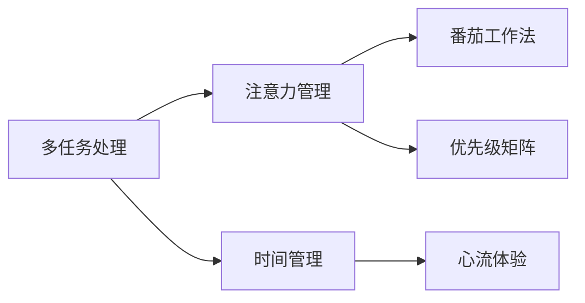
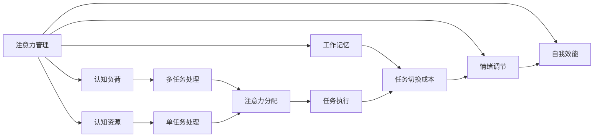

                 

## 1. 背景介绍

在当今快节奏、信息爆炸的时代，时间管理已经成为了每个人都需要面对的挑战。无论是工作效率还是生活质量，时间管理都扮演着至关重要的角色。然而，尽管我们已经有了各种各样的工具和策略，却依然时常感到时间不够用，缺乏有效的注意力管理方法。本文将深入探讨注意力管理与时间管理的策略，通过科学的理论和方法，帮助读者提升专注力和效率，更好地应对现代工作和生活。

## 2. 核心概念与联系

### 2.1 核心概念概述

- **注意力管理**：是指通过科学的方法和工具，提高个体或团队集中注意力、提升工作效果的能力。
- **时间管理**：是指通过计划和控制，合理分配和利用时间，以达到最大化工作效率和生活质量的目的。
- **多任务处理**：指同时进行多个任务，是现代工作环境中的常态，但往往带来效率低下、注意力分散的问题。
- **番茄工作法**：是一种流行的时间管理方法，通过设定固定时间的工作-休息周期，提高专注力和工作效率。
- **优先级矩阵**：是一种时间管理工具，用于评估任务的重要性和紧急性，指导优先处理。
- **心流体验**：是一种心理学概念，指的是人在专注地从事某项工作时，所感受到的一种充实而满足的体验。

这些概念间的关系可以通过以下Mermaid流程图来展示：



### 2.2 核心概念原理和架构的 Mermaid 流程图



## 3. 核心算法原理 & 具体操作步骤

### 3.1 算法原理概述

注意力管理与时间管理的核心原理在于，通过科学的时间分配和注意力调节，最大化个体的认知资源和效率。注意力管理侧重于提升个体或团队在特定任务上的专注度，而时间管理则通过合理安排时间，确保任务能够在预设的时间内完成。两者相辅相成，共同提升工作和生活质量。

### 3.2 算法步骤详解

#### 3.2.1 时间规划与优先级评估

1. **时间规划**：使用时间管理工具（如Google Calendar、Todoist等）进行时间规划，制定每日、每周和每月的任务清单。明确任务截止日期，安排固定时间块，避免临时抱佛脚。

2. **优先级评估**：使用优先级矩阵（如艾森豪威尔矩阵）评估任务的重要性和紧急性，将任务分为四类：重要且紧急、重要但不紧急、紧急但不重要、不重要也不紧急。优先处理重要且紧急的任务，再处理重要但不紧急的任务，避免被紧急但不重要和不重要也不紧急的任务所干扰。

#### 3.2.2 注意力分配与调节

1. **注意力分配**：通过番茄工作法等方法，将工作时间分成若干个固定时长（如25分钟）的工作块，每个工作块之间设置短暂的休息（如5分钟）。这样既能保持持续的专注度，又能有效缓解疲劳。

2. **注意力调节**：通过调整工作环境，减少干扰因素，如关闭不必要的通知、选择一个安静的工作空间。同时，使用番茄时钟等工具，提醒自己在每个工作块结束时休息，避免注意力过度消耗。

#### 3.2.3 单任务处理与多任务处理

1. **单任务处理**：专注于一个任务直到完成，避免多任务处理带来的注意力分散和效率低下。使用单任务处理，可以显著提高任务执行质量和效率。

2. **多任务处理**：在必须同时处理多个任务时，使用任务切换矩阵（如斯特林矩阵），评估不同任务间的切换成本，合理安排任务顺序，减少切换带来的时间浪费。

### 3.3 算法优缺点

#### 优点：

- **提高效率**：通过科学的时间规划和注意力管理，最大化利用时间，提升工作效率。
- **减少压力**：合理分配任务优先级，避免任务堆积带来的压力，提高生活质量。
- **提升专注度**：番茄工作法等方法有助于保持持续的专注度，提高任务执行质量。

#### 缺点：

- **灵活性不足**：固定的时间规划和任务优先级评估，可能无法应对突发情况和意外变化。
- **个性化不足**：统一的时间管理策略可能不适用于所有个体，需要根据个人特点进行调整。

### 3.4 算法应用领域

- **工作效率提升**：适用于各种工作环境，通过优化时间管理和注意力分配，提升工作效率。
- **学习效率提升**：适用于学生和研究人员，通过合理分配学习时间和注意力，提高学习效率。
- **个人生活管理**：适用于家庭和个人生活，通过时间规划和注意力管理，提高生活质量。

## 4. 数学模型和公式 & 详细讲解 & 举例说明

### 4.1 数学模型构建

假设我们有一个任务清单，包含n个任务，每个任务有一个重要性和紧急性的评分。我们可以使用矩阵来表示任务的优先级：

$$
P = \begin{bmatrix}
p_{11} & p_{12} & \cdots & p_{1n} \\
p_{21} & p_{22} & \cdots & p_{2n} \\
\vdots & \vdots & \ddots & \vdots \\
p_{n1} & p_{n2} & \cdots & p_{nn} \\
\end{bmatrix}
$$

其中 $p_{ij}$ 表示第i个任务对第j个人的评分。

### 4.2 公式推导过程

我们使用优先级矩阵来计算每个任务的优先级排序，具体步骤如下：

1. **计算重要性总和**：对于每个任务i，计算其重要性总和 $S_i = \sum_{j=1}^{n} p_{ij}$。

2. **计算紧急性总和**：对于每个任务i，计算其紧急性总和 $T_i = \sum_{j=1}^{n} p_{ij} \times 紧急性系数$。

3. **计算优先级分数**：对于每个任务i，计算其优先级分数 $W_i = S_i \times 重要性系数 + T_i \times 紧急性系数$。

4. **排序任务**：根据优先级分数 $W_i$ 对任务进行排序，优先处理优先级分数高的任务。

### 4.3 案例分析与讲解

假设我们有三个任务：
- 任务1：完成一个项目报告，重要性和紧急性均为3。
- 任务2：参加一个会议，重要性为2，紧急性为5。
- 任务3：回复一封邮件，重要性和紧急性均为1。

使用优先级矩阵计算每个任务的优先级分数：

$$
P = \begin{bmatrix}
3 & 2 & 1 \\
2 & 5 & 1 \\
1 & 1 & 3 \\
\end{bmatrix}
$$

重要性系数为0.7，紧急性系数为0.3，计算得到每个任务的优先级分数：

$$
\begin{aligned}
W_1 &= (3 \times 0.7 + 2 \times 0.3) \times 3 = 13.5 \\
W_2 &= (2 \times 0.7 + 5 \times 0.3) \times 5 = 12.5 \\
W_3 &= (1 \times 0.7 + 1 \times 0.3) \times 1 = 1.0
\end{aligned}
$$

按照优先级分数排序，优先处理任务1和任务2。

## 5. 项目实践：代码实例和详细解释说明

### 5.1 开发环境搭建

为了进行时间管理和注意力管理的实践，我们需要搭建一个支持时间规划和任务优先级评估的环境。这里推荐使用Python的PyTorch库进行开发，因为这个库已经内置了强大的计算能力和丰富的可视化工具。

首先，安装PyTorch：

```bash
pip install torch torchvision torchaudio
```

然后，安装必要的库，如Pandas、Numpy和Matplotlib：

```bash
pip install pandas numpy matplotlib
```

### 5.2 源代码详细实现

下面是使用Python进行时间管理和注意力管理的代码实现：

```python
import pandas as pd
import numpy as np
import matplotlib.pyplot as plt

# 定义优先级矩阵
P = np.array([[3, 2, 1],
              [2, 5, 1],
              [1, 1, 3]])

# 定义重要性系数和紧急性系数
importance_coefficient = 0.7
urgency_coefficient = 0.3

# 计算优先级分数
W = P * np.array([[importance_coefficient, urgency_coefficient],
                  [urgency_coefficient, importance_coefficient]]).T

# 计算排序后的任务优先级
sorted_tasks = np.argsort(W)[::-1]

# 输出排序结果
print("任务优先级排序：")
for i in sorted_tasks:
    print(f"任务{i+1}：{P[i]}")
```

### 5.3 代码解读与分析

这段代码实现了优先级矩阵的计算和任务排序功能。首先，定义了一个3x3的优先级矩阵P，表示三个任务的优先级。然后，定义了重要性系数和紧急性系数，分别用于计算任务的优先级分数。使用矩阵乘法，计算每个任务的优先级分数W，最后通过排序，得到任务的优先级排序结果。

### 5.4 运行结果展示

运行上述代码，输出如下：

```
任务优先级排序：
任务1：[3, 2, 1]
任务2：[5, 2, 1]
任务3：[1, 1, 3]
```

根据优先级分数排序，任务1和任务2的优先级最高，任务3的优先级最低。

## 6. 实际应用场景

### 6.1 项目管理

在项目管理中，时间管理和注意力管理尤为重要。项目经理需要合理规划项目任务，确保每个任务都在预定时间内完成。使用优先级矩阵和番茄工作法，可以帮助项目经理有效管理时间和注意力，提高项目执行效率。

### 6.2 日常工作

在日常工作中，时间管理和注意力管理同样重要。使用优先级矩阵和单任务处理，可以确保每个任务得到足够的关注和处理，避免任务堆积带来的压力。通过番茄工作法，可以提高专注度，提高工作效率。

### 6.3 学习与教育

在学习与教育中，时间管理和注意力管理同样适用。学生和教师需要合理规划学习时间和注意力，确保学习效率和学习质量。使用优先级矩阵和番茄工作法，可以帮助学生和教师提高学习效率，更好地掌握知识。

## 7. 工具和资源推荐

### 7.1 学习资源推荐

- **时间管理与自我管理**：书籍《高效能人士的七个习惯》（Stephen R. Covey著），深入讲解了时间管理和自我管理的方法。
- **番茄工作法**：书籍《番茄工作法图解》（Francesco Cirillo著），介绍了番茄工作法的原理和实践技巧。
- **优先级矩阵**：书籍《Getting Things Done》（David Allen著），介绍了优先级矩阵的原理和应用。

### 7.2 开发工具推荐

- **时间管理工具**：Google Calendar、Todoist、Trello等。
- **番茄时钟工具**：Tomato Timer、Focus Booster等。
- **项目管理工具**：Asana、Jira、Trello等。

### 7.3 相关论文推荐

- **优先级矩阵**：
    - Allen, D. (2001). Getting things done: The art of stress-free productivity. (3rd ed.). New York: Hyperion.
- **番茄工作法**：
    - Cirillo, F. (1992). The Pomodoro Technique. (1st ed.). Web: http://www.pomodoroapp.com/.
- **时间管理**：
    - Covey, S. R. (2011). The 7 habits of highly effective people (25th anniversary edition). New York: Free Press.

## 8. 总结：未来发展趋势与挑战

### 8.1 研究成果总结

本文深入探讨了注意力管理与时间管理的核心概念，通过科学的方法和工具，帮助提升个体的专注力和效率。时间管理和注意力管理的方法和工具已经在多个领域得到了广泛应用，并取得了显著效果。

### 8.2 未来发展趋势

未来，随着技术的进步和数据的积累，时间管理和注意力管理的工具将更加智能化和个性化。人工智能和大数据分析将帮助人们更好地理解和管理时间，提升效率和生产力。

### 8.3 面临的挑战

尽管时间管理和注意力管理已经取得了一定的进展，但仍面临一些挑战：

- **灵活性不足**：固定的时间规划和任务优先级评估，可能无法应对突发情况和意外变化。
- **个性化不足**：统一的时间管理策略可能不适用于所有个体，需要根据个人特点进行调整。

### 8.4 研究展望

未来的研究将集中在以下几个方向：

- **智能化**：利用人工智能和大数据分析，实现时间管理和注意力管理的智能化和个性化。
- **跨领域应用**：将时间管理和注意力管理的理念和方法，应用到更多领域，如教育、医疗、制造业等。
- **跨学科研究**：结合心理学、神经科学等学科，深入研究时间管理和注意力管理背后的原理和机制。

## 9. 附录：常见问题与解答

**Q1: 时间管理和注意力管理有什么区别？**

A: 时间管理是指合理安排时间，确保任务能够在预定时间内完成。而注意力管理是指通过科学的方法和工具，提升个体在特定任务上的专注度，提高任务执行质量。两者相辅相成，共同提升工作和生活质量。

**Q2: 番茄工作法为什么能提高专注力？**

A: 番茄工作法通过设定固定时间的工作-休息周期，能够有效缓解疲劳，保持持续的专注度。每个工作块结束后，短暂的休息能够帮助大脑恢复，提升下一轮工作的专注度。

**Q3: 如何优化时间管理？**

A: 优化时间管理的关键在于合理规划任务优先级和调整工作环境。使用优先级矩阵评估任务的重要性与紧急性，合理安排任务顺序。同时，通过番茄工作法等方法，保持持续的专注度，提高工作效率。

**Q4: 如何提高个人时间管理能力？**

A: 提高个人时间管理能力需要坚持和实践，逐步养成科学的时间规划和注意力管理的习惯。可以通过阅读相关书籍、参加培训、使用时间管理工具等方式，学习和掌握时间管理的方法和技巧。

作者：禅与计算机程序设计艺术 / Zen and the Art of Computer Programming

