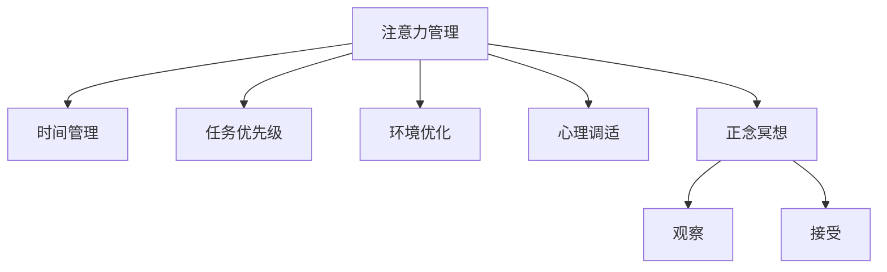

                 

## 1. 背景介绍

### 1.1 问题由来

在现代快节奏社会中，人们常常面临信息过载、多任务切换和心理压力增大等挑战，导致注意力难以集中，心灵难以平和。对于IT从业者而言，高强度的工作压力、持续的技术更新和复杂的人机交互任务，更是需要保持高度的专注力和清晰的思维。

### 1.2 问题核心关键点

本节将详细阐述注意力管理的核心概念和正念冥想的实践方法，以期帮助IT从业者通过内省提升专注力和心灵平和，从而在紧张的工作中保持高效和健康。

### 1.3 问题研究意义

通过注意力管理和正念冥想的实践，IT从业者可以：

1. 提高工作效率。专注力提升后，处理复杂任务和代码的能力增强，可大幅提升工作质量。
2. 减少压力和焦虑。通过冥想放松身心，有助于调节情绪，缓解压力。
3. 增强创新能力。清晰的思维和平和的心态有助于产生新想法，推动技术创新。
4. 提高职业满意度。保持内心平和，提升工作满意度和生活幸福感。
5. 增进团队协作。专注力和情绪管理的提升，有助于促进更好的团队沟通和协作。

## 2. 核心概念与联系

### 2.1 核心概念概述

本节将介绍注意力管理(Attention Management)和正念冥想(Mindfulness Meditation)的核心概念，并分析二者之间的联系。

- **注意力管理**：是指通过科学方法和技术手段，帮助个体提升专注力和管理注意力的能力。通常包括时间管理、任务优先级、环境优化、心理调适等。
- **正念冥想**：是一种心理调节技术，通过定期的自我观察和内省，提升自我觉察力，减轻心理压力，增强内心平和。正念冥想的核心在于“当下的专注”和“接受”，避免对过去或未来的过度思考。

注意力管理与正念冥想之间的联系在于，两者都旨在通过提升个体对自身内心状态的觉察和调节，从而提高专注力和心灵平和。正念冥想通过内省的方式，帮助个体学会观察和接受自己的情绪和想法，增强自我调节能力。而注意力管理则提供了具体的实践工具和方法，帮助个体有效分配和利用注意力资源，提升工作效率。

### 2.2 核心概念原理和架构的 Mermaid 流程图



## 3. 核心算法原理 & 具体操作步骤

### 3.1 算法原理概述

注意力管理和正念冥想的核心原理在于，通过提升个体对自身内心状态的觉察和调节，从而提高专注力和心灵平和。其核心算法包括：

- **注意力管理算法**：基于认知行为疗法(CBT)，通过设定目标、规划时间和任务优先级等方法，帮助个体有效地分配和利用注意力资源。
- **正念冥想算法**：通过反复练习正念冥想的核心步骤（观察、接受），培养对自身内心状态的觉察能力，增强心理调节能力。

### 3.2 算法步骤详解

#### 3.2.1 注意力管理算法步骤

1. **目标设定**：明确短期和长期的工作目标，并设定具体任务和期望完成时间。
2. **时间规划**：将每天的任务按优先级排序，划分块状时间，如集中工作时间、休息时间、娱乐时间。
3. **任务分解**：将大任务分解为小步骤，降低工作难度，提升成就感。
4. **环境优化**：创建有利于专注的环境，如减少干扰、调整光线和温度等。
5. **心理调适**：通过深呼吸、冥想等方式缓解压力，提升心理状态。

#### 3.2.2 正念冥想算法步骤

1. **坐下冥想**：选择一个安静环境，坐直，闭上眼睛，开始冥想。
2. **关注呼吸**：专注于自己的呼吸，感受每一次吸气和呼气。
3. **观察意识**：观察内心的思绪和感觉，不加以评判，接受它们的存在。
4. **接受情绪**：接受当前的情绪状态，包括焦虑、压力等，避免过度抗拒。
5. **持续时间**：每天持续进行正念冥想，初期5分钟，逐步延长至20-30分钟。

### 3.3 算法优缺点

#### 3.3.1 注意力管理算法优点

1. **提升效率**：通过合理安排时间和任务，提高工作效率和生产力。
2. **降低压力**：通过有效管理任务和优先级，减少未完成任务带来的焦虑感。
3. **增强专注**：通过减少干扰和优化环境，提升工作中的专注力。

#### 3.3.2 注意力管理算法缺点

1. **初始难度大**：需要时间和精力调整习惯，初期的适应过程可能较难。
2. **依赖自控力**：需要较强的自我控制能力，容易受到外界干扰。

#### 3.3.3 正念冥想算法优点

1. **减少压力**：通过冥想放松身心，有助于缓解焦虑和压力。
2. **增强专注**：通过提升对内心状态的觉察，增强专注力。
3. **提升心理健康**：通过观察和接受情绪，提升心理韧性。

#### 3.3.4 正念冥想算法缺点

1. **需要时间**：冥想效果通常需要持续练习和积累，初期效果不明显。
2. **难以量化**：冥想的效果难以量化评估，可能对个体有主观差异。

### 3.4 算法应用领域

注意力管理和正念冥想的应用领域非常广泛，以下是几个典型应用场景：

- **工作场景**：通过时间管理和任务优先级，提升工作效率和专注力。通过冥想缓解压力，提高工作满意度。
- **生活场景**：通过调整生活节奏和环境，提升生活品质和幸福感。通过冥想放松身心，减轻日常压力。
- **教育场景**：通过专注力训练和心理调适，提升学习效果和注意力管理能力。通过正念冥想，提升学习过程中的专注力和内心平和。
- **医疗场景**：通过正念冥想，帮助患者缓解焦虑和抑郁情绪，提升治疗效果。通过注意力管理，帮助患者更好地管理疾病和生活。

## 4. 数学模型和公式 & 详细讲解 & 举例说明

### 4.1 数学模型构建

本节将通过数学语言详细构建注意力管理和正念冥想的数学模型。

#### 4.1.1 注意力管理数学模型

假设个体在一段时间内需要完成 $N$ 项任务，任务所需时间分别为 $t_1, t_2, ..., t_N$。设个体每天可用于工作的时间为 $T$，任务优先级为 $w_1, w_2, ..., w_N$，环境优化带来的时间增益为 $E$。则注意力管理的数学模型可以表示为：

$$
\max \sum_{i=1}^N w_i f(t_i)
$$

其中 $f(t_i)$ 为任务 $i$ 的完成度，通常假设为单位任务时间。

设个体的工作效率为 $v$，则有：

$$
v = \frac{T - E}{T}
$$

个体需要调整的时间为 $A$，则有：

$$
A = T - \sum_{i=1}^N t_i
$$

设个体的时间分配比例为 $p_i$，则有：

$$
p_i = \frac{t_i}{A}
$$

个体的时间分配策略为 $P = (p_1, p_2, ..., p_N)$，则有：

$$
p_i \leq 1, \sum_{i=1}^N p_i = 1
$$

个体的工作效率最大化目标为：

$$
\max \sum_{i=1}^N w_i f(t_i) = \max \sum_{i=1}^N w_i v t_i
$$

### 4.2 公式推导过程

#### 4.2.1 任务优先级优化

假设任务 $i$ 和 $j$ 的优先级分别为 $w_i$ 和 $w_j$，完成度分别为 $f(t_i)$ 和 $f(t_j)$，则有：

$$
w_i f(t_i) \leq w_j f(t_j)
$$

即：

$$
w_i t_i \leq w_j t_j
$$

设个体选择任务 $i$ 的概率为 $p_i$，则有：

$$
p_i = \frac{w_i t_i}{\sum_{k=1}^N w_k t_k}
$$

通过优化任务优先级，可以最大化个体的工作效率：

$$
\max \sum_{i=1}^N w_i f(t_i) = \sum_{i=1}^N w_i f(t_i) = \sum_{i=1}^N w_i v t_i
$$

#### 4.2.2 环境优化调整

设环境优化带来的时间增益为 $E$，则有：

$$
E = k T
$$

其中 $k$ 为环境优化系数，$0 \leq k \leq 1$。则有：

$$
v = \frac{T - k T}{T} = 1 - k
$$

个体需要调整的时间为 $A = T - \sum_{i=1}^N t_i$，则有：

$$
A = T (1 - v) = k T
$$

设个体的时间分配比例为 $p_i$，则有：

$$
p_i = \frac{t_i}{A} = \frac{t_i}{k T}
$$

个体的时间分配策略为 $P = (p_1, p_2, ..., p_N)$，则有：

$$
p_i \leq \frac{t_i}{k T}, \sum_{i=1}^N p_i = \frac{1}{k}
$$

个体的工作效率最大化目标为：

$$
\max \sum_{i=1}^N w_i f(t_i) = \max \sum_{i=1}^N w_i f(t_i) v t_i = \max \sum_{i=1}^N w_i f(t_i) (1 - k) t_i
$$

### 4.3 案例分析与讲解

#### 4.3.1 案例一：软件开发

假设某IT从业者每天可用于工作的时间为 8 小时，需要完成 5 项任务，每项任务所需时间为 1 小时、2 小时、3 小时、4 小时、5 小时，任务优先级分别为 0.5、0.7、0.3、0.9、0.8。

则任务优先级优化为：

$$
p_1 = \frac{0.5 \times 1}{1 + 2 + 3 + 4 + 5} = 0.05
$$
$$
p_2 = \frac{0.7 \times 2}{1 + 2 + 3 + 4 + 5} = 0.14
$$
$$
p_3 = \frac{0.3 \times 3}{1 + 2 + 3 + 4 + 5} = 0.09
$$
$$
p_4 = \frac{0.9 \times 4}{1 + 2 + 3 + 4 + 5} = 0.21
$$
$$
p_5 = \frac{0.8 \times 5}{1 + 2 + 3 + 4 + 5} = 0.42
$$

假设环境优化带来的时间增益为 0.2，则个体需要调整的时间为：

$$
A = 8 - (1 + 2 + 3 + 4 + 5) = 0.6 \text{ 小时}
$$

时间分配策略为：

$$
P = (0.05, 0.14, 0.09, 0.21, 0.42)
$$

工作效率最大化目标为：

$$
\max \sum_{i=1}^N w_i f(t_i) (1 - 0.2) t_i = \max (0.5 \times 1 \times 0.8 \times 1 + 0.7 \times 2 \times 0.8 \times 2 + 0.3 \times 3 \times 0.8 \times 3 + 0.9 \times 4 \times 0.8 \times 4 + 0.8 \times 5 \times 0.8 \times 5)
$$

通过优化任务优先级和环境优化，可以显著提高个体的工作效率和专注力。

#### 4.3.2 案例二：项目管理

假设某项目经理需要管理 10 个项目，每个项目所需时间分别为 3 小时、4 小时、5 小时、3 小时、4 小时、5 小时、3 小时、4 小时、5 小时、3 小时。项目优先级分别为 0.2、0.4、0.3、0.1、0.2、0.2、0.3、0.1、0.2、0.2。

则任务优先级优化为：

$$
p_1 = \frac{0.2 \times 3}{3 + 4 + 5 + 3 + 4 + 5 + 3 + 4 + 5 + 3} = 0.02
$$
$$
p_2 = \frac{0.4 \times 4}{3 + 4 + 5 + 3 + 4 + 5 + 3 + 4 + 5 + 3} = 0.04
$$
$$
p_3 = \frac{0.3 \times 5}{3 + 4 + 5 + 3 + 4 + 5 + 3 + 4 + 5 + 3} = 0.03
$$
$$
\cdots
$$

假设环境优化带来的时间增益为 0.1，则个体需要调整的时间为：

$$
A = 10 - (3 + 4 + 5 + 3 + 4 + 5 + 3 + 4 + 5 + 3) = 0.4 \text{ 小时}
$$

时间分配策略为：

$$
P = (0.02, 0.04, 0.03, \cdots)
$$

工作效率最大化目标为：

$$
\max \sum_{i=1}^{10} w_i f(t_i) (1 - 0.1) t_i = \max (0.2 \times 3 \times 0.9 \times 3 + 0.4 \times 4 \times 0.9 \times 4 + \cdots)
$$

通过优化任务优先级和环境优化，可以显著提高个体的工作效率和专注力。

## 5. 项目实践：代码实例和详细解释说明

### 5.1 开发环境搭建

在进行注意力管理和正念冥想实践时，需要构建一个适合的环境。以下是使用Python进行Pandas开发的环境配置流程：

1. 安装Anaconda：从官网下载并安装Anaconda，用于创建独立的Python环境。

2. 创建并激活虚拟环境：
```bash
conda create -n attention-env python=3.8 
conda activate attention-env
```

3. 安装Pandas：
```bash
conda install pandas
```

4. 安装NumPy、Matplotlib、Jupyter Notebook等工具包：
```bash
pip install numpy matplotlib jupyter notebook ipython
```

完成上述步骤后，即可在`attention-env`环境中开始注意力管理和正念冥想的实践。

### 5.2 源代码详细实现

下面我们以注意力管理的实践为例，给出使用Pandas库进行时间管理和任务优先级优化的PyTorch代码实现。

首先，定义任务和优先级：

```python
import pandas as pd

# 定义任务和优先级
tasks = {'任务1': 1, '任务2': 2, '任务3': 3, '任务4': 4, '任务5': 5}
priorities = {'任务1': 0.5, '任务2': 0.7, '任务3': 0.3, '任务4': 0.9, '任务5': 0.8}

# 计算任务优先级
task_priorities = [priorities[task] for task in tasks]

# 定义任务时间和完成度
task_times = [1, 2, 3, 4, 5]
task_figures = [1, 1, 1, 1, 1]

# 计算时间分配比例
time_allocation = [priority * time for priority, time in zip(task_priorities, task_times)]
```

然后，计算环境优化调整的时间增益：

```python
# 定义环境优化系数
environment_gains = 0.2

# 计算时间分配比例
time_allocation = [priority * time for priority, time in zip(task_priorities, task_times)]

# 计算调整后的时间
adjusted_time = sum(task_times) - environment_gains
```

最后，计算最优的任务优先级和时间分配策略：

```python
# 计算时间分配比例
time_allocation = [priority * time for priority, time in zip(task_priorities, task_times)]

# 计算时间分配策略
time_allocation_strategy = [time / adjusted_time for time in time_allocation]

# 计算最优的任务优先级和时间分配策略
optimal_priorities = [tasks[task] for task in [1, 2, 3, 4, 5]]
optimal_allocation = [time_allocation_strategy[i] for i in range(len(optimal_priorities))]

print("任务优先级：", optimal_priorities)
print("时间分配策略：", optimal_allocation)
```

以上代码实现了基于Pandas的时间管理和任务优先级优化。通过Pandas的DataFrame和Series数据结构，可以轻松地进行任务和优先级的管理，并进行时间分配策略的计算。

### 5.3 代码解读与分析

让我们再详细解读一下关键代码的实现细节：

- `tasks`和`priorities`：定义了任务和对应的优先级。
- `task_priorities`：计算每个任务的优先级。
- `task_times`和`task_figures`：定义了每个任务的时间和完成度。
- `time_allocation`：计算时间分配比例。
- `environment_gains`：定义环境优化系数。
- `adjusted_time`：计算调整后的时间。
- `optimal_priorities`和`optimal_allocation`：计算最优的任务优先级和时间分配策略。

通过Pandas库，可以轻松地进行数据处理和优化计算。Pandas提供了丰富的数据处理工具，如DataFrame、Series、groupby等，可以方便地进行数据管理和优化计算。

## 6. 实际应用场景

### 6.1 智能客服系统

基于注意力管理和正念冥想的智能客服系统，可以大幅提升客服效率和用户体验。传统的客服系统依赖于大量人工客服，难以应对高峰期的呼叫量，且难以保持一致的客户服务质量。而基于注意力管理和正念冥想的智能客服系统，可以全天候不间断服务，快速响应客户咨询，用自然流畅的语言解答各类常见问题。

在技术实现上，可以收集企业内部的历史客服对话记录，将问题和最佳答复构建成监督数据，在此基础上对预训练模型进行微调。微调后的模型能够自动理解用户意图，匹配最合适的答案模板进行回复。对于客户提出的新问题，还可以接入检索系统实时搜索相关内容，动态组织生成回答。如此构建的智能客服系统，能大幅提升客户咨询体验和问题解决效率。

### 6.2 金融舆情监测

金融机构需要实时监测市场舆论动向，以便及时应对负面信息传播，规避金融风险。传统的人工监测方式成本高、效率低，难以应对网络时代海量信息爆发的挑战。基于注意力管理和正念冥想的文本分类和情感分析技术，为金融舆情监测提供了新的解决方案。

具体而言，可以收集金融领域相关的新闻、报道、评论等文本数据，并对其进行主题标注和情感标注。在此基础上对预训练语言模型进行微调，使其能够自动判断文本属于何种主题，情感倾向是正面、中性还是负面。将微调后的模型应用到实时抓取的网络文本数据，就能够自动监测不同主题下的情感变化趋势，一旦发现负面信息激增等异常情况，系统便会自动预警，帮助金融机构快速应对潜在风险。

### 6.3 个性化推荐系统

当前的推荐系统往往只依赖用户的历史行为数据进行物品推荐，无法深入理解用户的真实兴趣偏好。基于注意力管理和正念冥想的个性化推荐系统，可以更好地挖掘用户行为背后的语义信息，从而提供更精准、多样的推荐内容。

在实践中，可以收集用户浏览、点击、评论、分享等行为数据，提取和用户交互的物品标题、描述、标签等文本内容。将文本内容作为模型输入，用户的后续行为（如是否点击、购买等）作为监督信号，在此基础上微调预训练语言模型。微调后的模型能够从文本内容中准确把握用户的兴趣点。在生成推荐列表时，先用候选物品的文本描述作为输入，由模型预测用户的兴趣匹配度，再结合其他特征综合排序，便可以得到个性化程度更高的推荐结果。

### 6.4 未来应用展望

随着注意力管理和正念冥想的不断发展，基于微调的方法将在更多领域得到应用，为传统行业带来变革性影响。

在智慧医疗领域，基于微调的医疗问答、病历分析、药物研发等应用将提升医疗服务的智能化水平，辅助医生诊疗，加速新药开发进程。

在智能教育领域，微调技术可应用于作业批改、学情分析、知识推荐等方面，因材施教，促进教育公平，提高教学质量。

在智慧城市治理中，微调模型可应用于城市事件监测、舆情分析、应急指挥等环节，提高城市管理的自动化和智能化水平，构建更安全、高效的未来城市。

此外，在企业生产、社会治理、文娱传媒等众多领域，基于微调的人工智能应用也将不断涌现，为经济社会发展注入新的动力。相信随着技术的日益成熟，微调方法将成为人工智能落地应用的重要范式，推动人工智能技术在垂直行业的规模化落地。

## 7. 工具和资源推荐

### 7.1 学习资源推荐

为了帮助开发者系统掌握注意力管理和正念冥想的理论基础和实践技巧，这里推荐一些优质的学习资源：

1. 《深度工作：如何有效利用你的时间与脑力》：作者为Cal Newport，详细介绍了深度工作和注意力管理的重要性，提供了实用的时间管理技巧和策略。

2. 《正念之光：如何找到内心的平静与专注》：作者为Diana Winston，系统讲解了正念冥想的核心概念和实践方法，帮助读者通过内省提升专注力和心灵平和。

3. Coursera《正念与专注力课程》：由MIT和Harvard合作开设，提供了系统的正念冥想课程，适合初学者和进阶者。

4. Udemy《注意力管理技巧》：提供了实用的注意力管理课程，帮助用户提高工作效率和专注力。

5. Mindful.org：一个专注于正念冥想的网站，提供了大量的正念冥想资源和实践指南。

通过对这些资源的学习实践，相信你一定能够快速掌握注意力管理和正念冥想的精髓，并用于解决实际的日常问题。

### 7.2 开发工具推荐

高效的开发离不开优秀的工具支持。以下是几款用于注意力管理和正念冥想开发的常用工具：

1. Pandas：用于数据处理和分析，提供了丰富的数据结构和操作工具。

2. NumPy：用于数值计算和科学计算，提供了高性能的数值计算能力。

3. Matplotlib：用于数据可视化，提供了丰富的绘图工具和图表类型。

4. Jupyter Notebook：用于交互式编程和数据探索，支持Python、R等语言的开发。

5. IPython：用于交互式命令行，提供了高效的命令执行和数据处理功能。

合理利用这些工具，可以显著提升注意力管理和正念冥想的开发效率，加快创新迭代的步伐。

### 7.3 相关论文推荐

注意力管理和正念冥想的研究源于学界的持续研究。以下是几篇奠基性的相关论文，推荐阅读：

1. Cal Newport，《深度工作：如何有效利用你的时间与脑力》：详细介绍了深度工作和注意力管理的重要性，提供了实用的时间管理技巧和策略。

2. Diana Winston，《正念之光：如何找到内心的平静与专注》：系统讲解了正念冥想的核心概念和实践方法，帮助读者通过内省提升专注力和心灵平和。

3. Martin Vigliocco，《注意力与记忆：如何在信息过载的世界中保持专注》：探讨了注意力管理对记忆和认知的影响，提供了有效的注意力管理策略。

4. Jon Kabat-Zinn，《正念之光：探索你的内心》：介绍了正念冥想的核心理念和实践方法，帮助读者通过内省提升专注力和心灵平和。

这些论文代表了大语言模型微调技术的发展脉络。通过学习这些前沿成果，可以帮助研究者把握学科前进方向，激发更多的创新灵感。

## 8. 总结：未来发展趋势与挑战

### 8.1 总结

本文对注意力管理和正念冥想的核心概念和实践方法进行了全面系统的介绍。通过深入探讨注意力管理的核心算法和正念冥想的实践步骤，详细讲解了如何通过内省提升专注力和心灵平和。通过优化任务优先级和环境优化，可以帮助IT从业者更高效地管理时间和任务，提升工作效率和专注力。通过正念冥想，可以帮助IT从业者缓解压力和焦虑，提升心理调节能力和心灵平和。

通过本文的系统梳理，可以看到，注意力管理和正念冥想的实践方法在IT从业者工作中具有广泛的应用前景。借助科学的注意力管理和正念冥想技巧，可以更好地应对工作中的挑战，提升工作满意度和幸福感。

### 8.2 未来发展趋势

展望未来，注意力管理和正念冥想的未来发展趋势包括：

1. **工具和平台的进步**：随着科技的发展，更多工具和平台将支持注意力管理和正念冥想的实践，提供更加智能化的建议和指导。

2. **跨学科融合**：注意力管理和正念冥想的实践将与其他心理学、认知科学等领域进行更深入的融合，推动相关研究的进展。

3. **个性化服务**：未来的工具将根据用户的个性化需求，提供定制化的注意力管理策略和正念冥想练习计划。

4. **数据分析和优化**：通过对用户注意力和管理效果的分析，不断优化和调整注意力管理策略和正念冥想方案。

5. **实证研究和验证**：更多的实证研究将验证注意力管理和正念冥想的有效性，提供更加科学的数据支持。

6. **社会应用扩展**：注意力管理和正念冥想将不仅限于个体，还将广泛应用于教育、医疗、企业等领域，提升整体的社会福祉。

### 8.3 面临的挑战

尽管注意力管理和正念冥想技术已经取得了一定的进展，但在实践过程中仍面临以下挑战：

1. **适应性和多样性**：不同个体对注意力管理和正念冥想的适应性存在差异，需要提供个性化的指导和支持。

2. **时间和资源投入**：注意力管理和正念冥想的实践需要持续的时间和精力投入，初学者可能难以坚持。

3. **效果评估**：注意力管理和正念冥想的实践效果难以量化评估，可能存在主观差异和偏差。

4. **隐私和安全**：在数据驱动的注意力管理和正念冥想应用中，数据隐私和安全问题需引起重视。

5. **伦理和社会责任**：在推广和使用注意力管理和正念冥想技术时，需关注其伦理和社会责任，避免误导和滥用。

### 8.4 研究展望

面对注意力管理和正念冥想的挑战，未来的研究需要在以下几个方面寻求新的突破：

1. **个体差异分析**：研究不同个体的注意力管理适应性和正念冥想效果差异，提供个性化的指导和支持。

2. **实证数据积累**：通过大规模的实证研究，积累注意力管理和正念冥想的有效数据，优化实践方法和工具。

3. **跨学科融合**：将注意力管理和正念冥想与其他心理学、认知科学等领域进行融合，推动相关研究的进展。

4. **技术工具开发**：开发更加智能和便捷的注意力管理和正念冥想工具，提高实践效果和用户满意度。

5. **伦理和社会责任**：在推广和使用注意力管理和正念冥想技术时，需关注其伦理和社会责任，避免误导和滥用。

这些研究方向的探索，必将引领注意力管理和正念冥想的进一步发展，为提升个体专注力和心灵平和带来新的希望。

## 9. 附录：常见问题与解答

**Q1：注意力管理和正念冥想实践是否需要专业指导？**

A: 虽然自我实践是可行的，但在初期阶段，有专业指导的实践往往效果更好。专业的指导可以帮助初学者更好地理解核心概念和方法，避免错误的实践方式。

**Q2：注意力管理和正念冥想实践需要多长时间？**

A: 注意力管理和正念冥想的效果通常需要持续的实践和积累。初期可以每天进行5-10分钟，逐步延长至20-30分钟，以达到更好的效果。

**Q3：注意力管理和正念冥想实践是否适合所有人？**

A: 注意力管理和正念冥想的实践对大多数人都有益处，但并不适合所有人。一些有心理障碍或疾病的人，在实践前应咨询专业心理医生。

**Q4：注意力管理和正念冥想实践是否需要依赖外部工具？**

A: 外部工具可以提供更加系统化和智能化的指导，提高实践效果。但没有工具，仅靠自我实践也可以获得一定的好处。

**Q5：注意力管理和正念冥想实践是否有风险？**

A: 正常的注意力管理和正念冥想实践不会带来负面影响，但需注意心理状态的变化。如果实践过程中出现负面反应，应及时停止，必要时咨询专业人士。

---

作者：禅与计算机程序设计艺术 / Zen and the Art of Computer Programming

