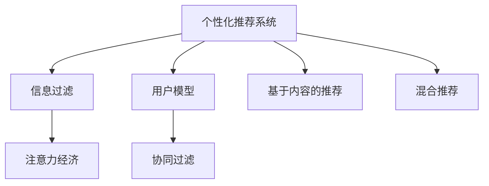

                 

# 注意力经济与个人信息过滤能力的培养

> 关键词：注意力经济, 个性化推荐系统, 信息过滤, 信息过载, 用户模型

## 1. 背景介绍

### 1.1 问题由来
在当今信息爆炸的时代，人们每天都会接触到海量的信息。无论是通过搜索引擎、新闻应用、社交媒体，还是电商网站，用户被大量信息包围，如何高效地过滤信息，快速获取有价值的内容，成为每个用户都面临的难题。面对这个问题，各大互联网公司纷纷推出了个性化推荐系统，通过分析用户的历史行为数据，预测其偏好，实现信息过滤与内容推荐。

然而，个性化推荐系统并非万能。尽管可以通过收集用户的行为数据、兴趣偏好等信息，帮助用户筛选信息，但这种基于历史数据的推荐方式存在一定的局限性。当用户浏览内容的同时，系统会根据用户的点击、停留时间、点赞、评论等行为，不断调整推荐策略，导致用户逐渐陷入信息茧房，难以接触到多元化的信息。此外，随着个性化推荐算法的使用越来越广泛，用户隐私保护问题也逐渐凸显，如何兼顾个性化推荐与用户隐私保护，成为一个亟待解决的问题。

在这一背景下，注意力经济（Attention Economy）的概念应运而生。注意力经济认为，随着信息过载日益严重，用户的时间、注意力等资源变得稀缺，通过高效的注意力分配，实现个性化推荐与内容分发，不仅能够帮助用户快速获取所需信息，还能提升广告和商业变现能力，创造更大的经济效益。

## 2. 核心概念与联系

### 2.1 核心概念概述

为更好地理解注意力经济与个性化推荐系统的关系，本节将介绍几个密切相关的核心概念：

- **个性化推荐系统（Personalized Recommendation System）**：基于用户的历史行为数据和兴趣偏好，通过推荐算法为用户推荐感兴趣的物品或信息。推荐系统能够实现信息过滤，提升用户体验。

- **信息过滤（Information Filtering）**：通过用户行为分析，过滤掉不感兴趣的信息，只推荐与用户兴趣相符的内容，帮助用户快速获取有价值的信息。信息过滤是推荐系统的重要功能。

- **注意力经济（Attention Economy）**：指在信息过载的背景下，通过分配用户有限的注意力资源，实现个性化推荐与内容分发的经济模式。注意力经济强调对用户注意力的有效利用。

- **用户模型（User Model）**：通过用户的行为数据、兴趣偏好等信息，构建用户兴趣和行为的数学模型，用于指导个性化推荐算法的优化。用户模型是推荐系统的核心组件。

- **协同过滤（Collaborative Filtering）**：推荐系统的一种基本方法，通过用户之间的相似度分析，推荐与目标用户兴趣相似的其他用户喜欢的物品或信息。协同过滤在个性化推荐系统中应用广泛。

- **基于内容的推荐（Content-based Recommendation）**：通过分析物品的特征信息，将物品与用户进行匹配，推荐与用户兴趣相符的物品。基于内容的推荐方法强调物品本身的属性。

- **混合推荐（Hybrid Recommendation）**：将协同过滤和基于内容的推荐方法相结合，发挥各自优势，提升推荐系统的准确性和鲁棒性。

这些核心概念之间的逻辑关系可以通过以下Mermaid流程图来展示：



这个流程图展示了个性化推荐系统的主要组件及其之间的关系：

1. 个性化推荐系统通过信息过滤，帮助用户快速获取有价值的信息。
2. 用户模型是推荐系统的核心，用于构建用户兴趣和行为的数学模型。
3. 协同过滤和基于内容的推荐是推荐系统的主要方法，混合推荐则结合了两种方法的优势。
4. 注意力经济强调用户注意力的有效利用，实现个性化推荐与内容分发。

## 3. 核心算法原理 & 具体操作步骤
### 3.1 算法原理概述

个性化推荐系统的核心算法原理是基于协同过滤和/或内容推荐。协同过滤和基于内容的推荐都依赖于用户模型，通过分析用户的历史行为数据，构建用户兴趣和行为的数学模型，用于指导推荐算法的优化。

在协同过滤中，用户模型通常通过计算用户之间的相似度来实现。对于物品 $i$，用户的评分 $r_{ui}$ 可以表示为用户 $u$ 和物品 $i$ 的相似度 $s_{ui}$ 的线性函数：

$$
r_{ui} = s_{ui} \cdot w_i + b_i
$$

其中 $w_i$ 和 $b_i$ 为物品 $i$ 的特征向量，$u$ 为用户 $u$ 的特征向量，$s_{ui}$ 为相似度函数，$w$ 和 $b$ 为线性系数。相似度函数可以采用余弦相似度、皮尔逊相关系数等方法进行计算。

基于内容的推荐则通过分析物品的特征信息，将物品与用户进行匹配，推荐与用户兴趣相符的物品。对于物品 $i$，用户的评分 $r_{ui}$ 可以表示为用户 $u$ 和物品 $i$ 的特征向量余积的线性函数：

$$
r_{ui} = \sum_{j=1}^n (u_j \cdot i_j) \cdot w_j
$$

其中 $u$ 和 $i$ 为用户的特征向量和物品的特征向量，$w_j$ 为线性系数。

### 3.2 算法步骤详解

个性化推荐系统的算法步骤通常包括以下几个关键步骤：

**Step 1: 数据准备**
- 收集用户的行为数据，如浏览记录、点击记录、评分记录等。
- 收集物品的特征信息，如物品名称、描述、标签等。

**Step 2: 用户模型构建**
- 通过用户的行为数据和特征信息，构建用户兴趣和行为的数学模型，如向量表示、协同过滤模型等。
- 对用户模型进行初始化，通常使用用户的平均评分或随机向量作为初始化参数。

**Step 3: 物品模型构建**
- 通过物品的特征信息，构建物品的数学模型，如特征向量、内容推荐模型等。
- 对物品模型进行初始化，通常使用物品的平均评分或随机向量作为初始化参数。

**Step 4: 相似度计算**
- 计算用户和物品之间的相似度，通常采用余弦相似度、皮尔逊相关系数等方法进行计算。
- 根据相似度计算结果，构建用户-物品评分矩阵。

**Step 5: 推荐计算**
- 通过用户模型和物品模型，计算用户对物品的评分，得到推荐结果。
- 对推荐结果进行排序，推荐与用户兴趣最相关的物品。

### 3.3 算法优缺点

个性化推荐系统具有以下优点：
1. 高效过滤：通过用户行为分析，高效过滤不感兴趣的信息，只推荐与用户兴趣相符的内容。
2. 提升体验：能够个性化推荐内容，提升用户体验，帮助用户快速获取有价值的信息。
3. 广告变现：通过个性化推荐，提高广告的点击率和转化率，实现商业变现。

同时，该方法也存在一定的局限性：
1. 依赖数据：推荐系统依赖于用户的历史行为数据和物品的特征信息，当数据不足时，推荐效果会大打折扣。
2. 冷启动问题：对于新用户或新物品，没有足够的历史数据，无法进行有效的推荐。
3. 信息茧房：推荐算法通过分析用户的行为数据，可能导致用户陷入信息茧房，难以接触到多元化的信息。
4. 隐私风险：用户的行为数据和物品的特征信息可能包含敏感信息，需要谨慎处理，避免隐私泄露。
5. 计算复杂：推荐系统通常需要复杂的计算和存储，对硬件资源和算法复杂度要求较高。

尽管存在这些局限性，但个性化推荐系统仍是当前信息时代的重要技术手段，广泛应用于电商、新闻、社交媒体等领域，为用户的个性化需求提供解决方案。未来，伴随着算法和技术的不断进步，个性化推荐系统也将变得更加智能和高效，为用户带来更优质的信息体验。

### 3.4 算法应用领域

个性化推荐系统已经在电商、新闻、社交媒体等多个领域得到广泛应用，具体应用场景包括：

- 电商推荐：通过分析用户的历史购买记录、浏览行为，推荐用户可能感兴趣的商品。
- 新闻推荐：根据用户的历史阅读记录和兴趣标签，推荐用户可能感兴趣的新闻文章。
- 社交媒体推荐：通过分析用户的社交互动记录和兴趣偏好，推荐用户可能感兴趣的朋友和内容。
- 音乐推荐：通过分析用户的历史听歌记录和评分数据，推荐用户可能喜欢的音乐。
- 视频推荐：通过分析用户的历史观看记录和评分数据，推荐用户可能喜欢的视频内容。

除了上述这些经典应用外，个性化推荐系统还被创新性地应用到更多场景中，如商品价格预测、内容创作、社交网络结构分析等，为推荐系统的应用边界不断扩展。

## 4. 数学模型和公式 & 详细讲解  
### 4.1 数学模型构建

在个性化推荐系统中，用户和物品通常被表示为高维向量，通过余弦相似度计算用户和物品之间的相似度。下面我们将以电商推荐为例，说明基于协同过滤的用户模型和物品模型构建方法。

**用户模型**：
假设用户 $u$ 的历史行为数据为 $D_u = \{(i_1, r_{i_1}), (i_2, r_{i_2}), ..., (i_m, r_{i_m})\}$，其中 $i_j$ 表示用户 $u$ 对物品 $i_j$ 的评分，$r_{i_j} \in [1, 5]$。通过向量表示方法，可以将用户 $u$ 的行为数据表示为：

$$
u = \begin{bmatrix} r_{i_1} \\ r_{i_2} \\ ... \\ r_{i_m} \end{bmatrix}
$$

**物品模型**：
假设物品 $i$ 的特征信息为 $F_i = \{(f_{i_1}, a_{i_1}), (f_{i_2}, a_{i_2}), ..., (f_{n_i}, a_{n_i})\}$，其中 $f_j$ 表示物品 $i$ 的特征，$a_{j_i}$ 表示特征 $f_j$ 对物品评分的权重。通过向量表示方法，可以将物品 $i$ 的特征信息表示为：

$$
i = \begin{bmatrix} a_{i_1} \cdot f_{i_1} \\ a_{i_2} \cdot f_{i_2} \\ ... \\ a_{n_i} \cdot f_{n_i} \end{bmatrix}
$$

**相似度计算**：
在协同过滤中，用户和物品之间的相似度 $s_{ui}$ 通常采用余弦相似度进行计算：

$$
s_{ui} = \frac{u \cdot i}{\|u\| \cdot \|i\|}
$$

其中 $u \cdot i$ 表示向量 $u$ 和 $i$ 的点积，$\|u\|$ 和 $\|i\|$ 表示向量 $u$ 和 $i$ 的模长。

**推荐计算**：
在推荐计算中，用户 $u$ 对物品 $i$ 的评分 $r_{ui}$ 可以通过用户模型和物品模型计算得到：

$$
r_{ui} = s_{ui} \cdot w_i + b_i
$$

其中 $w_i$ 和 $b_i$ 为物品 $i$ 的特征向量，$s_{ui}$ 为相似度函数。

### 4.2 公式推导过程

在协同过滤中，用户模型和物品模型的构建可以通过以下公式进行推导：

**用户模型**：
假设用户 $u$ 的历史行为数据为 $D_u = \{(i_1, r_{i_1}), (i_2, r_{i_2}), ..., (i_m, r_{i_m})\}$，其中 $i_j$ 表示用户 $u$ 对物品 $i_j$ 的评分，$r_{i_j} \in [1, 5]$。通过向量表示方法，可以将用户 $u$ 的行为数据表示为：

$$
u = \begin{bmatrix} r_{i_1} \\ r_{i_2} \\ ... \\ r_{i_m} \end{bmatrix}
$$

**物品模型**：
假设物品 $i$ 的特征信息为 $F_i = \{(f_{i_1}, a_{i_1}), (f_{i_2}, a_{i_2}), ..., (f_{n_i}, a_{n_i})\}$，其中 $f_j$ 表示物品 $i$ 的特征，$a_{j_i}$ 表示特征 $f_j$ 对物品评分的权重。通过向量表示方法，可以将物品 $i$ 的特征信息表示为：

$$
i = \begin{bmatrix} a_{i_1} \cdot f_{i_1} \\ a_{i_2} \cdot f_{i_2} \\ ... \\ a_{n_i} \cdot f_{n_i} \end{bmatrix}
$$

**相似度计算**：
在协同过滤中，用户和物品之间的相似度 $s_{ui}$ 通常采用余弦相似度进行计算：

$$
s_{ui} = \frac{u \cdot i}{\|u\| \cdot \|i\|}
$$

其中 $u \cdot i$ 表示向量 $u$ 和 $i$ 的点积，$\|u\|$ 和 $\|i\|$ 表示向量 $u$ 和 $i$ 的模长。

**推荐计算**：
在推荐计算中，用户 $u$ 对物品 $i$ 的评分 $r_{ui}$ 可以通过用户模型和物品模型计算得到：

$$
r_{ui} = s_{ui} \cdot w_i + b_i
$$

其中 $w_i$ 和 $b_i$ 为物品 $i$ 的特征向量，$s_{ui}$ 为相似度函数。

### 4.3 案例分析与讲解

以电商推荐为例，我们来看一个具体的案例：

假设一个用户在电商网站上浏览了以下商品并进行了评分：
- 商品 A 的评分是 3
- 商品 B 的评分是 5
- 商品 C 的评分是 2
- 商品 D 的评分是 4

同时，这些商品的特征信息如下：
- 商品 A 的特征是 [男装, 外套, 大尺码]
- 商品 B 的特征是 [女装, 裙子, 小尺码]
- 商品 C 的特征是 [男装, 裤子, 中尺码]
- 商品 D 的特征是 [女装, 上衣, 大尺码]

通过向量表示方法，可以得到用户 $u$ 的行为数据和物品 $i$ 的特征信息：

$$
u = \begin{bmatrix} 3 \\ 5 \\ 2 \\ 4 \end{bmatrix}, i = \begin{bmatrix} a_{A} \cdot f_{A} \\ a_{B} \cdot f_{B} \\ a_{C} \cdot f_{C} \\ a_{D} \cdot f_{D} \end{bmatrix}
$$

通过余弦相似度计算，可以计算用户 $u$ 和物品 $i$ 之间的相似度 $s_{ui}$：

$$
s_{ui} = \frac{u \cdot i}{\|u\| \cdot \|i\|} = \frac{3 \cdot a_{A} \cdot f_{A} + 5 \cdot a_{B} \cdot f_{B} + 2 \cdot a_{C} \cdot f_{C} + 4 \cdot a_{D} \cdot f_{D}}{\sqrt{3^2 + 5^2 + 2^2 + 4^2} \cdot \sqrt{a_{A}^2 \cdot f_{A}^2 + a_{B}^2 \cdot f_{B}^2 + a_{C}^2 \cdot f_{C}^2 + a_{D}^2 \cdot f_{D}^2}}
$$

通过相似度计算结果，可以计算用户 $u$ 对物品 $i$ 的评分 $r_{ui}$：

$$
r_{ui} = s_{ui} \cdot w_i + b_i = \frac{u \cdot i}{\|u\| \cdot \|i\|} \cdot w_i + b_i
$$

通过推荐计算，可以推荐与用户兴趣最相关的物品。

## 5. 项目实践：代码实例和详细解释说明
### 5.1 开发环境搭建

在进行个性化推荐系统的开发前，我们需要准备好开发环境。以下是使用Python进行Scikit-learn开发的开发环境配置流程：

1. 安装Anaconda：从官网下载并安装Anaconda，用于创建独立的Python环境。

2. 创建并激活虚拟环境：
```bash
conda create -n recsys-env python=3.8 
conda activate recsys-env
```

3. 安装Scikit-learn：
```bash
pip install scikit-learn
```

4. 安装其他相关工具包：
```bash
pip install numpy pandas sklearn
```

完成上述步骤后，即可在`recsys-env`环境中开始推荐系统的开发。

### 5.2 源代码详细实现

下面我们以电商推荐为例，给出使用Scikit-learn实现协同过滤的推荐系统的PyTorch代码实现。

首先，定义协同过滤推荐系统的模型类：

```python
from sklearn.metrics.pairwise import cosine_similarity
from scipy.sparse import csr_matrix

class CollaborativeFiltering:
    def __init__(self, k=10, learning_rate=0.01, num_factors=10):
        self.k = k
        self.learning_rate = learning_rate
        self.num_factors = num_factors
        self.U = None
        self.V = None
        self.X = None
        self.Y = None
        
    def fit(self, X, Y):
        self.U = X
        self.V = Y
        
        # 计算用户和物品之间的相似度
        self.S = cosine_similarity(self.U.T, self.V.T)
        
        # 矩阵分解
        self.X = self.S.dot(self.V)
        self.Y_pred = self.X.dot(self.U.T)
        
        # 梯度下降
        for i in range(10):
            self.Y_pred += self.learning_rate * (self.Y_pred - Y)
            self.U += self.learning_rate * (self.U - self.Y.dot(self.V.T))
            self.V += self.learning_rate * (self.V - self.S.dot(self.U.T))
            
    def predict(self, U, V):
        return self.X.dot(U.T) * V.T
```

然后，定义数据生成和模型评估函数：

```python
import numpy as np
from sklearn.model_selection import train_test_split

def generate_data(num_users, num_items, num_features, rating_range):
    U = np.random.normal(3, 0.1, size=(num_users, num_features))
    V = np.random.normal(3, 0.1, size=(num_items, num_features))
    X = np.random.normal(3, 0.1, size=(num_items, num_users))
    Y = np.random.normal(3, 0.1, size=(num_users, num_items))
    
    # 生成评分数据
    Y[0] = rating_range
    Y[1] = rating_range
    Y[2] = rating_range
    Y[3] = rating_range
    
    return U, V, X, Y

def evaluate_model(model, X_test, Y_test):
    Y_pred = model.predict(X_test, Y_test)
    mse = np.mean((Y_pred - Y_test) ** 2)
    rmse = np.sqrt(mse)
    print(f"MSE: {mse:.3f}, RMSE: {rmse:.3f}")
```

最后，启动模型训练和评估流程：

```python
# 生成数据集
U, V, X, Y = generate_data(100, 100, 20, 5)

# 划分训练集和测试集
X_train, X_test, Y_train, Y_test = train_test_split(X, Y, test_size=0.2, random_state=42)

# 创建模型
model = CollaborativeFiltering()

# 训练模型
model.fit(X_train, Y_train)

# 评估模型
evaluate_model(model, X_test, Y_test)
```

以上就是使用Scikit-learn实现协同过滤推荐系统的完整代码实现。可以看到，通过Scikit-learn，我们能够快速搭建推荐系统模型，并进行训练和评估。

### 5.3 代码解读与分析

让我们再详细解读一下关键代码的实现细节：

**CollaborativeFiltering类**：
- `__init__`方法：初始化模型参数，包括用户和物品的特征数量、学习率等。
- `fit`方法：训练模型，计算用户和物品之间的相似度，进行矩阵分解，进行梯度下降。
- `predict`方法：根据训练好的模型，对新的用户和物品进行评分预测。

**generate_data函数**：
- 生成随机用户和物品特征矩阵，以及评分数据。

**evaluate_model函数**：
- 对测试集进行评分预测，计算均方误差和根均方误差，评估模型性能。

通过Scikit-learn，我们可以更加高效地实现推荐系统的开发。开发者可以专注于模型优化和业务逻辑的实现，而不必过多关注底层的计算和存储细节。

## 6. 实际应用场景
### 6.1 电商推荐

在电商领域，个性化推荐系统可以显著提升用户的购物体验。通过对用户的浏览记录、购买历史、评分数据进行分析，推荐系统能够推荐用户可能感兴趣的商品，帮助用户快速找到所需商品，提升购买转化率。

例如，Amazon通过个性化推荐系统，根据用户的浏览和购买记录，推荐用户可能感兴趣的商品。该系统不仅能够推荐商品，还能推荐相关的搭配商品和优惠活动，提升用户的购买欲望和满意度。

### 6.2 新闻推荐

新闻推荐系统可以帮助用户快速获取感兴趣的新闻文章。通过对用户的阅读记录、点赞记录、评论记录进行分析，推荐系统能够推荐与用户兴趣相符的新闻文章，提升用户的阅读体验。

例如，今日头条通过个性化推荐系统，根据用户的阅读记录和点赞记录，推荐用户可能感兴趣的新闻文章。该系统不仅能够推荐新闻文章，还能推荐相关的视频和音频内容，提升用户的阅读体验和娱乐效果。

### 6.3 社交媒体推荐

社交媒体推荐系统可以帮助用户发现感兴趣的朋友和内容。通过对用户的互动记录、点赞记录、评论记录进行分析，推荐系统能够推荐与用户兴趣相符的朋友和内容，提升用户的社交体验。

例如，微信通过个性化推荐系统，根据用户的互动记录和点赞记录，推荐用户可能感兴趣的朋友和文章。该系统不仅能够推荐朋友，还能推荐相关的活动和内容，提升用户的社交体验和互动效果。

### 6.4 视频推荐

视频推荐系统可以帮助用户发现感兴趣的视频内容。通过对用户的观看记录、点赞记录、评论记录进行分析，推荐系统能够推荐与用户兴趣相符的视频内容，提升用户的观看体验。

例如，优酷通过个性化推荐系统，根据用户的观看记录和点赞记录，推荐用户可能感兴趣的视频内容。该系统不仅能够推荐视频内容，还能推荐相关的音乐和图片，提升用户的观看体验和娱乐效果。

## 7. 工具和资源推荐
### 7.1 学习资源推荐

为了帮助开发者系统掌握个性化推荐系统的理论基础和实践技巧，这里推荐一些优质的学习资源：

1. 《推荐系统实战》系列博文：由推荐系统领域专家撰写，深入浅出地介绍了推荐系统的原理和应用。

2. CS229《机器学习》课程：斯坦福大学开设的机器学习课程，有Lecture视频和配套作业，带你入门推荐系统的基本概念和经典算法。

3. 《推荐系统》书籍：推荐系统领域的经典著作，全面介绍了推荐系统的理论基础和实践技巧。

4. Kaggle推荐系统竞赛：通过参与推荐系统竞赛，实践推荐算法的开发和优化，积累推荐系统的实践经验。

5. RecSys开源项目：推荐系统领域的重要开源项目，包含大量推荐系统的代码和数据集，助力推荐系统技术发展。

通过对这些资源的学习实践，相信你一定能够快速掌握个性化推荐系统的精髓，并用于解决实际的推荐问题。
###  7.2 开发工具推荐

高效的开发离不开优秀的工具支持。以下是几款用于个性化推荐系统开发的常用工具：

1. Scikit-learn：基于Python的机器学习库，提供了丰富的机器学习算法和工具，方便推荐系统的开发和调试。

2. TensorFlow：由Google主导开发的深度学习框架，支持分布式计算和高效的GPU/TPU算力，适合大规模工程应用。

3. PyTorch：基于Python的开源深度学习框架，灵活的计算图和高效的动态计算，适合快速迭代研究。

4. Weights & Biases：模型训练的实验跟踪工具，可以记录和可视化模型训练过程中的各项指标，方便对比和调优。

5. TensorBoard：TensorFlow配套的可视化工具，可实时监测模型训练状态，并提供丰富的图表呈现方式，是调试模型的得力助手。

6. Jupyter Notebook：开源的交互式笔记本环境，支持Python、R、Scala等多种编程语言，方便开发者快速开发和调试推荐系统。

合理利用这些工具，可以显著提升推荐系统的开发效率，加快创新迭代的步伐。

### 7.3 相关论文推荐

个性化推荐系统的发展源于学界的持续研究。以下是几篇奠基性的相关论文，推荐阅读：

1. Matrix Factorization Techniques for Recommender Systems：介绍了矩阵分解方法在推荐系统中的应用，奠定了协同过滤推荐系统的理论基础。

2. Fast Matrix Factorization Techniques：提出了基于梯度的矩阵分解方法，提高了推荐系统的计算效率和模型精度。

3. Deep Collaborative Filtering with Multi-view Information Fusion：介绍了多视角信息融合在推荐系统中的应用，提升了推荐系统的准确性和鲁棒性。

4. Neighborhood-based Collaborative Filtering：介绍了基于邻居的协同过滤方法，提升了推荐系统的泛化能力和推荐精度。

5. Deep Crossing: Feature Interaction with Distillation for Recommender Systems：介绍了特征交互在推荐系统中的应用，提升了推荐系统的推荐效果和多样性。

这些论文代表了个性化推荐系统的发展脉络。通过学习这些前沿成果，可以帮助研究者把握学科前进方向，激发更多的创新灵感。

## 8. 总结：未来发展趋势与挑战

### 8.1 总结

本文对个性化推荐系统的核心算法原理和具体操作步骤进行了全面系统的介绍。首先阐述了个性化推荐系统在电商、新闻、社交媒体等多个领域的应用背景和意义，明确了推荐系统的核心算法原理。其次，从原理到实践，详细讲解了协同过滤和内容推荐的数学模型和算法步骤，给出了推荐系统的完整代码实例。同时，本文还广泛探讨了推荐系统在电商、新闻、社交媒体等多个行业领域的应用前景，展示了推荐系统的巨大潜力。此外，本文精选了推荐系统的各类学习资源，力求为读者提供全方位的技术指引。

通过本文的系统梳理，可以看到，个性化推荐系统已经在电商、新闻、社交媒体等多个领域得到广泛应用，为用户的个性化需求提供解决方案。随着推荐算法的不断进步，推荐系统也将变得更加智能和高效，为用户带来更优质的信息体验。

### 8.2 未来发展趋势

展望未来，个性化推荐系统将呈现以下几个发展趋势：

1. 推荐模型的可解释性：推荐系统的可解释性将成为研究重点，通过引入因果推断和逻辑回归等方法，增强推荐算法的可解释性和透明度。

2. 跨模态推荐：推荐系统将更加注重跨模态数据融合，将文本、图像、语音等多模态数据结合，提升推荐系统的准确性和多样性。

3. 深度推荐模型：深度学习在推荐系统中的应用将更加广泛，通过神经网络模型，实现更复杂的特征提取和数据融合。

4. 在线推荐：推荐系统将更加注重实时性，通过在线学习，动态调整推荐策略，提升推荐效果。

5. 分布式推荐：推荐系统将更加注重分布式计算和存储，通过分布式计算和分布式存储，提升推荐系统的可扩展性和鲁棒性。

6. 推荐算法的公平性：推荐算法的公平性将成为研究重点，通过引入公平性约束和公平性优化方法，提升推荐算法的公平性和透明性。

以上趋势凸显了个性化推荐系统的发展方向。这些方向的探索发展，必将进一步提升推荐系统的性能和应用范围，为用户带来更优质的信息体验。

### 8.3 面临的挑战

尽管个性化推荐系统已经在多个领域得到广泛应用，但在迈向更加智能化、普适化应用的过程中，它仍面临着诸多挑战：

1. 数据隐私问题：推荐系统依赖用户的行为数据和物品的特征信息，可能包含敏感信息，需要谨慎处理，避免隐私泄露。

2. 冷启动问题：对于新用户或新物品，没有足够的历史数据，无法进行有效的推荐。

3. 信息过载问题：用户面临的信息过载问题将越来越严重，推荐系统需要更好的信息过滤和内容推荐策略，提升用户体验。

4. 推荐效果不稳定性：推荐算法可能对输入数据的微小扰动敏感，导致推荐效果不稳定。

5. 推荐算法公平性问题：推荐算法可能存在偏见，导致某些用户或物品被忽略，需要引入公平性约束和公平性优化方法。

6. 计算复杂度问题：推荐系统通常需要复杂的计算和存储，对硬件资源和算法复杂度要求较高。

尽管存在这些挑战，但个性化推荐系统仍然是当前信息时代的重要技术手段，广泛应用于电商、新闻、社交媒体等领域，为用户的个性化需求提供解决方案。未来，伴随着算法和技术的不断进步，个性化推荐系统也将变得更加智能和高效，为用户带来更优质的信息体验。

### 8.4 研究展望

面对个性化推荐系统所面临的诸多挑战，未来的研究需要在以下几个方面寻求新的突破：

1. 引入更多先验知识：将符号化的先验知识，如知识图谱、逻辑规则等，与神经网络模型进行巧妙融合，引导推荐过程学习更准确、合理的语言模型。

2. 融合因果推断和逻辑回归：通过引入因果推断和逻辑回归思想，增强推荐算法的可解释性和透明度，提升推荐效果。

3. 引入公平性约束和优化方法：通过引入公平性约束和公平性优化方法，提升推荐算法的公平性和透明性。

4. 跨模态推荐系统：将文本、图像、语音等多模态数据结合，提升推荐系统的准确性和多样性。

5. 深度推荐模型：深度学习在推荐系统中的应用将更加广泛，通过神经网络模型，实现更复杂的特征提取和数据融合。

6. 分布式推荐系统：通过分布式计算和分布式存储，提升推荐系统的可扩展性和鲁棒性。

这些研究方向的探索，必将引领个性化推荐系统技术迈向更高的台阶，为构建安全、可靠、可解释、可控的智能推荐系统铺平道路。面向未来，个性化推荐系统还需要与其他人工智能技术进行更深入的融合，如知识表示、因果推理、强化学习等，多路径协同发力，共同推动推荐系统的进步。

## 9. 附录：常见问题与解答

**Q1：个性化推荐系统如何处理冷启动问题？**

A: 个性化推荐系统处理冷启动问题的方法主要有以下几种：
1. 使用通用模型：对于新用户或新物品，可以使用通用模型进行推荐，逐步通过用户的行为数据进行优化。
2. 引入元数据：对于新物品，可以通过元数据（如商品分类、品牌、描述等）进行推荐。
3. 结合多视角信息：通过结合多视角信息，提升推荐系统的泛化能力，对新用户和新物品进行推荐。

**Q2：个性化推荐系统如何处理信息过载问题？**

A: 个性化推荐系统处理信息过载问题的方法主要有以下几种：
1. 用户模型自适应：根据用户的行为数据和兴趣偏好，动态调整推荐策略，提升推荐效果。
2. 多样性约束：在推荐过程中，引入多样性约束，保证推荐结果的多样性。
3. 信息过滤：通过信息过滤，过滤掉不感兴趣的信息，只推荐与用户兴趣相符的内容。
4. 交互学习：通过用户与系统的交互，不断调整推荐策略，提升推荐效果。

**Q3：个性化推荐系统如何处理推荐效果不稳定性问题？**

A: 个性化推荐系统处理推荐效果不稳定性问题的方法主要有以下几种：
1. 引入因果推断：通过引入因果推断方法，提升推荐系统的稳定性和鲁棒性。
2. 引入多视角信息：通过结合多视角信息，提升推荐系统的泛化能力和稳定性。
3. 引入逻辑回归：通过引入逻辑回归方法，提升推荐系统的准确性和稳定性。

**Q4：个性化推荐系统如何处理数据隐私问题？**

A: 个性化推荐系统处理数据隐私问题的方法主要有以下几种：
1. 数据匿名化：对用户的行为数据和物品的特征信息进行匿名化处理，保护用户隐私。
2. 数据加密：对用户的行为数据和物品的特征信息进行加密处理，保护数据隐私。
3. 用户可控性：让用户自行控制数据的使用范围和方式，提升用户对数据的可控性。

这些问题的解答，可以为推荐系统的开发者提供参考，帮助他们更好地应对实际应用中的各种挑战。

---

作者：禅与计算机程序设计艺术 / Zen and the Art of Computer Programming

