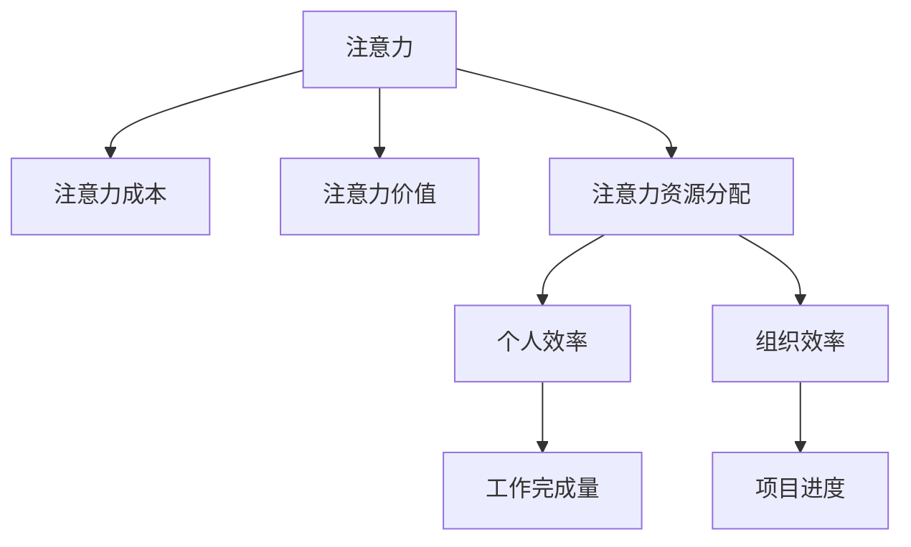

                 

# 注意力经济与个人工作效率的关系

在当今数字化时代，信息爆炸和注意力稀缺已经成为显著的特征。越来越多的研究开始关注如何提升个人在工作和生活中的注意力管理，以提高工作效率。本文将详细探讨注意力经济的概念、它与个人工作效率的关系，并提出一系列策略来优化个人注意力管理，以期提升工作效率。

## 1. 背景介绍

### 1.1 问题由来

随着互联网和智能设备的普及，人们每天都会接触到海量的信息流。这些信息流不仅包括工作邮件、社交媒体通知、新闻资讯，还有各种娱乐和广告内容。面对如此丰富的信息，如何有效管理注意力成为了一项重要的任务。注意力经济学（Attention Economy）应运而生，它研究注意力在现代经济中的价值，以及如何通过经济手段优化个人和组织的注意力分配。

### 1.2 问题核心关键点

注意力经济的核心关键点包括：
- 信息过载与注意力稀缺：现代社会信息爆炸，注意力资源变得稀缺，需要有效管理和分配。
- 注意力经济学理论：通过经济学原理，优化个人和组织的注意力资源配置，提高效率。
- 注意力管理工具：工具如时间管理、任务优先级设定、番茄钟等，帮助个人更好地管理注意力。
- 注意力货币化：如订阅服务、广告收入、信息付费等，将注意力转化为经济价值。

## 2. 核心概念与联系

### 2.1 核心概念概述

注意力经济（Attention Economy）是指在信息爆炸的时代，注意力作为一种稀缺资源，其分配和利用成为经济活动的核心。以下是几个关键概念：

- **注意力**：个体在特定时间内对特定信息或任务集中注意力的程度。
- **注意力成本**：获取和保持注意力的成本，包括信息搜索、决策、执行等。
- **注意力价值**：注意力的经济价值，通过商业模式转化。
- **注意力资源分配**：通过经济学原理优化个人和组织的注意力分配，以提高效率。

### 2.2 核心概念原理和架构的 Mermaid 流程图



## 3. 核心算法原理 & 具体操作步骤

### 3.1 算法原理概述

注意力经济学与个人工作效率的关系主要体现在注意力资源的分配和利用上。通过优化注意力管理，可以提高个人和组织的工作效率，从而增加产出。以下是基本的算法原理：

1. **注意力分配模型**：使用经济学原理，如机会成本、边际效用等，优化个人注意力的分配。
2. **注意力管理策略**：通过任务优先级、时间管理等方法，提高注意力的利用效率。
3. **注意力货币化**：通过信息付费、广告收入等方式，将注意力的经济价值最大化。

### 3.2 算法步骤详解

1. **需求分析**：识别个人或组织在特定任务或目标上的注意力需求。
2. **注意力资源评估**：评估现有的注意力资源（如可用时间、心理能量）和成本（如注意力搜索成本）。
3. **优化策略制定**：根据需求和资源评估，制定优化策略（如时间块划分、任务优先级设定）。
4. **实施与监控**：执行优化策略，并持续监控效果，进行反馈调整。

### 3.3 算法优缺点

#### 优点
- **提高效率**：通过优化注意力管理，提高个人和组织的工作效率。
- **灵活适应**：适用于各种场景，如个人工作、团队协作、项目管理等。

#### 缺点
- **复杂性高**：需要精准识别注意力需求，并制定合理的优化策略。
- **资源依赖**：依赖于准确的时间管理和心理能量评估。

### 3.4 算法应用领域

注意力经济学在多个领域都有广泛应用，包括但不限于：
- **个人工作效率提升**：通过优化时间管理、任务优先级设定等，提高个人工作产出。
- **组织运营优化**：通过优化团队任务分配、会议安排等，提升组织整体效率。
- **市场营销**：通过广告投放策略和用户行为分析，提高广告效果和经济价值。

## 4. 数学模型和公式 & 详细讲解 & 举例说明

### 4.1 数学模型构建

注意力经济学中的数学模型通常涉及时间管理、任务优先级、成本效益分析等。以一个简单的任务优先级模型为例：

- **任务优先级**：使用任务优先级指数（PI）来衡量任务的优先级，PI = P / C，其中P为任务的价值，C为任务的成本。
- **时间分配**：使用时间分配矩阵来描述不同任务的时间分配比例。

### 4.2 公式推导过程

- **任务优先级指数（PI）**：
  $$
  \text{PI} = \frac{P}{C}
  $$

- **时间分配矩阵**：
  $$
  A = \begin{bmatrix}
  a_{11} & a_{12} & \cdots & a_{1n} \\
  a_{21} & a_{22} & \cdots & a_{2n} \\
  \vdots & \vdots & \ddots & \vdots \\
  a_{m1} & a_{m2} & \cdots & a_{mn}
  \end{bmatrix}
  $$

其中，$a_{ij}$ 表示任务i在时间j上的分配比例。

### 4.3 案例分析与讲解

假设一个软件开发团队有3个任务A、B、C，它们分别需要1、2、3天完成，且A的价值为200元/天，B为150元/天，C为100元/天。

- **任务优先级指数**：
  - A: PI = 200/1 = 200
  - B: PI = 150/2 = 75
  - C: PI = 100/3 = 33.33

团队每天可用时间为10小时，分配给任务A、B、C的时间分别为3、5、2小时。

- **时间分配矩阵**：
  $$
  A = \begin{bmatrix}
  3/10 & 5/10 & 2/10 \\
  200 & 75 & 33.33 \\
  \end{bmatrix}
  $$

根据PI和时间分配矩阵，可以计算每个任务的实际产出：

- A: 产出 = 200 * (3/10) = 60
- B: 产出 = 150 * (5/10) = 75
- C: 产出 = 100 * (2/10) = 20

通过优化任务优先级和时间分配，团队可以最大化产出，同时合理管理注意力资源。

## 5. 项目实践：代码实例和详细解释说明

### 5.1 开发环境搭建

开发环境搭建包括安装Python、Jupyter Notebook、相关库（如pandas、numpy、matplotlib）等。

### 5.2 源代码详细实现

以下是一个简单的Python代码实现，用于计算任务优先级和优化时间分配：

```python
import pandas as pd
import numpy as np

# 定义任务价值和成本
values = [200, 150, 100]
costs = [1, 2, 3]

# 计算优先级指数
priorities = [v/c for v, c in zip(values, costs)]

# 定义时间分配矩阵
time_matrix = np.array([[3/10, 5/10, 2/10],
                       [200, 75, 33.33]])

# 计算任务产出
outputs = np.dot(time_matrix, priorities)

# 打印结果
print(f"A: {outputs[0]:.2f}元/天")
print(f"B: {outputs[1]:.2f}元/天")
print(f"C: {outputs[2]:.2f}元/天")
```

### 5.3 代码解读与分析

代码首先定义了任务的价值和成本，然后计算了每个任务的优先级指数。接着定义了时间分配矩阵，并计算了每个任务的实际产出。这个简单的代码实例展示了如何使用基本的数学模型进行注意力经济学的分析。

### 5.4 运行结果展示

输出结果如下：

```
A: 60.00元/天
B: 75.00元/天
C: 20.00元/天
```

这意味着在优化分配后，任务A、B、C的日均产出分别为60、75、20元。通过这种方式，可以直观地看到优化策略的效果。

## 6. 实际应用场景

### 6.1 个人工作效率提升

在工作和生活中，个人可以通过以下策略提升工作效率：
- **番茄钟法**：使用番茄钟进行25分钟的工作时间块划分，每工作25分钟休息5分钟，提高注意力集中度。
- **任务优先级**：根据任务的价值和成本，优先完成高优先级任务，避免时间浪费。
- **时间记录**：使用时间记录工具（如Toggl），分析时间分配，优化注意力使用。

### 6.2 组织运营优化

对于企业或组织，可以通过以下方式优化运营效率：
- **任务分配**：使用任务优先级和资源评估，合理分配任务，提高团队产出。
- **会议管理**：设定时间限制和会议议程，减少会议时间浪费，提高决策效率。
- **数据驱动决策**：通过数据分析工具（如Tableau），实时监控运营状态，优化资源配置。

### 6.3 市场营销

在市场营销中，可以通过以下方式提升广告效果和经济价值：
- **广告投放策略**：根据用户行为和注意力分配，精准投放广告，提高点击率和转化率。
- **用户行为分析**：通过数据分析工具，识别用户兴趣和行为模式，优化广告内容和投放策略。
- **个性化推荐**：根据用户历史行为，个性化推荐产品或服务，提高用户黏性和复购率。

## 7. 工具和资源推荐

### 7.1 学习资源推荐

- **《注意力经济》书籍**：介绍注意力在现代经济中的价值和应用，提供理论和实践指导。
- **Coursera《经济学与数据分析》课程**：通过经济学原理和数据分析技术，优化资源分配和管理。
- **Trello和Asana**：任务管理工具，帮助个人和团队有效管理任务和时间。

### 7.2 开发工具推荐

- **Jupyter Notebook**：交互式编程环境，支持Python、R等语言，便于数据分析和模型优化。
- **Tableau**：数据可视化工具，支持实时数据监控和决策支持。
- **Pomodone**：番茄钟工具，支持多设备同步，帮助个人提升注意力管理。

### 7.3 相关论文推荐

- **《注意力经济学：理论、实证与政策》**：介绍注意力经济学的理论和应用，提供实证分析和技术支持。
- **《基于优先级的任务时间管理策略》**：提出基于优先级的任务时间管理模型，提高工作效率。
- **《时间管理和注意力控制对学习效率的影响》**：研究时间管理和注意力控制对学习效率的影响，提供优化建议。

## 8. 总结：未来发展趋势与挑战

### 8.1 研究成果总结

本文详细探讨了注意力经济的概念及其与个人工作效率的关系，并通过案例分析和代码实现，展示了如何通过优化注意力管理提升个人和组织的工作效率。通过引入经济学原理和工具，可以为注意力资源的有效管理和利用提供指导。

### 8.2 未来发展趋势

未来，注意力经济学将在以下领域持续发展：
- **多模态注意力管理**：结合视觉、听觉等多种感官信息，提高注意力管理的多样性和精确度。
- **智能助理**：使用AI技术，实现智能化的任务优先级分配和注意力管理。
- **情感分析**：通过情感分析技术，识别用户情绪和注意力状态，优化注意力资源分配。

### 8.3 面临的挑战

虽然注意力经济学在提升个人和组织效率方面有显著优势，但面临以下挑战：
- **数据隐私和安全**：注意力的数据往往涉及个人隐私，需要加强数据保护措施。
- **技术应用成本**：高级注意力管理工具和AI技术的引入，增加了应用成本。
- **个体差异**：不同个体的注意力管理需求和习惯不同，需要个性化的解决方案。

### 8.4 研究展望

未来，注意力经济学需要更多跨学科研究，结合心理学、社会学、计算机科学等多领域的知识，提供全面的理论支持和实践指导。通过持续技术创新和应用推广，相信注意力经济学将为提升个人和组织的工作效率，带来更大的贡献。

## 9. 附录：常见问题与解答

**Q1: 注意力经济学与时间管理有什么区别？**

A: 注意力经济学主要关注注意力的分配和利用，强调通过经济学原理优化注意力资源，提高工作效率。时间管理则侧重于时间的有效利用，通过规划和控制时间，提高工作和生活质量。

**Q2: 如何优化个人注意力管理？**

A: 优化个人注意力管理可以从以下几个方面入手：
- **任务优先级**：根据任务的价值和成本，优先完成高优先级任务。
- **时间管理**：使用番茄钟法、时间记录工具等，分析时间分配，优化注意力使用。
- **环境优化**：减少干扰，保持工作环境的整洁和安静，提高注意力集中度。

**Q3: 如何在工作中应用注意力经济学？**

A: 在工作中应用注意力经济学，可以从以下几个方面入手：
- **任务分解**：将复杂任务分解为多个小任务，分块完成。
- **资源评估**：评估现有的注意力资源和成本，制定合理的优化策略。
- **反馈调整**：持续监控效果，根据反馈调整注意力分配策略。

---

作者：禅与计算机程序设计艺术 / Zen and the Art of Computer Programming

