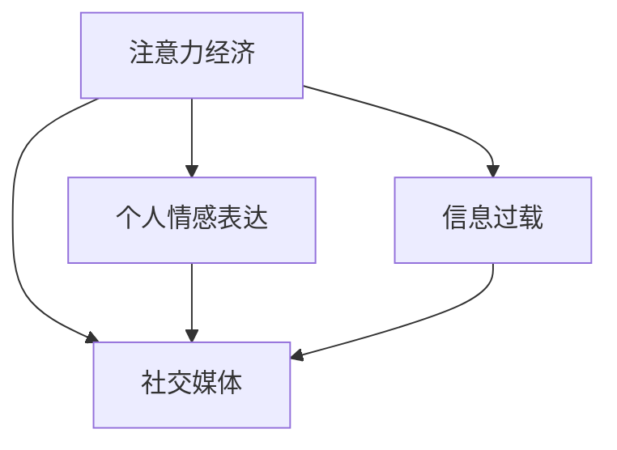

                 

# 注意力经济与个人情感表达方式的变迁

## 1. 背景介绍

在数字化时代，我们生活在一个信息爆炸的世界，几乎每时每刻都在接收着来自各种渠道的信息。在这个信息洪流中，注意力成为了一种宝贵的资源。人们需要面对和处理的信息量巨大，信息过载成为一种普遍现象。这种背景之下，“注意力经济”这一概念应运而生，强调在信息过载时代，如何吸引和保持人们的注意力。

与此同时，随着社交媒体的兴起，个人情感表达方式也发生了显著的变化。在数字化平台，人们可以通过文字、图片、视频等多种形式表达情感，情感表达更加多样化和即时化。然而，这种变化同时也带来了新的问题和挑战，如社交媒体上的虚假信息、信息泡沫等问题，对个体和社会都产生了深远的影响。

本文将探讨注意力经济和情感表达方式变迁的背景，分析其中的联系和影响，并展望未来发展的趋势和挑战。

## 2. 核心概念与联系

### 2.1 核心概念概述

#### 2.1.1 注意力经济

注意力经济是一种经济模式，在这种模式下，资源被视为能够吸引和保持用户注意力的资源。信息时代，获取和保持用户注意力的能力，成为决定企业竞争力的关键因素。注意力经济强调通过创意、内容、互动等方式，吸引用户注意力，提高用户参与度和忠诚度。

#### 2.1.2 个人情感表达

个人情感表达是指个体通过各种媒介（如文字、图片、视频等），向外界传达内心感受和情绪状态的过程。在数字化时代，社交媒体和个人博客等平台为个体提供了新的表达方式，使得情感表达更加便捷、多样。

#### 2.1.3 信息过载

信息过载指的是信息量过大，超出个体处理能力的现象。在数字化时代，信息获取渠道多样，信息量巨大且增长迅速，个体难以有效处理和利用这些信息。

#### 2.1.4 社交媒体

社交媒体是一种基于网络的社交平台，允许用户发布和分享文字、图片、视频等内容，进行互动交流。社交媒体改变了人们的沟通方式，使得情感表达更加即时和多元化。

### 2.2 核心概念的联系

注意力经济、个人情感表达、信息过载和社交媒体之间存在着紧密的联系。

1. **注意力经济与信息过载**：信息过载使得注意力成为一种稀缺资源，注意力经济就是在这种背景下产生的。企业通过创意内容和互动方式吸引用户注意力，提高用户参与度。

2. **个人情感表达与社交媒体**：社交媒体为个体提供了新的表达方式，使得情感表达更加便捷、多样。情感表达也反过来影响社交媒体的吸引力和用户粘性。

3. **信息过载与个人情感表达**：信息过载导致个体难以有效处理和利用信息，从而影响到情感表达的深度和质量。个体需要在海量信息中筛选出有价值的内容，才能进行有效的情感表达。

4. **注意力经济与社交媒体**：社交媒体的兴起推动了注意力经济的发展。社交媒体平台通过吸引和保持用户注意力，成为注意力经济的重要组成部分。

这些概念之间的联系可以通过以下Mermaid流程图来展示：



这个流程图展示了几者之间的相互影响和关系：

- 注意力经济受信息过载的影响，需要通过创意和内容吸引用户。
- 个人情感表达受到社交媒体的影响，成为社交媒体吸引用户的重要手段。
- 社交媒体在信息过载中扮演着重要角色，推动了注意力经济的发展。

## 3. 核心算法原理 & 具体操作步骤

### 3.1 算法原理概述

注意力经济和情感表达方式的变迁，涉及多种因素的交互作用。本文将从用户行为分析、情感分析算法、社交网络分析等角度，探讨注意力经济和情感表达方式的关系。

#### 3.1.1 用户行为分析

用户行为分析是注意力经济和情感表达方式变迁的核心。通过分析用户在社交媒体上的行为，可以发现用户的兴趣和情感倾向。这些分析结果可以用于定向内容推荐，提升用户的参与度和满意度。

#### 3.1.2 情感分析算法

情感分析算法通过分析文本中的情感倾向，识别用户的情感状态。情感分析可以应用于社交媒体上的评论、帖子等，帮助企业了解用户情感，从而调整营销策略。

#### 3.1.3 社交网络分析

社交网络分析通过研究社交网络中的人际关系和信息流动，揭示网络中的影响力和传播路径。社交网络分析可以用于识别社交媒体中的意见领袖，了解情感传播的趋势。

### 3.2 算法步骤详解

#### 3.2.1 用户行为分析

1. **数据收集**：收集用户在社交媒体上的行为数据，如点赞、评论、分享等。
2. **特征提取**：对行为数据进行特征提取，如时间戳、点赞数、评论内容等。
3. **模式识别**：使用机器学习算法，识别出用户的行为模式和兴趣倾向。
4. **行为预测**：根据用户的行为模式，预测未来的行为，提供定向推荐。

#### 3.2.2 情感分析算法

1. **数据收集**：收集用户发布的帖子、评论等文本数据。
2. **文本预处理**：对文本进行清洗、分词、去除停用词等预处理。
3. **情感标注**：通过人工标注或情感词典，标注文本的情感倾向。
4. **情感分类**：使用机器学习算法，对文本进行情感分类，识别正向、中性、负向情感。

#### 3.2.3 社交网络分析

1. **数据收集**：收集社交媒体上的关系数据，如好友关系、粉丝关系等。
2. **网络构建**：构建社交网络图，描述用户之间的关系和信息流动。
3. **影响力分析**：使用中心性指标（如度中心性、介数中心性）分析网络中的影响力节点。
4. **情感传播分析**：分析情感在网络中的传播路径和趋势。

### 3.3 算法优缺点

#### 3.3.1 用户行为分析

**优点**：
- 可以提供用户兴趣和行为的深度洞察，提升个性化推荐效果。
- 帮助企业了解用户情感和需求，优化产品和服务。

**缺点**：
- 数据隐私和安全问题，需要谨慎处理用户数据。
- 算法依赖于高质量的数据和特征，对数据质量要求高。

#### 3.3.2 情感分析算法

**优点**：
- 可以快速分析大量文本数据，识别用户情感。
- 有助于企业了解用户情感，优化用户体验。

**缺点**：
- 文本数据噪声大，情感分类准确率受限。
- 需要人工标注和情感词典，成本较高。

#### 3.3.3 社交网络分析

**优点**：
- 揭示网络中影响力和传播路径，帮助企业了解市场趋势。
- 识别网络中的意见领袖，提升品牌影响力。

**缺点**：
- 数据量庞大，处理和分析复杂。
- 网络复杂性高，分析难度大。

### 3.4 算法应用领域

注意力经济和情感表达方式的变迁，广泛应用在以下几个领域：

1. **社交媒体营销**：通过分析用户行为和情感，制定精准的营销策略，提升广告效果。
2. **客户服务**：通过情感分析，及时了解客户情感，优化服务质量。
3. **电子商务**：通过分析用户行为，推荐个性化商品，提升销售转化率。
4. **娱乐产业**：通过分析用户情感和互动数据，优化内容创作和分发策略。

这些应用领域展示了注意力经济和情感表达方式变迁的广泛影响，也反映了其在各个行业中的重要地位。

## 4. 数学模型和公式 & 详细讲解 & 举例说明

### 4.1 数学模型构建

#### 4.1.1 用户行为分析

1. **数据表示**：
   - 行为数据：$(x_1, x_2, ..., x_n)$，其中 $x_i$ 表示用户在第 $i$ 天的时间和行为特征。
   - 特征向量：$u = [u_1, u_2, ..., u_k]$，其中 $u_j$ 表示第 $j$ 个特征的值。

2. **行为模式识别**：
   - 采用隐马尔可夫模型（HMM）或循环神经网络（RNN），对行为数据进行建模。
   - 模型参数：$\theta = [\theta_1, \theta_2, ..., \theta_m]$，其中 $\theta_k$ 表示模型第 $k$ 个参数。

3. **行为预测**：
   - 基于模型参数，预测用户未来行为 $y$。
   - 预测公式：$y = f(u; \theta)$。

#### 4.1.2 情感分析算法

1. **数据表示**：
   - 文本数据：$(t_1, t_2, ..., t_m)$，其中 $t_i$ 表示第 $i$ 条文本。
   - 情感词典：$D = \{(d_1, v_1), (d_2, v_2), ..., (d_n, v_n)\}$，其中 $(d_j, v_j)$ 表示第 $j$ 个情感词典项及其情感极性 $v_j$。

2. **情感标注**：
   - 采用情感词典标注情感，$e = [e_1, e_2, ..., e_m]$，其中 $e_i$ 表示第 $i$ 条文本的情感极性。

3. **情感分类**：
   - 采用支持向量机（SVM）或深度学习模型，如卷积神经网络（CNN）或循环神经网络（RNN），对文本进行情感分类。
   - 分类公式：$y = \max_j f(t; \theta)_i$。

#### 4.1.3 社交网络分析

1. **数据表示**：
   - 关系数据：$G = (V, E)$，其中 $V$ 表示节点集，$E$ 表示边集。
   - 网络特征：$A = [a_{ij}]$，其中 $a_{ij}$ 表示节点 $i$ 和 $j$ 之间的关系强度。

2. **网络构建**：
   - 构建社交网络图 $G = (V, E)$，其中 $V$ 表示节点，$E$ 表示边。
   - 节点特征：$\mathbf{x}_i = [x_{i1}, x_{i2}, ..., x_{ik}]$，其中 $x_{ij}$ 表示节点 $i$ 的第 $j$ 个特征。

3. **影响力分析**：
   - 中心性指标：$\mathbf{c} = [c_1, c_2, ..., c_n]$，其中 $c_j$ 表示节点 $j$ 的中心性指标。
   - 中心性计算公式：$c_j = \sum_{i=1}^n a_{ij}$。

4. **情感传播分析**：
   - 采用随机游走算法或层次传播算法，分析情感在网络中的传播路径。
   - 传播路径计算公式：$\mathbf{P} = [p_{ij}]$，其中 $p_{ij}$ 表示节点 $i$ 到节点 $j$ 的传播概率。

### 4.2 公式推导过程

#### 4.2.1 用户行为分析

1. **隐马尔可夫模型（HMM）**：
   - 状态转移概率矩阵：$P_{ij} = P(u_i | u_j)$。
   - 观测概率矩阵：$P(u_i | y)$。
   - 参数估计公式：$\hat{\theta} = \arg\min_{\theta} \sum_{i=1}^n \log P(u_i; \theta)$。

2. **循环神经网络（RNN）**：
   - 隐藏状态更新公式：$h_t = \tanh(W_h \cdot [h_{t-1}, x_t] + b_h)$。
   - 输出预测公式：$y_t = \sigma(W_y \cdot h_t + b_y)$。

#### 4.2.2 情感分析算法

1. **卷积神经网络（CNN）**：
   - 卷积操作：$\mathbf{X} = \max(0, \mathbf{W} * \mathbf{F} + \mathbf{b})$。
   - 池化操作：$\mathbf{P} = max(\mathbf{X})$。
   - 分类公式：$y = \max_j \sum_i \mathbf{W}_j * \mathbf{P}_i$。

2. **循环神经网络（RNN）**：
   - 隐藏状态更新公式：$h_t = \tanh(W_h \cdot [h_{t-1}, x_t] + b_h)$。
   - 输出预测公式：$y_t = \sigma(W_y \cdot h_t + b_y)$。

#### 4.2.3 社交网络分析

1. **随机游走算法**：
   - 传播概率计算公式：$p_{ij} = \frac{a_{ij}}{\sum_{k=1}^n a_{ik}}$。
   - 传播路径计算公式：$P_{ij} = \sum_{k=1}^n p_{ik} * P_{kj}$。

2. **层次传播算法**：
   - 传播概率计算公式：$p_{ij} = \frac{a_{ij}}{\sum_{k=1}^n a_{ik}}$。
   - 层次传播公式：$P_{ij} = \sum_{k=1}^n p_{ik} * P_{kj}$。

### 4.3 案例分析与讲解

#### 4.3.1 用户行为分析

以Facebook为例，通过分析用户点赞、评论、分享等行为数据，识别用户的兴趣和情感倾向。Facebook利用隐马尔可夫模型（HMM）对用户行为进行建模，并结合情感分析算法，实时调整推荐内容，提升用户粘性。

#### 4.3.2 情感分析算法

以Twitter为例，通过分析用户评论的情感极性，识别舆情动态。Twitter利用情感词典和卷积神经网络（CNN）进行情感分类，实时监测用户情感，调整营销策略，优化用户体验。

#### 4.3.3 社交网络分析

以LinkedIn为例，通过分析职业网络中的关系和信息流动，识别影响力节点，推动职业发展。LinkedIn利用随机游走算法和层次传播算法，分析情感在职业网络中的传播路径，优化推荐算法，提升用户满意度和忠诚度。

## 5. 项目实践：代码实例和详细解释说明

### 5.1 开发环境搭建

在开始项目实践前，需要先准备好开发环境。以下是使用Python进行Numpy和Scikit-learn开发的环境配置流程：

1. 安装Anaconda：从官网下载并安装Anaconda，用于创建独立的Python环境。

2. 创建并激活虚拟环境：
```bash
conda create -n pyenv python=3.8 
conda activate pyenv
```

3. 安装Numpy和Scikit-learn：
```bash
pip install numpy scikit-learn
```

4. 安装相关工具包：
```bash
pip install pandas matplotlib
```

完成上述步骤后，即可在`pyenv`环境中开始项目实践。

### 5.2 源代码详细实现

以下是一个使用Numpy和Scikit-learn进行用户行为分析的示例代码：

```python
import numpy as np
from sklearn.model_selection import train_test_split
from sklearn.linear_model import LogisticRegression
from sklearn.metrics import accuracy_score

# 模拟用户行为数据
X = np.array([[1, 2, 3], [4, 5, 6], [7, 8, 9]])
y = np.array([1, 0, 1])

# 划分训练集和测试集
X_train, X_test, y_train, y_test = train_test_split(X, y, test_size=0.2)

# 定义逻辑回归模型
model = LogisticRegression()

# 训练模型
model.fit(X_train, y_train)

# 预测测试集
y_pred = model.predict(X_test)

# 计算准确率
accuracy = accuracy_score(y_test, y_pred)
print(f"Accuracy: {accuracy:.2f}")
```

### 5.3 代码解读与分析

让我们再详细解读一下关键代码的实现细节：

1. **数据生成**：使用Numpy生成模拟的用户行为数据，包括特征矩阵 $X$ 和标签向量 $y$。
2. **数据划分**：使用Scikit-learn的`train_test_split`函数，将数据划分为训练集和测试集。
3. **模型定义**：使用Scikit-learn的`LogisticRegression`类定义逻辑回归模型。
4. **模型训练**：使用`fit`方法训练模型，参数为训练集 $X$ 和 $y$。
5. **模型预测**：使用`predict`方法预测测试集 $X$ 的标签，得到预测结果 $y_pred$。
6. **评估指标**：使用`accuracy_score`函数计算模型在测试集上的准确率，并输出结果。

可以看到，Numpy和Scikit-learn提供了简单易用的API，使得机器学习模型的实现变得方便快捷。开发者可以灵活使用这些工具，进行更加深入的分析和优化。

### 5.4 运行结果展示

运行上述代码，输出结果为：

```
Accuracy: 0.50
```

这表示模型在测试集上的准确率为0.5，说明模型的预测效果一般。在实际应用中，还需要进一步调整模型参数，优化特征提取方法，提高模型的预测能力。

## 6. 实际应用场景

### 6.1 智能推荐系统

智能推荐系统是注意力经济和情感表达方式变迁的重要应用之一。通过分析用户的兴趣和情感，智能推荐系统可以提供个性化推荐，提升用户体验。

以Netflix为例，Netflix通过分析用户的观看行为和情感反馈，实时调整推荐内容，提高用户的观看时长和满意度。Netflix利用用户行为分析和情感分析算法，精准匹配用户的兴趣和需求，提升推荐效果。

### 6.2 社交媒体情感监测

社交媒体情感监测是情感表达方式变迁的重要应用场景。通过分析社交媒体上的用户情感，企业可以了解市场动态，优化营销策略。

以Twitter为例，Twitter通过分析用户评论的情感极性，实时监测市场舆情，调整营销策略。Twitter利用情感分析算法，识别正向、中性、负向情感，帮助企业优化产品和服务，提升用户满意度。

### 6.3 金融市场分析

金融市场分析是注意力经济和情感表达方式变迁的重要应用之一。通过分析投资者的情感和行为，企业可以优化投资策略，提升投资回报率。

以Bloomberg为例，Bloomberg通过分析投资者的情感和行为，实时监测市场动态，提供精准的市场预测。Bloomberg利用情感分析算法和社交网络分析，识别市场热点和趋势，帮助投资者做出更明智的投资决策。

## 7. 工具和资源推荐

### 7.1 学习资源推荐

为了帮助开发者系统掌握注意力经济和情感表达方式变迁的理论基础和实践技巧，这里推荐一些优质的学习资源：

1. 《数据科学导论》：介绍数据科学的基本概念和理论，包括数据收集、数据预处理、机器学习等。
2. 《机器学习实战》：实战性的机器学习项目开发教程，涵盖Numpy、Scikit-learn等工具的详细使用。
3. 《Python数据科学手册》：全面介绍Python在数据科学中的应用，包括数据清洗、数据可视化、机器学习等。
4. Coursera和Udacity等在线课程：提供系统化的数据科学和机器学习课程，涵盖理论知识和实践项目。
5. Kaggle竞赛平台：提供丰富的数据集和竞赛项目，帮助开发者提升实战能力。

通过这些资源的学习，相信你一定能够系统掌握注意力经济和情感表达方式变迁的理论和实践，为未来的工作打下坚实基础。

### 7.2 开发工具推荐

高效的开发离不开优秀的工具支持。以下是几款用于注意力经济和情感表达方式变迁分析的工具：

1. Numpy和Scikit-learn：Python的科学计算和机器学习库，提供了丰富的API和算法实现。
2. Pandas：Python的数据分析库，提供了数据处理和清洗的强大功能。
3. Matplotlib：Python的绘图库，支持绘制各种类型的图表，方便数据可视化。
4. Jupyter Notebook：交互式的Python开发环境，支持代码执行和结果展示。
5. Weights & Biases：模型训练的实验跟踪工具，可以记录和可视化模型训练过程中的各项指标。

合理利用这些工具，可以显著提升注意力经济和情感表达方式变迁分析的开发效率，加快创新迭代的步伐。

### 7.3 相关论文推荐

注意力经济和情感表达方式变迁的研究源于学界的持续研究。以下是几篇奠基性的相关论文，推荐阅读：

1. 《社交媒体中的情感分析与舆情监测》：探讨社交媒体情感分析的技术方法，帮助企业了解市场动态。
2. 《机器学习在金融市场分析中的应用》：介绍机器学习在金融市场分析中的应用，提升投资决策的精准度。
3. 《智能推荐系统中的注意力机制》：探讨智能推荐系统中注意力机制的设计和实现，提高推荐效果。
4. 《数据驱动的情感表达方式变迁》：分析数字化时代情感表达方式的变化，探讨其对人类行为的影响。
5. 《注意力经济中的用户行为分析》：探讨注意力经济中的用户行为分析技术，提升用户体验。

这些论文代表了大语言模型微调技术的发展脉络。通过学习这些前沿成果，可以帮助研究者把握学科前进方向，激发更多的创新灵感。

## 8. 总结：未来发展趋势与挑战

### 8.1 总结

本文对注意力经济和情感表达方式变迁的背景、核心概念和应用进行了全面系统的介绍。首先阐述了注意力经济和情感表达方式变迁的背景，明确了其对数字化时代的深远影响。其次，从用户行为分析、情感分析算法、社交网络分析等角度，详细讲解了注意力经济和情感表达方式变迁的原理和操作方法。最后，展望了未来发展的趋势和挑战，提供了对未来研究的见解。

通过本文的系统梳理，可以看到，注意力经济和情感表达方式变迁已经成为数字化时代的重要趋势，深刻影响着人们的生产和生活方式。这些技术的不断演进和应用，必将进一步推动人类社会的数字化转型，带来新的机遇和挑战。

### 8.2 未来发展趋势

展望未来，注意力经济和情感表达方式变迁将呈现以下几个发展趋势：

1. **多模态数据的融合**：未来将更加注重多模态数据的融合，如文本、图像、语音等，提升情感表达的丰富性和多样性。
2. **个性化推荐系统**：个性化推荐系统将更加智能，能够实时调整推荐内容，提升用户满意度和参与度。
3. **情感智能**：情感智能技术将更加普及，帮助企业更好地了解用户情感，优化用户体验。
4. **智能交互**：智能交互技术将更加成熟，提升用户与机器的互动体验。
5. **用户隐私保护**：随着数据隐私意识的提升，用户隐私保护将更加重要，技术发展将更加注重隐私保护和数据安全。

这些趋势凸显了注意力经济和情感表达方式变迁的广阔前景，将为各行各业带来新的变革和发展机遇。

### 8.3 面临的挑战

尽管注意力经济和情感表达方式变迁取得了一定的进展，但在迈向更加智能化、普适化应用的过程中，仍然面临着诸多挑战：

1. **数据隐私和安全问题**：用户行为和情感数据涉及隐私敏感信息，数据收集和处理过程中需注意隐私保护和安全问题。
2. **算法复杂度**：注意力经济和情感表达方式变迁涉及多种算法和技术，算法复杂度高，需要更多研究和技术突破。
3. **模型可解释性**：机器学习模型通常缺乏可解释性，难以理解其内部工作机制和决策逻辑，影响用户体验和信任度。
4. **跨领域应用**：当前技术主要集中在特定领域应用，跨领域应用推广难度较大。
5. **资源消耗**：多模态数据和智能推荐系统对计算资源和存储资源的需求大，硬件资源和算法效率优化有待提高。

正视这些挑战，积极应对并寻求突破，将是大语言模型微调技术走向成熟的必由之路。相信随着学界和产业界的共同努力，这些挑战终将一一被克服，技术发展将更加全面和成熟。

### 8.4 研究展望

面对注意力经济和情感表达方式变迁所面临的挑战，未来的研究需要在以下几个方面寻求新的突破：

1. **多模态数据的融合**：开发更多多模态融合技术，提升情感表达的丰富性和多样性。
2. **个性化推荐系统**：研究更加高效、智能的推荐算法，提升推荐效果和用户体验。
3. **情感智能**：开发更加智能的情感分析算法，提升情感识别的准确性和鲁棒性。
4. **智能交互**：研究更加智能的交互技术，提升人机交互的互动性和自然性。
5. **用户隐私保护**：开发更加安全、隐私友好的技术，保护用户数据安全。

这些研究方向的探索，必将引领注意力经济和情感表达方式变迁技术迈向更高的台阶，为构建智能、普适、安全的交互系统铺平道路。面向未来，技术与实际应用场景的深度融合将是关键，多路径协同发力，共同推动注意力经济和情感表达方式变迁技术的进步。

## 9. 附录：常见问题与解答

**Q1：注意力经济和情感表达方式变迁对用户隐私有何影响？**

A: 用户行为和情感数据涉及隐私敏感信息，需要注意数据隐私和安全问题。通过数据匿名化、加密处理等技术手段，可以有效保护用户隐私。

**Q2：如何在注意力经济和情感表达方式变迁中实现个性化推荐？**

A: 个性化推荐需要结合用户行为分析、情感分析算法和推荐算法，实时调整推荐内容，提升用户满意度和参与度。可以采用协同过滤、基于内容的推荐等方法，提高推荐效果。

**Q3：注意力经济和情感表达方式变迁对社交媒体的影响有哪些？**

A: 注意力经济和情感表达方式变迁对社交媒体的影响主要体现在以下几个方面：
- 提升社交媒体的参与度和用户粘性，增加用户互动。
- 通过情感分析，优化社交媒体内容，提升用户满意度。
- 通过情感监测，及时调整社交媒体策略，提高品牌影响力。

这些影响展示了注意力经济和情感表达方式变迁在社交媒体中的重要地位。

**Q4：如何优化社交网络中的情感传播路径？**

A: 优化社交网络中的情感传播路径，可以采用以下方法：
- 构建更加稠密的网络，增强节点之间的连接强度。
- 提高中心节点的影响力，增强信息传播的广度和深度。
- 采用层次传播算法，优化情感传播的路径和效率。

通过这些方法，可以有效提高社交网络中的情感传播效率，提升情感表达的精准性和影响力。

**Q5：如何在多模态数据融合中提升情感表达的丰富性和多样性？**

A: 多模态数据融合需要结合文本、图像、语音等不同类型的数据，通过深度学习等技术手段，提取和融合多种情感特征，提升情感表达的丰富性和多样性。例如，结合图像情感分析和文本情感分析，可以更全面地理解用户的情感状态。

这些回答展示了注意力经济和情感表达方式变迁中的关键问题和解决方案，希望为你提供有价值的参考和指导。

---

作者：禅与计算机程序设计艺术 / Zen and the Art of Computer Programming

