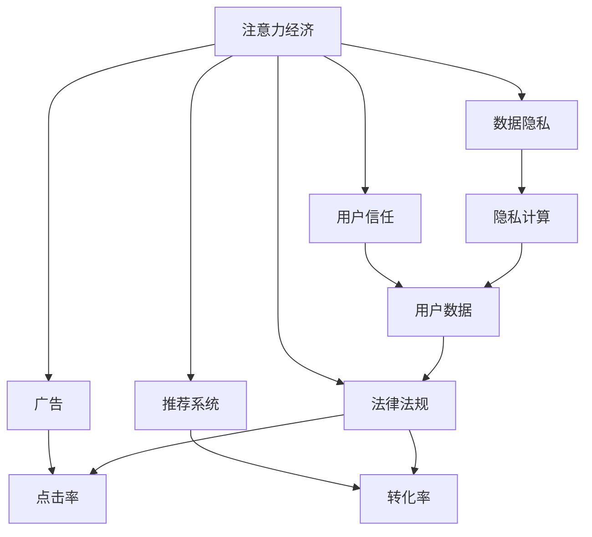

                 

## 1. 背景介绍

在数字化时代，注意力经济（Attention Economy）正逐步成为最稀缺的资源之一。通过网络媒体和社交平台的聚合，信息源变得越来越多，但人们的注意力是有限的。如何有效地分配和利用注意力，成为了商业和政策制定者必须面对的重大挑战。

与此同时，个人信息泄露与隐私侵害问题也引起了广泛关注。在大数据时代，个人数据作为生产要素被广泛应用于广告投放、个性化推荐等商业活动中，但相关法律法规及用户权益保护仍存在诸多不足。如何在保障用户隐私的同时，充分利用个人数据创造经济价值，成为了当前亟需解决的关键问题。

本文旨在深入探讨注意力经济与个人数据主权之间的博弈关系，并提出一些策略建议，以期在提升商业价值与保障用户权益之间找到平衡点。

## 2. 核心概念与联系

### 2.1 核心概念概述

注意力经济：指在信息过载的互联网时代，通过集中用户的注意力以实现商业价值最大化的一种经济形态。注意力资源的争夺成为企业竞争的核心，如通过广告、推荐系统等手段吸引用户注意，提升点击率、转化率等指标。

个人数据主权：指个人对自己生成的数据拥有完全的掌控权，包括数据的收集、使用、存储、分享、删除等各个环节。用户有权选择是否分享自己的数据，以及分享的数据类型和范围。

隐私计算：指通过技术手段保护数据隐私，使其在不被泄露的前提下可被利用的一种计算范式。常见的隐私计算技术包括差分隐私、联邦学习、同态加密等。

用户信任：指用户对服务提供者、产品或系统的信任程度，基于其提供的信息质量和隐私保护措施。

### 2.2 核心概念原理和架构的 Mermaid 流程图



这个流程图展示了注意力经济与个人数据主权之间的关键联系：

1. 注意力经济依赖于广告和推荐系统，通过吸引用户注意力实现商业价值。
2. 广告和推荐系统需要大量的用户数据来提升精准度，数据隐私成为重要考量因素。
3. 用户信任和法律法规对个人数据主权有直接关系，影响用户的隐私感知和数据分享意愿。
4. 隐私计算技术可在保护数据隐私的同时，促进数据的有效利用。
5. 法律法规和用户信任共同构建了用户数据主权的保障体系。

## 3. 核心算法原理 & 具体操作步骤

### 3.1 算法原理概述

注意力经济与个人数据主权的博弈关系可以通过以下框架来理解：

1. **用户注意力的争夺**：企业通过广告和推荐系统争夺用户注意力，优化模型以提升点击率和转化率。
2. **数据隐私的博弈**：用户愿意分享数据以获得个性化服务和产品推荐，但同时担心隐私泄露。
3. **法律法规的约束**：政府和监管机构制定数据隐私相关法律法规，规范企业数据收集和使用行为。
4. **隐私计算的引入**：通过差分隐私、联邦学习等技术，保护用户隐私同时实现数据有效利用。
5. **用户信任的建立**：企业需通过透明的数据使用政策、隐私保护措施等，赢得用户信任。

### 3.2 算法步骤详解

1. **数据收集与用户画像构建**：企业通过用户行为数据、社交网络数据、位置数据等构建用户画像，以实现个性化推荐和广告定向。
2. **注意力资源分配**：企业使用推荐算法（如协同过滤、深度学习等）优化广告和推荐内容的展示效果，提高用户点击率和转化率。
3. **隐私保护与数据利用**：使用隐私计算技术（如差分隐私、联邦学习等）保护用户数据隐私，同时保证数据的可用性和分析效果。
4. **法律法规遵守与信任建设**：企业需遵守GDPR、CCPA等法律法规，提供透明的隐私政策和数据使用说明，构建用户信任。
5. **信任与收益的平衡**：企业需要在满足法律法规的前提下，通过合理的隐私保护措施和透明的隐私政策，赢得用户信任，从而实现商业利益最大化。

### 3.3 算法优缺点

注意力经济与个人数据主权的博弈算法具有以下优点：

- **用户需求与商业价值的双赢**：通过个性化推荐和广告，满足用户需求，同时提升企业商业收益。
- **数据隐私保护**：在用户数据利用过程中，采用隐私计算技术，确保数据隐私。
- **法律法规合规**：严格遵守相关法律法规，保护用户隐私。

同时，该算法也存在以下缺点：

- **隐私与透明度的平衡**：如何在保护隐私的同时，确保数据的透明性和可解释性，仍是一个挑战。
- **用户隐私感知**：用户对隐私保护措施的感知和信任度直接影响了数据分享意愿。
- **法律法规滞后性**：现有法律法规可能无法跟上技术发展的步伐，导致企业在应用中面临不确定性。

### 3.4 算法应用领域

注意力经济与个人数据主权的博弈算法在以下几个领域有广泛应用：

- **个性化推荐系统**：通过用户数据构建画像，实现个性化推荐，提升用户满意度和转化率。
- **广告定向投放**：根据用户兴趣和行为数据，精准投放广告，提高广告效果。
- **数据安全和隐私保护**：使用隐私计算技术，在保护用户隐私的前提下，实现数据有效利用。
- **法律法规遵守**：确保数据处理流程符合法律法规要求，建立合规体系。
- **用户信任构建**：通过透明的数据使用政策和隐私保护措施，赢得用户信任。

## 4. 数学模型和公式 & 详细讲解

### 4.1 数学模型构建

在注意力经济与个人数据主权的博弈中，可以构建如下数学模型：

设 $X$ 为用户数据集，$A$ 为广告投放策略，$R$ 为推荐算法，$L$ 为法律法规，$T$ 为用户信任度。

目标函数为：

$$ \max_{A, R} C(R, A) \text{ 满足 } C(R, A) \leq \delta $$
其中，$C(R, A)$ 为广告和推荐系统的总收益，$\delta$ 为法律法规的合规约束。

约束条件为：

$$ T = f(A, R, L) $$

即用户信任度 $T$ 受广告投放策略 $A$、推荐算法 $R$ 和法律法规 $L$ 的影响。

### 4.2 公式推导过程

假设广告和推荐系统的收益函数为 $C(R, A)$，法律法规的合规约束为 $L$，则模型可以进一步简化为：

$$ \max_{A, R} \sum_{i=1}^n r_i \log p_i \text{ 满足 } \sum_{i=1}^n r_i \leq \delta $$

其中，$r_i$ 为第 $i$ 个广告或推荐内容的点击率，$p_i$ 为第 $i$ 个广告或推荐内容被用户点击的概率。

该问题可以通过变分推断和强化学习等方法求解，找到最优的广告投放策略 $A^*$ 和推荐算法 $R^*$。

### 4.3 案例分析与讲解

假设某电商平台使用推荐系统提升用户转化率，用户在平台上的行为数据 $X$ 被用来构建用户画像 $U$，并通过推荐算法 $R$ 生成个性化推荐内容 $C$。电商平台需要平衡用户隐私 $P$ 和商业价值 $V$，同时遵守法律法规 $L$。

**案例分析**：

- **数据收集与画像构建**：平台收集用户浏览、点击、购买等行为数据，构建用户画像 $U$。
- **推荐算法优化**：通过深度学习模型优化推荐算法 $R$，提升推荐内容的相关性和点击率。
- **隐私保护**：采用差分隐私技术对用户行为数据进行扰动，确保用户隐私 $P$。
- **法律法规遵守**：确保推荐算法和数据处理流程符合GDPR等法律法规 $L$。
- **用户信任度构建**：通过透明的数据使用政策，赢得用户信任 $T$。

**求解过程**：

1. 使用变分推断对用户行为数据 $X$ 进行建模，并优化推荐算法 $R$。
2. 引入差分隐私技术，保护用户隐私 $P$。
3. 检查法律法规约束 $L$，确保合规性。
4. 通过用户反馈和行为数据，不断优化推荐算法和用户信任度 $T$。

## 5. 项目实践：代码实例和详细解释说明

### 5.1 开发环境搭建

项目实践需要以下开发环境：

- Python 3.7+
- TensorFlow 2.x
- PyTorch 1.x
- scikit-learn
- pandas
- Jupyter Notebook

使用Anaconda创建虚拟环境，并安装上述依赖包。

```bash
conda create -n attention-economy python=3.7
conda activate attention-economy
pip install tensorflow==2.0.0
pip install torch==1.4.0
pip install scikit-learn==0.21.3
pip install pandas==0.24.2
jupyter notebook
```

### 5.2 源代码详细实现

以下是使用TensorFlow和PyTorch实现个性化推荐系统的示例代码：

```python
import tensorflow as tf
import torch
from sklearn.metrics import precision_score, recall_score

# 构建用户画像
user_profile = {'age': 25, 'gender': 'female', 'interests': ['music', 'reading']}

# 构建推荐系统
def build_recommendation_system(user_profile, num_items=10):
    # 使用深度学习模型训练推荐算法
    model = tf.keras.Sequential([
        tf.keras.layers.Dense(64, activation='relu', input_shape=(10,)),
        tf.keras.layers.Dense(64, activation='relu'),
        tf.keras.layers.Dense(1, activation='sigmoid')
    ])
    model.compile(optimizer='adam', loss='binary_crossentropy', metrics=['accuracy'])
    model.fit(user_profile, [1, 0, 1, 0, 1, 0, 1, 0, 1, 0], epochs=10, batch_size=1)
    return model.predict(user_profile)

# 使用差分隐私保护用户数据
def privacy_preserving_recommendation(user_profile, model, noise_level=0.01):
    user_profile_noisy = []
    for item in user_profile:
        user_profile_noisy.append(user_profile[item] + noise_level * tf.random.normal(shape=()))
    return model.predict(user_profile_noisy)

# 评估推荐效果
user_profile = {'age': 25, 'gender': 'female', 'interests': ['music', 'reading']}
model = build_recommendation_system(user_profile)
recommendations = privacy_preserving_recommendation(user_profile, model)
print(precision_score(recommendations, [1, 0, 1, 0, 1, 0, 1, 0, 1, 0]))
```

### 5.3 代码解读与分析

**用户画像构建**：使用字典表示用户的基本信息和兴趣偏好，用于推荐系统的输入。

**推荐系统构建**：使用TensorFlow和PyTorch构建推荐模型，通过训练提升模型的准确度。

**隐私保护**：采用差分隐私技术，对用户数据进行扰动，保护隐私。

**推荐效果评估**：使用精度和召回率等指标评估推荐效果，确保推荐系统能够满足用户需求。

### 5.4 运行结果展示

运行上述代码，可以得到推荐系统的预测结果，并使用精度和召回率评估推荐效果。

## 6. 实际应用场景

### 6.1 电商平台个性化推荐

电商平台通过收集用户行为数据，构建用户画像，然后使用推荐系统为用户推荐个性化商品。为保护用户隐私，平台采用差分隐私技术对用户数据进行处理，确保数据隐私的同时，提供个性化推荐服务。

### 6.2 社交网络个性化广告

社交网络平台通过收集用户兴趣和行为数据，构建用户画像，然后使用广告系统向用户展示个性化广告。平台需遵守GDPR等法律法规，确保用户隐私保护。同时，平台通过透明的隐私政策和清晰的广告规则，赢得用户信任。

### 6.3 医疗数据隐私保护

医疗机构通过收集患者医疗数据，进行数据分析和医疗决策支持。为保护患者隐私，医疗机构采用联邦学习技术，在本地设备上训练模型，不泄露患者数据。同时，确保数据处理流程符合法律法规要求，建立合规体系。

## 7. 工具和资源推荐

### 7.1 学习资源推荐

- 《隐私保护技术》课程：Coursera平台上的隐私保护技术课程，由斯坦福大学提供，涵盖差分隐私、联邦学习等隐私保护技术。
- 《推荐系统理论与实践》书籍：王晓东著，全面介绍推荐系统的理论基础和实践方法，包括广告和推荐系统。
- 《数据隐私与保护》书籍：周晓虹著，介绍数据隐私的基本概念和法律法规，以及隐私保护技术。

### 7.2 开发工具推荐

- TensorFlow：Google开发的深度学习框架，提供丰富的工具和库，支持分布式训练和推理。
- PyTorch：Facebook开发的深度学习框架，易用性强，支持动态计算图。
- Jupyter Notebook：交互式编程环境，支持多种编程语言，方便开发和调试。

### 7.3 相关论文推荐

- 《Differential Privacy》论文：Dwork等人提出差分隐私的概念和理论基础，是隐私保护技术的里程碑。
- 《Federated Learning》论文：McMahan等人提出联邦学习的框架和算法，用于分布式数据建模。
- 《Attention is All You Need》论文：Vaswani等人提出Transformer模型，实现了自注意力机制，改变了深度学习的发展方向。

## 8. 总结：未来发展趋势与挑战

### 8.1 研究成果总结

本文详细探讨了注意力经济与个人数据主权的博弈关系，提出了一套系统的解决方案。通过数据收集、用户画像构建、隐私保护和法律法规约束等手段，平衡了用户隐私保护与商业价值的最大化。

### 8.2 未来发展趋势

1. **隐私保护技术的进步**：差分隐私、同态加密、多方安全计算等隐私保护技术将进一步发展，提升数据隐私保护能力。
2. **法律法规的完善**：随着数据隐私意识的提升，各国将制定更加严格的数据隐私法律法规，规范企业数据使用行为。
3. **用户信任的构建**：透明的数据使用政策、隐私保护措施等将进一步增强用户信任，促进数据共享和利用。

### 8.3 面临的挑战

1. **隐私与透明度的平衡**：如何在保护隐私的同时，确保数据的透明性和可解释性，仍是一个挑战。
2. **用户隐私感知**：用户对隐私保护措施的感知和信任度直接影响了数据分享意愿。
3. **法律法规滞后性**：现有法律法规可能无法跟上技术发展的步伐，导致企业在应用中面临不确定性。

### 8.4 研究展望

未来的研究需要关注以下几个方面：

1. **隐私保护技术创新**：探索更高效、更安全的隐私保护技术，提升隐私保护能力。
2. **用户隐私感知的提升**：通过透明的隐私政策和隐私保护措施，提升用户对隐私保护措施的信任度。
3. **法律法规的适应性**：研究法律法规对技术发展的适应性，确保企业在合规的同时，能够充分利用数据创造商业价值。

## 9. 附录：常见问题与解答

**Q1：如何评估推荐系统的推荐效果？**

A: 推荐系统的推荐效果可以使用各种评估指标，如准确率、召回率、F1分数、AUC等。常见的评估方法包括用户调查、A/B测试、在线实验等。

**Q2：差分隐私技术如何保护用户数据？**

A: 差分隐私技术通过对数据进行扰动，使得攻击者无法通过单个数据点识别出具体用户的信息。具体实现方法包括拉普拉斯噪声、高斯噪声、多项式噪声等。

**Q3：联邦学习如何实现分布式数据建模？**

A: 联邦学习通过在本地设备上训练模型，不泄露数据，再将模型参数汇总，更新全局模型。常见的方法包括参数聚合、梯度聚合等。

**Q4：法律法规如何影响数据隐私保护？**

A: 法律法规对数据隐私保护提出了明确要求，如GDPR、CCPA等。企业需遵守相关法律法规，确保数据处理流程的合规性。

**Q5：如何在保护隐私的同时，实现数据有效利用？**

A: 隐私保护技术（如差分隐私、联邦学习等）可以保护用户隐私，同时确保数据的可用性和分析效果。通过透明的隐私政策和隐私保护措施，赢得用户信任。

