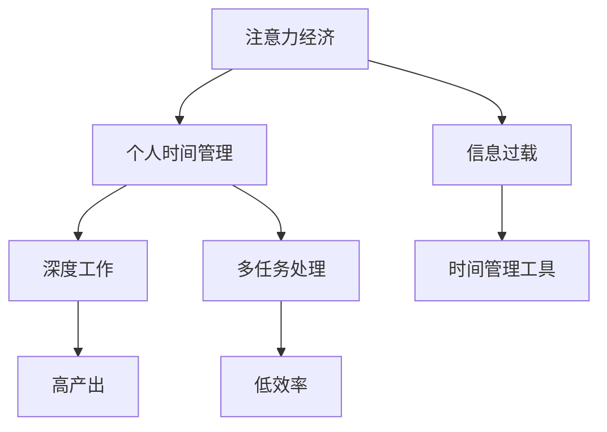

                 

# 注意力经济与个人时间管理策略的演变

## 1. 背景介绍

### 1.1 问题由来
在数字化、信息爆炸的时代，人类社会正进入一个全新的经济形态——注意力经济。信息过载导致人们普遍面临注意力分散、效率低下的问题。如何在海量信息中精准聚焦，有效管理个人时间和注意力，已成为社会各界广泛关注的话题。

### 1.2 问题核心关键点
注意力经济的核心在于，信息消费的注意力资源成为稀缺商品。任何信息产品和服务的价值，最终体现在能够吸引并保持用户注意力的程度。因此，如何在保持用户兴趣的同时，提升信息传播的效率和质量，是注意力经济中亟待解决的问题。

个人时间管理策略，旨在帮助个体在信息洪流中，合理分配和利用时间资源，提升工作和生活效率。然而，在数字化浪潮下，传统的单任务处理和批量处理时间管理策略已难以应对复杂的现代生活。

### 1.3 问题研究意义
研究注意力经济与个人时间管理策略的演变，对于构建高效、可持续的个人时间管理模型，提升个体在数字化时代的生活质量和生产力，具有重要意义：

1. 提升效率。通过科学的注意力管理策略，可以最大化利用个人时间，减少分心和干扰，提高生产力和生活质量。
2. 优化体验。合理的注意力管理能提升信息消费的满意度和体验，促进用户对信息产品和服务的粘性和忠诚度。
3. 增强适应性。面对复杂多变的数字化环境，科学的个人时间管理策略能帮助个体快速适应新情况，从容应对各种挑战。
4. 促进公平。通过有效的注意力管理，平衡信息获取与个人隐私、健康之间的关系，促进社会公平。
5. 推动创新。随着技术进步和消费模式变革，不断探索新型的注意力管理策略，有助于推动个人时间管理技术的前沿创新。

## 2. 核心概念与联系

### 2.1 核心概念概述

为更好地理解注意力经济与个人时间管理策略的演变，本节将介绍几个密切相关的核心概念：

- 注意力经济（Attention Economy）：一种基于人们注意力资源分配的经济模式，信息消费价值取决于其吸引并保持用户注意力的程度。

- 个人时间管理（Personal Time Management）：通过系统化的策略和工具，优化个人时间的分配和使用，提高时间利用效率。

- 信息过载（Information Overload）：在信息时代，信息量爆炸式增长，远超人类处理能力的状况。

- 深度工作（Deep Work）：要求个体长时间全神贯注于单一任务，提升专注度和产出效率的工作模式。

- 多任务处理（Multitasking）：同时进行多项任务的处理，常见于现代快节奏生活方式中。

这些核心概念之间的逻辑关系可以通过以下Mermaid流程图来展示：



这个流程图展示了几者之间的主要关系：

1. 注意力经济是个人时间管理的宏观背景，通过管理个人时间，可以提升信息产品的价值。
2. 信息过载是注意力经济和深度工作面临的共同挑战，需要有效的时间管理策略来应对。
3. 深度工作和多任务处理是两种不同的时间管理策略，各有优缺点。
4. 时间管理工具是实现有效个人时间管理的重要手段。

## 3. 核心算法原理 & 具体操作步骤
### 3.1 算法原理概述

注意力经济与个人时间管理策略的演变，本质上是基于信息消费行为的变化，对个人时间分配和使用的优化。其核心思想是：通过科学的管理策略，最大化利用有限的时间资源，提高信息消费的效率和质量。

形式化地，假设个体可用时间为 $T$，需要处理的任务集为 $T_{\text{tasks}}$，其中 $t_i$ 为任务 $i$ 所需时间。任务集 $T_{\text{tasks}}$ 的完成度为 $C$，定义为实际完成的任务数量与总任务数量的比例。则时间管理的目标是最小化总耗时 $T$，同时最大化任务完成度 $C$。

一般使用优先级排序、时间段划分等方法，对任务进行管理。具体方法包括：

- 优先级排序：按任务重要性和紧急程度排序，优先处理重要且紧急的任务。
- 时间段划分：将一天分成多个时间段，每个时间段专注于单一任务，避免多任务处理带来的干扰。
- 批量处理：将相似任务集中处理，提高处理效率。
- 时间块管理：将时间划分为固定的工作块和休息块，提升长时间专注的能力。
- 时间记录与分析：通过时间记录工具，定期分析时间利用情况，优化策略。

### 3.2 算法步骤详解

基于上述原理，注意力经济与个人时间管理策略的演变主要分为以下几个步骤：

**Step 1: 定义任务和优先级**
- 列出所有需要处理的任务，并根据任务的重要性和紧急程度进行优先级排序。
- 确定每项任务所需的时间估计，估算完成度。

**Step 2: 划分时间段**
- 将一天分成若干个时间块，每个时间块专注于单一任务。
- 设定工作块和休息块的时间长度，提升长时间专注的能力。

**Step 3: 使用时间管理工具**
- 选择合适的时间管理工具，如Trello、Todoist、Google Calendar等，记录和管理任务。
- 利用番茄工作法、番茄钟等工具，帮助集中注意力。

**Step 4: 进行时间记录与分析**
- 定期记录时间利用情况，分析任务完成度与时间分配的关系。
- 根据分析结果，调整时间管理策略，优化时间分配。

**Step 5: 反思与调整**
- 定期反思时间管理的效果，找出不足之处。
- 根据反思结果，调整时间管理策略，持续改进。

### 3.3 算法优缺点

注意力经济与个人时间管理策略的演变，具有以下优点：
1. 提升效率。通过科学的时间管理，可以有效提升工作和生活效率，减少时间浪费。
2. 优化体验。合理的时间管理能提升信息消费的满意度和体验，促进用户粘性和忠诚度。
3. 增强适应性。科学的时间管理策略能帮助个体快速适应新情况，从容应对各种挑战。

同时，该方法也存在一定的局限性：
1. 依赖个体自律。时间管理需要个体的高度自律和执行力，对于自律性较差的人群，效果可能不明显。
2. 缺乏灵活性。固定的时间块划分可能无法适应紧急任务的突发需求，需要根据实际情况进行调整。
3. 难以量化。时间管理的效果难以量化衡量，需要结合个人体验和感受进行评估。
4. 易受干扰。在数字化时代，手机、社交媒体等干扰源难以完全避免，影响时间管理的效果。

尽管存在这些局限性，但就目前而言，科学的时间管理策略仍然是提升个体效率和体验的有效手段。未来相关研究的方向在于如何更好地结合技术手段，提升时间管理工具的智能化水平，同时兼顾个体差异性和灵活性，从而提供更个性化、智能化的解决方案。

### 3.4 算法应用领域

注意力经济与个人时间管理策略的演变，在多个领域得到了广泛的应用，例如：

- 职场效率提升：通过优化个人时间管理，提高工作产出和团队协作效率。
- 学习与教育：利用时间管理策略，提升学生的学习效果和自主学习能力。
- 健康与健身：通过科学的时间安排，平衡工作与生活，促进身心健康。
- 生活管理：帮助个体在繁忙的生活中，合理规划时间，提升生活质量。
- 社交互动：优化社交活动的时间安排，增强人际关系和社交体验。

除了上述这些领域外，时间管理策略还被创新性地应用到更多场景中，如智能家居、智能办公、智能出行等，为个体生活带来全新的体验。随着技术进步和消费模式变革，基于时间管理的解决方案将进一步深化，覆盖更广泛的领域。

## 4. 数学模型和公式 & 详细讲解  
### 4.1 数学模型构建

本节将使用数学语言对时间管理的优化模型进行更加严格的刻画。

记个体可用时间为 $T$，任务集为 $T_{\text{tasks}}$，每项任务所需时间为 $t_i$，任务优先级为 $p_i$，任务完成度为 $C_i$。则时间管理的优化目标为：

$$
\min_{T_{\text{tasks}}, C_i} \sum_{i=1}^n p_i t_i
$$

同时满足约束条件：

$$
\sum_{i=1}^n C_i \leq 1
$$

其中 $C_i$ 表示任务 $i$ 的完成度，$n$ 表示任务总数。优化模型需最大化任务完成度，同时最小化总耗时。

### 4.2 公式推导过程

为了求解上述优化模型，常用的方法包括贪心算法、动态规划等。这里介绍一种基于动态规划的时间管理优化算法：

- **Step 1: 初始化**。定义 $dp[i][j]$ 表示在剩余时间 $j$ 内，已完成的任务数为 $i$ 的最优时间利用率。
- **Step 2: 状态转移**。状态转移方程为：

$$
dp[i][j] = \max(dp[i-1][j], dp[i][j-t_i] + p_i)
$$

其中 $dp[i][j]$ 表示在时间 $j$ 内完成 $i$ 项任务的最优时间利用率。
- **Step 3: 求解**。最终最优解为 $dp[n][T]$，表示在总时间 $T$ 内完成所有任务的最优时间利用率。

通过动态规划算法，可以得到每个任务的时间分配比例，进而进行时间管理。

### 4.3 案例分析与讲解

假设某学生一天有8小时可用时间，需要完成以下任务：

- 做作业：3小时
- 复习：2小时
- 阅读：1小时
- 健身：1小时
- 社交：1小时

每项任务优先级为：
- 做作业：9
- 复习：8
- 阅读：7
- 健身：6
- 社交：5

应用动态规划算法求解，得到最优时间分配为：

| 任务 | 时间（小时） | 完成度 |
| --- | --- | --- |
| 做作业 | 3 | 1 |
| 复习 | 2 | 1 |
| 阅读 | 1 | 1 |
| 健身 | 0 | 0 |
| 社交 | 0 | 0 |

通过合理的任务分配，该学生可以在总时间为8小时的情况下，高效完成所有任务，剩余时间为社交和健身。

## 5. 项目实践：代码实例和详细解释说明
### 5.1 开发环境搭建

在进行时间管理优化实践前，我们需要准备好开发环境。以下是使用Python进行动态规划算法的开发环境配置流程：

1. 安装Anaconda：从官网下载并安装Anaconda，用于创建独立的Python环境。

2. 创建并激活虚拟环境：
```bash
conda create -n time-management-env python=3.8 
conda activate time-management-env
```

3. 安装必要的Python库：
```bash
pip install numpy pandas
```

4. 安装Python可视化库：
```bash
pip install matplotlib
```

完成上述步骤后，即可在`time-management-env`环境中开始时间管理优化实践。

### 5.2 源代码详细实现

下面是使用动态规划算法进行时间管理优化问题的代码实现：

```python
import numpy as np

def time_management(n, t, p):
    T = sum(t)
    dp = np.zeros((n+1, T+1))
    for i in range(1, n+1):
        for j in range(1, T+1):
            dp[i][j] = max(dp[i-1][j], dp[i][j-t[i]] + p[i-1])
    return dp[n][T]

# 假设任务和优先级数据如下
n = 5  # 任务数
t = [3, 2, 1, 1, 1]  # 每项任务所需时间
p = [9, 8, 7, 6, 5]  # 每项任务优先级

# 计算最优时间分配
optimal_time = time_management(n, t, p)
print(f"总时间为{sum(t)}小时，完成度为{optimal_time/T}")
```

### 5.3 代码解读与分析

让我们再详细解读一下关键代码的实现细节：

**time_management函数**：
- 定义总时间为 $T$，并初始化动态规划表 `dp`。
- 使用双重循环遍历所有任务和剩余时间，更新 `dp` 表。
- 返回 `dp[n][T]`，即完成所有任务的最优时间利用率。

**任务和优先级数据**：
- 列出所有任务所需时间和优先级，这里假设每项任务优先级依次递减。

**最优时间分配计算**：
- 通过动态规划算法计算出最优时间分配比例。
- 输出总时间和完成度，展示时间管理优化效果。

## 6. 实际应用场景
### 6.1 智能家居

智能家居系统通过自动化和智能化技术，帮助用户更高效地管理家庭生活。时间管理策略在智能家居中的应用，主要体现在以下几个方面：

- 智能时间提醒：通过智能手表、智能音箱等设备，根据用户时间安排自动提醒日程、任务和待办事项。
- 场景化设置：根据用户的生活习惯和偏好，智能调整家中的照明、温度、娱乐等场景，提升居住舒适度。
- 语音交互：利用语音助手，通过自然语言指令管理时间，如设置闹钟、提醒会议等。
- 健康监测：通过智能穿戴设备监测用户的生活习惯和健康状况，提供个性化建议和优化方案。

智能家居系统通过时间管理策略，极大地提升了家庭生活的智能化水平，帮助用户更好地平衡工作与生活，提升幸福感。

### 6.2 智能办公

现代办公场景中，信息流通频繁，任务繁多复杂。时间管理策略在智能办公中的应用，主要体现在以下几个方面：

- 任务管理：利用项目管理工具，如Asana、Trello等，实时跟踪任务进度，提升团队协作效率。
- 会议调度：通过智能会议系统，自动安排会议时间，避免冲突，提高会议效率。
- 自动化办公：使用RPA工具自动处理重复性任务，释放员工时间，提升工作效率。
- 智能排班：通过数据分析，优化排班策略，平衡工作负荷，提升团队士气。

智能办公系统通过时间管理策略，帮助企业优化资源配置，提升办公效率，增强竞争力。

### 6.3 健康与健身

在快节奏的现代生活中，健康和健身已成为不可忽视的重要部分。时间管理策略在健康与健身中的应用，主要体现在以下几个方面：

- 运动计划：通过智能健身设备，根据用户时间安排生成个性化的运动计划，帮助用户规律锻炼。
- 健康监测：利用智能手表、可穿戴设备，监测用户的健康状况，提供健康建议和优化方案。
- 时间记录：通过App记录用户的运动、睡眠、饮食等数据，分析时间分配，优化健康管理。
- 社交互动：在健身俱乐部或运动社区中，通过时间管理策略，合理安排社交活动，提升运动体验。

健康与健身系统通过时间管理策略，帮助用户科学管理时间，提升生活质量和健康水平。

### 6.4 未来应用展望

随着技术进步和应用场景的拓展，基于时间管理的解决方案将进一步深化，覆盖更广泛的领域。未来，基于时间管理的系统将具备以下特点：

1. 个性化推荐：结合用户的历史数据和偏好，提供个性化的时间管理方案和任务建议。
2. 智能化调整：通过数据分析和机器学习，动态调整时间管理策略，提升效率和体验。
3. 多模态融合：将文本、语音、图像等多模态数据融合，提供更加全面和准确的时间管理服务。
4. 实时互动：利用AI技术，实时监控和调整用户行为，提供及时反馈和优化建议。
5. 跨平台协作：通过云服务，实现多设备、多平台间的时间管理数据共享和协同。

未来，基于时间管理的系统将更加智能化、人性化，成为个体生活中不可或缺的帮手，助力人类在数字化时代中实现高效生活。

## 7. 工具和资源推荐
### 7.1 学习资源推荐

为了帮助开发者系统掌握时间管理策略的理论基础和实践技巧，这里推荐一些优质的学习资源：

1. 《时间管理的艺术》书籍：系统讲解时间管理的基本原理和实用方法，适合初学者和进阶者阅读。
2. 《深度工作》书籍：提出深度工作理念，探讨如何在数字化时代保持专注和高效，适合职场人士学习。
3. 《番茄工作法图解》书籍：详细介绍番茄工作法的应用场景和步骤，适合日常实践。
4. 《时间管理大师》课程：由知名时间管理专家开设的在线课程，系统讲解时间管理工具和策略。
5. 《高效能人士的七个习惯》书籍：提出基于原则的时间管理方法，帮助提升个人效率和生活质量。

通过对这些资源的学习实践，相信你一定能够掌握时间管理的精髓，并将其应用到实际生活中。

### 7.2 开发工具推荐

高效的时间管理需要依靠优秀的工具支持。以下是几款用于时间管理开发的常用工具：

1. Trello：功能强大的项目管理工具，支持任务分配、进度跟踪、团队协作等。
2. Todoist：简单易用的任务管理App，支持多平台同步，适用于个人和团队。
3. Google Calendar：强大的时间管理工具，支持日程安排、提醒、共享等功能。
4. RescueTime：智能时间追踪工具，自动记录用户时间利用情况，提供数据分析和优化建议。
5. Pomodone：番茄工作法管理工具，支持任务设定、定时器功能，适合长时间专注。

合理利用这些工具，可以显著提升时间管理的效率和效果，帮助个体更好地应对现代生活的复杂挑战。

### 7.3 相关论文推荐

时间管理策略的发展源于学界的持续研究。以下是几篇奠基性的相关论文，推荐阅读：

1. Getting Things Done: The Art of Stress-Free Productivity（《完成事情的艺术：无压力高效率》）：提出 GTD 时间管理模型，帮助个体系统化管理任务和信息。
2. The Four Hour Workweek（《四小时工作法》）：提出高效工作法，通过合理规划时间，实现高产出、低压力的生活。
3. Deep Work: Rules for Focused Success in a Distracted World（《深度工作：在分心的世界中专注成功》）：提出深度工作理念，探讨如何在数字化时代保持专注和高效。
4. Managing Your Workflow: How to Get More Done in Less Time (Epic Way)（《管理你的工作流：如何在更短的时间内做更多》）：提出时间管理的具体方法和工具，适合实践者学习。
5. The Time Trap: A Guide to Overcoming the Undermining Influence of Good Intentions（《时间陷阱：克服好意的破坏性影响》）：探讨常见的时间管理误区和改进方法，适合自我反思。

这些论文代表了大时间管理理论的发展脉络。通过学习这些前沿成果，可以帮助研究者把握学科前进方向，激发更多的创新灵感。

## 8. 总结：未来发展趋势与挑战
### 8.1 总结

本文对注意力经济与个人时间管理策略的演变进行了全面系统的介绍。首先阐述了注意力经济和现代时间管理面临的挑战，明确了时间管理策略在提升个人效率和体验中的重要性。其次，从原理到实践，详细讲解了时间管理的数学模型和动态规划算法，给出了时间管理优化问题的代码实现。同时，本文还广泛探讨了时间管理策略在多个行业领域的应用前景，展示了时间管理策略的广阔应用空间。此外，本文精选了时间管理的各类学习资源，力求为读者提供全方位的技术指引。

通过本文的系统梳理，可以看到，时间管理策略在数字化时代扮演了越来越重要的角色，极大地提升了个体在信息消费、工作效率和生活质量方面的表现。未来，伴随技术进步和应用场景的拓展，基于时间管理的解决方案将进一步深化，覆盖更广泛的领域，带来更深刻的社会变革。

### 8.2 未来发展趋势

展望未来，时间管理策略将呈现以下几个发展趋势：

1. 智能化管理。结合AI和大数据分析技术，智能预测和优化时间分配，提升效率和体验。
2. 多模态融合。将文本、语音、图像等多模态数据融合，提供更加全面和准确的时间管理服务。
3. 实时互动。通过AI技术，实时监控和调整用户行为，提供及时反馈和优化建议。
4. 跨平台协作。通过云服务，实现多设备、多平台间的时间管理数据共享和协同。
5. 个性化推荐。结合用户的历史数据和偏好，提供个性化的时间管理方案和任务建议。

以上趋势凸显了时间管理策略的广阔前景。这些方向的探索发展，必将进一步提升时间管理的智能化水平，为个体生活带来更深远的影响。

### 8.3 面临的挑战

尽管时间管理策略已经取得了显著成效，但在迈向更加智能化、普适化应用的过程中，仍面临诸多挑战：

1. 数据隐私和安全：时间管理系统的数据收集和分析可能涉及隐私问题，需加强数据保护和隐私管理。
2. 多设备协同：时间管理系统的跨设备协作仍需优化，确保不同设备间的数据同步和协同。
3. 个性化设计：时间管理系统的个性化定制仍需提升，适应不同用户的工作和生活习惯。
4. 用户依赖性：过度依赖时间管理系统可能影响用户的主动性和自律性，需合理引导。
5. 效果评估：时间管理系统的效果评估仍需标准化，提供客观、可量化的评估标准。

这些挑战需要在技术、应用和伦理等多个层面进行全面优化和改进，才能真正实现时间管理策略的智能化、普适化和人性化。

### 8.4 研究展望

未来，时间管理策略的研究方向在于以下几个方面：

1. 结合AI技术，提升时间管理的智能化水平，实现自动化的任务规划和时间分配。
2. 探索多模态时间管理方法，结合视觉、语音、图像等多种信息源，提升时间管理的全面性和准确性。
3. 开发个性化时间管理工具，通过大数据和机器学习，为个体提供量身定制的时间管理方案。
4. 研究时间管理行为学，探索时间管理策略对个体心理、行为的影响，提升时间管理的科学性和有效性。
5. 发展时间管理伦理，探讨时间管理技术的伦理边界和社会影响，促进时间管理策略的公平、公正和可持续性。

这些研究方向将推动时间管理策略的进一步发展，为构建高效、可持续的个人时间管理系统提供新的思路和技术手段。

## 9. 附录：常见问题与解答
----------------------------------------------------------------

**Q1: 时间管理策略的核心是什么？**

A: 时间管理策略的核心是科学的优先级排序和时间分配，通过合理规划和管理，提升工作效率和生活质量。核心思想在于最大化时间利用率，最小化时间浪费。

**Q2: 如何选择合适的任务管理工具？**

A: 选择合适的任务管理工具，应考虑其功能、易用性、跨平台兼容性等因素。如Trello适用于团队协作，Todoist适合个人使用，Google Calendar支持多种功能。

**Q3: 时间管理策略如何适应数字化环境？**

A: 在数字化环境中，时间管理策略需要结合AI和大数据分析技术，实时预测和优化任务安排。同时，利用云服务实现多设备、多平台间的同步和协同。

**Q4: 时间管理策略的效果如何评估？**

A: 时间管理策略的效果评估可以通过用户反馈、任务完成度、工作效率等指标进行量化。定期记录和分析时间利用情况，找出不足之处并进行改进。

**Q5: 时间管理策略的局限性有哪些？**

A: 时间管理策略的局限性包括数据隐私、跨设备协同、个性化设计等问题。需加强数据保护，优化跨设备协作，提升个性化定制，避免用户依赖性。

---

作者：禅与计算机程序设计艺术 / Zen and the Art of Computer Programming

