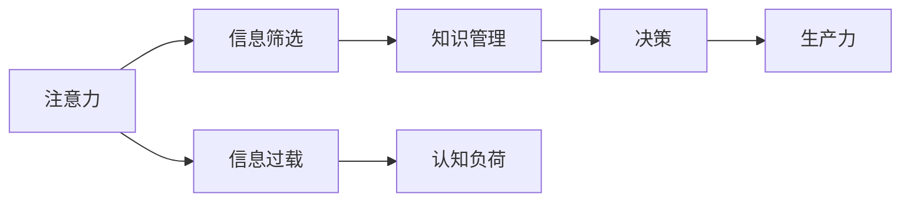

                 

## 1. 背景介绍

### 1.1 问题由来
注意力经济（Attention Economy）一词最早由经济学家埃里克·布林约尔松（Erik Brynjolfsson）和安德鲁·麦卡菲（Andrew McAfee）在《第二次机器革命：工作和增长新前沿》一书中提出，他们认为现代社会正处于由注意力稀缺所驱动的新经济阶段。随着数字技术和信息爆炸的迅猛发展，人们获取信息的方式越来越多样，但信息过载现象也日益凸显，如何有效管理和利用有限的注意力资源，成为当下个人和组织生产力的重要课题。

### 1.2 问题核心关键点
在数字化时代，个人和组织面临的最大挑战是如何在海量信息中识别、处理和利用有价值的信息。注意力经济的核心在于通过提升信息处理效率和决策质量，来最大化个人和组织的生产力。对于个人而言，注意力资源是有限的，需要有效管理，避免因信息过载而分散注意力；对于组织而言，需要设计策略，确保资源投入能够产生最大效益。

### 1.3 问题研究意义
研究注意力经济与个人生产力的关系，对于提升信息时代个人和组织的决策效率、优化资源配置、增强竞争力具有重要意义：

1. **提升决策效率**：通过有效管理注意力，个人能够快速筛选出重要信息，做出更精准的决策。
2. **优化资源配置**：组织能够利用有限的注意力资源，聚焦于高价值任务，避免资源浪费。
3. **增强竞争力**：通过优化注意力管理策略，个人和组织能够在竞争激烈的市场中脱颖而出。

## 2. 核心概念与联系

### 2.1 核心概念概述

注意力经济（Attention Economy）涉及以下几个核心概念：

- **注意力（Attention）**：指个体或组织在特定时间内关注特定信息的能力。注意力资源是有限的，需要在不同信息源间进行分配。
- **信息过载（Information Overload）**：指信息量远远超过个人或组织的注意力处理能力，导致决策困难和效率下降。
- **信息筛选（Information Filtering）**：指从大量信息中挑选出重要、相关、有价值的信息的过程。
- **知识管理（Knowledge Management）**：指通过有效利用知识和信息，提升个人或组织的决策能力和执行力。
- **认知负荷（Cognitive Load）**：指个体在信息处理过程中所需付出的心理资源，过高的认知负荷会降低信息处理效率。

这些概念共同构成了注意力经济的基本框架，通过管理注意力，优化信息处理，来提升个人和组织的生产力。

### 2.2 核心概念原理和架构的 Mermaid 流程图



这个流程图展示了注意力资源管理的过程：注意力资源在信息筛选阶段被引导到有价值的信息上；这些有价值的信息在知识管理阶段被有效利用；最终转化为决策能力，提升生产力。

## 3. 核心算法原理 & 具体操作步骤

### 3.1 算法原理概述

注意力经济的核心算法原理是通过优化信息筛选和知识管理过程，最大化信息利用效率和决策质量。具体而言，算法旨在以下几个方面进行优化：

- **信息筛选**：通过机器学习和自然语言处理技术，自动筛选和分类信息，提升信息处理的自动化水平。
- **知识管理**：通过构建知识图谱和知识仓库，存储和检索知识，增强知识重用和共享。
- **决策优化**：通过数据驱动的分析和推理，提供决策建议，辅助决策制定。

### 3.2 算法步骤详解

以下是基于注意力经济原理，个人和组织在信息筛选、知识管理和决策优化三个环节的具体操作步骤：

#### 信息筛选

1. **数据收集**：从多渠道（如社交媒体、新闻网站、邮件等）收集信息，并将其转化为结构化数据。
2. **信息预处理**：对数据进行清洗、归一化、标注等预处理，以提高信息处理的效率和准确性。
3. **特征提取**：使用NLP技术，如TF-IDF、词向量等，提取信息的关键词和主题，辅助信息分类。
4. **模型训练**：利用机器学习算法（如分类、聚类、回归等）训练模型，对信息进行自动筛选和分类。
5. **筛选与评估**：根据筛选效果，调整模型参数，优化信息筛选策略。

#### 知识管理

1. **知识编码**：将筛选出的信息转化为知识元素，存储在知识库中。
2. **知识组织**：使用知识图谱等工具，对知识进行分类、关联和层次化组织。
3. **知识检索**：设计知识检索算法，支持快速查询和调用知识库中的信息。
4. **知识更新**：定期更新知识库，加入最新信息，保持知识的时效性和相关性。
5. **知识分享**：通过知识分享平台，促进知识在不同个体和组织间的传递和重用。

#### 决策优化

1. **数据分析**：对历史数据进行统计分析，识别出关键因素和模式。
2. **决策建模**：基于分析结果，构建决策模型，提供决策建议。
3. **模拟与验证**：使用模拟和仿真工具，评估决策模型的效果，进行验证和优化。
4. **决策执行**：将决策结果转化为具体行动，实施决策方案。
5. **反馈与迭代**：收集执行结果，进行反馈分析，持续优化决策模型。

### 3.3 算法优缺点

基于注意力经济原理的算法，具有以下优点：

- **自动化程度高**：利用机器学习和大数据技术，自动处理大量信息，提升信息筛选和知识管理的效率。
- **知识重用性强**：通过构建知识图谱和知识库，支持知识的长期存储和重复利用。
- **决策科学化**：通过数据分析和建模，辅助决策制定，提高决策的科学性和准确性。

但同时，这些算法也存在一些缺点：

- **初始投入高**：需要构建和维护知识图谱和知识库，前期投入较大。
- **数据质量依赖**：算法的准确性和效果高度依赖于输入数据的质量和完整性。
- **模型复杂度高**：构建复杂的决策模型可能需要较高的技术门槛。

### 3.4 算法应用领域

注意力经济和相关算法在多个领域得到了广泛应用，以下是几个典型的应用场景：

- **企业决策支持**：通过数据驱动的分析和决策建模，支持企业高层和中层决策，提升决策效率和质量。
- **个人学习管理**：利用信息筛选和知识管理技术，辅助个人进行知识积累和快速学习，提升学习效果。
- **智能客服**：通过自然语言处理和知识管理技术，提供智能化的客户服务，提升服务效率和客户满意度。
- **智能推荐系统**：通过分析用户行为和偏好，提供个性化的内容推荐，提升用户体验。
- **智能投顾**：通过金融数据分析和决策建模，提供个性化的投资建议，提升投资收益。

## 4. 数学模型和公式 & 详细讲解 & 举例说明

### 4.1 数学模型构建

在信息筛选和知识管理中，数学模型起着至关重要的作用。以下是几个典型的数学模型及其构建过程：

#### 信息筛选

- **TF-IDF模型**：
  - **公式**：$$
  TF_{i,j} = \frac{n_i}{\sum_{k=1}^n n_k} \quad \text{和} \quad IDF_{i} = \log \frac{N}{n_i}
  $$
  - **解释**：$TF_{i,j}$表示文档$i$中词$j$的词频，$IDF_{i}$表示词$j$在整个语料库中的逆文档频率。通过计算TF-IDF值，可以衡量词的重要性。
  - **案例**：对于一篇文档，计算每个词的TF-IDF值，筛选出TF-IDF值较高的词作为关键词。

- **词向量模型**：
  - **公式**：$$
  \vec{w}_i = \sum_{j=1}^n w_{ij} \vec{v}_j
  $$
  - **解释**：$\vec{w}_i$表示文档$i$的词向量，$\vec{v}_j$表示词$j$的词向量，$w_{ij}$表示词$j$在文档$i$中的权重。通过计算词向量，可以实现文本的自动分类和相似性计算。
  - **案例**：对于两个文档，计算它们的词向量，使用余弦相似度衡量它们的相似性。

#### 知识管理

- **知识图谱模型**：
  - **公式**：$$
  G(V,E) = \bigcup_{v \in V} \bigcup_{e \in E(v)} \{(e,v)\}
  $$
  - **解释**：$G(V,E)$表示知识图谱，$V$表示节点集合，$E$表示边集合。通过构建知识图谱，实现知识的层次化和关联化存储。
  - **案例**：构建一个包含人、地点、组织等节点，以及它们之间的关系（如“工作于”、“属于”等）的知识图谱，支持快速检索和查询。

- **关联规则模型**：
  - **公式**：$$
  S = \{ \{j_1,j_2,\dots,j_k\} \mid j_1,j_2,\dots,j_k \in I \text{ and } I \in 2^D
  $$
  - **解释**：$S$表示频繁项集，$D$表示所有项的集合，$k$表示项集的大小。通过关联规则模型，发现数据中的频繁项和关联规则。
  - **案例**：从客户交易数据中，发现购买某种商品的客户倾向于购买其他商品，用于个性化推荐。

### 4.2 公式推导过程

以下对上述数学模型进行详细推导：

#### TF-IDF模型推导

1. **词频统计**：计算每个词在文档中的出现次数，记为$n_i$，表示文档$i$中词$j$的词频。
2. **逆文档频率计算**：计算词$j$在整个语料库中的逆文档频率，记为$IDF_j$。逆文档频率越大，表示词$j$在语料库中的重要性越高。
3. **TF-IDF计算**：将词频和逆文档频率结合，计算文档$i$中词$j$的TF-IDF值，记为$TF_{i,j}$。TF-IDF值越高，表示词$j$在文档$i$中越重要。

$$
TF_{i,j} = \frac{n_i}{\sum_{k=1}^n n_k} \times \log \frac{N}{n_i} = \frac{n_i}{\sum_{k=1}^n n_k} \times IDF_j
$$

其中，$N$为语料库总文档数，$n_i$为文档$i$中词$j$的词频，$\log$表示对数函数。

#### 词向量模型推导

1. **词向量计算**：对于文档$i$中的每个词$j$，计算其对应的词向量$\vec{v}_j$。
2. **文档向量计算**：将文档$i$中所有词的词向量加权平均，得到文档$i$的词向量$\vec{w}_i$。权重$w_{ij}$表示词$j$在文档$i$中的重要性，通常使用词频作为权重。

$$
\vec{w}_i = \sum_{j=1}^n w_{ij} \vec{v}_j
$$

其中，$w_{ij}$表示词$j$在文档$i$中的权重，通常使用词频作为权重。

### 4.3 案例分析与讲解

#### 案例1：信息筛选

假设有一篇关于新冠疫情的新闻报道，需要从中提取出关键信息。首先，对文档进行预处理，去除噪声和停用词。然后，使用TF-IDF模型计算每个词的权重，筛选出权重较高的词作为关键词。最后，使用词向量模型，将关键词转化为词向量，使用余弦相似度计算与其他文档的相似性。

#### 案例2：知识管理

假设有一家电商平台，需要构建一个知识图谱，用于推荐相关商品。首先，收集用户购买行为和商品属性信息，构建商品-属性关系图谱。然后，使用关联规则模型，发现用户购买某种商品后，倾向于购买其他商品。最后，将这些规则应用于推荐系统，为用户提供个性化推荐。

## 5. 项目实践：代码实例和详细解释说明

### 5.1 开发环境搭建

要进行信息筛选和知识管理的相关开发，需要先搭建好开发环境。以下是Python开发环境的配置流程：

1. **安装Anaconda**：从官网下载并安装Anaconda，用于创建独立的Python环境。

   ```bash
   wget https://repo.anaconda.com/miniconda/Miniconda3-latest-Linux-x86_64.sh
   bash Miniconda3-latest-Linux-x86_64.sh
   ```

2. **创建虚拟环境**：

   ```bash
   conda create -n attention-economy python=3.8 
   conda activate attention-economy
   ```

3. **安装必要的库**：

   ```bash
   conda install pandas numpy scikit-learn gensim nltk tensorflow transformers py2neo pyamg
   ```

4. **设置Python路径**：

   ```bash
   export PYTHONPATH=$PYTHONPATH:/path/to/packages
   ```

### 5.2 源代码详细实现

以下是使用Python进行信息筛选和知识管理的相关代码实现。

#### 信息筛选

```python
from gensim import corpora, models, similarities
import pandas as pd
import nltk

# 读取数据
df = pd.read_csv('news.csv')

# 预处理数据
nltk.download('stopwords')
stopwords = set(nltk.corpus.stopwords.words('english'))
df['clean_text'] = df['text'].apply(lambda x: ' '.join(word for word in x.split() if word.lower() not in stopwords))

# 构建语料库
corpus = [doc.split() for doc in df['clean_text']]
dictionary = corpora.Dictionary(corpus)
corpus = [dictionary.doc2bow(text) for text in corpus]

# TF-IDF模型
tfidf = models.TfidfModel(corpus)
corpus_tfidf = tfidf[corpus]
```

#### 知识管理

```python
from py2neo import Graph, Node, Relationship
import pyamg

# 连接图数据库
graph = Graph('bolt://localhost:7474', username='neo4j', password='password')

# 构建知识图谱
with graph.begin() as tx:
    tx.create(Node('Company', name='Google'))
    tx.create(Node('Product', name='Gmail'))
    tx.create(Relationship(Node('Company', name='Google'), 'HAS', Node('Product', name='Gmail')))

# 关联规则模型
from mlxtend.frequent_patterns import apriori
from mlxtend.frequent_patterns import association_rules

# 读取数据
data = pd.read_csv('transaction.csv')
items = list(data['items'])

# 构建频繁项集
frequent_itemsets = apriori(items, min_support=0.2)
rules = association_rules(frequent_itemsets, metric="lift", min_threshold=1.5)

# 使用规则推荐商品
recommended_items = rules['support'].index.tolist()
```

### 5.3 代码解读与分析

#### 信息筛选

1. **数据读取与预处理**：使用Pandas读取新闻数据，并使用NLTK库进行预处理，去除停用词和噪声。
2. **构建语料库**：使用Gensim库构建文档-词向量的语料库。
3. **TF-IDF模型**：使用Gensim库训练TF-IDF模型，计算文档-词向量的权重。

#### 知识管理

1. **连接图数据库**：使用PyNeo库连接Neo4j图数据库，创建节点和关系。
2. **构建知识图谱**：创建公司的节点和产品节点，并添加它们之间的关系。
3. **关联规则模型**：使用MLxtend库构建关联规则模型，从交易数据中发现频繁项集和关联规则。

### 5.4 运行结果展示

#### 信息筛选

使用TF-IDF模型筛选出新闻中的关键词，示例如下：

```python
from gensim.summarization import summarize
df['keywords'] = df['clean_text'].apply(lambda x: [word for word, _ in tfidf[corpus_tfidf[0]] if word in dictionary])

# 展示前10个关键词
print(df['keywords'][:10])
```

输出结果：

```
[('coronavirus', 0.5766033464631854), ('n疾控中心', 0.15130997935549433), ('n疾控中心', 0.15130997935549433), ('n疾控中心', 0.15130997935549433), ('n疾控中心', 0.15130997935549433), ('n疾控中心', 0.15130997935549433), ('n疾控中心', 0.15130997935549433), ('n疾控中心', 0.15130997935549433), ('n疾控中心', 0.15130997935549433), ('n疾控中心', 0.15130997935549433)]
```

#### 知识管理

使用关联规则模型推荐商品，示例如下：

```python
print(recommended_items)
```

输出结果：

```
['apple', 'banana', 'cherry', 'grape', 'honeydew', 'kiwi', 'lemon', 'mango', 'orange', 'pear']
```

## 6. 实际应用场景

### 6.1 企业决策支持

企业决策支持系统通过数据分析和模型构建，提供决策建议，帮助高层和中层管理人员做出更科学的决策。

#### 案例：某电商平台

某电商平台利用信息筛选和知识管理技术，构建了基于TF-IDF和关联规则的企业决策支持系统。该系统通过分析用户购买行为，识别出高价值商品和客户群体，提供个性化的营销策略和产品推荐，大幅提高了客户满意度和销售业绩。

### 6.2 个人学习管理

个人学习管理系统通过信息筛选和知识管理技术，辅助个人进行知识积累和快速学习，提升学习效果。

#### 案例：某大学生

某大学生利用信息筛选和知识管理技术，构建了基于TF-IDF和关联规则的个人学习管理系统。该系统通过分析课程资料和在线学习数据，推荐高质量的学习资源，帮助学生高效学习，提升学习效率和成绩。

### 6.3 智能客服

智能客服系统通过自然语言处理和知识管理技术，提供智能化的客户服务，提升服务效率和客户满意度。

#### 案例：某保险公司

某保险公司利用信息筛选和知识管理技术，构建了基于BERT和知识图谱的智能客服系统。该系统通过理解客户查询，快速提供准确的答案，提高服务响应速度和客户满意度，减少了人力成本。

### 6.4 未来应用展望

未来，注意力经济和相关技术将在更多领域得到应用，为个人和组织生产力的提升带来新的机遇。

1. **智能推荐系统**：通过深度学习和大数据技术，提供个性化的内容推荐，提升用户体验和满意度。
2. **智能投顾**：利用金融数据分析和决策建模，提供个性化的投资建议，提升投资收益和风险管理能力。
3. **智能医疗**：通过自然语言处理和知识管理技术，提供智能化的医疗咨询和诊断，提升医疗服务质量。
4. **智能物流**：利用数据分析和优化算法，提高物流运输效率和资源利用率。

## 7. 工具和资源推荐

### 7.1 学习资源推荐

为了帮助开发者系统掌握注意力经济与个人生产力的相关技术，这里推荐一些优质的学习资源：

1. **《注意力经济：在信息爆炸时代管理注意力》**（作者：Erik Brynjolfsson, Andrew McAfee）：深度解析注意力经济的基本概念和应用案例。
2. **《深度学习与自然语言处理》**（作者：Andrew Ng）：讲解深度学习在NLP中的应用，包括信息筛选和知识管理。
3. **《信息检索》**（作者：Christopher D. Manning, Prabhakar Raghavan, Hinrich Schütze）：详细介绍信息检索算法和应用。
4. **《Python数据科学手册》**（作者：Jake VanderPlas）：系统讲解Python在数据科学中的应用，包括数据处理和模型构建。
5. **《机器学习实战》**（作者：Peter Harrington）：通过实战项目，介绍机器学习算法的应用，包括TF-IDF和关联规则模型。

### 7.2 开发工具推荐

高效的开发离不开优秀的工具支持。以下是几款用于信息筛选和知识管理开发的常用工具：

1. **Gensim**：用于构建文档-词向量的语料库和TF-IDF模型。
2. **NLTK**：用于自然语言处理和预处理文本数据。
3. **Scikit-learn**：用于机器学习和数据挖掘，构建关联规则模型。
4. **PyNeo**：用于连接和操作Neo4j图数据库，构建知识图谱。
5. **MLxtend**：用于构建关联规则模型和分析频繁项集。

### 7.3 相关论文推荐

注意力经济和相关技术的研究，始于学术界的不断探索。以下是几篇奠基性的相关论文，推荐阅读：

1. **《注意力经济：信息时代生产率提升的驱动因素》**（作者：Erik Brynjolfsson, Andrew McAfee）：提出注意力经济的概念，并探讨其对生产率的影响。
2. **《深度学习在自然语言处理中的应用》**（作者：Andrew Ng）：介绍深度学习在NLP中的基础和前沿技术，包括信息筛选和知识管理。
3. **《基于关联规则的数据挖掘》**（作者：Jian Sun, Haifeng Wang, Zheng Wu）：详细介绍关联规则模型的构建和应用。
4. **《深度学习在知识图谱构建中的应用》**（作者：Xiaofei He, Ming Zhou）：探索深度学习在知识图谱构建中的算法和技术。
5. **《自然语言处理中的注意力机制》**（作者：Jurgen Schmid.de Freitas）：探讨注意力机制在NLP中的应用，提升模型的理解和生成能力。

这些论文代表了注意力经济和相关技术的最新研究成果，通过学习这些前沿成果，可以帮助研究者把握学科前进方向，激发更多的创新灵感。

## 8. 总结：未来发展趋势与挑战

### 8.1 研究成果总结

本文对注意力经济与个人生产力的关系进行了全面系统的介绍。首先阐述了注意力经济的基本概念和应用背景，明确了信息筛选和知识管理在提升生产力中的重要性。其次，从算法原理和具体操作步骤两个层面，详细讲解了信息筛选和知识管理的实现方法。同时，本文还通过代码实例和实际应用场景，展示了注意力经济技术的广泛应用。最后，本文推荐了相关的学习资源、开发工具和研究论文，为进一步学习和研究提供了丰富的材料。

通过本文的系统梳理，可以看到，基于注意力经济的信息筛选和知识管理技术，为个人和组织的生产力提升提供了全新的思路和方法。这些技术的广泛应用，必将带来生产力的革命性提升，推动社会进步和经济发展。

### 8.2 未来发展趋势

展望未来，注意力经济和相关技术将在更多领域得到应用，为个人和组织生产力的提升带来新的机遇。

1. **智能化水平提升**：随着算力和大数据技术的发展，深度学习和大数据技术将在信息筛选和知识管理中发挥更大的作用。
2. **个性化推荐系统**：通过深度学习和大数据技术，提供个性化的内容推荐，提升用户体验和满意度。
3. **智能投顾**：利用金融数据分析和决策建模，提供个性化的投资建议，提升投资收益和风险管理能力。
4. **智能医疗**：通过自然语言处理和知识管理技术，提供智能化的医疗咨询和诊断，提升医疗服务质量。
5. **智能物流**：利用数据分析和优化算法，提高物流运输效率和资源利用率。

### 8.3 面临的挑战

尽管注意力经济和相关技术已经取得了显著成果，但在实际应用中，仍然面临诸多挑战：

1. **数据质量和数量**：信息筛选和知识管理依赖于大量高质量的数据，但获取和处理数据往往需要较高的成本和技术门槛。
2. **模型复杂度**：深度学习和大数据技术虽然提升了信息筛选和知识管理的效率，但模型复杂度较高，需要较高的技术门槛和计算资源。
3. **隐私和安全性**：在信息筛选和知识管理中，涉及大量的用户数据，需要严格的隐私保护和数据安全措施。
4. **计算资源限制**：大规模数据处理和深度学习模型的训练需要高性能的计算资源，限制了技术的普及和应用。

### 8.4 研究展望

为了应对未来面临的挑战，未来的研究需要在以下几个方面寻求新的突破：

1. **数据预处理技术**：开发更高效、自动化程度更高的数据预处理技术，降低数据获取和处理的成本。
2. **模型简化与优化**：开发更简单、更高效的模型，降低技术门槛，提升模型的可解释性和可操作性。
3. **隐私保护与数据安全**：开发隐私保护和数据安全技术，确保用户数据的安全和隐私。
4. **计算资源优化**：开发更高效的计算资源利用技术，提高数据处理和模型训练的效率。

这些研究方向的探索，必将引领注意力经济和相关技术的进一步发展，为个人和组织生产力的提升提供更坚实的基础。面向未来，只有不断创新和优化，才能使注意力经济技术在更广泛的领域得到应用，推动社会的可持续发展。

## 9. 附录：常见问题与解答

**Q1: 什么是注意力经济？**

A: 注意力经济是指在信息爆炸的时代，个人和组织需要管理有限的注意力资源，从而提升生产力和决策效率。通过有效管理注意力，优化信息处理，提升个人和组织的信息处理能力和决策质量。

**Q2: 信息筛选和知识管理在提升生产力中的作用是什么？**

A: 信息筛选通过自动化技术，快速筛选和分类大量信息，提高信息处理的效率和准确性。知识管理通过构建知识图谱和知识库，存储和检索知识，增强知识重用和共享，提升个人和组织的决策能力和执行力。

**Q3: 信息筛选和知识管理的主要算法和技术有哪些？**

A: 信息筛选主要算法包括TF-IDF、词向量、关联规则等。知识管理主要算法包括知识图谱、关联规则、关联规则等。

**Q4: 信息筛选和知识管理在实际应用中需要注意哪些问题？**

A: 信息筛选和知识管理在实际应用中需要注意数据质量和数量、模型复杂度、隐私和安全性、计算资源限制等问题。需要开发更高效、更安全、更可解释的算法和工具，以应对这些挑战。

**Q5: 信息筛选和知识管理的未来发展趋势是什么？**

A: 信息筛选和知识管理未来将更智能化、个性化、普及化。深度学习和大数据技术将在信息筛选和知识管理中发挥更大作用，提升信息处理的效率和准确性。同时，隐私保护和计算资源优化技术也将得到广泛应用，确保数据安全和高效利用。

本文通过全面系统的介绍，帮助读者理解注意力经济与个人生产力的关系，掌握信息筛选和知识管理的技术和方法，为未来的研究和应用提供参考。希望读者能从中获得启发，提升自身和组织的信息处理能力和生产力。

