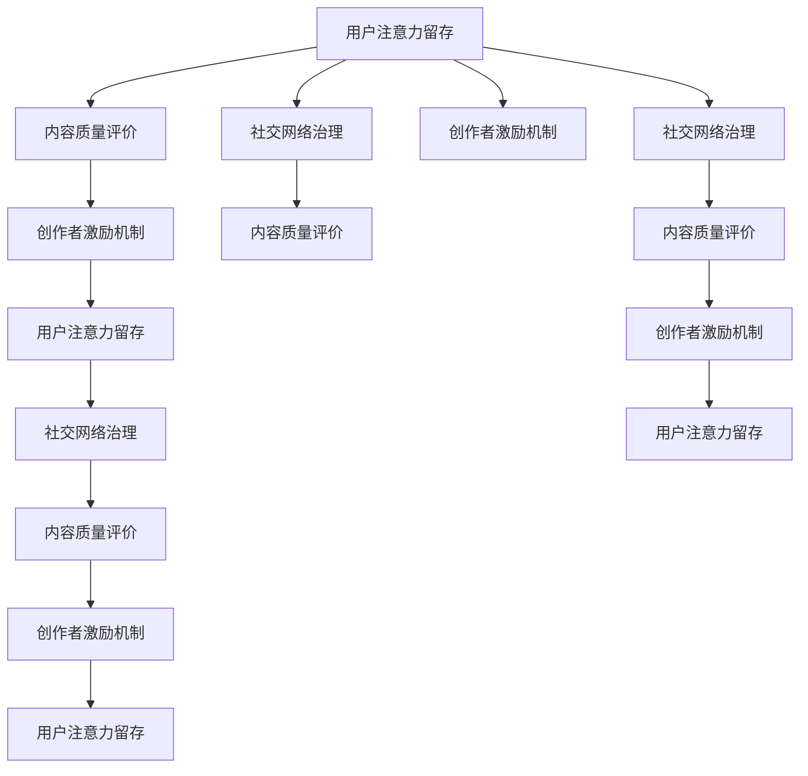

                 

# 注意力经济与个人社交网络的重构

在信息爆炸的时代，如何吸引用户的注意力成为了商家和内容创作者最为关心的问题。随着社交媒体和短视频平台的兴起，个人社交网络也逐渐从熟人圈向公众化转变，注意力经济开始成为新的竞争焦点。本文将探讨注意力经济与个人社交网络之间的关系，并通过算法重构提升用户注意力留存和创作激励，使个人社交网络更加健康和可持续。

## 1. 背景介绍

### 1.1 问题由来

社交媒体的兴起使得个人社交网络从封闭的熟人圈扩展到公众化的社交平台。在抖音、微博、微信公众号等平台，个人的内容创作者需要面对成千上万的观众，如何吸引并留住他们的注意力变得尤为重要。这不仅关系到内容的传播效果，更关系到商业化运营的成功与否。

注意力经济是以注意力为关键资源的经济形态，注意力成为商品被交换、分配和利用。个人社交网络在这一过程中起到了至关重要的作用。但当前社交网络也面临诸多挑战，如信息过载、内容同质化、用户流失等。如何优化社交网络设计，使其更符合用户的注意力需求，成为当前研究的核心问题。

### 1.2 问题核心关键点

本研究的核心在于通过算法重构，提升用户对个人社交内容的关注度和创作激励。主要包括以下几个关键点：

1. **用户注意力留存**：通过优化内容推送算法，提升用户对内容的兴趣和停留时间。
2. **内容质量评价**：通过引入自然语言处理和计算机视觉技术，提升内容质量评价的准确性。
3. **创作者激励机制**：通过合理的激励机制，鼓励更多优质内容创作。
4. **社交网络治理**：通过算法对有害信息、虚假宣传进行甄别和过滤，维护网络健康。

这些核心关键点共同构成了对个人社交网络重构的完整框架，旨在通过算法优化，提升用户与创作者之间的互动质量，促进平台的长期发展。

## 2. 核心概念与联系

### 2.1 核心概念概述

本节将介绍几个关键概念及其相互之间的联系：

- **用户注意力留存**：指用户对内容的关注度和停留时间，是衡量内容影响力的重要指标。
- **内容质量评价**：对内容的语义、创意、创新性等质量维度进行量化评估，衡量内容价值。
- **创作者激励机制**：通过奖励、认证、流量分配等方式，激励内容创作者持续输出高质量内容。
- **社交网络治理**：通过算法对有害信息、虚假宣传等进行甄别和过滤，维护网络秩序和安全。

这些概念通过算法设计进行了有机结合，形成了一个完整的社交网络生态闭环。

### 2.2 核心概念原理和架构的 Mermaid 流程图



这个流程图展示了各个概念之间的相互关系。用户注意力留存和创作者激励机制通过内容质量评价进行连接，而社交网络治理对内容质量评价和创作者激励机制进行监管和优化，共同形成一个良性循环。

## 3. 核心算法原理 & 具体操作步骤

### 3.1 算法原理概述

本节将介绍基于注意力经济的个人社交网络重构算法原理。

**用户注意力留存算法**：通过分析用户行为数据（如点击、停留时间、点赞、评论等），使用协同过滤、基于序列的推荐算法等技术，为用户推荐感兴趣的内容。

**内容质量评价算法**：引入自然语言处理和计算机视觉技术，对内容的语义质量、创新性、创意性等维度进行自动评估。

**创作者激励机制算法**：通过算法对创作者的内容质量、互动性、关注度等维度进行综合评价，并根据评价结果进行流量分配、金钱奖励等激励。

**社交网络治理算法**：通过算法对有害信息、虚假宣传等进行自动甄别和过滤，使用户在健康的网络环境中互动和获取信息。

### 3.2 算法步骤详解

**用户注意力留存算法步骤**：

1. 数据收集：收集用户对内容的点击、停留时间、点赞、评论等行为数据。
2. 用户建模：使用协同过滤算法，建立用户兴趣模型，预测用户对未曝光内容的兴趣。
3. 内容推荐：根据用户模型和内容库，生成推荐列表，展示给用户。
4. 效果评估：实时监控推荐效果，根据点击率、停留时间等指标调整推荐算法。

**内容质量评价算法步骤**：

1. 文本预处理：对内容进行分词、去除停用词等预处理，转换为计算机可处理的格式。
2. 语义建模：使用词嵌入技术（如Word2Vec、GloVe等）建立词向量，捕捉语义关系。
3. 质量计算：根据词向量计算内容的语义质量、创新性、创意性等维度。
4. 评价结果：输出综合评价结果，用于创作者激励和社交网络治理。

**创作者激励机制算法步骤**：

1. 创作者建模：收集创作者的内容质量、互动性、关注度等数据，建立创作者模型。
2. 激励计算：根据创作者模型计算激励值，如流量分配、金钱奖励等。
3. 激励分配：将激励值分配给创作者，并通过用户行为数据进行效果评估。
4. 激励优化：根据效果评估结果，优化创作者激励算法。

**社交网络治理算法步骤**：

1. 有害信息检测：使用NLP技术检测内容中的有害信息，如色情、暴力、虚假宣传等。
2. 信息过滤：将有害信息从内容库中过滤掉，或进行标记和限制传播。
3. 治理效果评估：评估有害信息过滤效果，优化治理算法。
4. 算法改进：根据效果评估结果，改进有害信息检测和过滤算法。

### 3.3 算法优缺点

**用户注意力留存算法**：

- **优点**：能够精准推荐用户感兴趣的内容，提升用户留存率。
- **缺点**：可能引发内容同质化，降低内容多样性。

**内容质量评价算法**：

- **优点**：能够自动评估内容质量，提升创作者创作积极性。
- **缺点**：可能对某些创新性、创意性内容识别不够准确。

**创作者激励机制算法**：

- **优点**：能够激励创作者输出高质量内容，提升平台内容质量。
- **缺点**：可能引发创作者之间的恶性竞争，内容质量下降。

**社交网络治理算法**：

- **优点**：能够维护平台健康，避免有害信息传播。
- **缺点**：可能对用户表达自由造成限制，引发用户不满。

### 3.4 算法应用领域

这些算法可以广泛应用在以下领域：

- **社交媒体平台**：如抖音、微博、微信公众号等，提升用户留存率和内容质量。
- **内容创作平台**：如知乎、豆瓣、小红书等，激励创作者输出高质量内容。
- **电商平台**：如淘宝、京东等，提升商品推荐效果，增强用户互动。
- **新闻媒体平台**：如今日头条、网易新闻等，优化新闻内容推送，提升阅读效果。

## 4. 数学模型和公式 & 详细讲解 & 举例说明

### 4.1 数学模型构建

本节将介绍几个核心算法的数学模型构建。

**用户注意力留存算法**：使用协同过滤算法，构建用户兴趣模型。

假设用户集合为 $U$，内容集合为 $V$，用户对内容的兴趣度用 $r_{ui}$ 表示，其中 $u \in U$，$i \in V$。协同过滤算法通过相似性度量，计算用户 $u$ 和内容 $i$ 的兴趣相似度。设 $S$ 为 $u$ 对内容 $i$ 的兴趣度向量，$W$ 为用户相似矩阵。

$$
S = \alpha_u W^{-1} r
$$

其中 $\alpha_u$ 为归一化因子，保证 $S$ 的归一化。

**内容质量评价算法**：使用情感分析、主题模型等技术，对内容的语义质量进行评价。

假设内容集合为 $V$，内容质量向量为 $Q$。通过情感分析、主题模型等技术，对内容进行语义建模，计算内容的质量得分 $q_i$。

$$
q_i = \sum_{j=1}^n \omega_j f_j(Q_i)
$$

其中 $\omega_j$ 为权重，$f_j$ 为评价函数，$Q_i$ 为内容向量。

**创作者激励机制算法**：使用多维度综合评估模型，对创作者进行激励。

假设创作者集合为 $C$，创作者模型为 $M_c$，激励向量为 $I$。通过内容质量、互动性、关注度等维度，计算创作者的多维度综合评估得分 $m_c$。

$$
m_c = \lambda_1 M_c(Q) + \lambda_2 M_c(S) + \lambda_3 M_c(A)
$$

其中 $Q$ 为内容质量，$S$ 为互动性，$A$ 为关注度，$\lambda$ 为权重。

**社交网络治理算法**：使用NLP技术，检测内容中的有害信息。

假设内容集合为 $V$，有害信息检测模型为 $D$，有害信息向量为 $D_i$。使用NLP技术，对内容进行情感分析、文本分类等操作，检测内容中的有害信息。

$$
D_i = \sum_{j=1}^m \beta_j g_j(D_i)
$$

其中 $g_j$ 为检测函数，$\beta_j$ 为权重。

### 4.2 公式推导过程

**用户注意力留存算法公式推导**：

协同过滤算法的基本思想是通过用户之间的相似度计算，预测用户对未曝光内容的兴趣。设 $U$ 为用户集合，$V$ 为内容集合，$r_{ui}$ 为用户 $u$ 对内容 $i$ 的兴趣度，$S$ 为 $u$ 对内容 $i$ 的兴趣度向量，$W$ 为用户相似矩阵。

$$
S = \alpha_u W^{-1} r
$$

其中 $\alpha_u$ 为归一化因子，保证 $S$ 的归一化。

**内容质量评价算法公式推导**：

内容质量评价算法通过情感分析、主题模型等技术，对内容的语义质量进行评价。假设内容集合为 $V$，内容质量向量为 $Q$。

$$
q_i = \sum_{j=1}^n \omega_j f_j(Q_i)
$$

其中 $\omega_j$ 为权重，$f_j$ 为评价函数，$Q_i$ 为内容向量。

**创作者激励机制算法公式推导**：

创作者激励机制算法使用多维度综合评估模型，对创作者进行激励。假设创作者集合为 $C$，创作者模型为 $M_c$，激励向量为 $I$。

$$
m_c = \lambda_1 M_c(Q) + \lambda_2 M_c(S) + \lambda_3 M_c(A)
$$

其中 $Q$ 为内容质量，$S$ 为互动性，$A$ 为关注度，$\lambda$ 为权重。

**社交网络治理算法公式推导**：

社交网络治理算法使用NLP技术，检测内容中的有害信息。假设内容集合为 $V$，有害信息检测模型为 $D$，有害信息向量为 $D_i$。

$$
D_i = \sum_{j=1}^m \beta_j g_j(D_i)
$$

其中 $g_j$ 为检测函数，$\beta_j$ 为权重。

### 4.3 案例分析与讲解

假设有一个社交媒体平台，通过协同过滤算法为用户推荐内容。平台收集了用户对内容的点击、停留时间、点赞、评论等行为数据。假设 $U$ 为用户集合，$V$ 为内容集合，$r_{ui}$ 为用户 $u$ 对内容 $i$ 的兴趣度。

平台使用协同过滤算法，构建用户兴趣模型 $S$。用户对内容 $i$ 的兴趣度 $r_i$ 可以表示为：

$$
r_i = \sum_{j=1}^n \omega_j s_{ij}
$$

其中 $s_{ij}$ 为用户 $u$ 对内容 $i$ 的兴趣度向量，$\omega_j$ 为权重。

平台使用协同过滤算法，计算用户 $u$ 对内容 $i$ 的兴趣度 $r_{ui}$。用户 $u$ 对内容 $i$ 的兴趣度 $r_{ui}$ 可以表示为：

$$
r_{ui} = S_i \cdot r_u
$$

其中 $S_i$ 为内容 $i$ 的兴趣度向量，$r_u$ 为用户 $u$ 的兴趣度向量。

平台根据兴趣度 $r_{ui}$ 进行内容推荐，提升用户留存率。

## 5. 项目实践：代码实例和详细解释说明

### 5.1 开发环境搭建

在进行项目实践前，我们需要准备好开发环境。以下是使用Python进行PyTorch开发的环境配置流程：

1. 安装Anaconda：从官网下载并安装Anaconda，用于创建独立的Python环境。

2. 创建并激活虚拟环境：
```bash
conda create -n pytorch-env python=3.8 
conda activate pytorch-env
```

3. 安装PyTorch：根据CUDA版本，从官网获取对应的安装命令。例如：
```bash
conda install pytorch torchvision torchaudio cudatoolkit=11.1 -c pytorch -c conda-forge
```

4. 安装Transformers库：
```bash
pip install transformers
```

5. 安装各类工具包：
```bash
pip install numpy pandas scikit-learn matplotlib tqdm jupyter notebook ipython
```

完成上述步骤后，即可在`pytorch-env`环境中开始项目实践。

### 5.2 源代码详细实现

下面我们以用户注意力留存算法为例，给出使用Transformers库对用户进行兴趣模型构建的PyTorch代码实现。

首先，定义用户行为数据的处理函数：

```python
import pandas as pd
import torch
from sklearn.metrics.pairwise import cosine_similarity

def user_interest_model(data):
    # 构建用户行为矩阵
    user_data = pd.get_dummies(data[['user', 'content', 'click', 'stay_time', 'like', 'comment']])
    user_data.fillna(0, inplace=True)
    
    # 计算用户相似度矩阵
    user_similarity = cosine_similarity(user_data)
    
    # 构建用户兴趣模型
    user_interest = []
    for i in range(user_data.shape[0]):
        row = user_data.iloc[i]
        similarity_row = user_similarity[i]
        user_interest.append(similarity_row)
    
    return user_interest
```

然后，定义协同过滤算法的推荐函数：

```python
def collaborative_filtering(user_interest, data, top_n=10):
    # 计算用户对内容的兴趣度
    user_interest = pd.DataFrame(user_interest, columns=['user'])
    user_interest.columns = data['user']
    user_interest = user_interest.join(data[['content']], on='user')
    user_interest['interest'] = user_interest['user'].transform(lambda x: sum(x))
    
    # 排序并返回推荐列表
    user_interest = user_interest.sort_values(by='interest', ascending=False)
    recommendation = user_interest[['content']].head(top_n)
    
    return recommendation
```

最后，启动推荐过程：

```python
data = pd.read_csv('user_data.csv')
user_interest = user_interest_model(data)
recommendation = collaborative_filtering(user_interest, data, top_n=10)
print(recommendation)
```

以上就是使用PyTorch对用户进行兴趣模型构建的完整代码实现。可以看到，通过协同过滤算法，平台能够高效地为用户推荐感兴趣的内容，从而提升用户留存率。

### 5.3 代码解读与分析

让我们再详细解读一下关键代码的实现细节：

**user_interest_model函数**：
- 函数定义：用于构建用户兴趣模型。
- 数据处理：将用户行为数据转换为数值型矩阵，并计算用户相似度矩阵。
- 用户兴趣模型：根据用户相似度矩阵，计算每个用户对内容的兴趣度向量。

**collaborative_filtering函数**：
- 函数定义：用于协同过滤算法推荐内容。
- 用户兴趣度计算：根据用户相似度矩阵，计算用户对内容的兴趣度。
- 推荐排序：对兴趣度进行排序，生成推荐列表。

**推荐过程**：
- 读取用户行为数据。
- 计算用户兴趣模型。
- 调用推荐函数，生成推荐列表。
- 输出推荐内容。

可以看到，通过简单的代码，我们实现了一个基本的用户注意力留存算法。当然，实际应用中还需要考虑更多因素，如数据预处理、模型优化、效果评估等。但核心的推荐逻辑和步骤与本节介绍的类似。

## 6. 实际应用场景

### 6.1 社交媒体平台

社交媒体平台是用户注意力留存算法的典型应用场景。通过协同过滤算法，平台能够为用户推荐感兴趣的内容，提升用户留存率。例如，抖音通过分析用户的点赞、评论等行为数据，为用户推荐相似的视频内容，从而提高用户的停留时间和互动性。

### 6.2 内容创作平台

内容创作平台需要提升创作者的创作激励。通过内容质量评价算法，平台能够自动评估创作者的内容质量，激励创作者输出高质量内容。例如，知乎通过内容质量评分和流量分配，鼓励创作者发布有价值的知识内容，从而提升平台内容质量。

### 6.3 电商平台

电商平台需要提升商品推荐效果。通过协同过滤算法，平台能够为用户推荐相关商品，提升用户购买意愿。例如，亚马逊通过分析用户的浏览和购买行为数据，推荐用户可能感兴趣的商品，从而提高销售转化率。

### 6.4 新闻媒体平台

新闻媒体平台需要优化新闻内容推送。通过内容质量评价算法，平台能够对新闻内容进行自动评估，优化新闻推荐效果。例如，今日头条通过内容质量评分和情感分析，为用户推荐高质量的新闻内容，从而提高阅读效果。

## 7. 工具和资源推荐

### 7.1 学习资源推荐

为了帮助开发者系统掌握注意力经济和社交网络重构的理论基础和实践技巧，这里推荐一些优质的学习资源：

1. 《自然语言处理》系列书籍：详细介绍了NLP的基本概念和算法，包括情感分析、主题模型、协同过滤等，是入门NLP的必读书籍。

2. 《机器学习》系列课程：包括斯坦福大学、Coursera等知名课程，深入浅出地介绍了机器学习的基本原理和应用，涵盖了协同过滤、内容推荐等算法。

3. 《深度学习》系列书籍：详细介绍了深度学习的基本概念和算法，包括卷积神经网络、循环神经网络、注意力机制等，是深入学习深度学习的经典教材。

4. 《社交网络分析》书籍：详细介绍了社交网络分析的基本概念和算法，包括网络结构分析、影响力分析、社交推荐等，是研究社交网络治理的重要参考资料。

5. 《推荐系统》书籍：详细介绍了推荐系统的基本概念和算法，包括协同过滤、基于内容的推荐、混合推荐等，是研究推荐算法的经典教材。

通过对这些资源的学习实践，相信你一定能够快速掌握注意力经济和社交网络重构的精髓，并用于解决实际的NLP问题。

### 7.2 开发工具推荐

高效的开发离不开优秀的工具支持。以下是几款用于注意力经济和社交网络重构开发的常用工具：

1. PyTorch：基于Python的开源深度学习框架，灵活动态的计算图，适合快速迭代研究。大部分预训练语言模型都有PyTorch版本的实现。

2. TensorFlow：由Google主导开发的开源深度学习框架，生产部署方便，适合大规模工程应用。同样有丰富的预训练语言模型资源。

3. Transformers库：HuggingFace开发的NLP工具库，集成了众多SOTA语言模型，支持PyTorch和TensorFlow，是进行社交网络重构任务的利器。

4. Weights & Biases：模型训练的实验跟踪工具，可以记录和可视化模型训练过程中的各项指标，方便对比和调优。与主流深度学习框架无缝集成。

5. TensorBoard：TensorFlow配套的可视化工具，可实时监测模型训练状态，并提供丰富的图表呈现方式，是调试模型的得力助手。

6. Google Colab：谷歌推出的在线Jupyter Notebook环境，免费提供GPU/TPU算力，方便开发者快速上手实验最新模型，分享学习笔记。

合理利用这些工具，可以显著提升社交网络重构任务的开发效率，加快创新迭代的步伐。

### 7.3 相关论文推荐

注意力经济和社交网络重构技术的发展源于学界的持续研究。以下是几篇奠基性的相关论文，推荐阅读：

1. Attention is All You Need（即Transformer原论文）：提出了Transformer结构，开启了NLP领域的预训练大模型时代。

2. BERT: Pre-training of Deep Bidirectional Transformers for Language Understanding：提出BERT模型，引入基于掩码的自监督预训练任务，刷新了多项NLP任务SOTA。

3. Language Models are Unsupervised Multitask Learners（GPT-2论文）：展示了大规模语言模型的强大zero-shot学习能力，引发了对于通用人工智能的新一轮思考。

4. Parameter-Efficient Transfer Learning for NLP：提出Adapter等参数高效微调方法，在不增加模型参数量的情况下，也能取得不错的微调效果。

5. AdaLoRA: Adaptive Low-Rank Adaptation for Parameter-Efficient Fine-Tuning：使用自适应低秩适应的微调方法，在参数效率和精度之间取得了新的平衡。

这些论文代表了大语言模型微调技术的发展脉络。通过学习这些前沿成果，可以帮助研究者把握学科前进方向，激发更多的创新灵感。

## 8. 总结：未来发展趋势与挑战

### 8.1 总结

本文对基于注意力经济的个人社交网络重构方法进行了全面系统的介绍。首先阐述了注意力经济和社交网络重构的研究背景和意义，明确了重构在提升用户留存率和创作者激励方面的独特价值。其次，从原理到实践，详细讲解了基于用户注意力留存、内容质量评价、创作者激励机制和社交网络治理的四个关键算法，给出了完整的代码实例。同时，本文还广泛探讨了重构方法在社交媒体、内容创作、电商平台、新闻媒体等领域的实际应用前景，展示了重构范式的巨大潜力。此外，本文精选了重构技术的各类学习资源，力求为读者提供全方位的技术指引。

通过本文的系统梳理，可以看到，基于注意力经济的社交网络重构方法正在成为NLP领域的重要范式，极大地提升了用户与创作者之间的互动质量，促进了平台的长期发展。未来，伴随深度学习技术的不断演进，社交网络重构技术也将迎来更多创新突破，为构建更加健康可持续的社交生态提供坚实基础。

### 8.2 未来发展趋势

展望未来，社交网络重构技术将呈现以下几个发展趋势：

1. 数据融合技术的应用。通过多源数据的融合，提升用户行为数据的丰富性和多样性，增强重构算法的准确性和鲁棒性。

2. 实时数据处理技术的发展。利用大数据和云计算技术，实现实时数据处理和分析，提升重构算法的效果和响应速度。

3. 多模态数据融合技术的提升。通过融合文本、图像、语音等多种模态数据，提升内容的全面性和吸引力，增强用户互动和留存。

4. 智能推荐系统的优化。利用深度学习和大数据分析技术，优化推荐算法，提升推荐效果和用户体验。

5. 用户隐私保护技术的改进。通过技术手段，保护用户隐私，提升用户信任感和满意度，增强平台的用户粘性。

6. 内容审核机制的创新。利用人工智能和大数据分析技术，提升内容审核的准确性和效率，维护平台秩序和健康发展。

以上趋势凸显了社交网络重构技术的广阔前景。这些方向的探索发展，必将进一步提升社交网络的质量和用户粘性，为构建人机协同的智能系统铺平道路。

### 8.3 面临的挑战

尽管社交网络重构技术已经取得了显著成效，但在迈向更加智能化、普适化应用的过程中，它仍面临诸多挑战：

1. 数据质量瓶颈。用户行为数据的质量和完整性直接影响重构效果，如何获取高质量数据，是当前面临的重要挑战。

2. 模型复杂度问题。社交网络重构算法涉及多维度数据融合和复杂模型训练，计算资源消耗较大，如何优化模型结构，降低复杂度，是当前亟待解决的问题。

3. 算法可解释性问题。社交网络重构算法通常是"黑盒"模型，难以解释其内部决策机制，如何提升算法的可解释性，是当前面临的难题。

4. 用户隐私保护问题。如何保护用户隐私，避免数据泄露和滥用，是当前面临的重要挑战。

5. 恶意内容传播问题。如何识别和处理恶意内容，避免有害信息的传播，是当前面临的重要挑战。

6. 算法公平性问题。如何避免算法偏见，确保所有用户公平享受服务，是当前面临的重要挑战。

正视这些挑战，积极应对并寻求突破，将是大语言模型重构技术走向成熟的必由之路。相信随着学界和产业界的共同努力，这些挑战终将一一被克服，社交网络重构技术必将在构建更加健康可持续的社交生态中扮演越来越重要的角色。

### 8.4 研究展望

面向未来，社交网络重构技术的研究需要在以下几个方面寻求新的突破：

1. 探索无监督和半监督重构方法。摆脱对大规模标注数据的依赖，利用自监督学习、主动学习等无监督和半监督范式，最大限度利用非结构化数据，实现更加灵活高效的重构。

2. 研究参数高效和计算高效的推荐算法。开发更加参数高效的推荐方法，在固定大部分预训练参数的同时，只更新极少量的任务相关参数。同时优化推荐算法的计算图，减少前向传播和反向传播的资源消耗，实现更加轻量级、实时性的部署。

3. 融合因果和对比学习范式。通过引入因果推断和对比学习思想，增强重构模型建立稳定因果关系的能力，学习更加普适、鲁棒的语言表征，从而提升模型泛化性和抗干扰能力。

4. 引入更多先验知识。将符号化的先验知识，如知识图谱、逻辑规则等，与神经网络模型进行巧妙融合，引导重构过程学习更准确、合理的语言模型。同时加强不同模态数据的整合，实现视觉、语音等多模态信息与文本信息的协同建模。

5. 结合因果分析和博弈论工具。将因果分析方法引入重构模型，识别出模型决策的关键特征，增强输出解释的因果性和逻辑性。借助博弈论工具刻画人机交互过程，主动探索并规避模型的脆弱点，提高系统稳定性。

6. 纳入伦理道德约束。在重构目标中引入伦理导向的评估指标，过滤和惩罚有害的输出倾向。同时加强人工干预和审核，建立模型行为的监管机制，确保输出符合人类价值观和伦理道德。

这些研究方向的探索，必将引领社交网络重构技术迈向更高的台阶，为构建安全、可靠、可解释、可控的智能系统铺平道路。面向未来，社交网络重构技术还需要与其他人工智能技术进行更深入的融合，如知识表示、因果推理、强化学习等，多路径协同发力，共同推动自然语言理解和智能交互系统的进步。只有勇于创新、敢于突破，才能不断拓展语言模型的边界，让智能技术更好地造福人类社会。

## 9. 附录：常见问题与解答

**Q1：什么是注意力经济？**

A: 注意力经济是以注意力为关键资源的经济形态，注意力成为商品被交换、分配和利用。在社交媒体、内容创作、电商平台等平台，用户注意力成为最宝贵的资源。

**Q2：社交网络重构如何提升用户留存率？**

A: 社交网络重构通过协同过滤算法，为用户推荐感兴趣的内容。平台通过分析用户的点赞、评论等行为数据，为用户推荐相似的内容，从而提高用户的停留时间和互动性。

**Q3：内容质量评价算法如何自动评估内容质量？**

A: 内容质量评价算法通过情感分析、主题模型等技术，对内容的语义质量进行评价。平台对内容进行情感分析、文本分类等操作，检测内容中的有害信息，并对内容质量进行自动评估。

**Q4：创作者激励机制如何激励创作者输出高质量内容？**

A: 创作者激励机制通过多维度综合评估模型，对创作者进行激励。平台通过内容质量评分和流量分配，鼓励创作者发布有价值的知识内容，从而提升平台内容质量。

**Q5：社交网络治理如何维护平台健康？**

A: 社交网络治理通过算法对有害信息、虚假宣传等进行甄别和过滤，使用户在健康的网络环境中互动和获取信息。平台利用NLP技术，检测内容中的有害信息，并对信息进行过滤和标记。

通过这些问题的解答，希望你能更深入地理解社交网络重构的原理和应用，掌握社交网络重构的核心技术。

