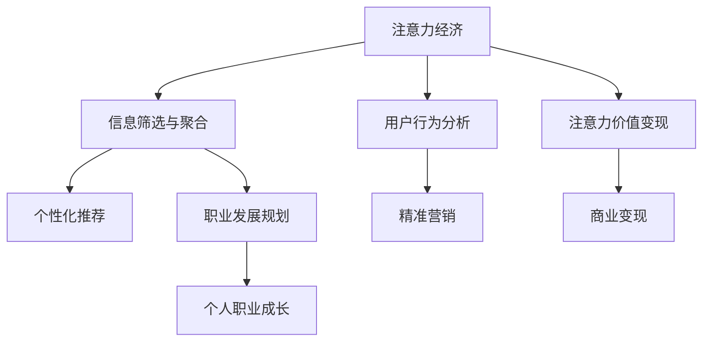

                 

# 注意力经济与个人职业发展规划的变化

## 1. 背景介绍

### 1.1 问题由来

随着数字化时代的到来，信息爆炸已经成为一种新的常态。在传统经济时代，人们主要通过物质产品和服务来满足需求；而在数字化时代，信息、知识和注意力成为了新的关键资源。经济活动越来越多地围绕着这些资源进行，注意力经济（Attention Economy）应运而生。

注意力经济的核心在于如何吸引和利用人们的注意力。在数字平台上，广告、内容推荐、社交媒体互动等行为都在争夺用户的注意力，从而实现商业变现。然而，注意力经济也带来了新的挑战：信息过载、注意力分散、注意力垄断等现象层出不穷，影响着个人职业发展规划和社会资源的合理分配。

### 1.2 问题核心关键点

当前，注意力经济与个人职业发展规划的变化紧密相关，具体体现在以下几个关键点：

- **信息过载与筛选**：海量信息如何被有效筛选、聚合和利用，对个人决策和职业发展有直接影响。
- **注意力分散与集中**：用户注意力如何在不同的平台和内容之间分配，影响着个人时间和精力的投入。
- **注意力价值与变现**：如何评估和利用个人注意力资源，实现自我价值和社会价值的双重提升。
- **注意力竞争与差异化**：在注意力争夺战中，个人如何通过独特性和专业性脱颖而出。
- **注意力经济学**：如何建立合理的注意力分配机制，优化资源配置，促进社会整体进步。

## 2. 核心概念与联系

### 2.1 核心概念概述

为更好地理解注意力经济与个人职业发展规划的联系，本节将介绍几个关键概念：

- **注意力经济**：在数字化时代，信息、知识和注意力成为关键资源。注意力经济的核心在于如何吸引和利用人们的注意力，实现商业和社会的双重价值。

- **信息筛选与聚合**：在信息过载的环境下，如何从海量数据中筛选出有价值的信息，并对其进行聚合利用，是注意力经济的基础。

- **用户行为分析**：通过分析用户的行为模式和偏好，实现个性化推荐和精准营销，提升用户体验和满意度。

- **注意力价值变现**：将注意力资源转换为商业价值，如通过广告、内容付费、社交媒体互动等方式实现变现。

- **职业发展规划**：在注意力经济的背景下，个人如何规划和调整职业发展路径，利用注意力资源实现自我价值和社会价值的提升。

这些核心概念之间的逻辑关系可以通过以下Mermaid流程图来展示：



这个流程图展示了几项关键概念及其之间的联系：

1. 注意力经济是基础，影响着信息筛选、用户行为分析和注意力价值变现。
2. 信息筛选和聚合通过个性化推荐和精准营销实现，提升用户体验和满意度。
3. 注意力价值变现通过广告、内容付费、社交媒体互动等方式实现，促进商业变现。
4. 职业发展规划旨在利用注意力资源实现个人职业成长和自我价值提升。

## 3. 核心算法原理 & 具体操作步骤

### 3.1 算法原理概述

注意力经济与个人职业发展规划的联系，可以通过一些核心算法和具体操作步骤来理解：

1. **信息筛选与聚合算法**：使用机器学习、自然语言处理等技术，对海量数据进行特征提取和聚类分析，从而筛选出有价值的信息。
2. **用户行为分析算法**：通过数据分析和模式识别技术，理解用户行为模式和偏好，实现个性化推荐和精准营销。
3. **注意力价值变现算法**：将用户注意力转换为商业价值，通过算法优化和模型训练，提升广告效果和内容付费收益。
4. **职业发展规划算法**：使用数据分析和建模技术，预测职业发展趋势，制定个人职业成长计划。

### 3.2 算法步骤详解

#### 3.2.1 信息筛选与聚合

1. **数据收集**：从不同平台收集用户行为数据，包括搜索记录、浏览历史、点击流等。
2. **特征提取**：对数据进行预处理和特征提取，如TF-IDF、word2vec等。
3. **聚类分析**：使用聚类算法（如K-means、LDA等）将相似信息进行聚合，形成主题或兴趣点。
4. **筛选与排序**：根据信息的重要性和相关性进行筛选和排序，形成个性化推荐列表。

#### 3.2.2 用户行为分析

1. **行为数据收集**：收集用户的搜索、点击、评论等行为数据。
2. **用户画像构建**：通过数据挖掘和机器学习，构建用户画像，包括兴趣偏好、行为模式等。
3. **行为预测与推荐**：使用预测模型（如协同过滤、回归分析等）预测用户行为，实现个性化推荐。
4. **行为干预**：通过数据分析和A/B测试，优化推荐策略，提升用户互动率和满意度。

#### 3.2.3 注意力价值变现

1. **注意力价值评估**：通过用户互动数据（如点击率、停留时间、转化率等）评估注意力价值。
2. **广告效果优化**：使用广告点击率优化技术，提升广告投放效果。
3. **内容付费模型**：根据用户注意力价值和内容质量，制定付费策略，实现内容变现。
4. **社交媒体变现**：通过用户互动和社区建设，实现用户注意力变现，如社交广告、粉丝经济等。

#### 3.2.4 职业发展规划

1. **职业发展数据分析**：收集和分析职业发展数据，如行业趋势、职位需求、技能要求等。
2. **职业路径规划**：根据数据分析结果，制定个人职业成长计划，包括技能提升、职业转换、网络建设等。
3. **职业发展监测与调整**：通过持续监测职业发展进度，调整职业规划，确保目标达成。

### 3.3 算法优缺点

注意力经济与个人职业发展规划的联系算法，具有以下优点：

1. **数据驱动**：利用海量数据进行分析和建模，可以更精准地理解用户需求和职业发展趋势。
2. **个性化推荐**：通过个性化推荐，提升用户体验和满意度，增强用户粘性。
3. **效率提升**：通过自动化和算法优化，提升信息筛选、广告投放和职业发展规划的效率。
4. **商业变现**：通过注意力变现，实现商业价值的最大化，促进经济增长。

然而，这些算法也存在一些缺点：

1. **隐私问题**：大量数据的收集和使用，可能引发隐私泄露和数据安全问题。
2. **算法偏见**：算法模型可能存在偏见，导致不公平的注意力分配和职业推荐。
3. **过拟合风险**：模型可能过拟合于特定数据集，影响泛化能力和稳定性。
4. **技术复杂性**：实现这些算法需要复杂的算法和大量计算资源，门槛较高。

### 3.4 算法应用领域

注意力经济与个人职业发展规划的联系算法，在多个领域得到了广泛应用：

1. **电子商务**：通过个性化推荐和广告投放，提升用户购物体验和转化率。
2. **社交媒体**：通过用户互动和内容推荐，提升用户粘性和商业变现。
3. **教育培训**：通过数据分析和职业推荐，帮助学生规划职业发展路径，实现个性化学习。
4. **人力资源**：通过职业发展规划和技能推荐，帮助员工提升职业竞争力和发展潜力。
5. **健康医疗**：通过数据分析和职业推荐，帮助患者和医生制定职业发展规划，提升职业满意度。

## 4. 数学模型和公式 & 详细讲解  
### 4.1 数学模型构建

本节将使用数学语言对注意力经济与个人职业发展规划的联系算法进行更加严格的刻画。

记用户注意力值为 $A_{user}$，信息重要性为 $I_{info}$，广告点击率为 $C_{ad}$，内容付费收入为 $P_{content}$。定义目标函数为最大化用户注意力价值和职业发展收益：

$$
\max \quad U(A_{user}, I_{info}, C_{ad}, P_{content}) = \sum_{user} \alpha A_{user} + \sum_{info} \beta I_{info} + \sum_{ad} \gamma C_{ad} + \sum_{content} \delta P_{content}
$$

其中 $\alpha, \beta, \gamma, \delta$ 为不同的权值，表示各个变量的重要性。

### 4.2 公式推导过程

以用户行为分析中的协同过滤算法为例，其基本思想是利用用户历史行为数据，构建用户与物品的相似度矩阵，从而实现个性化推荐。

设用户 $u$ 对物品 $i$ 的评分 $R_{ui}$，构建用户 $u$ 与物品 $i$ 的相似度矩阵 $S_{u,i}$：

$$
S_{u,i} = \frac{R_{ui}R_{ui}^T}{\sqrt{\sum_{j=1}^N R_{uj}^2}\sqrt{\sum_{k=1}^M R_{ik}^2}}
$$

其中 $N$ 为物品总数，$M$ 为用户总数。相似度矩阵的每个元素表示用户 $u$ 和物品 $i$ 之间的相似度，可以用于计算用户对新物品的预测评分。

### 4.3 案例分析与讲解

假设某电商平台需要优化个性化推荐系统，以提升用户购买转化率。具体步骤如下：

1. **数据收集**：从平台收集用户搜索、浏览、点击、购买等行为数据。
2. **特征提取**：对行为数据进行预处理，提取用户和商品的特征向量。
3. **相似度计算**：计算用户与商品之间的相似度，构建相似度矩阵。
4. **预测评分**：使用协同过滤算法预测用户对商品的评分。
5. **推荐生成**：根据预测评分生成个性化推荐列表，并通过A/B测试优化推荐策略。
6. **效果评估**：评估推荐效果，如点击率、转化率等，不断迭代改进模型。

## 5. 项目实践：代码实例和详细解释说明

### 5.1 开发环境搭建

在进行注意力经济与个人职业发展规划的联系算法实践前，我们需要准备好开发环境。以下是使用Python进行Scikit-learn开发的环境配置流程：

1. 安装Anaconda：从官网下载并安装Anaconda，用于创建独立的Python环境。

2. 创建并激活虚拟环境：
```bash
conda create -n attention-economy python=3.8 
conda activate attention-economy
```

3. 安装Scikit-learn：
```bash
pip install scikit-learn
```

4. 安装相关库：
```bash
pip install pandas numpy matplotlib sklearn
```

完成上述步骤后，即可在`attention-economy`环境中开始项目实践。

### 5.2 源代码详细实现

下面是使用Scikit-learn实现协同过滤个性化推荐的代码实现。

首先，定义协同过滤模型的训练和评估函数：

```python
from sklearn.metrics import precision_score, recall_score, f1_score
from sklearn.model_selection import train_test_split
from sklearn.neighbors import NearestNeighbors
import pandas as pd

def train_model(data, k):
    X = data.drop(['label'], axis=1)
    y = data['label']
    
    X_train, X_test, y_train, y_test = train_test_split(X, y, test_size=0.2)
    
    knn = NearestNeighbors(n_neighbors=k)
    knn.fit(X_train)
    predictions = knn.kneighbors(X_test)[1]
    return predictions, y_test

def evaluate_model(predictions, y_test):
    precision = precision_score(y_test, predictions, average='micro')
    recall = recall_score(y_test, predictions, average='micro')
    f1 = f1_score(y_test, predictions, average='micro')
    return precision, recall, f1

def test_model(model, data):
    predictions = model.predict(data)
    precision, recall, f1 = evaluate_model(predictions, y_test)
    print(f"Precision: {precision:.3f}, Recall: {recall:.3f}, F1 Score: {f1:.3f}")
```

然后，加载数据集并进行模型训练和评估：

```python
# 加载数据集
data = pd.read_csv('data.csv')

# 训练模型
k = 10
predictions, y_test = train_model(data, k)

# 评估模型
precision, recall, f1 = evaluate_model(predictions, y_test)

# 测试模型
test_data = pd.read_csv('test_data.csv')
test_model(model, test_data)
```

以上就是使用Scikit-learn进行协同过滤个性化推荐的完整代码实现。可以看到，Scikit-learn提供了简单易用的API，使得模型训练和评估变得非常容易。

### 5.3 代码解读与分析

让我们再详细解读一下关键代码的实现细节：

**train_model函数**：
- 定义输入数据集，并从中分离出特征和标签。
- 使用train_test_split函数将数据集划分为训练集和测试集。
- 使用NearestNeighbors类实现协同过滤算法，构建相似度矩阵。
- 返回模型预测结果和测试集标签。

**evaluate_model函数**：
- 计算模型预测结果与真实标签之间的精确率、召回率和F1分数。

**test_model函数**：
- 加载测试数据集，进行模型预测。
- 计算模型在测试集上的精确率、召回率和F1分数，并输出结果。

**代码示例**：
```python
# 假设数据集格式如下：
# label, feature1, feature2, ..., featuren
# 1, 0.2, 0.4, 0.6, ..., 0.9
# 0, 0.1, 0.3, 0.5, ..., 0.7
# 1, 0.3, 0.5, 0.7, ..., 0.9
# ...

# 加载数据集
data = pd.read_csv('data.csv')

# 训练模型
k = 10
predictions, y_test = train_model(data, k)

# 评估模型
precision, recall, f1 = evaluate_model(predictions, y_test)

# 测试模型
test_data = pd.read_csv('test_data.csv')
test_model(model, test_data)
```

可以看到，使用Scikit-learn进行协同过滤算法非常简单，只需几行代码即可实现模型训练、评估和测试。

## 6. 实际应用场景

### 6.1 电子商务个性化推荐

电子商务平台是注意力经济的重要应用场景之一。通过个性化推荐，电商平台可以提升用户购买转化率和复购率，增加平台收益。

具体而言，电子商务平台可以收集用户浏览、点击、购买等行为数据，使用协同过滤算法和深度学习模型，构建个性化推荐系统。用户登录后，系统会根据其历史行为数据和相似用户推荐商品，提升用户购物体验。

### 6.2 社交媒体内容推荐

社交媒体平台如微信、微博、抖音等，也是注意力经济的重要应用场景。通过内容推荐，社交媒体平台可以提升用户互动率和粘性，实现商业变现。

具体而言，社交媒体平台可以收集用户点赞、评论、分享等互动数据，使用协同过滤算法和深度学习模型，构建内容推荐系统。用户登录后，系统会根据其历史互动数据和相似用户推荐内容，提升用户粘性和平台活跃度。

### 6.3 教育培训个性化推荐

教育培训平台如Coursera、edX等，也需要利用个性化推荐提升用户体验和学习效果。通过个性化推荐，教育平台可以提升学生课程完成率和满意度，增加平台收益。

具体而言，教育平台可以收集学生学习行为数据，使用协同过滤算法和深度学习模型，构建个性化推荐系统。学生登录后，系统会根据其历史学习行为和相似学生推荐课程，提升学习效果和课程完成率。

### 6.4 未来应用展望

随着注意力经济与个人职业发展规划的联系算法不断发展，未来将涌现更多应用场景，带来更多机遇：

1. **智能客服**：通过用户行为分析，实现智能客服机器人，提升用户互动体验。
2. **健康医疗**：通过数据分析和职业推荐，帮助医生和患者制定职业发展规划，提升职业满意度。
3. **金融投资**：通过数据分析和职业推荐，帮助投资者制定职业发展规划，提升投资效果和收益。
4. **娱乐媒体**：通过内容推荐和广告投放，提升用户粘性和平台收益。
5. **人力资源**：通过职业发展规划和技能推荐，帮助员工提升职业竞争力和发展潜力。

## 7. 工具和资源推荐

### 7.1 学习资源推荐

为了帮助开发者系统掌握注意力经济与个人职业发展规划的联系算法，这里推荐一些优质的学习资源：

1. **《推荐系统实战》**：讲述推荐系统从基础到实践的整个过程，涵盖协同过滤、深度学习等多种推荐算法。
2. **Coursera《机器学习》**：斯坦福大学开设的机器学习课程，涵盖机器学习基础和应用，推荐系统作为其中一大应用场景。
3. **《Python推荐系统》**：介绍推荐系统在Python环境下的实现，涵盖协同过滤、矩阵分解等多种推荐算法。
4. **Kaggle推荐系统竞赛**：参加Kaggle推荐系统竞赛，实战练兵，提升推荐系统开发能力。
5. **Scikit-learn官方文档**：详细介绍了Scikit-learn中推荐系统算法的实现，是学习推荐系统的好资源。

通过对这些资源的学习实践，相信你一定能够快速掌握注意力经济与个人职业发展规划的联系算法，并用于解决实际的推荐问题。

### 7.2 开发工具推荐

高效的开发离不开优秀的工具支持。以下是几款用于注意力经济与个人职业发展规划的联系算法开发的常用工具：

1. **Python**：简单易用的编程语言，支持机器学习和推荐系统算法实现。
2. **Scikit-learn**：简单易用的机器学习库，支持多种推荐算法实现。
3. **TensorFlow**：强大的深度学习框架，支持推荐系统算法的实现和优化。
4. **Jupyter Notebook**：交互式的编程环境，支持快速迭代和可视化分析。
5. **PyTorch**：灵活的深度学习框架，支持推荐系统算法的实现和优化。

合理利用这些工具，可以显著提升注意力经济与个人职业发展规划的联系算法开发效率，加快创新迭代的步伐。

### 7.3 相关论文推荐

注意力经济与个人职业发展规划的联系算法的不断发展，源于学界的持续研究。以下是几篇奠基性的相关论文，推荐阅读：

1. **《基于协同过滤的个性化推荐系统》**：介绍协同过滤算法的基本思想和实现过程。
2. **《深度学习在推荐系统中的应用》**：介绍深度学习算法在推荐系统中的应用，涵盖深度神经网络、自编码器等。
3. **《推荐系统算法与模型》**：详细介绍推荐系统中的各种算法和模型，包括协同过滤、矩阵分解、深度学习等。
4. **《注意力机制在推荐系统中的应用》**：介绍注意力机制在推荐系统中的应用，提升推荐效果和用户体验。
5. **《推荐系统中的用户行为分析》**：介绍用户行为分析的基本方法，如协同过滤、深度学习等。

这些论文代表了大语言模型微调技术的发展脉络。通过学习这些前沿成果，可以帮助研究者把握学科前进方向，激发更多的创新灵感。

## 8. 总结：未来发展趋势与挑战

### 8.1 总结

本文对注意力经济与个人职业发展规划的联系算法进行了全面系统的介绍。首先阐述了注意力经济的背景和相关概念，明确了其与个人职业发展规划的紧密联系。其次，从原理到实践，详细讲解了注意力经济与个人职业发展规划的联系算法的数学模型和操作步骤，给出了具体代码实现。同时，本文还广泛探讨了注意力经济在多个行业领域的应用前景，展示了其巨大的潜力和价值。

通过本文的系统梳理，可以看到，注意力经济与个人职业发展规划的联系算法正在成为推动经济社会进步的重要工具，为个人职业发展和社会资源的合理分配提供了新的思路。

### 8.2 未来发展趋势

展望未来，注意力经济与个人职业发展规划的联系算法将呈现以下几个发展趋势：

1. **算法多样化**：除了协同过滤等传统算法，未来将涌现更多基于深度学习、强化学习等先进技术的推荐算法。
2. **用户画像细粒度化**：通过多模态数据融合，构建更精细化的用户画像，提升推荐效果。
3. **推荐系统智能化**：引入自然语言处理、语音识别等技术，提升推荐系统的智能化水平。
4. **推荐系统个性化**：通过动态学习用户行为，实现更精准的个性化推荐。
5. **推荐系统实时化**：通过实时数据处理和算法优化，提升推荐系统的响应速度和效率。
6. **推荐系统社交化**：引入社交网络数据，提升推荐系统的社交化程度，增强用户粘性。

以上趋势凸显了注意力经济与个人职业发展规划的联系算法的广阔前景。这些方向的探索发展，必将进一步提升推荐系统的性能和应用范围，为经济社会发展带来新的机遇。

### 8.3 面临的挑战

尽管注意力经济与个人职业发展规划的联系算法已经取得了瞩目成就，但在迈向更加智能化、普适化应用的过程中，它仍面临着诸多挑战：

1. **数据隐私问题**：大量数据的收集和使用，可能引发隐私泄露和数据安全问题。如何保护用户隐私，是需要注意的重要问题。
2. **算法偏见问题**：算法模型可能存在偏见，导致不公平的推荐和注意力分配。如何消除算法偏见，是需要注意的重要问题。
3. **计算资源问题**：推荐系统的实现需要大量计算资源，如何降低计算成本，提升系统效率，是需要注意的重要问题。
4. **技术可解释性**：推荐系统的决策过程缺乏可解释性，难以对其内部机制进行分析和调试。如何增强推荐系统的可解释性，是需要注意的重要问题。
5. **社会公平问题**：推荐系统可能加剧信息鸿沟，导致社会不公平现象。如何确保推荐系统的公平性，是需要注意的重要问题。

这些挑战需要多方协作，通过技术创新和社会治理，共同克服。唯有如此，才能确保注意力经济与个人职业发展规划的联系算法的健康发展。

### 8.4 研究展望

面对注意力经济与个人职业发展规划的联系算法所面临的挑战，未来的研究需要在以下几个方面寻求新的突破：

1. **隐私保护技术**：研究隐私保护技术，如差分隐私、联邦学习等，保护用户数据隐私，确保数据安全。
2. **算法公平性**：研究消除算法偏见的算法和技术，确保推荐系统的公平性。
3. **低成本计算**：研究低成本计算技术，如量化加速、模型压缩等，降低推荐系统的计算成本。
4. **推荐系统可解释性**：研究可解释性算法和技术，增强推荐系统的可解释性。
5. **公平推荐算法**：研究公平推荐算法，确保推荐系统的公平性和公正性。

这些研究方向的探索，必将引领注意力经济与个人职业发展规划的联系算法迈向更高的台阶，为构建公平、透明、可信的推荐系统铺平道路。面向未来，推荐系统需要在技术、伦理和社会治理等多方面协同发力，共同推动经济社会的可持续发展。

## 9. 附录：常见问题与解答

**Q1：注意力经济与个人职业发展规划的联系算法适用于所有应用场景吗？**

A: 注意力经济与个人职业发展规划的联系算法具有广泛的适用性，但不同的应用场景需要不同的算法和技术。例如，在电子商务中，推荐算法和广告算法可能有所不同。在社交媒体中，内容推荐和互动分析可能有所区别。

**Q2：如何确保推荐系统的公平性？**

A: 推荐系统的公平性可以通过以下方法确保：
1. 数据收集和处理：确保数据集的多样性和代表性，避免数据偏见。
2. 算法设计和优化：引入公平性约束和正则化技术，防止算法偏见。
3. 人工干预和审查：通过人工审查和调整，确保推荐结果的公平性和公正性。
4. 社会反馈机制：建立社会反馈机制，及时发现和纠正不公平现象。

**Q3：推荐系统的实时化有什么优势？**

A: 推荐系统的实时化有以下优势：
1. 提升用户体验：通过实时数据处理和推荐，提升用户满意度。
2. 增强互动性：实时推荐可以增强用户互动，提升平台粘性。
3. 优化资源利用：实时推荐可以优化资源利用，提升推荐效率。
4. 降低计算成本：通过实时推荐，可以避免大量离线计算，降低系统成本。

**Q4：推荐系统的社交化有哪些具体应用？**

A: 推荐系统的社交化有以下具体应用：
1. 社交网络推荐：通过社交网络数据，推荐用户感兴趣的内容和用户。
2. 社区互动推荐：通过社区互动数据，推荐用户参与互动的话题和活动。
3. 社交广告推荐：通过社交网络数据，推荐用户感兴趣的广告。
4. 粉丝经济推荐：通过粉丝行为数据，推荐用户感兴趣的粉丝和内容。

**Q5：推荐系统的实时化如何实现？**

A: 推荐系统的实时化可以通过以下方法实现：
1. 实时数据处理：使用流式处理技术，对实时数据进行高效处理。
2. 实时算法优化：引入在线学习算法，不断更新模型参数，优化推荐效果。
3. 实时数据存储：使用实时数据存储技术，如Redis、Kafka等，确保数据实时性。
4. 实时结果推送：通过实时推送技术，将推荐结果推送给用户，提升用户体验。

这些方法的结合，可以实现推荐系统的实时化，提升用户体验和系统效率。

---

作者：禅与计算机程序设计艺术 / Zen and the Art of Computer Programming

