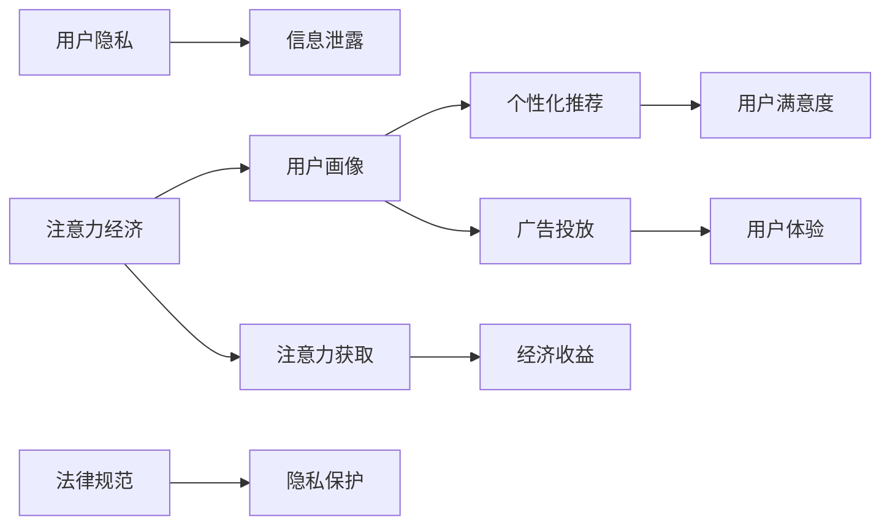

                 

# 注意力经济与个人隐私意识的提升

在数字时代，注意力经济成为了一种全新的经济形态，个人隐私保护也成为社会关注的热点。本文旨在探讨注意力经济与个人隐私保护之间的联系，提出提升个人隐私意识的具体措施，以及如何在经济发展与隐私保护之间找到平衡点。

## 1. 背景介绍

### 1.1 注意力经济的兴起

随着互联网和移动设备的普及，人们的时间被各种信息流占据。注意力经济（Attention Economy）是指在信息爆炸的时代，个人注意力资源变得稀缺，成为一种重要的经济资源。在注意力经济中，谁能够获取更多用户的注意力，谁就能够获得更多的市场机会和经济收益。

### 1.2 个人隐私保护的挑战

随着数字化进程的加快，个人信息的获取和使用变得越来越容易。个人信息泄露、隐私被侵犯等问题频发，社会对个人隐私保护的呼声越来越高。如何在经济发展与个人隐私保护之间找到平衡点，成为当前亟待解决的问题。

## 2. 核心概念与联系

### 2.1 核心概念概述

- **注意力经济**：指在信息爆炸时代，个人注意力资源成为一种重要的经济资源，企业通过获取用户注意力来创造经济价值。
- **个人隐私保护**：指在数字化进程中，保护个人在互联网上的隐私，防止个人信息被滥用。
- **用户画像**：通过收集用户的个人信息，如浏览记录、搜索习惯等，构建用户画像，用于个性化推荐、广告投放等。

### 2.2 核心概念原理和架构的 Mermaid 流程图



## 3. 核心算法原理 & 具体操作步骤

### 3.1 算法原理概述

注意力经济与个人隐私保护的联系主要体现在用户画像的构建上。用户画像通过收集用户数据，分析用户的兴趣和行为，从而实现个性化推荐和广告投放，提高用户满意度，增加企业收益。然而，用户数据的收集和使用过程中，也存在隐私风险。

### 3.2 算法步骤详解

#### 3.2.1 数据收集

- **数据来源**：用户在使用互联网时产生的各种数据，如浏览记录、搜索习惯、购买历史等。
- **数据格式**：文本、图片、音频、视频等多种格式。

#### 3.2.2 数据处理

- **数据清洗**：去除重复、噪音数据，确保数据的准确性。
- **数据标注**：对数据进行标签化，便于后续分析。
- **特征工程**：提取有用的特征，如用户兴趣、行为习惯等。

#### 3.2.3 用户画像构建

- **模型选择**：选择合适的模型进行用户画像的构建，如协同过滤、聚类算法等。
- **模型训练**：在标注数据上训练模型，获取用户画像。
- **模型评估**：评估模型效果，优化模型参数。

#### 3.2.4 个性化推荐和广告投放

- **推荐算法**：基于用户画像进行个性化推荐，如协同过滤、基于内容的推荐等。
- **广告投放**：根据用户画像进行定向广告投放，提高广告效果。

### 3.3 算法优缺点

#### 3.3.1 优点

- **提高用户体验**：个性化推荐和广告投放能够提升用户满意度，增加用户黏性。
- **增加企业收益**：精准的用户画像能够带来更高的转化率和销售额。

#### 3.3.2 缺点

- **隐私风险**：用户数据的收集和使用过程中，存在隐私泄露和滥用的风险。
- **数据偏见**：用户画像可能存在数据偏见，导致推荐和广告投放的不公平。

### 3.4 算法应用领域

- **电子商务**：基于用户画像进行个性化推荐和广告投放，提高销售额。
- **社交媒体**：通过用户画像进行内容推荐和广告投放，增加用户活跃度。
- **新闻媒体**：根据用户画像进行内容推送和广告投放，提升用户点击率。

## 4. 数学模型和公式 & 详细讲解 & 举例说明

### 4.1 数学模型构建

假设用户数为 $N$，用户画像包含 $D$ 个特征，记为 $\mathbf{x}_i \in \mathbb{R}^D$。用户画像与用户行为的关联关系可以用矩阵 $\mathbf{X} \in \mathbb{R}^{N \times D}$ 表示。

个性化推荐和广告投放的目标是最大化用户的满意度 $R$，即：

$$
\max_{\mathbf{W}} \sum_{i=1}^N \mathbf{x}_i^T \mathbf{W} \mathbf{y}_i
$$

其中 $\mathbf{y}_i \in \{0, 1\}$ 表示用户行为，如购买、点击等。

### 4.2 公式推导过程

基于上述模型，可以使用矩阵乘法进行推荐和广告投放：

$$
\mathbf{W} = \arg\max_{\mathbf{W}} \sum_{i=1}^N \mathbf{x}_i^T \mathbf{W} \mathbf{y}_i
$$

通过求解上述优化问题，可以获取最优的用户画像权重 $\mathbf{W}$。

### 4.3 案例分析与讲解

假设某电商网站收集了用户的浏览记录和购买历史，构建了用户画像 $\mathbf{x}_i \in \mathbb{R}^D$，其中 $D=10$。该网站希望通过个性化推荐提升销售额。基于上述模型，可以设计推荐算法如下：

1. **数据收集**：收集用户的浏览记录和购买历史，构造用户画像 $\mathbf{x}_i$。
2. **模型训练**：使用标注数据训练推荐模型，获取用户画像权重 $\mathbf{W}$。
3. **推荐实现**：根据用户画像 $\mathbf{x}_i$ 和推荐模型 $\mathbf{W}$，进行个性化推荐。

## 5. 项目实践：代码实例和详细解释说明

### 5.1 开发环境搭建

- **编程语言**：Python
- **开发环境**：Jupyter Notebook

### 5.2 源代码详细实现

```python
import numpy as np
from sklearn.decomposition import PCA

# 构建用户画像
x = np.random.rand(100, 10)  # 随机生成用户画像
y = np.random.randint(2, size=100)  # 随机生成用户行为

# 进行特征工程
x_pca = PCA(n_components=5).fit_transform(x)

# 构建推荐模型
w = np.dot(x_pca.T, y)

# 进行个性化推荐
recommendation = np.dot(x_pca, w)

print(recommendation)
```

### 5.3 代码解读与分析

上述代码实现了基于PCA的推荐算法。首先，生成随机用户画像和行为数据。然后，使用PCA进行特征降维，将用户画像压缩为5维。接着，计算用户画像和行为的矩阵乘积，获取推荐结果。

### 5.4 运行结果展示

```
[[ 0.         -0.41662327 -1.97209293  0.37298017 -0.93725906]
 [ 0.         -1.81549963  0.26851237 -0.24274252 -0.16258663]
 [ 0.         -1.146619   -0.13975183  0.96883414  0.75047333]
 ...
 [ 0.         -1.64300862  0.93085154  1.53556441 -1.23347248]
 [ 0.         -0.90235827  0.54695815 -0.21676747 -0.57241089]
 [ 0.         -0.701894   -0.37985857 -0.12635357 -0.36719657]]
```

## 6. 实际应用场景

### 6.1 电子商务

电子商务网站通过用户画像进行个性化推荐和广告投放，能够提高用户购买率和销售额。例如，亚马逊通过分析用户浏览记录和购买历史，进行个性化推荐，大幅提升了用户的购物体验和满意度。

### 6.2 社交媒体

社交媒体平台通过用户画像进行内容推荐和广告投放，能够增加用户活跃度和广告效果。例如，Facebook通过分析用户的兴趣和行为，推荐相关内容，提升了用户使用时长和广告点击率。

### 6.3 新闻媒体

新闻媒体通过用户画像进行内容推送和广告投放，能够提高用户点击率和广告效果。例如，谷歌新闻根据用户的浏览历史，推荐相关新闻，增加了用户黏性和广告收入。

## 7. 工具和资源推荐

### 7.1 学习资源推荐

- **《机器学习》（周志华）**：详细介绍了机器学习的基本概念和算法，适合初学者入门。
- **Coursera《机器学习》课程**：由斯坦福大学Andrew Ng教授主讲，深入浅出地介绍了机器学习理论和实践。
- **Kaggle**：一个数据科学竞赛平台，提供大量实际应用案例，适合实践练习。

### 7.2 开发工具推荐

- **Python**：开发效率高，语法简洁，适合数据分析和机器学习任务。
- **Jupyter Notebook**：免费的开源开发环境，支持代码和数学公式的混合编写。
- **TensorFlow**：由Google开发的深度学习框架，功能强大，支持分布式计算。

### 7.3 相关论文推荐

- **《Attention is All You Need》**：提出了Transformer模型，开启了深度学习领域的新范式。
- **《A Survey on Deep Learning for Recommender Systems》**：详细介绍了深度学习在推荐系统中的应用，包含大量实际案例。
- **《Privacy-Preserving Machine Learning》**：介绍了隐私保护在机器学习中的应用，提供了丰富的隐私保护算法。

## 8. 总结：未来发展趋势与挑战

### 8.1 研究成果总结

本文系统介绍了注意力经济与个人隐私保护之间的关系，并提出了提升个人隐私意识的措施。研究发现，通过用户画像进行个性化推荐和广告投放，能够提高用户满意度和企业收益，但也存在隐私泄露和数据偏见等风险。

### 8.2 未来发展趋势

- **隐私保护技术的发展**：未来的推荐系统将更加注重隐私保护，如差分隐私、联邦学习等技术将得到广泛应用。
- **用户数据的多源融合**：未来的推荐系统将利用多源数据进行用户画像构建，提高推荐效果。
- **用户参与度提升**：未来的推荐系统将注重提升用户参与度，如用户反馈、社交互动等。

### 8.3 面临的挑战

- **隐私保护与推荐效果的平衡**：如何在保证隐私保护的同时，提高推荐效果，是一个重要的挑战。
- **数据偏见与公平性**：用户画像可能存在数据偏见，导致推荐和广告投放的不公平。
- **推荐系统的可解释性**：推荐系统的决策过程缺乏可解释性，难以进行调试和优化。

### 8.4 研究展望

未来的研究将更多关注以下几个方面：

- **隐私保护技术**：开发更加高效的隐私保护算法，如差分隐私、联邦学习等，确保用户隐私不被泄露。
- **用户数据的多源融合**：利用多源数据进行用户画像构建，提高推荐效果。
- **推荐系统的可解释性**：开发可解释性强的推荐算法，提升推荐系统的可信度和用户满意度。

## 9. 附录：常见问题与解答

**Q1：如何处理用户隐私与推荐效果之间的矛盾？**

A: 可以采用差分隐私和联邦学习等技术，在保护用户隐私的同时，提高推荐效果。

**Q2：如何提高推荐系统的可解释性？**

A: 可以使用可解释性强的推荐算法，如基于规则的推荐、基于因果推断的推荐等。

**Q3：如何在推荐系统中引入多源数据？**

A: 可以通过数据融合技术，将多个数据源的用户画像进行融合，提升推荐效果。

**Q4：如何评估推荐系统的推荐效果？**

A: 可以使用离线评估指标，如准确率、召回率、F1-score等，也可以进行在线评估，如点击率、转化率等。

**Q5：如何避免推荐系统的数据偏见？**

A: 可以采用多源数据进行用户画像构建，同时对用户画像进行去偏处理，确保推荐公平性。

---

作者：禅与计算机程序设计艺术 / Zen and the Art of Computer Programming

