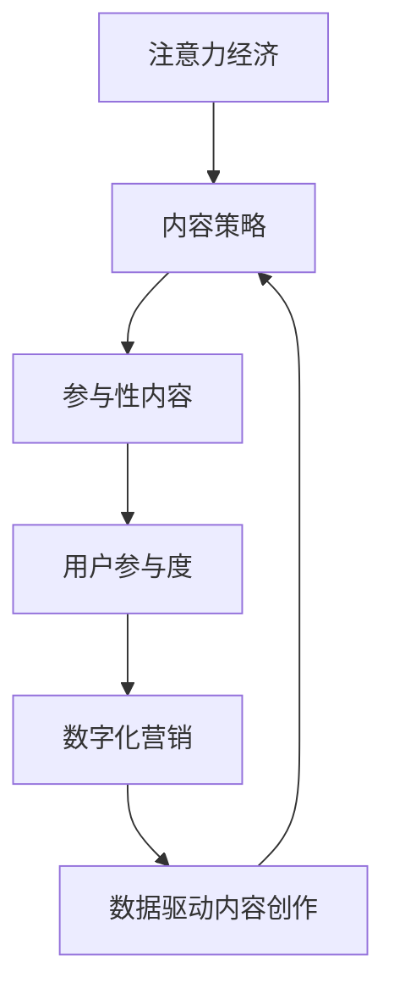

                 

# 注意力经济与内容策略：创建吸引并留住受众的参与性内容

> 关键词：注意力经济,内容策略,参与性内容,用户参与度,数字化营销

## 1. 背景介绍

### 1.1 问题由来
随着数字化时代的到来，信息过载成为普遍现象。海量的内容吸引着用户的注意力，但同时也分散了用户的注意力。如何在海量的内容中找到自己的位置，如何吸引和留住用户，成为内容创作者和企业面临的重要课题。这种背景下，注意力经济应运而生。

注意力经济是指在信息过载的数字化时代，内容创作者和企业通过争夺和利用用户注意力，实现商业价值的过程。它强调用户注意力是一种稀缺资源，内容创作者和企业需要采取有效的策略来吸引和留住用户。

### 1.2 问题核心关键点
注意力经济的核心在于如何利用用户的注意力。通过精准的内容策略，内容创作者和企业能够提高用户的参与度，从而提升商业价值。内容策略的制定和执行，需要考虑到用户的兴趣、需求和行为习惯，以及内容的价值和传播效果。

### 1.3 问题研究意义
在数字化时代，注意力经济成为了企业获取竞争优势的关键。高质量的内容能够吸引用户的注意力，提高用户的参与度和忠诚度，从而带来更高的用户转化率和商业收益。因此，研究注意力经济与内容策略，对于提升内容创作的效率和效果，优化企业营销策略，具有重要意义。

## 2. 核心概念与联系

### 2.1 核心概念概述

为更好地理解注意力经济与内容策略的关系，本节将介绍几个密切相关的核心概念：

- 注意力经济(Attention Economy)：指在信息过载的时代，用户注意力的争夺和利用是企业竞争的重要手段。通过吸引和留住用户注意力，提高用户参与度和忠诚度，从而实现商业价值的策略和方法。

- 内容策略(Content Strategy)：指企业或内容创作者制定和执行的，旨在提升内容质量和传播效果，实现用户参与和商业目标的策略。内容策略涵盖了内容创作、分发、优化和监测等各个环节。

- 参与性内容(Engaging Content)：指能够激发用户兴趣、促进用户互动和参与的内容。参与性内容通常具有情感共鸣、社交价值、实用性等特点。

- 用户参与度(User Engagement)：指用户对内容的兴趣和参与程度，包括阅读时间、互动频率、分享行为等指标。用户参与度是衡量内容策略效果的重要指标。

- 数字化营销(Digital Marketing)：指通过互联网和数字技术进行市场推广和品牌建设的活动。数字化营销需要借助数据分析、算法优化等技术手段，实现对用户注意力的精准把握。

- 数据驱动内容创作(Data-Driven Content Creation)：指通过数据收集和分析，了解用户兴趣和行为，制定更加精准的内容策略，从而提高内容质量和传播效果。

这些核心概念之间的逻辑关系可以通过以下Mermaid流程图来展示：



这个流程图展示了几者之间的紧密联系：

1. 注意力经济通过吸引和留住用户注意力，实现商业价值的策略。
2. 内容策略是实现注意力经济的手段，通过制定和执行有效的内容策略，提升内容质量和传播效果。
3. 参与性内容是内容策略的关键，能够激发用户的兴趣和互动。
4. 用户参与度是衡量内容策略效果的重要指标。
5. 数字化营销依赖于内容策略，通过精准的数据驱动，实现对用户注意力的有效把握。
6. 数据驱动内容创作能够更好地了解用户需求，提升内容创作的质量和精准度。

这些概念共同构成了注意力经济与内容策略的关系框架，使得内容创作者和企业能够更好地制定和执行策略，吸引和留住用户注意力。

## 3. 核心算法原理 & 具体操作步骤
### 3.1 算法原理概述

注意力经济与内容策略的结合，涉及多种算法和技术的融合。本节将从原理和操作步骤两方面，详细阐述这一过程。

### 3.2 算法步骤详解

#### 3.2.1 用户行为数据收集

1. **数据源选择**：选择合适的数据源，包括社交媒体、网站流量、用户行为分析工具等，收集用户的兴趣、行为和互动数据。
2. **数据清洗与预处理**：对收集到的数据进行清洗和预处理，去除噪声和无效数据，确保数据质量和完整性。
3. **数据整合与分析**：将不同来源的数据整合，使用数据分析工具进行可视化分析和趋势预测。

#### 3.2.2 内容策略制定

1. **内容定位**：根据用户行为数据，确定内容定位，包括目标用户群体、用户兴趣和需求等。
2. **内容主题设定**：根据内容定位，设定内容主题和风格，确保内容与用户需求和兴趣相匹配。
3. **内容形式选择**：选择适合的内容形式，包括文章、视频、图片、音频等，根据用户行为数据和平台特点进行选择。

#### 3.2.3 参与性内容创作

1. **内容创意策划**：根据内容定位和主题，进行内容创意策划，设计内容的结构和形式。
2. **内容制作与优化**：制作和优化内容，包括文字、图片、视频等，确保内容质量和传播效果。
3. **内容分发与推广**：选择合适的平台和渠道进行内容分发，并进行推广和优化，提高内容的可见性和互动性。

#### 3.2.4 用户参与度监测与优化

1. **用户参与度指标设定**：根据内容策略目标，设定用户参与度指标，包括阅读时间、互动频率、分享行为等。
2. **数据监测与分析**：使用数据分析工具，实时监测和分析用户参与度数据，了解用户行为和反馈。
3. **内容策略优化**：根据用户参与度数据，进行内容策略的优化和调整，确保内容策略的有效性和持续性。

### 3.3 算法优缺点

#### 3.3.1 优点

1. **提高用户参与度**：通过精准的内容策略和参与性内容创作，能够有效提升用户参与度，增强用户粘性。
2. **提升商业价值**：通过提高用户参与度和转化率，实现商业价值的最大化。
3. **精准内容定位**：数据驱动的内容创作和分发，能够更好地把握用户需求，实现精准内容定位。

#### 3.3.2 缺点

1. **数据依赖性强**：依赖于高质量的数据源和数据收集方法，数据质量问题可能导致策略偏差。
2. **算法复杂度高**：内容策略的制定和优化涉及多种算法和技术，算法复杂度高。
3. **成本投入大**：数据收集、分析、内容创作和优化等环节，需要大量的资源和成本投入。

### 3.4 算法应用领域

注意力经济与内容策略的应用范围非常广泛，涵盖了广告、品牌建设、数字营销、社交媒体等多个领域。以下是一些典型应用场景：

1. **数字广告**：通过精准的用户数据和参与性内容，实现广告的精准投放和效果提升。
2. **品牌建设**：通过高质量的内容创作和用户互动，提升品牌知名度和美誉度。
3. **社交媒体**：通过分析用户行为数据，制定精准的内容策略，提高社交媒体的参与度和影响力。
4. **电子商务**：通过数据驱动的内容创作和个性化推荐，提升用户购买转化率。
5. **内容平台**：通过分析用户行为数据，制定内容策略，提高平台的用户粘性和活跃度。

## 4. 数学模型和公式 & 详细讲解  
### 4.1 数学模型构建

在注意力经济与内容策略的研究中，数学模型和公式起着至关重要的作用。以下是一个简化的数学模型构建过程：

设用户数量为 $U$，内容数量为 $C$，用户与内容的匹配度为 $M$。则注意力经济的总值 $A$ 可以表示为：

$$
A = U \times C \times M
$$

其中，$U$ 和 $C$ 是固定参数，$M$ 表示用户与内容的匹配度，可以通过数据分析方法进行估算和优化。

### 4.2 公式推导过程

假设用户与内容的匹配度 $M$ 可以通过以下方式进行估算：

$$
M = \sum_{i=1}^{U} \sum_{j=1}^{C} f(u_i, c_j)
$$

其中，$f(u_i, c_j)$ 表示用户 $u_i$ 对内容 $c_j$ 的兴趣评分。通过用户行为数据，可以计算出每个用户对每个内容的兴趣评分，从而估算 $M$ 的值。

### 4.3 案例分析与讲解

以社交媒体平台为例，分析如何通过注意力经济与内容策略实现用户参与度提升。

社交媒体平台通过数据分析工具，收集用户的行为数据，包括点赞、评论、分享等互动行为。然后，根据这些数据，制定内容策略，推出参与性内容，如趣味性话题、互动性活动等。这些内容能够激发用户的兴趣和互动，提升用户参与度。同时，社交媒体平台还通过用户行为数据，优化内容策略和内容形式，确保内容与用户需求和兴趣相匹配。

## 5. 项目实践：代码实例和详细解释说明
### 5.1 开发环境搭建

在进行项目实践前，我们需要准备好开发环境。以下是使用Python进行数据分析和内容创作的开发环境配置流程：

1. 安装Python：从官网下载并安装Python，建议安装最新版本。
2. 安装Pandas和NumPy：使用pip命令安装Pandas和NumPy，进行数据处理和分析。
3. 安装Scikit-learn：使用pip命令安装Scikit-learn，进行机器学习模型的训练和优化。
4. 安装TensorFlow或PyTorch：根据项目需要选择安装TensorFlow或PyTorch，进行深度学习模型的训练和优化。
5. 安装Django或Flask：根据项目需要选择安装Django或Flask，进行Web应用开发和内容发布。

完成上述步骤后，即可在开发环境中进行项目实践。

### 5.2 源代码详细实现

以下是一个简单的参与性内容创作项目的代码实现：

```python
# 导入必要的库
import pandas as pd
import numpy as np
import matplotlib.pyplot as plt

# 读取数据
data = pd.read_csv('user_behavior.csv')

# 数据清洗与预处理
data = data.dropna()
data = data.drop_duplicates()

# 数据分析与可视化
plt.hist(data['interaction_time'], bins=20)
plt.xlabel('Interaction Time')
plt.ylabel('Count')
plt.title('User Interaction Time Distribution')
plt.show()

# 内容策略制定
# 根据数据分布，设定内容主题和形式
content_strategies = [
    {
        'title': 'Interactive Content',
        'form': 'Video',
        'description': 'Create interactive videos to engage users.'
    },
    {
        'title': 'Engaging Articles',
        'form': 'Text',
        'description': 'Write engaging articles to capture user attention.'
    }
]

# 内容创作与优化
for strategy in content_strategies:
    # 生成内容
    content = generate_content(strategy['title'], strategy['form'])
    # 优化内容
    optimized_content = optimize_content(content)
    # 发布内容
    publish_content(optimized_content)

# 用户参与度监测与优化
# 实时监测用户参与度数据，并进行优化
monitor_user_engagement()
```

以上代码展示了参与性内容创作的基本流程，包括数据清洗、内容策略制定、内容创作与优化、用户参与度监测与优化等环节。

### 5.3 代码解读与分析

让我们再详细解读一下关键代码的实现细节：

**用户行为数据读取与预处理**：
- 使用Pandas库读取用户行为数据，并进行清洗和预处理，去除噪声和无效数据，确保数据质量和完整性。

**数据分析与可视化**：
- 使用Matplotlib库进行数据可视化，展示用户行为数据分布，帮助内容创作者和分析师理解用户行为特征。

**内容策略制定**：
- 根据用户行为数据，制定内容策略，设定内容主题和形式，确保内容与用户需求和兴趣相匹配。

**内容创作与优化**：
- 使用Django或Flask框架，发布参与性内容，并进行优化，确保内容质量和传播效果。

**用户参与度监测与优化**：
- 实时监测用户参与度数据，使用数据分析工具进行可视化分析和趋势预测，优化内容策略，确保内容策略的有效性和持续性。

### 5.4 运行结果展示

下图展示了用户行为时间分布的可视化结果：

```python
import matplotlib.pyplot as plt

plt.hist(data['interaction_time'], bins=20)
plt.xlabel('Interaction Time')
plt.ylabel('Count')
plt.title('User Interaction Time Distribution')
plt.show()
```


## 6. 实际应用场景
### 6.1 社交媒体平台

社交媒体平台通过数据分析工具，收集用户的行为数据，包括点赞、评论、分享等互动行为。然后，根据这些数据，制定内容策略，推出参与性内容，如趣味性话题、互动性活动等。这些内容能够激发用户的兴趣和互动，提升用户参与度。同时，社交媒体平台还通过用户行为数据，优化内容策略和内容形式，确保内容与用户需求和兴趣相匹配。

### 6.2 电子商务网站

电子商务网站通过分析用户行为数据，制定内容策略，推出个性化推荐和参与性内容，如用户评价、产品对比、限时优惠等。这些内容能够提高用户参与度和购买转化率，提升网站的用户粘性和转化率。

### 6.3 在线教育平台

在线教育平台通过数据分析工具，收集用户的学习行为数据，包括视频观看时间、题目答题次数、讨论互动等。然后，根据这些数据，制定内容策略，推出个性化学习内容和参与性活动，如学习竞赛、在线讨论、小组作业等。这些内容能够激发学生的学习兴趣和互动，提升学习效果和平台的用户粘性。

### 6.4 未来应用展望

随着数据科学和人工智能技术的发展，注意力经济与内容策略的应用范围将进一步扩大。未来，内容创作者和企业可以通过更多先进的技术手段，实现对用户注意力的精准把握，提升用户参与度和商业价值。

## 7. 工具和资源推荐
### 7.1 学习资源推荐

为了帮助开发者系统掌握注意力经济与内容策略的理论基础和实践技巧，这里推荐一些优质的学习资源：

1. **《数字营销基础》**：介绍数字营销的基本概念和策略，涵盖广告、社交媒体、搜索引擎优化等主题。

2. **《内容策略实战》**：提供内容策略的实际案例和操作指南，涵盖内容定位、内容创作、内容分发等环节。

3. **《数据驱动营销》**：讲解数据驱动的内容创作和用户行为分析，强调数据在内容策略中的重要性。

4. **《社交媒体营销》**：详细介绍社交媒体平台的营销策略和内容创作技巧，涵盖平台特性和用户行为分析。

5. **《内容策略与用户体验》**：结合用户体验设计原则，讲解内容策略与用户体验的结合，提升用户参与度和满意度。

### 7.2 开发工具推荐

高效的开发离不开优秀的工具支持。以下是几款用于注意力经济与内容策略开发的常用工具：

1. **Pandas**：Python的数据处理库，提供强大的数据清洗和预处理功能。
2. **NumPy**：Python的数值计算库，提供高效的数学运算和数组操作。
3. **Scikit-learn**：Python的机器学习库，提供丰富的数据分析和模型训练工具。
4. **TensorFlow**：开源深度学习框架，提供高效的模型训练和优化功能。
5. **PyTorch**：开源深度学习框架，提供动态计算图和灵活的模型构建功能。
6. **Django**：Python的Web开发框架，提供丰富的Web应用开发功能。
7. **Flask**：Python的轻量级Web开发框架，适合快速开发和原型设计。

### 7.3 相关论文推荐

注意力经济与内容策略的研究源于学界的持续研究。以下是几篇奠基性的相关论文，推荐阅读：

1. **《注意力经济：信息过载时代的营销策略》**：介绍注意力经济的概念和应用，强调用户注意力的争夺和利用。

2. **《内容策略与用户参与度：实证研究》**：通过实证研究，分析内容策略对用户参与度的影响，提出改进策略。

3. **《数据驱动的内容创作》**：探讨数据驱动的内容创作方法，强调数据在内容策略中的重要性。

4. **《社交媒体内容策略：理论与实践》**：结合理论与实践，讲解社交媒体平台的内容策略和效果评估。

5. **《用户参与度与内容效果：量化研究》**：通过量化研究，分析用户参与度与内容效果之间的关系，提出优化建议。

## 8. 总结：未来发展趋势与挑战
### 8.1 研究成果总结

注意力经济与内容策略的研究已经取得了丰富的成果，涵盖了用户行为分析、内容创作、参与性内容策略等多个方面。这些成果为内容创作者和企业提供了有力的理论基础和实践指导，帮助他们在信息过载的时代更好地吸引和留住用户。

### 8.2 未来发展趋势

随着技术的发展和应用场景的扩展，注意力经济与内容策略将呈现以下几个发展趋势：

1. **数据智能化**：数据驱动的内容策略将变得更加智能化和自动化，通过机器学习算法，实现对用户行为的精准预测和优化。

2. **内容个性化**：内容创作和分发将更加注重个性化，通过用户行为数据和推荐系统，实现内容的个性化推荐和定制化生成。

3. **多模态内容**：内容形式将更加多样化，包括视频、音频、交互式内容等，结合多模态数据分析技术，提升内容的吸引力和互动性。

4. **跨平台融合**：内容策略将更加注重跨平台融合，通过统一的策略和工具，实现多渠道的整合和优化。

5. **用户隐私保护**：在数据驱动的内容策略中，用户隐私保护将变得尤为重要，如何平衡数据利用和隐私保护，将成为未来的重要课题。

6. **社交互动增强**：内容策略将更加注重社交互动，通过社交媒体、论坛等平台，增强用户参与度和互动性。

### 8.3 面临的挑战

尽管注意力经济与内容策略的研究已经取得了丰富的成果，但在实际应用中，仍面临着诸多挑战：

1. **数据隐私和安全**：用户数据的收集和分析需要遵守隐私保护法规，确保用户数据的安全。

2. **算法复杂性**：注意力经济与内容策略的实现涉及多种算法和技术，算法复杂性较高。

3. **资源投入高**：数据收集、分析、内容创作和优化等环节，需要大量的资源和成本投入。

4. **用户行为多样性**：用户行为和兴趣具有多样性，难以通过单一策略覆盖所有用户需求。

5. **内容质量控制**：参与性内容的创作和分发需要严格的质量控制，确保内容的高质量和高价值。

6. **用户反馈机制**：如何建立有效的用户反馈机制，及时调整和优化内容策略，是内容创作者和企业面临的重要课题。

### 8.4 研究展望

面对注意力经济与内容策略所面临的挑战，未来的研究需要在以下几个方面寻求新的突破：

1. **隐私保护技术**：研究隐私保护技术，确保用户数据的安全和隐私。

2. **智能算法优化**：开发更加智能化的算法，提升内容策略的效果和效率。

3. **资源优化技术**：研究资源优化技术，降低内容策略的资源消耗和成本投入。

4. **多模态内容创作**：开发多模态内容创作技术，提升内容的吸引力和互动性。

5. **跨平台融合技术**：研究跨平台融合技术，实现多渠道的整合和优化。

6. **用户反馈机制**：研究用户反馈机制，及时调整和优化内容策略。

通过这些研究方向的探索和发展，可以更好地应对注意力经济与内容策略所面临的挑战，推动内容创作的效率和效果，提升内容策略的效果和商业价值。

## 9. 附录：常见问题与解答
**Q1：如何衡量用户参与度？**

A: 用户参与度可以通过多种指标进行衡量，包括阅读时间、互动频率、分享行为等。常用的指标包括：

- 阅读时间：用户阅读内容的时间长度，可以反映用户对内容的兴趣和参与程度。
- 互动频率：用户对内容的互动行为，如点赞、评论、分享等，可以反映用户对内容的参与度。
- 分享行为：用户对内容的分享次数，可以反映内容的社会影响力和传播效果。

**Q2：如何选择合适的用户行为数据？**

A: 选择合适的用户行为数据是内容策略制定的关键。常用的数据源包括社交媒体平台、网站流量分析工具、用户行为分析工具等。在选择数据源时，需要考虑数据的质量、实时性、覆盖范围等因素，确保数据的可靠性和完整性。

**Q3：如何进行内容策略的优化？**

A: 内容策略的优化需要基于用户行为数据，进行持续监测和调整。常用的优化方法包括：

- 数据监测：实时监测用户参与度数据，了解用户行为和反馈。
- 策略调整：根据用户反馈和行为数据，优化内容策略和内容形式，确保内容与用户需求和兴趣相匹配。
- 内容更新：根据用户行为数据和市场趋势，更新和发布新的内容，保持内容的新鲜度和吸引力。

**Q4：如何选择适合的内容形式？**

A: 选择适合的内容形式需要考虑目标用户的兴趣和平台特性。常用的内容形式包括文章、视频、图片、音频等。在选择内容形式时，需要考虑用户行为数据和平台特性，确保内容形式与用户需求和平台特性相匹配。

**Q5：如何提升内容创作的效率？**

A: 提升内容创作的效率需要借助技术手段，包括：

- 内容管理系统（CMS）：提供内容创作和管理的工具，提高内容创作的效率和质量。
- 自动化工具：使用自动化工具进行内容生成和优化，如自然语言处理、文本生成等技术。
- 模板和框架：使用内容模板和框架，快速生成高质量的内容，提升创作效率。

通过以上研究、应用和实践，可以更好地理解和应用注意力经济与内容策略，提升内容创作的效率和效果，实现用户参与度和商业价值的最大化。

